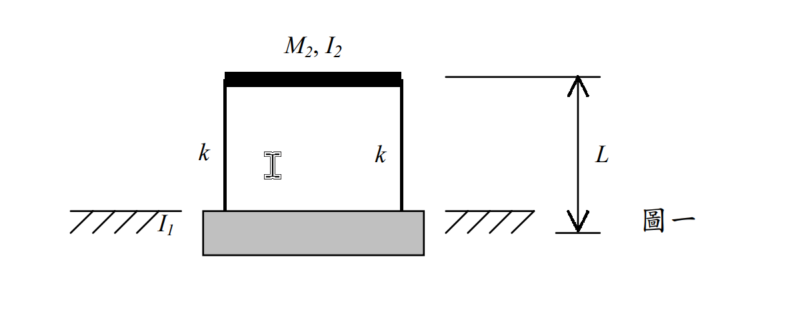

# 考題編號：SD-2002-1

**主分類：** `SD-U1` 結構動力學基礎
**副分類：** `SD-U1-3` 多自由度系統動態分析
**分析方法：** MDOF 特徵值分析（柔性基座 SSI 模型）
**標籤：** `柔性基座` `土壤結構互制` `SSI` `旋轉彈簧` `特徵值問題` `自然頻率` `振態` `軸向剛性柱` `2DOF`

---

## 1. 原始題目重述 (Problem Restatement)

一單層房屋（剪力構架），基座可繞其質心旋轉（不得水平或垂直位移），土壤旋轉彈簧勁度 $k_\theta$，樓版以兩根柱（每根側向勁度 $k$）支撐於基座。

*圖說：基座質心旋轉彈簧 $k_\theta = 1.2 \times 10^7\ \text{kN-m/rad}$；基座轉動慣量 $I_1 = 8000\ \text{Ton-m}^2$；樓版質量 $M_2 = 100\ \text{Ton}$，樓版轉動慣量 $I_2 = 4000\ \text{Ton-m}^2$；樓版質心至基座質心距離 $L = 3\ \text{m}$；每根柱側向勁度 $k = 3 \times 10^4\ \text{kN/m}$（共兩根）。*

**已知條件：**

| 符號 | 數值 | 說明 |
|------|------|------|
| $k_\theta$ | $1.2 \times 10^7\ \text{kN-m/rad}$ | 基座土壤旋轉彈簧勁度 |
| $I_1$ | $8000\ \text{Ton-m}^2$ | 基座轉動慣量（繞基座質心） |
| $M_2$ | $100\ \text{Ton}$ | 樓版質量 |
| $I_2$ | $4000\ \text{Ton-m}^2$ | 樓版轉動慣量 |
| $L$ | $3\ \text{m}$ | 樓版質心至基座質心距離 |
| $k$ | $3 \times 10^4\ \text{kN/m}$ | 每根柱側向勁度 |

**基座約束：** 僅可繞基座質心旋轉（無水平、垂直位移）

**忽略：** 柱的軸向變形（柱為軸向剛性）

**求：** 系統自然頻率與振態

---

## 2. 考題核心精神與出題者意圖 (Core Concepts & Examiner's Intent)

**核心觀念：** 土壤-結構互制（SSI）問題——基礎不再固定，基座的旋轉自由度引入額外的彈性與慣性，改變整體動力特性。

**出題意圖：**
1. 考驗「正確識別自由度」的能力——軸向剛性柱的約束使樓版旋轉角等於基座旋轉角（$\theta_2 = \theta_1$），進而使 $I_2$ 出現在質量矩陣。
2. 測試能否正確建立 Lagrangian、導出耦合質量矩陣（非對角線為零）與耦合勁度矩陣（非對角線不為零）。
3. 考驗特徵值問題的手算能力。

**關鍵陷阱：** 若忽略 $I_2$（誤用純剪力構架假設，以為樓版不旋轉），質量矩陣 $M_{11}$ 只取 $I_1 = 8000$，將得到錯誤答案。軸向剛性柱的約束正是要使 $\theta_2 = \theta_1$，讓 $I_2$ 也貢獻至旋轉慣量。

---

## 3. 解題戰略地圖與陷阱分析 (Strategic Roadmap & Trap Analysis)

**作戰計畫（5步）：**
1. 識別自由度：基座 $\theta_1$、樓版 $u_2$（水平）；柱軸向剛性 → $\theta_2 = \theta_1$
2. 寫出動能 $T$（含 $I_2$）與位能 $V$（柱變形量 = $u_2 - L\theta_1$）
3. 用 Lagrange 方程導出 $[M]\{\ddot{q}\} + [K]\{q\} = 0$
4. 解特徵方程（$\det([K] - \omega^2[M]) = 0$）→ 得 $\omega_1^2, \omega_2^2$
5. 代回求振態 $\{1,\ \phi_{2n}\}$

**陷阱分析：**

| # | 陷阱 | 應對 |
|---|------|------|
| ⚠ | 忽略軸向剛性約束 → $\theta_2 \neq \theta_1$ → $I_2$ 消失 | 牢記「軸向剛性 + 對稱兩柱 → 樓版旋轉 = 基座旋轉」 |
| ⚠ | 柱變形量寫成 $u_2$（絕對位移）而非 $u_2 - L\theta_1$（相對位移） | 柱變形 = 樓版絕對位移 − 基座旋轉造成的剛體位移 $L\theta_1$ |
| ⚠ | $K_{12}$ 符號錯誤（+$2kL$ 而非 $-2kL$） | 從 $\partial V/\partial \theta_1$ 展開即可確認符號 |
| ⚠ | 特徵多項式係數算錯（$7.2 \times 10^{11}$ 項忘減 $K_{12}^2$） | det展開時分開計算對角積與耦合項平方，再相減 |

---

## 3.5 變數層次分析 (Variable Hierarchy Analysis)

> 複習提示：第一次解題後，在每個卡住的知識點旁標記 `⚠`；第二次複習時只看有 `⚠` 的項目。

### 最終目標
求 2-DOF 柔性基座系統的兩個自然頻率 $\omega_1, \omega_2$ 及對應振態 $\{\phi\}_1, \{\phi\}_2$。

### 本題關鍵公式（依計算順序）

$$\text{Step 1（約束）：} \theta_2 = \theta_1 \quad (\text{軸向剛性柱})$$

$$\text{Step 2（動能）：} T = \frac{1}{2}(I_1+I_2)\dot{\theta}_1^2 + \frac{1}{2}M_2\dot{u}_2^2$$

$$\text{Step 3（柱變形）：} \Delta = u_2 - L\theta_1$$

$$\text{Step 4（位能）：} V = \frac{1}{2}k_\theta\theta_1^2 + \frac{1}{2}(2k)\Delta^2$$

$$\text{Step 5（勁度矩陣）：} [K] = \begin{bmatrix} k_\theta + 2kL^2 & -2kL \\ -2kL & 2k \end{bmatrix}$$

$$\text{Step 6（特徵方程）：} \det\!\left([K] - \omega^2[M]\right) = 0 \implies \omega^4 - \boxed{\left(\frac{K_{11}}{I_1+I_2}+\frac{K_{22}}{M_2}\right)}\omega^2 + \frac{\det[K]}{(I_1+I_2)M_2} = 0$$

$$\text{Step 7（振態）：} \frac{u_2}{\theta_1} = \frac{\boxed{K_{11}} - \omega_n^2(I_1+I_2)}{2kL}$$

### L1：題目直接給定

| 符號 | 數值 | 說明 |
|------|------|------|
| $k_\theta$ | $1.2 \times 10^7\ \text{kN-m}$ | 基座旋轉彈簧勁度 |
| $I_1$ | $8000\ \text{Ton-m}^2$ | 基座轉動慣量 |
| $I_2$ | $4000\ \text{Ton-m}^2$ | 樓版轉動慣量 |
| $M_2$ | $100\ \text{Ton}$ | 樓版質量 |
| $L$ | $3\ \text{m}$ | 質心距 |
| $k$ | $3 \times 10^4\ \text{kN/m}$ | 每根柱勁度 |

### L2：需知識點推導

**【自由度識別與約束】**

| 符號 | 公式／來源 | 卡關? |
|------|-----------|-------|
| $\theta_2 = \theta_1$ | 軸向剛性柱＋對稱配置 → 樓版旋轉角 = 基座旋轉角 | |
| $\Delta = u_2 - L\theta_1$ | 柱變形 = 樓版絕對位移 − 基座旋轉剛體位移 | |

**【矩陣元素】**

| 符號 | 公式／來源 | 卡關? |
|------|-----------|-------|
| $M_{11} = I_1+I_2$ | 旋轉 DOF 的等效慣量（含基座與樓版） | |
| $M_{22} = M_2$ | 平移 DOF 的慣量 | |
| $K_{11} = k_\theta + 2kL^2$ | $\partial^2 V/\partial\theta_1^2$，含旋轉彈簧 + 柱力臂效應 | |
| $K_{12} = -2kL$ | $\partial^2 V/\partial\theta_1\partial u_2$ | |
| $K_{22} = 2k$ | $\partial^2 V/\partial u_2^2$，兩柱並聯 | |

**【特徵方程與求解】**

| 符號 | 公式／來源 | 卡關? |
|------|-----------|-------|
| $a = M_{11}M_{22}$ | 特徵多項式 $\omega^4$ 係數 | |
| $b = -(K_{11}M_{22}+K_{22}M_{11})$ | 特徵多項式 $\omega^2$ 係數 | |
| $c = K_{11}K_{22}-K_{12}^2$ | 特徵多項式常數項 | |
| $\omega_{1,2}^2 = (-b \pm \sqrt{b^2-4ac})/(2a)$ | 二次公式 | |

### L3：深層知識（不懂就卡住）

| 知識點 | 說明 | 卡關? |
|--------|------|-------|
| 軸向剛性約束的幾何意義 | 兩根對稱的軸向剛性柱，迫使樓版旋轉角 = 基座旋轉角；否則柱長會改變 | |
| Lagrange 方程使用條件 | 廣義座標 $\{q\} = \{\theta_1, u_2\}$；$T, V$ 對 $q_i, \dot{q}_i$ 取偏微分 | |
| 柱的「剛體位移」vs「變形」 | 基座旋轉時，柱隨之傾斜（剛體），樓版再有 $u_2$ 才是真正的柱側向變形 = $u_2 - L\theta_1$ | |
| $I_2$ 進入方程的條件 | 樓版有旋轉 → $I_2\dot{\theta}_2^2/2$ → 本題 $\theta_2=\theta_1$，故 $I_2$ 合入 $M_{11}$ | |

---

## 4. 步驟化詳細計算過程 (Step-by-Step Detailed Calculation)

### Step 1：識別廣義座標與動力學約束

系統廣義座標：
$$\{q\} = \begin{Bmatrix} q_1 \\ q_2 \end{Bmatrix} = \begin{Bmatrix} \theta_1 \\ u_2 \end{Bmatrix}$$

$\theta_1$：基座旋轉角（CCW 正）；$u_2$：樓版質心絕對水平位移

**軸向剛性約束推導：**
對稱兩柱（間距 $\pm a$），柱軸向剛性 → 右柱頂端垂直位移 = 右柱底端垂直位移。基座旋轉 $\theta_1$ 時，右柱底端垂直位移 $= +a\theta_1$；故樓版右側也上升 $a\theta_1$，即樓版旋轉角 $\theta_2 = \theta_1$。

$$\boxed{\theta_2 = \theta_1}$$

### Step 2：建立動能 $T$ 與位能 $V$

**動能：**
$$T = \underbrace{\frac{1}{2}I_1\dot{\theta}_1^2}_{\text{基座}} + \underbrace{\frac{1}{2}M_2\dot{u}_2^2}_{\text{樓版平移}} + \underbrace{\frac{1}{2}I_2\dot{\theta}_2^2}_{\text{樓版旋轉}} = \frac{1}{2}(I_1+I_2)\dot{\theta}_1^2 + \frac{1}{2}M_2\dot{u}_2^2$$

**柱側向變形量**（= 樓版絕對位移 − 基座旋轉造成的剛體位移）：
$$\Delta = u_2 - L\theta_1$$

**位能：**
$$V = \frac{1}{2}k_\theta\theta_1^2 + \frac{1}{2}(2k)\Delta^2 = \frac{1}{2}k_\theta\theta_1^2 + k(u_2 - L\theta_1)^2$$

### Step 3：Lagrange 方程 → 運動方程

$$\frac{d}{dt}\!\left(\frac{\partial T}{\partial \dot{q}_i}\right) - \frac{\partial T}{\partial q_i} + \frac{\partial V}{\partial q_i} = 0$$

**對 $\theta_1$：**
$$\frac{\partial V}{\partial \theta_1} = k_\theta\theta_1 + 2k(u_2-L\theta_1)(-L) = (k_\theta + 2kL^2)\theta_1 - 2kLu_2$$

$$(I_1+I_2)\ddot{\theta}_1 + (k_\theta + 2kL^2)\theta_1 - 2kLu_2 = 0$$

**對 $u_2$：**
$$\frac{\partial V}{\partial u_2} = 2k(u_2-L\theta_1) = 2ku_2 - 2kL\theta_1$$

$$M_2\ddot{u}_2 - 2kL\theta_1 + 2ku_2 = 0$$

### Step 4：矩陣形式

$$[M]\{\ddot{q}\} + [K]\{q\} = \{0\}$$

$$[M] = \begin{bmatrix} I_1+I_2 & 0 \\ 0 & M_2 \end{bmatrix} = \begin{bmatrix} 12000 & 0 \\ 0 & 100 \end{bmatrix} \text{ Ton-m}^2,\ \text{Ton}$$

$$[K] = \begin{bmatrix} k_\theta + 2kL^2 & -2kL \\ -2kL & 2k \end{bmatrix}$$

數值代入：
$$2k = 2 \times 3 \times 10^4 = 6 \times 10^4\ \text{kN/m}$$
$$2kL = 6 \times 10^4 \times 3 = 1.8 \times 10^5\ \text{kN}$$
$$2kL^2 = 1.8 \times 10^5 \times 3 = 5.4 \times 10^5\ \text{kN-m}$$
$$K_{11} = 1.2 \times 10^7 + 5.4 \times 10^5 = 1.254 \times 10^7\ \text{kN-m}$$

$$[K] = \begin{bmatrix} 1.254 \times 10^7 & -1.8 \times 10^5 \\ -1.8 \times 10^5 & 6 \times 10^4 \end{bmatrix}$$

### Step 5：特徵值問題

令 $\{q\} = \{\phi\}e^{i\omega t}$，代入得：

$$\det([K] - \omega^2[M]) = 0$$

$$(K_{11} - \omega^2 M_{11})(K_{22} - \omega^2 M_{22}) - K_{12}^2 = 0$$

展開：

$$M_{11}M_{22}\omega^4 - (K_{11}M_{22} + K_{22}M_{11})\omega^2 + (K_{11}K_{22} - K_{12}^2) = 0$$

$$1.2 \times 10^6\,\omega^4 - (1.254 \times 10^7 \times 100 + 6 \times 10^4 \times 12000)\,\omega^2 + (1.254 \times 10^7 \times 6 \times 10^4 - (1.8 \times 10^5)^2) = 0$$

各項係數：
$$\text{係數}_{\omega^4}: 1.2 \times 10^6$$
$$\text{係數}_{\omega^2}: -(1.254 \times 10^9 + 7.2 \times 10^8) = -1.974 \times 10^9$$
$$\text{常數}: 7.524 \times 10^{11} - 3.24 \times 10^{10} = 7.2 \times 10^{11}$$

除以 $1.2 \times 10^6$：

$$\omega^4 - 1645\,\omega^2 + 6 \times 10^5 = 0$$

### Step 6：求解二次方程

令 $\lambda = \omega^2$：

$$\lambda^2 - 1645\lambda + 6 \times 10^5 = 0$$

$$\lambda = \frac{1645 \pm \sqrt{1645^2 - 4 \times 6 \times 10^5}}{2} = \frac{1645 \pm \sqrt{2706025 - 2400000}}{2} = \frac{1645 \pm \sqrt{306025}}{2}$$

$$\sqrt{306025} \approx 553.2$$

$$\lambda_1 = \frac{1645 - 553.2}{2} = \frac{1091.8}{2} \approx 545.9\ \text{rad}^2/\text{s}^2$$

$$\lambda_2 = \frac{1645 + 553.2}{2} = \frac{2198.2}{2} \approx 1099.1\ \text{rad}^2/\text{s}^2$$

**驗算：** $\lambda_1 + \lambda_2 = 1645$ ✓；$\lambda_1 \times \lambda_2 \approx 6 \times 10^5$ ✓

$$\boxed{\omega_1 = \sqrt{545.9} \approx 23.4\ \text{rad/s}}, \quad T_1 = \frac{2\pi}{23.4} \approx 0.269\ \text{s}$$

$$\boxed{\omega_2 = \sqrt{1099.1} \approx 33.2\ \text{rad/s}}, \quad T_2 = \frac{2\pi}{33.2} \approx 0.189\ \text{s}$$

### Step 7：求振態

由第二方程 $-1.8 \times 10^5\,\phi_1 + (6 \times 10^4 - 100\omega_n^2)\phi_2 = 0$，令 $\phi_1 = 1\ \text{rad}$：

**振態 1**（$\omega_1^2 = 545.9$）：
$$(60000 - 545.9 \times 100)\phi_{21} = 1.8 \times 10^5$$
$$(60000 - 54590)\phi_{21} = 180000$$
$$5410\,\phi_{21} = 180000 \implies \phi_{21} = \frac{180000}{5410} \approx 33.3\ \text{m/rad}$$

$$\boxed{\{\phi\}_1 = \begin{Bmatrix} 1\ \text{rad} \\ 33.3\ \text{m} \end{Bmatrix}}$$

**振態 2**（$\omega_2^2 = 1099.1$）：
$$(60000 - 1099.1 \times 100)\phi_{22} = 1.8 \times 10^5$$
$$(60000 - 109910)\phi_{22} = 180000$$
$$-49910\,\phi_{22} = 180000 \implies \phi_{22} = \frac{180000}{-49910} \approx -3.61\ \text{m/rad}$$

$$\boxed{\{\phi\}_2 = \begin{Bmatrix} 1\ \text{rad} \\ -3.61\ \text{m} \end{Bmatrix}}$$

### 結果彙整

| 振態 | $\omega_n$ (rad/s) | $T_n$ (s) | $\theta_1$ | $u_2$ | 物理意義 |
|-----|-------------------|----------|-----------|-------|---------|
| 1 | 23.4 | 0.269 | 1 rad | +33.3 m | 基座旋轉，樓版大幅同向平移（側移主導） |
| 2 | 33.2 | 0.189 | 1 rad | −3.61 m | 基座旋轉，樓版反向平移（搖擺主導） |

**無耦合自然頻率（驗算）：**
- 旋轉 DOF 單獨：$\omega_\theta = \sqrt{k_\theta/(I_1+I_2)} = \sqrt{1.2\times10^7/12000} = \sqrt{1000} \approx 31.6\ \text{rad/s}$
- 平移 DOF 單獨：$\omega_f = \sqrt{2k/M_2} = \sqrt{6\times10^4/100} = \sqrt{600} \approx 24.5\ \text{rad/s}$

耦合使頻率分叉：$\omega_1 < 24.5 < 31.6 < \omega_2$ ✓（耦合使頻率向外擴展）

---

## 5. 關鍵爭議點與進階探討 (Critical Issues & Advanced Discussion)

**爭議：I₂ 是否應包含？**

本題關鍵在軸向剛性柱的幾何約束：$\theta_2 = \theta_1$。若題目未明確說明「忽略軸向變形」，可能有兩種解讀：
- **包含 $I_2$（本解）：** 軸向剛性 → $\theta_2 = \theta_1$ → $M_{11} = I_1 + I_2 = 12000$
- **不含 $I_2$（剪力建築假設）：** 樓版不旋轉 → $M_{11} = I_1 = 8000$

本題明確說明「不考慮柱軸向變形」，故應包含 $I_2$。考場上若有疑義，說明假設即可。

**SSI（土壤-結構互制）的實務意義：**
柔性基礎使有效週期延長（$T_1 = 0.269\ \text{s}$ vs 純固定基礎），通常有利於降低加速度反應，但可能增大位移，需注意與鄰近結構的撞擊問題。
