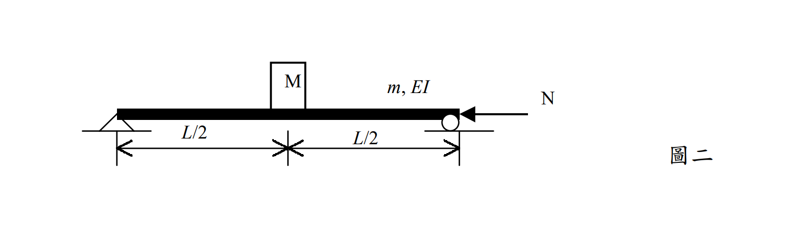

# 考題編號：SD-2002-2

**主分類：** `SD-U1` 結構動力學基礎
**副分類：** `SD-U1-3` 多自由度系統動態分析及應用
**分析方法：** Rayleigh-Ritz 法（廣義質量/勁度、幾何勁度）
**標籤：** `Rayleigh法` `廣義座標` `廣義質量` `廣義勁度` `幾何勁度` `軸壓效應` `Euler挫屈` `週期-軸壓關係` `假設振型`

---

## 1. 原始題目重述 (Problem Restatement)

一均勻簡支梁，長度 $L$，單位長度質量 $m$，彎曲剛度 $EI$，跨中（$x = L/2$）另有集中質量 $M$，右端作用軸向壓力 $N$。

*圖說：左端鉸支座，右端滾支座；梁參數 $m$（單位長度質量）、$EI$（彎曲剛度）；跨中集中質量 $M$ 置於 $x = L/2$；右端軸向壓力 $N$（壓力為正）。*

**假設振型：** $\phi(x) = \sin\!\left(\dfrac{\pi x}{L}\right)$

**求：**
1. 廣義質量 $m^*$
2. 廣義勁度 $k^*$（含軸壓效應）
3. 臨界挫屈荷重 $N_{cr}$
4. 自然週期 $T$ 與 $N/N_{cr}$ 之關係式

---

## 2. 考題核心精神與出題者意圖 (Core Concepts & Examiner's Intent)

**核心觀念：** 軸向壓力的存在使結構剛度降低（負幾何勁度 $k_g$），導致自然頻率下降、週期延長，最終在 $N = N_{cr}$ 時頻率降至零（結構挫屈）。

**出題意圖：**
1. 考驗 Rayleigh-Ritz 法的操作：廣義質量 = 積分 $\int m\phi^2 dx + M\phi^2(L/2)$，廣義勁度含兩項（彎曲＋幾何）。
2. 測試能否認識到「當假設振型為精確模態時，Rayleigh 法給出精確的 $N_{cr}$」。
3. 建立「週期-軸壓」關係的物理直覺：$T = T_0/\sqrt{1-N/N_{cr}}$，是考試常考的核心公式。

**精華：** 假設振型 $\sin(\pi x/L)$ 恰好是簡支梁的精確第一振型，因此算出的 $N_{cr}$ 是 Euler 挫屈荷重的精確值。

---

## 3. 解題戰略地圖與陷阱分析 (Strategic Roadmap & Trap Analysis)

**作戰計畫（5步）：**
1. 計算 $\phi(L/2)$，以及三個積分：$\int\phi^2 dx$、$\int(\phi')^2 dx$、$\int(\phi'')^2 dx$
2. 廣義質量 $m^* = \int_0^L m\phi^2 dx + M\phi^2(L/2)$
3. 廣義勁度 $k^* = EI\int_0^L(\phi'')^2 dx - N\int_0^L(\phi')^2 dx$
4. 令 $k^* = 0$ → 求 $N_{cr}$
5. 以 $N_{cr}$ 改寫 $k^*$ → 建立 $T = T_0/\sqrt{1-N/N_{cr}}$

**陷阱分析：**

| # | 陷阱 | 應對 |
|---|------|------|
| ⚠ | 廣義勁度只寫彎曲項，忘記幾何勁度 $-N\int(\phi')^2 dx$ | 有軸壓就一定有負幾何勁度 |
| ⚠ | 幾何勁度符號搞錯（壓力取負，但有學生多加一個負號） | $V_{geo} = N\int(\phi')^2 dz/2$（壓力正定義），代入 EOM 時出現負項 |
| ⚠ | $\int_0^L \sin^2(\pi x/L)dx$ 或 $\int_0^L\cos^2(\pi x/L)dx$ 算錯 | 兩者均 $= L/2$（標準積分公式） |
| ⚠ | $T_0$ 表達式分子分母混淆 | $\omega_0 = \sqrt{k^*_{N=0}/m^*}$，$T_0 = 2\pi/\omega_0$ |

---

## 3.5 變數層次分析 (Variable Hierarchy Analysis)

> 複習提示：第一次解題後，在每個卡住的知識點旁標記 `⚠`；第二次複習時只看有 `⚠` 的項目。

### 最終目標
推導軸壓梁（含中點集中質量）的廣義質量、廣義勁度、臨界荷重及週期-軸壓關係。

### 本題關鍵公式（依計算順序）

$$\text{Step 1：}\phi(x)=\sin\!\frac{\pi x}{L},\quad \phi'=\frac{\pi}{L}\cos\frac{\pi x}{L},\quad \phi''=-\frac{\pi^2}{L^2}\sin\frac{\pi x}{L}$$

$$\text{Step 2：} m^* = \int_0^L m\phi^2\,dx + M\phi^2\!\left(\tfrac{L}{2}\right) = \frac{mL}{2}+M$$

$$\text{Step 3（彎曲勁度）：} k^*_{bend} = EI\int_0^L(\phi'')^2\,dx = \frac{\pi^4 EI}{2L^3}$$

$$\text{Step 4（幾何勁度）：} k^*_{geo} = -N\int_0^L(\phi')^2\,dx = -\frac{\pi^2 N}{2L}$$

$$\text{Step 5：} k^* = k^*_{bend}+k^*_{geo} = \frac{\pi^2}{2L}\!\left(\frac{\pi^2 EI}{L^2}-N\right)$$

$$\text{Step 6（臨界荷重）：} k^*=0 \implies N_{cr}=\frac{\pi^2 EI}{L^2}$$

$$\text{Step 7（週期-軸壓關係）：} T = \frac{\boxed{T_0}}{\sqrt{1-N/N_{cr}}},\quad T_0=\frac{2}{\pi}\sqrt{\frac{L^3(mL+2M)}{EI}}$$

### L1：題目直接給定

| 符號 | 數值 | 說明 |
|------|------|------|
| $m$ | 已知 | 梁單位長度質量 |
| $M$ | 已知 | 跨中集中質量 |
| $EI$ | 已知 | 梁彎曲剛度 |
| $L$ | 已知 | 梁跨度 |
| $N$ | 已知 | 軸向壓力 |
| $\phi(x)$ | $\sin(\pi x/L)$ | 假設振型（題目給定） |

### L2：需知識點推導

**【積分計算】**

| 符號 | 公式／來源 | 卡關? |
|------|-----------|-------|
| $\phi(L/2)$ | $\sin(\pi/2)=1$ | |
| $\int_0^L\sin^2(\pi x/L)dx$ | $=L/2$（半角公式） | |
| $\int_0^L\cos^2(\pi x/L)dx$ | $=L/2$（半角公式） | |
| $\int_0^L(\phi'')^2 dx$ | $(\pi/L)^4 \times L/2 = \pi^4/(2L^3)$ | |
| $\int_0^L(\phi')^2 dx$ | $(\pi/L)^2 \times L/2 = \pi^2/(2L)$ | |

**【廣義質量與廣義勁度】**

| 符號 | 公式／來源 | 卡關? |
|------|-----------|-------|
| $m^*$ | $\int_0^L m\phi^2 dx + M\phi^2(L/2)$ | |
| $k^*_{bend}$ | $EI\int_0^L(\phi'')^2 dx$（彎曲應變能二階微分） | |
| $k^*_{geo}$ | $-N\int_0^L(\phi')^2 dx$（幾何剛度，壓力為負） | |
| $N_{cr}$ | $k^*=0 \implies N_{cr}=\pi^2 EI/L^2$（Euler荷重） | |
| $\omega_0$ | $\sqrt{k^*_{N=0}/m^*}$ | |
| $T_0$ | $2\pi/\omega_0$ | |
| $T$ | $T_0/\sqrt{1-N/N_{cr}}$ | |

### L3：深層知識（不懂就卡住）

| 知識點 | 說明 | 卡關? |
|--------|------|-------|
| Rayleigh-Ritz 廣義勁度的幾何勁度項 | 軸壓使位能多一項 $\frac{N}{2}\int(y')^2dx$，對廣義座標貢獻負勁度 $-N\int\phi'^2 dx$ | |
| 假設振型精確時 Rayleigh 法的精確性 | $\sin(\pi x/L)$ 恰好是簡支梁的精確振型，積分比恰好給出精確 $N_{cr} = \pi^2EI/L^2$ | |
| 頻率-軸壓的物理意義 | $\omega^2 = \omega_0^2(1-N/N_{cr})$，軸壓降低有效剛度，週期延長；$N=N_{cr}$ 時結構挫屈（ω=0） | |

---

## 4. 步驟化詳細計算過程 (Step-by-Step Detailed Calculation)

### Step 1：計算假設振型的導數與節點值

$$\phi(x) = \sin\!\frac{\pi x}{L}$$

$$\phi'(x) = \frac{\pi}{L}\cos\frac{\pi x}{L}, \qquad \phi''(x) = -\frac{\pi^2}{L^2}\sin\frac{\pi x}{L}$$

跨中值：$\phi\!\left(\dfrac{L}{2}\right) = \sin\dfrac{\pi}{2} = 1$

### Step 2：基本積分

$$\int_0^L \sin^2\!\frac{\pi x}{L}\,dx = \frac{L}{2}$$

$$\int_0^L \cos^2\!\frac{\pi x}{L}\,dx = \frac{L}{2}$$

（利用半角公式 $\sin^2\theta = (1-\cos 2\theta)/2$，積分後餘弦項消零）

$$\int_0^L [\phi'(x)]^2\,dx = \left(\frac{\pi}{L}\right)^2 \int_0^L\cos^2\!\frac{\pi x}{L}\,dx = \frac{\pi^2}{L^2}\cdot\frac{L}{2} = \frac{\pi^2}{2L}$$

$$\int_0^L [\phi''(x)]^2\,dx = \left(\frac{\pi}{L}\right)^4 \int_0^L\sin^2\!\frac{\pi x}{L}\,dx = \frac{\pi^4}{L^4}\cdot\frac{L}{2} = \frac{\pi^4}{2L^3}$$

### Step 3：廣義質量 $m^*$

$$m^* = \int_0^L m\,[\phi(x)]^2\,dx + M\,[\phi(L/2)]^2$$

$$= m\cdot\frac{L}{2} + M\cdot 1^2$$

$$\boxed{m^* = \frac{mL}{2} + M}$$

### Step 4：廣義勁度 $k^*$（含幾何勁度）

**彎曲勁度項：**
$$k^*_{bend} = EI\int_0^L [\phi''(x)]^2\,dx = EI\cdot\frac{\pi^4}{2L^3} = \frac{\pi^4 EI}{2L^3}$$

**幾何勁度項**（軸壓使剛度降低）：
$$k^*_{geo} = -N\int_0^L [\phi'(x)]^2\,dx = -N\cdot\frac{\pi^2}{2L} = -\frac{\pi^2 N}{2L}$$

$$k^* = k^*_{bend} + k^*_{geo} = \frac{\pi^4 EI}{2L^3} - \frac{\pi^2 N}{2L}$$

$$\boxed{k^* = \frac{\pi^2}{2L}\!\left(\frac{\pi^2 EI}{L^2} - N\right)}$$

### Step 5：臨界挫屈荷重 $N_{cr}$

令 $k^* = 0$（結構喪失側向剛度，即挫屈）：

$$\frac{\pi^2}{2L}\!\left(\frac{\pi^2 EI}{L^2} - N_{cr}\right) = 0 \implies \frac{\pi^2 EI}{L^2} = N_{cr}$$

$$\boxed{N_{cr} = \frac{\pi^2 EI}{L^2}}$$

> **策略註解：** 這正是 Euler 挫屈荷重的精確解。原因：假設振型 $\sin(\pi x/L)$ 本身就是簡支梁挫屈的精確模態，Rayleigh 法無法給出比精確模態更準確的結果，故此處得到精確值。

### Step 6：廣義勁度以 $N_{cr}$ 改寫

$$k^* = \frac{\pi^4 EI}{2L^3}\left(1 - \frac{N}{N_{cr}}\right)$$

### Step 7：自然頻率與自然週期

$$\omega^2 = \frac{k^*}{m^*} = \frac{\dfrac{\pi^4 EI}{2L^3}\!\left(1-\dfrac{N}{N_{cr}}\right)}{\dfrac{mL}{2}+M}$$

令 $N = 0$ 時的自然頻率：

$$\omega_0^2 = \frac{\pi^4 EI}{2L^3\!\left(\dfrac{mL}{2}+M\right)} = \frac{\pi^4 EI}{L^3(mL+2M)}$$

則：
$$\omega^2 = \omega_0^2\!\left(1 - \frac{N}{N_{cr}}\right)$$

$$\omega = \omega_0\sqrt{1-\frac{N}{N_{cr}}}$$

自然週期（$T = 2\pi/\omega$）：

$$T = \frac{2\pi}{\omega} = \frac{2\pi}{\omega_0\sqrt{1-N/N_{cr}}} = \frac{T_0}{\sqrt{1-N/N_{cr}}}$$

其中：

$$T_0 = \frac{2\pi}{\omega_0} = \frac{2\pi}{\pi^2}\sqrt{\frac{L^3(mL+2M)}{EI}} = \frac{2}{\pi}\sqrt{\frac{L^3(mL+2M)}{EI}}$$

$$\boxed{T = \frac{T_0}{\sqrt{1-N/N_{cr}}}, \qquad T_0 = \frac{2}{\pi}\sqrt{\frac{L^3(mL+2M)}{EI}}, \qquad N_{cr} = \frac{\pi^2 EI}{L^2}}$$

**物理意義小結：**

| $N/N_{cr}$ | $T/T_0$ | 狀態 |
|:----------:|:-------:|------|
| 0 | 1 | 無軸壓，基本週期 |
| 0.5 | $1/\sqrt{0.5} \approx 1.41$ | 週期延長 41% |
| 0.75 | $1/\sqrt{0.25} = 2$ | 週期延長 100% |
| 1.0 | $\to \infty$ | 結構挫屈（ω = 0） |

---

## 5. 關鍵爭議點與進階探討 (Critical Issues & Advanced Discussion)

**幾何勁度的物理意義：**
軸向壓力 $N$ 在梁側向變形時會對橫截面產生額外彎矩（P-Δ效應），相當於對側向剛度施加一個負的修正項。公式 $k^*_{geo} = -N\int(\phi')^2 dx$ 來自於位能的二階展開（$V_{geo} = -\frac{N}{2}\int(y')^2 dx$），是 Rayleigh-Ritz 法中「負幾何勁度」的標準形式。

**梁中含集中質量的情形：**
集中質量 M 僅對廣義質量 $m^*$ 貢獻 $M\phi^2(L/2) = M$，對廣義勁度無貢獻（質量不影響彈性或幾何勁度）。此題中 $M$ 恰好放在跨中（振型的最大點），因此對廣義質量的貢獻最大（$\phi = 1$）。若 $M$ 放在支座，其貢獻為零。

**耐震設計意涵：**
此題說明高聳建築、橋墩或壓力桿件的自然週期會隨軸壓比增大而顯著延長。在耐震設計中，需考慮軸壓對週期的修正，特別是在長週期反應譜的平坡或下降段，週期延長可能導致設計地震力改變。
