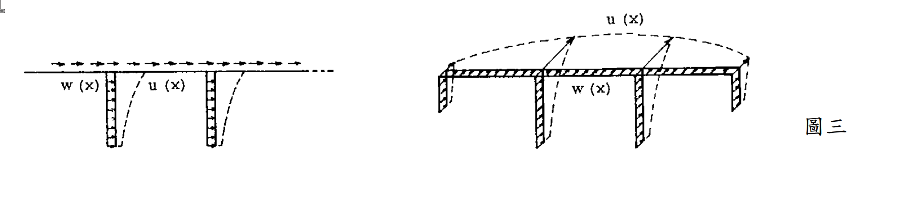

# 考題編號：SD-2002-3

**主分類：** `SD-U2` 耐震設計規範
**副分類：** `SD-U2-3` 橋梁耐震設計規範；`SD-U1-3` 多自由度系統動態分析
**分析方法：** Rayleigh 能量法（橋梁基本週期推導）
**標籤：** `橋梁耐震` `Rayleigh法` `能量法` `橋梁週期公式` `廣義質量` `廣義勁度` `α法` `自重` `幾何積分` `γ-β公式`

---

## 1. 原始題目重述 (Problem Restatement)

一橋梁結構，各墩沿橋軸方向每單位長度重量為 $w(x)$，在水平地震力作用下側向撓曲形狀為 $u(x)$。

*圖說：左為立面圖，右為透視圖。各橋墩的單位長度重量 $w(x)$（分布函數，含橋面板及橋墩自重）；$u(x)$：對應之側向撓曲型狀（以 $w(x)$ 作為靜態側向荷重施加時所得靜態位移）。*

**求：**
1. 由 Rayleigh 能量法推導橋梁基本週期公式 $T = 2.01\sqrt{\gamma/\beta}$，並定義 $\gamma$、$\beta$
2. 說明「以自重 $w(x)$ 作為側向荷重」的物理意義
3. 若重量函數改為 $2w(x)$（自重加倍），試求新週期 $T'$ 與原週期 $T$ 之關係

---

## 2. 考題核心精神與出題者意圖 (Core Concepts & Examiner's Intent)

**核心觀念：** Rayleigh 能量法的「最大動能 = 最大位能」原理，在橋梁耐震分析中轉化為以自重作為等效側向力的實用計算方法，最終得到各國橋梁耐震規範通用的 $T = C_{\gamma\beta}\sqrt{\gamma/\beta}$ 公式。

**出題意圖：**
1. 考驗能否從能量守恆推導 $\gamma$、$\beta$ 定義，以及係數 2.01 的由來（$2\pi/\sqrt{g}$）。
2. 測試能否正確說明「以自重為側向力」的合理性（自重反映了質量分布，而非其他荷重）。
3. 考察重量加倍後週期如何變化：需注意 u(x) 也同步改變（線彈性下 u' = 2u），導致 $T' = \sqrt{2}\,T$。

---

## 3. 解題戰略地圖與陷阱分析 (Strategic Roadmap & Trap Analysis)

**作戰計畫（4步）：**
1. 寫出最大動能 $T_{max}$ 與最大位能 $V_{max}$（以 $w(x)$、$u(x)$ 表達）
2. 令 $T_{max} = V_{max}$ → 求 $\omega^2$ → $T = 2\pi/\omega$
3. 代入 $g = 9.81\ \text{m/s}^2$ → 得係數 $2\pi/\sqrt{g} \approx 2.01$
4. 分析 $2w(x)$ 情形：u(x) 也同步加倍 → T' = √2 T

**陷阱分析：**

| # | 陷阱 | 應對 |
|---|------|------|
| ⚠ | $2w(x)$ 時，只更新 $w$ 而忘記 $u$ 也同步加倍（靜力線彈性：$u \propto$ 荷重） | $u'(x) = 2u(x)$，$\gamma' = 8\gamma$，$\beta' = 4\beta$，$T' = \sqrt{2}T$ |
| ⚠ | 係數 2.01 混淆為純數，忘記其來源 $2\pi/\sqrt{g}$ | 推導中明確代入 $g = 9.81$ |
| ⚠ | $\gamma$ 與 $\beta$ 定義互換 | $\gamma = \int wu^2 dx$（分子，包含 $u^2$）；$\beta = \int wu\,dx$（分母） |
| ⚠ | 位能 $V_{max}$ 用應變能積分，而非用靜力功 | 對連續梁，靜力功 $= \frac{1}{2}\int f(x)u(x)dx$，以 $f(x) = w(x)$ 代入即可 |

---

## 3.5 變數層次分析 (Variable Hierarchy Analysis)

> 複習提示：第一次解題後，在每個卡住的知識點旁標記 `⚠`；第二次複習時只看有 `⚠` 的項目。

### 最終目標
推導 $T = 2.01\sqrt{\gamma/\beta}$，並分析重量加倍對週期的影響。

### 本題關鍵公式（依計算順序）

$$\text{Step 1：} T_{max} = \frac{1}{2}\omega^2\int_0^L\frac{w(x)}{g}u^2(x)\,dx$$

$$\text{Step 2：} V_{max} = \frac{1}{2}\int_0^L w(x)\,u(x)\,dx$$

$$\text{Step 3：} T_{max} = V_{max} \implies \omega^2 = \frac{g\int w(x)u(x)\,dx}{\int w(x)u^2(x)\,dx} = \frac{g\cdot\boxed{\beta}}{\boxed{\gamma}}$$

$$\text{Step 4：} T = \frac{2\pi}{\omega} = \frac{2\pi}{\sqrt{g}}\sqrt{\frac{\gamma}{\beta}} \approx 2.01\sqrt{\frac{\gamma}{\beta}}$$

$$\text{Step 5（重量加倍）：} w'\!=2w,\;u'\!=2u \implies \gamma'\!=8\gamma,\;\beta'\!=4\beta \implies T'\!=\sqrt{2}\,T$$

### L1：題目直接給定

| 符號 | 說明 |
|------|------|
| $w(x)$ | 橋梁各截面單位長度重量（包含上下部結構） |
| $u(x)$ | 以 $w(x)$ 為側向靜力荷重時的靜態撓度（Rayleigh 假設振型） |
| $g$ | 重力加速度 $= 9.81\ \text{m/s}^2$（或 $980\ \text{cm/s}^2$） |

### L2：需知識點推導

**【能量建立】**

| 符號 | 公式／來源 | 卡關? |
|------|-----------|-------|
| $T_{max}$ | $\frac{1}{2}\omega^2\int(w/g)u^2 dx$ — 最大動能（質量分布 $= w/g$） | |
| $V_{max}$ | $\frac{1}{2}\int w(x)u(x)dx$ — 靜力功定理（$f = w$，位移 $= u$） | |
| $\omega^2$ | $g\beta/\gamma$（由 $T_{max}=V_{max}$） | |
| $\gamma$ | $\int_0^L w(x)u^2(x)dx$ | |
| $\beta$ | $\int_0^L w(x)u(x)dx$ | |

**【係數計算】**

| 符號 | 公式／來源 | 卡關? |
|------|-----------|-------|
| $2\pi/\sqrt{g}$ | $= 2\pi/\sqrt{9.81} = 6.283/3.132 = 2.007 \approx 2.01$ | |

**【重量加倍分析】**

| 符號 | 公式／來源 | 卡關? |
|------|-----------|-------|
| $u'(x)$ | $= 2u(x)$（線彈性：側向荷重加倍→位移加倍） | |
| $\gamma'$ | $\int 2w(2u)^2 dx = 8\gamma$ | |
| $\beta'$ | $\int 2w(2u) dx = 4\beta$ | |
| $T'$ | $2.01\sqrt{8\gamma/4\beta} = \sqrt{2}\cdot T$ | |

### L3：深層知識（不懂就卡住）

| 知識點 | 說明 | 卡關? |
|--------|------|-------|
| Rayleigh 法「自重為側向力」的合理性 | 自重 $w(x)$ 反映質量分布；以 $w(x)$ 作橫向靜力 → 得到合理的振型假設，偏保守 | |
| 最大位能用靜力功而非直接積分應變能 | 對連續梁，應變能難以直接積分；改用「靜力功 = 力 × 位移/2」等效 | |
| u(x) 必須隨荷重同步更新 | Rayleigh 法中，$u(x)$ 必須是 $w(x)$ 下的靜態解；若荷重改變而保持舊 $u(x)$，則只改變 $\gamma$、$\beta$ 比值，得到 $T' = T$（錯誤，忽略了結構動力行為的改變） | |

---

## 4. 步驟化詳細計算過程 (Step-by-Step Detailed Calculation)

### Step 1：Rayleigh 法的能量假設

設橋梁在水平地震下做簡諧振動，振型形狀為 $u(x)$，振動時的橫向位移：

$$y(x,t) = u(x)\sin(\omega t)$$

橫向速度：

$$\dot{y}(x,t) = u(x)\,\omega\cos(\omega t)$$

### Step 2：建立最大動能

單位長度質量 $= w(x)/g$，最大動能在 $\cos(\omega t) = 1$ 時達到：

$$T_{max} = \frac{1}{2}\int_0^L \frac{w(x)}{g}\,[u(x)\,\omega]^2\,dx = \frac{\omega^2}{2g}\int_0^L w(x)\,u^2(x)\,dx$$

$$\boxed{T_{max} = \frac{\omega^2}{2g}\,\gamma}, \qquad \gamma \equiv \int_0^L w(x)\,u^2(x)\,dx$$

### Step 3：建立最大位能（靜力功法）

結構達最大側向位移 $u(x)$ 時，彈性應變能最大。由功能定理（靜力加載過程中靜力功 = 應變能）：

$$V_{max} = \frac{1}{2}\int_0^L \underbrace{w(x)}_{\text{側向力}}\cdot u(x)\,dx$$

> **策略註解：** 此處以 $w(x)$ 作側向荷重，是因為若結構受到 $w(x)$ 之靜力（如模擬水平慣性力），其靜態撓曲形狀即為假設的振型 $u(x)$，二者自洽。

$$\boxed{V_{max} = \frac{1}{2}\,\beta}, \qquad \beta \equiv \int_0^L w(x)\,u(x)\,dx$$

### Step 4：令最大動能 = 最大位能

$$T_{max} = V_{max}$$

$$\frac{\omega^2}{2g}\,\gamma = \frac{1}{2}\,\beta$$

$$\omega^2 = \frac{g\,\beta}{\gamma}$$

$$\omega = \sqrt{\frac{g\,\beta}{\gamma}}$$

### Step 5：求自然週期

$$T = \frac{2\pi}{\omega} = 2\pi\sqrt{\frac{\gamma}{g\,\beta}} = \frac{2\pi}{\sqrt{g}}\sqrt{\frac{\gamma}{\beta}}$$

代入 $g = 9.81\ \text{m/s}^2$：

$$\frac{2\pi}{\sqrt{g}} = \frac{2\pi}{\sqrt{9.81}} = \frac{6.2832}{3.1321} = 2.007 \approx 2.01$$

$$\boxed{T = 2.01\sqrt{\frac{\gamma}{\beta}}}$$

其中：
$$\gamma = \int_0^L w(x)\,u^2(x)\,dx, \qquad \beta = \int_0^L w(x)\,u(x)\,dx$$

> **物理量綱：** 若 $w$ 單位為 kN/m，$u$ 單位為 m，則 $\gamma$ 為 kN·m²，$\beta$ 為 kN·m，$\gamma/\beta$ 為 m，$T = 2.01\sqrt{\gamma/\beta}$ 單位為 $\text{s}$ ✓（$2.01$ 隱含 $\text{s/m}^{1/2}$，來自 $2\pi/\sqrt{g}$）。

### Step 6：「以自重作側向力」的物理意義

應用 Rayleigh 法時，需要一個「假設振型」$u(x)$。最常用的選取方式：
**以自重 $w(x)$ 作為側向靜力荷重，計算橋梁的靜態橫向撓度，以此作為 $u(x)$。**

合理性：
1. 自重 $w(x)$ 正比於質量分布（$w = mg$），水平慣性力也正比於質量，因此用自重模擬水平慣性力的分布型式是合理的近似。
2. 此假設振型接近基本振型（尤其對均勻橋梁），Rayleigh 法對此近似解給出的 $T$ 偏大（偏保守）。

### Step 7：重量加倍後的週期（$w(x) \to 2w(x)$）

若橋梁自重均勻加倍：$w'(x) = 2w(x)$，結構勁度不變（同一橋墩 $EI$）。

**新的靜態撓度**（以 $2w(x)$ 作側向力，線彈性）：
$$u'(x) = 2u(x)$$

**新的廣義積分：**
$$\gamma' = \int_0^L 2w(x)\,[2u(x)]^2\,dx = \int_0^L 2w(x)\cdot 4u^2(x)\,dx = 8\int_0^L w(x)u^2(x)\,dx = 8\gamma$$

$$\beta' = \int_0^L 2w(x)\cdot 2u(x)\,dx = 4\int_0^L w(x)u(x)\,dx = 4\beta$$

**新週期：**
$$T' = 2.01\sqrt{\frac{\gamma'}{\beta'}} = 2.01\sqrt{\frac{8\gamma}{4\beta}} = 2.01\sqrt{\frac{2\gamma}{\beta}} = \sqrt{2}\times 2.01\sqrt{\frac{\gamma}{\beta}}$$

$$\boxed{T' = \sqrt{2}\,T \approx 1.414\,T}$$

> **策略註解：** 自重加倍同時使質量（慣性）與側向力（撓度）均加倍。慣性增大延長週期，側向力增大（撓度加倍）也延長週期，兩者合力使週期增加 $\sqrt{2}$ 倍，而非 2 倍（若誤以為只有質量增加，結論會是 $\sqrt{2}$，恰巧相同——但理由不同）。

### 結果彙整

| 項目 | 公式 |
|------|------|
| 基本週期公式 | $T = 2.01\sqrt{\gamma/\beta}$ |
| $\gamma$ | $\int_0^L w(x)u^2(x)dx$（kN·m²） |
| $\beta$ | $\int_0^L w(x)u(x)dx$（kN·m） |
| 係數 2.01 來源 | $2\pi/\sqrt{9.81} = 2.007$ |
| $u(x)$ 的取法 | 以 $w(x)$ 作側向靜力，計算靜態撓度 |
| 重量加倍後週期 | $T' = \sqrt{2}\,T$ |

---

## 5. 關鍵爭議點與進階探討 (Critical Issues & Advanced Discussion)

**係數的精確值：**
$2\pi/\sqrt{9.81} = 2.0071...$，通常取 2.01。若採用 $g = 9.8\ \text{m/s}^2$，係數為 $2\pi/\sqrt{9.8} = 2.0074$，差異不影響工程計算。某些規範取 2.0（如採用 $g = \pi^2 \approx 9.87$ 的理論值時）。

**Rayleigh 法週期估算的方向性：**
Rayleigh 法以任意假設振型求出的週期，永遠大於或等於真實基本週期（$T_{Rayleigh} \geq T_1$，偏保守）。當假設振型越接近真實振型，估算越精確。以靜力撓度為振型通常已足夠精確（誤差 < 5%）。

**對應台灣橋梁耐震規範（α法）：**
本題推導的 $T = 2.01\sqrt{\gamma/\beta}$ 公式直接出現在台灣橋梁耐震設計規範的 α 法中，是橋梁工程師的核心工具。使用時：
- $w(x)$ 取上下部結構設計死荷重
- $u(x)$ 以有限元素或解析解計算靜態橫向撓度
- $\gamma$、$\beta$ 以數值積分（梯形法或辛普森法）計算
