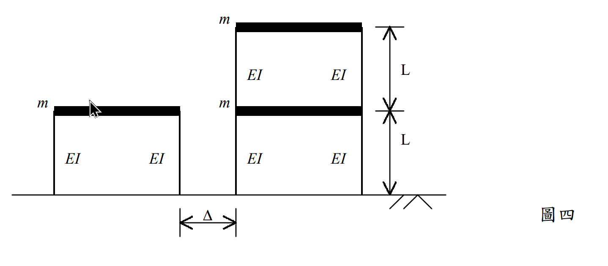

# 考題編號：SD-2002-4

**主分類：** `SD-U2` 耐震設計規範
**副分類：** `SD-U1-3` 多自由度系統動態分析；`SD-U2-2` 建築耐震設計規範
**分析方法：** MDOF 模態疊加法 + SRSS 組合 + 反應譜分析
**標籤：** `鄰棟碰撞` `防震間距` `SRSS` `模態疊加法` `反應譜` `模態參與因子` `黃金比例振態` `2DOF剪力構架` `有效質量`

---

## 1. 原始題目重述 (Problem Restatement)

單層（左）與雙層（右）相鄰剪力構架，試求最小間距 $\Delta$，使設計地震下兩棟不碰撞。

*圖說：左棟（A棟）：單層剪力構架，柱高 $L=3\ \text{m}$，各柱 $EI=4.5\times10^4\ \text{kN-m}^2$，樓版質量 $m=800\ \text{Ton}$。右棟（B棟）：雙層剪力構架，各層相同幾何與材料；各層樓版質量 $m=800\ \text{Ton}$。碰撞界面：A棟屋頂（高度 L）= B棟一樓（高度 L）。*

**工址水平向正規化加速度反應譜係數 $C$：**

| 週期範圍 | $C$ |
|---------|-----|
| $T \leq 0.03\ \text{s}$ | 1.0 |
| $0.03\ \text{s} \leq T \leq 0.2\ \text{s}$ | $8.824T + 0.7352$ |
| $0.2\ \text{s} \leq T \leq 1.32\ \text{s}$ | 2.5 |
| $1.32\ \text{s} \leq T \leq 3.3\ \text{s}$ | $3.3/T$ |
| $T \geq 3.3\ \text{s}$ | 1.0 |

**設計水平加速度係數：** $A = 0.2$（設計地震加速度 = $0.2g$）

**求：** 最小防震間距 $\Delta$

---

## 2. 考題核心精神與出題者意圖 (Core Concepts & Examiner's Intent)

**核心觀念：** 不同自然頻率的兩棟建築，地震反應彼此不相關，最大位移不會同時發生。防震間距以 SRSS 組合（平方和開方），而非絕對值和（SAV）。

**出題意圖：**
1. 考驗能否正確推導 2-DOF 系統的特徵值（$\lambda^2 - 3\lambda + 1 = 0$，根為黃金比例相關值）。
2. 測試模態疊加法的完整流程：特徵值→模態→模態參與因子→反應譜位移→SRSS。
3. 考察碰撞界面的正確選取（A棟屋頂 = B棟一樓，高度 $L$）及 SRSS 組合的適用性。

---

## 3. 解題戰略地圖與陷阱分析 (Strategic Roadmap & Trap Analysis)

**作戰計畫（7步）：**
1. 計算柱側向勁度 $k_{col} = 12EI/L^3$，樓層勁度 $k_s = 2k_{col}$
2. A棟（SDOF）：$T_A = 2\pi\sqrt{m/k_s}$，查反應譜，得 $S_{d,A}$
3. B棟（2-DOF）：解 $\lambda^2 - 3\lambda + 1 = 0$，得 $\lambda_{1,2} = (3\pm\sqrt{5})/2$
4. 計算 $\omega_{1,2}^2$，$T_{1,2}$，查反應譜，得 $S_{d1}$、$S_{d2}$
5. 計算模態形狀 $\{\phi\}_1$、$\{\phi\}_2$（黃金比例）
6. 計算模態參與因子 $\Gamma_1$、$\Gamma_2$
7. SRSS 組合 B棟一樓位移；再以 SRSS 合計 A棟、B棟位移 → $\Delta$

**陷阱分析：**

| # | 陷阱 | 應對 |
|---|------|------|
| ⚠ | 碰撞界面取錯（用 B棟屋頂而非一樓） | 碰撞在 A棟屋頂 = B棟一樓的高度（高度 $L$） |
| ⚠ | $T_1 > 1.32\ \text{s}$ 使用 $C = 2.5$（用錯範圍） | $T_1 = 1.44\ \text{s} > 1.32$，應用 $C = 3.3/T$ |
| ⚠ | 防震間距用 $d_A + d_B$（SAV）而非 SRSS | 不同頻率棟，反應不相關，應用 SRSS = $\sqrt{d_A^2 + d_B^2}$ |
| ⚠ | B棟模態參與因子漏算（只用第一模態） | 兩個模態均須包含，但第一模態一樓位移遠大於第二模態 |

---

## 3.5 變數層次分析 (Variable Hierarchy Analysis)

> 複習提示：第一次解題後，在每個卡住的知識點旁標記 `⚠`；第二次複習時只看有 `⚠` 的項目。

### 最終目標
求兩棟建築間的最小防震間距 $\Delta$，使地震下 A棟屋頂（高度 $L$）與 B棟一樓（高度 $L$）不發生碰撞。

### 本題關鍵公式（依計算順序）

$$\text{Step 1：} k_s = 2\times\frac{12EI}{L^3}$$

$$\text{Step 2（A棟）：} T_A = 2\pi\sqrt{\frac{m}{k_s}},\quad S_{d,A} = \frac{C_A \cdot 0.2g}{\omega_A^2}$$

$$\text{Step 3（B棟特徵值）：} \lambda^2 - 3\lambda + 1 = 0,\quad \lambda_{1,2} = \frac{3\pm\sqrt{5}}{2},\quad \omega_n^2 = \lambda_n\frac{k_s}{m}$$

$$\text{Step 4（B棟模態）：} \frac{\phi_{2n}}{\phi_{1n}} = 2-\lambda_n = \begin{cases}(1+\sqrt{5})/2\\(1-\sqrt{5})/2\end{cases}$$

$$\text{Step 5（參與因子）：} \Gamma_n = \frac{(1+\phi_{2n}/\phi_{1n})}{(1+(\phi_{2n}/\phi_{1n})^2)}$$

$$\text{Step 6（B棟一樓 SRSS）：} d_{B,1} = \sqrt{(\Gamma_1 S_{d1})^2 + (\Gamma_2 S_{d2})^2}$$

$$\text{Step 7（防震間距）：} \boxed{\Delta = \sqrt{d_A^2 + d_{B,1}^2}}$$

### L1：題目直接給定

| 符號 | 數值 | 說明 |
|------|------|------|
| $m$ | 800 Ton | 各樓版質量 |
| $L$ | 3 m | 各層柱高 |
| $EI$ | $4.5\times10^4\ \text{kN-m}^2$ | 各柱彎曲剛度 |
| $A$ | 0.2 | 設計水平加速度係數 |
| $g$ | 9.81 m/s² | 重力加速度 |

### L2：需知識點推導

**【勁度計算】**

| 符號 | 公式／來源 | 卡關? |
|------|-----------|-------|
| $k_{col}$ | $12EI/L^3$（定端柱側向勁度） | |
| $k_s$ | $2k_{col}$（兩柱並聯） | |

**【B棟特徵值】**

| 符號 | 公式／來源 | 卡關? |
|------|-----------|-------|
| $\lambda_{1,2}$ | $(3\pm\sqrt{5})/2$（二次公式，$\lambda=m\omega^2/k_s$） | |
| 模態比例 | $\phi_{2n}/\phi_{1n} = 2-\lambda_n$（黃金比例 $\pm\sqrt5$） | |
| $\Gamma_n$ | $(1+r_n)/(1+r_n^2)$，其中 $r_n = \phi_{2n}/\phi_{1n}$ | |

**【反應譜位移】**

| 符號 | 公式／來源 | 卡關? |
|------|-----------|-------|
| $S_{dn}$ | $C_n \cdot 0.2g / \omega_n^2 = C_n \cdot 0.2g \cdot T_n^2/(4\pi^2)$ | |
| 反應譜區間 | 比對 $T$ 與各分段邊界 (0.03, 0.2, 1.32, 3.3 s) | |

### L3：深層知識（不懂就卡住）

| 知識點 | 說明 | 卡關? |
|--------|------|-------|
| SRSS 與 SAV 的適用條件 | 頻率相差 > 10% 用 SRSS（不相關）；頻率接近用 CQC（相關）；完全相同頻率用 SAV | |
| 防震間距的碰撞界面選取 | 只在 A棟屋頂與 B棟一樓高度相交處可能碰撞；需比較該高度的各棟側移 | |
| 模態參與因子的物理意義 | $\Gamma_n$ 表示第 $n$ 模態在地震中被激發的比例；有效質量 = $\Gamma_n^2 M_n^*$ | |

---

## 4. 步驟化詳細計算過程 (Step-by-Step Detailed Calculation)

### Step 1：柱與樓層側向勁度

每根柱（固端-固端）側向勁度：
$$k_{col} = \frac{12EI}{L^3} = \frac{12\times 4.5\times10^4}{3^3} = \frac{5.4\times10^5}{27} = 20{,}000\ \text{kN/m} = 2\times10^4\ \text{kN/m}$$

每層兩根柱並聯，樓層側向勁度：
$$k_s = 2k_{col} = 40{,}000\ \text{kN/m} = 4\times10^4\ \text{kN/m}$$

### Step 2：A棟（SDOF，單層）自然週期與位移

$$\omega_A^2 = \frac{k_s}{m} = \frac{40{,}000}{800} = 50\ \text{rad}^2/\text{s}^2$$

$$T_A = \frac{2\pi}{\sqrt{50}} = \frac{2\pi}{5\sqrt{2}} = \frac{\pi\sqrt{2}}{5} \approx 0.889\ \text{s}$$

查反應譜：$0.2\ \text{s} \leq T_A = 0.889\ \text{s} \leq 1.32\ \text{s}$，故 $C_A = 2.5$

設計譜加速度：
$$S_{a,A} = C_A \times 0.2g = 2.5 \times 0.2 \times 9.81 = 4.905\ \text{m/s}^2$$

設計譜位移（= A棟屋頂最大位移）：
$$\boxed{S_{d,A} = \frac{S_{a,A}}{\omega_A^2} = \frac{4.905}{50} = 0.0981\ \text{m} \approx 98.1\ \text{mm}}$$

### Step 3：B棟（2-DOF，雙層）建立質量與勁度矩陣

廣義座標：$\{q\} = \{u_1, u_2\}^\top$（第一層、第二層絕對水平位移）

$$[M] = \begin{bmatrix} m & 0 \\ 0 & m \end{bmatrix} = \begin{bmatrix} 800 & 0 \\ 0 & 800 \end{bmatrix}\ \text{Ton}$$

$$[K] = \begin{bmatrix} 2k_s & -k_s \\ -k_s & k_s \end{bmatrix} = \begin{bmatrix} 80{,}000 & -40{,}000 \\ -40{,}000 & 40{,}000 \end{bmatrix}\ \text{kN/m}$$

### Step 4：B棟特徵值求解

特徵方程 $\det([K] - \omega^2[M]) = 0$，令 $\lambda = m\omega^2/k_s$：

$$(2k_s - \lambda k_s)(k_s - \lambda k_s) - k_s^2 = 0$$

$$k_s^2[(2-\lambda)(1-\lambda) - 1] = 0 \implies \lambda^2 - 3\lambda + 1 = 0$$

$$\lambda = \frac{3 \pm \sqrt{5}}{2}, \qquad \sqrt{5} = 2.2361$$

| 模態 | $\lambda_n$ | $\omega_n^2 = \lambda_n k_s/m$ | $T_n$ |
|:----:|:----------:|:-----------------------------:|:-----:|
| 1 | $(3-\sqrt{5})/2 = 0.3820$ | $0.3820 \times 50 = 19.10\ \text{rad}^2/\text{s}^2$ | $2\pi/\sqrt{19.10} = 1.438\ \text{s}$ |
| 2 | $(3+\sqrt{5})/2 = 2.6180$ | $2.6180 \times 50 = 130.9\ \text{rad}^2/\text{s}^2$ | $2\pi/\sqrt{130.9} = 0.549\ \text{s}$ |

### Step 5：B棟模態形狀

由 $(2k_s - \omega_n^2 m)\phi_{1n} = k_s\phi_{2n}$ → $\phi_{2n}/\phi_{1n} = 2 - \lambda_n$

**模態 1**（令 $\phi_{11} = 1$）：
$$\frac{\phi_{21}}{\phi_{11}} = 2 - \frac{3-\sqrt{5}}{2} = \frac{1+\sqrt{5}}{2} \approx 1.618\ (\text{黃金比例}\ \varphi)$$

$$\{\phi\}_1 = \begin{Bmatrix} 1 \\ 1.618 \end{Bmatrix}$$

**模態 2**（令 $\phi_{12} = 1$）：
$$\frac{\phi_{22}}{\phi_{12}} = 2 - \frac{3+\sqrt{5}}{2} = \frac{1-\sqrt{5}}{2} \approx -0.618$$

$$\{\phi\}_2 = \begin{Bmatrix} 1 \\ -0.618 \end{Bmatrix}$$

> **策略註解：** 等質量等勁度的2-DOF系統，特徵方程 $\lambda^2-3\lambda+1=0$ 的根恰好是 $(3\pm\sqrt{5})/2$，對應模態比為黃金比例 $\varphi$ 及 $-1/\varphi$，是結構動力學中的經典結果。

### Step 6：模態參與因子

$$\Gamma_n = \frac{\{\phi_n\}^\top [M]\{1\}}{\{\phi_n\}^\top [M]\{\phi_n\}}$$

**模態 1：**
$$\Gamma_1 = \frac{m(1 + 1.618)}{m(1^2 + 1.618^2)} = \frac{2.618}{1 + 2.618} = \frac{2.618}{3.618} = 0.7236$$

**模態 2：**
$$\Gamma_2 = \frac{m(1 + (-0.618))}{m(1^2 + (-0.618)^2)} = \frac{0.382}{1 + 0.382} = \frac{0.382}{1.382} = 0.2764$$

**有效質量驗算：**
$$m_{eff,1} + m_{eff,2} = \frac{(2.618m)^2}{3.618m} + \frac{(0.382m)^2}{1.382m} = 1.894m + 0.106m = 2.000m\ \checkmark$$

### Step 7：B棟反應譜位移

查反應譜：
- $T_1 = 1.438\ \text{s}$：$1.32 \leq 1.438 \leq 3.3$ → $C_1 = 3.3/1.438 = 2.295$
- $T_2 = 0.549\ \text{s}$：$0.2 \leq 0.549 \leq 1.32$ → $C_2 = 2.5$

$$S_{a1} = 2.295 \times 0.2g = 2.295 \times 1.962 = 4.503\ \text{m/s}^2$$
$$S_{d1} = S_{a1}/\omega_1^2 = 4.503/19.10 = 0.2358\ \text{m}$$

$$S_{a2} = 2.5 \times 0.2g = 4.905\ \text{m/s}^2$$
$$S_{d2} = S_{a2}/\omega_2^2 = 4.905/130.9 = 0.03748\ \text{m}$$

### Step 8：B棟一樓（高度 L）最大位移（SRSS）

各模態對一樓（$\phi_{1n} = 1$）的位移貢獻：

$$X_{1,\text{1F}} = \Gamma_1 \times \phi_{11} \times S_{d1} = 0.7236 \times 1 \times 0.2358 = 0.1706\ \text{m}$$

$$X_{2,\text{1F}} = \Gamma_2 \times \phi_{12} \times S_{d2} = 0.2764 \times 1 \times 0.03748 = 0.01036\ \text{m}$$

SRSS 組合（兩頻率相差 62%，遠大於 10%，SRSS 適用）：

$$d_{B,\text{1F}} = \sqrt{X_{1,\text{1F}}^2 + X_{2,\text{1F}}^2} = \sqrt{0.1706^2 + 0.01036^2} = \sqrt{0.02910 + 0.000107}$$

$$= \sqrt{0.02921} = 0.1709\ \text{m} \approx 170.9\ \text{mm}$$

> **策略註解：** 第二模態貢獻僅 10.4 mm，遠小於第一模態 170.6 mm，第一模態主導。

### Step 9：防震間距 $\Delta$（SRSS）

A棟屋頂（高度 $L$）位移：$d_A = 98.1\ \text{mm}$
B棟一樓（高度 $L$）位移：$d_{B,\text{1F}} = 170.9\ \text{mm}$

兩棟頻率相差（$T_A = 0.889\ \text{s}$ vs $T_{B,1} = 1.438\ \text{s}$），反應不相關，用 SRSS：

$$\Delta = \sqrt{d_A^2 + d_{B,\text{1F}}^2} = \sqrt{98.1^2 + 170.9^2} = \sqrt{9{,}624 + 29{,}207} = \sqrt{38{,}831}$$

$$\boxed{\Delta \approx 197.1\ \text{mm} \approx 0.197\ \text{m}}$$

### 結果彙整

| 項目 | A棟（單層） | B棟（雙層） |
|------|:----------:|:----------:|
| 週期 | $T_A = 0.889\ \text{s}$ | $T_1 = 1.438\ \text{s}$；$T_2 = 0.549\ \text{s}$ |
| 反應譜 C | 2.5 | $C_1 = 2.295$；$C_2 = 2.5$ |
| 譜位移 | $S_{d,A} = 98.1\ \text{mm}$ | $S_{d1} = 235.8\ \text{mm}$；$S_{d2} = 37.5\ \text{mm}$ |
| 高度 L 位移 | $d_A = 98.1\ \text{mm}$ | $d_{B,1F} = 170.9\ \text{mm}$ |

$$\boxed{\Delta_{\min} = \sqrt{98.1^2 + 170.9^2} \approx 197\ \text{mm}}$$

---

## 5. 關鍵爭議點與進階探討 (Critical Issues & Advanced Discussion)

**SRSS 的適用性：**
本題兩棟的主要週期（0.889 s 與 1.438 s）相差約 62%，頻率差異夠大，SRSS 組合適用。若採用 SAV（絕對值和）：$98.1 + 170.9 = 269.0\ \text{mm}$，比 SRSS 大 37%，偏保守。在設計上若採 SAV 亦可接受（保守側）。

**碰撞界面的高度效應：**
碰撞發生在兩棟等高的「交界面」。B棟二樓高度（$2L = 6\ \text{m}$）高於A棟，不會發生碰撞。若考慮 B棟二樓的最大位移（SRSS ≈ 276 mm），是A棟屋頂頂部的位移，與 B棟整體的相對位移無關，故不需要考慮。

**黃金比例振態的物理意義：**
等質量等勁度的兩層剪力構架，其模態形狀的上下層位移比恰為黃金比例 $\varphi = (1+\sqrt{5})/2 \approx 1.618$（第一模態）和 $-1/\varphi \approx -0.618$（第二模態），源自特徵方程 $\lambda^2 - 3\lambda + 1 = 0$，是結構動力學的經典結果，值得記憶。
