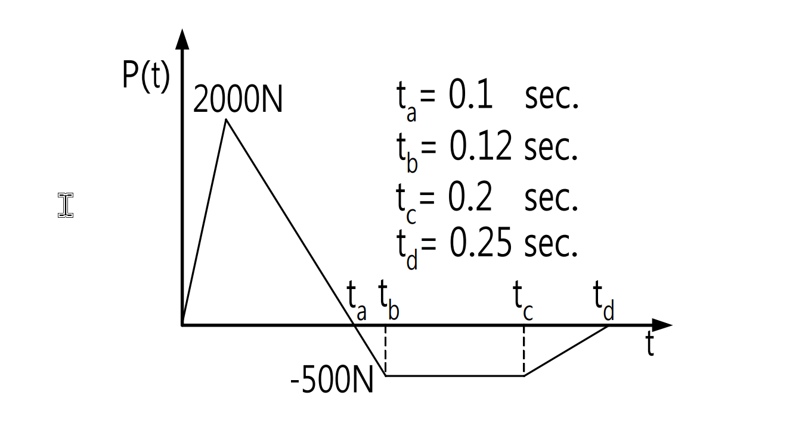

# 考題編號：SD-2003-2

**主分類：** `SD-U1` 結構動力學基礎  
**副分類：** —  
**分析方法：** SDOF 動力分析（Duhamel 積分 + 脈衝近似法）  
**標籤：** `SDOF` `Duhamel積分` `衝量動量定理` `最大位移` `分段線性外力` `阻尼自由振動` `脈衝近似`

---

## 1. 原始題目重述 (Problem Restatement)

考慮一單自由度動力系統：

- 質量 $m = 100\,\text{kg}$
- 勁度 $k = 100\,\text{N/m}$
- 阻尼比 $\xi = 30\%$

系統受到如下分段線性外力歷時：

| 時間區間 | 力值 |
|---------|------|
| $0 \to t_a = 0.1\,\text{s}$ | 由 $0$ 線性增至 $2000\,\text{N}$ |
| $t_a \to t_b = 0.12\,\text{s}$ | 由 $2000\,\text{N}$ 線性降至 $-500\,\text{N}$ |
| $t_b \to t_c = 0.2\,\text{s}$ | 維持 $-500\,\text{N}$（常數） |
| $t_c \to t_d = 0.25\,\text{s}$ | 由 $-500\,\text{N}$ 線性回升至 $0$ |
| $t > t_d$ | $P(t) = 0$（自由振動） |

**求：最大位移**

*圖說：外力由 0 線性增至 2000N (t=0.1s)，陡降至 -500N (t=0.12s)，維持 -500N 至 t=0.2s，再線性回零至 t=0.25s。*

---

## 2. 考題核心精神與出題者意圖 (Core Concepts & Examiner's Intent)

本題核心：「**時域短脈衝作用下 SDOF 的最大位移**」

出題意圖：
- 考驗 Duhamel 積分的應用能力
- 考驗對「載重歷時遠短於自然週期」情形下的工程簡化判斷（脈衝近似）
- 考驗阻尼自由振動初始條件的計算

**核心觀察（解題前必判斷）：** $T_0 = 2\pi\,\text{s} \approx 6.28\,\text{s}$，而載重持續時間 $t_d = 0.25\,\text{s}$，比值 $t_d/T_0 \approx 4\%$，屬**短時脈衝**情形。

---

## 3. 解題戰略地圖與陷阱分析 (Strategic Roadmap & Trap Analysis)

**步驟路線：**

$$\omega_0,\,T_0,\,\omega_d \;\to\; \text{判斷 }t_d \ll T_0 \;\to\; \text{計算總衝量 }I = \int F\,dt \;\to\; \text{載重結束時初始條件} \;\to\; \text{阻尼自由振動求極值}$$

**關鍵陷阱：**

**陷阱 1：** 見到 $k = 100\,\text{N/m}$、$F = 2000\,\text{N}$，誤以為靜變位 $x_{st} = F/k = 20\,\text{m}$ 就是答案。實際上短脈衝的動態位移遠小於靜載位移，因為力作用時間遠短於週期。

**陷阱 2：** 忘記 $t_b \to t_c$ 和 $t_c \to t_d$ 的負力區段也有負衝量，直接只算正力段衝量而高估結果。

**陷阱 3：** 載重結束時位移不為零（約 0.165 m），忽略此初始位移會低估最大位移。

**陷阱 4：** 最大位移不在 $t = t_a$（峰值力時刻），而在自由振動段約 $t \approx 1.34\,\text{s}$ 時。

---

## 3.5 變數層次分析 (Variable Hierarchy Analysis)

> 複習提示：第一次解題後，在每個卡住的知識點旁標記 `⚠`；第二次複習時只看有 `⚠` 的項目。

### 最終目標
`SDOF 系統在分段線性短時脈衝外力下的最大相對位移`

### 本題關鍵公式（依計算順序）

$$\omega_0 = \sqrt{\frac{k}{m}}, \quad \omega_d = \omega_0\sqrt{1-\xi^2}$$

$$I = \int_0^{t_d} F(t)\,dt \quad \text{（各段梯形面積之和）}$$

$$\dot{x}_0 \approx \frac{I}{m} \quad \text{（脈衝近似：載重結束時速度）}$$

$$x_0 \approx \frac{1}{m}\int_0^{t_d}(t_d - \tau)F(\tau)\,d\tau \quad \text{（運動學近似：載重結束時位移）}$$

$$x(\tau) = e^{-\xi\omega_0\tau}\!\left[A\cos(\omega_d\tau) + B\sin(\omega_d\tau)\right], \quad B = \frac{\dot{x}_0 + \xi\omega_0 x_0}{\omega_d}$$

$$\tan(\omega_d\tau^*) = \frac{B\omega_d - \xi\omega_0 A}{\xi\omega_0 B + A\omega_d} \quad \text{（極大值條件）}$$

$$\boxed{x_{max} = e^{-\xi\omega_0\tau^*}\!\left[A\cos(\omega_d\tau^*) + B\sin(\omega_d\tau^*)\right]}$$

### L1：題目直接給定

| 符號 | 數值 | 說明 |
|------|------|------|
| $m$ | $100\,\text{kg}$ | 系統質量 |
| $k$ | $100\,\text{N/m}$ | 系統勁度 |
| $\xi$ | $0.30$ | 阻尼比 |
| $t_a$ | $0.1\,\text{s}$ | 峰值力時刻 |
| $t_b$ | $0.12\,\text{s}$ | 負力開始時刻 |
| $t_c$ | $0.2\,\text{s}$ | 負力結束時刻 |
| $t_d$ | $0.25\,\text{s}$ | 外力結束時刻 |
| $P_{max}$ | $2000\,\text{N}$ | 峰值外力 |
| $P_{neg}$ | $-500\,\text{N}$ | 負值外力 |

### L2：需知識點推導

**Step 1 – 系統頻率**

| 符號 | 公式／來源 | 卡關? |
|------|-----------|-------|
| $\omega_0$ | $\sqrt{k/m} = \sqrt{100/100}$ | |
| $T_0$ | $2\pi/\omega_0$ | |
| $\omega_d$ | $\omega_0\sqrt{1-\xi^2}$ | |

**Step 2 – 判斷脈衝近似適用性**

| 符號 | 公式／來源 | 卡關? |
|------|-----------|-------|
| $t_d/T_0$ | $0.25/6.28 \approx 4\%$ | |
| 近似條件 | $t_d \ll T_0$ 時 Duhamel 核函數可近似展開 | |

**Step 3 – 各段衝量（梯形面積）**

| 段 | 公式 | 卡關? |
|----|------|-------|
| $I_1$ | $\frac{1}{2}\times 0.1\times 2000$ | |
| $I_2$ | $\frac{1}{2}\times(2000+(-500))\times 0.02$ | |
| $I_3$ | $(-500)\times 0.08$ | |
| $I_4$ | $\frac{1}{2}\times(-500)\times 0.05$ | |

**Step 4 – 載重結束時初始條件**

| 符號 | 公式／來源 | 卡關? |
|------|-----------|-------|
| $\dot{x}_0$ | $I/m$ | |
| $x_0$ | $\frac{1}{m}\int_0^{t_d}(t_d-\tau)F(\tau)d\tau$（分段積分） | |

**Step 5 – 自由振動求最大位移**

| 符號 | 公式／來源 | 卡關? |
|------|-----------|-------|
| $A$ | $= x_0$ | |
| $B$ | $(\dot{x}_0 + \xi\omega_0 x_0)/\omega_d$ | |
| $\tau^*$ | $\arctan(\cdots)/\omega_d$（極大值條件） | |
| $x_{max}$ | 代入 $\tau^*$ 求值 | |

### L3：深層知識（不懂就卡住）

| 知識點 | 說明 | 卡關? |
|--------|------|-------|
| 脈衝近似的適用條件 | $t_{load}/T_0 < 10\%$ 時可用，$t_{load}/T_0 > 50\%$ 時必須用完整 Duhamel | |
| 衝量的正負方向 | 負力段產生負衝量，會減少系統的動量增加，必須代入 | |
| 運動學位移近似 | $x(t) \approx \frac{1}{m}\int_0^t(t-\tau)F(\tau)d\tau$ 來自 Duhamel 積分在 $\omega_d t \ll 1$ 時的 Taylor 展開 | |
| 阻尼自由振動的初始條件代入方式 | $A=x_0$，$B=(ẋ_0+\xi\omega_0 x_0)/\omega_d$，不是 $B=ẋ_0/\omega_d$ | |
| 最大值時刻的求法 | $dx/d\tau=0$ → $\tan(\omega_d\tau^*) = (B\omega_d - \xi\omega_0 A)/(\xi\omega_0 B + A\omega_d)$ | |

---

## 4. 步驟化詳細計算過程 (Step-by-Step Detailed Calculation)

### Step 1：系統參數

$$\omega_0 = \sqrt{\frac{k}{m}} = \sqrt{\frac{100}{100}} = 1.0\,\text{rad/s}$$

$$T_0 = \frac{2\pi}{\omega_0} = 2\pi \approx 6.283\,\text{s}$$

$$\omega_d = \omega_0\sqrt{1-\xi^2} = 1.0\times\sqrt{1-0.30^2} = \sqrt{0.91} \approx 0.9539\,\text{rad/s}$$

$$T_d = \frac{2\pi}{\omega_d} \approx 6.588\,\text{s}$$

### Step 2：確認脈衝近似適用性

$$\frac{t_d}{T_0} = \frac{0.25}{6.283} \approx 3.98\% \ll 1$$

**結論：** 載重持續時間遠短於自然週期，適用**脈衝近似**。在載重期間：

- $\omega_d \cdot t_d \approx 0.9539 \times 0.25 = 0.238\,\text{rad}$ — 角度極小，$\sin(\theta) \approx \theta$ 近似誤差 < 1%
- $e^{-\xi\omega_0 t_d} = e^{-0.075} \approx 0.928$ — 衰減不大，可近似為 1

因此 Duhamel 積分可簡化為運動學近似：

$$x(t) \approx \frac{1}{m}\int_0^t (t-\tau)F(\tau)\,d\tau, \quad \dot{x}(t) \approx \frac{1}{m}\int_0^t F(\tau)\,d\tau$$

### Step 3：計算總衝量

各段衝量（梯形面積）：

| 段 | 時間區間 | 形狀 | 計算 | 衝量 |
|----|---------|------|------|------|
| 1 | $0\to 0.1\,\text{s}$ | 三角形 | $\frac{1}{2}\times 0.1\times 2000$ | $+100\,\text{N·s}$ |
| 2 | $0.1\to 0.12\,\text{s}$ | 梯形 $(2000\to-500)$ | $\frac{1}{2}(2000-500)\times 0.02$ | $+15\,\text{N·s}$ |
| 3 | $0.12\to 0.2\,\text{s}$ | 矩形 $-500\,\text{N}$ | $(-500)\times 0.08$ | $-40\,\text{N·s}$ |
| 4 | $0.2\to 0.25\,\text{s}$ | 三角形 $(-500\to 0)$ | $\frac{1}{2}\times(-500)\times 0.05$ | $-12.5\,\text{N·s}$ |

$$\boxed{I = 100 + 15 - 40 - 12.5 = 62.5\,\text{N·s}}$$

### Step 4：載重結束時的初始條件

#### 4a. 速度（衝量-動量定理）

$$\dot{x}(t_d) \approx \frac{I}{m} = \frac{62.5}{100} = 0.625\,\text{m/s}$$

#### 4b. 位移（運動學積分）

$$x(t_d) \approx \frac{1}{m}\int_0^{t_d}(t_d-\tau)F(\tau)\,d\tau$$

**段 1**（$0\to 0.1\,\text{s}$，$F = 20000\tau$）：

$$\int_0^{0.1}(0.25-\tau)(20000\tau)\,d\tau = 20000\left[\frac{0.25\tau^2}{2} - \frac{\tau^3}{3}\right]_0^{0.1} = 20000\left(0.00125 - 0.000\overline{3}\right) = 18.33\,\text{N·m·s}$$

**段 2**（$0.1\to 0.12\,\text{s}$，$F = 2000 - 125000({\tau-0.1})$，令 $u=\tau-0.1$）：

$$\int_0^{0.02}(0.15-u)(2000-125000u)\,du = \int_0^{0.02}\left[300 - 20750u + 125000u^2\right]\,du$$

$$= \left[300u - 10375u^2 + \frac{125000}{3}u^3\right]_0^{0.02} = 6.00 - 4.15 + 0.33 = 2.18\,\text{N·m·s}$$

**段 3**（$0.12\to 0.2\,\text{s}$，$F=-500$，令 $u=\tau-0.12$）：

$$\int_0^{0.08}(0.13-u)(-500)\,du = -500\left[0.13u - \frac{u^2}{2}\right]_0^{0.08} = -500(0.0104-0.0032) = -3.60\,\text{N·m·s}$$

**段 4**（$0.2\to 0.25\,\text{s}$，$F=-500+10000({\tau-0.2})$，令 $u=\tau-0.2$）：

$$\int_0^{0.05}(0.05-u)(-500+10000u)\,du = \int_0^{0.05}\left[-25 + 1000u - 10000u^2\right]\,du$$

$$= \left[-25u + 500u^2 - \frac{10000}{3}u^3\right]_0^{0.05} = -1.25 + 1.25 - 0.42 = -0.42\,\text{N·m·s}$$

**匯總：**

$$x(t_d) \approx \frac{18.33 + 2.18 - 3.60 - 0.42}{100} = \frac{16.49}{100} \approx 0.165\,\text{m}$$

### Step 5：載重結束後的阻尼自由振動

以 $\tau = t - t_d$ 為時間變數，初始條件：
- $x_0 = x(t_d) = 0.165\,\text{m}$
- $\dot{x}_0 = 0.625\,\text{m/s}$

**自由振動解：**

$$x(\tau) = e^{-\xi\omega_0\tau}\left[A\cos(\omega_d\tau) + B\sin(\omega_d\tau)\right]$$

$$A = x_0 = 0.165\,\text{m}$$

$$B = \frac{\dot{x}_0 + \xi\omega_0 x_0}{\omega_d} = \frac{0.625 + 0.3\times 1\times 0.165}{0.9539} = \frac{0.6745}{0.9539} = 0.7071\,\text{m}$$

振動振幅：$C = \sqrt{A^2 + B^2} = \sqrt{0.165^2 + 0.7071^2} = \sqrt{0.0272 + 0.5000} = \sqrt{0.5272} = 0.726\,\text{m}$

### Step 6：求最大位移時刻 $\tau^*$

對 $x(\tau)$ 微分並令其為零：

$$\tan(\omega_d\tau^*) = \frac{B\omega_d - \xi\omega_0 A}{\xi\omega_0 B + A\omega_d}$$

$$\text{分子} = 0.7071\times 0.9539 - 0.3\times 0.165 = 0.6747 - 0.0495 = 0.6252$$

$$\text{分母} = 0.3\times 0.7071 + 0.165\times 0.9539 = 0.2121 + 0.1574 = 0.3695$$

$$\tan(\omega_d\tau^*) = \frac{0.6252}{0.3695} = 1.6914$$

$$\omega_d\tau^* = \arctan(1.6914) = 1.039\,\text{rad}$$

$$\tau^* = \frac{1.039}{0.9539} = 1.089\,\text{s}$$

**（即從載重結束後約 1.09 s，絕對時刻 $t = 0.25 + 1.09 = 1.34\,\text{s}$）**

### Step 7：計算最大位移

$$e^{-\xi\omega_0\tau^*} = e^{-0.3\times 1.089} = e^{-0.3267} = 0.7213$$

$$\omega_d\tau^* = 1.039\,\text{rad} \Rightarrow \cos(1.039) = 0.5084,\quad\sin(1.039) = 0.8612$$

$$x_{max} = 0.7213\times\left[0.165\times 0.5084 + 0.7071\times 0.8612\right]$$

$$= 0.7213\times\left[0.0839 + 0.6090\right]$$

$$= 0.7213\times 0.6929$$

$$\boxed{x_{max} \approx 0.50\,\text{m}}$$

---

## 5. 關鍵爭議點與進階探討 (Critical Issues & Advanced Discussion)

### 5.1 脈衝近似的誤差量

純衝量近似（忽略 $x_0 = 0.165\,\text{m}$）給出：

$$B = \frac{\dot{x}_0}{\omega_d} = \frac{0.625}{0.9539} = 0.655\,\text{m}$$

$$x_{max,impulse} = 0.655 \times e^{-0.3 \times 1.325} \times \sin(1.264) \approx 0.655 \times 0.672 \times 0.953 = 0.42\,\text{m}$$

兩個近似（含 $x_0$ vs 不含 $x_0$）的誤差約 20%，對 $\xi=30\%$ 的高阻尼系統不可忽略。

### 5.2 最大位移是否可能發生在載重期間？

- 在 $t = t_a = 0.1\,\text{s}$ 時，$x \approx 0.033\,\text{m}$（遠小於 0.50 m）
- 在 $t = t_d = 0.25\,\text{s}$ 時，$x = 0.165\,\text{m}$，$\dot{x} = 0.625 > 0$
- 系統在載重結束後仍繼續增加，最大值確實發生在自由振動段 ✓

### 5.3 靜力位移 vs 動力位移

靜力位移 $x_{st} = F_{max}/k = 2000/100 = 20\,\text{m}$（若 2000 N 靜態持續施加）

動力位移 $x_{max} \approx 0.50\,\text{m}$，動力放大係數 $D = 0.50/20 \approx 0.025$

此結果符合短時脈衝的物理直覺：力作用時間遠短於週期，結構「來不及」完整回應，動態位移遠低於靜態值。
