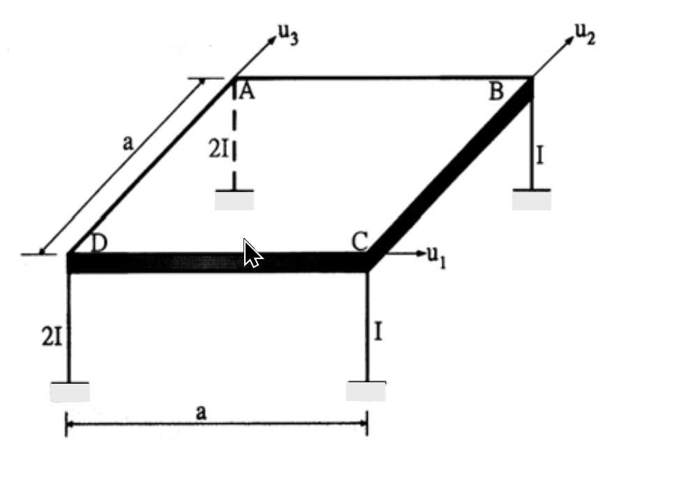

# 考題編號：SD-2003-4

**主分類：** `SD-U1` 結構動力學基礎  
**副分類：** `SD-U1-3` 多自由度系統之動態分析  
**分析方法：** MDOF 模態分析（剛性樓版 3DOF 系統）  
**標籤：** `3DOF` `剛性樓版` `勁度矩陣` `質量矩陣` `偏心` `剛心偏移` `3D框架` `立體構架` `激振向量`

---

## 1. 原始題目重述 (Problem Restatement)

如圖所示之**單層立體構架**：

- 樓版為**剛性**，質量為 $m$，均勻分佈
- 四根圓柱（楊氏係數 $E$，柱高 $h$）
- 截面二次矩：
  - 角柱 D、A（左側）：$2I$
  - 角柱 B、C（右側）：$I$
- 平面尺寸為 $a \times a$（正方形）

座標系（平面）：
- 原點：樓版幾何中心 = 質心（均勻質量）
- $x$ 軸：沿 DC 方向（東西）
- $y$ 軸：沿 DA 方向（南北）

各柱平面位置：

| 柱 | 座標 $(x_i, y_i)$ | 截面 $I_i$ |
|----|------------------|-----------|
| D | $(-a/2,\;-a/2)$ | $2I$ |
| A | $(-a/2,\;+a/2)$ | $2I$ |
| B | $(+a/2,\;+a/2)$ | $I$ |
| C | $(+a/2,\;-a/2)$ | $I$ |

DOF 定義（分量按 $u_1,u_2,u_3$ 排列）：
- $u_1$：$x$ 方向水平位移
- $u_2$：$y$ 方向水平位移
- $u_3$：繞垂直軸旋轉（扭轉，正向 = 逆時針）

地震：沿 **DB 對角方向**（$45°$），求 $\mathbf{K}$ 與 $\mathbf{M}$ 的**第二行係數**（$k_{12},k_{22},k_{32}$ 及 $m_{12},m_{22},m_{32}$）以及 $\mathbf{e}$ 向量。（20 分）

*圖說：正方形平面邊長 a，D(-a/2,-a/2)、A(-a/2,+a/2) 為 2I 柱，B(+a/2,+a/2)、C(+a/2,-a/2) 為 I 柱，地震方向沿 DB 對角（東北方向）。*

---

## 2. 考題核心精神與出題者意圖 (Core Concepts & Examiner's Intent)

本題核心：「不對稱剛性樓版（質心與剛心不重合）的 3DOF 勁度矩陣推導」

- 考驗剛性樓版三自由度系統的勁度矩陣建立能力
- 故意讓左側柱（2I）比右側柱（I）粗，製造剛心偏移，使 $K_{23} \neq 0$（y 平移與扭轉耦合）
- 質量矩陣則因均勻分佈而保持對角形式
- e 向量考驗地震激振方向的向量投影

---

## 3. 解題戰略地圖與陷阱分析 (Strategic Roadmap & Trap Analysis)

**步驟路線：**

$$\text{各柱剛度 }k_i = 12EI_i/h^3 \;\to\; K_{ij} = \sum(\text{柱剛度貢獻}) \;\to\; M_{ij}(\text{剛體質量矩陣}) \;\to\; \mathbf{e}(\text{激振投影})$$

**關鍵陷阱：**

**陷阱 1：** 圓柱截面 → $I_x = I_y$（兩方向側向剛度相同），不需分別考慮彎曲方向。若用矩形截面則 $I_x \neq I_y$。

**陷阱 2：** 剛心偏移 → $K_{23} = K_{32} \neq 0$（$y$ 平移與扭轉耦合）。但 $K_{13} = K_{31} = 0$（$x$ 方向對稱），容易漏算或誤算符號。

**陷阱 3：** 質量矩陣是**對角矩陣**（均勻分佈質量，質心在幾何中心），$m_{12}=m_{32}=0$。

**陷阱 4：** $\mathbf{e}$ 向量的旋轉分量 = 0（地震是純平移，不帶旋轉慣性力），許多考生誤加旋轉分量。

---

## 3.5 變數層次分析 (Variable Hierarchy Analysis)

> 複習提示：第一次解題後，在每個卡住的知識點旁標記 `⚠`；第二次複習時只看有 `⚠` 的項目。

### 最終目標
`建立非對稱單層立體構架的 3×3 K 矩陣與 M 矩陣，並推導地震激振向量 e`

### 本題關鍵公式（依計算順序）

$$k_i = \frac{12EI_i}{h^3} \quad \text{（兩端固定，圓柱，各方向相同）}$$

$$K_{11} = \sum k_i, \quad K_{22} = \sum k_i \quad \text{（平移勁度，因圓截面各向同性）}$$

$$K_{13} = -\sum k_i y_i, \quad K_{23} = \sum k_i x_i \quad \text{（平移-扭轉耦合）}$$

$$K_{33} = \sum k_i(x_i^2 + y_i^2) \quad \text{（扭轉勁度）}$$

$$M_{11} = M_{22} = m, \quad M_{33} = J_z = \frac{m(a^2+a^2)}{12} = \frac{ma^2}{6}$$

$$\mathbf{e} = \left\{\cos 45°,\; \sin 45°,\; 0\right\}^T = \left\{\frac{1}{\sqrt{2}},\; \frac{1}{\sqrt{2}},\; 0\right\}^T$$

### L1：題目直接給定

| 符號 | 數值 | 說明 |
|------|------|------|
| $E$ | 楊氏係數 | 材料彈性模數 |
| $h$ | 柱高 | 所有柱高相同 |
| $I_D, I_A$ | $2I$ | 左側柱截面二次矩 |
| $I_B, I_C$ | $I$ | 右側柱截面二次矩 |
| $a$ | — | 正方形平面邊長 |
| $m$ | — | 樓版總質量（均勻分佈）|
| 地震方向 | $45°$（DB 方向） | 相對於 $x$ 軸 |

### L2：需知識點推導

**柱側向剛度**

| 符號 | 公式／來源 | 卡關? |
|------|-----------|-------|
| 兩端固定柱側向剛度 | $k = 12EI/h^3$（剪力樑，兩端固定） | |
| $k_{D}=k_{A}$ | $24EI/h^3$ | |
| $k_{B}=k_{C}$ | $12EI/h^3$ | |

**勁度矩陣各元素**

| 符號 | 公式／來源 | 卡關? |
|------|-----------|-------|
| $K_{11}$ | $\sum k_i$（x 方向所有柱） | |
| $K_{22}$ | $\sum k_i$（y 方向，圓截面與 x 相同）| |
| $K_{13}$ | $-\sum k_i y_i$（y 對稱 → = 0） | |
| $K_{23}$ | $+\sum k_i x_i$（x 不對稱 → $\neq 0$） | |
| $K_{33}$ | $\sum k_i(x_i^2+y_i^2)$ | |

**質量矩陣**

| 符號 | 公式／來源 | 卡關? |
|------|-----------|-------|
| $M_{11}=M_{22}$ | $m$（平移慣性） | |
| $M_{33} = J_z$ | $m(a^2+a^2)/12 = ma^2/6$（方板轉動慣量） | |

**e 向量**

| 符號 | 公式／來源 | 卡關? |
|------|-----------|-------|
| $e_1, e_2$ | $\cos 45° = \sin 45° = 1/\sqrt{2}$ | |
| $e_3$ | $0$（純水平地震無旋轉慣性力） | |

### L3：深層知識（不懂就卡住）

| 知識點 | 說明 | 卡關? |
|--------|------|-------|
| 兩端固定柱側向剛度公式 | 剛性樓版 → 柱頂不能轉動 → 兩端固定 → $k=12EI/h^3$（非懸臂 $3EI/h^3$） | |
| 剛心偏移造成 K 矩陣非對角 | 柱勁度非對稱 → 剛心 $\neq$ 質心 → 平移產生扭轉耦合 | |
| $K_{23}$ 的符號 | 當 $u_2=1$（+y 平移），左側柱產生較大負 $x$ 方向彎矩，總力矩為負 → $K_{32} < 0$ | |
| 質量矩陣為對角矩陣的前提 | 質心與所選原點重合（本題均勻質量，質心在幾何中心）且無積質量（$M_{12}=0$） | |
| e 向量的物理意義 | 當地盤加速度 $\ddot{u}_g$ 沿某方向，各 DOF 的等效慣性激振強度，旋轉 DOF 的 $e_3=0$ | |

---

## 4. 步驟化詳細計算過程 (Step-by-Step Detailed Calculation)

### Step 1：各柱側向剛度

各柱兩端均固定（底端固定於地面，頂端由剛性樓版約束不得旋轉），因此：

$$k_i = \frac{12EI_i}{h^3}$$

令 $k \equiv \frac{12EI}{h^3}$（單位剛度），則：

| 柱 | 座標 $(x_i, y_i)$ | $I_i$ | 等效剛度 $k_i$ |
|----|-----------------|-------|--------------|
| D | $(-a/2, -a/2)$ | $2I$ | $2k$ |
| A | $(-a/2, +a/2)$ | $2I$ | $2k$ |
| B | $(+a/2, +a/2)$ | $I$  | $k$  |
| C | $(+a/2, -a/2)$ | $I$  | $k$  |

圓形截面 → $I_x = I_y = I_i$，各柱在 $x$ 和 $y$ 方向的側向剛度相同，均為 $k_i$。

### Step 2：建立勁度矩陣 $[\mathbf{K}]$

對剛性樓版 3DOF 系統（$u_1=x$, $u_2=y$, $u_3=\theta_z$），各元素定義：

$$K_{11} = \sum k_i \qquad K_{22} = \sum k_i \qquad K_{33} = \sum k_i(x_i^2 + y_i^2)$$

$$K_{13} = K_{31} = -\sum k_i y_i \qquad K_{23} = K_{32} = +\sum k_i x_i \qquad K_{12} = K_{21} = 0$$

**計算各元素：**

$$K_{11} = 2k + 2k + k + k = 6k = \frac{72EI}{h^3}$$

$$K_{22} = 2k + 2k + k + k = 6k = \frac{72EI}{h^3}$$

$$K_{13} = -\sum k_i y_i = -\!\left[2k\!\left(-\frac{a}{2}\right) + 2k\!\left(+\frac{a}{2}\right) + k\!\left(+\frac{a}{2}\right) + k\!\left(-\frac{a}{2}\right)\right]$$

$$= -\left[-ka + ka + \frac{ka}{2} - \frac{ka}{2}\right] = 0$$

**（$K_{13}=0$：$y$ 方向各柱剛度對稱，不產生 $x$-扭轉耦合）**

$$K_{23} = \sum k_i x_i = 2k\!\left(-\frac{a}{2}\right) + 2k\!\left(-\frac{a}{2}\right) + k\!\left(+\frac{a}{2}\right) + k\!\left(+\frac{a}{2}\right)$$

$$= -ka - ka + \frac{ka}{2} + \frac{ka}{2} = -ka = -\frac{12EIa}{h^3}$$

**（$K_{23}=-ka$：左側柱 $2I$ 較硬，剛心在原點左側，$y$ 平移產生負力矩，即耦合）**

$$K_{33} = \sum k_i(x_i^2 + y_i^2) = 2k\!\left[\left(\frac{a}{2}\right)^2+\left(\frac{a}{2}\right)^2\right]\times 2 + k\!\left[\left(\frac{a}{2}\right)^2+\left(\frac{a}{2}\right)^2\right]\times 2$$

$$= 2k\cdot\frac{a^2}{2}\cdot 2 + k\cdot\frac{a^2}{2}\cdot 2 = 2ka^2 + ka^2 = 3ka^2 = \frac{36EIa^2}{h^3}$$

**完整勁度矩陣：**

$$[\mathbf{K}] = \begin{bmatrix} 6k & 0 & 0 \\ 0 & 6k & -ka \\ 0 & -ka & 3ka^2 \end{bmatrix} = \frac{12EI}{h^3}\begin{bmatrix} 6 & 0 & 0 \\ 0 & 6 & -a \\ 0 & -a & 3a^2 \end{bmatrix}$$

### Step 3：驗核——剛心位置

$$x_{CR} = \frac{\sum k_i x_i}{\sum k_i} = \frac{-ka}{6k} = -\frac{a}{6}$$

$$y_{CR} = \frac{-\sum k_i y_i}{\sum k_i} = \frac{K_{13}}{K_{11}} = 0$$

剛心在 $(-a/6, 0)$，相對質心（原點）偏左 $a/6$，造成 $K_{23} \neq 0$，$K_{13}=0$。此結果與矩陣一致。

### Step 4：建立質量矩陣 $[\mathbf{M}]$

樓版質量均勻分佈在 $a \times a$ 正方形，質心在幾何中心（= 原點）：

$$M_{11} = m, \quad M_{22} = m, \quad M_{33} = J_z$$

**正方形板轉動慣量**（關於通過質心的垂直軸）：

$$J_z = \frac{m(a^2 + a^2)}{12} = \frac{ma^2}{6}$$

其餘非對角項 = 0（均勻質量，無積質量耦合）：

$$[\mathbf{M}] = \begin{bmatrix} m & 0 & 0 \\ 0 & m & 0 \\ 0 & 0 & ma^2/6 \end{bmatrix}$$

### Step 5：求 K 和 M 的第二行（Column）係數

**勁度矩陣第二行：**

$$\boxed{k_{12} = 0, \quad k_{22} = \frac{72EI}{h^3}, \quad k_{32} = -\frac{12EIa}{h^3}}$$

物理意義：令 $u_2=1$（$+y$ 方向單位位移），保持 $u_1=0,\,u_3=0$：
- 不產生 $x$ 方向力（$k_{12}=0$）
- 需施加 $+y$ 方向力 $72EI/h^3$（克服所有柱的 $y$ 向剛度）
- 需施加負力矩 $-12EIa/h^3$（因左側柱較硬，$y$ 位移產生負扭矩，需施加反向力矩平衡）

**質量矩陣第二行：**

$$\boxed{m_{12} = 0, \quad m_{22} = m, \quad m_{32} = 0}$$

物理意義：純 $y$ 平移加速度 $\ddot{u}_2$ 只產生 $y$ 方向慣性力 $m\ddot{u}_2$，無 $x$ 方向或扭轉慣性力。

### Step 6：求激振向量 e

地震方向為 **DB**：

$$\overrightarrow{DB} = B - D = \left(\frac{a}{2}-\left(-\frac{a}{2}\right),\;\frac{a}{2}-\left(-\frac{a}{2}\right)\right) = (a,\,a)$$

單位向量：$\hat{e}_{DB} = \left(\dfrac{1}{\sqrt{2}},\;\dfrac{1}{\sqrt{2}}\right)$

當地盤加速度 $\ddot{u}_g$ 沿 DB 方向，等效慣性激振（按 DOF 順序 $u_1,u_2,u_3$）：

- $e_1$（$x$ 方向分量）$= \dfrac{1}{\sqrt{2}}$
- $e_2$（$y$ 方向分量）$= \dfrac{1}{\sqrt{2}}$
- $e_3$（旋轉分量）$= 0$（純平移地震無旋轉慣性力）

$$\boxed{\mathbf{e} = \left\{\frac{1}{\sqrt{2}},\;\frac{1}{\sqrt{2}},\;0\right\}^T}$$

**驗核——運動方程式右端（第二行）：**

$$-M_{22}\,e_2\,\ddot{u}_g = -m\cdot\frac{1}{\sqrt{2}}\cdot\ddot{u}_g$$

此為 $y$ 方向慣性力，方向合理（地震在 DB 方向，$y$ 分量為 $1/\sqrt{2}$）。

---

## 5. 關鍵爭議點與進階探討 (Critical Issues & Advanced Discussion)

### 5.1 為何 $K_{13} = 0$ 但 $K_{23} \neq 0$？

關鍵在於**剛度分佈關於 $x$ 軸的對稱性**：

- 水平方向（$y$ 向分佈）：D 與 A 都在 $x=-a/2$（剛度 $2k$），B 與 C 都在 $x=+a/2$（剛度 $k$）→ **左右不對稱** → $K_{23} \neq 0$
- 垂直方向（$x$ 向分佈）：D 與 C 在 $y=-a/2$（剛度 $3k$），A 與 B 在 $y=+a/2$（剛度 $3k$）→ **上下對稱** → $K_{13} = 0$

### 5.2 e 向量與不規則性

因 $K_{23} \neq 0$，當地震沿 DB 方向（$e_1=e_2=1/\sqrt{2},\,e_3=0$），即使地震方向恰好通過質心，結構仍會因**剛心偏移**發生平扭耦合反應。此為建築耐震設計中「扭轉不規則」的典型情境。

### 5.3 若要寫出完整 $3\times 3$ K 矩陣

$$[\mathbf{K}] = \frac{12EI}{h^3}\begin{bmatrix} 6 & 0 & 0 \\ 0 & 6 & -a \\ 0 & -a & 3a^2 \end{bmatrix}$$

可見 $K$ 是對稱矩陣（$K_{23}=K_{32}$），且 $x$ 方向（第一列/行）與其他 DOF 完全解耦，因此 $u_1$ 可獨立求解，扭轉耦合僅發生在 $(u_2, u_3)$ 子系統中。
