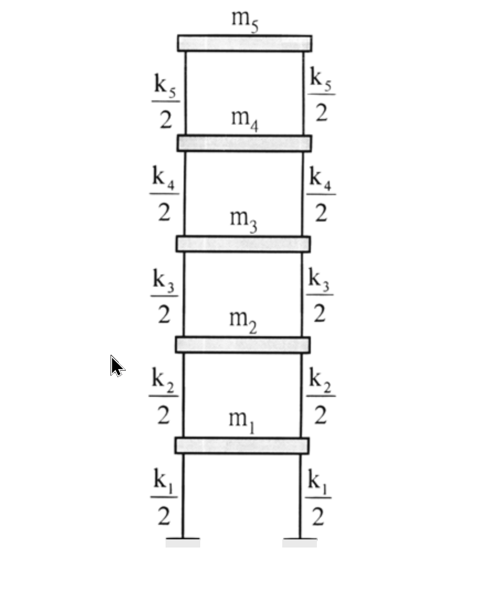

# 考題編號：SD-2003-5

**主分類：** `SD-U1` 結構動力學基礎  
**副分類：** `SD-U1-3` 多自由度系統之動態分析  
**分析方法：** MDOF 模態分析（Rayleigh 法求基本週期 + 有效質量）  
**標籤：** `Rayleigh法` `基本週期` `有效質量` `模態參與質量` `剪力屋架` `樓層剪力` `模態分析`

---

## 1. 原始題目重述 (Problem Restatement)

**五層剪力屋架：**

- 各層樓版質量：$m_i = 5000\,\text{kg}$（$i=1\sim5$，均相等）
- 樓層勁度：
  - $k_1 = k_2 = 5\times10^6\,\text{N/m}$
  - $k_3 = k_4 = k_5 = 3\times10^6\,\text{N/m}$
- 已知**層間變位（interstory drift）**：

| 層 | 層間變位 $\delta_i$ |
|----|------------------|
| 1 | $6\,\text{mm}$ |
| 2 | $5.6\,\text{mm}$ |
| 3 | $8\,\text{mm}$ |
| 4 | $6\,\text{mm}$ |
| 5 | $3.333\,\text{mm}$ $\left(=\frac{10}{3}\,\text{mm}\right)$ |

**求：**
1. 產生此層間變位的**側力** $F_i$
2. 用 Rayleigh 法求**基本振動週期** $T_1$
3. 以此變形近似第一振態，求**有效質量** $m_{eff}$

*圖說：五層剪力屋架，柱質量不計，各層樓版以彈簧 $k_i/2$（左右各一）代表層勁度，合計 $k_i$。*

---

## 2. 考題核心精神與出題者意圖 (Core Concepts & Examiner's Intent)

本題核心：「從給定變形形狀出發，應用 Rayleigh 法估算基本週期與有效質量」

- **側力計算**：考驗從層間剪力回推各樓層側力的能力（平衡方程）
- **Rayleigh 法**：給定位移形狀 → 計算 Rayleigh 商 → 估算 $\omega_1$（上界估計）
- **有效質量**：考驗模態參與質量的計算，連結至反應譜分析中的「模態貢獻比例」

**出題者設計巧思：** $\delta_5 = 10/3\,\text{mm}$ 使第五層剪力恰好為整數 $V_5 = 10\,\text{kN}$，各樓層側力形成等差數列 $2,4,6,8,10\,\text{kN}$，暗示答案可以自我驗算。

---

## 3. 解題戰略地圖與陷阱分析 (Strategic Roadmap & Trap Analysis)

**步驟路線：**

$$\delta_i \xrightarrow{\times k_i} V_i(\text{層間剪力}) \xrightarrow{\Delta V} F_i(\text{層側力}) \xrightarrow{+\delta_i} u_i(\text{絕對位移}) \xrightarrow{\text{Rayleigh商}} T_1,\;m_{eff}$$

**關鍵陷阱：**

**陷阱 1：** 混淆「層間變位 $\delta_i$」（相對位移）與「樓層位移 $u_i$」（絕對位移）。Rayleigh 法需用**絕對位移** $u_i = \sum_{j=1}^{i}\delta_j$，而非層間變位 $\delta_i$。

**陷阱 2：** 樓層側力 $F_i \neq k_i\delta_i$。$k_i\delta_i = V_i$（層剪力），$F_i = V_i - V_{i+1}$（各層側力由相鄰剪力差得到），最頂層 $F_5 = V_5$。

**陷阱 3：** Rayleigh 法公式中，分子分母單位要一致（N·m 和 kg·m² 分別計算 $\omega^2$），不可混用 mm 和 m。

**陷阱 4：** 有效質量公式為 $m_{eff} = (\sum m_i u_i)^2 / \sum m_i u_i^2$，分子為**一次方**再平方，不是 $(\sum m_i u_i^2)^2$。

---

## 3.5 變數層次分析 (Variable Hierarchy Analysis)

> 複習提示：第一次解題後，在每個卡住的知識點旁標記 `⚠`；第二次複習時只看有 `⚠` 的項目。

### 最終目標
`從層間變位求側力、基本週期 T₁（Rayleigh 法）、有效質量 m_eff`

### 本題關鍵公式（依計算順序）

$$V_i = k_i \cdot \delta_i \quad \text{（層剪力 = 層勁度 × 層間變位）}$$

$$F_i = V_i - V_{i+1}\;(i<5), \quad F_5 = V_5 \quad \text{（各層側力）}$$

$$u_i = \sum_{j=1}^{i} \delta_j \quad \text{（絕對樓層位移）}$$

$$\omega_1^2 \approx \frac{\sum_{i=1}^{5} F_i u_i}{\sum_{i=1}^{5} m_i u_i^2} \quad \text{（Rayleigh 商，}\omega_1^2\text{ 的上界）}$$

$$\boxed{T_1 = 2\pi\sqrt{\frac{\sum m_i u_i^2}{\sum F_i u_i}}}$$

$$\boxed{m_{eff} = \frac{\left(\sum_{i=1}^{5} m_i u_i\right)^2}{\sum_{i=1}^{5} m_i u_i^2}}$$

### L1：題目直接給定

| 符號 | 數值 | 說明 |
|------|------|------|
| $m_i$ | $5000\,\text{kg}$（全層） | 各層樓版質量 |
| $k_1, k_2$ | $5\times10^6\,\text{N/m}$ | 下兩層勁度 |
| $k_3,k_4,k_5$ | $3\times10^6\,\text{N/m}$ | 上三層勁度 |
| $\delta_1$ | $6\,\text{mm}$ | 第一層層間變位 |
| $\delta_2$ | $5.6\,\text{mm}$ | 第二層層間變位 |
| $\delta_3$ | $8\,\text{mm}$ | 第三層層間變位 |
| $\delta_4$ | $6\,\text{mm}$ | 第四層層間變位 |
| $\delta_5$ | $10/3\,\text{mm}$ | 第五層層間變位 |

### L2：需知識點推導

**Step 1 – 層剪力與層側力**

| 符號 | 公式／來源 | 卡關? |
|------|-----------|-------|
| $V_i$ | $k_i \delta_i$ | |
| $F_i$ | $V_i - V_{i+1}$（頂層 $F_5 = V_5$） | |

**Step 2 – 絕對位移**

| 符號 | 公式／來源 | 卡關? |
|------|-----------|-------|
| $u_i$ | $\sum_{j=1}^{i}\delta_j$（層間變位累加） | |

**Step 3 – Rayleigh 商**

| 符號 | 公式／來源 | 卡關? |
|------|-----------|-------|
| $\sum F_i u_i$ | 各層側力 × 對應位移之和 | |
| $\sum m_i u_i^2$ | 各層質量 × 位移平方之和 | |
| $T_1$ | $2\pi\sqrt{\sum m_i u_i^2 / \sum F_i u_i}$ | |

**Step 4 – 有效質量**

| 符號 | 公式／來源 | 卡關? |
|------|-----------|-------|
| $\sum m_i u_i$ | 各層質量 × 位移之和 | |
| $m_{eff}$ | $(\sum m_i u_i)^2 / \sum m_i u_i^2$ | |

### L3：深層知識（不懂就卡住）

| 知識點 | 說明 | 卡關? |
|--------|------|-------|
| Rayleigh 商是 $\omega^2$ 的上界 | 任意假設的形狀必定高估頻率（下估週期），只有真實振態形狀時等號成立 | |
| 有效質量 vs 廣義質量 | 廣義質量 $M^* = \boldsymbol{\phi}^T\mathbf{M}\boldsymbol{\phi}$（視正規化方式而定）；有效質量與正規化無關，是絕對量 | |
| 有效質量的物理意義 | 地震時第一振態「感受到」的等效 SDOF 質量，$V_{base} = m_{eff} \cdot S_a$ | |
| 五層總有效質量比 | $\sum$ 所有振態有效質量 $= m_{total}$；第一振態占比應 > 70%（為常見驗核） | |

---

## 4. 步驟化詳細計算過程 (Step-by-Step Detailed Calculation)

### Step 1：計算各層剪力

$$V_i = k_i \cdot \delta_i$$

| 層 | $k_i$ (N/m) | $\delta_i$ (mm) | $V_i = k_i\delta_i$ (N) |
|----|------------|----------------|------------------------|
| 1 | $5\times10^6$ | $6$ | $30{,}000$ |
| 2 | $5\times10^6$ | $5.6$ | $28{,}000$ |
| 3 | $3\times10^6$ | $8$ | $24{,}000$ |
| 4 | $3\times10^6$ | $6$ | $18{,}000$ |
| 5 | $3\times10^6$ | $10/3$ | $10{,}000$（精確值）|

**驗核：** $V_5 = 3\times10^6 \times (10/3)\times10^{-3} = 3\times10^6 \times 10/3000 = 10{,}000\,\text{N}$ ✓

### Step 2：計算各層側力

$$F_i = V_i - V_{i+1}, \quad F_5 = V_5$$

| 層 | $V_i$ (kN) | $V_{i+1}$ (kN) | $F_i$ (kN) |
|----|-----------|---------------|-----------|
| 1 | $30$ | $28$ | $\mathbf{2}$ |
| 2 | $28$ | $24$ | $\mathbf{4}$ |
| 3 | $24$ | $18$ | $\mathbf{6}$ |
| 4 | $18$ | $10$ | $\mathbf{8}$ |
| 5 | $10$ | — | $\mathbf{10}$ |

$$\boxed{F_1 = 2\,\text{kN},\; F_2 = 4\,\text{kN},\; F_3 = 6\,\text{kN},\; F_4 = 8\,\text{kN},\; F_5 = 10\,\text{kN}}$$

**驗核：** $\sum F_i = 2+4+6+8+10 = 30\,\text{kN} = V_1$ ✓（基底剪力守恆）

**觀察：** 側力形成等差數列（1:2:3:4:5），為「正三角形」分佈（與反應譜法第一振態倒三角形相反），反映此變形形狀的高振態特性。

### Step 3：計算絕對樓層位移

$$u_i = \sum_{j=1}^{i}\delta_j$$

| 樓層 $i$ | 計算 | $u_i$ (mm) |
|---------|------|-----------|
| 1 | $\delta_1 = 6$ | $6.000$ |
| 2 | $6 + 5.6$ | $11.600$ |
| 3 | $11.6 + 8$ | $19.600$ |
| 4 | $19.6 + 6$ | $25.600$ |
| 5 | $25.6 + 10/3$ | $434/15 \approx 28.933$ |

### Step 4：Rayleigh 法求基本週期

$$T_1 = 2\pi\sqrt{\frac{\sum m_i u_i^2}{\sum F_i u_i}}$$

**計算分子 $\sum F_i u_i$（單位：N·m）：**

| $i$ | $F_i$ (N) | $u_i$ (m) | $F_i u_i$ (N·m) |
|-----|----------|----------|-----------------|
| 1 | $2{,}000$ | $0.0060$ | $12.000$ |
| 2 | $4{,}000$ | $0.0116$ | $46.400$ |
| 3 | $6{,}000$ | $0.0196$ | $117.600$ |
| 4 | $8{,}000$ | $0.0256$ | $204.800$ |
| 5 | $10{,}000$ | $434/15000$ | $289.333$ |

$$\sum F_i u_i = 12.000 + 46.400 + 117.600 + 204.800 + 289.333 = 670.133\,\text{N·m}$$

**計算分母 $\sum m_i u_i^2$（單位：kg·m²）：**

| $i$ | $u_i^2$ (mm²) | $m_i u_i^2$ (kg·mm²) |
|-----|--------------|---------------------|
| 1 | $36.000$ | $180{,}000$ |
| 2 | $134.560$ | $672{,}800$ |
| 3 | $384.160$ | $1{,}920{,}800$ |
| 4 | $655.360$ | $3{,}276{,}800$ |
| 5 | $(434/15)^2 \approx 837.14$ | $4{,}185{,}688$ |

$$\sum m_i u_i^2 = 5000\times(36.000+134.560+384.160+655.360+837.138)\times10^{-6}\,\text{m}^2$$

$$= 5000\times 2047.22\times10^{-6} = 10.236\,\text{kg·m}^2$$

**計算自然角頻率：**

$$\omega_1^2 = \frac{\sum F_i u_i}{\sum m_i u_i^2} = \frac{670.133}{10.236} = 65.47\,\text{rad}^2/\text{s}^2$$

$$\omega_1 = \sqrt{65.47} = 8.092\,\text{rad/s}$$

$$\boxed{T_1 = \frac{2\pi}{\omega_1} = \frac{2\pi}{8.092} \approx 0.776\,\text{s}}$$

> **提醒：** Rayleigh 法給出 $\omega^2$ 的**上界**（$T$ 的下界），真實基本週期略大於 0.776 s。

### Step 5：計算有效質量

$$m_{eff} = \frac{\left(\displaystyle\sum_{i=1}^{5} m_i u_i\right)^2}{\displaystyle\sum_{i=1}^{5} m_i u_i^2}$$

**計算 $\sum m_i u_i$：**

$$\sum m_i u_i = 5000\times(6.000+11.600+19.600+25.600+28.933)\times10^{-3}$$

$$= 5000\times 91.733\times10^{-3} = 458.67\,\text{kg·m}$$

**代入公式：**

$$m_{eff} = \frac{(458.67)^2}{10.236} = \frac{210{,}377}{10.236} \approx 20{,}554\,\text{kg}$$

$$\boxed{m_{eff} \approx 20{,}554\,\text{kg}}$$

**有效質量比：**

$$\frac{m_{eff}}{m_{total}} = \frac{20{,}554}{5\times5000} = \frac{20{,}554}{25{,}000} \approx 82.2\%$$

---

## 5. 關鍵爭議點與進階探討 (Critical Issues & Advanced Discussion)

### 5.1 Rayleigh 法的誤差來源

本題給定的變形形狀並非精確的第一振態（側力為正三角形分佈，對應較高頻率），因此 Rayleigh 商給出的 $\omega_1^2 = 65.47$ 是真實 $\omega_1^2$ 的**上界**，即實際基本週期 $T_1 > 0.776\,\text{s}$。

提升精度的方法：以此變形施加靜力求得新的位移形狀，再迭代（**矩陣迭代法**或**次迭代法**），直到收斂。

### 5.2 有效質量的物理意義與工程應用

有效質量 $m_{eff} \approx 20{,}554\,\text{kg}$（占 82.2%）的含義：

$$V_{base,1} = m_{eff}\cdot S_a(T_1) = 20{,}554\times S_a(0.776\,\text{s})$$

若多模態反應譜分析需確認振態個數，應選取足夠振態使**累積有效質量 $\geq 90\%\times 25{,}000 = 22{,}500\,\text{kg}$**。本題第一振態只占 82.2%，需加入第二振態才能達標。

### 5.3 驗核：總有效質量守恆

所有振態的有效質量之和等於總質量：

$$\sum_{n=1}^{5} m_{eff,n} = m_{total} = 25{,}000\,\text{kg}$$

本題第一振態 $m_{eff,1} \approx 20{,}554\,\text{kg}$，其餘四個振態共分擔 $\approx 4{,}446\,\text{kg}$（約 17.8%）。
