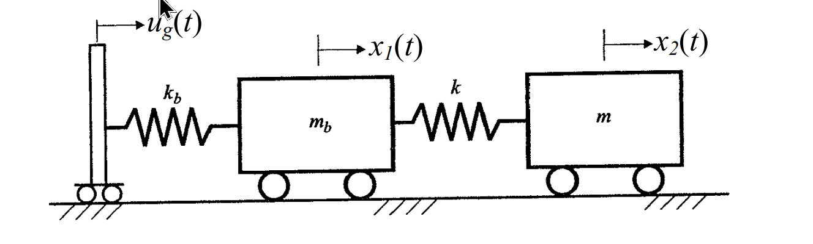

# 考題編號：SD-2004-2

**主分類：** `SD-U3-2` 隔減震原理  
**副分類：** `SD-U1-2` 運動方程式推導；`SD-U1-3` 單自由度、多自由度系統之動態分析及應用  
**分析方法：** 隔震結構運動方程式推導（2DOF → SDOF 化簡，mb = 0 靜態束制法）  
**標籤：** `基礎隔震` `2DOF` `SDOF化簡` `運動方程式` `串聯彈簧` `等效勁度` `自然振動周期` `mb=0靜態束制` `相對位移座標`

---

## 1. 原始題目重述 (Problem Restatement)

下圖所示為一個隔震結構的簡化模型：
- $m_b$、$k_b$：隔震層（isolation layer）之質量及勁度
- $m$、$k$：上部結構之質量及勁度
- $u_g(t)$：地震位移輸入（地面絕對位移）
- $x_1(t)$：隔震層質量 $m_b$ 的絕對位移
- $x_2(t)$：上部結構質量 $m$ 的絕對位移

**系統配置（由左至右）：**

$$\text{地面}(u_g) \xrightarrow{k_b} m_b(x_1) \xrightarrow{k} m(x_2)$$

**假設：** 隔震層質量甚小，近似為零，即 $m_b = 0$

**要求：**
1. 推導該隔震結構之運動方程式（化簡為單自由度）
2. 求出自然振動周期（以 $m$、$k$、$k_b$ 表示）



*圖說：左側地面作水平位移 $u_g(t)$ 輸入，隔震層彈簧 $k_b$ 連接地面與質量 $m_b$（位置 $x_1$），結構彈簧 $k$ 連接 $m_b$ 與結構質量 $m$（位置 $x_2$），三者均在水平方向排列，底部為滑動支承。*

---

## 2. 考題核心精神與出題者意圖 (Core Concepts & Examiner's Intent)

**核心觀念：** 隔震系統本質上是「串聯彈簧」，隔震層勁度與結構勁度串聯後形成等效勁度，決定隔震後的整體周期。

**出題者意圖：**
1. 考查考生能否由 2DOF 系統方程式，利用 $m_b = 0$ 的靜態束制條件，正確推導出等效 SDOF 系統
2. 驗證考生是否理解「隔震延長周期」的物理機制：隔震勁度 $k_b \ll k$ → 等效勁度 $k_{eq} \approx k_b$ → 周期大幅延長

**關鍵陷阱：**
- ⚠ $m_b = 0$ 並非讓第一個方程式消失，而是提供一個**靜態束制方程式**（static constraint），用來消去自由度 $x_1$
- ⚠ 最終的自然振動周期以「串聯彈簧等效勁度」表達，而非單純的 $k$ 或 $k_b$
- ⚠ 地震輸入 $u_g(t)$ 是位移（非加速度），推導運動方程式時需取兩次微分

---

## 3. 解題戰略地圖與陷阱分析 (Strategic Roadmap & Trap Analysis)

**作戰計畫：**

```
Step 1：建立 2DOF 系統的自由體圖，寫出兩個運動方程式
Step 2：代入 mb = 0，從第一個方程式取得靜態束制關係
Step 3：利用束制關係消去 x1，代入第二個方程式
Step 4：整理為標準 SDOF 形式，辨識等效勁度 keq
Step 5：求自然振動周期 T = 2π√(m/keq)
```

**關鍵陷阱：**

1. ⚠ **彈簧力方向判斷**：$k_b$ 的恢復力為 $-k_b(x_1 - u_g)$，而非 $-k_b \cdot x_1$，地震輸入是位移！
2. ⚠ **束制方程式的意義**：$m_b = 0$ 使 $m_b \ddot{x}_1 = 0$，即隔震層無慣性力，彈力靜態平衡
3. ⚠ **等效勁度的物理意義**：$k_{eq} = k_b k/(k_b + k)$ 是串聯彈簧，$k_b \ll k$ 時 $k_{eq} \approx k_b$

---

## 3.5 變數層次分析 (Variable Hierarchy Analysis)

> 複習提示：第一次解題後，在每個卡住的知識點旁標記 `⚠`；第二次複習時只看有 `⚠` 的項目。

### 最終目標
求隔震結構（$m_b = 0$ 條件下）的等效 SDOF 運動方程式，及自然振動周期 $T = f(m, k, k_b)$。

### 本題關鍵公式（依計算順序）

$$\text{Step 1：} \quad m_b \ddot{x}_1 = -k_b(x_1 - u_g) + k(x_2 - x_1)$$

$$\text{Step 2：} \quad m \ddot{x}_2 = -k(x_2 - x_1)$$

$$\text{Step 3 (mb=0)：} \quad 0 = -k_b(x_1 - u_g) + k(x_2 - x_1) \quad \text{（束制方程式）}$$

$$\text{Step 4：} \quad x_2 - x_1 = \frac{k_b}{k_b + k}(x_2 - u_g) \quad \Rightarrow \quad k(x_2 - x_1) = \frac{k \cdot k_b}{k+k_b}(x_2 - u_g)$$

$$\text{Step 5：} \quad m\ddot{v}_2 + \boxed{k_{eq}} \cdot v_2 = -m\ddot{u}_g, \quad k_{eq} = \frac{k \cdot k_b}{k + k_b}$$

$$\text{Step 6：} \quad T = 2\pi\sqrt{\frac{m}{\boxed{k_{eq}}}} = 2\pi\sqrt{\frac{m(k + k_b)}{k \cdot k_b}}$$

### L1：題目直接給定

| 符號 | 數值 | 說明 |
|------|------|------|
| $m_b$ | $= 0$ | 隔震層質量（題目假設） |
| $m$ | $m$ | 上部結構質量 |
| $k_b$ | $k_b$ | 隔震層勁度（水平彈簧） |
| $k$ | $k$ | 上部結構勁度（水平彈簧） |
| $u_g(t)$ | 位移輸入 | 地面絕對位移歷時 |
| $x_1(t)$ | 絕對位移 | 隔震層位置 |
| $x_2(t)$ | 絕對位移 | 上部結構質量位置 |

### L2：需知識點推導

**建立自由體圖與運動方程式**

| 符號 | 公式／來源 | 卡關? |
|------|---------|------|
| $m_b$ 的運動方程式 | $m_b\ddot{x}_1 = -k_b(x_1-u_g) + k(x_2-x_1)$ | |
| $m$ 的運動方程式 | $m\ddot{x}_2 = -k(x_2-x_1)$ | |

**代入 $m_b = 0$，取得束制方程式**

| 符號 | 公式／來源 | 卡關? |
|------|---------|------|
| 束制關係 | $k_b(x_1 - u_g) = k(x_2 - x_1)$ | |
| 求解 $x_1$ | $x_1 = \dfrac{k_b u_g + k x_2}{k_b + k}$ | |
| 代換彈力 | $k(x_2 - x_1) = \dfrac{k \cdot k_b}{k + k_b}(x_2 - u_g)$ | |

**化簡為 SDOF，求等效勁度與周期**

| 符號 | 公式／來源 | 卡關? |
|------|---------|------|
| 等效勁度 | $k_{eq} = \dfrac{k \cdot k_b}{k + k_b}$（串聯彈簧公式） | |
| SDOF 方程式 | $m\ddot{v}_2 + k_{eq} v_2 = -m\ddot{u}_g$，$v_2 = x_2 - u_g$ | |
| 自然頻率 | $\omega_n = \sqrt{k_{eq}/m}$ | |
| 自然振動周期 | $T = 2\pi/\omega_n = 2\pi\sqrt{m(k+k_b)/(k \cdot k_b)}$ | |

### L3：深層知識（不懂就卡住）

| 知識點 | 說明 | 卡關? |
|--------|------|------|
| $m_b=0$ 的物理意義 | 隔震層無慣性力，兩端彈力即時靜態平衡，提供束制而非方程式消去 | |
| 串聯彈簧等效勁度 | $1/k_{eq} = 1/k + 1/k_b$，等效勁度小於任一單一勁度 | |
| 相對位移座標 | 定義 $v_2 = x_2 - u_g$，使方程式右側成為標準地震力項 $-m\ddot{u}_g$ | |
| 隔震延長周期原理 | $k_b \ll k$ 時 $k_{eq} \approx k_b$，$T \approx 2\pi\sqrt{m/k_b} \gg T_{structure}$ | |

---

## 4. 步驟化詳細計算過程 (Step-by-Step Detailed Calculation)

### Step 1：建立自由體圖，寫出 2DOF 運動方程式

對質量 $m_b$（隔震層，位移 $x_1$）進行受力分析（向右為正）：
- $k_b$ 彈簧對 $m_b$ 的恢復力：$-k_b(x_1 - u_g)$（$x_1 > u_g$ 時向左）
- $k$ 彈簧對 $m_b$ 的力：$+k(x_2 - x_1)$（$x_2 > x_1$ 時向右）

$$m_b \ddot{x}_1 = -k_b(x_1 - u_g) + k(x_2 - x_1) \tag{1}$$

對質量 $m$（上部結構，位移 $x_2$）進行受力分析：
- $k$ 彈簧對 $m$ 的恢復力：$-k(x_2 - x_1)$

$$m \ddot{x}_2 = -k(x_2 - x_1) \tag{2}$$

### Step 2：代入 $m_b = 0$，取得靜態束制方程式

將 $m_b = 0$ 代入式(1)：

$$0 = -k_b(x_1 - u_g) + k(x_2 - x_1)$$

整理得**靜態束制方程式**：

$$k_b(x_1 - u_g) = k(x_2 - x_1) \tag{3}$$

**物理意義：** 隔震層無質量（無慣性），故兩端彈簧力即時平衡——左側 $k_b$ 彈力 = 右側 $k$ 彈力。

### Step 3：由束制方程式消去 $x_1$

由式(3)展開：

$$k_b x_1 - k_b u_g = k x_2 - k x_1$$
$$(k_b + k)x_1 = k x_2 + k_b u_g$$
$$x_1 = \frac{k x_2 + k_b u_g}{k_b + k} \tag{4}$$

計算式(2)中的彈力項 $k(x_2 - x_1)$：

$$x_2 - x_1 = x_2 - \frac{k x_2 + k_b u_g}{k_b + k} = \frac{(k_b + k)x_2 - k x_2 - k_b u_g}{k_b + k} = \frac{k_b(x_2 - u_g)}{k_b + k}$$

因此：

$$k(x_2 - x_1) = \frac{k \cdot k_b}{k + k_b}(x_2 - u_g) \tag{5}$$

### Step 4：代入式(2)，化簡為 SDOF

將式(5)代入式(2)：

$$m \ddot{x}_2 = -\frac{k \cdot k_b}{k + k_b}(x_2 - u_g)$$

定義相對位移 $v_2 = x_2 - u_g$（上部結構相對於地面的位移），則 $x_2 = v_2 + u_g$：

$$m(\ddot{v}_2 + \ddot{u}_g) = -\frac{k \cdot k_b}{k + k_b} \cdot v_2$$

移項整理，定義**等效勁度**：

$$k_{eq} = \frac{k \cdot k_b}{k + k_b} \quad \text{（} k \text{ 與 } k_b \text{ 串聯彈簧）}$$

$$\boxed{m \ddot{v}_2 + k_{eq} \cdot v_2 = -m \ddot{u}_g(t)} \tag{6}$$

> **策略註解：** 式(6)即為標準 SDOF 地震反應方程式，形式與單一彈簧-質量系統相同，等效勁度 $k_{eq}$ 為 $k$ 與 $k_b$ 串聯之結果。

### Step 5：求自然振動周期

由式(6)，自然圓頻率：

$$\omega_n = \sqrt{\frac{k_{eq}}{m}} = \sqrt{\frac{k \cdot k_b}{m(k + k_b)}}$$

自然振動周期：

$$\boxed{T = \frac{2\pi}{\omega_n} = 2\pi\sqrt{\frac{m(k + k_b)}{k \cdot k_b}}}$$

亦可改寫為：

$$T = 2\pi\sqrt{\frac{m}{k_{eq}}}, \quad k_{eq} = \frac{k \cdot k_b}{k + k_b}$$

### 物理驗證

| 極限情況 | $k_{eq}$ | 周期 $T$ | 物理意義 |
|---------|---------|---------|---------|
| $k_b \gg k$（隔震層極硬） | $k_{eq} \approx k$ | $T \approx 2\pi\sqrt{m/k}$ | 退化為原結構周期 ✓ |
| $k_b \ll k$（隔震層極軟） | $k_{eq} \approx k_b$ | $T \approx 2\pi\sqrt{m/k_b} \gg T_{str}$ | 隔震效果顯著，周期大幅延長 ✓ |
| $k_b = k$ | $k_{eq} = k/2$ | $T = \sqrt{2} \cdot T_{str}$ | 周期延長 $\sqrt{2}$ 倍 ✓ |

---

## 5. 關鍵爭議點與進階探討 (Critical Issues & Advanced Discussion)

**本題未要求阻尼，實際隔震設計需加入阻尼**

實際隔震系統中，隔震支承（LRB、FPS、HDRB 等）均具有等效阻尼 $c_b$，運動方程式應為：

$$m\ddot{v}_2 + c_{eq}\dot{v}_2 + k_{eq} v_2 = -m\ddot{u}_g(t)$$

其中 $c_{eq}$ 為等效阻尼係數，等效阻尼比 $\xi_{eq} = c_{eq}/(2m\omega_n)$ 通常為 10~25%。

**本題 $x_1$（隔震層位移）也是重要設計量**

本題化簡後只追蹤 $x_2$，但隔震溝設計需要知道 $x_1$ 的最大位移：

$$x_1 - u_g = \frac{k}{k+k_b}(x_2 - u_g) = \frac{k}{k+k_b} v_2$$

隔震層相對位移（隔震支承設計位移）：

$$x_2 - x_1 = \frac{k_b}{k+k_b} v_2$$

當 $k_b \ll k$ 時，$x_2 - x_1 \approx v_2$，即隔震變形承擔了幾乎全部的地震相對位移。

**與實際隔震規範的連結**

台灣建築耐震設計規範中，隔震系統的設計位移：

$$D_D = \frac{g \cdot S_{D1} \cdot T_{IS}}{4\pi^2 \cdot B_D}$$

其中 $T_{IS}$ 對應本題的 $T = 2\pi\sqrt{m/k_{eq}}$，$B_D$ 為阻尼修正係數。
