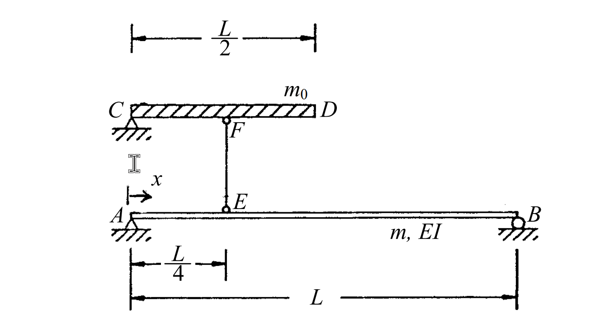

# 考題編號：SD-2004-3

**主分類：** `SD-U1-2` 運動方程式推導  
**副分類：** `SD-U1-3` 單自由度、多自由度系統之動態分析及應用  
**分析方法：** Ritz 法（廣義座標法）：指定形函數 φ(x) = sin(πx/L)，對複合系統（彈性梁 + 剛性桿）求廣義質量與廣義勁度  
**標籤：** `廣義質量` `廣義勁度` `Ritz法` `廣義座標` `形函數` `簡支梁` `剛性桿` `連續體` `分佈質量` `集中質量`

---

## 1. 原始題目重述 (Problem Restatement)

**系統描述：**
- **AB**：彈性梁，長度 $L$，斷面撓曲勁度 $EI$，單位長度質量 $m$（簡支於 A、B 兩端）
- **EF**：垂直剛性桿，質量可忽略；E 在梁 AB 上距 A 為 $L/4$ 處，F 在頂端
- **CD**：水平剛性桿，總長 $L/2$，單位長度質量 $m_0$；F 為 CD 之中點（即 C、D 分別在 F 左右各 $L/4$）

**幾何配置：**

```
     ←────── L/2 ──────→
     C ██████ F ██████ D        ← 剛性桿 CD，單位長度質量 m₀
                │
                │ EF（剛性，無質量）
                │
     A──────E────────────────B  ← 彈性梁 AB，單位長度質量 m，EI
        ←L/4→←──────── L ──────→
```

**假設位移場：**

$$v(x, t) = \phi(x) \cdot Z(t), \quad \phi(x) = \sin\!\left(\frac{\pi x}{L}\right)$$

$Z(t)$ 為廣義座標。

**要求：** 求廣義質量 $m^*$（generalized mass）及廣義勁度 $k^*$（generalized stiffness）。



*圖說：A（左，簡支）至 B（右，簡支），梁長 L。在 x = L/4 處有垂直剛性桿 EF 向上連接至水平剛性桿 CD 中點 F。CD 總長 L/2，C 在最左，D 在最右，CD 單位長度質量為 m₀，EF 無質量。*

---

## 2. 考題核心精神與出題者意圖 (Core Concepts & Examiner's Intent)

**核心觀念：** 廣義座標法（Ritz 法）將連續體系統降維為單自由度，廣義質量和廣義勁度分別由系統的動能和應變能對廣義座標 $Z$ 取變分而得。

**出題者意圖：**
1. 考查考生能否正確計算「複合系統」的廣義質量——彈性梁的分佈質量與剛性桿的分佈質量需分開積分，再相加
2. 考查廣義勁度的計算——只有彈性構件（梁 AB）貢獻彈性應變能，剛性桿（EF、CD）不貢獻勁度
3. 考查形函數的幾何傳遞：E 在 $x = L/4$，所以 CD 的運動幅度為 $\phi(L/4) = \sin(\pi/4) = \frac{\sqrt{2}}{2}$

**關鍵陷阱：**
- ⚠ **CD 的廣義位移不是 $Z(t)$**，而是 $\phi(L/4) \cdot Z(t)$——因為 EF 為剛性，CD 的位移等於 E 點的梁撓度
- ⚠ **EF 和 CD 不貢獻廣義勁度**（剛性桿無彈性應變能）
- ⚠ $\int_0^L \sin^2(\pi x / L)\, dx = L/2$，這是必備積分公式

---

## 3. 解題戰略地圖與陷阱分析 (Strategic Roadmap & Trap Analysis)

**作戰計畫：**

```
Step 1：確認幾何——CD 的位移 = φ(L/4)·Z(t)（透過剛性桿 EF 傳遞）
Step 2：廣義質量
       m*_AB = ∫₀ᴸ m·[φ(x)]² dx = m·L/2
       m*_CD = m₀·(L/2)·[φ(L/4)]² = m₀·(L/2)·(1/2) = m₀L/4
       m* = m*_AB + m*_CD
Step 3：廣義勁度（只有 AB 梁貢獻）
       k* = ∫₀ᴸ EI·[φ''(x)]² dx
       φ''(x) = -(π/L)² sin(πx/L)
       k* = EI·(π/L)⁴·L/2 = π⁴EI/(2L³)
```

**關鍵陷阱分析：**

1. ⚠ **形函數傳遞**：EF 為剛性，E 點位移 = F 點位移。CD 為剛性水平桿，整根 CD 做同樣的垂直平移，位移幅度均為 $\phi(L/4) = \sin(\pi/4) = \sqrt{2}/2$
2. ⚠ **剛性桿不貢獻勁度**：EF、CD 均為剛性，無彈性變形，應變能為零
3. ⚠ $\sin^2(\pi/4) = 1/2$（注意不是 $\sqrt{2}/2$，要取平方！）

---

## 3.5 變數層次分析 (Variable Hierarchy Analysis)

> 複習提示：第一次解題後，在每個卡住的知識點旁標記 `⚠`；第二次複習時只看有 `⚠` 的項目。

### 最終目標
求廣義質量 $m^*$ 與廣義勁度 $k^*$（以 $m$、$m_0$、$L$、$EI$ 表示）。

### 本題關鍵公式（依計算順序）

$$\text{Step 1：} \quad v(x,t) = \sin\!\left(\frac{\pi x}{L}\right) Z(t), \quad \phi(L/4) = \sin\!\left(\frac{\pi}{4}\right) = \frac{\sqrt{2}}{2}$$

$$\text{Step 2：} \quad m^*_{AB} = \int_0^L m\,\phi^2(x)\,dx = m\int_0^L \sin^2\!\left(\frac{\pi x}{L}\right)dx = \frac{mL}{2}$$

$$\text{Step 3：} \quad m^*_{CD} = m_0 \cdot \frac{L}{2} \cdot \left[\phi\!\left(\frac{L}{4}\right)\right]^2 = m_0 \cdot \frac{L}{2} \cdot \frac{1}{2} = \frac{m_0 L}{4}$$

$$\text{Step 4：} \quad m^* = m^*_{AB} + m^*_{CD} = \frac{mL}{2} + \frac{m_0 L}{4}$$

$$\text{Step 5：} \quad \phi''(x) = -\left(\frac{\pi}{L}\right)^2 \sin\!\left(\frac{\pi x}{L}\right)$$

$$\text{Step 6：} \quad k^* = \int_0^L EI\,[\phi''(x)]^2\,dx = EI\cdot\left(\frac{\pi}{L}\right)^4 \cdot \frac{L}{2} = \frac{\pi^4 EI}{2L^3}$$

### L1：題目直接給定

| 符號 | 數值 | 說明 |
|------|------|------|
| $\phi(x)$ | $\sin(\pi x / L)$ | 形函數（已給定） |
| $m$ | $m$ | AB 梁單位長度質量 |
| $m_0$ | $m_0$ | CD 桿單位長度質量 |
| $EI$ | $EI$ | AB 梁斷面撓曲勁度 |
| $L$ | $L$ | AB 梁總長 |
| CD 長度 | $L/2$ | 剛性桿 CD 總長 |
| E 位置 | $x = L/4$ | EF 在梁上的連接點 |
| EF 質量 | 0 | 可忽略 |

### L2：需知識點推導

**幾何傳遞：CD 的廣義位移**

| 符號 | 公式／來源 | 卡關? |
|------|---------|------|
| $v_E = v(L/4, t)$ | $\phi(L/4)\cdot Z = \sin(\pi/4)\cdot Z = \frac{\sqrt{2}}{2}Z$ | |
| $v_{CD}$ | EF 剛性 → $v_{CD} = v_E = \frac{\sqrt{2}}{2}Z$（CD 整體平移） | |
| CD 形函數幅值 | $\phi_{CD} = \sin(\pi/4) = \frac{\sqrt{2}}{2}$ | |

**廣義質量**

| 符號 | 公式／來源 | 卡關? |
|------|---------|------|
| $m^*_{AB}$ | $\int_0^L m\sin^2(\pi x/L)\,dx = mL/2$ | |
| $m^*_{CD}$ | $m_0 \cdot (L/2) \cdot [\sin(\pi/4)]^2 = m_0 L/4$ | |
| $m^*$ | $m^*_{AB} + m^*_{CD}$ | |

**廣義勁度**

| 符號 | 公式／來源 | 卡關? |
|------|---------|------|
| $\phi''(x)$ | $-(\pi/L)^2 \sin(\pi x/L)$ | |
| $[\phi''(x)]^2$ | $(\pi/L)^4 \sin^2(\pi x/L)$ | |
| $k^*$ | $\int_0^L EI\,(\pi/L)^4 \sin^2(\pi x/L)\,dx = EI\cdot(\pi/L)^4 \cdot (L/2)$ | |

### L3：深層知識（不懂就卡住）

| 知識點 | 說明 | 卡關? |
|--------|------|------|
| Ritz 法廣義質量公式 | $m^* = \int \rho A\,\phi^2\,dx + \sum m_i\,\phi_i^2$（分佈質量積分 + 集中質量求和） | |
| Ritz 法廣義勁度公式 | $k^* = \int EI\,[\phi''(x)]^2\,dx$（僅彈性構件積分） | |
| 剛性桿的動力貢獻 | 剛性桿有質量（貢獻 $m^*$）但無彈性（不貢獻 $k^*$） | |
| $\int_0^L \sin^2(\pi x/L)\,dx$ | $= L/2$（半角公式：$\sin^2\theta = (1-\cos 2\theta)/2$，積分後 $\cos$ 項消失） | |
| $\sin^2(\pi/4)$ | $= (\sqrt{2}/2)^2 = 1/2$（不是 $\sqrt{2}/2$！） | |
| 形函數滿足邊界條件 | $\phi(0)=\sin(0)=0$ ✓，$\phi(L)=\sin(\pi)=0$ ✓（簡支梁兩端位移為零） | |

---

## 4. 步驟化詳細計算過程 (Step-by-Step Detailed Calculation)

### Step 1：確認幾何——CD 的廣義位移幅值

EF 為剛性桿（無彈性變形），E 在梁 AB 上 $x = L/4$ 處：

$$v_E(t) = v\!\left(\frac{L}{4}, t\right) = \phi\!\left(\frac{L}{4}\right) \cdot Z(t) = \sin\!\left(\frac{\pi}{4}\right) Z(t) = \frac{\sqrt{2}}{2}\, Z(t)$$

因 EF 剛性，F 點垂直位移 = E 點垂直位移：

$$v_F(t) = v_E(t) = \frac{\sqrt{2}}{2}\, Z(t)$$

因 CD 為水平剛性桿，與 EF 在 F 點連接，CD 整體做**垂直平移**（無轉動），CD 上各點的垂直位移均為：

$$v_{CD}(t) = \frac{\sqrt{2}}{2}\, Z(t)$$

> **策略註解：** CD 上任意一點的位移幅值（相對於廣義座標 $Z$）均為常數 $\phi_{CD} = \sqrt{2}/2$。

---

### Step 2：計算廣義質量

廣義質量由系統動能的二倍對 $\dot{Z}^2$ 取係數（等效於對各構件的質量分佈用形函數平方加權積分）：

$$m^* = \underbrace{\int_0^L m\,[\phi(x)]^2\,dx}_{m^*_{AB}} + \underbrace{m_0 \cdot \frac{L}{2} \cdot [\phi_{CD}]^2}_{m^*_{CD}}$$

**AB 梁的貢獻：**

$$m^*_{AB} = \int_0^L m\,\sin^2\!\left(\frac{\pi x}{L}\right) dx$$

利用半角公式：$\sin^2\theta = \dfrac{1-\cos 2\theta}{2}$

$$m^*_{AB} = m \int_0^L \frac{1 - \cos(2\pi x/L)}{2}\,dx = m\left[\frac{x}{2} - \frac{L}{4\pi}\sin\!\left(\frac{2\pi x}{L}\right)\right]_0^L = m \cdot \frac{L}{2}$$

$$\boxed{m^*_{AB} = \frac{mL}{2}}$$

**CD 桿的貢獻：**

$$m^*_{CD} = m_0 \cdot \frac{L}{2} \cdot \left[\sin\!\left(\frac{\pi}{4}\right)\right]^2 = m_0 \cdot \frac{L}{2} \cdot \left(\frac{\sqrt{2}}{2}\right)^2 = m_0 \cdot \frac{L}{2} \cdot \frac{1}{2}$$

$$\boxed{m^*_{CD} = \frac{m_0 L}{4}}$$

**EF 桿的貢獻：** 質量可忽略，貢獻 = 0。

**總廣義質量：**

$$\boxed{m^* = \frac{mL}{2} + \frac{m_0 L}{4}}$$

---

### Step 3：計算廣義勁度

廣義勁度由系統應變能對廣義座標 $Z^2$ 取係數。**只有彈性構件貢獻**，剛性桿（EF、CD）無應變能。

對 AB 梁（Euler-Bernoulli 梁理論，彎矩應變能）：

$$k^* = \int_0^L EI\,[\phi''(x)]^2\,dx$$

計算 $\phi''(x)$：

$$\phi(x) = \sin\!\left(\frac{\pi x}{L}\right)$$
$$\phi'(x) = \frac{\pi}{L}\cos\!\left(\frac{\pi x}{L}\right)$$
$$\phi''(x) = -\frac{\pi^2}{L^2}\sin\!\left(\frac{\pi x}{L}\right)$$

因此：

$$[\phi''(x)]^2 = \frac{\pi^4}{L^4}\sin^2\!\left(\frac{\pi x}{L}\right)$$

代入廣義勁度積分：

$$k^* = EI \cdot \frac{\pi^4}{L^4} \int_0^L \sin^2\!\left(\frac{\pi x}{L}\right) dx = EI \cdot \frac{\pi^4}{L^4} \cdot \frac{L}{2}$$

$$\boxed{k^* = \frac{\pi^4 EI}{2L^3}}$$

> **策略註解：** 廣義勁度積分中出現的 $\int_0^L \sin^2(\pi x/L)\,dx = L/2$ 與廣義質量積分相同，是此類題目的關鍵公式，務必記住。

---

### 最終答案彙整

$$\boxed{m^* = \frac{mL}{2} + \frac{m_0 L}{4}}$$

$$\boxed{k^* = \frac{\pi^4 EI}{2L^3}}$$

---

### 驗算：自然頻率的合理性

$$\omega_n = \sqrt{\frac{k^*}{m^*}} = \sqrt{\frac{\pi^4 EI / (2L^3)}{mL/2 + m_0 L/4}}$$

**極限驗算：** 若 $m_0 = 0$（無 CD 桿），則

$$\omega_n = \sqrt{\frac{\pi^4 EI / (2L^3)}{mL/2}} = \sqrt{\frac{\pi^4 EI}{mL^4}} = \frac{\pi^2}{L^2}\sqrt{\frac{EI}{m}}$$

此正是**簡支梁第一振態的精確解** ✓（Ritz 法以精確形函數得到精確頻率）

**若加入 CD 桿（$m_0 > 0$）：** $m^*$ 增加 → $\omega_n$ 降低 → 周期變長 ✓（附加質量使系統變「重」）

---

## 5. 關鍵爭議點與進階探討 (Critical Issues & Advanced Discussion)

**本題使用的形函數是否合法？**

$\phi(x) = \sin(\pi x/L)$ 同時滿足：
- 幾何邊界條件：$\phi(0) = 0$，$\phi(L) = 0$（簡支兩端位移為零）✓
- 自然邊界條件：$\phi''(0) = 0$，$\phi''(L) = 0$（簡支兩端彎矩為零）✓

且此形函數恰為簡支梁的**精確第一振態模態**，因此 Ritz 法給出的頻率是**精確解**（對無 CD 桿的純梁系統）。

**加入 CD 桿後的 Ritz 上界性**

Ritz 法用近似形函數得到的頻率是真實頻率的**上界**。加入 CD 桿後，真實第一振態不再是純正弦，因此 Ritz 解可能稍微偏高，但若形函數選得好，誤差很小。

**廣義運動方程式的形式**

$$m^* \ddot{Z}(t) + k^* Z(t) = P^*(t)$$

其中廣義外力 $P^*(t) = \int_0^L p(x,t)\phi(x)\,dx + F_{\text{ext}} \cdot \phi(x_F)$

（此為一 SDOF 廣義方程式，之後可用 SDOF 反應分析求解 $Z(t)$。）
