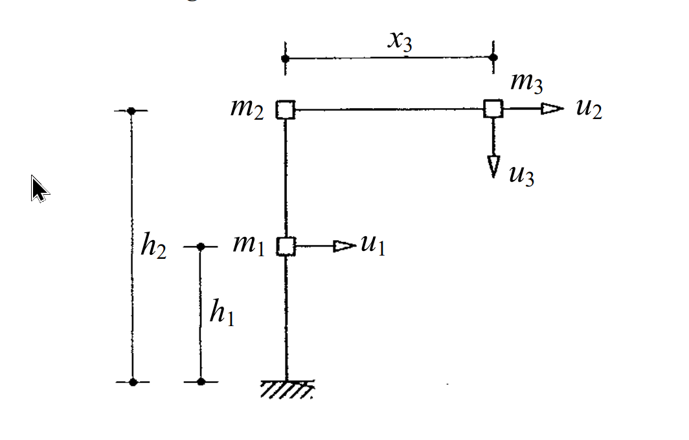
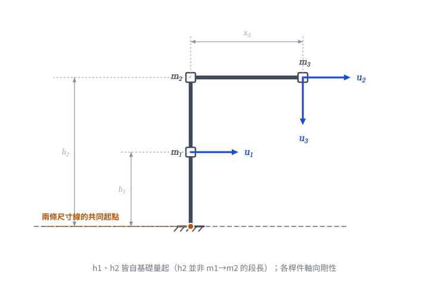
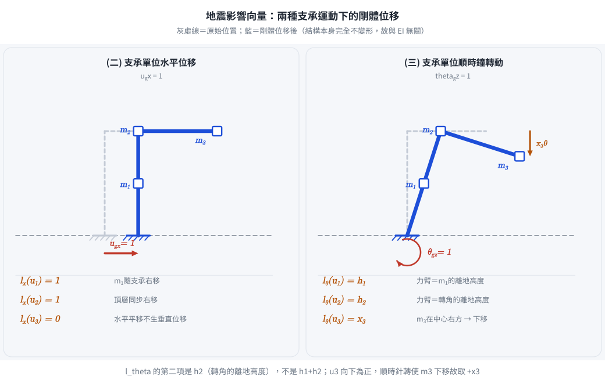

# 考題編號：SD-2004-4

**主分類：** `SD-U1-2` 運動方程式推導  
**副分類：** `SD-U1-3` 單自由度、多自由度系統之動態分析及應用  
**分析方法：** MDOF 質量矩陣建立（動能法）＋地震影響向量推導（幾何剛體位移法）  
**標籤：** `MDOF` `L形構架` `質量矩陣` `影響向量` `軸向剛性` `水平地震` `轉動地震` `幾何剛體位移` `自由度識別` `lx向量` `lθ向量`

---

## 1. 原始題目重述 (Problem Restatement)

**系統描述：**

L 形構架，各桿件軸向為剛性（axially rigid members）：
- 垂直柱：底端固定支承 → $m_1$（**離地高度 $h_1$**）→ 轉角 $m_2$（**離地高度 $h_2$**）
- 水平梁：從轉角（$m_2$）水平延伸距離 $x_3$ → $m_3$
- 自由度：$u_1$（$m_1$ 處，水平右正）、$u_2$（頂層水平右正，箭頭畫在 $m_3$ 處）、$u_3$（$m_3$ 處，垂直向下正）

> ⚠ **幾何關鍵：$h_1$ 與 $h_2$ 都是自基礎量起的高度**（附圖左側兩條標註線同起於地面），
> $h_2$ **不是** $m_1$ 到 $m_2$ 的段長。$m_1$ 至 $m_2$ 的距離為 $h_2 - h_1$。

```
        ←────── x₃ ──────→
m₂ □────────────────────□ m₃ ──→ u₂
   |                     ↓ u₃（垂直向下）
   |
m₁ □──→ u₁（水平向右）      ↑            ↑
   |                       h₁（至 m₁）  h₂（至 m₂／梁）
   |                       │            │
  ///（固定支承）  ────────┴────────────┴──── 地面
```

**三個子問：**

(一) 求質量矩陣 $[M]$（自由度按 $u_1, u_2, u_3$ 排列）（3 分）

(二) 支承受水平地震加速度 $\ddot{u}_{gx}(t)$，地震力 $\{P(t)\} = -[M]\{l_x\}\ddot{u}_{gx}(t)$，求 $\{l_x\}$（5 分）

(三) 支承受順時鐘轉動角加速度 $\ddot{\theta}_{gz}(t)$，地震力 $\{P(t)\} = -[M]\{l_\theta\}\ddot{\theta}_{gz}(t)$，求 $\{l_\theta\}$（7 分）



*圖說：固定支承在底部。垂直柱上 $m_1$ 位於離地高度 $h_1$（水平 DOF $u_1$）；柱頂轉角處為 $m_2$，離地高度 $h_2$。水平梁自轉角向右延伸 $x_3$ 至 $m_3$，$m_3$ 處標有水平 DOF $u_2$（向右）與垂直 DOF $u_3$（向下）。附圖左側兩條尺寸線 $h_1$、$h_2$ **均自地面量起**（$h_2 > h_1$）。各桿件軸向剛性。*



*圖 1　題目幾何重繪。唯一目的是把 $h_1$、$h_2$ 兩條尺寸線的**共同起點**釘在地面上：$h_2$ 是轉角的離地高度，不是 $m_1$ 到 $m_2$ 的段長。看錯這一點，$\{l_\theta\}$ 的第二項就會寫成 $h_1+h_2$。*

---

## 2. 考題核心精神與出題者意圖 (Core Concepts & Examiner's Intent)

**核心觀念：** 建立多自由度系統的質量矩陣需要先識別**運動學約束**（軸向剛性產生的約束），確認各質量的速度分量，再由動能推導。影響向量是**幾何問題**，等於支承作單位位移／轉動時各自由度的剛體位移。

**出題者意圖：**
1. 子題(一)：考查軸向剛性的約束——水平梁軸向剛性使 $m_3$ 水平運動速度 = $\dot{u}_2$；垂直柱軸向剛性使 $m_1$、$m_2$ 無垂直運動
2. 子題(二)：水平地震的影響向量——直觀，各水平自由度 = 1，垂直自由度 = 0
3. 子題(三)：**轉動地震的影響向量是本題難點**——需正確計算各質量在基礎轉動時的幾何剛體位移，尤其 $m_3$ 具有「水平距離 $x_3$」導致垂直剛體位移 $x_3 \cdot \theta$

**關鍵陷阱：**
- ⚠ $m_3$ 的水平速度 = $\dot{u}_2$（不是獨立的），但垂直速度 = $\dot{u}_3$（獨立）→ 質量矩陣中 $m_3$ 同時貢獻到 $u_2$ 和 $u_3$ 的係數
- ⚠ 轉動地震下 $m_3$ 在 $u_3$（垂直）方向的剛體位移 = $x_3$（因為 $m_3$ 在轉動中心右方 $x_3$ 處）
- ⚠ 轉動地震下 $m_3$ 在 $u_2$（水平）方向的剛體位移 = $h_2$（因為 $m_3$ 與轉角同高，位於轉動中心上方 $h_2$ 處）

---

## 3. 解題戰略地圖與陷阱分析 (Strategic Roadmap & Trap Analysis)

**作戰計畫：**

```
Step 1（子題一）：
  識別自由度的速度分量（用軸向剛性約束）：
  m1: 水平速度 = u̇1，垂直速度 = 0（柱軸向剛性）
  m2: 水平速度 = u̇2，垂直速度 = 0（柱軸向剛性）
  m3: 水平速度 = u̇2（梁軸向剛性），垂直速度 = u̇3（獨立）
  → 寫出動能 T，對照 T = ½{u̇}ᵀ[M]{u̇} 讀出質量矩陣

Step 2（子題二）：
  支承作單位水平位移 ugx = 1：
  → 所有質量水平移動 1，垂直不動
  → lx(u1) = 1，lx(u2) = 1，lx(u3) = 0

Step 3（子題三）：
  支承作單位順時鐘轉動 θgz = 1（基礎幾何轉動分析）：
  → 各質量的剛體位移 = 其位置向量 × 轉角
  → 水平位移 = 高度 × θ；垂直位移（向下）= 水平距離 × θ
  → lθ(u1) = h1，lθ(u2) = h2，lθ(u3) = x3
```

**關鍵陷阱：**

1. ⚠ **質量矩陣中 (2,2) 元素**：$m_3$ 的水平速度等於 $\dot{u}_2$，所以對 $M_{22}$ 貢獻 $m_3$，$M_{22} = m_2 + m_3$（非 $m_2$）
2. ⚠ **轉動地震下的正確坐標**：須以**基礎固定點（支承）**為轉動中心，計算各質量的相對位置
3. ⚠ **$u_3$ 正方向**：$u_3$ 定義為**向下**正，順時鐘轉動使 $m_3$（在轉動中心右方）向下運動，故 $l_\theta(u_3) = +x_3$（正值）

---

## 3.5 變數層次分析 (Variable Hierarchy Analysis)

> 複習提示：第一次解題後，在每個卡住的知識點旁標記 `⚠`；第二次複習時只看有 `⚠` 的項目。

### 最終目標
求 (一) $[M]$、(二) $\{l_x\}$、(三) $\{l_\theta\}$（均以幾何量 $m_1, m_2, m_3, h_1, h_2, x_3$ 表示；$h_1$、$h_2$ 均自基礎量起）。

### 本題關鍵公式（依計算順序）

$$\text{Step 1：} \quad T = \frac{1}{2}m_1\dot{u}_1^2 + \frac{1}{2}(m_2+m_3)\dot{u}_2^2 + \frac{1}{2}m_3\dot{u}_3^2 \Rightarrow [M] = \text{diag}[m_1,\, m_2+m_3,\, m_3]$$

$$\text{Step 2：} \quad u_{gx}=1 \Rightarrow \Delta u_1=1,\, \Delta u_2=1,\, \Delta u_3=0 \Rightarrow \{l_x\} = \{1,\, 1,\, 0\}^T$$

$$\text{Step 3：} \quad \theta_{gz}=1 \Rightarrow \Delta u_i = \text{幾何剛體位移}$$

$$\text{Step 3a：} \quad \Delta x_i = y_i\cdot\theta \quad \text{（水平剛體位移，正向右）}$$

$$\text{Step 3b：} \quad \Delta y_i = -x_i\cdot\theta \quad \text{（垂直剛體位移，正向上；向下則反號）}$$

$$\text{Step 3c：} \quad \{l_\theta\} = \{h_1,\, h_2,\, x_3\}^T$$

### L1：題目直接給定

| 符號 | 數值 | 說明 |
|------|------|------|
| $m_1$ | $m_1$ | 第一層質量（高度 $h_1$ 處） |
| $m_2$ | $m_2$ | 轉角處質量（離地高度 $h_2$） |
| $m_3$ | $m_3$ | 水平臂端質量（水平距離 $x_3$） |
| $h_1$ | $h_1$ | **地面**至 $m_1$ 的高度 |
| $h_2$ | $h_2$ | **地面**至轉角（$m_2$／水平梁）的高度，$h_2>h_1$ |
| $x_3$ | $x_3$ | 轉角至 $m_3$ 的水平距離 |
| 軸向條件 | 剛性 | 各桿件軸向不可壓縮 |
| $u_1$ | 水平（右正） | $m_1$ 處水平自由度 |
| $u_2$ | 水平（右正） | 頂層（轉角＋$m_3$）水平自由度 |
| $u_3$ | 垂直（下正） | $m_3$ 處垂直自由度 |

### L2：需知識點推導

**軸向剛性約束下的速度分析**

| 質量 | 水平速度 | 垂直速度 | 說明 |
|------|--------|--------|------|
| $m_1$ | $\dot{u}_1$ | $0$ | 垂直柱軸向剛性 → 無垂直變形 |
| $m_2$ | $\dot{u}_2$ | $0$ | 垂直柱軸向剛性 → 無垂直變形 |
| $m_3$ | $\dot{u}_2$ | $\dot{u}_3$ | 水平梁軸向剛性 → 水平速度 = $\dot{u}_2$ |

**質量矩陣推導**

| 元素 | 來源 | 值 | 卡關? |
|------|------|---|------|
| $M_{11}$ | $m_1$ 的水平動能 | $m_1$ | |
| $M_{22}$ | $m_2+m_3$ 的水平動能（$m_3$ 水平速度 = $\dot{u}_2$） | $m_2+m_3$ | |
| $M_{33}$ | $m_3$ 的垂直動能 | $m_3$ | |
| 其餘 | 無交叉項（速度彼此獨立） | $0$ | |

**幾何剛體位移（轉動 $\theta=1$ 順時鐘）**

| 質量 | 位置 $(x_0, y_0)$ | $\Delta x = y_0\theta$ | $\Delta y = -x_0\theta$ | 對應 DOF |
|------|-----------------|----------------------|----------------------|---------|
| $m_1$ | $(0, h_1)$ | $h_1$ | $0$ | $u_1 = h_1$ |
| $m_2$ | $(0, h_2)$ | $h_2$ | $0$ | $u_2 = h_2$ |
| $m_3$ | $(x_3, h_2)$ | $h_2$（已含於 $u_2$） | $-x_3$（向下） | $u_3 = x_3$（$u_3$ 下正） |

### L3：深層知識（不懂就卡住）

| 知識點 | 說明 | 卡關? |
|--------|------|------|
| 軸向剛性的運動學約束 | 軸向剛性 → 沿桿件方向的相對位移 = 0，約束兩端質量的相對速度 | |
| 影響向量的物理意義 | $\{l\}$ = 支承作單位位移時，各 DOF 的**剛體位移**（不含結構彈性變形） | |
| 順時鐘轉動下的位移公式 | $\Delta x = y_0\theta$（上方的點往右）；$\Delta y = -x_0\theta$（右方的點往下） | |
| $m_3$ 同時對 $u_2$ 和 $u_3$ 貢獻 | $m_3$ 有兩個速度分量 $(\dot{u}_2, \dot{u}_3)$，在質量矩陣中同時出現在 $M_{22}$ 和 $M_{33}$ | |
| 影響向量正負號 | 與自由度正方向一致的剛體位移為正；$u_3$ 向下正，順時鐘轉動使 $m_3$ 向下 → $l_\theta(u_3) = +x_3$ | |

---

## 4. 步驟化詳細計算過程 (Step-by-Step Detailed Calculation)

### 子題(一)：質量矩陣 $[M]$（3 分）

**Step 1：識別軸向剛性約束下的速度分量**

| 質量 | 水平速度 | 垂直速度 | 原因 |
|------|--------|--------|------|
| $m_1$ | $\dot{u}_1$ | $0$ | 垂直柱軸向剛性：柱不能壓縮，$m_1$ 只能水平移動 |
| $m_2$ | $\dot{u}_2$ | $0$ | 同上，$m_2$ 只能水平移動 |
| $m_3$ | $\dot{u}_2$ | $\dot{u}_3$ | 水平梁軸向剛性：$m_3$ 水平位移 = $u_2$（無軸向伸縮）；垂直位移 = $u_3$（梁撓曲） |

**Step 2：計算系統動能，讀出質量矩陣**

$$T = \frac{1}{2}m_1 \dot{u}_1^2 + \frac{1}{2}m_2 \dot{u}_2^2 + \frac{1}{2}m_3\left(\dot{u}_2^2 + \dot{u}_3^2\right)$$

$$= \frac{1}{2}m_1 \dot{u}_1^2 + \frac{1}{2}(m_2 + m_3)\dot{u}_2^2 + \frac{1}{2}m_3 \dot{u}_3^2$$

由 $T = \dfrac{1}{2}\{\dot{u}\}^T [M] \{\dot{u}\}$ 對照，得：

$$\boxed{[M] = \begin{bmatrix} m_1 & 0 & 0 \\ 0 & m_2+m_3 & 0 \\ 0 & 0 & m_3 \end{bmatrix}}$$

> **策略註解：** $M_{22} = m_2 + m_3$ 而非 $m_2$，因為 $m_3$ 的水平速度受水平梁軸向剛性束制，與 $u_2$ 完全同步。

---

### 子題(二)：水平地震影響向量 $\{l_x\}$（5 分）

**方法：幾何剛體位移法**

支承作**單位水平位移** $u_{gx} = 1$ 時，整個結構隨支承做剛體平移（無結構彈性變形），各質量的位移為：

| 質量 | 水平剛體位移 | 垂直剛體位移 | 對應 DOF |
|------|-----------|-----------|---------|
| $m_1$ | $1$（水平） | $0$ | $u_1 = 1$ |
| $m_2$ | $1$（水平） | $0$ | $u_2 = 1$ |
| $m_3$ | $1$（水平，與 $m_2$ 相同） | $0$ | $u_3 = 0$（垂直 DOF 無位移） |

$$\boxed{\{l_x\} = \begin{Bmatrix} 1 \\ 1 \\ 0 \end{Bmatrix}}$$

> **策略註解：** 水平剛體平移不引起垂直位移，故 $l_x(u_3) = 0$。僅水平自由度 $u_1, u_2$ 參與水平地震激振。

---

### 子題(三)：順時鐘轉動地震影響向量 $\{l_\theta\}$（7 分）

**方法：小角度轉動幾何分析**

設坐標原點在基礎支承點，$x$ 向右正，$y$ 向上正，$\theta$ 為順時鐘正方向。

**剛體轉動位移公式（小角度）：**

對位於 $(x_0, y_0)$ 的質量，順時鐘轉動角 $\theta$ 引起：
$$\Delta x = y_0 \cdot \theta \quad (\text{水平位移，右正})$$
$$\Delta y = -x_0 \cdot \theta \quad (\text{垂直位移，上正})$$

**各質量的幾何位置與剛體位移（$\theta = 1$）：**

| 質量 | 位置 $(x_0,\, y_0)$ | $\Delta x = y_0$ | $\Delta y = -x_0$ | 對應 DOF 及值 |
|------|-------------------|-----------------|-----------------|-------------|
| $m_1$ | $(0,\; h_1)$ | $h_1$ | $0$ | $u_1 = h_1$ |
| $m_2$ | $(0,\; h_2)$ | $h_2$ | $0$ | $u_2 = h_2$ |
| $m_3$ | $(x_3,\; h_2)$ | $h_2$ | $-x_3$ | ① $u_2$ 已含（水平）；② $u_3$：向下為正，$\Delta y = -x_3 < 0$（向下）→ $u_3 = x_3$ |

**說明 $m_3$ 的 $u_3$ 貢獻：**
- $m_3$ 在轉動中心右方 $x_3$ 處
- 順時鐘轉動 → $m_3$ 往下移動（$\Delta y = -x_3$）
- $u_3$ 定義向下為正 → $u_3 = x_3 \cdot \theta$
- 故 $l_\theta(u_3) = x_3$（正值）✓

$$\boxed{\{l_\theta\} = \begin{Bmatrix} h_1 \\ h_2 \\ x_3 \end{Bmatrix}}$$

---



*圖 2　影響向量的定義畫成圖：支承作單位運動、結構本身完全不變形時，各自由度的剛體位移。右格可直接讀出力臂——$u_1$ 對應 $h_1$、$u_2$ 對應 $h_2$、$u_3$ 對應 $x_3$，而且 $m_3$ 確實往下走（$u_3$ 下正故取 $+x_3$）。*

### 物理驗算

**水平地震力（用 $\{l_x\}$）：**
$$\{P\} = -[M]\{l_x\}\ddot{u}_{gx} = -\begin{Bmatrix} m_1 \\ m_2+m_3 \\ 0 \end{Bmatrix}\ddot{u}_{gx}$$

物理意義：$m_1$ 和 $m_2+m_3$ 受水平慣性力（$u_3$ 方向無力）✓

**轉動地震力（用 $\{l_\theta\}$）：**
$$\{P\} = -[M]\{l_\theta\}\ddot{\theta}_{gz} = -\begin{Bmatrix} m_1 h_1 \\ (m_2+m_3)h_2 \\ m_3 x_3 \end{Bmatrix}\ddot{\theta}_{gz}$$

物理意義：
- $m_1$ 受水平慣性力 $m_1 h_1 \ddot{\theta}_{gz}$（力臂 $h_1$）
- $m_2+m_3$ 受水平慣性力（力臂 $h_2$）
- $m_3$ 受垂直慣性力 $m_3 x_3 \ddot{\theta}_{gz}$（力臂 $x_3$）✓

---

## 5. 關鍵爭議點與進階探討 (Critical Issues & Advanced Discussion)

**為什麼需要轉動地震的影響向量？**

實際地震中，近場地震（near-field）或測量儀器離結構有距離時，記錄到的地震動可能包含**轉動成分**（rotational component）。橋梁長基礎、大跨度結構的支承位移不一致時也需要考慮轉動效應。本題的 $\{l_\theta\}$ 推導是「多點支承激振（multi-support excitation）」問題的基礎。

**$M_{22} = m_2 + m_3$ 的工程意義**

水平梁軸向剛性使 $m_3$ 的水平慣性力由 $u_2$ 的勁度來承受，設計水平梁連接節點時必須考慮 $m_3$ 的貢獻。若誤用 $M_{22} = m_2$，會低估水平地震力。

**若水平梁非軸向剛性？**

若梁有軸向彈性，則 $m_3$ 的水平運動與 $m_2$ 不同，需增加一個水平自由度，系統變為 4 自由度，質量矩陣也將出現 $m_3$ 在獨立水平 DOF 的對角項。

**尺寸線的讀圖教訓（本題最容易失分處）**

附圖左側畫了**兩條起點相同（皆在地面）**的尺寸線：短的標 $h_1$、長的標 $h_2$。
考場上若把 $h_2$ 誤讀成「$m_1$ 到 $m_2$ 的段長」，$\{l_\theta\}$ 的第二項就會寫成 $h_1+h_2$ 而失分。
**判別法：** 看尺寸線的**兩個端點箭頭**落在哪裡——兩條線的下端都指向地面，即兩者都是「離地高度」。
（$m_1$ 恰在 $h_2$ 尺寸線的中點附近，使 $h_2$ 的標字與 $m_1$ 同高，這正是誤讀的來源。）

---

## 修正紀錄

| 日期 | 修正內容 | 理由／驗證 |
|------|---------|-----------|
| 2026-08-22 | **$\{l_\theta\}$ 第二項由 $h_1+h_2$ 更正為 $h_2$** | 逐像素檢視 `SD-2004-4-fig-1.png`：$h_2$ 尺寸線自 $y=590$（地面）延伸至 $y=165$（梁），$h_1$ 尺寸線自 $y=590$ 延伸至 $y=378$（$m_1$），兩者**同起於地面**，故 $h_2$ 即轉角離地高度，非段長。原解把 $h_2$ 當成 $m_1\to m_2$ 的增量 |
| 2026-08-22 | 連帶更正 §1 系統描述與 ASCII 圖、§1 圖說、§2 陷阱、§3 作戰計畫、§3.5 Step 3c／L1／L2 表、§4 子題(三)表格與物理驗算 | 保持全文一致 |
| 2026-08-22 | §5 新增「尺寸線的讀圖教訓」 | 把本次錯誤轉成可複習的讀圖判準 |

> $[M]=\mathrm{diag}[m_1,\,m_2+m_3,\,m_3]$ 與 $\{l_x\}=\{1,1,0\}^T$ 經重新檢核正確，未更動。

---

*圖解補繪：2026-08-22（向量圖，由 `gen_SD-2004-4.py` 以程式碼繪製，所有幾何與數值由解題結果算出，可重跑）*
