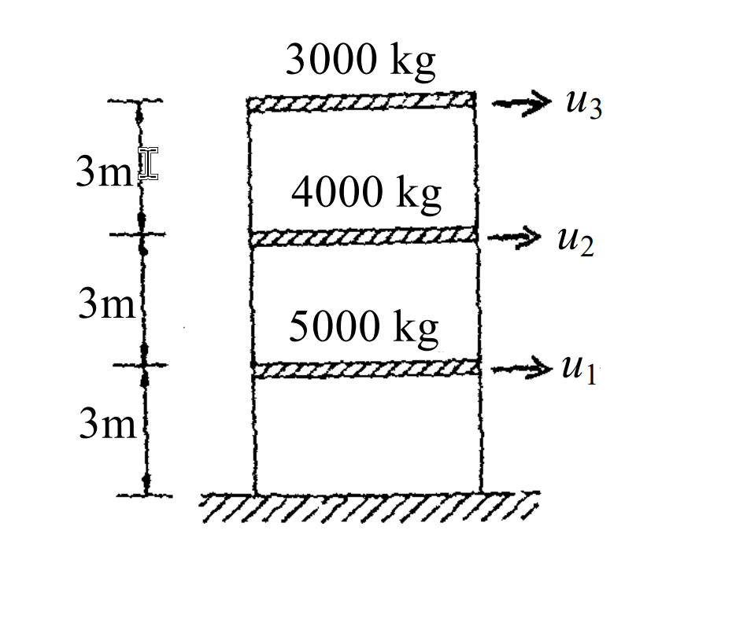

# 考題編號：SD-2004-5

**主分類：** `SD-U1-3` 單自由度、多自由度系統之動態分析及應用  
**副分類：** `SD-U2-2` 建築耐震設計規範  
**分析方法：** 反應譜分析（模態疊加法 + SRSS 組合）：Rayleigh 商求 T₁ → 模態參與因子 → 譜值 → SRSS 疊加  
**標籤：** `MDOF` `3自由度` `剪力屋架` `自然振動周期` `Rayleigh商` `模態參與因子` `有效振態質量` `SRSS` `反應譜分析` `基底剪力` `頂層位移`

---

## 1. 原始題目重述 (Problem Restatement)

**三層樓剪力屋架（3-story shear frame）：**

| 樓層 | 質量 | 自由度 |
|------|------|------|
| 第一層（1F） | $m_1 = 5000\text{ kg}$ | $u_1$ |
| 第二層（2F） | $m_2 = 4000\text{ kg}$ | $u_2$ |
| 第三層（3F，頂層） | $m_3 = 3000\text{ kg}$ | $u_3$ |

各層層剪力勁度：$k = 4\times10^6\text{ N/m}$（每層相同）

已知前兩個振態（行向量，轉置上標 t）：

$$\{\phi_1\}^t = \langle 0.484,\; 0.834,\; 1.000 \rangle$$
$$\{\phi_2\}^t = \langle 1.000,\; 0.118,\; -0.937 \rangle$$

正規化水平加速度反應譜係數 $C$：

$$C = 1+5T \quad (T \leq 0.3\text{ sec})$$
$$C = 2.5 \quad (0.3\text{ sec} \leq T \leq 1\text{ sec})$$
$$C = 2.5/T \quad (1\text{ sec} \leq T)$$

工址設計水平加速度：$0.2g$

**要求：**
- **(一)** 求第一振態對應之自然振動周期 $T_1$（5 分）
- **(二)** 已知 $T_2 = 0.162\text{ sec}$，用 SRSS 疊加前兩個振態，求**頂層最大位移**及**最大基底剪力**（20 分）



*圖說：三層剪力屋架，自下而上各層質量為 5000 kg、4000 kg、3000 kg，各層樓高 3m，各層剪力勁度均為 $4\times10^6$ N/m，自由度 $u_1$（1F 水平）、$u_2$（2F 水平）、$u_3$（3F 水平）。*

---

## 2. 考題核心精神與出題者意圖 (Core Concepts & Examiner's Intent)

**核心觀念：** MDOF 反應譜分析的完整流程——從已知振態求週期（Rayleigh 商），到計算模態參與因子、查取譜值、求各振態最大反應，最後 SRSS 組合。

**出題者意圖：**
1. 子題(一)：考查「用已知振態向量反推自然頻率」的能力——核心是 Rayleigh 商公式
2. 子題(二)：考查完整的多振態反應譜分析流程（每一步都有部分分數），特別注意：
   - 模態參與因子的計算（最容易出錯）
   - 譜加速度的正確轉換（$S_a = C \times 0.2g$）
   - SRSS 組合規則（取平方和再開根）

**關鍵陷阱：**
- ⚠ **Rayleigh 商分子分母不能搞反**：$\omega^2 = \{\phi\}^T[K]\{\phi\} / \{\phi\}^T[M]\{\phi\}$
- ⚠ **$T_1$ 落在哪個反應譜區間**：$T_1 \approx 0.422\text{ sec}$，在 $0.3 \leq T \leq 1$ 範圍 → $C_1 = 2.5$
- ⚠ **$m_3$ 的振態分量 $\phi_{23} = -0.937$ 為負值**，SRSS 時要取平方，負號消失
- ⚠ **SRSS 不是代數疊加**：$V_{max} = \sqrt{V_1^2 + V_2^2}$，而非 $|V_1 + V_2|$

---

## 3. 解題戰略地圖與陷阱分析 (Strategic Roadmap & Trap Analysis)

**作戰計畫（共 8 步）：**

```
子題(一)：
  Step 1：建立勁度矩陣 [K]
  Step 2：計算 Rayleigh 商 → ω₁² → T₁

子題(二)：
  Step 3：計算模態質量 M₁*, M₂* 和 {φ}ᵀ[M]{1}
  Step 4：計算模態參與因子 Γ₁, Γ₂
  Step 5：由 T₁, T₂ 查反應譜 → Sa₁, Sa₂ → Sd₁, Sd₂
  Step 6：計算各振態樓層位移向量 {X₁}, {X₂}
  Step 7：SRSS 組合頂層位移
  Step 8：計算各振態基底剪力 V₁, V₂ → SRSS 組合
```

---

## 3.5 變數層次分析 (Variable Hierarchy Analysis)

> 複習提示：第一次解題後，在每個卡住的知識點旁標記 `⚠`；第二次複習時只看有 `⚠` 的項目。

### 最終目標
(一) $T_1$；(二) 頂層最大位移 $u_{3,max}$、最大基底剪力 $V_{max}$（SRSS）

### 本題關鍵公式（依計算順序）

$$\text{Step 1：} \quad [K] = k\begin{bmatrix}2&-1&0\\-1&2&-1\\0&-1&1\end{bmatrix}$$

$$\text{Step 2：} \quad \omega_1^2 = \frac{\{\phi_1\}^T[K]\{\phi_1\}}{\{\phi_1\}^T[M]\{\phi_1\}}, \quad T_1 = \frac{2\pi}{\omega_1}$$

$$\text{Step 3：} \quad M_i^* = \{\phi_i\}^T[M]\{\phi_i\}, \quad L_i = \{\phi_i\}^T[M]\{1\}$$

$$\text{Step 4：} \quad \Gamma_i = \frac{L_i}{M_i^*}$$

$$\text{Step 5：} \quad S_{a,i} = C(T_i)\times 0.2g, \quad S_{d,i} = \frac{S_{a,i}}{\omega_i^2}$$

$$\text{Step 6：} \quad \{X_i\} = \Gamma_i \cdot S_{d,i} \cdot \{\phi_i\}$$

$$\text{Step 7（SRSS）：} \quad u_{3,max} = \sqrt{X_{1,3}^2 + X_{2,3}^2}$$

$$\text{Step 8：} \quad V_i = S_{a,i} \times M_{\text{eff},i}, \quad M_{\text{eff},i} = \frac{L_i^2}{M_i^*}, \quad V_{max} = \sqrt{V_1^2+V_2^2}$$

### L1：題目直接給定

| 符號 | 數值 | 說明 |
|------|------|------|
| $m_1, m_2, m_3$ | 5000, 4000, 3000 kg | 各層質量 |
| $k$ | $4\times10^6$ N/m | 各層勁度 |
| $\{\phi_1\}$ | $\{0.484, 0.834, 1.000\}^T$ | 第一振態 |
| $\{\phi_2\}$ | $\{1.000, 0.118, -0.937\}^T$ | 第二振態 |
| $T_2$ | 0.162 sec | 第二振態週期（題目給定） |
| 設計加速度 | $0.2g$ | 工址設計水平加速度 |

### L2：需知識點推導

**Rayleigh 商求 T₁**

| 符號 | 公式／來源 | 卡關? |
|------|---------|------|
| $[K]\{\phi_1\}$ | $k\times\{0.134, 0.184, 0.166\}^T$ | |
| $\{\phi_1\}^T[K]\{\phi_1\}$ | $k\times0.384312 = 1{,}537{,}248$ | |
| $\{\phi_1\}^T[M]\{\phi_1\}$ | $6953.5$ kg | |
| $\omega_1^2$ | $221.08$ rad²/s² | |
| $T_1$ | $0.422$ sec | |

**模態參與因子**

| 符號 | 公式／來源 | 卡關? |
|------|---------|------|
| $L_1 = \{\phi_1\}^T[M]\{1\}$ | $8756$ kg | |
| $M_1^* = \{\phi_1\}^T[M]\{\phi_1\}$ | $6953.5$ kg | |
| $\Gamma_1 = L_1/M_1^*$ | $1.2592$ | |
| $L_2 = \{\phi_2\}^T[M]\{1\}$ | $2661$ kg | |
| $M_2^* = \{\phi_2\}^T[M]\{\phi_2\}$ | $7689.6$ kg | |
| $\Gamma_2 = L_2/M_2^*$ | $0.3461$ | |

**反應譜值與譜位移**

| 符號 | 公式／來源 | 卡關? |
|------|---------|------|
| $C_1$（T₁=0.422 sec）| $2.5$（在平坦段 0.3~1.0 sec） | |
| $S_{a1}$ | $2.5\times0.2g = 0.5g = 4.905$ m/s² | |
| $S_{d1}$ | $4.905/221.08 = 0.02218$ m | |
| $C_2$（T₂=0.162 sec）| $1+5(0.162) = 1.810$（上升段 ≤ 0.3 sec） | |
| $S_{a2}$ | $1.810\times0.2g = 0.362g = 3.551$ m/s² | |
| $\omega_2$ | $2\pi/0.162 = 38.785$ rad/s | |
| $S_{d2}$ | $3.551/1504.3 = 0.002361$ m | |

### L3：深層知識（不懂就卡住）

| 知識點 | 說明 | 卡關? |
|--------|------|------|
| Rayleigh 商 | $\omega^2 = \{\phi\}^T[K]\{\phi\}/\{\phi\}^T[M]\{\phi\}$；精確振態 → 精確 $\omega$ | |
| 剪力屋架勁度矩陣 | 三對角矩陣：$K_{ii}=2k$（底頂層除外），$K_{ij}=-k$（相鄰層）；頂層 $K_{nn}=k$ | |
| 模態參與因子公式 | $\Gamma_i = L_i/M_i^*$，其中 $L_i = \{\phi_i\}^T[M]\{1\}$（質量向量的加權和） | |
| 有效振態質量 | $M_{\text{eff},i} = L_i^2/M_i^* = \Gamma_i^2 \cdot M_i^*$；$\sum M_{\text{eff},i} = $ 總質量（驗算） | |
| $S_a = C\times\text{(地震加速度)}$ | $S_a$（m/s²）= 反應譜係數 × 設計水平加速度；$S_d = S_a/\omega^2$ | |
| SRSS 符號無關 | $X_{2,3} = -0.000766$ m → SRSS 取平方後為正；負號不影響最終結果 | |
| 基底剪力計算 | $V_i = S_{a,i} \times M_{\text{eff},i}$（有效振態質量 × 譜加速度）| |

---

## 4. 步驟化詳細計算過程 (Step-by-Step Detailed Calculation)

### 子題(一)：求第一振態自然振動周期 T₁（5 分）

**Step 1：建立層剪力勁度矩陣 $[K]$**

對三層剪力屋架（各層勁度均為 $k$）：

$$[K] = k\begin{bmatrix} 2 & -1 & 0 \\ -1 & 2 & -1 \\ 0 & -1 & 1 \end{bmatrix} = 4\times10^6 \begin{bmatrix} 2 & -1 & 0 \\ -1 & 2 & -1 \\ 0 & -1 & 1 \end{bmatrix} \text{ N/m}$$

**Step 2：計算 $[K]\{\phi_1\}$**

$$[K]\{\phi_1\} = k\begin{bmatrix}2(0.484)-(0.834)\\-(0.484)+2(0.834)-(1.000)\\-(0.834)+(1.000)\end{bmatrix} = k\begin{bmatrix}0.134\\0.184\\0.166\end{bmatrix}$$

**Step 3：計算 Rayleigh 商（分子）**

$$\{\phi_1\}^T[K]\{\phi_1\} = k\,(0.484\times0.134 + 0.834\times0.184 + 1.000\times0.166)$$
$$= 4\times10^6\,(0.064856 + 0.153456 + 0.166000)$$
$$= 4\times10^6 \times 0.384312 = 1{,}537{,}248 \text{ N/m}$$

**Step 4：計算 Rayleigh 商（分母）**

$$\{\phi_1\}^T[M]\{\phi_1\} = 5000(0.484)^2 + 4000(0.834)^2 + 3000(1.000)^2$$
$$= 5000(0.234256) + 4000(0.695556) + 3000(1.000)$$
$$= 1171.3 + 2782.2 + 3000.0 = 6953.5 \text{ kg}$$

**Step 5：求 $\omega_1^2$ 與 $T_1$**

$$\omega_1^2 = \frac{\{\phi_1\}^T[K]\{\phi_1\}}{\{\phi_1\}^T[M]\{\phi_1\}} = \frac{1{,}537{,}248}{6953.5} = 221.1 \text{ rad}^2/\text{s}^2$$

$$\omega_1 = \sqrt{221.1} = 14.87 \text{ rad/s}$$

$$\boxed{T_1 = \frac{2\pi}{\omega_1} = \frac{6.283}{14.87} \approx 0.422 \text{ sec}}$$

> **策略註解：** 也可用任意單一行的特徵值方程驗算：例如第 3 行：$k(0.166) = \omega^2 \times 3000(1.0)$，得 $\omega^2 = 4\times10^6 \times 0.166/3000 = 221.3$，與 Rayleigh 商結果一致 ✓

---

### 子題(二)：SRSS 反應譜分析（20 分）

**Step 6：計算模態質量與模態參與因子**

定義 $L_i = \{\phi_i\}^T[M]\{1\}$（總質量向量投影）、$M_i^* = \{\phi_i\}^T[M]\{\phi_i\}$（模態質量）：

**第一振態：**
$$L_1 = 5000(0.484) + 4000(0.834) + 3000(1.000) = 2420 + 3336 + 3000 = 8756 \text{ kg}$$

$$M_1^* = 6953.5 \text{ kg} \quad (\text{已計算})$$

$$\Gamma_1 = \frac{L_1}{M_1^*} = \frac{8756}{6953.5} = 1.2592$$

**第二振態：**
$$L_2 = 5000(1.000) + 4000(0.118) + 3000(-0.937) = 5000 + 472 - 2811 = 2661 \text{ kg}$$

$$M_2^* = 5000(1.000)^2 + 4000(0.118)^2 + 3000(-0.937)^2$$
$$= 5000 + 55.7 + 2633.9 = 7689.6 \text{ kg}$$

$$\Gamma_2 = \frac{L_2}{M_2^*} = \frac{2661}{7689.6} = 0.3461$$

**有效振態質量驗算（確認前兩振態已捕捉幾乎全部質量）：**

$$M_{\text{eff},1} = \frac{L_1^2}{M_1^*} = \frac{8756^2}{6953.5} = 11{,}026 \text{ kg}$$

$$M_{\text{eff},2} = \frac{L_2^2}{M_2^*} = \frac{2661^2}{7689.6} = 921 \text{ kg}$$

$$M_{\text{eff},1} + M_{\text{eff},2} = 11{,}026 + 921 = 11{,}947 \text{ kg} \approx 12{,}000 \text{ kg} = m_{\text{total}} \quad (\text{99.6\%})\; ✓$$

---

**Step 7：查取反應譜係數與譜值**

| | 第一振態 | 第二振態 |
|--|---------|---------|
| 周期 $T_i$ | $0.422$ sec | $0.162$ sec |
| 反應譜區間 | $0.3 \leq T \leq 1$ sec | $T \leq 0.3$ sec |
| 係數 $C_i$ | $2.5$ | $1 + 5(0.162) = 1.810$ |
| 譜加速度 $S_{a,i} = C_i \times 0.2g$ | $2.5 \times 0.2 \times 9.81 = 4.905$ m/s² | $1.810 \times 0.2 \times 9.81 = 3.551$ m/s² |
| $\omega_i^2$ | $221.1$ rad²/s² | $(2\pi/0.162)^2 = 1504.3$ rad²/s² |
| 譜位移 $S_{d,i} = S_{a,i}/\omega_i^2$ | $4.905/221.1 = 0.02218$ m | $3.551/1504.3 = 0.002361$ m |

---

**Step 8：計算各振態的樓層位移向量**

各振態最大位移：$\{X_i\} = \Gamma_i \cdot S_{d,i} \cdot \{\phi_i\}$

**第一振態（$\Gamma_1 S_{d1} = 1.2592 \times 0.02218 = 0.02793$ m）：**

$$\{X_1\} = 0.02793 \times \begin{Bmatrix}0.484\\0.834\\1.000\end{Bmatrix} = \begin{Bmatrix}0.01352\\0.02329\\0.02793\end{Bmatrix} \text{ m}$$

**第二振態（$\Gamma_2 S_{d2} = 0.3461 \times 0.002361 = 0.0008172$ m）：**

$$\{X_2\} = 0.0008172 \times \begin{Bmatrix}1.000\\0.118\\-0.937\end{Bmatrix} = \begin{Bmatrix}0.0008172\\0.0000964\\-0.0007657\end{Bmatrix} \text{ m}$$

---

**Step 9：SRSS 組合——頂層最大位移**

頂層（第三層，$u_3$）：

$$X_{1,3} = 0.02793 \text{ m}, \quad X_{2,3} = -0.0007657 \text{ m}$$

$$\boxed{u_{3,max} = \sqrt{X_{1,3}^2 + X_{2,3}^2} = \sqrt{(0.02793)^2 + (0.0007657)^2}}$$
$$= \sqrt{0.0007801 + 0.000000586} = \sqrt{0.0007807} \approx \boxed{0.02794 \text{ m} \approx 27.9 \text{ mm}}$$

> **策略註解：** 第二振態對頂層位移的貢獻僅 $0.0007657 / 0.02793 \approx 2.7\%$，第一振態主導頂層位移。

---

**Step 10：計算各振態基底剪力**

$$V_i = S_{a,i} \times M_{\text{eff},i}$$

$$V_1 = 4.905 \times 11{,}026 = 54{,}083 \text{ N}$$

**驗算（各層慣性力總和）：**
$$\{f_1\} = \Gamma_1 \cdot S_{a,1} \cdot [M]\{\phi_1\} = 1.2592 \times 4.905 \times \begin{Bmatrix}2420\\3336\\3000\end{Bmatrix} = 6.176\begin{Bmatrix}2420\\3336\\3000\end{Bmatrix} = \begin{Bmatrix}14{,}946\\20{,}603\\18{,}528\end{Bmatrix} \text{ N}$$
$$V_1 = 14{,}946 + 20{,}603 + 18{,}528 = 54{,}077 \text{ N} \approx 54{,}083 \text{ N} \checkmark$$

$$V_2 = 3.551 \times 921 = 3{,}270 \text{ N}$$

**驗算（各層慣性力總和）：**
$$\{f_2\} = 0.3461 \times 3.551 \times \begin{Bmatrix}5000\\472\\-2811\end{Bmatrix} = 1.229\begin{Bmatrix}5000\\472\\-2811\end{Bmatrix} = \begin{Bmatrix}6{,}145\\580\\-3{,}455\end{Bmatrix} \text{ N}$$
$$V_2 = 6{,}145 + 580 + (-3{,}455) = 3{,}270 \text{ N} \checkmark$$

**SRSS 組合基底剪力：**

$$\boxed{V_{max} = \sqrt{V_1^2 + V_2^2} = \sqrt{(54{,}083)^2 + (3{,}270)^2} = \sqrt{2{,}924{,}970{,}000 + 10{,}693{,}000} \approx 54{,}182 \text{ N} \approx \boxed{54.2 \text{ kN}}}$$

---

### 最終答案彙整

| 項目 | 計算值 |
|------|------|
| 第一振態自然振動周期 | $T_1 \approx \mathbf{0.422 \text{ sec}}$ |
| 頂層最大位移（SRSS） | $u_{3,max} \approx \mathbf{27.9 \text{ mm}}$（主要由第一振態貢獻） |
| 最大基底剪力（SRSS） | $V_{max} \approx \mathbf{54.2 \text{ kN}}$（$V_1 = 54.1$ kN，$V_2 = 3.3$ kN） |

---

## 5. 關鍵爭議點與進階探討 (Critical Issues & Advanced Discussion)

**第一振態主導性**

本題中第一振態的有效質量佔比 = 11,026/12,000 = **91.9%**，第二振態僅 7.7%。這在實務設計中意義重大：當第一振態有效質量比超過 90%，可考慮只用一個振態（即等效靜力法）做近似設計。

**SRSS vs CQC**

本題使用 SRSS 組合，適用條件是**各振態頻率差異 > 10%**：
$$\frac{\omega_2}{\omega_1} = \frac{38.79}{14.87} = 2.61 \quad (\gg 1.1)\; ✓$$

若頻率接近，應改用 CQC（Complete Quadratic Combination）組合，CQC 會考慮振態間的相關性。

**基底剪力的另一種計算法：有效振態質量**

$$V_i = S_{a,i} \times M_{\text{eff},i}$$

這個公式非常簡便，只要算出有效振態質量就能直接乘以譜加速度得到基底剪力，不需要逐層計算慣性力再求和。本題兩種方法結果一致 ✓

**反應譜分析 vs 等效靜力法的比較**

若用等效靜力法（只用第一振態）：
$$V = S_{a1} \times m_{eff,1} = 4.905 \times 11{,}026 = 54{,}083 \text{ N}$$

與 SRSS 結果（54,182 N）幾乎相同，差異僅 0.2%，印證了第一振態主導的結論。本題的提示「本題作答與規範無關，僅需利用提供之反應譜係數，做彈性分析即可」正說明了不需要韌性折減。
