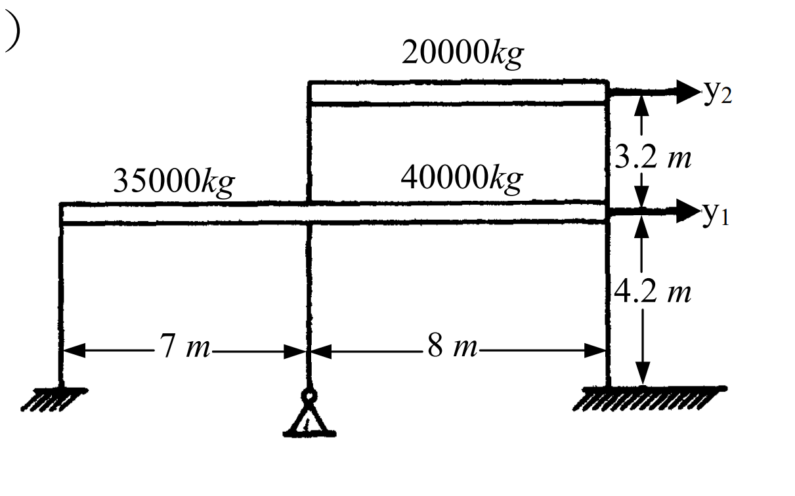

# 考題編號：SD-2005-2

**主分類：** `SD-U1` 結構動力學基礎
**副分類：** `SD-U1-3` 多自由度系統動態分析
**分析方法：** MDOF 模態分析
**標籤：** `MDOF` `剪力屋架` `勁度矩陣` `質量矩陣` `特徵值` `自然頻率` `振態`

---

## 1. 原始題目重述 (Problem Restatement)

下圖為兩層剪力屋架（shear frame），質量及尺寸如下：
- **一樓**：三支柱子，斷面 50 cm × 50 cm，樓高 4.2 m
- **二樓**：兩支柱子，斷面 40 cm × 40 cm，樓高 3.2 m
- **楊氏彈性模數**：$E = 2.3 \times 10^6 \text{ kgf/cm}^2$
- **質量**：一樓 $m_1 = 35{,}000 + 40{,}000 = 75{,}000 \text{ kg}$；二樓 $m_2 = 20{,}000 \text{ kg}$
- 自由度：$y_1$（一樓側位移）、$y_2$（二樓側位移）

*圖說：剪力屋架兩自由度模型。一樓總質量 75,000 kg（分屬7m及8m跨），二樓質量 20,000 kg。柱底固定，假設梁無限剛性（剪力屋架假設）。*

(一) 請計算勁度矩陣 $[k]$ 與質量矩陣 $[m]$。（15 分）
(二) 請計算頻率與振態。（10 分）

---

## 2. 考題核心精神與出題者意圖 (Core Concepts & Examiner's Intent)

**核心觀念：**
- 剪力屋架（shear frame）模型中，梁假設剛性，側向勁度完全由柱提供
- 每支柱的橫向勁度 = $12EI/h^3$（兩端固定梁公式）
- 質量矩陣為對角矩陣（集中質量模型）
- 二自由度系統的自然頻率與振態由特徵值問題求解

**出題者意圖：**
- 測驗剪力屋架的勁度推導能力（$12EI/h^3$ 的應用）
- 測驗 2×2 特徵值問題的手算能力
- 測驗振態向量的物理意義判斷（第一模態同向；第二模態反向）

---

## 3. 解題戰略地圖與陷阱分析 (Strategic Roadmap & Trap Analysis)

### 作戰計畫
1. 計算各層柱的慣性矩 $I = a^4/12$（正方形斷面）
2. 計算各層層間勁度 $k_i = \sum 12EI/h_i^3$（含各層柱數）
3. 組裝勁度矩陣 $[K]$ 與質量矩陣 $[M]$（質量需除以 $g$ 換算）
4. 解特徵值方程式 $\det([K] - \omega^2[M]) = 0$，得 $\omega_1, \omega_2$
5. 代回求各模態振態向量 $\{\phi\}_i$

### 關鍵陷阱

| 陷阱 | 說明 | 應對 |
|------|------|------|
| ① 柱數漏乘 | 一樓三柱、二樓兩柱；勁度需各自累加 | $k_1 = 3 \times (12EI_1/h_1^3)$；$k_2 = 2 \times (12EI_2/h_2^3)$ |
| ② 單位不一致 | 質量給 kg，勁度用 kgf/cm | 質量需轉換：$m \text{(kgf·s}^2\text{/cm)} = m_{\rm kg} / g_{\rm cm}$ |
| ③ 勁度矩陣組裝錯誤 | $K_{11} = k_1+k_2$，非 $k_1$ | 上層勁度 $k_2$ 亦會影響一樓的等效勁度 |
| ④ 振態正規化方向 | 振態方向任意，注意第一模態 $\phi_2 > \phi_1$（同向），第二模態 $\phi_2 < 0$（反向） | 一般取 $\phi_1 = 1$ 做正規化，說明物理意義 |

---

## 3.5 變數層次分析 (Variable Hierarchy Analysis)

> 複習提示：第一次解題後，在每個卡住的知識點旁標記 `⚠`；第二次複習時只看有 `⚠` 的項目。

### 最終目標
求兩層剪力屋架的勁度矩陣 $[K]$、質量矩陣 $[M]$，以及兩個自然頻率 $\omega_1, \omega_2$ 與對應振態 $\{\phi\}_1, \{\phi\}_2$。

### 本題關鍵公式（依計算順序）

$$k_{\rm column} = \frac{12EI}{h^3}, \quad I = \frac{a^4}{12} \Rightarrow k_{\rm column} = \frac{Ea^4}{h^3}$$

$$k_i = n_i \cdot k_{\rm column,i}$$

$$[K] = \begin{bmatrix} k_1+k_2 & -k_2 \\ -k_2 & k_2 \end{bmatrix}, \quad [M] = \begin{bmatrix} m_1/g & 0 \\ 0 & m_2/g \end{bmatrix}$$

$$\det\left([K] - \omega^2[M]\right) = 0 \Rightarrow \omega^4 - \frac{\boxed{k_2}m_1 + (\boxed{k_1}+\boxed{k_2})m_2}{m_1 m_2}\omega^2 + \frac{\boxed{k_1}\boxed{k_2}}{m_1 m_2} = 0$$

$$\frac{\phi_{i,2}}{\phi_{i,1}} = \frac{k_1+k_2 - \boxed{\omega_i^2} m_1}{k_2}$$

### L1：題目直接給定

| 符號 | 數值 | 說明 |
|------|------|------|
| $E$ | $2.3\times10^6$ kgf/cm² | 楊氏彈性模數 |
| $a_1$ | 50 cm | 一樓柱斷面邊長 |
| $a_2$ | 40 cm | 二樓柱斷面邊長 |
| $h_1$ | 420 cm | 一樓層高 |
| $h_2$ | 320 cm | 二樓層高 |
| $n_1$ | 3 | 一樓柱數 |
| $n_2$ | 2 | 二樓柱數 |
| $M_1$ | 75,000 kg | 一樓總集中質量 |
| $M_2$ | 20,000 kg | 二樓集中質量 |
| $g$ | 980 cm/s² | 重力加速度 |

### L2：需知識點推導

**慣性矩與層間勁度**

| 符號 | 公式／來源 | 卡關? |
|------|-----------|-------|
| $I_1$ | $50^4/12 = 520{,}833 \text{ cm}^4$ | |
| $I_2$ | $40^4/12 = 213{,}333 \text{ cm}^4$ | |
| $k_{\rm col,1}$ | $12EI_1/h_1^3 = Ea_1^4/h_1^3$ | |
| $k_1$ | $3 \times k_{\rm col,1} = 582{,}090$ kgf/cm | |
| $k_{\rm col,2}$ | $12EI_2/h_2^3 = Ea_2^4/h_2^3$ | |
| $k_2$ | $2 \times k_{\rm col,2} = 359{,}375$ kgf/cm | |

**質量矩陣（單位換算）**

| 符號 | 公式／來源 | 卡關? |
|------|-----------|-------|
| $m_1$ | $75{,}000/980 = 76.53$ kgf·s²/cm | |
| $m_2$ | $20{,}000/980 = 20.41$ kgf·s²/cm | |

**特徵值求解**

| 符號 | 公式／來源 | 卡關? |
|------|-----------|-------|
| $\lambda_{1,2}$ | 二次方程式公式 $\lambda = \frac{B \pm \sqrt{B^2-4AC}}{2A}$ | |
| $\omega_{1,2}$ | $\omega = \sqrt{\lambda}$ | |
| $\phi_{i,2}/\phi_{i,1}$ | 代回 row 1 方程式 | |

### L3：深層知識（不懂就卡住）

| 知識點 | 說明 | 卡關? |
|--------|------|-------|
| 剪力屋架假設 | 梁剛性無限大 → 柱兩端無轉角 → 側向勁度 $= 12EI/h^3$（而非單懸臂梁的 $3EI/h^3$）| |
| 勁度矩陣組裝邏輯 | $K_{11}=k_1+k_2$（1F受到1F柱與2F柱共同抵抗）；$K_{22}=k_2$；$K_{12}=K_{21}=-k_2$ | |
| 質量單位換算 | $[M]$ 元素單位須為 kgf·s²/cm（使 $\omega^2 = k/m$ 有 rad²/s² 量綱）| |
| 特徵向量物理意義 | 模態1同向（低頻整體搖晃）；模態2反向（高頻局部振動）| |

---

## 4. 步驟化詳細計算過程 (Step-by-Step Detailed Calculation)

### (一) 勁度矩陣 $[K]$ 與質量矩陣 $[M]$

#### Step 1：計算各柱慣性矩

正方形斷面：$I = a^4/12$

$$I_1 = \frac{50^4}{12} = \frac{6{,}250{,}000}{12} = 520{,}833 \text{ cm}^4$$

$$I_2 = \frac{40^4}{12} = \frac{2{,}560{,}000}{12} = 213{,}333 \text{ cm}^4$$

#### Step 2：計算各層層間勁度

剪力屋架（梁剛性，柱兩端固定）：單柱側向勁度 $= 12EI/h^3$

對正方形斷面，代入 $I = a^4/12$：

$$k_{\rm column} = \frac{12E \cdot (a^4/12)}{h^3} = \frac{Ea^4}{h^3}$$

**一樓（3 支柱，$a_1=50$ cm，$h_1=420$ cm）：**

$$k_{\rm col,1} = \frac{2.3\times10^6 \times 50^4}{420^3} = \frac{2.3\times10^6 \times 6{,}250{,}000}{74{,}088{,}000} = 194{,}030 \text{ kgf/cm}$$

$$\boxed{k_1 = 3 \times 194{,}030 = 582{,}090 \text{ kgf/cm}}$$

**二樓（2 支柱，$a_2=40$ cm，$h_2=320$ cm）：**

$$k_{\rm col,2} = \frac{2.3\times10^6 \times 40^4}{320^3} = \frac{2.3\times10^6 \times 2{,}560{,}000}{32{,}768{,}000} = 179{,}688 \text{ kgf/cm}$$

$$\boxed{k_2 = 2 \times 179{,}688 = 359{,}375 \text{ kgf/cm}}$$

#### Step 3：組裝勁度矩陣

$$\boxed{[K] = \begin{bmatrix} k_1+k_2 & -k_2 \\ -k_2 & k_2 \end{bmatrix} = \begin{bmatrix} 941{,}465 & -359{,}375 \\ -359{,}375 & 359{,}375 \end{bmatrix} \text{ kgf/cm}}$$

#### Step 4：組裝質量矩陣

集中質量模型，取 $g = 980 \text{ cm/s}^2$：

$$m_1 = \frac{M_1}{g} = \frac{75{,}000}{980} = 76.53 \text{ kgf·s}^2/\text{cm}$$

$$m_2 = \frac{M_2}{g} = \frac{20{,}000}{980} = 20.41 \text{ kgf·s}^2/\text{cm}$$

$$\boxed{[M] = \begin{bmatrix} 76.53 & 0 \\ 0 & 20.41 \end{bmatrix} \text{ kgf·s}^2/\text{cm}}$$

---

### (二) 頻率與振態

#### Step 5：建立特徵值方程式

令 $\lambda = \omega^2$，由 $\det([K] - \lambda[M]) = 0$：

$$\det \begin{bmatrix} 941{,}465 - 76.53\lambda & -359{,}375 \\ -359{,}375 & 359{,}375 - 20.41\lambda \end{bmatrix} = 0$$

展開：

$$(941{,}465 - 76.53\lambda)(359{,}375 - 20.41\lambda) - 359{,}375^2 = 0$$

整理後（利用 $k_1 k_2 = (k_1+k_2-k_2) \cdot k_2$）：

$$m_1 m_2 \lambda^2 - \left[(k_1+k_2)m_2 + k_2 m_1\right]\lambda + k_1 k_2 = 0$$

代入數值：

| 係數 | 計算 | 值 |
|------|------|---|
| $A = m_1 m_2$ | $76.53 \times 20.41$ | $1{,}561.98$ |
| $B = (k_1+k_2)m_2 + k_2 m_1$ | $941{,}465\times20.41 + 359{,}375\times76.53$ | $46{,}718{,}269$ |
| $C = k_1 k_2$ | $582{,}090 \times 359{,}375$ | $209{,}189 \times 10^6$ |

特徵方程式除以 $A$：

$$\lambda^2 - 29{,}910\,\lambda + 133{,}924{,}000 = 0$$

#### Step 6：求解特徵值（自然頻率平方）

判別式：
$$\Delta = 29{,}910^2 - 4 \times 133{,}924{,}000 = 894{,}608{,}100 - 535{,}696{,}000 = 358{,}912{,}100$$

$$\sqrt{\Delta} = 18{,}945 \text{ s}^{-2}$$

$$\lambda_1 = \frac{29{,}910 - 18{,}945}{2} = \frac{10{,}965}{2} = 5{,}482.5 \text{ rad}^2/\text{s}^2$$

$$\lambda_2 = \frac{29{,}910 + 18{,}945}{2} = \frac{48{,}855}{2} = 24{,}427.5 \text{ rad}^2/\text{s}^2$$

自然頻率：

$$\boxed{\omega_1 = \sqrt{5{,}482.5} = 74.04 \text{ rad/s} \quad \Rightarrow \quad T_1 = \frac{2\pi}{\omega_1} = 0.0849 \text{ s}}$$

$$\boxed{\omega_2 = \sqrt{24{,}427.5} = 156.3 \text{ rad/s} \quad \Rightarrow \quad T_2 = \frac{2\pi}{\omega_2} = 0.0402 \text{ s}}$$

#### Step 7：求振態向量

對每個模態，代入 Row 1 方程式：

$$(k_1+k_2 - \lambda_i m_1)\,\phi_{i1} = k_2\,\phi_{i2}$$

$$\frac{\phi_{i2}}{\phi_{i1}} = \frac{(k_1+k_2) - \lambda_i m_1}{k_2}$$

**第一模態（$\lambda_1 = 5{,}482.5$）：**

$$\lambda_1 m_1 = 5{,}482.5 \times 76.53 = 419{,}579 \text{ kgf/cm}$$

$$\frac{\phi_{12}}{\phi_{11}} = \frac{941{,}465 - 419{,}579}{359{,}375} = \frac{521{,}886}{359{,}375} = +1.452$$

$$\boxed{\{\phi\}_1 = \begin{Bmatrix} 1.000 \\ 1.452 \end{Bmatrix}}$$

**第二模態（$\lambda_2 = 24{,}427.5$）：**

$$\lambda_2 m_1 = 24{,}427.5 \times 76.53 = 1{,}869{,}438 \text{ kgf/cm}$$

$$\frac{\phi_{22}}{\phi_{21}} = \frac{941{,}465 - 1{,}869{,}438}{359{,}375} = \frac{-927{,}973}{359{,}375} = -2.583$$

$$\boxed{\{\phi\}_2 = \begin{Bmatrix} 1.000 \\ -2.583 \end{Bmatrix}}$$

#### 驗證：以 Row 2 方程式交叉確認

Row 2：$-k_2\phi_{i1} + (k_2 - \lambda_i m_2)\phi_{i2} = 0 \Rightarrow \phi_{i2}/\phi_{i1} = k_2/(k_2 - \lambda_i m_2)$

| 模態 | $\lambda_i m_2$ | $k_2 - \lambda_i m_2$ | $\phi_{i2}/\phi_{i1}$ | 結果 |
|------|-----------------|-----------------------|-----------------------|------|
| 1 | $5{,}482.5 \times 20.41 = 111{,}898$ | $359{,}375 - 111{,}898 = 247{,}477$ | $359{,}375/247{,}477 = 1.452$ | ✓ |
| 2 | $24{,}427.5 \times 20.41 = 498{,}585$ | $359{,}375 - 498{,}585 = -139{,}210$ | $359{,}375/(-139{,}210) = -2.582$ | ✓ |

---

### 最終結果彙整

**勁度矩陣：**

$$[K] = \begin{bmatrix} 941{,}465 & -359{,}375 \\ -359{,}375 & 359{,}375 \end{bmatrix} \text{ kgf/cm}$$

**質量矩陣：**

$$[M] = \begin{bmatrix} 76.53 & 0 \\ 0 & 20.41 \end{bmatrix} \text{ kgf·s}^2/\text{cm}$$

**自然頻率與週期：**

$$\omega_1 = 74.04 \text{ rad/s},\quad T_1 = 0.0849 \text{ s}$$
$$\omega_2 = 156.3 \text{ rad/s},\quad T_2 = 0.0402 \text{ s}$$

**振態：**

$$\{\phi\}_1 = \begin{Bmatrix} 1.000 \\ 1.452 \end{Bmatrix} \quad (\text{同向，整體搖晃})$$

$$\{\phi\}_2 = \begin{Bmatrix} 1.000 \\ -2.583 \end{Bmatrix} \quad (\text{反向，局部振動})$$

---

## 5. 關鍵爭議點與進階探討 (Critical Issues & Advanced Discussion)

**1. 關於 E 值的物理解讀**

本題 $E = 2.3 \times 10^6 \text{ kgf/cm}^2 \approx 225 \text{ GPa}$，與鋼材彈性模數（$\approx 210 \text{ GPa}$）接近。若為 RC 柱，正常 E 值應為約 $2.5\times10^5 \text{ kgf/cm}^2$（≈ 25 GPa）。建議考場不需質疑題目給定值，直接使用計算。

**2. 剪力屋架假設的適用條件**

「梁剛性無限大」假設在樑柱勁度比（beam-to-column stiffness ratio）大時有效，一般 $EI_{\rm beam}/L_{\rm beam} \gg EI_{\rm col}/h$ 時適用。本題未給梁斷面，即以剪力屋架模型處理。

**3. 振態驗証（正交性）**

正確的振態應滿足：

$$\{\phi\}_1^T [M] \{\phi\}_2 = 0 \quad \text{（質量正交性）}$$

$$76.53 \times 1 \times 1 + 20.41 \times 1.452 \times (-2.583) = 76.53 - 76.54 \approx 0 \checkmark$$

**4. 考場建議**

- 特徵值解題時，列出係數 $A, B, C$ 再代入公式，避免展開出錯
- 求振態後，一定要用另一個 row 方程式交叉驗算（本題 Row 2 驗算）
- 振態正規化方式不影響答案（任何倍數均可），說明物理意義即可得分
