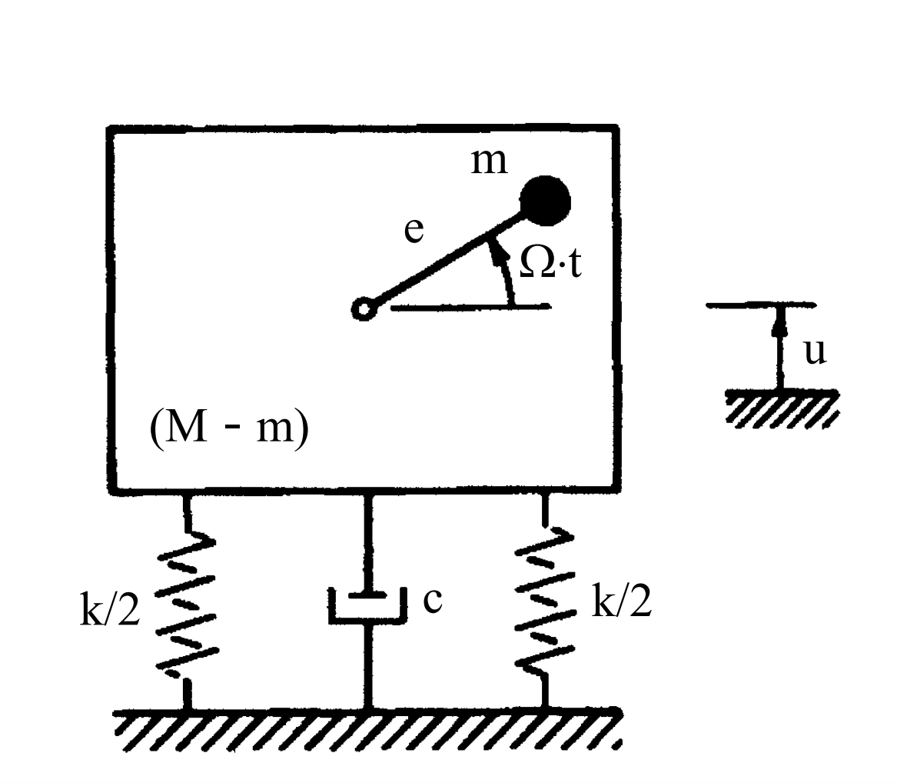

# 考題編號：SD-2005-4

**主分類：** `SD-U1` 結構動力學基礎
**副分類：** `SD-U1-3` 單自由度系統動態分析
**分析方法：** SDOF 強迫振動（旋轉不平衡激振）
**標籤：** `SDOF` `旋轉不平衡` `馬達振動` `強迫振動` `穩態反應` `傳遞力` `遲滯阻尼`

---

## 1. 原始題目重述 (Problem Restatement)

一棟建築物內裝有一馬達，條件如下：
- **馬達質量：** $m$，以角頻率 $\Omega$ rad/s 運轉，質心偏心距為 $e$
- **建築物＋馬達總質量：** $M$（建築物相對基礎視為剛性體）
- **基礎：** 勁度 $k$（左右各 $k/2$）；遲滯阻尼係數 $c$（阻尼器一支）
- **自由度：** 垂直方向位移 $u$（向上為正）

(一) 請導出垂直方向運動方程式。（10 分）
(二) 請導出垂直方向穩態振動反應位移。（10 分）
(三) 請計算作用於基礎之力。（5 分）

*圖說：旋轉不平衡系統。馬達偏心質量 m、偏心距 e、角速度 Ω；建築＋馬達總質量 M；彈簧總勁度 k（左右各 k/2）；阻尼係數 c；系統垂直位移 u。*

---

## 2. 考題核心精神與出題者意圖 (Core Concepts & Examiner's Intent)

**核心觀念：** 旋轉不平衡（Rotating Unbalance）是機械工程與結構動力學的經典問題。馬達偏心質量 $m$ 旋轉時產生垂直向周期性力（離心力的垂直分量），激振安裝基礎，產生穩態振動。

**出題者意圖：**
- 測驗 Newton 第二定律推導含旋轉偏心質量的運動方程式
- 測驗 SDOF 穩態強迫振動（旋轉不平衡型激振）的解析
- 測驗傳遞力（Transmitted Force）的推導（彈簧力 + 阻尼力之向量合成）
- 注意遲滯阻尼（hysteretic damping）在穩態分析中可以等效處理的觀念

---

## 3. 解題戰略地圖與陷阱分析 (Strategic Roadmap & Trap Analysis)

### 作戰計畫
1. **推導運動方程式：** 分離「偏心質量 $m$」和「其餘質量 $M-m$」，列各自 Newton 方程後相加，消去內力
2. **穩態解析：** 假設 $u(t) = X\sin(\Omega t - \phi)$，代入方程求振幅 $X$ 及相位 $\phi$
3. **傳遞力：** 基礎受到彈簧力 $ku$ 和阻尼力 $c\dot{u}$，兩者相差 90°，取向量合成

### 關鍵陷阱

| 陷阱 | 說明 | 應對 |
|------|------|------|
| ① 偏心加速度方向 | 偏心質量 $m$ 的絕對加速度 = $\ddot{u} - e\Omega^2\sin\Omega t$（垂直分量）| 垂直方向：$\ddot{y}_m = \ddot{u} - e\Omega^2\sin\Omega t$ |
| ② 等效激振力方向 | 激振力 $me\Omega^2\sin\Omega t$ 出現在**等號右邊**（外力側）| 移項整理後：$M\ddot{u}+c\dot{u}+ku = me\Omega^2\sin\Omega t$ |
| ③ 傳遞力非僅彈簧力 | 基礎受到彈簧力＋阻尼力，兩者不同相，需向量合成 | $F_T = X\sqrt{k^2+(c\Omega)^2}$ |
| ④ 遲滯阻尼等效處理 | 本題圖示有阻尼器（dashpot），穩態分析中以等效黏滯阻尼 $c$ 代入方程即可 | 說明對穩態解無影響 |

---

## 3.5 變數層次分析 (Variable Hierarchy Analysis)

> 複習提示：第一次解題後，在每個卡住的知識點旁標記 `⚠`；第二次複習時只看有 `⚠` 的項目。

### 最終目標
推導運動方程式 → 求穩態位移振幅 $X$ 與相位 $\phi$ → 求傳遞至基礎的最大力 $F_T$。

### 本題關鍵公式（依計算順序）

$$\text{Step 1: Newton 定律} \Rightarrow M\ddot{u} + c\dot{u} + ku = me\Omega^2\sin\Omega t$$

$$\text{Step 2: 假設穩態解} \Rightarrow u(t) = X\sin(\Omega t - \phi)$$

$$\text{Step 3: 振幅} \Rightarrow X = \frac{me\Omega^2}{\sqrt{(k-M\Omega^2)^2+(c\Omega)^2}}$$

$$\text{Step 4: 相位} \Rightarrow \phi = \arctan\!\left(\frac{c\Omega}{k-M\Omega^2}\right)$$

$$\text{Step 5: 傳遞力振幅} \Rightarrow F_T = \boxed{X} \cdot \sqrt{k^2+(c\Omega)^2}$$

### L1：題目直接給定

| 符號 | 說明 |
|------|------|
| $m$ | 偏心旋轉質量 |
| $e$ | 偏心距 |
| $\Omega$ | 馬達角速度（rad/s） |
| $M$ | 總系統質量（建築物＋馬達） |
| $k$ | 基礎總勁度（兩側 $k/2$ 合計） |
| $c$ | 阻尼係數 |
| $u$ | 垂直位移（待求） |

### L2：需知識點推導

**運動方程推導**

| 符號 | 公式／來源 | 卡關? |
|------|-----------|-------|
| $\ddot{y}_m$ | 偏心質量絕對加速度（垂直）= $\ddot{u} - e\Omega^2\sin\Omega t$ | |
| 等效激振力 | $me\Omega^2\sin\Omega t$（由 Newton 推導後移項） | |
| 運動方程 | $M\ddot{u}+c\dot{u}+ku = me\Omega^2\sin\Omega t$ | |

**穩態振幅與相位**

| 符號 | 公式／來源 | 卡關? |
|------|-----------|-------|
| $X$ | $me\Omega^2 / \sqrt{(k-M\Omega^2)^2+(c\Omega)^2}$ | |
| $\phi$ | $\arctan[c\Omega/(k-M\Omega^2)]$ | |

**傳遞力**

| 符號 | 公式／來源 | 卡關? |
|------|-----------|-------|
| $F_{spring}$ | $kX\sin(\Omega t-\phi)$（最大值 $kX$） | |
| $F_{damp}$ | $c\Omega X\cos(\Omega t-\phi)$（最大值 $c\Omega X$，與彈力差 90°）| |
| $F_T$ | $X\sqrt{k^2+(c\Omega)^2}$（向量合成） | |

### L3：深層知識（不懂就卡住）

| 知識點 | 說明 | 卡關? |
|--------|------|-------|
| 旋轉不平衡的激振力 | 偏心質量做圓周運動，垂直分量 = $me\Omega^2\sin\Omega t$（離心加速度的投影）| |
| 為何要「分離質量」推導 | 整個系統質量為 $M$，但只有 $m$ 有額外的偏心加速度；需分開列方程再合併消去內力 | |
| 傳遞力為何是向量合成 | 彈簧力∝位移（與 $u$ 同相）；阻尼力∝速度（與 $\dot{u}$ 同相，即超前 90°）→ 兩力相差 90° → 取 $\sqrt{\cdot}$ | |
| 靜力平衡位置的選取 | 靜力平衡後重力抵消，$u$ 僅表示自靜平衡位置之動態位移，$mg$ 項不出現在動態方程中 | |

---

## 4. 步驟化詳細計算過程 (Step-by-Step Detailed Calculation)

### (一) 推導垂直方向運動方程式

#### 系統分解

將系統分為兩部分：

| 部分 | 質量 | 垂直位移 | 說明 |
|------|------|---------|------|
| 建築物＋馬達殼體 | $M - m$ | $u(t)$ | 與基礎一起振動，位移為 $u$ |
| 馬達偏心質量 | $m$ | $y_m(t)$ | 位移 = $u + e\sin\Omega t$（偏心旋轉的垂直分量）|

#### 偏心質量 $m$ 的垂直加速度

$$y_m = u + e\sin(\Omega t)$$

$$\ddot{y}_m = \ddot{u} - e\Omega^2\sin(\Omega t)$$

#### Newton 第二定律（靜平衡後的動態方程）

**對 $(M-m)$ 部分**（建築物殼體，受基礎彈力、阻尼力及偏心質量的內力 $N$）：

$$(M-m)\ddot{u} = -ku - c\dot{u} + N$$

**對 $m$ 部分**（偏心質量，受殼體對其的接觸力 $-N$）：

$$m\,\ddot{y}_m = m\left(\ddot{u} - e\Omega^2\sin\Omega t\right) = -N$$

**兩式相加，消去內力 $N$：**

$$(M-m)\ddot{u} + m\left(\ddot{u} - e\Omega^2\sin\Omega t\right) = -ku - c\dot{u}$$

$$M\ddot{u} - me\Omega^2\sin\Omega t = -ku - c\dot{u}$$

$$\boxed{M\ddot{u} + c\dot{u} + ku = me\Omega^2\sin(\Omega t)}$$

> **物理解釋：** 等號右側 $me\Omega^2\sin\Omega t$ 為旋轉偏心質量在垂直方向對系統產生的等效周期激振力，頻率為馬達轉速 $\Omega$，振幅為 $me\Omega^2$（離心力）。

---

### (二) 推導垂直方向穩態振動反應位移

#### 使用複數法求穩態解

令 $u(t) = \text{Im}\!\left[U e^{i\Omega t}\right]$，代入運動方程：

$$\left(-M\Omega^2 + ic\Omega + k\right)U = me\Omega^2$$

$$U = \frac{me\Omega^2}{(k - M\Omega^2) + ic\Omega}$$

振幅：

$$X = |U| = \frac{me\Omega^2}{\sqrt{(k-M\Omega^2)^2 + (c\Omega)^2}}$$

相位角（位移落後激振力的相位）：

$$\phi = \arctan\!\left(\frac{c\Omega}{k - M\Omega^2}\right)$$

**穩態位移反應：**

$$\boxed{u_{ss}(t) = \frac{me\Omega^2}{\sqrt{(k-M\Omega^2)^2 + (c\Omega)^2}} \cdot \sin(\Omega t - \phi)}$$

其中 $\phi = \arctan\!\left(\dfrac{c\Omega}{k - M\Omega^2}\right)$

#### 另以頻率比表示（無因次化）

定義：
$$\omega_n = \sqrt{\frac{k}{M}},\quad r = \frac{\Omega}{\omega_n},\quad \xi = \frac{c}{2M\omega_n}$$

則：

$$X = \frac{m}{M} \cdot e \cdot \frac{r^2}{\sqrt{(1-r^2)^2 + (2\xi r)^2}}$$

$$u_{ss}(t) = \frac{m}{M} \cdot e \cdot \frac{r^2}{\sqrt{(1-r^2)^2+(2\xi r)^2}} \cdot \sin(\Omega t - \phi)$$

> **共振條件：** 當 $\Omega \to \omega_n$（即 $r \to 1$），若阻尼極小則 $X \to \infty$，須避免馬達轉速接近結構自然頻率。

---

### (三) 計算作用於基礎之力

基礎受到兩個力：
1. **彈簧恢復力**：$F_k(t) = k \cdot u(t) = kX\sin(\Omega t - \phi)$（最大值 $kX$）
2. **阻尼力**：$F_c(t) = c\dot{u}(t) = c\Omega X\cos(\Omega t - \phi)$（最大值 $c\Omega X$）

由於 $F_k$ 與 $F_c$ 相位差 $90°$，以向量（相量）合成：

$$F_T(t) = kX\sin(\Omega t - \phi) + c\Omega X\cos(\Omega t - \phi)$$

最大傳遞力振幅：

$$\boxed{F_T = X\sqrt{k^2 + (c\Omega)^2} = \frac{me\Omega^2 \cdot \sqrt{k^2 + (c\Omega)^2}}{\sqrt{(k-M\Omega^2)^2 + (c\Omega)^2}}}$$

完整時間函數：

$$F_T(t) = F_T \cdot \sin(\Omega t - \phi + \psi)$$

其中 $\psi = \arctan\!\left(\dfrac{c\Omega}{k}\right)$（傳遞力相對位移的相位超前）

> **物理意義：** $F_T$ 即為建築物底部基礎所受的最大動態力，工程上稱為「傳遞力（Transmitted Force）」，設計基礎時需考慮此力的影響。

---

## 5. 關鍵爭議點與進階探討 (Critical Issues & Advanced Discussion)

**1. 遲滯阻尼（Hysteretic Damping）與黏滯阻尼的比較**

本題明確標示「遲滯阻尼」。嚴格處理時：

| 阻尼模型 | 運動方程 | 穩態位移 $X$ |
|---------|---------|------------|
| **黏滯阻尼** $c$（圖中 dashpot）| $M\ddot{u}+c\dot{u}+ku = F$ | $me\Omega^2/\sqrt{(k-M\Omega^2)^2+(c\Omega)^2}$ |
| **遲滯阻尼**（損失因子 $\eta$） | $M\ddot{u}+k(1+i\eta)u = F$（頻域） | $me\Omega^2/\sqrt{(k-M\Omega^2)^2+(\eta k)^2}$ |

若題目的 $c$ 即為遲滯阻尼中的損失因子（$\eta = c$，無因次），則：

$$X_{\rm hysteretic} = \frac{me\Omega^2}{\sqrt{(k-M\Omega^2)^2 + (ck)^2}}$$

$$F_T^{\rm hysteretic} = X \cdot k\sqrt{1+c^2}$$

**考場建議：** 圖示顯示 dashpot，故採黏滯阻尼公式較為安全。若要討論遲滯阻尼，可在答題後補充說明兩種模型的差異。

**2. 靜力項的處理**

推導時已默認以靜力平衡位置為 $u = 0$ 的基準，因此重力 $Mg$ 與彈簧靜力平衡後相消，動態方程中不含重力項。這是結構動力學的標準處理方式。

**3. 工程應用**

- **隔振設計：** 選擇合適的 $k$，使 $\omega_n \ll \Omega$（$r \gg 1$），傳遞率 $T_R = F_T/(me\Omega^2) < 1$，即可達到隔振效果
- **共振迴避：** 啟動/停機過程中馬達轉速掃過 $\omega_n$，需快速通過或加大阻尼
- **遲滯阻尼** 在土壤或橡膠隔振墊中是真實存在的非線性阻尼型式，通常以頻率無關的損失因子 $\eta$ 建模

**4. 考場建議**

- 子題（一）的關鍵在「分離質量、合併方程、消去內力」這三步，需清楚寫出各部分的 Newton 方程
- 子題（二）複數法最快，也可用「待定係數法」設 $u = A\sin\Omega t + B\cos\Omega t$ 代入求 $A, B$ 再合成
- 子題（三）的向量合成是高頻考點：$F_k \perp F_c$，故 $F_T = \sqrt{F_k^2 + F_c^2}$，不可直接相加
