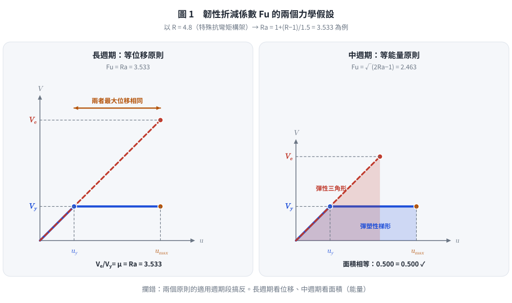
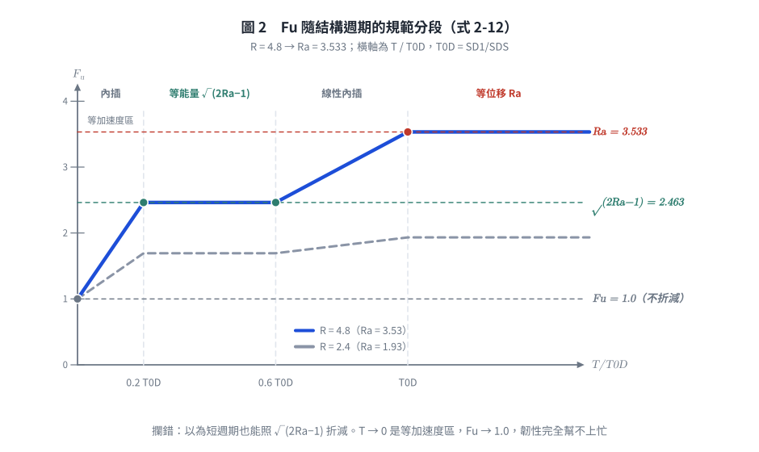
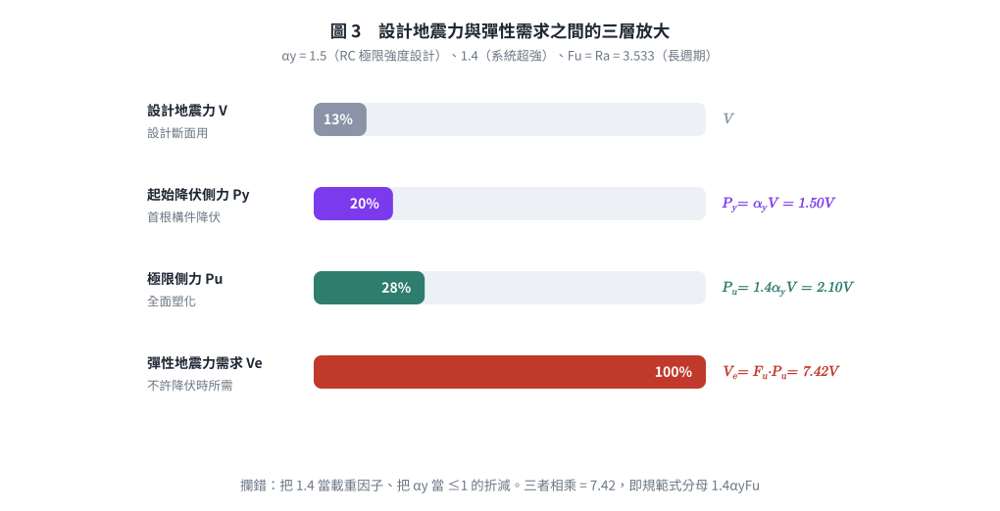

# 考題編號：SD-2007-1

**主分類：** `SD-U2-2` 建築耐震設計規範
**副分類：** `SD-U3-1` 結構耐震設計
**分析方法：** 概念題／規範推導
**標籤：** `最小設計水平總橫力` `韌性設計` `韌性折減係數` `等位移原則` `等能量原則` `等加速度原則` `Fu` `Ra` `容許韌性容量` `結構系統韌性容量` `起始降伏地震力放大倍數` `系統超強` `用途係數`

---

## 1. 原始題目重述 (Problem Restatement)

建築物耐震設計規範規定，構造物各主軸方向最小設計水平總橫力 $V$ 依下式計算：

$$V = \frac{S_{aD}\,I}{1.4\,\alpha_y\,F_u}\,W \tag{1}$$

其中（依《建築物耐震設計規範及解說》符號定義）：
- $S_{aD}$：工址設計地震之**水平譜加速度係數**（對應結構基本振動週期 $T$，無因次，以 $g$ 為單位）
- $I$：**用途係數**（一般建築 1.0；重要建築 1.25／1.5）
- $\alpha_y$：**起始降伏地震力放大倍數**——設計地震力放大 $\alpha_y$ 倍後，結構產生第一個斷面降伏。**無因次且 $\alpha_y \ge 1$**（規範解說：RC 極限強度設計 $\alpha_y = 1.5$；鋼結構極限設計 $\alpha_y = 1.0$；鋼結構容許應力設計 $\alpha_y = 1.2$）
- $F_u$：**結構系統地震力折減係數**（韌性容量所對應之折減，由容許韌性容量 $R_a$ 與週期決定）
- $W$：建築物**全部靜載重**（必要時含部分活載重）

> ⚠ $\alpha_y$ **不是**「降伏剪力／建築物重量」那種無因次地震係數，而是一個 $\ge 1$ 的**放大倍數**；
> 2025 年考題（SD-2025-1）直接給 $\alpha_y = 1.4$，即可佐證其量級。

**子題（一）（10分）：** 韌性設計之最小設計水平總橫力為何需要依式(1)計算？

**子題（二）（15分）：**
式(1)中：
- 長週期建築物：$F_u = R_a$
- 中週期建築物：$F_u = \sqrt{2R_a - 1}$
- 其中 $R_a = 1 + \dfrac{R-1}{1.5}$，$R$ 為結構系統韌性容量。

請說明 $F_u$ 及 $R_a$ 的假設基礎，並推導之。

---

## 2. 考題核心精神與出題者意圖 (Core Concepts & Examiner's Intent)

**核心精神：** 本題考查考生對「韌性折減」背後物理假設的理解——結構在大地震下允許降伏，以非線性消能換取設計力的降低。出題者不只想要公式背誦，而是要求推導等位移（long period）與等能量（short/medium period）兩種原則下的折減係數。

**出題者意圖：**
1. 測試考生能否解釋為何韌性設計可用較低設計力（非線性→消能→折減）
2. 測試能否從力-位移圖推導 $F_u = R_a$（等位移）與 $F_u = \sqrt{2R_a-1}$（等能量）
3. 測試 $R_a$ 的物理意義（設計地震下的**容許**韌性容量，只准用掉 $R$ 的 2/3）

**陷阱：** 混淆 $R$（結構系統韌性容量，規範表列上限）與 $R_a$（容許韌性容量）、把 $\alpha_y$ 當成 $\le 1$ 的折減係數、以及 $F_u$ 在不同週期段的不同形式。

---

## 3. 解題戰略地圖與陷阱分析 (Strategic Roadmap & Trap Analysis)

**作戰計畫：**
1. 子題(一)：從「彈性需求→降伏設計→允許韌性消能→最低強度下限」解釋公式來源
2. 子題(二)：畫力-位移圖，分別用等位移與等能量假設推導 $F_u$，再說明 $R_a$ 的引入原因

**關鍵陷阱：**

| # | 陷阱 | 應對策略 |
|---|------|---------|
| 1 | 等位移 vs 等能量適用週期段搞反 | 長週期（$T \ge T_0^D$）→等位移 $F_u=R_a$；中週期（$0.2T_0^D \le T \le 0.6T_0^D$）→等能量 $F_u=\sqrt{2R_a-1}$ |
| 2 | 以為「短週期也是等能量」 | 極短週期（$T \to 0$）是**等加速度**區，$F_u \to 1.0$（結構跟著地表動，韌性幫不上忙），規範以內插銜接 |
| 3 | $R_a$ 與 $R$ 的關係：$R_a \ne R$ | $R_a = 1+(R-1)/1.5$，$R_a$ 是**容許**韌性容量（設計地震下只准用掉 $R$ 的 2/3） |
| 4 | 把 $\alpha_y$ 當成 $\le 1$ 的折減係數 | $\alpha_y \ge 1$，是**放大**倍數（設計力 → 起始降伏力）；$1.4\alpha_y$ 才是設計力 → 極限側力 |
| 5 | 公式(1)分母中的 1.4 含義不明 | 1.4 是**靜不定結構由首根構件降伏到全面塑化**的超強倍數（規範解說 2.2：外力須調升至 $1.4P_y$ 結構才達最大側力 $P_u$），不是荷重因子 |

---

## 3.5 變數層次分析 (Variable Hierarchy Analysis)

> 複習提示：第一次解題後，在每個卡住的知識點旁標記 `⚠`；第二次複習時只看有 `⚠` 的項目。

### 最終目標
推導最小設計水平總橫力公式，說明結構系統地震力折減係數 $F_u$（長週期／中週期）及容許韌性容量 $R_a$ 的物理基礎與推導過程。

### 本題關鍵公式（依計算順序）

$$\text{Step 1：} V_e = I\,S_{aD} \cdot W \quad \text{（若結構保持彈性所需的地震力需求）}$$

$$\text{Step 2：} P_y = \alpha_y V \;,\quad P_u = 1.4\,\alpha_y V \quad \text{（設計力} \to \text{起始降伏力} \to \text{極限側力）}$$

$$\text{Step 3：} F_u = \frac{V_e}{P_u} = \frac{V_e}{1.4\,\alpha_y V} \quad \text{（折減係數定義：彈性需求／結構實際極限側力）}$$

$$\text{Step 4：} R_a = 1 + \frac{R-1}{1.5} \quad \text{（容許韌性容量：設計地震下只准用掉 } R \text{ 的 2/3）}$$

$$\text{Step 5（等位移，長週期）：} u_{max,elastic} = u_{max,inelastic} \Rightarrow \boxed{F_u = \boxed{R_a}}$$

$$\text{Step 6（等能量，中週期）：} E_{elastic} = E_{inelastic} \Rightarrow \boxed{F_u = \sqrt{2\boxed{R_a} - 1}}$$

$$\text{Step 7：} V = \frac{I\,S_{aD}}{1.4\,\alpha_y\,\boxed{F_u}}\,W \quad \text{（由 Step 3 反解，即最小設計水平總橫力）}$$

### L1：題目直接給定

| 符號 | 數值 | 說明 |
|------|------|------|
| $S_{aD}$ | — | 工址設計地震水平譜加速度係數（週期的函數） |
| $I$ | — | 用途係數 |
| $\alpha_y$ | — | 起始降伏地震力放大倍數（$\ge 1$） |
| $R$ | — | 結構系統韌性容量（規範表 1-3 指定值，如特殊抗彎矩構架 $R=4.8$） |
| $W$ | — | 建築物全部靜載重 |

### L2：需知識點推導

**① 韌性折減係數推導**

| 符號 | 公式／來源 | 卡關? |
|------|-----------|-------|
| $V_e$ | $I\,S_{aD}\,W$，彈性地震力需求 | |
| $P_u$ | $1.4\alpha_y V$，結構實際可承受的最大側力 | |
| $F_u$ | $V_e / P_u$，折減係數定義 | |
| $R_a$ | $1+(R-1)/1.5$，容許韌性容量 | |
| $F_u$（長週期 $T \ge T_0^D$） | 等位移原則 → $F_u = R_a$ | |
| $F_u$（中週期 $0.2T_0^D \!\le\! T \!\le\! 0.6T_0^D$） | 等能量原則 → $F_u = \sqrt{2R_a-1}$ | |
| $T_0^D$ | $S_{D1}/S_{DS}$，設計反應譜短／中週期分界 | |

**② 公式(1)結構**

| 符號 | 公式／來源 | 卡關? |
|------|-----------|-------|
| $V$ | $I\,S_{aD} W / (1.4\,\alpha_y\,F_u)$ | |
| 1.4 | 首根構件降伏 → 全面塑化的超強倍數（$P_u = 1.4P_y$） | |
| $\alpha_y$ | 設計力 → 起始降伏力的放大倍數（$P_y = \alpha_y V$） | |

### L3：深層知識（不懂就卡住）

| 知識點 | 說明 | 卡關? |
|--------|------|-------|
| 等位移原則（長週期） | 長週期結構：彈性與非彈性最大位移近似相等 → $F_u=\mu$ | |
| 等能量原則（中週期） | 彈性應變能 = 彈塑性系統之彈性段 + 塑性消能面積 → $F_u=\sqrt{2\mu-1}$ | |
| 等加速度（極短週期） | $T \to 0$ 時結構與地表同動，位移延性無從發揮 → $F_u \to 1.0$ | |
| $R_a$ 的 1.5 由來 | 規範解說 2.9：**設計地震下只容許非彈性位移達極限值之 2/3**，餘裕留給最大考量地震（$S_{aM} = 1.5 S_{aD}$），故 $R_a = 1+(R-1)/1.5$ | |
| 韌性設計基本概念 | 設計力 < 彈性需求；靠降伏變形消散能量；再以韌性細部（強柱弱梁、圍束箍筋、剪力設計）確保能真的變形到 $R_a$ | |
| $\alpha_y$ 物理意義 | 起始降伏地震力放大倍數（$\ge 1$），反映設計時的保守與材料超強；$1.4\alpha_y$ 才是到全面塑化的總放大 | |

---

## 4. 步驟化詳細計算過程 (Step-by-Step Detailed Calculation)

### 子題（一）：最小設計水平總橫力為何需依式(1)計算

**背景：彈性設計力 vs 韌性設計力**

在設計地震（回歸期 475 年，50 年超越機率約 10%）作用下，若要求結構全程維持彈性，所需地震力為：

$$V_e = I\,S_{aD} \cdot W$$

以 $S_{aD}$ 常見量級（0.3～0.8g）估算，$V_e$ 可達 $0.3W \sim 0.8W$，遠大於一般設計荷重；若真以 $V_e$ 設計，斷面與配筋量在經濟上完全不合理，且台灣 475 年一遇的地震在建築 50 年壽命內本來就大概率不會發生。

**韌性設計的基本概念：**

允許結構在大地震中超越彈性限度而降伏，但透過良好的韌性設計（如強柱弱梁、圍束箍筋）確保結構具有足夠的非線性變形能力，以消散地震輸入能量，避免倒塌。

**公式推導邏輯：**

**由「設計地震力 $V$」走到「結構實際極限側力 $P_u$」的兩段放大：**

設計者拿 $V$ 去設計斷面，但結構真正能扛的側力比 $V$ 大得多，中間隔了兩層超強：

$$P_y = \alpha_y\,V \quad\text{（第一個斷面降伏；}\alpha_y\text{ 來自設計保守與材料超強）}$$

$$P_u = 1.4\,P_y = 1.4\,\alpha_y\,V \quad\text{（全面塑化；1.4 來自靜不定結構的內力重分配）}$$

> 規範解說 2.2 的原話是：**外力須調升至 $1.4P_y$ 後，結構才達其能承受的最大側力 $P_u$**。
> 所以 1.4 是「首根構件降伏 → 機構形成」的**系統超強**，不是載重因子，也不是安全係數。

**再由「彈性需求」走回「極限側力」——這一步才是韌性折減：**

允許結構在設計地震中降伏，以非線性變形消散能量，於是結構只需具備彈性需求的 $1/F_u$：

$$P_u = \frac{V_e}{F_u} \quad\Longrightarrow\quad 1.4\,\alpha_y\,V = \frac{I\,S_{aD}\,W}{F_u}$$

移項即得規範式(1)：

$$\boxed{V = \frac{I\,S_{aD}}{1.4\,\alpha_y\,F_u}\,W}$$

**物理意義（三個分母各扣一層）：**

| 項 | 扣掉什麼 | 對應的物理事實 |
|----|---------|--------------|
| $F_u$ | 韌性折減 | 允許降伏、以塑性變形消能，不必保持彈性 |
| $\alpha_y$ | 起始降伏超強 | 設計時的保守與材料實際強度 > 標稱強度 |
| 1.4 | 系統超強 | 靜不定結構首根構件降伏後仍能重分配到全面塑化 |

**為什麼要寫成「最小」設計水平總橫力：** 這三層折減都建立在「結構真的做得到那麼韌」的前提上；規範因此把式(1)訂為**下限**，並以韌性細部規定（強柱弱梁、圍束箍筋、剪力強度大於彎矩強度所對應之剪力）作為配套，缺一不可。

---

### 子題（二）：$F_u$ 及 $R_a$ 的假設與推導

#### 2.1 定義與符號說明

以理想化彈塑性力-位移關係說明：

```
  力 V
   ^
Ve |......./................  ← 彈性需求
   |      /
Vy |----/  _______________   ← 降伏剪力（水平線）
   |   /  /
   |  /  /  塑性變形
   | /  /
   |/__/________________________> 位移 u
   0   uy          umax
```

- $V_e$：彈性需求力（彈性系統的最大反應力）
- $V_y$：彈塑性系統的降伏側力（在規範架構中即 $P_u = 1.4\alpha_y V$）
- $u_y = V_y / k$：降伏位移
- $u_{max}$：最大非線性位移
- $\mu = u_{max} / u_y$：**位移延性比**（結構真正被要求發揮的韌性需求）

韌性折減係數：

$$F_u = \frac{V_e}{V_y}$$

目標：找出 $F_u$ 與 $\mu$ 的關係，再把設計上容許的 $\mu$ 代成 $R_a$。

> **符號分工先講清楚，否則後面必混：**
> $R$ = 規範表列的結構系統**韌性容量**（上限，特殊抗彎矩構架 $R=4.8$）；
> $R_a$ = 設計地震下的**容許**韌性容量（$= 1+\frac{R-1}{1.5}$）；
> $\mu$ = 力學推導中的位移延性比。推導用 $\mu$，代設計值時令 $\mu = R_a$。

---

#### 2.2 長週期建築物：等位移原則 → $F_u = R_a$

**假設：** 對於長週期結構（$T > T_c$），彈性與非彈性系統在地震下達到相同的最大位移。

$$u_{max,\text{非彈性}} = u_{max,\text{彈性}}$$

彈性系統最大位移：

$$u_{max,e} = \frac{V_e}{k}$$

非彈性系統最大位移（超過降伏點後水平延伸）：

$$u_{max,i} = \mu \cdot u_y = \mu \cdot \frac{V_y}{k}$$

等位移條件：

$$\frac{V_e}{k} = \mu \cdot \frac{V_y}{k}$$

$$F_u = \frac{V_e}{V_y} = \mu$$

設計時容許發揮的延性比即容許韌性容量，令 $\mu = R_a$：

$$\boxed{F_u = R_a} \qquad (T \ge T_0^D)$$

**為什麼長週期成立等位移？** 長週期結構的振動週期遠長於地表運動的主要週期，
結構質量來不及跟隨地表加速度，其位移主要由地表**位移**決定；
降伏與否改變的是「力」而非「地表能把它推多遠」，故彈性與非彈性系統的最大位移接近。

---

#### 2.3 中週期建築物：等能量原則 → $F_u = \sqrt{2R_a - 1}$

**假設：** 對於中週期結構，彈性系統吸收的最大應變能等於非彈性系統消散的總能量（彈性應變能 + 塑性消能）。

彈性系統最大應變能（三角形面積）：

$$E_e = \frac{1}{2}\,V_e \cdot u_{max,e} = \frac{V_e^2}{2k}$$

非彈性系統消散能量（梯形面積 = 彈性三角形 + 塑性矩形）：

$$E_i = \frac{1}{2}\,V_y \cdot u_y + V_y(u_{max} - u_y)$$

$$= \frac{V_y^2}{2k} + V_y \cdot u_y(\mu - 1)$$

$$= \frac{V_y^2}{2k} + \frac{V_y^2}{k}(\mu - 1)$$

$$= \frac{V_y^2}{k}\left[\frac{1}{2} + (\mu - 1)\right]$$

$$= \frac{V_y^2}{2k}(2\mu - 1)$$

等能量條件 $E_e = E_i$：

$$\frac{V_e^2}{2k} = \frac{V_y^2}{2k}(2\mu - 1)$$

$$\left(\frac{V_e}{V_y}\right)^2 = 2\mu - 1$$

$$F_u = \frac{V_e}{V_y} = \sqrt{2\mu - 1}$$

令 $\mu = R_a$：

$$\boxed{F_u = \sqrt{2R_a - 1}} \qquad (0.2T_0^D \le T \le 0.6T_0^D)$$

**為什麼中週期成立等能量？** 中週期落在反應譜的**等速度**區，地震輸入結構的能量大致與強度無關；
降伏後系統以「較低的力 × 較長的行程」吸收同一份能量，故以面積（能量）相等而非位移相等來對應。

**三段合起來看（規範式 2-12 的完整分段）：**

| 週期段 | 力學假設 | $F_u$ |
|--------|---------|-------|
| $T \ge T_0^D$（長週期） | 等位移 | $R_a$ |
| $0.6T_0^D < T < T_0^D$ | — | 兩者線性內插 |
| $0.2T_0^D \le T \le 0.6T_0^D$（中週期） | 等能量 | $\sqrt{2R_a-1}$ |
| $0 < T < 0.2T_0^D$ | — | 內插至 1.0 |
| $T \to 0$（極短週期） | 等加速度 | $1.0$（韌性完全幫不上忙） |

其中 $T_0^D = S_{D1}/S_{DS}$ 為設計反應譜的短／中週期分界。
因 $R_a > 1$ 時恆有 $\sqrt{2R_a-1} < R_a$，**同一結構在中週期得到的折減比長週期少**，設計力較大——這正是等能量比等位移保守的體現。

---



*圖 1　兩個力學假設的幾何意義。左圖看的是「兩條曲線的最大位移相同」，右圖看的是「兩塊面積相同」。它攔的是把兩個原則的適用週期段搞反——這是本子題最直接的失分點，且圖上兩塊填色面積的數值由程式算出並標示為相等，可自行驗核。*

#### 2.4 容許韌性容量 $R_a$ 的由來

結構系統韌性容量 $R$ 是規範表 1-3 的指定值，代表該結構系統在**最大考量地震**下、
經韌性細部設計後可以安全發揮的位移延性容量上限。

**關鍵在於：設計地震並不是最大考量地震。**

規範的設計反應譜與最大考量地震反應譜之間的關係是

$$S_{DS} = \tfrac{2}{3}S_{MS}\,,\quad S_{D1} = \tfrac{2}{3}S_{M1} \quad\Longrightarrow\quad S_{aM} = 1.5\,S_{aD}$$

也就是最大考量地震大約是設計地震的 **1.5 倍**。若在設計地震就把 $R$ 用滿，
到了最大考量地震便無韌性餘裕可用，「大震不倒」就失去保障。因此規範解說 2.9 規定：
**設計地震下只容許非彈性位移達極限值之 $2/3$（即 $1/1.5$）**，於是

$$\boxed{R_a = 1 + \frac{R - 1}{1.5}}$$

**逐項物理意義：**
- $R-1$：超出彈性範圍的韌性「可用額度」
- $\dfrac{1}{1.5} = \dfrac{2}{3}$：設計地震下**只准動用其中三分之二**，另三分之一保留給最大考量地震
- 加回 1.0：確保 $R_a \ge 1$（韌性容量 $R=1$ 的無韌性結構 $\Rightarrow R_a = 1 \Rightarrow F_u = 1$，完全不折減）

**數值示例（規範表 1-3 之特殊抗彎矩構架 $R = 4.8$）：**

$$R_a = 1 + \frac{4.8-1}{1.5} = 1 + 2.533 = 3.533$$

$$F_u\big|_{\text{長週期}} = 3.53\,,\qquad F_u\big|_{\text{中週期}} = \sqrt{2(3.533)-1} = \sqrt{6.067} = 2.46$$

同一棟高韌性建築，落在長週期段可折減 3.53 倍，落在中週期段只能折減 2.46 倍。

---



*圖 2　$F_u$ 的完整週期分段（規範式 2-12），以 $R = 4.8$ 與 $R = 2.4$ 兩條曲線對照。它攔的是「短週期也照 $\sqrt{2R_a-1}$ 折減」的誤解：$T \to 0$ 是等加速度區，$F_u \to 1.0$，韌性完全發揮不了。*



*圖 3　從設計地震力到彈性需求的三層放大。它攔的是子題(一)最常見的含糊：把 1.4 當載重因子、把 $\alpha_y$ 當 $\le 1$ 的折減係數。三段各自代表什麼超強，圖上一次講完。*

## 5. 關鍵爭議點與進階探討 (Critical Issues & Advanced Discussion)

**1. 等位移與等能量原則的週期分界不是固定秒數**

分界由設計反應譜自己決定：$T_0^D = S_{D1}/S_{DS}$，隨震區與地盤種類而變（常見量級 0.5～1.2 秒，第三類地盤與臺北盆地明顯偏長）。
把它背成「0.3～0.5 秒」是錯的——同一棟樓在堅實地盤可能算長週期，換到軟弱地盤就落回中週期，$F_u$ 隨之從 $R_a$ 掉到 $\sqrt{2R_a-1}$。
考場上若題目未給 $S_{DS}$、$S_{D1}$，直接依題目指定的「長週期／中週期」歸類作答即可。

**2. 1.4 的含義（最常被含糊帶過的一分）**

1.4 **不是**載重因子，也不是籠統的「安全係數」。規範解說 2.2 的定義是：
外力須調升至 $1.4P_y$ 後，靜不定結構才由「第一個斷面降伏」走到「全面塑化、達到能承受的最大側力 $P_u$」。
它量化的是**系統超強（system overstrength）／內力重分配能力**。
與之對照，$\alpha_y$ 量化的是「設計地震力 → 第一個斷面降伏」這一段，兩者相乘才是設計力到極限側力的總放大。

> 順帶一提：橋梁耐震設計規範對應的係數取 1.2 而非 1.4，正是因為橋墩多為單一載重路徑、
> 靜不定度低、降伏後可重分配的餘裕遠小於建築構架。這是同一個物理量在兩本規範中的不同取值。

**3. $R_a$ 的 1.5 是「地震水準比」，不是「品質變異折扣」**

有一種常見的錯誤說法是「1.5 是考慮施工品質變異與韌性不確定性的保守係數」。
規範解說 2.9 給的理由明確得多：**設計地震下只容許非彈性位移達極限值之 2/3**，
而最大考量地震約為設計地震的 1.5 倍（$S_{DS} = \frac{2}{3}S_{MS}$）。
換句話說，1.5 是把「韌性額度」按兩個地震水準的比例分配，
留下三分之一給「大震不倒」——這是**性能設計的分層邏輯**，不是統計上的安全係數。

**4. 為什麼是 $R_a$ 而不是 $R$ 進入 $F_u$**

順序不可顛倒：先由規範表查 $R$ → 折成 $R_a$ → 再依週期段算 $F_u$ → 最後才代入式(1)。
直接把 $R$ 當 $F_u$ 用（少了 1.5 這一折）會把設計地震力算小約 26%（以 $R=4.8$ 為例：$4.8$ vs $3.533$），是本題最實質的失分點。

**5. 考場建議**

子題(二)務必搭配力-位移示意圖說明等位移與等能量的幾何意義，配合代數推導，得分效果最佳。單純列公式而無圖形說明通常扣 5 分以上。
子題(一)則要把「$F_u$／$\alpha_y$／1.4 三層折減各扣什麼」講明白——只寫「韌性設計比較經濟」拿不到 10 分。

---

*圖解補繪：2026-09-02（向量圖，由 `gen_SD-2007-1.py` 產生，可重跑；SVG 供 wiki／PDF，2× PNG 供簡報與影片管線）*
