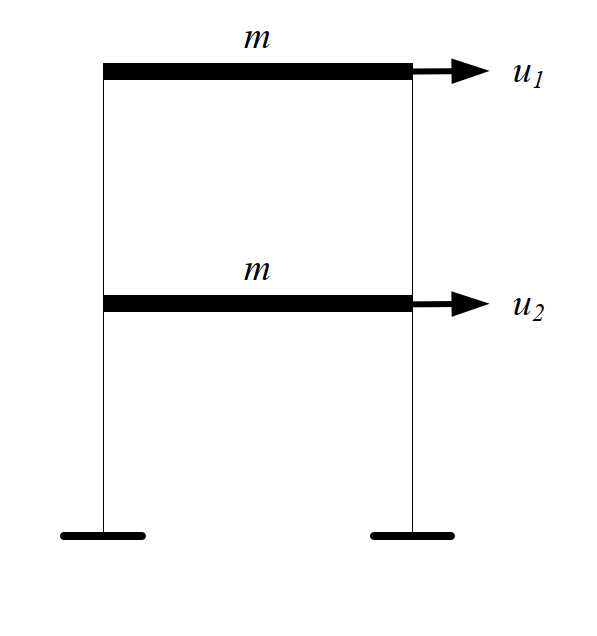

### 考題編號：SD-2008-1

**主分類：** `SD-U1-3` 單自由度、多自由度系統之動態分析及應用
**副分類：** `SD-U1-2` 運動方程式推導
**分析方法：** MDOF模態分析
**標籤：** `MDOF` `2自由度` `剪力建築` `特徵值問題` `自然頻率` `振態向量` `黃金比例振態` `Rayleigh阻尼` `阻尼係數矩陣` `模態阻尼比` `多振態反應譜疊加法`

---

## 1. 原始題目重述 (Problem Restatement)

一具傳統阻尼特性之**二層樓平面剪力樓房結構**，各層樓質量均為 $m = 1500\,\text{kg}$，每個樓層的側向勁度皆為 $k$（未知）。自由度 $u_1$（頂樓）、$u_2$（一樓）。

由系統識別得知：
- 第一模態自然週期：$T_1 = 0.197\,\text{sec}$
- 第二模態自然週期：$T_2 = 0.0752\,\text{sec}$
- 兩模態阻尼比均為：$\xi = 5\%$

*圖說：二層樓剪力建築，$m = 1500\,\text{kg}$（每層），側向勁度 $k$（每層），$u_1$ 為頂層位移，$u_2$ 為一樓位移。*

**子問題：**
- (一) 求側向勁度 $k = p \times 10^q\,\text{N/m}$（$p$ 為個位數整數，$q$ 為整數）
- (二) 求各模態振態向量（$u_1$ 對應分量正規化為 1）
- (三) 求阻尼係數矩陣 $[C]$
- (四) 多振態反應譜疊加法是否需要建立阻尼係數矩陣？

---

## 2. 考題核心精神與出題者意圖 (Core Concepts & Examiner's Intent)

本題考核 **MDOF 系統的完整模態分析流程**，同時測試考生對 **Rayleigh 阻尼**的掌握，以及對「多振態反應譜法不需要物理阻尼矩陣」此一關鍵概念的理解。

出題者特意選擇等質量等勁度的 2DOF 系統，使特徵值恰好出現**黃金比例**，測試考生是否能辨識這一優雅的數學結構。最後一問（四）是觀念題，考察考生是否真正理解模態解耦原理。

---

## 3. 解題戰略地圖與陷阱分析 (Strategic Roadmap & Trap Analysis)

**作戰計畫：**
1. 建立 $[M]$、$[K]$ 矩陣 → 寫出特徵值方程式
2. 由 $T_1$、$T_2$ 反推 $k$（兩個週期都能驗算）
3. 回代 $k$ 求振態向量（注意正規化方向為 $u_1 = 1$）
4. 由 Rayleigh 阻尼公式求 $\alpha$、$\beta$，再組裝 $[C]$
5. 回答概念問題（四）

**陷阱分析：**

| # | 陷阱 | 應對策略 |
|---|------|---------|
| 1 | 剪力建築 $[K]$ 矩陣元素符號錯誤 | 逐層分析：$K_{11}=k$，$K_{22}=2k$，$K_{12}=K_{21}=-k$ |
| 2 | 振態向量元素對應到哪個自由度 | $u_1$（頂層）歸一化為 1，$u_2$ 為下層分量 |
| 3 | Rayleigh 阻尼 $\alpha$、$\beta$ 公式搞錯 | $\xi_i = \alpha/(2\omega_i) + \beta\omega_i/2$，兩方程聯立 |
| 4 | 問（四）誤答「需要」 | 反應譜法已解耦，各模態方程只需 $\xi_i$，不需 $[C]$ |

---

## 3.5 變數層次分析 (Variable Hierarchy Analysis)

> 複習提示：第一次解題後，在每個卡住的知識點旁標記 `⚠`；第二次複習時只看有 `⚠` 的項目。

### 最終目標
`求側向勁度 k、振態向量 {φ}₁ 與 {φ}₂、阻尼係數矩陣 [C]，並判斷反應譜法是否需要 [C]`

### 本題關鍵公式（依計算順序）

$$\text{Step 1: } [K] = \begin{bmatrix} k & -k \\ -k & 2k \end{bmatrix}, \quad [M] = \begin{bmatrix} m & 0 \\ 0 & m \end{bmatrix}$$

$$\text{Step 2: } \det([K] - \omega^2[M]) = 0 \implies r^2 - 3r + 1 = 0, \quad r = \frac{\omega^2 m}{k}$$

$$\text{Step 3: } r_{1,2} = \frac{3 \pm \sqrt{5}}{2}, \quad k = \frac{\omega_1^2 m}{r_1} = \frac{(2\pi/T_1)^2 \cdot m}{r_1}$$

$$\text{Step 4: } (1 - r_i)\phi_{1i} = \phi_{2i} \implies \{φ\}_i \text{ 各分量比例}$$

$$\text{Step 5: } \alpha = \frac{2\xi\,\omega_1\omega_2}{\omega_1+\omega_2}, \quad \beta = \frac{2\xi}{\omega_1+\omega_2}$$

$$\text{Step 6: } [C] = \alpha[M] + \beta[K]$$

### L1：題目直接給定

| 符號 | 數值 | 說明 |
|------|------|------|
| $m$ | 1500 kg | 每層樓質量（兩層相同） |
| $T_1$ | 0.197 s | 第一模態自然週期 |
| $T_2$ | 0.0752 s | 第二模態自然週期 |
| $\xi$ | 0.05 | 兩模態阻尼比相同 |

### L2：需知識點推導

**Step 1：建立系統矩陣**

| 符號 | 公式/來源 | 卡關? |
|------|----------|:-----:|
| $K_{11}$ | $k$（頂層：僅第二層彈簧） | |
| $K_{22}$ | $2k$（一樓：第一＋第二層彈簧） | |
| $K_{12}$ | $-k$（兩層間耦合剪力） | |

**Step 2：特徵值方程式**

| 符號 | 公式/來源 | 卡關? |
|------|----------|:-----:|
| $r = \omega^2 m/k$ | 無因次頻率比（令特徵值方程降次） | |
| $r^2 - 3r + 1 = 0$ | 展開 $\det([K]-\omega^2[M])=0$ | |
| $r_1 = (3-\sqrt{5})/2$ | 二次公式，取較小根 | |
| $r_2 = (3+\sqrt{5})/2$ | 二次公式，取較大根 | |

**Step 3：求 k**

| 符號 | 公式/來源 | 卡關? |
|------|----------|:-----:|
| $\omega_1$ | $2\pi/T_1$ | |
| $k$ | $\omega_1^2 \cdot m / r_1$ | |

**Step 4：振態向量**

| 符號 | 公式/來源 | 卡關? |
|------|----------|:-----:|
| $\phi_{2i}$ | $(1-r_i)\cdot\phi_{1i}$（第一行方程回代） | |

**Step 5–6：Rayleigh 阻尼**

| 符號 | 公式/來源 | 卡關? |
|------|----------|:-----:|
| $\alpha$ | $2\xi\omega_1\omega_2/(\omega_1+\omega_2)$ | |
| $\beta$ | $2\xi/(\omega_1+\omega_2)$ | |
| $[C]$ | $\alpha[M]+\beta[K]$ | |

### L3：深層知識（不懂就卡住）

| 知識點 | 說明 | 卡關? |
|--------|------|:-----:|
| 剪力建築勁度矩陣 | $K_{ii}$ 包含連接到第 $i$ 層的**所有**彈簧之勁度總和（非僅單層） | |
| Rayleigh 阻尼假設 | $[C]=\alpha[M]+\beta[K]$ 保證模態正交，使各模態解耦成獨立 SDOF | |
| 反應譜法無需 $[C]$ | 模態解耦後，每個模態方程 $\ddot{q}_i+2\xi_i\omega_i\dot{q}_i+\omega_i^2 q_i=\cdots$ 只需 $\xi_i$，$[C]$ 不出現 | |
| 黃金比例振態 | 等質量等勁度 2DOF 的振態分量比例恰為黃金比例 $(1\!:\!0.618)$ 和 $(1\!:\!-\!1.618)$ | |

---

## 4. 步驟化詳細計算過程 (Step-by-Step Detailed Calculation)

> 📊 互動圖：`SD-2008-1-modal-viz.html`

### (一) 求側向勁度 $k$

**建立系統矩陣：**

$$[M] = \begin{bmatrix} m & 0 \\ 0 & m \end{bmatrix} = \begin{bmatrix} 1500 & 0 \\ 0 & 1500 \end{bmatrix}\,\text{kg}$$

$$[K] = \begin{bmatrix} k & -k \\ -k & 2k \end{bmatrix}\,\text{N/m}$$

**特徵值方程式：**

$$\det([K] - \omega^2[M]) = \begin{vmatrix} k-\omega^2 m & -k \\ -k & 2k-\omega^2 m \end{vmatrix} = 0$$

$$(k-\omega^2 m)(2k-\omega^2 m) - k^2 = 0$$

展開整理（令 $r = \omega^2 m/k$）：

$$k^2 - 3k(\omega^2 m) + (\omega^2 m)^2 = 0$$

$$\boxed{r^2 - 3r + 1 = 0}$$

解方程：

$$r = \frac{3 \pm \sqrt{5}}{2}$$

$$r_1 = \frac{3 - \sqrt{5}}{2} = 0.38197, \quad r_2 = \frac{3 + \sqrt{5}}{2} = 2.61803$$

> *策略註解：令 $r = \omega^2 m/k$ 是降次的關鍵技巧，使二次矩陣行列式變成標準二次方程。*

**由 $T_1$ 反推 $k$：**

$$\omega_1 = \frac{2\pi}{T_1} = \frac{2\pi}{0.197} = 31.89\,\text{rad/s}$$

$$\omega_1^2 = r_1 \cdot \frac{k}{m} \implies k = \frac{\omega_1^2 \cdot m}{r_1} = \frac{(31.89)^2 \times 1500}{0.38197}$$

$$k = \frac{1017.0 \times 1500}{0.38197} = \frac{1{,}525{,}500}{0.38197}$$

$$\boxed{k = 3{,}994{,}500 \approx 4 \times 10^6\,\text{N/m}}$$

**驗算（由 $T_2$）：**

$$\omega_2 = \frac{2\pi}{0.0752} = 83.55\,\text{rad/s}, \quad \omega_2^2 = 6981.6\,\text{rad}^2/\text{s}^2$$

$$k = \frac{\omega_2^2 \cdot m}{r_2} = \frac{6981.6 \times 1500}{2.61803} = \frac{10{,}472{,}400}{2.61803} \approx 4.000 \times 10^6\,\text{N/m} \checkmark$$

$$\boxed{p = 4,\quad q = 6}$$

---

### (二) 振態向量

對第 $i$ 模態，由特徵方程第一行（$u_1$ 方程）：

$$(k - \omega_i^2 m)\phi_{1i} - k\phi_{2i} = 0 \implies \phi_{2i} = (1 - r_i)\phi_{1i}$$

正規化 $\phi_{1i} = 1$：

**第一模態（$r_1 = 0.38197$）：**

$$\phi_{21} = (1 - 0.38197) \times 1 = 0.61803 = \frac{\sqrt{5}-1}{2}$$

$$\boxed{\{φ\}_1 = \begin{bmatrix} 1 \\ 0.618 \end{bmatrix}}$$

**第二模態（$r_2 = 2.61803$）：**

$$\phi_{22} = (1 - 2.61803) \times 1 = -1.61803 = -\frac{\sqrt{5}+1}{2}$$

$$\boxed{\{φ\}_2 = \begin{bmatrix} 1 \\ -1.618 \end{bmatrix}}$$

> *策略註解：振態分量恰為**黃金比例**（φ = 1.618），這是等質量等勁度 2DOF 系統的特有性質。*

---

### (三) 阻尼係數矩陣

採用 **Rayleigh 阻尼**（比例阻尼）：

$$[C] = \alpha[M] + \beta[K]$$

各模態阻尼比滿足：

$$\xi_i = \frac{\alpha}{2\omega_i} + \frac{\beta\omega_i}{2}$$

兩模態阻尼比相同（$\xi_1 = \xi_2 = 0.05$），聯立求解：

$$\begin{cases} 0.05 = \dfrac{\alpha}{2\omega_1} + \dfrac{\beta\omega_1}{2} \\[6pt] 0.05 = \dfrac{\alpha}{2\omega_2} + \dfrac{\beta\omega_2}{2} \end{cases}$$

兩式相減可得（詳細推導見下）：

$$\alpha = \frac{2\xi\,\omega_1\omega_2}{\omega_1+\omega_2}, \qquad \beta = \frac{2\xi}{\omega_1+\omega_2}$$

代入數值（$\omega_1 = 31.89\,\text{rad/s}$，$\omega_2 = 83.55\,\text{rad/s}$）：

$$\omega_1 + \omega_2 = 115.44\,\text{rad/s}, \quad \omega_1\omega_2 = 31.89 \times 83.55 = 2664.8\,\text{rad}^2/\text{s}^2$$

$$\alpha = \frac{2 \times 0.05 \times 2664.8}{115.44} = \frac{266.48}{115.44} = 2.308\,\text{s}^{-1}$$

$$\beta = \frac{2 \times 0.05}{115.44} = \frac{0.10}{115.44} = 8.663 \times 10^{-4}\,\text{s}$$

**組裝阻尼矩陣：**

$$\alpha[M] = 2.308 \times \begin{bmatrix} 1500 & 0 \\ 0 & 1500 \end{bmatrix} = \begin{bmatrix} 3462 & 0 \\ 0 & 3462 \end{bmatrix}\,\text{N·s/m}$$

$$\beta[K] = 8.663 \times 10^{-4} \times \begin{bmatrix} 4\times10^6 & -4\times10^6 \\ -4\times10^6 & 8\times10^6 \end{bmatrix} = \begin{bmatrix} 3465 & -3465 \\ -3465 & 6930 \end{bmatrix}\,\text{N·s/m}$$

$$\boxed{[C] = \begin{bmatrix} 6927 & -3465 \\ -3465 & 10392 \end{bmatrix}\,\text{N·s/m}}$$

**驗算：各模態實際阻尼比**

$$\xi_1 = \frac{\alpha}{2\omega_1} + \frac{\beta\omega_1}{2} = \frac{2.308}{2\times31.89} + \frac{8.663\times10^{-4}\times31.89}{2} = 0.0362 + 0.0138 = 0.0500 \checkmark$$

$$\xi_2 = \frac{2.308}{2\times83.55} + \frac{8.663\times10^{-4}\times83.55}{2} = 0.0138 + 0.0362 = 0.0500 \checkmark$$

---

### (四) 多振態反應譜疊加法是否需要阻尼係數矩陣？

**答：不需要。**

多振態反應譜疊加法（Modal Response Spectrum Analysis）的核心步驟為：

1. 對結構進行模態分析，求得自然頻率 $\omega_i$ 與振態向量 $\{φ\}_i$
2. 利用模態轉換 $\{u\} = [\Phi]\{q\}$，將 MDOF 運動方程解耦成 $n$ 個獨立 SDOF 方程：

$$\ddot{q}_i + 2\xi_i\omega_i\dot{q}_i + \omega_i^2 q_i = -\Gamma_i\ddot{u}_g(t)$$

3. 各模態方程中只出現**模態阻尼比 $\xi_i$**，不需要物理阻尼矩陣 $[C]$
4. 由反應譜直接讀取各模態最大反應 $S_d(T_i, \xi_i)$，以 SRSS 或 CQC 疊加

> *因此，只需指定各模態阻尼比 $\xi_i$（本題為 5%），即可完成多振態反應譜分析。物理阻尼矩陣 $[C]$ 僅在時程分析（Time-History Analysis）於物理座標系直接求解時才需要。*

---

## 5. 關鍵爭議點與進階探討 (Critical Issues & Advanced Discussion)

**黃金比例的出現：** 等質量等勁度 2DOF 剪力建築的振態恰為黃金比例（$1\!:\!0.618$ 和 $1\!:\!-\!1.618$）。這並非巧合，而是特徵方程 $r^2-3r+1=0$ 的必然結果。

**Rayleigh 阻尼的局限性：** 本題兩模態阻尼比均為 5%，Rayleigh 阻尼可精確符合。若兩模態阻尼比不同（如第一模態 2%、第二模態 5%），則傳統 Rayleigh 阻尼無法同時滿足，需改用**廣義 Rayleigh 阻尼**或直接指定模態阻尼比。

**反應譜法的「不需要 [C]」：** 這一結論的前提是模態方程已成功解耦，即 $[\Phi]^T[C][\Phi]$ 為對角矩陣（Rayleigh 阻尼即滿足此條件）。若阻尼不成比例（Non-proportional damping），解耦失敗，則反應譜法無法直接應用，此時確實需要 $[C]$。
