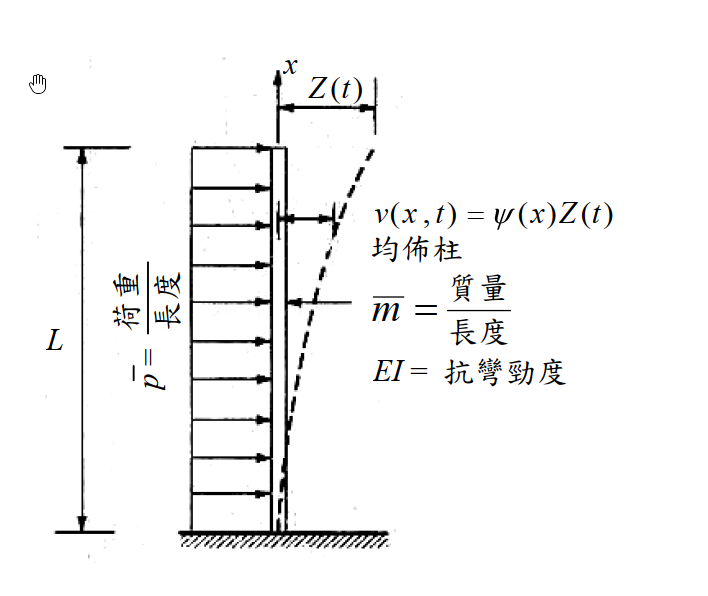

# 考題編號：SD-2009-1

**主分類：** `SD-U1-2` 運動方程式推導
**副分類：** `SD-U1-3` 單自由度、多自由度系統之動態分析及應用
**分析方法：** 廣義座標法（Generalized Coordinates）
**標籤：** `廣義質量` `廣義勁度` `廣義荷重` `連續體梁` `懸臂梁` `形函數` `分佈質量` `Ritz法` `廣義座標` `單自由度化約`

---

## 1. 原始題目重述（Problem Restatement）

**系統描述：** 均勻懸臂柱，底端固定，頂端自由，座標 $x$ 從底端（固定端 $x=0$）量至頂端（自由端 $x=L$）。

**給定形狀函數：**

$$\Psi(x) = \frac{v(x,t)}{Z(t)} = \left(\frac{x}{L}\right)^2\!\left(\frac{3}{2} - \frac{x}{2L}\right)$$

**系統參數（均勻分布）：**
- 每單位長度均勻質量：$\bar{m}$
- 均勻抗彎勁度：$EI$
- 每單位長度均勻荷重：$\bar{p}(t)$

*圖說：均勻懸臂柱（cantilever column），底端固定（clamped），頂端自由（free）。均勻分布質量 $\bar{m}$（kg/m），抗彎勁度 $EI$ 為常數，柱高 $L$。給定形狀函數 $\Psi(x) = (x/L)^2(3/2 - x/2L)$，均布側向荷重 $\bar{p}(t)$，廣義座標 $Z(t)$ 為頂端位移。*

**子問題：** 求廣義物理性質 $m^*$、$k^*$ 及廣義荷重 $p^*(t)$。（25 分）

---

## 2. 考題核心精神與出題者意圖（Core Concepts & Examiner's Intent）

**核心觀念：** 連續體系統利用假設形狀函數 $\Psi(x)$ 化約為等效單自由度（SDOF）系統，透過計算廣義質量、廣義勁度、廣義荷重，建立廣義運動方程式 $m^*\ddot{Z} + k^*Z = p^*(t)$。

**出題者意圖：**
1. 測驗是否熟悉廣義質量 $m^* = \int_0^L \bar{m}\Psi^2 dx$、廣義勁度 $k^* = \int_0^L EI(\Psi'')^2 dx$ 的積分定義
2. 測驗能否正確對 $\Psi(x)$ 求導並積分
3. 測驗廣義荷重 $p^* = \int_0^L \bar{p}(t)\Psi(x) dx$ 的物理意義（等效集中力）

**核心物理：** 廣義座標法的精髓——把分布質量與分布荷重「映射」到一個廣義坐標上。
- $m^*$ 代表系統的等效慣性
- $k^*$ 代表系統的等效彈性（由彎曲應變能決定）
- $p^*(t)$ 代表等效集中力（分布荷重對形狀函數的加權積分）

---

## 3. 解題戰略地圖與陷阱分析（Strategic Roadmap & Trap Analysis）

**作戰計畫：**
1. 展開 $\Psi(x)$ 並求一、二階導數 $\Psi'(x)$、$\Psi''(x)$
2. 計算 $m^* = \int_0^L \bar{m}[\Psi(x)]^2 dx$（展開多項式後逐項積分）
3. 計算 $k^* = \int_0^L EI[\Psi''(x)]^2 dx$（$\Psi''$ 形式簡單，計算容易）
4. 計算 $p^*(t) = \int_0^L \bar{p}(t)\Psi(x) dx$

**關鍵陷阱：**

| # | 陷阱 | 說明 | 應對策略 |
|---|------|------|---------|
| ❶ | **廣義勁度用 $\Psi''$ 而非 $\Psi'$** | 彎曲應變能 $U = \int EI(\Psi'')^2/2\,dx$，故 $k^* = \int EI(\Psi'')^2 dx$；忌用 $\Psi'$ | 記憶：應變能公式含曲率（二階導） |
| ❷ | **$\Psi(x)$ 展開多項式算錯係數** | 計算 $[\Psi(x)]^2$ 時容易弄錯係數 | 先因式分解 $\Psi = x^2(3L-x)/(2L^3)$，再展開 |
| ❸ | **積分上下限** | 積分從 $x=0$（固定端）到 $x=L$（自由端） | 確認邊界條件：$\Psi(0)=0$，$\Psi(L)=1$ |

---

## 3.5 變數層次分析（Variable Hierarchy Analysis）

> 複習提示：第一次解題後，在每個卡住的知識點旁標記 `⚠`；第二次複習時只看有 `⚠` 的項目。

### 最終目標
`求廣義質量 m*、廣義勁度 k*、廣義荷重 p*(t)`

### 本題關鍵公式（依計算順序）

$$\text{Step 1: } \Psi(x) = \frac{3x^2}{2L^2} - \frac{x^3}{2L^3} = \frac{x^2(3L - x)}{2L^3}$$

$$\text{Step 2: } \Psi''(x) = \frac{3}{L^2} - \frac{3x}{L^3} = \frac{3(L-x)}{L^3}$$

$$\text{Step 3: } m^* = \int_0^L \bar{m}[\Psi(x)]^2 dx = \frac{33\bar{m}L}{140}$$

$$\text{Step 4: } k^* = \int_0^L EI[\Psi''(x)]^2 dx = \frac{3EI}{L^3}$$

$$\text{Step 5: } p^*(t) = \int_0^L \bar{p}(t)\Psi(x)\, dx = \frac{3\bar{p}(t)L}{8}$$

### L1：題目直接給定

| 符號 | 數值 | 說明 |
|------|------|------|
| $\Psi(x)$ | $(x/L)^2(3/2 - x/2L)$ | 形狀函數（已給定） |
| $\bar{m}$ | —（符號） | 每單位長度質量 |
| $EI$ | —（符號） | 均勻抗彎勁度 |
| $\bar{p}(t)$ | —（符號） | 每單位長度均布荷重 |
| $L$ | —（符號） | 懸臂柱高度 |

### L2：需知識點推導

**Step 1：展開形狀函數**

| 符號 | 公式／來源 | 卡關? |
|------|----------|:-----:|
| $\Psi(x)$ 展開式 | $\frac{3x^2}{2L^2} - \frac{x^3}{2L^3}$ | |
| $\Psi'(x)$ | $\frac{3x}{L^2} - \frac{3x^2}{2L^3}$ | |
| $\Psi''(x)$ | $\frac{3}{L^2} - \frac{3x}{L^3} = \frac{3(L-x)}{L^3}$ | |

**Step 2：廣義質量**

| 符號 | 公式／來源 | 卡關? |
|------|----------|:-----:|
| $[\Psi(x)]^2$ | $\frac{x^4(3L-x)^2}{4L^6} = \frac{9L^2x^4-6Lx^5+x^6}{4L^6}$ | |
| $\int_0^L x^4(3L-x)^2 dx$ | $= 9L^7/5 - L^7 + L^7/7 = 33L^7/35$ | |
| $m^*$ | $= \bar{m}/(4L^6) \times 33L^7/35 = 33\bar{m}L/140$ | |

**Step 3：廣義勁度**

| 符號 | 公式／來源 | 卡關? |
|------|----------|:-----:|
| $[\Psi''(x)]^2$ | $9(L-x)^2/L^6$ | |
| $\int_0^L (L-x)^2 dx$ | $= L^3/3$（令 $u=L-x$） | |
| $k^*$ | $= 9EI/L^6 \times L^3/3 = 3EI/L^3$ | |

**Step 4：廣義荷重**

| 符號 | 公式／來源 | 卡關? |
|------|----------|:-----:|
| $\int_0^L \Psi(x)dx$ | $= \frac{1}{2L^3}\int_0^L(3Lx^2-x^3)dx = \frac{1}{2L^3}(L^4-L^4/4) = 3L/8$ | |
| $p^*(t)$ | $= \bar{p}(t) \times 3L/8$ | |

### L3：深層知識（不懂就卡住）

| 知識點 | 說明 | 卡關? |
|--------|------|:-----:|
| 廣義勁度的推導依據 | 廣義勁度來自彎曲應變能 $U = \frac{1}{2}\int EI(\Psi'')^2 dx$，故 $k^* = \int EI(\Psi'')^2 dx$（即 2U 在 $Z=1$ 時的值） | |
| $k^* = 3EI/L^3$ 的物理意義 | 恰好等於懸臂梁頂端集中力的側向勁度，說明本形函數來自懸臂梁頂端點載荷的靜撓度曲線（正規化後） | |
| $p^*$ 的物理意義 | 等效集中力 = 均布力對形狀函數的加權積分；若 $\Psi(L)=1$，則 $p^* = \bar{p}L$ 代表均布力的等效集中力大小 | |

---

## 4. 步驟化詳細計算過程（Step-by-Step Detailed Calculation）

### Step 1：展開形狀函數及其導數

給定：
$$\Psi(x) = \left(\frac{x}{L}\right)^2\!\left(\frac{3}{2} - \frac{x}{2L}\right) = \frac{3x^2}{2L^2} - \frac{x^3}{2L^3} = \frac{x^2(3L-x)}{2L^3}$$

邊界條件確認：
- $\Psi(0) = 0$ ✓（固定端無位移）
- $\Psi(L) = 1$ ✓（頂端廣義座標 $Z(t)$ 的正規化條件）

對 $x$ 求導：
$$\Psi'(x) = \frac{3x}{L^2} - \frac{3x^2}{2L^3}$$

$$\Psi'(0) = 0 \quad \checkmark \text{（固定端無轉角）}$$

$$\Psi''(x) = \frac{3}{L^2} - \frac{3x}{L^3} = \frac{3(L-x)}{L^3}$$

$$\Psi''(L) = 0 \quad \checkmark \text{（自由端無彎矩）}$$

---

### Step 2：廣義質量 m*

$$m^* = \int_0^L \bar{m}[\Psi(x)]^2 dx = \bar{m}\int_0^L \frac{x^4(3L-x)^2}{4L^6}\, dx$$

展開 $(3L-x)^2 = 9L^2 - 6Lx + x^2$：

$$\int_0^L x^4(3L-x)^2 dx = \int_0^L (9L^2x^4 - 6Lx^5 + x^6)\, dx$$

$$= 9L^2 \cdot \frac{L^5}{5} - 6L \cdot \frac{L^6}{6} + \frac{L^7}{7} = \frac{9L^7}{5} - L^7 + \frac{L^7}{7}$$

通分（公分母 = 35）：

$$= L^7\!\left(\frac{63 - 35 + 5}{35}\right) = \frac{33L^7}{35}$$

因此：

$$\boxed{m^* = \bar{m} \cdot \frac{1}{4L^6} \cdot \frac{33L^7}{35} = \frac{33\bar{m}L}{140} \approx 0.236\,\bar{m}L}$$

---

### Step 3：廣義勁度 k*

$$k^* = \int_0^L EI[\Psi''(x)]^2 dx = EI\int_0^L \left[\frac{3(L-x)}{L^3}\right]^2 dx = \frac{9EI}{L^6}\int_0^L (L-x)^2\, dx$$

令 $u = L - x$：

$$\int_0^L (L-x)^2 dx = \int_0^L u^2\, du = \frac{L^3}{3}$$

$$\boxed{k^* = \frac{9EI}{L^6} \cdot \frac{L^3}{3} = \frac{3EI}{L^3}}$$

> **物理意義驗證：** $k^* = 3EI/L^3$ 恰好等於懸臂梁頂端集中荷重的等效勁度，說明所給形狀函數 $\Psi(x)$ 確實是頂端集中荷重下的靜撓度曲線（正規化使頂端位移為 1）。✓

---

### Step 4：廣義荷重 p*(t)

$$p^*(t) = \int_0^L \bar{p}(t)\Psi(x)\, dx = \bar{p}(t)\int_0^L \frac{x^2(3L-x)}{2L^3}\, dx$$

$$= \frac{\bar{p}(t)}{2L^3}\int_0^L (3Lx^2 - x^3)\, dx = \frac{\bar{p}(t)}{2L^3}\left[3L\cdot\frac{L^3}{3} - \frac{L^4}{4}\right]$$

$$= \frac{\bar{p}(t)}{2L^3}\left[L^4 - \frac{L^4}{4}\right] = \frac{\bar{p}(t)}{2L^3}\cdot\frac{3L^4}{4}$$

$$\boxed{p^*(t) = \frac{3\bar{p}(t)L}{8} = 0.375\,\bar{p}(t)L}$$

---

### 結果彙整

| 廣義量 | 計算結果 | 說明 |
|--------|---------|------|
| 廣義質量 $m^*$ | $\dfrac{33\bar{m}L}{140} \approx 0.236\,\bar{m}L$ | 等效 SDOF 慣性質量 |
| 廣義勁度 $k^*$ | $\dfrac{3EI}{L^3}$ | 懸臂梁頂端側向勁度 |
| 廣義荷重 $p^*(t)$ | $\dfrac{3\bar{p}(t)L}{8}$ | 均布荷重的等效集中力 |

廣義運動方程式：

$$\frac{33\bar{m}L}{140}\ddot{Z}(t) + \frac{3EI}{L^3}Z(t) = \frac{3\bar{p}(t)L}{8}$$

對應 Rayleigh 法自然頻率估計（上界）：

$$\omega_1 \approx \sqrt{\frac{k^*}{m^*}} = \sqrt{\frac{3EI/L^3}{33\bar{m}L/140}} = \sqrt{\frac{140}{11}\cdot\frac{EI}{\bar{m}L^4}} = \sqrt{\frac{140}{11}}\cdot\sqrt{\frac{EI}{\bar{m}L^4}} \approx 3.567\sqrt{\frac{EI}{\bar{m}L^4}}$$

（精確值為 $3.516\sqrt{EI/(\bar{m}L^4)}$，誤差 $\approx +1.4\%$，確為上界 ✓）

---

## 5. 關鍵爭議點與進階探討（Critical Issues & Advanced Discussion）

### 5.1 給定形函數 vs. 推導形函數

本題形函數 $\Psi(x) = (x/L)^2(3/2 - x/2L)$ 是懸臂梁頂端集中荷重的靜撓度正規化曲線。若題目改以均布靜載荷重之靜撓度為形函數（即 $\Psi \propto 6L^2x^2 - 4Lx^3 + x^4$），廣義勁度與廣義質量的數值將略有不同，但均為上界。

### 5.2 p*(t) 的簡單物理解釋

均布荷重 $\bar{p}(t)$ 對整柱做功，等效集中力應等於：

$$p^*(t) = \bar{p}(t)\int_0^L \Psi(x)\,dx = \bar{p}(t) \cdot \frac{3L}{8}$$

意即：在形狀函數 $\Psi(x)$ 的加權下，均布力 $\bar{p}L$（總力）等效為 $(3/8)\bar{p}L$。如果形狀函數接近均勻位移（如剛體平移），則 $p^* = \bar{p}L$；本題形狀函數底部為零、頂部為 1，故等效力小於總力。

### 5.3 考場策略

三個廣義量各有計算重點：
- **$k^*$** 最簡單（$\Psi''$ 呈線性，積分容易）
- **$p^*$** 其次（直接積分 $\Psi$）
- **$m^*$** 最費時（$[\Psi]^2$ 要展開六次多項式）

建議考場順序：先算 $k^*$ 和 $p^*$，再計算 $m^*$，避免算錯 $m^*$ 後來不及收拾。
