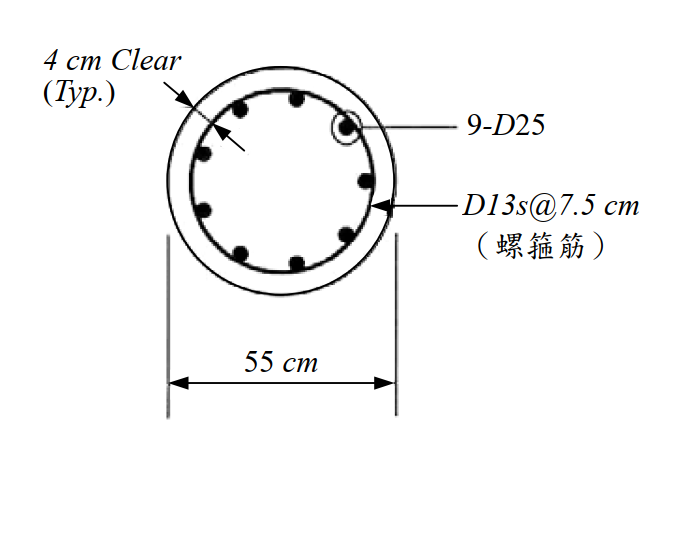

# 考題編號：SD-2009-4

**主分類：** `SD-U3-1` 結構耐震設計（含RC結構與鋼結構）
**副分類：** `SD-U2-2` 建築耐震設計規範
**分析方法：** 概念題（含計算）——RC圓形柱螺箍筋體積比檢核
**標籤：** `RC耐震設計` `圓形柱` `螺箍筋` `體積比ρs` `圍束要求` `核心面積` `規範檢核` `D13` `D25` `韌性設計`

---

## 1. 原始題目重述（Problem Restatement）

**題目：** 依結構混凝土設計規範，螺箍筋之體積比 $\rho_s$ 不得小於下式之值：

$$\rho_s = 0.45\left(\frac{A_g}{A_c} - 1\right)\frac{f'_c}{f_y}$$

**材料強度：**
- 混凝土抗壓強度：$f'_c = 350 \text{ kgf/cm}^2$
- 螺箍筋規定降伏強度：$f_y = 4{,}200 \text{ kgf/cm}^2$

**柱斷面（如圖）：**
- 柱直徑：$D = 55$ cm
- 保護層（to outside of spiral）：4 cm（典型值）
- 主筋：9-D25
- 螺箍筋：D13@7.5 cm（pitch）

*圖說：圓形RC柱，外徑 $D=55$ cm，四周保護層（clear cover）= 4 cm（至螺箍筋外緣），主筋 9-D25（直徑 2.54 cm，$A_s = 5.067 \text{ cm}^2$），螺箍筋 D13（直徑 1.27 cm，$A_{sp} = 1.267 \text{ cm}^2$），螺距 $s = 7.5$ cm。$f'_c = 350 \text{ kgf/cm}^2$，$f_y = 4{,}200 \text{ kgf/cm}^2$。*

**求：** 檢核配置之螺箍筋是否符合規範要求。（25 分）

---

## 2. 考題核心精神與出題者意圖（Core Concepts & Examiner's Intent）

**核心觀念：** 螺箍筋（spiral）的最小體積比要求來自「圍束設計（Confinement Design）」——螺箍筋提供的側向圍束壓力，補償了混凝土外殼（shell）在塑鉸區脫落後的強度損失，使核心混凝土維持延性行為。

**出題者意圖：**
1. 測驗核心面積 $A_c$（= 至螺箍筋外緣的面積）與全截面積 $A_g$ 的正確定義
2. 測驗螺箍筋實際體積比 $\rho_s$ 的計算公式（容積比定義）
3. 測驗是否能進行規範的直接檢核（計算值 vs 規範要求值）

---

## 3. 解題戰略地圖與陷阱分析（Strategic Roadmap & Trap Analysis）

**作戰計畫：**
1. 計算全截面積 $A_g$ 與核心面積 $A_c$（明確定義核心直徑）
2. 代入公式計算**規範要求** $\rho_{s,req}$
3. 由螺箍筋配置（D13@7.5 cm）計算**實際** $\rho_{s,actual}$
4. 比較：$\rho_{s,actual} \geq \rho_{s,req}$？

**關鍵陷阱：**

| # | 陷阱 | 說明 | 應對策略 |
|---|------|------|---------|
| ❶ | **核心面積的邊界定義** | 規範（ACI 系）定義：$A_c$ 以螺箍筋**外緣**為界（不含外殼混凝土），核心直徑 $D_c = D - 2 \times \text{cover}$ | 核心直徑 $= 55 - 2 \times 4 = 47$ cm（到螺箍筋外面） |
| ❷ | **螺箍筋 ρs 的計算** | 體積比 = 螺箍筋體積 ÷ 核心混凝土體積，需用螺箍筋**中心線**直徑計算圓周長 | $d_{sp,c} = D_c - d_{bar} = 47 - 1.27 = 45.73$ cm |
| ❸ | **$A_g / A_c$ 比值** | 此比值應 > 1（如果 ≤ 1 代表柱斷面全是核心，不合理），直接影響 $\rho_s$ 需求大小 | 計算後確認 $A_g/A_c = 1.37 > 1$ |

---

## 3.5 變數層次分析（Variable Hierarchy Analysis）

> 複習提示：第一次解題後，在每個卡住的知識點旁標記 `⚠`；第二次複習時只看有 `⚠` 的項目。

### 最終目標
`判斷 ρs,actual ≥ ρs,req？（是否符合規範）`

### 本題關鍵公式（依計算順序）

$$\text{Step 1: } D_c = D - 2 \times \text{cover} = 55 - 8 = 47 \text{ cm}$$

$$\text{Step 2: } \rho_{s,req} = 0.45\left(\frac{A_g}{A_c} - 1\right)\frac{f'_c}{f_y} = 0.45 \times 0.3693 \times \frac{350}{4200}$$

$$\text{Step 3: } \rho_{s,actual} = \frac{\pi \cdot d_{sp,c} \cdot A_{sp}}{A_c \cdot s}$$

$$\text{Step 4: 比較 } \rho_{s,actual} \text{ vs } \rho_{s,req}$$

### L1：題目直接給定

| 符號 | 數值 | 說明 |
|------|------|------|
| $D$ | 55 cm | 柱外徑 |
| cover | 4 cm | 保護層（至螺箍筋外緣） |
| $f'_c$ | 350 kgf/cm² | 混凝土抗壓強度 |
| $f_y$ | 4,200 kgf/cm² | 螺箍筋降伏強度 |
| 主筋 | 9-D25 | 直徑 2.54 cm |
| 螺箍筋 | D13@7.5 cm | 直徑 1.27 cm，間距 7.5 cm |

### L2：需知識點推導

**Step 1：幾何計算**

| 符號 | 公式／來源 | 卡關? |
|------|----------|:-----:|
| $D_c$ | $D - 2 \times \text{cover} = 55 - 8 = 47$ cm | |
| $A_g$ | $\pi D^2 / 4 = \pi(55)^2/4$ cm² | |
| $A_c$ | $\pi D_c^2 / 4 = \pi(47)^2/4$ cm² | |

**Step 2：規範要求**

| 符號 | 公式／來源 | 卡關? |
|------|----------|:-----:|
| $A_g/A_c$ | $55^2/47^2 = 3025/2209 = 1.3693$ | |
| $\rho_{s,req}$ | $0.45(1.3693-1)(350/4200) = 0.01385$ | |

**Step 3：實際體積比**

| 符號 | 公式／來源 | 卡關? |
|------|----------|:-----:|
| $A_{sp}$ | D13：$\pi(1.27)^2/4 = 1.267$ cm² | |
| $d_{sp,c}$ | $D_c - d_{bar} = 47 - 1.27 = 45.73$ cm（螺箍筋中心線直徑）| |
| $\rho_{s,actual}$ | $\pi d_{sp,c} A_{sp} / (A_c \cdot s) = 0.01399$ | |

### L3：深層知識（不懂就卡住）

| 知識點 | 說明 | 卡關? |
|--------|------|:-----:|
| 螺箍筋圍束設計的物理意義 | 螺箍筋提供側向約束壓力 $f_l$，提升核心混凝土有效強度 $f'_{cc} > f'_c$，補償外殼脫落的強度損失 | |
| 核心面積 vs 全截面積 | $A_g/A_c > 1$ 的差值代表外殼混凝土（shell）比例；外殼越厚，需要越多螺箍筋才能補償 | |
| 體積比公式的推導 | $\rho_s = $ 單位長度螺箍筋體積 ÷ 單位長度核心體積 = $(\pi d_c A_{sp}) / (A_c \cdot s)$ | |

---

## 4. 步驟化詳細計算過程（Step-by-Step Detailed Calculation）

### Step 1：鋼筋截面積查表

**D13 螺箍筋：**
$$d_{bar} = 1.27 \text{ cm}, \quad A_{sp} = \frac{\pi(1.27)^2}{4} = \frac{\pi \times 1.6129}{4} = 1.267 \text{ cm}^2$$

**D25 主筋（供參考，本題不需要）：**
$$d_{bar} = 2.54 \text{ cm}, \quad A_{s,D25} = \frac{\pi(2.54)^2}{4} = 5.067 \text{ cm}^2$$

---

### Step 2：計算截面幾何

**全截面積 $A_g$：**
$$A_g = \frac{\pi D^2}{4} = \frac{\pi \times 55^2}{4} = \frac{\pi \times 3025}{4} = 2375.8 \text{ cm}^2$$

**核心直徑 $D_c$（至螺箍筋外緣）：**
$$D_c = D - 2 \times \text{cover} = 55 - 2 \times 4 = 47 \text{ cm}$$

**核心面積 $A_c$：**
$$A_c = \frac{\pi D_c^2}{4} = \frac{\pi \times 47^2}{4} = \frac{\pi \times 2209}{4} = 1734.9 \text{ cm}^2$$

**面積比：**
$$\frac{A_g}{A_c} = \frac{2375.8}{1734.9} = 1.3693$$

---

### Step 3：計算規範要求 ρs,req

$$\rho_{s,req} = 0.45\left(\frac{A_g}{A_c} - 1\right)\frac{f'_c}{f_y}$$

$$= 0.45 \times (1.3693 - 1) \times \frac{350}{4200}$$

$$= 0.45 \times 0.3693 \times 0.08333$$

$$= 0.45 \times 0.030775$$

$$\boxed{\rho_{s,req} = 0.01385 = 1.385\%}$$

---

### Step 4：計算實際螺箍筋體積比 ρs,actual

螺箍筋中心線直徑：
$$d_{sp,c} = D_c - d_{bar,spiral} = 47 - 1.27 = 45.73 \text{ cm}$$

體積比定義（每一螺距長度）：

$$\rho_{s,actual} = \frac{\text{螺箍筋體積（每螺距）}}{\text{核心混凝土體積（每螺距）}} = \frac{\pi \cdot d_{sp,c} \cdot A_{sp}}{A_c \cdot s}$$

代入數值：
$$= \frac{\pi \times 45.73 \times 1.267}{1734.9 \times 7.5}$$

$$= \frac{3.14159 \times 45.73 \times 1.267}{13011.8}$$

$$= \frac{182.0}{13011.8}$$

$$\boxed{\rho_{s,actual} = 0.01399 = 1.399\%}$$

---

### Step 5：規範檢核

$$\rho_{s,actual} = 0.01399 \quad \overset{?}{\geq} \quad \rho_{s,req} = 0.01385$$

$$0.01399 > 0.01385 \quad \checkmark$$

$$\boxed{\text{螺箍筋配置符合規範要求（裕度約 }1.0\%\text{）}}$$

---

### 計算結果彙整

| 項目 | 數值 |
|------|------|
| 柱外徑 $D$ | 55 cm |
| 核心直徑 $D_c$ | 47 cm |
| 全截面積 $A_g$ | 2375.8 cm² |
| 核心面積 $A_c$ | 1734.9 cm² |
| $A_g / A_c$ | 1.3693 |
| **規範要求 $\rho_{s,req}$** | **0.01385（1.385%）** |
| 螺箍筋中心線直徑 $d_{sp,c}$ | 45.73 cm |
| D13 面積 $A_{sp}$ | 1.267 cm² |
| 螺距 $s$ | 7.5 cm |
| **實際體積比 $\rho_{s,actual}$** | **0.01399（1.399%）** |
| **檢核結果** | **✅ 符合規範（裕度 1.0%）** |

---

## 5. 關鍵爭議點與進階探討（Critical Issues & Advanced Discussion）

### 5.1 核心面積 Ac 的邊界——外緣 vs 中心線

台灣規範（參照 ACI 318）明確規定 $A_c$ 以螺箍筋**外緣**為界：

$$D_c = D - 2 \times \text{(clear cover to outside of spiral)}$$

因此本題 $D_c = 55 - 2 \times 4 = 47$ cm。

若誤用主筋中心線（$D_c = 55 - 2 \times 4 - 2 \times 1.27/2 = 53.73$ cm 或類似值），將高估 $A_c$，低估 $\rho_{s,req}$，導致不保守的錯誤結論。

### 5.2 本題裕度極小的設計意義

$$\frac{\rho_{s,actual}}{\rho_{s,req}} = \frac{0.01399}{0.01385} = 1.010$$

裕度僅 1.0%，接近規範下限。這代表：
- 若改用 D13@8.0 cm 螺距，則 $\rho_s = 182.0/(1734.9 \times 8) = 0.01312 < 0.01385$，**不符合規範**
- 本配置 D13@7.5 cm 是剛好滿足的下限間距，考官刻意設計成「剛過」的題目

### 5.3 螺箍筋設計的物理意義

螺箍筋圍束機制：

$$f'_{cc} \approx f'_c + 4.1 f_l \quad \text{（Richart 公式）}$$

$$f_l = \frac{\rho_s f_y}{2} \quad \text{（側向約束壓力）}$$

以本題計算：
$$f_l = \frac{0.01399 \times 4200}{2} = 29.4 \text{ kgf/cm}^2$$

$$f'_{cc} \approx 350 + 4.1 \times 29.4 = 350 + 120.5 = 470.5 \text{ kgf/cm}^2$$

圍束後核心混凝土強度約提升至 471 kgf/cm²，比未圍束的 350 kgf/cm² 高 34%，足以補償外殼脫落（外殼面積 $= A_g - A_c = 640.9$ cm²，約佔總面積 27%）的強度損失。

### 5.4 考場答題要點

1. 明確寫出核心直徑的定義（至螺箍筋外緣）
2. 規範公式與實際計算分開呈現，結論明確（符合 or 不符合）
3. 若僅到小數點兩位精度，ρs,actual ≈ 0.014 > ρs,req ≈ 0.014，仍應以多位數計算確認
