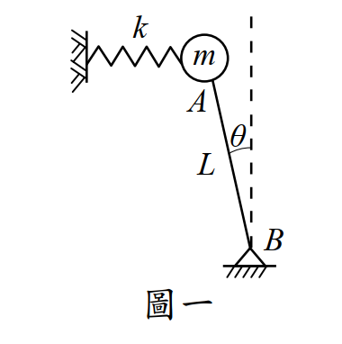

# 考題編號：SD-2010-1

**主分類：** `SD-U1-2` 運動方程式推導
**副分類：** `SD-U1-3` 單自由度、多自由度系統之動態分析及應用
**分析方法：** SDOF動力分析
**標籤：** `倒擺` `SDOF` `穩定條件` `運動方程式` `Lagrange法` `有效勁度` `幾何非線性` `臨界彈簧勁度`

---

## 1. 原始題目重述（Problem Restatement）

**系統描述：** 剛性桿件 AB，長度為 $L$。B 端鉸承（pivot at bottom），A 端有集中質量 $m$，另有彈簧常數 $k$ 的水平線性彈簧連接質量 $m$ 與固定牆面。當 $\theta = 0$ 時彈簧無伸長縮短。不計桿件 AB 質量，小角度假設（$\theta \ll 1$）。

**子問題：**
- （一）此系統在什麼條件下穩定？（10 分）
- （二）穩定情況下的運動方程式及振動頻率。（15 分）

*圖說：倒擺系統。B 為底部鉸支承（pivot），A 在頂部，質量 $m$；水平彈簧 $k$ 一端固定於牆，另一端接 A。$\theta = 0$ 時彈簧自然長度，向右偏轉 $\theta$ 時彈簧壓縮/伸長 $L\sin\theta \approx L\theta$。*

---

## 2. 考題核心精神與出題者意圖（Core Concepts & Examiner's Intent）

**核心觀念：** 本題考察「幾何剛度（geometric stiffness）」概念——重力在倒擺中扮演「負剛度」的角色，彈簧提供正剛度，系統穩定性取決於兩者的相對大小。

**出題者意圖：**
1. 測驗考生能否正確用 Lagrange 方程（或力矩平衡法）建立**含重力效應**的運動方程式
2. 測驗「有效勁度 = 彈簧勁度 − 幾何負勁度」的物理直覺
3. 測驗從運動方程式直接讀取振動頻率的能力

**核心物理：** 這題的本質是判斷有效勁度（effective stiffness）的正負。若 $k_{\text{eff}} > 0$，系統穩定且有確定振動頻率；若 $k_{\text{eff}} \leq 0$，系統不穩定。

---

## 3. 解題戰略地圖與陷阱分析（Strategic Roadmap & Trap Analysis）

**作戰計畫：**
1. 取廣義座標 $\theta$，建立動能 $T$ 與位能 $V$
2. 小角度線性化 $V$（或直接取對 $\theta$ 的二階展開）
3. 從 $V$ 的二次項係數正負判斷穩定性
4. Lagrange 方程導出線性運動方程式，讀取 $\omega^2$

**關鍵陷阱：**

| # | 陷阱 | 說明 | 應對策略 |
|---|------|------|---------|
| ❶ | **忽略重力力矩** | 只考慮彈簧，漏掉重力對 B 點的 destabilizing moment | 位能必須同時包含重力位能與彈性位能 |
| ❷ | **符號搞反** | 重力對倒擺產生「增加偏移」的力矩，為負勁度；初學者常當成 restoring | 以 Lagrange 法系統推導，不要憑直覺設正負 |
| ❸ | **力矩臂用錯** | 彈簧力矩臂為 $L\cos\theta \approx L$（桿件鉛垂方向投影），不是 $L$ | 小角度下 $\cos\theta \approx 1$，但推導時應先保留精確形式 |
| ❹ | **穩定條件方向** | 誤以為 $k > 0$ 就穩定，忽略 $k > mg/L$ 的門檻 | 穩定條件直接來自 $k_{\text{eff}} > 0$ |

---

## 3.5 變數層次分析（Variable Hierarchy Analysis）

> 複習提示：第一次解題後，在每個卡住的知識點旁標記 `⚠`；第二次複習時只看有 `⚠` 的項目。

### 最終目標
`(一) 穩定條件 k > mg/L；(二) 運動方程式 + 自然角頻率 ω`

### 本題關鍵公式（依計算順序）

> $\boxed{\cdot}$ = 需由前步驟推導，非題目直接給定的變數

$$\text{Step 1: } V = mgL\cos\theta + \tfrac{1}{2}k(L\sin\theta)^2$$

$$\text{Step 2（小角度線性化）: } V \approx mgL\left(1-\tfrac{\theta^2}{2}\right) + \tfrac{1}{2}kL^2\theta^2 = mgL + \tfrac{1}{2}\boxed{k_{\text{eff}}}\,\theta^2$$

$$\text{Step 3（有效勁度）: } k_{\text{eff}} = kL^2 - mgL = L(kL - mg)$$

$$\text{Step 4（穩定條件）: } k_{\text{eff}} > 0 \;\Rightarrow\; k > \frac{mg}{L}$$

$$\text{Step 5（EOM）: } mL^2\ddot{\theta} + \boxed{k_{\text{eff}}}\,\theta = 0$$

$$\text{Step 6（自然頻率）: } \omega^2 = \frac{\boxed{k_{\text{eff}}}}{mL^2} = \frac{k}{m} - \frac{g}{L}$$

### L1：題目直接給定

| 符號 | 數值 | 說明 |
|------|------|------|
| $m$ | — | 集中質量（A端） |
| $k$ | — | 水平彈簧常數 |
| $L$ | — | 剛性桿長度（AB） |
| $\theta$ | 廣義座標 | 桿件偏離鉛垂之角度 |
| $g$ | 重力加速度 | 題目未明言但必須考慮 |

### L2：需知識點推導

**Step 1：建立位能**

| 符號 | 公式／來源 | 卡關? |
|------|----------|:-----:|
| $V_{\text{gravity}}$ | $mg \cdot L\cos\theta$（A點高度 = $L\cos\theta$，以B為基準） | |
| $\delta_{\text{spring}}$ | $L\sin\theta \approx L\theta$（A點水平位移） | |
| $V_{\text{spring}}$ | $\tfrac{1}{2}k(L\sin\theta)^2 \approx \tfrac{1}{2}kL^2\theta^2$ | |

**Step 2：有效勁度**

| 符號 | 公式／來源 | 卡關? |
|------|----------|:-----:|
| $k_{\text{eff}}$ | $kL^2 - mgL$（$V$ 中 $\theta^2$ 的係數乘以2） | |

**Step 3：穩定條件**

| 符號 | 公式／來源 | 卡關? |
|------|----------|:-----:|
| 穩定 | $k_{\text{eff}} > 0 \Rightarrow k > mg/L$ | |

**Step 4：Lagrange 方程 → 運動方程式**

| 符號 | 公式／來源 | 卡關? |
|------|----------|:-----:|
| $T$ | $\tfrac{1}{2}mL^2\dot{\theta}^2$（質量m繞B旋轉） | |
| EOM | $mL^2\ddot{\theta} + k_{\text{eff}}\theta = 0$ | |
| $\omega^2$ | $k_{\text{eff}}/(mL^2) = k/m - g/L$ | |
| $\omega$ | $\sqrt{k/m - g/L}$ | |

### L3：深層知識（不懂就卡住）

| 知識點 | 說明 | 卡關? |
|--------|------|:-----:|
| 幾何勁度（geometric stiffness） | 重力對倒擺產生負勁度效應；壓力軸力同理會降低結構有效剛度（Euler buckling 的本質） | |
| 位能與穩定性的關係 | 平衡位置若 $\partial^2 V/\partial\theta^2 > 0$（位能極小值），則穩定 | |
| 倒擺 vs 正擺 | 正擺（B在上、A在下）：重力提供正勁度，$k_{\text{eff}} = mgL + kL^2 > 0$ 恆穩定；倒擺相反 | |
| Lagrange 小角度線性化時機 | 在 $V(\theta)$ 對 $\theta$ 展開時線性化（$\sin\theta \approx \theta$，$\cos\theta \approx 1 - \theta^2/2$），EOM 即為線性 | |

---

## 4. 步驟化詳細計算過程（Step-by-Step Detailed Calculation）

### 系統描述與廣義座標設定

選廣義座標 $\theta$（桿件 AB 偏離鉛垂線之角度，向右為正）。

以鉸支 B 為位置參考原點，A 點座標：

$$x_A = L\sin\theta, \quad y_A = L\cos\theta$$

---

### Step 1：建立動能

桿件無質量，僅質量 $m$ 在 A 點。A 點速度：

$$\dot{x}_A = L\dot{\theta}\cos\theta, \quad \dot{y}_A = -L\dot{\theta}\sin\theta$$

$$T = \frac{1}{2}m(\dot{x}_A^2 + \dot{y}_A^2) = \frac{1}{2}m L^2\dot{\theta}^2$$

---

### Step 2：建立位能

**重力位能**（以 B 為零點）：
$$V_{\text{gravity}} = mgy_A = mgL\cos\theta$$

**彈性位能**（彈簧水平伸長量 = $L\sin\theta$）：
$$V_{\text{spring}} = \frac{1}{2}k(L\sin\theta)^2$$

**總位能：**
$$V(\theta) = mgL\cos\theta + \frac{1}{2}kL^2\sin^2\theta$$

---

### Step 3：小角度展開（穩定性分析）

利用 $\sin\theta \approx \theta$，$\cos\theta \approx 1 - \dfrac{\theta^2}{2}$：

$$V(\theta) \approx mgL\!\left(1 - \frac{\theta^2}{2}\right) + \frac{1}{2}kL^2\theta^2$$

$$= mgL + \frac{1}{2}\underbrace{(kL^2 - mgL)}_{k_{\text{eff}}}\,\theta^2$$

---

### （一）穩定條件

平衡位置 $\theta = 0$ 為**穩定平衡**的條件：位能在 $\theta = 0$ 處為極小值，即

$$\frac{\partial^2 V}{\partial\theta^2}\Bigg|_{\theta=0} > 0 \quad \Rightarrow \quad k_{\text{eff}} = kL^2 - mgL > 0$$

$$\boxed{k > \frac{mg}{L}}$$

> **物理意義：** 彈簧的正剛度（$kL^2$）必須大於重力造成的負剛度（$mgL$），系統才能穩定。若 $k \leq mg/L$，重力超過彈簧的恢復能力，桿件將持續傾倒。

---

### （二）穩定條件下的運動方程式與振動頻率

**Lagrange 方程：**

$$\frac{d}{dt}\!\left(\frac{\partial T}{\partial\dot{\theta}}\right) - \frac{\partial T}{\partial\theta} + \frac{\partial V}{\partial\theta} = 0$$

計算各項（小角度線性化）：

$$\frac{\partial T}{\partial\dot{\theta}} = mL^2\dot{\theta} \quad\Rightarrow\quad \frac{d}{dt}(\cdot) = mL^2\ddot{\theta}$$

$$\frac{\partial V}{\partial\theta} = -mgL\sin\theta + kL^2\sin\theta\cos\theta \approx (kL^2 - mgL)\theta = k_{\text{eff}}\,\theta$$

代入得**運動方程式：**

$$\boxed{mL^2\ddot{\theta} + (kL^2 - mgL)\,\theta = 0}$$

此即標準 SHM 形式 $\ddot{\theta} + \omega^2\theta = 0$，其中：

$$\omega^2 = \frac{kL^2 - mgL}{mL^2} = \frac{k}{m} - \frac{g}{L}$$

**自然振動頻率：**

$$\boxed{\omega = \sqrt{\frac{k}{m} - \frac{g}{L}} = \sqrt{\frac{kL - mg}{mL}} \quad [\text{rad/s}]}$$

$$f = \frac{\omega}{2\pi} = \frac{1}{2\pi}\sqrt{\frac{kL - mg}{mL}} \quad [\text{Hz}]$$

---

## 5. 關鍵爭議點與進階探討（Critical Issues & Advanced Discussion）

### 5.1 等效力矩法（驗算）

亦可用「對 B 點取力矩」方式驗算，結果相同：

- 彈簧力（水平）= $k \cdot L\theta$，力臂 $\approx L$，恢復力矩 $= -kL^2\theta$
- 重力（鉛垂）= $mg$，水平偏距 $\approx L\theta$，傾覆力矩 $= +mgL\theta$

$$mL^2\ddot{\theta} = +mgL\theta - kL^2\theta \quad\Rightarrow\quad mL^2\ddot{\theta} + (kL^2 - mgL)\theta = 0 \checkmark$$

### 5.2 與 Euler 挫屈的對應

本題的「幾何負勁度 $mgL$」對應結構力學中的「幾何剛度矩陣」。若將彈簧視為結構的彈性剛度，則：
- **穩定條件** $k > mg/L$ ≡ 彈性剛度 > 幾何負剛度（Euler 臨界荷重的 SDOF 版本）
- **臨界條件** $k = mg/L$ ≡ 系統頻率為零，對應結構分岔點（bifurcation point）

### 5.3 考場應對建議

本題僅需基礎 Lagrange 法，但**務必包含重力位能**，這是得分關鍵。寫出運動方程式後，直接比較 $\omega^2 = (k/m - g/L)$ 的正負，即可同時回答穩定條件與頻率，兩小題一氣呵成。
