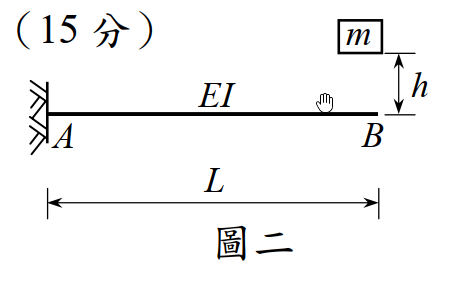

# 考題編號：SD-2010-2

**主分類：** `SD-U1-3` 單自由度、多自由度系統之動態分析及應用
**副分類：** `SD-U1-2` 運動方程式推導
**分析方法：** SDOF動力分析（懸臂梁點質量衝擊：自由落體衝擊初始條件法）
**標籤：** `SDOF` `懸臂梁` `點質量衝擊` `自由落體` `等效彈簧` `靜撓度` `最大振幅` `初始條件法` `完全非彈性衝擊` `衝擊動力學`

---

## 1. 原始題目重述（Problem Restatement）

**系統描述：** 懸臂梁 AB（A 端固定，B 端自由），$EI$ 為常數，梁長 $L$。點質量 $m$ 從 B 點正上方 $h$ 高度處**輕輕放開**（即以零初速釋放），落在 B 點並附著於梁端。不考慮懸臂梁本身質量。

**子問題：**
- （一）懸臂梁 AB 的振動頻率。（10 分）
- （二）此懸臂梁的最大振幅。（15 分）

*圖說：懸臂梁 A 端固定於牆，B 端為自由端。質量 $m$ 從高度 $h$（以梁端 B 為基準）輕輕放開，自由落體後落在 B 點並附著於梁端，引發系統振動。梁長 $L$，彎曲勁度 $EI$ 為常數。*

---

## 2. 考題核心精神與出題者意圖（Core Concepts & Examiner's Intent）

**核心觀念：** 將懸臂梁化為等效 SDOF 彈簧系統，再利用「自由落體衝擊」的初始條件（初速度 $v_0 = \sqrt{2gh}$、初位移 $x_0 = -\delta_{st}$）求解自由振動振幅。

**出題者意圖：**
1. 測驗懸臂梁端點等效勁度公式（$k = 3EI/L^3$）的熟悉度
2. 測驗「衝擊問題的初始條件設定」——此為最常見出錯點
3. 測驗自由振動振幅公式 $A = \sqrt{x_0^2 + (v_0/\omega)^2}$ 的應用

**關鍵物理：** 質量落下瞬間（$t = 0$），梁端仍在原位（未變形），但系統的靜平衡位置在其下方 $\delta_{st}$ 處。因此相對於靜平衡，初始位移為 $-\delta_{st}$（在平衡點上方），初速度為 $+v_0 = \sqrt{2gh}$（向下）。

---

## 3. 解題戰略地圖與陷阱分析（Strategic Roadmap & Trap Analysis）

**作戰計畫：**
1. 求懸臂梁等效彈簧勁度 $k = 3EI/L^3$
2. 求自然頻率 $\omega = \sqrt{k/m}$
3. 設定衝擊後初始條件（$x_0$，$v_0$）——相對於靜平衡位置
4. 代入振幅公式 $A = \sqrt{x_0^2 + (v_0/\omega)^2}$

**關鍵陷阱：**

| # | 陷阱 | 說明 | 應對策略 |
|---|------|------|---------|
| ❶ | **初始位移忘記包含靜撓度** | 以未變形位置為座標原點，則衝擊瞬間 $x_0 = 0$（錯誤！）；應以靜平衡為原點，$x_0 = -\delta_{st}$ | 先確認座標原點為靜平衡位置 |
| ❷ | **用能量法求振幅時漏掉彈性位能** | 能量守恆：$mgh = \frac{1}{2}kA'^2 - \frac{1}{2}k\delta_{st}^2$（錯誤）；正確為考慮完整的初始條件 | 使用初始條件法最可靠，避免能量法的符號陷阱 |
| ❸ | **懸臂梁勁度公式用錯** | $k = EI/L^3$（錯）；應為 $k = 3EI/L^3$（懸臂梁端點荷載） | 記憶：自由端集中荷載 $\delta = PL^3/(3EI)$，故 $k = 3EI/L^3$ |
| ❹ | **衝擊後動量守恆問題** | 無質量梁，衝擊前後衝量在極短時間內完成，質量 $m$ 的速度不因撞上「無質量梁端」而改變（梁無質量可吸收動量），故衝擊後初速仍為 $v_0 = \sqrt{2gh}$ | 無質量梁 → 無動量守恆損失 → 初速保留 |

---

## 3.5 變數層次分析（Variable Hierarchy Analysis）

> 複習提示：第一次解題後，在每個卡住的知識點旁標記 `⚠`；第二次複習時只看有 `⚠` 的項目。

### 最終目標
`(一) 自然頻率 ω；(二) 最大振幅 A`

### 本題關鍵公式（依計算順序）

> $\boxed{\cdot}$ = 需由前步驟推導，非題目直接給定的變數

$$\text{Step 1（等效勁度）: } k = \frac{3EI}{L^3}$$

$$\text{Step 2（自然頻率）: } \omega = \sqrt{\frac{\boxed{k}}{m}} = \sqrt{\frac{3EI}{mL^3}}$$

$$\text{Step 3（衝擊速度）: } v_0 = \sqrt{2gh}$$

$$\text{Step 4（靜撓度）: } \delta_{st} = \frac{mg}{\boxed{k}} = \frac{mgL^3}{3EI}$$

$$\text{Step 5（初始條件）: } x_0 = -\boxed{\delta_{st}},\quad \dot{x}_0 = +v_0$$

$$\text{Step 6（最大振幅）: } A = \sqrt{x_0^2 + \left(\frac{\dot{x}_0}{\omega}\right)^2} = \sqrt{\boxed{\delta_{st}}^2 + \frac{2gh}{\boxed{\omega}^2}}$$

### L1：題目直接給定

| 符號 | 數值 | 說明 |
|------|------|------|
| $m$ | — | 點質量 |
| $EI$ | 常數 | 懸臂梁抗彎勁度 |
| $L$ | — | 梁長 |
| $h$ | — | 釋放高度（以 B 點為基準） |
| $g$ | 重力加速度 | 題目未明言但必須考慮 |

### L2：需知識點推導

**Step 1：懸臂梁等效勁度**

| 符號 | 公式／來源 | 卡關? |
|------|----------|:-----:|
| $k$ | $3EI/L^3$（懸臂梁端點集中荷載勁度） | |

**Step 2：自然頻率**

| 符號 | 公式／來源 | 卡關? |
|------|----------|:-----:|
| $\omega$ | $\sqrt{k/m} = \sqrt{3EI/(mL^3)}$ | |
| $f$ | $\omega/(2\pi)$ | |

**Step 3：初始條件**

| 符號 | 公式／來源 | 卡關? |
|------|----------|:-----:|
| $v_0$ | $\sqrt{2gh}$（自由落體） | |
| $\delta_{st}$ | $mg/k = mgL^3/(3EI)$ | |
| $x_0$ | $-\delta_{st}$（以靜平衡為原點，衝擊瞬間在平衡點上方） | |

**Step 4：最大振幅**

| 符號 | 公式／來源 | 卡關? |
|------|----------|:-----:|
| $A$ | $\sqrt{x_0^2 + (v_0/\omega)^2}$ | |

### L3：深層知識（不懂就卡住）

| 知識點 | 說明 | 卡關? |
|--------|------|:-----:|
| 無質量梁的衝擊假設 | 梁無質量，不存在動量守恆損失。質量 $m$ 落下後以 $v_0 = \sqrt{2gh}$ 附著梁端，此即系統初速。 | |
| 靜平衡為座標原點 | SDOF 自由振動公式 $x(t) = A\cos(\omega t + \phi)$ 是以靜平衡位置為原點推導的；若以未變形位置為原點，振幅公式需修改 | |
| 懸臂梁端點勁度公式來源 | 材料力學：集中荷載 $P$ 作用於懸臂梁端點，端點撓度 $\delta = PL^3/(3EI)$，故 $k = P/\delta = 3EI/L^3$ | |

---

## 4. 步驟化詳細計算過程（Step-by-Step Detailed Calculation）

### Step 1：懸臂梁等效彈簧勁度

不計梁自重，懸臂梁 B 端集中荷載 $P$ 造成的端點撓度（材料力學）：

$$\delta_B = \frac{PL^3}{3EI} \quad\Rightarrow\quad k = \frac{P}{\delta_B} = \frac{3EI}{L^3}$$

---

### （一）振動頻率

系統化為 SDOF（質量 $m$，彈簧勁度 $k = 3EI/L^3$）：

$$\omega^2 = \frac{k}{m} = \frac{3EI}{mL^3}$$

$$\boxed{\omega = \sqrt{\frac{3EI}{mL^3}} \quad [\text{rad/s}]}$$

$$\boxed{f = \frac{\omega}{2\pi} = \frac{1}{2\pi}\sqrt{\frac{3EI}{mL^3}} \quad [\text{Hz}]}$$

---

### （二）最大振幅

#### Step 2：衝擊前速度

質量 $m$ 自高度 $h$ 靜止釋放，自由落體至 B 點時速度（能量守恆）：

$$\frac{1}{2}mv_0^2 = mgh \quad\Rightarrow\quad v_0 = \sqrt{2gh}$$

#### Step 3：設定靜平衡位置與初始條件

**靜撓度**（質量 $m$ 靜止放在 B 端的梁端撓度）：

$$\delta_{st} = \frac{mg}{k} = \frac{mgL^3}{3EI}$$

設廣義座標 $x(t)$ 以**靜平衡位置**為原點（向下為正）。

衝擊發生在梁端原始（未變形）位置，即靜平衡位置上方 $\delta_{st}$ 處：

$$x(0) = -\delta_{st} = -\frac{mgL^3}{3EI}$$

$$\dot{x}(0) = +v_0 = +\sqrt{2gh} \quad\text{（向下，正方向）}$$

#### Step 4：自由振動反應

以靜平衡為原點的無阻尼自由振動（$c = 0$）：

$$x(t) = x(0)\cos(\omega t) + \frac{\dot{x}(0)}{\omega}\sin(\omega t)$$

最大振幅（vibration amplitude）為：

$$A = \sqrt{[x(0)]^2 + \left[\frac{\dot{x}(0)}{\omega}\right]^2}$$

代入：

$$A = \sqrt{\delta_{st}^2 + \frac{v_0^2}{\omega^2}} = \sqrt{\delta_{st}^2 + \frac{2gh}{\omega^2}}$$

因為 $\dfrac{1}{\omega^2} = \dfrac{m}{k} = \dfrac{mg}{k \cdot g} = \dfrac{\delta_{st}}{g}$，故：

$$\frac{v_0^2}{\omega^2} = 2gh \cdot \frac{\delta_{st}}{g} = 2h\delta_{st}$$

因此：

$$\boxed{A = \sqrt{\delta_{st}^2 + 2h\delta_{st}} = \delta_{st}\sqrt{1 + \frac{2h}{\delta_{st}}}}$$

代回 $\delta_{st} = \dfrac{mgL^3}{3EI}$：

$$\boxed{A = \frac{mgL^3}{3EI}\sqrt{1 + \frac{6hEI}{mgL^3}}}$$

> **最大撓度（以梁原始位置為基準）：** $x_{\max} = \delta_{st} + A = \delta_{st}\!\left(1 + \sqrt{1 + \dfrac{2h}{\delta_{st}}}\right)$

---

## 5. 關鍵爭議點與進階探討（Critical Issues & Advanced Discussion）

### 5.1 能量法（驗算）

從質量落下瞬間，以梁端原始位置 B 為基準，總能量守恆（落下 $h$ + 彈簧壓縮 $x_{\max}$）：

$$mg(h + x_{\max}) = \frac{1}{2}k x_{\max}^2$$

整理（令 $\delta_{st} = mg/k$）：

$$x_{\max}^2 - 2\delta_{st} x_{\max} - 2\delta_{st}h = 0$$

$$x_{\max} = \delta_{st}\!\left(1 + \sqrt{1 + \frac{2h}{\delta_{st}}}\right)$$

振幅 $A = x_{\max} - \delta_{st} = \delta_{st}\sqrt{1 + 2h/\delta_{st}}$ ✓ 與初始條件法相同。

### 5.2 「輕輕放開」的物理意義

「輕輕放開（gently released）」排除了給予初速的可能，確認初速 $= 0$，質量以**純自由落體**方式下落。若改為「以速度 $v_1$ 向下投出」，則 $v_0 = \sqrt{v_1^2 + 2gh}$，代入振幅公式即可。

### 5.3 特殊情況討論

- **$h = 0$（直接輕放在梁端）：** $v_0 = 0$，$x_0 = -\delta_{st}$，故 $A = \delta_{st}$，即動態最大撓度 $= 2\delta_{st}$（動力放大係數 DAF = 2）。
- **$h \gg \delta_{st}$：** $A \approx \sqrt{2h\delta_{st}} = \sqrt{2hmgL^3/(3EI)}$，靜撓度項可忽略。

### 5.4 考場最佳策略

直接用**初始條件法**（Step 3–4），比能量法更系統化、不易出錯符號。記住：初始條件相對於靜平衡位置設定，$x_0 = -\delta_{st}$，$v_0 = \sqrt{2gh}$，代入振幅公式即得。
