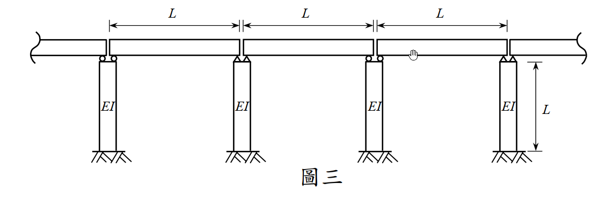

# 考題編號：SD-2010-3

**主分類：** `SD-U2-3` 橋梁耐震設計規範
**副分類：** `SD-U1-3` 單自由度、多自由度系統之動態分析及應用
**分析方法：** 橋梁耐震規範 Rayleigh 法（靜力位移函數法）：振動單元選取＋積分求橋梁基本周期
**標籤：** `橋梁耐震規範` `Rayleigh法` `振動單元` `靜力位移法` `剛性橋面版假設` `懸臂橋墩` `均布質量` `橋梁基本周期` `積分公式` `Stodola法`

---

## 1. 原始題目重述（Problem Restatement）

**系統描述：** 三跨簡支橋梁（每跨長 $L$），上構單位長度質量為 $m$（即單位長度靜載重 $w = mg$）。四根墩柱各自 EI 值相同（高度 $L$，固定於基礎），不計墩柱質量，不考慮桿件軸向伸長縮短。

**題目要求：** 選取橋梁振動單元，應用橋梁耐震設計規範公式計算橋梁周期 $T$。（25 分）

**規範公式：**
$$\beta = \int w(x)\,U(x)\,dx, \quad \gamma = \int w(x)\,[U(x)]^2\,dx, \quad T = 2\pi\sqrt{\frac{\gamma}{\beta g}}$$

其中 $w(x)$ 為橋梁單位長度靜載重，$U(x)$ 為橋梁橫向變形。

*圖說：三跨簡支橋梁，跨徑各為 $L$，總長 $3L$。四根墩柱（位於 $x = 0,\,L,\,2L,\,3L$）高度均為 $L$，EI 值相同，底部固定。橋面版（上構）單位長度質量 $m$，單位長度重量 $w = mg$。橋面版與墩柱頂部為銷接（簡支→不傳遞彎矩）。*

---

## 2. 考題核心精神與出題者意圖（Core Concepts & Examiner's Intent）

**核心觀念：** 本題考察**橋梁耐震設計規範的 Rayleigh（Stodola）法**——將橋梁重量橫向施加，求出靜態變形 $U(x)$ 後代入積分公式求周期。關鍵在於「振動單元的選取」與「剛性橋面版假設」。

**出題者意圖：**
1. 測驗學生能否正確選取振動單元（整座橋 vs. 單跨）
2. 測驗懸臂橋墩等效側向勁度 $k = 3EI/L^3$ 的應用
3. 測驗規範公式的積分計算

**關鍵判斷：** 三跨等間距、四根等勁度墩柱 → 結構均勻對稱 → 以**整座橋為振動單元**；剛性橋面版假設 → $U(x) = U_0$（常數）→ 積分化為乘法。

---

## 3. 解題戰略地圖與陷阱分析（Strategic Roadmap & Trap Analysis）

**作戰計畫：**
1. 選取振動單元（整座橋，說明理由）
2. 確定邊界條件 → 墩柱等效側向勁度 $k = 3EI/L^3$
3. 設定剛性橋面版假設 → 計算均勻靜態側向撓度 $U_0$
4. 代入積分公式，計算 $\beta$、$\gamma$
5. 代入周期公式求 $T$

**關鍵陷阱：**

| # | 陷阱 | 說明 | 應對策略 |
|---|------|------|---------|
| ❶ | **墩柱邊界條件用錯** | 簡支橋面版與墩柱頂銷接（不傳矩），故墩柱為懸臂（固定-自由），$k = 3EI/L^3$；若誤用固定-固定 $k = 12EI/L^3$，答案差4倍 | 記清楚：簡支橋 → 墩柱頂銷接 → 懸臂勁度 |
| ❷ | **漏計墩柱根數** | 三跨橋有 4 根墩柱，非 3 根；側向勁度為 $4 \times 3EI/L^3$ | 數清楚支承數量 |
| ❸ | **公式裡漏掉 $g$** | $T = 2\pi\sqrt{\gamma/(\beta g)}$，分母有 $g$；若忘記 $g$，量綱不對 | 直接推導得 $\gamma/(\beta g) = U_0/g$，自然帶入 $g$ |
| ❹ | **誤以為要做積分** | 剛性橋面版假設下 $U(x) = U_0$（常數），積分簡化為 $w \times U_0 \times 3L$ | 先陳述假設，積分即刻消去 |

---

## 3.5 變數層次分析（Variable Hierarchy Analysis）

> 複習提示：第一次解題後，在每個卡住的知識點旁標記 `⚠`；第二次複習時只看有 `⚠` 的項目。

### 最終目標
`橋梁基本側向振動周期 T`

### 本題關鍵公式（依計算順序）

> $\boxed{\cdot}$ = 需由前步驟推導，非題目直接給定的變數

$$\text{Step 1（墩柱懸臂勁度）: } k_{pier} = \frac{3EI}{L^3}$$

$$\text{Step 2（總側向勁度）: } K = 4\,\boxed{k_{pier}} = \frac{12EI}{L^3}$$

$$\text{Step 3（橋面側向靜撓度）: } U_0 = \frac{mg \cdot 3L}{\boxed{K}} = \frac{mgL^4}{4EI}$$

$$\text{Step 4（積分化簡）: } \beta = mg \cdot \boxed{U_0} \cdot 3L, \quad \gamma = mg \cdot \boxed{U_0}^2 \cdot 3L$$

$$\text{Step 5（消去）: } \frac{\gamma}{\beta g} = \frac{\boxed{U_0}}{g} = \frac{mL^4}{4EI}$$

$$\text{Step 6（周期）: } T = 2\pi\sqrt{\frac{\gamma}{\beta g}} = \pi L^2\sqrt{\frac{m}{EI}}$$

### L1：題目直接給定

| 符號 | 數值 | 說明 |
|------|------|------|
| $m$ | — | 橋面單位長度質量（上構） |
| $EI$ | 常數 | 墩柱抗彎勁度 |
| $L$ | — | 跨徑（= 墩柱高度） |
| $g$ | 重力加速度 | 隱含於 $w = mg$ |

### L2：需知識點推導

**Step 1：墩柱勁度**

| 符號 | 公式／來源 | 卡關? |
|------|----------|:-----:|
| $k_{pier}$ | $3EI/L^3$（懸臂柱，固定底-自由頂） | |
| $K$ | $4 \times 3EI/L^3 = 12EI/L^3$（四墩並聯） | |

**Step 2：靜態側向撓度**

| 符號 | 公式／來源 | 卡關? |
|------|----------|:-----:|
| $F_{total}$ | $mg \times 3L$（橋面重量橫向施加） | |
| $U_0$ | $F_{total}/K = mg \times 3L \times L^3/(12EI) = mgL^4/(4EI)$ | |

**Step 3：積分計算**

| 符號 | 公式／來源 | 卡關? |
|------|----------|:-----:|
| $\beta$ | $\int_0^{3L} mg \cdot U_0 \, dx = 3mgLU_0$ | |
| $\gamma$ | $\int_0^{3L} mg \cdot U_0^2 \, dx = 3mgLU_0^2$ | |
| $\gamma/(\beta g)$ | $U_0/g$ | |

### L3：深層知識（不懂就卡住）

| 知識點 | 說明 | 卡關? |
|--------|------|:-----:|
| 剛性橋面版假設 | 橋面板橫向勁度遠大於墩柱側向勁度，故橋面板近似剛體，所有點橫向位移相同。若橋面板不夠剛，需用分佈彈性梁模型，計算複雜。 | |
| Stodola（靜力位移法）的物理意義 | 以實際靜載重橫向施加作為「近似振態形狀」，這正是 Rayleigh 法的一種應用——假設基本模態形狀與靜位移曲線相似 | |
| 懸臂柱 vs 固定-固定柱 | 橋面版銷接（no moment）→ 懸臂 $k = 3EI/L^3$；若橋面版剛性連接（full moment）→ $k = 12EI/L^3$。此差異影響結果4倍 | |
| $T = 2\pi\sqrt{U_0/g}$ 的簡化 | 對均勻分佈荷重下剛性系統，$\gamma/(\beta g)$ 必然等於 $U_0/g$，這是個通用結論 | |

---

## 4. 步驟化詳細計算過程（Step-by-Step Detailed Calculation）

### 振動單元選取

> **振動單元：整座橋梁（三跨連續體，四墩）**

**選取理由：**
- 三跨等跨距 $L$，四根等高等 $EI$ 墩柱 → 結構完全對稱均勻
- 對稱橋梁側向基本模態為整體側移（rigid body lateral translation）
- 各跨面內剛度遠大於墩柱側向勁度 → **剛性橋面版假設成立**
- 以整座橋為振動單元，可得最基本振態之周期

---

### Step 1：墩柱等效側向勁度

墩柱底端固定，頂端與橋面版銷接（簡支橋面版不傳遞彎矩）→ **懸臂柱**：

$$k_{pier} = \frac{3EI}{L^3}$$

四根墩柱並聯，總側向勁度：

$$K = 4 \times \frac{3EI}{L^3} = \frac{12EI}{L^3}$$

---

### Step 2：靜態側向撓度 $U(x)$

**剛性橋面版假設：** 橋面版橫向勁度 $\gg$ 墩柱勁度，全橋各點側向位移相同 → $U(x) = U_0$（常數）。

將單位長度靜載重 $w(x) = mg$ 橫向施加（Stodola 法）：

總橫向力：
$$F_{total} = mg \times 3L$$

全橋統一側向位移：
$$U_0 = \frac{F_{total}}{K} = \frac{mg \times 3L}{\dfrac{12EI}{L^3}} = \frac{3mgL \cdot L^3}{12EI} = \frac{mgL^4}{4EI}$$

---

### Step 3：計算 $\beta$ 與 $\gamma$

由於 $U(x) = U_0$ 為常數，$w(x) = mg$ 亦均勻：

$$\beta = \int_0^{3L} w(x)\,U(x)\,dx = mg \cdot U_0 \cdot 3L = 3mgLU_0$$

$$\gamma = \int_0^{3L} w(x)\,[U(x)]^2\,dx = mg \cdot U_0^2 \cdot 3L = 3mgLU_0^2$$

---

### Step 4：計算周期

$$\frac{\gamma}{\beta g} = \frac{3mgLU_0^2}{3mgLU_0 \cdot g} = \frac{U_0}{g} = \frac{mgL^4/(4EI)}{g} = \frac{mL^4}{4EI}$$

$$\boxed{T = 2\pi\sqrt{\frac{\gamma}{\beta g}} = 2\pi\sqrt{\frac{mL^4}{4EI}} = \pi L^2\sqrt{\frac{m}{EI}}}$$

---

## 5. 關鍵爭議點與進階探討（Critical Issues & Advanced Discussion）

### 5.1 直接驗算（SDOF 等效法）

以等效 SDOF 系統驗算：
- 等效質量：$M_{eq} = m \times 3L = 3mL$
- 等效側向勁度：$K = 12EI/L^3$

$$T = 2\pi\sqrt{\frac{M_{eq}}{K}} = 2\pi\sqrt{\frac{3mL}{\dfrac{12EI}{L^3}}} = 2\pi\sqrt{\frac{3mL^4}{12EI}} = 2\pi\sqrt{\frac{mL^4}{4EI}} = \pi L^2\sqrt{\frac{m}{EI}} \checkmark$$

與 Rayleigh 法結果完全一致。

### 5.2 為何 $\gamma/(\beta g) = U_0/g$（通用結論）

對均勻靜載重作用下的剛性系統（$U(x) = U_0$ = const.）：

$$\frac{\gamma}{\beta g} = \frac{\int w\,U_0^2\,dx}{\int w\,U_0\,dx \cdot g} = \frac{U_0^2 \int w\,dx}{U_0\,g \int w\,dx} = \frac{U_0}{g}$$

這一化簡說明：**剛性系統的 Rayleigh 法等同於以靜撓度為規準的單自由度模型**。

### 5.3 若橋面板不夠剛（彈性橋面版）

若考慮橋面版橫向彎曲，$U(x)$ 不再是常數，而是由橋面版的橫向撓曲方程（類似梁在彈性支承上的彎曲）決定，積分更複雜，所求 $T$ 會偏長（振態軟化）。

本題假設剛性橋面版是合理的，因橋梁縱向主梁的橫向勁度通常遠大於墩柱側向勁度。

### 5.4 考場最佳策略

清楚說明三步驟：
1. **振動單元選取**（全橋，說明剛性橋面版假設）
2. **計算 $U_0$**（靜力平衡 $U_0 = F_{total}/K$）
3. **代公式**（$\gamma/(\beta g) = U_0/g$，直接得 $T = \pi L^2\sqrt{m/EI}$）

不需要對 $x$ 進行複雜積分，這是本題的核心簡化。
