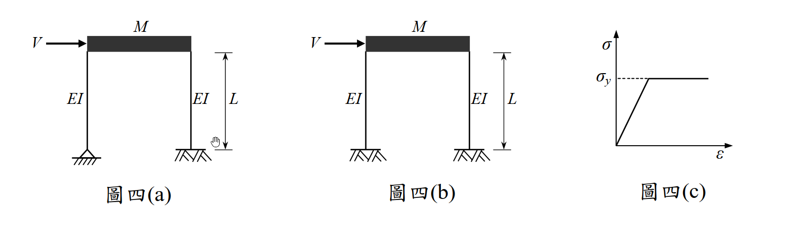

# 考題編號：SD-2010-4

**主分類：** `SD-U3-1` 結構耐震設計（含RC結構與鋼結構）
**副分類：** `SD-U1-3` 單自由度、多自由度系統之動態分析及應用
**分析方法：** 概念題（含計算）——雙柱剪力房屋邊界條件比較（固定-固定 vs 鉸接-固定）：頻率比、崩塌側力、塑鉸機制與耐震性能
**標籤：** `剪力房屋` `SDOF` `固定固定柱` `鉸接固定柱` `側向勁度` `振動頻率比` `塑鉸` `崩塌機制` `容量設計` `鋼柱彈塑性` `塑性截面模數` `耐震性能比較` `雙曲率` `單曲率`

---

## 1. 原始題目重述（Problem Restatement）

**系統描述：**
- 兩剛性樓版剪力房屋，樓版總質量為 $M$，柱高 $L$
- 柱為鋼柱，截面為邊長 $b$ 的正方形實心截面，$EI$ 值為常數
- 材料為理想彈塑性（如圖四(c)所示），降伏應力 $\sigma_y$
- 不計柱質量

**圖四(a)：** 兩根柱皆為**固定-固定**（Fixed-Fixed）——底端固定（嵌入基礎），頂端剛接於剛性樓版。

**圖四(b)：** 兩根柱皆為**鉸接-固定**（Pinned-Fixed）——底端鉸接（銷接基礎），頂端剛接於剛性樓版。

**子問題：**
- （一）比較兩者振動頻率。（8 分）
- （二）比較兩者崩塌時之側力 $V$。（8 分）
- （三）從耐震設計觀點比較兩者優劣（塑鉸發展、柱剪力、可能位移等）。（9 分）

*圖說：圖四(a) 兩柱底端固定（///），頂端剛接剛性樓版，雙固端條件；圖四(b) 兩柱底端鉸接（△△），頂端剛接剛性樓版，單固端條件；圖四(c) 理想彈塑性σ-ε曲線，σy 為降伏應力，降伏後保持水平（無應變硬化）。柱高 L，EI 常數，截面邊長 b 之正方形。*

---

## 2. 考題核心精神與出題者意圖（Core Concepts & Examiner's Intent）

**核心觀念：** 邊界條件對結構**側向勁度**、**崩塌強度**與**塑鉸機制**的影響——這三者的差異直接反映耐震設計中「強度」與「韌性」的工程取捨。

**出題者意圖：**
1. 測驗固定-固定（$k = 12EI/L^3$）vs 鉸接-固定（$k = 3EI/L^3$）勁度公式的熟悉度
2. 測驗塑性截面模數（$Z_p = b^3/4$ for solid square）及崩塌機制分析
3. 測驗耐震設計的整合判斷能力（勁度、強度、韌性、塑鉸位置、能量消散）

---

## 3. 解題戰略地圖與陷阱分析（Strategic Roadmap & Trap Analysis）

**作戰計畫：**
1. 確認邊界條件 → 各柱側向勁度公式
2. 計算系統自然頻率（SDOF：$\omega = \sqrt{K/M}$）
3. 計算塑性彎矩 $M_p$（正方形截面）
4. 分析崩塌機制，推導崩塌側力 $V$
5. 比較耐震性能（勁度、強度、塑鉸數量、能量消散）

**關鍵陷阱：**

| # | 陷阱 | 說明 | 應對策略 |
|---|------|------|---------|
| ❶ | **邊界條件勁度公式混淆** | 固定-固定：$k = 12EI/L^3$；鉸接-固定：$k = 3EI/L^3$（差4倍！）| 記憶：鉸接端去掉轉動束制，勁度降為 $1/4$ |
| ❷ | **塑性截面模數 vs 彈性截面模數** | 崩塌用 $M_p = \sigma_y Z_p$（塑性）；$Z_p = b^3/4$（正方形）；勿與 $S_e = b^3/6$ 混淆 | 崩塌題一律用 $Z_p$，非 $S$ |
| ❸ | **崩塌機制塑鉸數量算錯** | (a) 固定-固定：每柱 2 個塑鉸（頂底各一），共 4 個；(b) 鉸接-固定：每柱 1 個塑鉸（頂端固接處），共 2 個 | 以靜不定度判斷：系統靜不定度 = 塑鉸數 → 機制 |
| ❹ | **固定-固定柱的彎矩分配忘了除以2** | 對稱雙固端柱，剪力 $Q$ 作用時，$M_{top} = M_{bottom} = QL/2$；非 $QL$ | 固定-固定反曲點在中點，力矩臂為 $L/2$ |

---

## 3.5 變數層次分析（Variable Hierarchy Analysis）

> 複習提示：第一次解題後，在每個卡住的知識點旁標記 `⚠`；第二次複習時只看有 `⚠` 的項目。

### 最終目標
`(一) ω_a vs ω_b；(二) V_a vs V_b；(三) 耐震性能比較`

### 本題關鍵公式（依計算順序）

> $\boxed{\cdot}$ = 需由前步驟推導，非題目直接給定的變數

$$\text{Step 1（各柱勁度）: } k_{(a)} = \frac{12EI}{L^3},\; k_{(b)} = \frac{3EI}{L^3}$$

$$\text{Step 2（系統勁度）: } K_{(a)} = 2\boxed{k_{(a)}} = \frac{24EI}{L^3},\; K_{(b)} = \frac{6EI}{L^3}$$

$$\text{Step 3（頻率比）: } \frac{\omega_a}{\omega_b} = \sqrt{\frac{K_{(a)}}{K_{(b)}}} = 2$$

$$\text{Step 4（塑性彎矩）: } M_p = \sigma_y Z_p = \sigma_y \cdot \frac{b^3}{4}$$

$$\text{Step 5a（(a)崩塌側力）: } V_a = 2\times\frac{2\boxed{M_p}}{L} = \frac{4M_p}{L}$$

$$\text{Step 5b（(b)崩塌側力）: } V_b = 2\times\frac{\boxed{M_p}}{L} = \frac{2M_p}{L}$$

### L1：題目直接給定

| 符號 | 數值 | 說明 |
|------|------|------|
| $M$ | — | 剛性樓版總質量 |
| $EI$ | 常數 | 鋼柱抗彎勁度 |
| $L$ | — | 柱高度 |
| $b$ | — | 正方形截面邊長 |
| $\sigma_y$ | — | 鋼材降伏應力 |

### L2：需知識點推導

**Step 1–2：側向勁度**

| 符號 | 公式／來源 | 卡關? |
|------|----------|:-----:|
| $k_{(a)}$ | $12EI/L^3$（固定-固定，剛性樓版→頂固，底固） | |
| $k_{(b)}$ | $3EI/L^3$（鉸接-固定，頂固，底鉸） | |
| $K_{(a)}$ | $2 \times 12EI/L^3 = 24EI/L^3$ | |
| $K_{(b)}$ | $2 \times 3EI/L^3 = 6EI/L^3$ | |
| $\omega_a/\omega_b$ | $\sqrt{K_{(a)}/K_{(b)}} = \sqrt{4} = 2$ | |

**Step 3：塑性彎矩**

| 符號 | 公式／來源 | 卡關? |
|------|----------|:-----:|
| $Z_p$ | $b^3/4$（正方形實心截面塑性截面模數） | |
| $M_p$ | $\sigma_y \times b^3/4$ | |

**Step 4：崩塌側力**

| 符號 | 公式／來源 | 卡關? |
|------|----------|:-----:|
| $V_a$ | 固定-固定：$M_{top} = M_{bottom} = QL/2$，$Q = 2M_p/L$，$V_a = 2Q = 4M_p/L$ | |
| $V_b$ | 鉸接-固定：$M_{top} = QL$（對底鉸取矩），$Q = M_p/L$，$V_b = 2Q = 2M_p/L$ | |

### L3：深層知識（不懂就卡住）

| 知識點 | 說明 | 卡關? |
|--------|------|:-----:|
| 剛接 vs 鉸接邊界對勁度的影響 | 固定-固定柱：雙固端，$k = 12EI/L^3$；固定-鉸接（一端固定一端鉸）：$k = 3EI/L^3$；二者差4倍。本質：固定端提供額外轉動束制，降低柱有效長度。 | |
| 正方形截面塑性截面模數 $Z_p$ | $Z_p = A/2 \times \bar{y}_{top} + A/2 \times \bar{y}_{bot}$。對邊長 $b$ 正方形：$Z_p = (b^2/2)(b/4)+(b^2/2)(b/4) = b^3/4$。（弦外之音：$Z_p/S_e = (b^3/4)/(b^3/6) = 1.5$，即形狀因子 = 1.5） | |
| 靜不定度與塑鉸機制 | 固定-固定柱（每柱）超靜定度 = 3（固定-固定），需 3 個塑鉸形成機制，但對稱框架柱只有 2 個截面可出現塑鉸（頂底），加上柱兩端達 $M_p$ 時即為機制 | |
| 雙曲率 vs 單曲率柱 | 固定-固定：雙曲率（反曲點在柱中），最大彎矩 = $QL/2$；鉸接-固定：單曲率（無反曲點），最大彎矩 = $QL$（在固端） | |

---

## 4. 步驟化詳細計算過程（Step-by-Step Detailed Calculation）

### Step 1：各柱側向勁度

**圖四(a) — 固定-固定（Fixed-Fixed）：**

剛性樓版使柱頂無轉角（固定），柱底亦固定（嵌入基礎）→ 兩端固定柱：

$$k_{(a)} = \frac{12EI}{L^3} \quad\text{（每根柱）}$$

**圖四(b) — 鉸接-固定（Pinned-Fixed）：**

柱底銷接（可自由轉動），柱頂剛接剛性樓版（無轉角）→ 鉸接-固定柱：

$$k_{(b)} = \frac{3EI}{L^3} \quad\text{（每根柱）}$$

---

### （一）振動頻率比較

系統側向勁度（兩根柱並聯）：

$$K_{(a)} = 2 \times \frac{12EI}{L^3} = \frac{24EI}{L^3}, \qquad K_{(b)} = 2 \times \frac{3EI}{L^3} = \frac{6EI}{L^3}$$

自然頻率（SDOF，$M$ 為樓版質量）：

$$\omega_a = \sqrt{\frac{K_{(a)}}{M}} = \sqrt{\frac{24EI}{ML^3}}, \qquad \omega_b = \sqrt{\frac{K_{(b)}}{M}} = \sqrt{\frac{6EI}{ML^3}}$$

$$\boxed{\frac{\omega_a}{\omega_b} = \sqrt{\frac{24}{6}} = \sqrt{4} = 2}$$

> **結論：圖四(a) 的振動頻率是圖四(b) 的 2 倍（週期為 1/2）。**

---

### （二）崩塌側力比較

**塑性彎矩 $M_p$（正方形截面 $b \times b$）：**

塑性截面模數：
$$Z_p = \frac{b^2}{2} \times \frac{b}{4} + \frac{b^2}{2} \times \frac{b}{4} = \frac{b^3}{4}$$

$$M_p = \sigma_y \cdot Z_p = \frac{\sigma_y b^3}{4}$$

---

**圖四(a) — 固定-固定崩塌機制：**

在側力 $V$ 作用下，每根柱承受剪力 $Q = V/2$。

固定-固定柱，雙端有轉角束制，反曲點在柱中點：

$$M_{top} = M_{bottom} = \frac{Q \cdot L}{2} = \frac{VL}{4}$$

崩塌條件（頂底同時達到 $M_p$）：

$$\frac{V_a L}{4} = M_p \quad\Rightarrow\quad V_a = \frac{4M_p}{L}$$

代入 $M_p$：

$$\boxed{V_a = \frac{4M_p}{L} = \frac{\sigma_y b^3}{L}}$$

塑鉸位置：**每柱頂端 + 底端 = 4 個塑鉸**（對稱，同時形成）

---

**圖四(b) — 鉸接-固定崩塌機制：**

每根柱承受剪力 $Q = V/2$，底端鉸接（無彎矩）。

對底端鉸取矩平衡：

$$M_{top} = Q \cdot L = \frac{VL}{2}$$

崩塌條件（頂端固接處達到 $M_p$）：

$$\frac{V_b L}{2} = M_p \quad\Rightarrow\quad V_b = \frac{2M_p}{L}$$

代入 $M_p$：

$$\boxed{V_b = \frac{2M_p}{L} = \frac{\sigma_y b^3}{2L}}$$

塑鉸位置：**每柱頂端 = 2 個塑鉸**

---

**比較：**

$$\boxed{V_a = 2V_b} \quad\Rightarrow\quad \text{圖四(a) 崩塌側力為圖四(b) 的 2 倍}$$

---

### （三）耐震設計觀點比較

| 比較項目 | 圖四(a) 固定-固定 | 圖四(b) 鉸接-固定 |
|---------|:----------------:|:----------------:|
| 側向勁度 $K$ | $24EI/L^3$ **（較大）** | $6EI/L^3$（較小） |
| 自然周期 $T$ | 較短（$T_b/2$） | 較長（$2T_a$） |
| 崩塌側力 $V$ | $4M_p/L$ **（較大）** | $2M_p/L$（較小） |
| 塑鉸數量 | **4 個**（每柱頂底各一） | 2 個（每柱頂端一個） |
| 柱變形形態 | **雙曲率**（反曲點在柱中） | 單曲率（無反曲點） |
| 最大柱彎矩 | $M_p$（頂底） | $M_p$（頂端）、$0$（底端） |
| 降伏位移 $\delta_y$ | $M_p L^2 / (6EI)$ **（較小）** | $M_p L^2 / (3EI)$（較大） |
| 能量消散能力 | **較強**（4 個塑鉸） | 較弱（2 個塑鉸） |
| 基礎彎矩 | $M_p$（較大） | **0（底端鉸接）** |
| 引致地震力 | 較大（勁度大、周期短） | 較小（勁度小、周期長） |

**綜合耐震設計評估：**

**圖四(a) 優點：**
1. **強度高：** 崩塌側力為圖四(b) 的 2 倍，抵抗水平力能力強
2. **塑鉸多：** 4 個塑鉸形成機制 → 能量消散能力為圖四(b) 的 2 倍，韌性較佳
3. **雙曲率：** 反曲點在柱中，有效柱高 = $L/2$，各截面彎矩較小，結構效率高
4. **塑鉸分布均勻：** 塑性轉角需求分散於頂底兩端，每個塑鉸的轉動需求為圖四(b) 的一半

**圖四(a) 缺點：**
1. 勁度大 → 周期短 → 吸引較大地震力（在設計反應譜加速度平台段特別明顯）
2. 基礎需承受 $M_p$ 彎矩 → 基礎設計較為複雜、費用較高

**圖四(b) 優點：**
1. 周期較長 → 引致地震力相對較小（對長周期結構有利）
2. **底端鉸接：** 基礎無彎矩需求，簡化基礎設計，可降低工程費用

**圖四(b) 缺點：**
1. 勁度與強度均低（各為 (a) 的 1/4 和 1/2）
2. 塑鉸僅 2 個 → 能量消散能力差，韌性不足
3. 單曲率，柱頂端彎矩最大（$QL$ vs $QL/2$），應力集中
4. 較大位移可能引發 $P$-$\Delta$ 效應

**總結：** 從耐震設計觀點，**圖四(a) 固定-固定結構性能較優**，因其具有較高強度、較多塑鉸（較佳能量消散與韌性）、雙曲率柱（較高效率）。圖四(b) 雖基礎設計較簡單，但整體耐震性能較差，適用於非重要建築或以基礎設計便利性優先的情境。

---

## 5. 關鍵爭議點與進階探討（Critical Issues & Advanced Discussion）

### 5.1 強柱弱梁（Strong Column-Weak Beam）原則的應用

本題為純柱系統（無梁），圖四(a) 的四個塑鉸均在柱端。從容量設計（Capacity Design）觀點：若要避免柱端塑鉸（以防止軟層破壞），應加強柱的強度，使塑鉸形成於梁端。但本題沒有梁，故柱端塑鉸是唯一的消能機制。

### 5.2 彈性區間吸收的地震力比較

由於 $K_{(a)} = 4K_{(b)}$，在相同地震地面加速度下，若兩結構處於反應譜的加速度控制區（短周期）：
- 圖四(a) 吸引的地震力 $\propto$ M × Sa(T_a)
- 圖四(b) 吸引的地震力 $\propto$ M × Sa(T_b)
- 若 $T_a < T_b$，$Sa(T_a)$ 通常 $\geq Sa(T_b)$，故 (a) 吸引更大地震力

但 (a) 同時具有更高崩塌強度（$2V_b$），整體安全餘裕仍較大。

### 5.3 $P$-$\Delta$ 效應

圖四(b) 因勁度低、位移大，更容易受到 $P$-$\Delta$ 效應（幾何非線性）的不利影響。若穩定性指標 $\theta = P\delta/(VH)$ 過大，需修正設計地震力。
