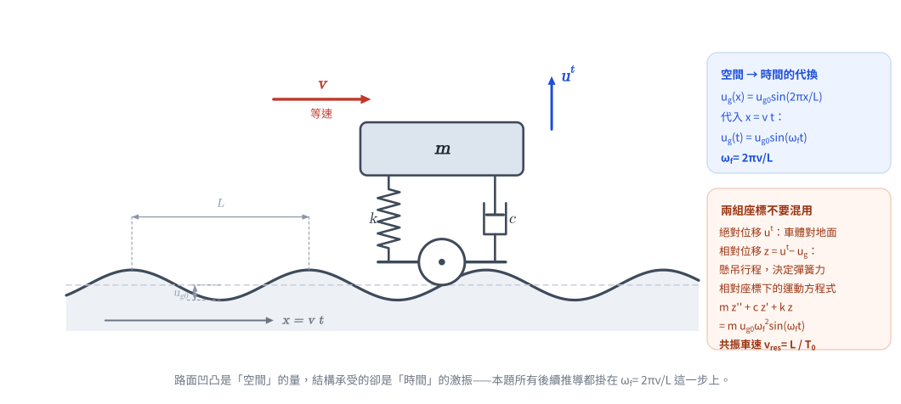
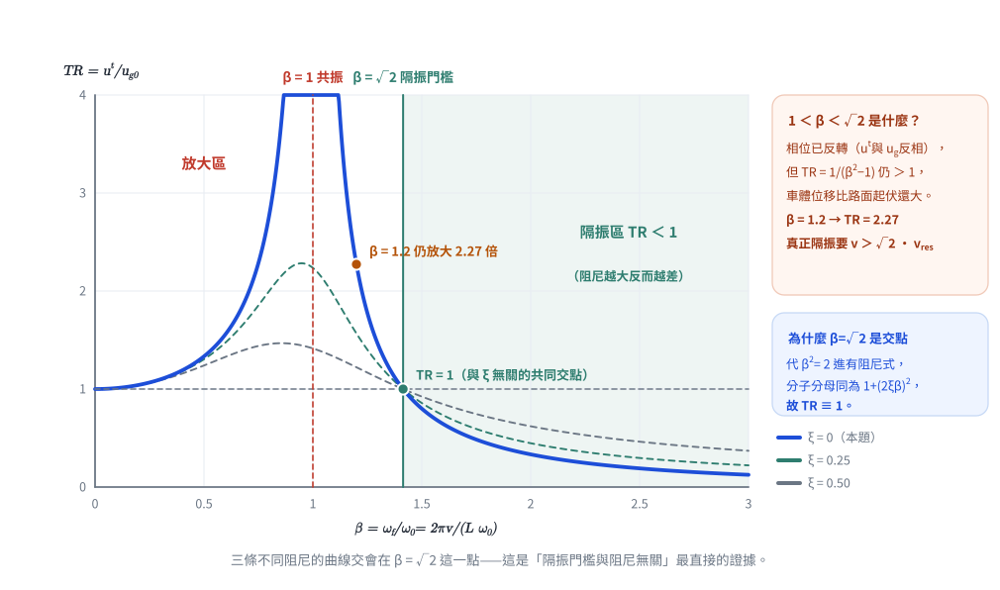

# SD-2011-2｜汽車行駛凹凸路面：SDOF 基礎激振、共振車速與穩態反應

## 題目資訊

| 欄位 | 內容 |
|------|------|
| 題號 | SD-2011-2 |
| 考年 | 2011（民國100年） |
| 科目分類 | SD-U1-3（單自由度系統之動態分析及應用） |
| 副分類 | SD-U1-2（運動方程式推導） |
| 關鍵詞 | SDOF、基礎激振、路面激振、強迫振動、共振、穩態反應、傳導率、頻率比 |
| verificationStatus | **unverified**（2026-08-22 修正過內容，待人工重新驗算）|

---

## 題目敘述

將一輛汽車模擬為**單自由度彈簧－阻尼－質塊系統**（見附圖 SD-2011-2-fig-1）：
- 質量 m，彈簧係數 k，阻尼係數 c
- 車以等速 v 沿 x 方向行駛
- 路面粗糙度（路面垂直位移）：

$$u_g(x) = u_{g0} \sin\!\left(\frac{2\pi x}{L}\right)$$

*圖說：質塊 m 之絕對垂直位移在題圖中標為 $u^t$；k 與阻尼器 c 並聯，下端連至車輪；車輪循路面輪廓 $u_g(x)=u_{g0}\sin(2\pi x/L)$ 上下起伏，車以等速 $v$ 沿 $x$ 方向行駛（故 $x = vt$）。*

*圖 1　題目重繪（向量版）。路面凹凸是「空間」的量（波長 $L$），結構承受的卻是「時間」的激振——本題所有後續推導都掛在 $x = vt \Rightarrow \omega_f = 2\pi v/L$ 這一步上。*

設 $u' \equiv u^t$ 為車體質塊之絕對垂直位移（沿用題圖記號 $u^t$），試求：

(一) 建立其運動方程式（10分）
(二) 求共振車速（5分）
(三) 若忽略阻尼，求在**非共振**車速時之穩態反應（10分）

---

## 解題步驟

### 前置：基礎激振的時間化

車以等速 v 行駛，在時間 t 時車輪位置為 x = vt，故路面引起的基礎位移為：

$$u_g(t) = u_{g0}\sin\!\left(\frac{2\pi v t}{L}\right) = u_{g0}\sin(\omega_f t)$$

其中**激振角頻率**：

$$\boxed{\omega_f = \frac{2\pi v}{L}}$$

這是本題的核心轉換：車速 v 與路面波長 L 共同決定系統承受的激振頻率。

---

### 步驟一：（一）運動方程式

**方法一：以絕對位移 u' 表示**

車體質量 m 的垂直動力平衡（彈簧和阻尼連接車輪與車體）：

$$m\ddot{u}' + c(\dot{u}' - \dot{u}_g) + k(u' - u_g) = 0$$

整理得：

$$\boxed{m\ddot{u}' + c\dot{u}' + ku' = c\dot{u}_g + ku_g}$$

代入 ug = ug0 sin(ωf t)，u̇g = ug0 ωf cos(ωf t)：

$$m\ddot{u}' + c\dot{u}' + ku' = cu_{g0}\omega_f\cos(\omega_f t) + ku_{g0}\sin(\omega_f t)$$

**方法二：以相對位移 z = u' − ug 表示（更便於求解）**

令相對位移 $z = u' - u_g$，代入方法一的方程式：

$$m(\ddot{z} + \ddot{u}_g) + c\dot{z} + kz = 0$$

$$\boxed{m\ddot{z} + c\dot{z} + kz = -m\ddot{u}_g}$$

由於 $\ddot{u}_g = -u_{g0}\omega_f^2\sin(\omega_f t)$，右端激振力為：

$$-m\ddot{u}_g = mu_{g0}\omega_f^2\sin(\omega_f t)$$

**最終運動方程式（相對位移形式）：**

$$\boxed{m\ddot{z} + c\dot{z} + kz = mu_{g0}\omega_f^2\sin(\omega_f t)}$$

> 物理意義：基礎加速度（路面凹凸的慣性效應）等效於作用在質量上的激振力。

---

### 步驟二：（二）共振車速

系統自然角頻率：$\omega_0 = \sqrt{k/m}$

共振條件：激振頻率 = 自然頻率

$$\omega_f = \omega_0 \implies \frac{2\pi v}{L} = \sqrt{\frac{k}{m}}$$

解出共振車速：

$$\boxed{v_{res} = \frac{L}{2\pi}\sqrt{\frac{k}{m}} = L\,f_0 = \frac{L}{T_0}}$$

其中 $T_0 = 2\pi\sqrt{m/k}$ 為系統自然週期，$f_0 = \sqrt{k/m}/(2\pi) = 1/T_0$ 為自然頻率（Hz）。

> **註（有阻尼時的嚴格共振點）：** 本小題與第(三)小題皆按「$\omega_f = \omega_0$」定義共振，這是考場標準答案。
> 嚴格而言，有阻尼系統的**位移**振幅峰值出現在 $\omega_f = \omega_0\sqrt{1-2\xi^2}$，
> 故共振車速略低於 $L f_0$；輕阻尼（$\xi$ 小）時兩者差異可忽略，且 $\xi > 1/\sqrt{2}$ 時位移根本不出現峰值。

> **物理意義：** 共振車速 = 路面波長 × 自然頻率。車速愈高或波長愈長，激振頻率愈高，對應不同的共振條件。實際汽車懸吊系統刻意設計較高阻尼（$\xi \approx 0.2\sim0.4$）正是為了壓低通過共振區時的放大（代價見下節第 3 點）。

---

### 步驟三：（三）忽略阻尼時的穩態反應（非共振）

令 c = 0，由相對位移運動方程式：

$$m\ddot{z} + kz = mu_{g0}\omega_f^2\sin(\omega_f t)$$

**設穩態特解 $z_p = A\sin(\omega_f t)$，代入：**

$$-Am\omega_f^2 + kA = mu_{g0}\omega_f^2$$

$$A = \frac{mu_{g0}\omega_f^2}{k - m\omega_f^2} = \frac{u_{g0}\cdot(\omega_f/\omega_0)^2}{1 - (\omega_f/\omega_0)^2}$$

令頻率比 $\beta = \omega_f/\omega_0 = \dfrac{2\pi v}{L\sqrt{k/m}}$：

$$z_p(t) = \frac{u_{g0}\beta^2}{1-\beta^2}\sin(\omega_f t)$$

**絕對位移（穩態）：**

$$u'_p(t) = z_p(t) + u_g(t) = \left[\frac{u_{g0}\beta^2}{1-\beta^2} + u_{g0}\right]\sin(\omega_f t)$$

$$= u_{g0}\cdot\frac{\beta^2 + (1-\beta^2)}{1-\beta^2}\sin(\omega_f t)$$

$$\boxed{u'_p(t) = \frac{u_{g0}}{1-\beta^2}\sin\!\left(\frac{2\pi v t}{L}\right)}$$

其中：

$$\beta = \frac{\omega_f}{\omega_0} = \frac{2\pi v}{L}\cdot\sqrt{\frac{m}{k}}$$

---

## 計算彙整

| 參數 | 表達式 |
|-----|--------|
| 基礎激振角頻率 | ωf = 2πv/L |
| 系統自然頻率 | ω₀ = √(k/m) |
| 頻率比 | β = ωf/ω₀ = (2πv)/(L√(k/m)) |
| **共振車速** | **v_res = (L/2π)√(k/m) = L/T₀** |
| **穩態絕對位移** | **u'p(t) = [ug0/(1−β²)] sin(2πvt/L)** |
| **穩態相對位移** | **zp(t) = [ug0 β²/(1−β²)] sin(2πvt/L)** |

---

## 解題關鍵觀念

### 1. 路面激振的時間化（最關鍵步驟）

本題的核心是認識到「空間的路面輪廓」如何轉化為「時間的基礎激振」：

$$u_g(x) = u_{g0}\sin\frac{2\pi x}{L} \xrightarrow{x = vt} u_g(t) = u_{g0}\sin\frac{2\pi v t}{L} = u_{g0}\sin(\omega_f t)$$

**激振頻率 ωf = 2πv/L 隨車速 v 線性增大。**

### 2. 基礎激振的等效力

在相對位移座標下：$m\ddot{z} + kz = -m\ddot{u}_g = mu_{g0}\omega_f^2\sin\omega_f t$

激振力振幅 $F_{eff} = mu_{g0}\omega_f^2$ 與頻率平方成正比 → 高速行駛（高 ωf）時，等效激振力更大，更危險。

### 3. 傳導率（Transmissibility）的特殊情況

無阻尼穩態絕對位移：$u'_p = u_{g0}/(1-\beta^2) \cdot \sin(\omega_f t)$

這正是傳導率（Transmissibility）公式 $TR = 1/|1-\beta^2|$ 的無阻尼特例：

| 頻率比範圍 | 相位 | $TR = 1/\lvert 1-\beta^2\rvert$ | 效果 |
|---|---|---|---|
| $\beta < 1$（低速） | $1-\beta^2 > 0$ → $u^t$ 與 $u_g$ **同相** | $1/(1-\beta^2) > 1$ | 放大（$\beta \to 1$ 時發散＝共振） |
| $1 < \beta < \sqrt2$（中速） | $1-\beta^2 < 0$ → **反相** | $1/(\beta^2-1) > 1$ | **仍是放大**（常見誤區） |
| $\beta = \sqrt2$ | 反相 | $= 1$（與 $\xi$ 無關） | 分界點，不放大也不隔振 |
| $\beta > \sqrt2$（高速） | 反相 | $1/(\beta^2-1) < 1$ | 隔振（振動被濾掉） |

**⚠ 隔振的門檻是 $\beta > \sqrt2$，不是 $\beta > 1$。** 只要 $\beta$ 剛越過 1（例如 $\beta = 1.2$，$TR = 1/0.44 = 2.27$），
車體位移仍比路面起伏放大 2 倍以上，只是相位反了。要真正達到隔振（$TR<1$）必須
$\omega_f > \sqrt2\,\omega_0$，換成車速即

$$v > \sqrt2\,v_{res} = \frac{\sqrt2\,L}{2\pi}\sqrt{\frac{k}{m}}$$

> $\beta = \sqrt2$ 是傳導率曲線的**共同交點**：代 $\beta^2 = 2$ 進有阻尼式
> $TR = \sqrt{\dfrac{1+(2\xi\beta)^2}{(1-\beta^2)^2+(2\xi\beta)^2}}$，分子分母同為 $1+(2\xi\beta)^2$，
> 故不論阻尼比多少 $TR$ 恆等於 1；且在 $\beta > \sqrt2$ 的隔振區內，**阻尼越大隔振效果越差**。
> （此結論與 [[SD-2009-2]]、[[SD-2005-4]] 的機械隔振題一致。）

*圖 2　傳導率 $TR$–$\beta$ 曲線。三條不同阻尼的曲線交會在 $\beta = \sqrt2$ 這一點——隔振門檻與阻尼無關；$\beta = 1.2$ 時 $TR$ 仍有 $2.27$，「超過共振車速就開始隔振」是錯的。*

### 4. 常見陷阱

- ❌ 直接寫 $m\ddot{u}' + k u' = F_0 \sin\omega_f t$（忽略彈簧恢復力基準點在 ug，非靜止位置）
- ❌ 共振車速公式直接寫 $v = \omega_0$（單位不對，應為 $v = L\omega_0/(2\pi)$）
- ❌ 穩態絕對位移忘加 $u_g(t)$（只寫出 $z_p$ 相對位移就停止）
- ❌ 分母 $1 - \beta^2$ 誤寫為 $\sqrt{1-\beta^2}$（有阻尼才有根號）
- ❌ 以為「$\beta > 1$ 就開始隔振」（正確門檻是 $\beta > \sqrt2$，見上表）
- ❌ 「實際汽車懸吊刻意設計較高阻尼（$\xi \approx 0.2\sim0.4$）」的目的是**壓低通過共振區（$\beta \approx 1$）時的放大**與加快自由振動衰減，代價是高速（$\beta > \sqrt2$）時隔振效果變差——這是懸吊調校的核心取捨，不可只講一半

---

*圖解補繪：2026-08-22（向量圖 2 張，腳本 `gen_SD-2011-2.py`，所有數值由解題結果算出，可重跑）*
