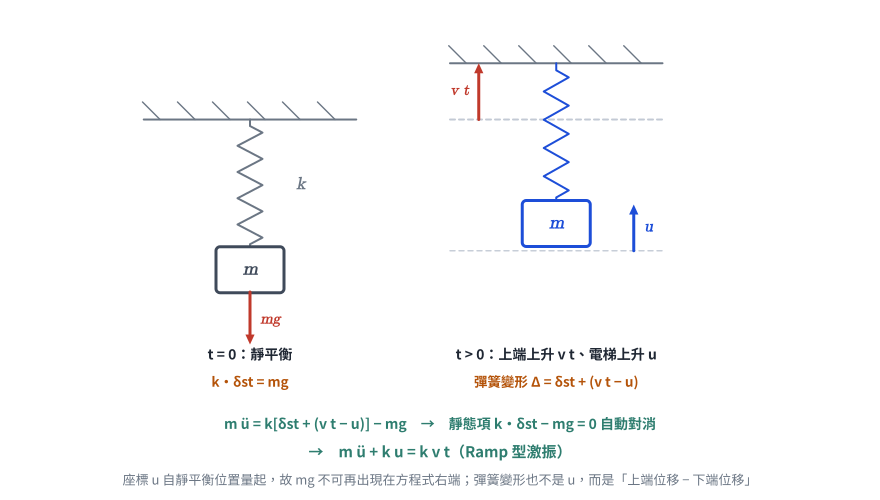
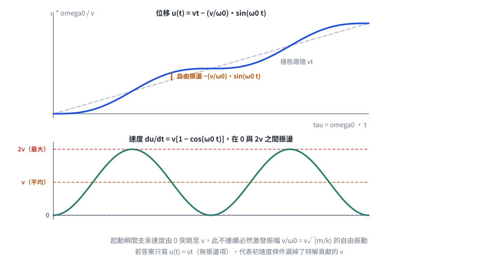

# 考題編號：SD-2011-3

**主分類：** `SD-U1-2` 運動方程式推導
**副分類：** `SD-U1-3` 單自由度、多自由度系統之動態分析及應用
**分析方法：** SDOF 強迫振動（懸吊系統＋等速基礎運動 → Ramp 激振）
**標籤：** `SDOF` `懸吊系統` `電梯動力學` `等速上升` `基礎運動` `Ramp激振` `靜平衡消去` `特解` `齊次解` `零初始條件` `速度脈衝`

---

## 1. 原始題目重述 (Problem Restatement)

一升降電梯系統可理想化為一**懸吊彈簧質塊系統**：

- 電梯質量：$m$
- 彈簧彈性係數：$k$
- 今彈簧之**上端以等速度 $v$ 上升**
- 以電梯之**上升距離 $u$** 為自由度

**子問題：**

- （一）試建立該動態系統之運動方程式（10 分）
- （二）若該電梯之起始狀態為靜止，求 $u(t)$（15 分）

**無題目附圖**（題幹以文字完整描述系統，考卷未附示意圖）。系統可自行畫為：天花板 → 彈簧 $k$（上端以等速 $v$ 上升）→ 質塊 $m$（自由度 $u$，向上為正）。

---

## 2. 考題核心精神與出題者意圖 (Core Concepts & Examiner's Intent)

**核心觀念：** 支承（彈簧上端）以已知運動驅動的**基礎激振問題**。等速上升的支承對質塊而言，等效於一個隨時間線性成長的激振力 $kvt$（Ramp 型激振），這是「速度脈衝型地表運動」在數學上的最簡模型。

**出題意圖：**

1. 測驗**靜平衡消去技巧**：懸吊系統以「自靜止位置量起的位移」為座標時，重力 $mg$ 與靜態彈力 $k\delta_{st}$ 自動抵消，運動方程式只剩動態部分。
2. 測驗**相對變形量的幾何寫法**：彈簧變形 $= \delta_{st} + (vt - u)$，不能只寫 $u$。
3. 測驗 **Ramp 激振的特解形式**（$u_p = At+B$）與零初始條件下的常數求解。
4. 隱性考點：解出的 $u(t)$ 顯示「速度在 $0\sim 2v$ 之間振盪」，這正是電梯起動衝擊的物理來源。

---

## 3. 解題戰略地圖與陷阱分析 (Strategic Roadmap & Trap Analysis)

**作戰計畫（5 步）：**

1. 定義座標（向上為正），確認 $u$ 是**電梯自初始靜止位置量起的絕對上升距離**
2. 寫靜平衡條件 $k\delta_{st} = mg$
3. 寫 $t$ 時刻的彈簧變形量，列 Newton 第二定律，消去靜態項 → EOM
4. 解 Ramp 激振：特解 $u_p = vt$ ＋ 齊次解
5. 代入 $u(0)=0,\ \dot u(0)=0$ 求常數，並回代驗算

**陷阱分析：**

| # | 陷阱 | 說明 | 應對策略 |
|---|------|------|---------|
| ❶ | **重力重複計入** | 寫成 $m\ddot u + ku = kvt + mg$ | 只要座標自靜平衡位置量起，$mg$ 必與 $k\delta_{st}$ 對消；寫完先檢查 $t=0$ 時 EOM 是否給出 $\ddot u(0)=0$ |
| ❷ | **彈簧變形只寫 $u$** | 忘記上端也在動，漏掉 $vt$ | 彈簧變形 = 上端位移 − 下端位移（＋靜態伸長） |
| ❸ | **特解形式猜錯** | Ramp 激振猜成常數 $u_p=C$（那是**定值力**的特解），或猜 $Ct^2$ | 激振為 $t$ 的一次式 → 特解取同次多項式 $At+B$ |
| ❹ | **初速度條件漏掉特解項** | 由 $\dot u_h(0)=0$ 得 $C_2=0$ | $\dot u(0)$ 要用**全解**微分：$\dot u(0)=C_2\omega_0 + v = 0 \Rightarrow C_2 = -v/\omega_0$ |

---

## 3.5 變數層次分析 (Variable Hierarchy Analysis)

> 複習提示：第一次解題後，在每個卡住的知識點旁標記 `⚠`；第二次複習時只看有 `⚠` 的項目。

### 最終目標

`(一) 運動方程式 mü + ku = kvt；(二) 零初始條件下的完整響應 u(t)`

### 本題關鍵公式（依計算順序）

> $\boxed{\cdot}$ = 需由前步驟推導，非題目直接給定的變數

$$\text{Step 1（靜平衡）：}\quad k\,\delta_{st} = mg \;\Rightarrow\; \delta_{st} = \frac{mg}{k}$$

$$\text{Step 2（彈簧變形）：}\quad \Delta(t) = \boxed{\delta_{st}} + \left(vt - u\right)$$

$$\text{Step 3（Newton 第二定律，向上為正）：}\quad m\ddot u = k\,\boxed{\Delta(t)} - mg$$

$$\text{Step 4（消去靜態項）：}\quad m\ddot u + ku = kvt \;\Longleftrightarrow\; \ddot u + \boxed{\omega_0}^{\,2}u = \boxed{\omega_0}^{\,2}vt,\quad \omega_0=\sqrt{k/m}$$

$$\text{Step 5（特解）：}\quad u_p = At+B \;\Rightarrow\; A=v,\ B=0 \;\Rightarrow\; u_p = vt$$

$$\text{Step 6（全解）：}\quad u(t) = C_1\cos \boxed{\omega_0} t + C_2\sin \boxed{\omega_0} t + \boxed{u_p}$$

$$\text{Step 7（初始條件）：}\quad u(0)=0,\ \dot u(0)=0 \;\Rightarrow\; C_1=0,\ C_2=-\frac{v}{\boxed{\omega_0}}$$

### L1：題目直接給定

| 符號 | 數值 | 說明 |
|------|------|------|
| $m$ | —（符號） | 電梯質量 |
| $k$ | —（符號） | 懸吊彈簧彈性係數 |
| $v$ | —（符號） | 彈簧上端的等速上升速度（常數） |
| $u$ | 廣義座標 | 電梯自初始靜止位置量起的上升距離（向上為正） |
| 初始條件 | $u(0)=0,\ \dot u(0)=0$ | 「起始狀態為靜止」 |
| $g$ | 重力加速度 | 題目未明言，但建立平衡式時需要（最終會消去） |

### L2：需知識點推導

**Step 1：靜平衡與座標定義**

| 符號 | 公式／來源 | 卡關? |
|------|-----------|:-----:|
| $\delta_{st}$ | $mg/k$（$t=0$ 靜止 → 彈力＝重力） | |
| 上端位移 | $vt$（等速運動的位移） | |
| 彈簧變形 $\Delta$ | $\delta_{st} + (vt - u)$（上端減下端） | |

**Step 2：運動方程式**

| 符號 | 公式／來源 | 卡關? |
|------|-----------|:-----:|
| Newton 第二定律 | $m\ddot u = k\Delta - mg$（向上為正） | |
| 靜態消去 | $k\delta_{st} - mg = 0$ | |
| EOM | $m\ddot u + ku = kvt$ | |
| $\omega_0$ | $\sqrt{k/m}$ | |

**Step 3：求解常微分方程**

| 符號 | 公式／來源 | 卡關? |
|------|-----------|:-----:|
| 特解 $u_p$ | 設 $At+B$，比較係數 → $A=v,\ B=0$ | |
| 齊次解 $u_h$ | $C_1\cos\omega_0 t + C_2\sin\omega_0 t$ | |
| $C_1$ | 由 $u(0)=0$ → $C_1=0$ | |
| $C_2$ | 由 $\dot u(0)=0$（含特解項 $v$）→ $-v/\omega_0$ | |

### L3：深層知識（不懂就卡住）

| 知識點 | 說明 | 卡關? |
|--------|------|:-----:|
| 靜平衡消去的成立條件 | 只有在**線性彈簧＋重力為定值**時，重力才能被靜態伸長完全吸收；座標必須自靜平衡位置量起 | |
| 支承運動 vs 外力激振 | 支承位移 $u_g(t)$ 對系統的效果 = 在自由度上施加等效力 $k\,u_g(t)$（此處 $u_g=vt$） | |
| 常係數線性 ODE 的特解型式 | 激振為 $n$ 次多項式 → 特解取 $n$ 次多項式（非共振時）；定值力 → 常數；諧和力 → 同頻正餘弦 | |
| 為何會有自由振動殘留 | 支承速度在 $t=0$ 由 $0$ 突跳至 $v$（加速度含脈衝），此不連續必然激發自由振動，振幅 $v/\omega_0$ | |
| 「非共振」的判定 | Ramp 激振無特定頻率，$u_p$ 不與齊次解重疊，故不必用 $t\cdot(\cdot)$ 型特解 | |

---

## 4. 步驟化詳細計算過程 (Step-by-Step Detailed Calculation)

### 前置：座標系與靜平衡

**座標系定義（向上為正）：**

- $u$：電梯質塊自初始靜止位置向上的位移（即題目所稱「上升距離」），$u(0)=0$
- 彈簧上端：初始位置為基準，之後以等速 $v$ 上升 → 上端位移 $= vt$

**靜平衡條件（$t=0$）：**

電梯靜止，彈簧已有靜態伸長量：

$$k\,\delta_{st} = mg \quad\Longrightarrow\quad \delta_{st} = \frac{mg}{k}$$

---

### （一）運動方程式（10 分）

*圖 1　兩個時刻的對照。彈簧變形是「上端位移 − 下端位移」再加靜態伸長，不是 $u$；而座標既然自靜平衡位置量起，$k\delta_{st}-mg$ 就自動對消，$mg$ 不可再出現在方程式右端。*

**$t$ 時刻的幾何關係：**

- 彈簧上端比初始位置高出：$vt$
- 電梯比初始位置高出：$u$
- 彈簧伸長量：

$$\Delta(t) = \underbrace{\delta_{st}}_{\text{靜態}} + \underbrace{(vt - u)}_{\text{動態：上端減下端}}$$

**電梯垂直方向 Newton 第二定律（向上為正）：**

$$m\ddot{u} = \underbrace{k\left[\delta_{st} + (vt - u)\right]}_{\text{彈力（向上）}} - \underbrace{mg}_{\text{重力（向下）}}$$

$$m\ddot{u} = \underbrace{k\delta_{st} - mg}_{=\,0\ \text{（靜平衡）}} + k(vt - u)$$

> **策略註解：** 這一步就是「靜平衡消去」。因為 $u$ 是自靜平衡位置量起，重力被靜態伸長完全吸收，之後不必再出現在方程式中。

整理得**運動方程式**：

$$\boxed{m\ddot{u} + ku = kvt}$$

或等價形式：

$$\ddot{u} + \omega_0^2 u = \omega_0^2 v t, \qquad \omega_0 = \sqrt{\frac{k}{m}}$$

> **物理意義：** 等速上升的彈簧上端，對電梯施加一個線性成長（Ramp）的等效激振力 $kvt$。這與「斜坡型地面位移」的數學形式完全相同。

---

### （二）零初始條件下的 $u(t)$（15 分）

**初始條件：** $u(0)=0$，$\dot u(0)=0$

**Step 1：特解（Particular solution）**

激振項 $\omega_0^2 vt$ 為 $t$ 的一次式，故設 $u_p = At + B$：

$$\ddot u_p + \omega_0^2 u_p = 0 + \omega_0^2(At+B) \stackrel{!}{=} \omega_0^2 vt$$

比較係數：

- $t$ 的係數：$\omega_0^2 A = \omega_0^2 v \implies A = v$
- 常數項：$\omega_0^2 B = 0 \implies B = 0$

$$u_p = vt$$

**Step 2：齊次解（Homogeneous solution）**

$$u_h = C_1\cos(\omega_0 t) + C_2\sin(\omega_0 t)$$

**Step 3：全解**

$$u(t) = C_1\cos(\omega_0 t) + C_2\sin(\omega_0 t) + vt$$

**Step 4：代入初始條件**

由 $u(0)=0$：

$$C_1\cdot 1 + C_2\cdot 0 + 0 = 0 \implies C_1 = 0$$

由 $\dot u(t) = -C_1\omega_0\sin(\omega_0 t) + C_2\omega_0\cos(\omega_0 t) + v$，代入 $\dot u(0)=0$：

$$C_2\omega_0 + v = 0 \implies C_2 = -\frac{v}{\omega_0}$$

> **策略註解：** 這裡最容易漏掉特解貢獻的常數速度 $v$。若忘記，會得到 $C_2=0$、$u(t)=vt$（完全沒有振動），與物理直覺（起動必有晃動）矛盾。

**最終解：**

$$\boxed{u(t) = vt - \frac{v}{\omega_0}\sin(\omega_0 t) = v\left[t - \frac{\sin(\omega_0 t)}{\omega_0}\right]},\qquad \omega_0=\sqrt{\frac{k}{m}}$$

---

### 驗算

**驗算初始條件：**

$$u(0) = v[0-0] = 0 \;\checkmark$$

$$\dot u(t) = v\left[1 - \cos(\omega_0 t)\right] \implies \dot u(0) = v[1-1] = 0 \;\checkmark$$

**回代運動方程式：**

$$\ddot u(t) = v\,\omega_0\sin(\omega_0 t)$$

$$\ddot u + \omega_0^2 u = v\omega_0\sin(\omega_0 t) + \omega_0^2\!\left[vt - \frac{v}{\omega_0}\sin(\omega_0 t)\right] = \omega_0^2 vt \;\checkmark$$

**量綱驗算：** $v/\omega_0 = v\sqrt{m/k}$，$[\text{m/s}]\cdot[\text{s}] = [\text{m}]$ ✓（振幅為長度）

---

*圖 2　無因次響應。位移繞著穩態跟隨線 $vt$ 上下振盪，振幅 $v/\omega_0$；速度在 $0$ 與 $2v$ 之間、平均恰為 $v$。若答案只寫 $u(t)=vt$（曲線與虛線重合、毫無振盪），代表初速度條件漏掉了特解貢獻的 $v$。*

### 結果彙整

| 項目 | 結果 |
|-----|------|
| 運動方程式 | $m\ddot u + ku = kvt$ |
| 自然頻率 | $\omega_0 = \sqrt{k/m}$ |
| 特解 | $u_p = vt$ |
| 全解（零初始條件） | $\boxed{u(t) = vt - (v/\omega_0)\sin(\omega_0 t)}$ |
| 速度 | $\dot u(t) = v\left[1-\cos(\omega_0 t)\right]$，在 $0\sim 2v$ 間振盪 |
| 加速度 | $\ddot u(t) = v\omega_0\sin(\omega_0 t)$，最大值 $v\omega_0$ |
| 振盪振幅 | $v/\omega_0 = v\sqrt{m/k}$ |

---

## 5. 關鍵爭議點與進階探討 (Critical Issues & Advanced Discussion)

### 5.1 解的物理分解

$$u(t) = \underbrace{vt}_{\text{穩態跟隨}} \;-\; \underbrace{\frac{v}{\omega_0}\sin(\omega_0 t)}_{\text{起動引發的自由振盪}}$$

- 第一項 $vt$：電梯「平均」以速度 $v$ 上升，跟隨彈簧上端
- 第二項：起動瞬間支承速度由 $0$ 突跳至 $v$，此速度不連續誘發振幅 $v/\omega_0$ 的自由振動
- 振幅 $v/\omega_0 = v\sqrt{m/k}$：**彈簧愈硬（$k$ 大）或質量愈輕，起動晃動愈小**；提高上升速度 $v$ 則晃動等比例放大

實務對應：電梯的起動舒適度設計，正是靠「限制加加速度（jerk）」把速度不連續平滑化，避免這一項被完整激發。

### 5.2 若題目改問「電梯相對彈簧上端的位移」

令相對位移 $w = u - vt$，代入 EOM：

$$m(\ddot w + 0) + k(w+vt) = kvt \implies m\ddot w + kw = 0$$

即相對座標下為**純自由振動**，初始條件 $w(0)=0$、$\dot w(0)=-v$，解得 $w(t) = -(v/\omega_0)\sin(\omega_0 t)$，與上式一致 ✓。
（因支承為等速運動、加速度為零，故相對座標下的等效地震力 $-m\ddot u_g = 0$。）

### 5.3 與地震工程的連結

本題的「等速支承運動」在地震工程中對應**速度脈衝型地面運動**（velocity pulse），是近斷層地震（near-fault earthquake）的特徵。分析路徑完全相同：支承運動 → 等效激振 → 求解 SDOF 響應。差別只在近斷層脈衝為有限延時，本題則是無限延續的等速運動。

### 5.4 若考慮阻尼

加入阻尼 $c$ 後 $m\ddot u + c\dot u + ku = c v + kvt$（注意支承速度也會經由阻尼器傳力），穩態解變為 $u_p = vt$（相同），而齊次解衰減，故長時間後電梯完全跟隨 $vt$——這解釋了為何實際電梯的起動晃動會逐漸消失。

---

## 修正紀錄

| 日期 | 修正內容 | 理由／驗證 |
|------|---------|-----------|
| 2026-08-22 | **全文改寫為 CLAUDE-SOLVE.md 規定的解析格式**（§1 題目重述／§2 核心精神／§3 戰略地圖／**§3.5 變數層次分析**／§4 詳細計算／§5 進階探討） | 原檔為「題目資訊／解題步驟／驗算」的自訂結構，缺少必備的 §3.5 VHA 區塊，與其餘 98 份解析不一致 |
| 2026-08-22 | 陷阱表原寫「特解猜 $u_p=Ct^2$（適用於常數激振力）」，更正為「常數力的特解是常數 $C$，Ramp 力才用 $At+B$」 | 原敘述把定值力的特解型式寫成 $Ct^2$，是錯的 |
| 2026-08-22 | 新增相對座標驗算（§5.2）、量綱驗算、含阻尼討論（§5.4） | 補上第二條獨立驗算路徑 |

> 計算主體經重新驗算全部正確，未更動：
> $m\ddot u + ku = kvt$；$u(t) = vt - (v/\omega_0)\sin\omega_0 t$；回代 ODE 與初始條件均成立。

---

*圖解補繪：2026-08-22（向量圖，由 `gen_SD-2011-3.py` 以程式碼繪製，所有幾何與數值由解題結果算出，可重跑）*
