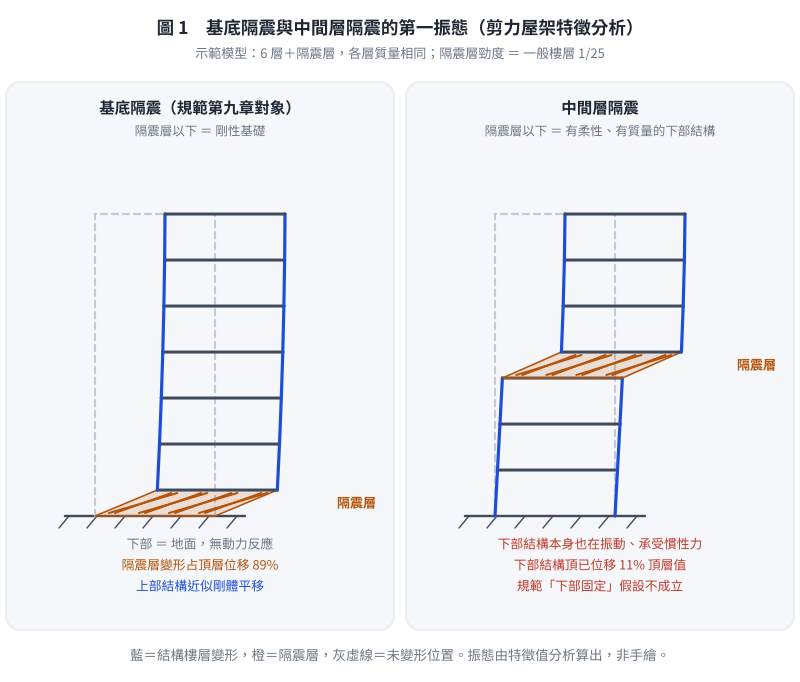
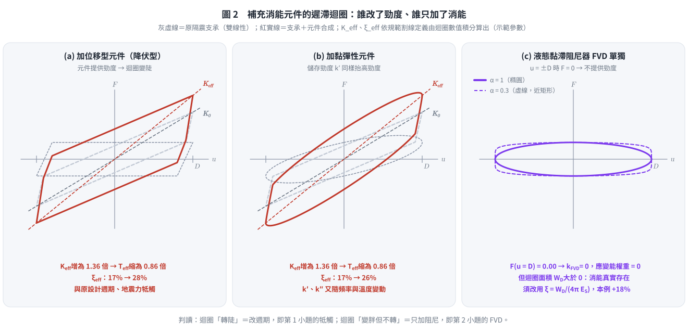
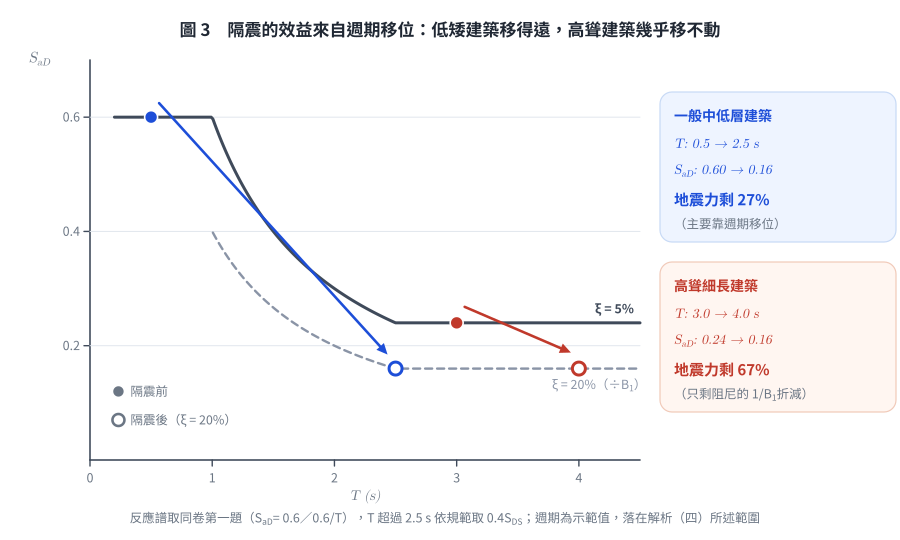
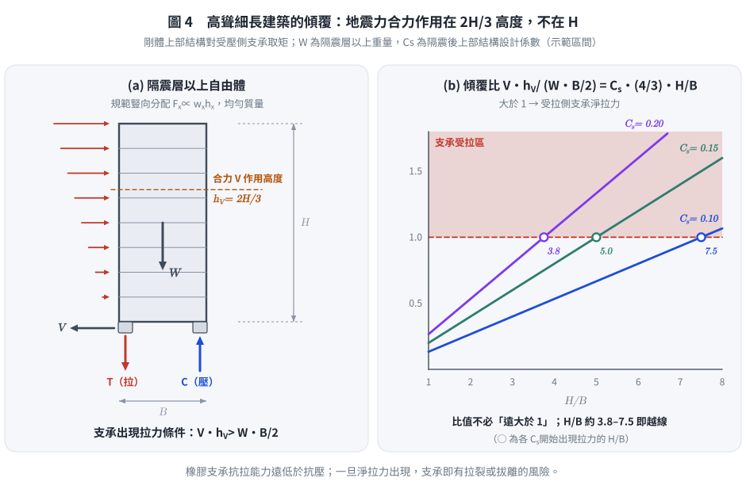

# SD-2011-4｜隔震規範應用：中間層隔震、複合阻尼比、消能元件、高聳建築

## 題目資訊

| 欄位 | 內容 |
|------|------|
| 題號 | SD-2011-4 |
| 考年 | 2011（民國100年） |
| 科目分類 | SD-U3-2（隔減震原理） |
| 副分類 | SD-U2-2（建築耐震設計規範） |
| 關鍵詞 | 隔震規範、中間層隔震、複合阻尼比、應變能加權、液態黏滯阻尼器、高阻尼橡膠支承、高聳建築、傾覆力矩、高振態 |
| verificationStatus | `unverified` |

---

## 題目敘述

依我國建築物耐震設計規範第九章隔震建築物設計條文：

(一) 中間層隔震（inter-story isolation）是否適用現行規範？理由？（5分）
(二) 多振態反應譜疊加法之複合阻尼比公式？（5分）
(三) 隔震元件實測阻尼比不足，需補充消能元件：（各3分，共9分）
　⑴ 位移型或黏彈性元件的潛在衝突與後果？
　⑵ 液態黏滯性元件能否透過複合阻尼比計算反映到等效阻尼比？
　⑶ 未規定測試頻率下，各類支承能否正確檢測力學特性？
(四) 高聳細長建築物不宜採用隔震設計的理由？（6分）

---

## 解題步驟

### （一）現行規範第九章是否適用中間層隔震？

**結論：不適用。**

現行建築物耐震設計規範第九章是**針對基底隔震（base isolation）**所建立的，其設計條文的成立前提包含以下假設：

| 假設 | 基底隔震 | 中間層隔震的實際情況 |
|------|---------|----------------|
| 隔震層以下為剛性地面/基礎 | ✓ 成立 | ✗ 下部結構有動力響應 |
| 上部結構近似剛體（靜力分析法） | 可合理簡化 | 上下部結構均有柔性 |
| 等效側向力作用點明確 | 在隔震層 | 下部結構也承受慣性力 |
| 隔震週期定義 | 單一隔震系統 | 兩個子結構各有其週期 |

**主要理由：**

⑴ **下部結構動力效應未考慮：** 規範靜力分析法假設隔震層以下完全固定，中間層隔震的下部樓層有其本身的慣性力，規範中的等效側向力分佈公式無法涵蓋。

⑵ **等效週期定義不適用：** 規範的隔震有效週期 $T_{eff}$ 是以全部重量除以隔震層剛度推導，中間層隔震的「有效週期」需考慮上下部結構的動力特性，公式不同。

⑶ **動力分析才能正確捕捉：** 中間層隔震結構的振態形狀複雜，三個子系統（上部結構、隔震層、下部結構）相互耦合，必須以完整的 MDOF 動力分析進行設計驗核，不得套用規範的簡化靜力設計流程。

*圖 1　基底隔震與中間層隔震的第一振態（示範剪力屋架之特徵分析）。右圖下部結構頂已有位移，這就是規範「隔震層以下固定」假設失效之處；若作答只寫「中間層隔震也是隔震，可直接適用」，這張圖就攔得下來。*

> **實務上**：採中間層隔震之專案通常須進行非線性時間歷史分析，並由主管機關個案審查，不能直接引用規範第九章的設計條文。

---

### （二）多振態反應譜疊加法之複合阻尼比公式

隔震系統由隔震層（高阻尼，ξ_iso）和上部結構（低阻尼，ξ_str）組成，兩者阻尼特性不同，不能直接用單一阻尼比描述整體系統。

**複合阻尼比（Composite damping ratio）採「應變能加權法」：**

對第 i 振態，其等效阻尼比為各構件阻尼比依其**應變能比例**加權的加權平均值：

$$\boxed{\xi_{eff,i} = \frac{\displaystyle\sum_{j} \xi_j \cdot k_j \left(\phi_{ij} - \phi_{i,j-1}\right)^2}{\displaystyle\sum_{j} k_j \left(\phi_{ij} - \phi_{i,j-1}\right)^2}}$$

其中：
- $\xi_j$：第 j 層（或構件）的黏性阻尼比
- $k_j$：第 j 層（或構件）的側向勁度
- $\phi_{ij}$：第 i 振態在第 j 樓層的振態分量
- $(\phi_{ij} - \phi_{i,j-1})^2$：正比於第 j 層構件在第 i 振態下的**應變能**（SE_j ∝ ½ k_j Δu_j²）

**物理意義：** 哪個構件承受較大的相對變形（應變能大），它的阻尼特性對整體系統的等效阻尼比貢獻就愈大。

- **振態 1（隔震振態）**：隔震層相對位移遠大於上部結構層間位移 → ξ_eff,1 ≈ ξ_iso（高阻尼主導）
- **振態 2（上部結構振態）**：隔震層相對位移小，上部結構層間位移大 → ξ_eff,2 ≈ ξ_str（低阻尼主導）

各振態的等效阻尼比分別確定後，再查表得到相應的阻尼修正係數（Bs 或 B₁），代入各振態的譜加速度，完成 SRSS 組合。

---

### （三）補充消能元件的問題

#### ⑴ 位移型或黏彈性元件（Displacement-dependent / Viscoelastic devices）

位移型消能元件（如：鋼材降伏型消能支撐、摩擦型阻尼器）及黏彈性元件（橡膠型消能器）的共同特徵是：**在提供阻尼的同時，也提供額外的側向勁度**。

**衝突與後果：**

| 問題 | 原因 | 後果 |
|-----|------|------|
| 隔震週期縮短 | 消能元件增加隔震層剛度 k_eff↑ → T_eff = 2π√(m/k_eff)↓ | 進入高加速度區，地震力增大 |
| 隔震位移減小 | T 縮短 → 譜位移 Sd 減小 | 表面上位移降低，但因加速度增大，上部結構受力更大 |
| 行程與疲勞 | 位移型元件須隨隔震層承受 30～50 cm 的大位移，往復次數多 | 元件行程不足或低週疲勞破壞；元件特性須與支承一起試驗驗證 |
| 特性漂移（黏彈性） | 黏彈性材料之 $k'$、$k''$ 隨頻率與溫度變化 | 實際 $K_{eff}$、$\xi_{eff}$ 偏離設計值，週期與阻尼皆不確定 |
| 設計基準漂移 | 有效週期、等效阻尼比均偏離原設計假設 | 隔震支承與上部結構的設計均需重新驗核 |

**核心衝突：** 隔震設計的邏輯是「以柔性（長週期）來隔離地震」，位移型/黏彈性元件增加了隔震層剛度，與隔震的柔性原則相抵觸，可能使隔震設計失效。

---

#### ⑵ 液態黏滯性元件（Fluid Viscous Dampers, FVD）

液態黏滯阻尼器的出力：$F_{FVD} = C \cdot \text{sgn}(\dot{u}) \cdot |\dot{u}|^\alpha$（0 < α ≤ 1）

**結論：不能直接透過複合阻尼比公式反映，需要等效線性化。**

**理由：**

複合阻尼比公式（應變能加權法）是以各元件的**應變能**當權重：

$$\xi_{eff} = \frac{\sum_j \xi_j \, k_j \Delta u_j^2}{\sum_j k_j \Delta u_j^2}$$

式中每個元件的 $\xi_j$ 本身也是以「自身應變能」定義的：$\xi_j = W_{D,j} / (4\pi E_{S,j})$，$E_{S,j} = \tfrac12 k_j \Delta u_j^2$。

液態黏滯阻尼器的出力與**速度**相關，在最大位移時出力為零，**不提供勁度（$k_{FVD} = 0$）**，因此：
- 它在權重 $k_j \Delta u_j^2$ 中為 0：不論消能多大，加權後的貢獻都是 0
- 它自己的 $\xi_j$ 也沒有定義（分母 $E_{S,j} = 0$）
- 直接套用應變能加權式，FVD 的消能效果**不會**被反映出來

亦即問題不在「阻尼力與位移成比例」與否，而在加權式的權重是勁度；沒有勁度的元件，在這個式子裡就看不見。

**正確做法：** 先以等效線性化法將 FVD 的每週期消能量 $W_{D,FVD}$ 換算成等效黏性阻尼比：

$$\xi_{eq,FVD} = \frac{W_{D,FVD}}{4\pi \cdot \frac{1}{2}k_{iso}\Delta_{iso}^2}$$

其中 $W_{D,FVD}$ 依速度指數 $\alpha$ 計算：線性（$\alpha = 1$）為 $W_D = \pi C \omega D^2$；非線性為 $W_D = \lambda\, C\, \omega^{\alpha} D^{1+\alpha}$（$\lambda$ 為僅與 $\alpha$ 有關之常數），$\omega$ 取隔震週期 $2\pi/T_D$。再將 $\xi_{eq,FVD}$ 加入隔震層的總阻尼比（等同把公式改寫為能量形式 $\xi = \sum W_{D,j} / (4\pi \sum E_{S,j})$，FVD 只出現在分子），才能反映到整體等效阻尼比。

另須注意：FVD 出力在最大**速度**時最大，與最大位移時的支承力相差 90° 相位，設計時應另檢核最大速度時的構件內力。

> **工程優點：** FVD 不增加剛度，不改變隔震週期 → 補足阻尼的同時不干擾隔震設計的頻率移位效果，是補充阻尼的**較佳選擇**。

*圖 2　補充消能元件的遲滯迴圈（示範參數，$K_{eff}$、$\xi_{eff}$ 依規範割線定義由迴圈積分算出）。迴圈「轉陡」代表週期被改，這是⑴的牴觸；迴圈「變胖但不轉」代表只加阻尼，這是⑵的 FVD。可攔下「FVD 也會增加勁度」與「FVD 可直接代入應變能加權式」兩種錯誤。*

---

#### ⑶ 未規定測試頻率對各類支承的影響

| 支承類型 | 主要消能機制 | 力學特性頻率依賴性 | 未規定頻率的影響 |
|---------|------------|-----------------|--------------|
| **鉛心橡膠支承（LRB）** | 鉛心塑性變形 | **中**：鉛的降伏強度隨應變速率提高；高速往復時鉛心發熱，特性強度 $Q_d$ 隨圈數明顯下降 | 慢速試驗量不到發熱衰減，也低估首圈強度；$Q_d$ 與 $\xi_{eff}$ 的上下限都可能失真 |
| **摩擦單擺支承（FPS）** | 滑動摩擦 | **高**：摩擦係數由極低速的 $\mu_{min}$ 隨滑速上升至 $\mu_{max}$，兩者可差約 2 倍以上，並受壓力、溫度影響 | 慢速試驗會**低估** $\mu$，因而低估支承強度、等效阻尼與傳入上部結構的剪力 |
| **高阻尼橡膠支承（HDRB）** | 橡膠內部黏彈性消能 | **高**：剛度與阻尼隨頻率、溫度、應變歷程（scragging）變化 | **影響顯著**；低頻測試值可能無法代表地震下行為 |

**結論：**

**三類支承都無法完整由未規定頻率的測試檢出，只是程度不同。**

- **HDRB**：黏彈性材料，儲能模數 $G'$ 與損失模數 $G''$ 皆為頻率函數；低頻（約 0.01 Hz）試驗所得等效勁度與阻尼比，可能與地震激振頻率（隔震週期 2～3 s，約 0.3～0.5 Hz）下的值差異顯著。
- **FPS**：摩擦係數具明顯速度相依性，慢速試驗所得 $\mu$ 偏低，是**偏不保守**的誤差（低估傳入上部結構的力）。
- **LRB**：鉛心強度具速率相依性，且實際地震速度下的發熱衰減只有動態試驗量得到。

因此，凡特性與速率相關之支承，原型試驗應以接近隔震週期的頻率（如 ASCE 7 要求之 $1/T_D$）進行，或以性質修正係數（上下限）包絡其變動。

---

### （四）高聳細長建築物不宜採用隔震設計的理由

#### 隔震設計原理角度

**週期延長效益有限：**
高聳細長建築本身自然週期 T₀ 已相對較長（可能達 2～4 秒或更長）。隔震設計的目的是將結構週期延長至 2.0～3.0 秒以上，脫離地震能量集中的短週期範圍（0.1～0.5 秒）。然而對高聳建築而言：
- 原結構週期本就接近或超越隔震目標週期，延長效益邊際遞減
- 長週期段（> 3 秒）的地盤放大效應可能使隔震效益被抵銷，甚至有反效果

*圖 3　以同卷第一題之反應譜比較週期移位效益（週期為示範值）。高聳建築本已位於譜的平緩段，延長週期幾乎不降低 $S_{aD}$，剩下的折減主要來自阻尼的 $1/B_1$。可攔下「隔震對任何建築都能大幅降低地震力」的錯誤。*

#### 結構分析角度

**傾覆力矩與支承拉力問題：**

隔震後地震水平力 $V \approx k_{iso} D_{iso}$，依規範豎向分配 $F_x \propto w_x h_x$，均勻質量時合力作用高度 $h_V = 2H/3$（不是 $H$），傾覆力矩 $M_{OT} = V \cdot h_V$。以 $V = C_s W$ 代入：

$$\frac{M_{OT}}{W \cdot B/2} = \frac{C_s W \cdot \tfrac{2}{3}H}{W \cdot B/2} = \frac{4}{3}\, C_s \, \frac{H}{B}$$

此比值大於 1 時，受拉側的隔震支承出現**淨拉力**。以 $C_s = 0.10 \sim 0.20$ 估算，$H/B$ 約 3.8～7.5 即越過門檻；比值不需要「遠大於 1」，只要超過 1 就有問題，而高寬比愈大愈容易超過。

*圖 4　傾覆與支承拉力。左圖標出合力作用高度，可攔下把 $V$ 放在屋頂（$M_{OT} = V \times H$）的錯誤；右圖顯示門檻是「比值大於 1」，可攔下「比值必然遠大於 1」的誇大說法。*橡膠隔震支承（LRB、HDRB）的抗拉能力極差（約為抗壓承載力的 1/10 以下），出現拉力將導致支承損壞或喪失功能。

**P-Δ 效應放大：**

隔震位移 D（可達 30～50 cm）造成重心偏移，對高聳建築產生顯著的二階效應（P-Δ 彎矩 ≈ W × D），加劇穩定性問題。

**高振態參與量變大：**

對上部結構相對剛性的建築，隔震後第二振態的參與因子約與 $\varepsilon = (T_{fixed}/T_{iso})^2$ 同階，$\varepsilon$ 很小，所以隔震其實會**壓抑**高振態，使第一（隔震）振態主導（$M_{eff,1} \approx$ 總質量）。高聳細長建築的固定基底週期 $T_{fixed}$ 本就很長，$\varepsilon$ 不再小：高振態參與量變大，上部結構與隔震層的振態耦合明顯，「隔震層集中變形、上部近似剛體」的前提不成立，隔震壓抑高振態的效果也隨之喪失。

#### 設計觀點

**規範靜力分析法不適用：** 規範的等效靜力分析法假設上部結構為剛體，高聳細長建築的柔性本身就使此假設嚴重不成立，必須進行非線性時間歷史分析，大幅增加設計複雜度。

**支承垂直載重分配極端：** 地震傾覆力矩使各支承垂直載重差異巨大（受壓端可能超過允許壓力），支承設計變得非常困難，且傾覆力矩也會造成上部結構基板（Diaphragm）設計困難。

---

## 解題關鍵觀念彙整

| 子題 | 核心論點 |
|-----|---------|
| (一) | 規範第九章假設下部結構剛性（基底隔震），中間層隔震下部結構有動態響應，假設不成立 |
| (二) | 複合阻尼比 = 各元件阻尼比 × 應變能（∝ k_j Δu_j²）加權平均 |
| (三)⑴ | 位移型/黏彈性元件增加隔震層剛度 → 週期縮短 → 隔震效果劣化 |
| (三)⑵ | FVD 出力與速度相關，不增加剛度，不在應變能加權公式中，需等效線性化後才能代入 |
| (三)⑶ | 三者皆有速率相依性：HDRB（頻率、溫度）與 FPS（摩擦係數隨滑速）最顯著，LRB 有鉛心發熱衰減；均應以接近 $1/T_D$ 的頻率試驗 |
| (四) | 週期延長效益小 + 傾覆比 $\tfrac43 C_s H/B$ 超過 1 即支承受拉 + P-Δ 放大 + $\varepsilon$ 不小致高振態參與量變大 |

---

*解析日期：2026-08-22　｜　勘誤：2026-10-05（（三）⑵ 理由段、（三）⑶ LRB／FPS 速率相依性、（四）傾覆力矩作用高度與高振態論述）　｜　圖解補繪：2026-10-05（向量圖，腳本 `gen_SD-2011-4.py`，可重跑）*
