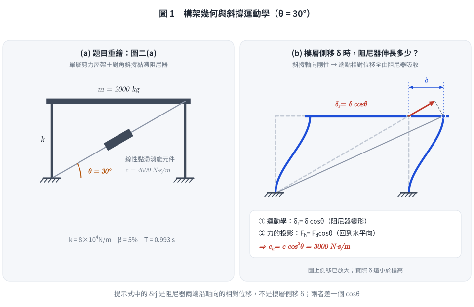
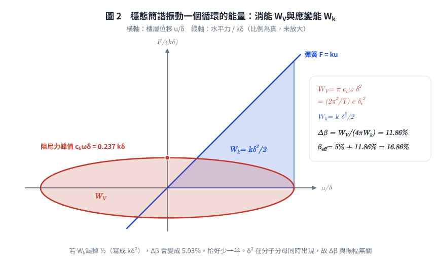
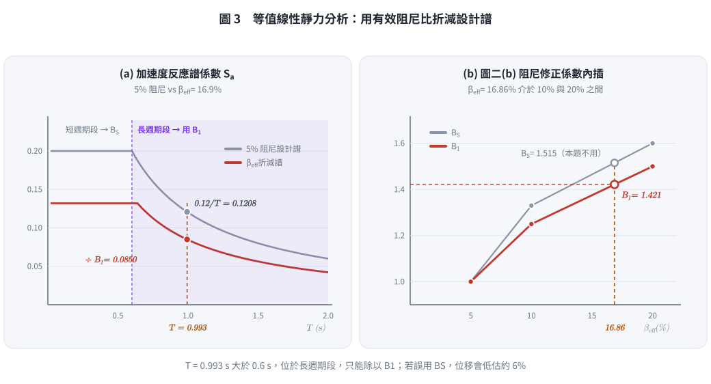
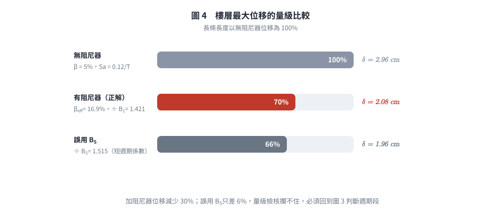

# SD-2012-2｜SDOF + 對角斜撐黏滯阻尼器：等值線性靜力分析求最大位移

## 題目資訊

| 欄位 | 內容 |
|------|------|
| 題號 | SD-2012-2 |
| 考年 | 2012（民國101年） |
| 科目分類 | SD-U3-2（隔減震原理） |
| 副分類 | SD-U1-3（單自由度系統動態分析） |
| 關鍵詞 | 黏滯阻尼器、對角斜撐、有效阻尼比、等值線性靜力分析法、阻尼修正係數、能量法 |
| verificationStatus | `unverified` |

---

## 題目敘述

單層剪力屋架（圖二a）：

| 參數 | 數值 |
|-----|------|
| 側向勁度 k | 8×10⁴ N/m |
| 樓層質量 m | 2000 kg |
| 結構阻尼比 ξ₀ | 5% |
| 阻尼器阻尼係數 c | 4×10³ N·s/m（沿斜撐軸向） |
| 斜撐與水平向夾角 θ | 30° |

假設：
1. 與黏滯消能元件相接之斜撐勁度夠大，可忽略其軸向變形（即斜撐無額外彈性變形，全部位移轉化為阻尼器變形）
2. 承受與第一題相同之地震（Sa = 0.12/T for T ≥ 0.6 s）

提示：
$$\beta_{eff} = \beta + \frac{\sum W_{Vj} + \sum W_{Fi}}{4\pi W_k}, \quad W_{Vj} = \frac{2\pi^2}{T} C_j \delta_{rj}^2$$

圖二(b)有效阻尼比 vs 阻尼修正係數：

| 有效阻尼比(%) | Bs | B₁ |
|---|---|---|
| <2 | 0.80 | 0.80 |
| 5 | 1.00 | 1.00 |
| 10 | 1.33 | 1.25 |
| 20 | 1.60 | 1.50 |

求：等值線性靜力分析法計算樓層相對地面最大位移（cm）

---

## 解題步驟

### 步驟一：結構自然週期

阻尼器為純速度型（黏滯），不增加結構勁度，故：

$$T = 2\pi\sqrt{\frac{m}{k}} = 2\pi\sqrt{\frac{2000}{8 \times 10^4}} = 2\pi\sqrt{\frac{1}{40}} = \frac{\pi}{\sqrt{10}} \approx 0.993 \text{ sec}$$

T = 0.993 sec > 0.6 sec → 位於反應譜**速度敏感區**（長週期段），使用 B₁。

---

### 步驟二：斜撐黏滯阻尼器的等值阻尼貢獻

**對角斜撐幾何分析（θ = 30°）：**

設樓層水平位移振幅為 δ，則：
- 斜撐軸向變形（阻尼器變形）：$\delta_d = \delta \cos\theta = \delta \cos 30° = \frac{\sqrt{3}}{2}\delta$
- 水平速度 $\dot\delta$，軸向速度：$\dot\delta_d = \dot\delta \cos 30°$

*圖 1　左為題目圖二(a) 的向量重繪；右為樓層側移 $\delta$ 時斜撐端點的位移分解。$\cos^2\theta$ 的兩個 $\cos\theta$ 一個來自運動學（阻尼器伸長 $\delta\cos\theta$）、一個來自力的投影（軸力回到水平向），能攔下「只乘一次 $\cos\theta$」或誤用 $\sin\theta$ 的錯誤。*

**能量法推導有效阻尼：**

阻尼器每週期消能（WVj）：

$$W_{Vj} = \frac{2\pi^2}{T} C_j \delta_{rj}^2 = \frac{2\pi^2}{T} \cdot c \cdot (\delta\cos\theta)^2 = \frac{2\pi^2}{T} \cdot c \cdot \delta^2 \cos^2\theta$$

結構最大應變能（Wk）：

$$W_k = \frac{1}{2} k \delta^2$$

等值有效阻尼比（注意 δ² 消去，與位移振幅無關）：

$$\beta_{eff} = \beta_0 + \frac{W_{Vj}}{4\pi W_k} = 0.05 + \frac{\frac{2\pi^2}{T} \cdot c \cdot \delta^2 \cos^2\theta}{4\pi \cdot \frac{1}{2} k \delta^2}$$

$$= 0.05 + \frac{\pi \cdot c \cdot \cos^2\theta}{T \cdot k}$$

代入數值（$\cos^2 30° = \dfrac{3}{4}$）：

$$\beta_{eff} = 0.05 + \frac{\pi \times 4000 \times \frac{3}{4}}{0.993 \times 80000} = 0.05 + \frac{3000\pi}{79440}$$

$$= 0.05 + \frac{9424.8}{79440} = 0.05 + 0.1186 = 0.1686$$

$$\boxed{\beta_{eff} \approx 16.86\%}$$

> **物理意義：** 結構阻尼 5% 與阻尼器貢獻 11.86% 合計 16.86%。等值阻尼比與位移振幅 δ 無關，符合線性黏滯阻尼器之特性。

*圖 2　阻尼器力–位移橢圓的面積是每週期消能 $W_V$，彈簧三角形面積是最大應變能 $W_k=\tfrac12 k\delta^2$（比例為真）。能攔下 $W_k$ 漏掉 $\tfrac12$（$\Delta\beta$ 少一半）的錯誤，也看得出兩者都正比於 $\delta^2$，故 $\beta_{eff}$ 與振幅無關。*

---

### 步驟三：查表插值求 B₁

βeff = 16.86%，介於 10% 和 20% 之間，線性內插：

$$B_1 = 1.25 + \frac{16.86 - 10}{20 - 10} \times (1.50 - 1.25) = 1.25 + \frac{6.86}{10} \times 0.25 = 1.25 + 0.172 = 1.422$$

$$\boxed{B_1 \approx 1.422}$$

---

### 步驟四：修正後之設計地震力（等值線性靜力分析法）

原 5% 阻尼反應譜加速度係數（T = 0.993 s > 0.6 s）：

$$S_a(T, 5\%) = \frac{0.12}{0.993} = 0.1208$$

有效阻尼下修正反應譜（以 B₁ 折減）：

$$S_{a,eff} = \frac{S_a(T, 5\%)}{B_1} = \frac{0.1208}{1.422} = 0.08495$$

*圖 3　左為 5% 設計譜與 $\beta_{eff}$ 折減譜，$T$ 落在 $T>0.6$ s 的長週期段；右為圖二(b) 的線性內插。能攔下「誤用 $B_S$」與「週期段判斷錯誤」——這兩個錯誤只讓答案差約 6%，靠量級檢核抓不到。*

等值彈性地震力：

$$F_{eff} = S_{a,eff} \times m \times g = 0.08495 \times 2000 \times 9.81 = 1667 \text{ N}$$

---

### 步驟五：最大相對位移

$$\delta_{max} = \frac{F_{eff}}{k} = \frac{1667}{80000} = 0.02084 \text{ m}$$

$$\boxed{\delta_{max} \approx 2.08 \text{ cm}}$$

驗核（以譜位移公式）：
$$S_d = S_{a,eff} \cdot \frac{T^2}{4\pi^2} \cdot g = 0.08495 \times \frac{0.993^2}{39.478} \times 9.81 = 0.08495 \times 0.02498 \times 9.81 = 0.02082 \text{ m} \approx 2.08 \text{ cm} \checkmark$$

---

## 計算彙整

| 步驟 | 參數 | 數值 |
|-----|-----|------|
| 1 | 自然週期 T | 0.993 sec |
| 2 | 結構阻尼 β₀ | 5% |
| 2 | 阻尼器等值阻尼貢獻 Δβ = πc cos²θ/(Tk) | 11.86% |
| 2 | **有效阻尼 βeff** | **16.86%** |
| 3 | 阻尼修正係數 B₁（內插） | 1.422 |
| 4 | Sa(T, 5%) = 0.12/T | 0.1208 |
| 4 | Sa,eff = Sa/B₁ | 0.08495 |
| 4 | 等值地震力 Feff | 1,667 N |
| 5 | **最大相對位移 δmax** | **≈ 2.08 cm** |

**減震效益比較：**

| | 無阻尼器（ξ=5%） | 有阻尼器（ξeff=16.86%） |
|--|---|---|
| Sa | 0.1208 | 0.08495 |
| Feff (N) | 2,370 | 1,667 |
| δmax (cm) | **2.96** | **2.08** |
| 位移折減率 | — | **−30%** |

*圖 4　加阻尼器後位移應落在無阻尼器的六到八成之間；若算出比無阻尼器還大、或只剩一兩成，表示 $\beta_{eff}$ 或修正係數算錯。誤用 $B_S$ 的結果與正解差距很小，須回到圖 3 判斷。*

---

## 解題關鍵觀念

### 1. 斜撐幾何：角度 θ 對阻尼效能的影響

對角阻尼器的**有效水平阻尼係數** = c × cos²θ：

| θ（°） | cos²θ | 有效比例 |
|--------|-------|--------|
| 0（水平） | 1.000 | 100%（最大效能） |
| 30 | 0.750 | 75% |
| 45 | 0.500 | 50% |
| 60 | 0.250 | 25% |

**本題 θ = 30°：有效阻尼係數 = c × 3/4 = 3000 N·s/m**

### 2. 等值黏滯阻尼比公式的物理意義

$\beta_{eff} = \beta_0 + \dfrac{W_{Vj}}{4\pi W_k}$ 來自「等效黏滯阻尼」的定義：

- 線性黏滯阻尼 ξ 之每週期消能：$W_{diss} = 4\pi \xi W_k$
- 因此：$\xi_d = W_{Vj}/(4\pi W_k)$

關鍵特性：**βeff 與振幅 δ 無關**（δ² 在分子分母消去），使得等值線性分析在設計過程中可獨立於位移大小。

### 3. Bs vs B₁ 的選用

| 修正係數 | 適用週期段 | 規範週期分界點 |
|--------|--------|-----------|
| Bs | 短週期段（加速度敏感區）T < Tc | Tc = 0.6 sec（本題） |
| B₁ | 長週期段（速度敏感區）T > Tc | — |

本題 T = 0.993 s > 0.6 s，**使用 B₁**。

### 4. 常見陷阱

- ❌ **未投影斜撐角度**：以 c 直接代入公式，忽略 cos²θ 的折減
- ❌ **混用 Bs/B₁**：T > 0.6 s 應用 B₁，不應用 Bs
- ❌ **誤認斜撐增加結構勁度**：純黏滯阻尼器不增加勁度，T 不改變
- ❌ **漏乘 g**：Sa 為無因次加速度係數，彈性力 = Sa × m × g

---

*解析日期：2026-08-22　｜　正確性複核＋圖解補繪：2026-10-05（向量圖，腳本 `gen_SD-2012-2.py`，可重跑）*
