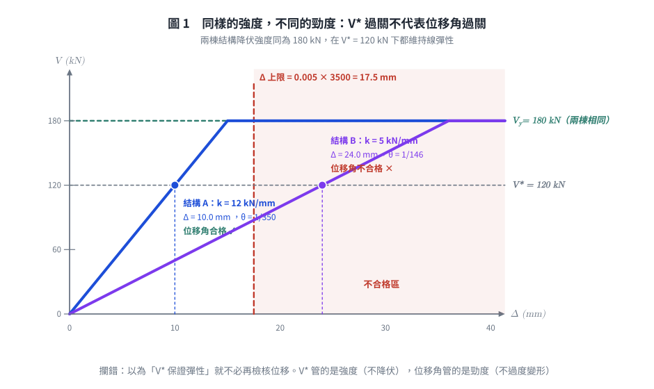
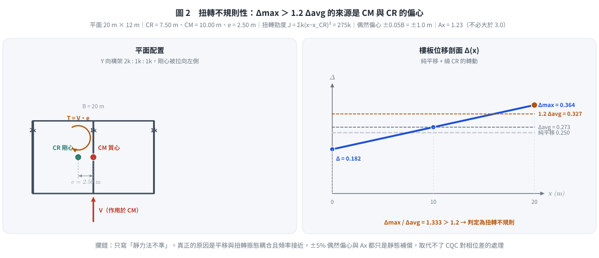

# 考題編號：SD-2012-3

**主分類：** `SD-U2-2` 建築耐震設計規範
**副分類：** `SD-U2-1` 地震力之設計規範
**分析方法：** 概念題（規範論述）
**標籤：** `層間相對側向位移角` `0.005` `中小度地震` `V*` `強度與勁度` `非結構構件` `P-Δ效應` `鄰棟碰撞` `扭轉不規則性` `質量中心` `剛心` `偶然偏心` `扭矩放大係數Ax` `靜力分析缺點` `動力分析必要性` `平移扭轉耦合`

---

## 1. 原始題目重述 (Problem Restatement)

本題為純文字概念題，無附圖。

**題幹：** 請回答下列有關耐震設計規範中的相關問題：

**(一)（10 分）** 若結構依「避免中小度地震降伏之設計地震力 $V^*$」設計時，依規範原意，結構於中小度地震作用下應可維持在線彈性狀態，但何以規範規定需再作「層間相對側向位移角之檢核」？請說明之。

**(二)（10 分）** 何謂扭轉不規則性結構？若以靜力分析來進行其耐震設計時，可能會有那些缺點？

**題目背景補充（作答時用得到）：**

$$V^* = \frac{I\,F_u}{4.2\,\alpha_y}\left(\frac{S_{aD}}{F_u}\right)_m W \quad\text{（一般工址；臺北盆地為 } 3.5\alpha_y\text{）}$$

中小度地震為**回歸期約 30 年**（50 年超越機率約 80%）之地震，規範對此水準的性能要求是
「結構體保持在彈性限度內」，即三水準耐震設計中的**小震不壞**。
$V^*$ 式中 $F_u$ 在分子分母相消，代表**中小度地震不容許動用韌性折減**。

---

## 2. 考題核心精神與出題者意圖 (Core Concepts & Examiner's Intent)

**核心觀念：**

1. **強度檢核與勁度檢核是兩回事。** $V^*$ 是強度規定（保證不降伏），層間位移角是勁度規定（保證不過度變形）。滿足其一不蘊含滿足另一。
2. **扭轉不規則的本質是平移–扭轉耦合的動力行為**，而靜力法只能以「一組固定的側力＋一個固定的偶然偏心」去近似它。

**出題者意圖：**

- 子題(一)刻意設下一個看似矛盾的前提（「都已經彈性了，還檢核什麼？」），測驗考生是否理解耐震設計除了**生命安全**還有**使用性（serviceability）** 與**穩定性（P-Δ）** 兩條獨立戰線。
- 子題(二)測驗能否從「振態耦合」的角度說明靜力法失效，而不是只答「靜力法比較不準」。

**兩題共同的深層考點：** 規範的每一條檢核都對應一個**它自己無法涵蓋的失效模式**。

---

## 3. 解題戰略地圖與陷阱分析 (Strategic Roadmap & Trap Analysis)

**作戰計畫：**

```
子題(一)
  Step 1  先破題：V* 管「強度」，位移角管「勁度」，兩者獨立
  Step 2  再分層舉出位移過大的三類後果：
            非結構構件損壞（使用性）→ P-Δ（穩定性）→ 鄰棟碰撞（相鄰安全）
  Step 3  補一刀：週期以經驗公式估算本有誤差，位移須另行直接檢核
  Step 4  收尾給規範數值：0.005

子題(二)
  Step 1  定義：Δmax > 1.2 Δavg（剛性樓板、同層兩端）
  Step 2  成因：CM 與 CR 偏心
  Step 3  靜力法四項缺點（耦合振態／偶然偏心不足／相位／遠端構件低估）
  Step 4  收尾：故規範要求做三維動力分析
```

**關鍵陷阱：**

| # | 陷阱 | 正確處理 |
|---|------|---------|
| ★★★ | 子題(一)答成「因為分析有近似，所以要驗算」 | 太模糊。必須點出**強度 ≠ 勁度**這個本質，再展開三類後果 |
| ★★★ | 把位移角限值背成 $1/400$ 或「設計地震下 0.01」 | 我國規範 2.16.1 明定**不得超過 0.005**（＝ $1/200$），且檢核的是**中小度地震**下的層間位移角 |
| ★★ | 子題(二)只寫「靜力法不準」而不說明**為何對扭轉不規則特別不準** | 要扣住「靜力法無法表現平移振態與扭轉振態的相位差」 |
| ★★ | 混淆「扭轉不規則」與其他平面不規則（凹角、樓板開孔、非平行系統） | 扭轉不規則有明確的 1.2 倍量化門檻，其餘各有各的定義 |
| ★ | 把偶然偏心 $\pm 5\%$ 誤記為 $\pm 10\%$ 或誤以為只需單側 | 規範：質心**向左及向右**各偏移垂直於地震力方向尺度的 5%，兩側都要算 |

---

## 3.5 變數層次分析 (Variable Hierarchy Analysis)

> 複習提示：第一次解題後，在每個卡住的知識點旁標記 `⚠`；第二次複習時只看有 `⚠` 的項目。

### 最終目標

說明 (一) 為何「已保證彈性」仍須檢核層間位移角；(二) 扭轉不規則性的定義與靜力分析的缺點。

### 本題關鍵公式（依論述順序）

$$\theta_i = \frac{\Delta_i}{h_i} \le 0.005 \quad\text{（規範 2.16.1，中小度地震下之層間相對側向位移角）}$$

$$\Delta_{max} > 1.2\,\Delta_{avg} = 1.2 \times \frac{\Delta_A + \Delta_B}{2} \quad\text{（扭轉不規則性判準）}$$

$$e = x_{CM} - x_{CR} \quad\text{（靜態偏心距）}\qquad e_a = \pm 0.05\,L \quad\text{（偶然偏心）}$$

$$A_x = \left(\frac{\delta_{max}}{1.2\,\delta_{avg}}\right)^2 \le 3.0 \quad\text{（扭矩放大係數，扭轉不規則時放大意外扭矩）}$$

$$\theta_{P\text{-}\Delta} = \frac{P_x \Delta}{V_x h_{sx}} \quad\text{（穩定係數，量化二階效應嚴重程度）}$$

### L1：題目直接給定

| 概念 | 內容 |
|------|------|
| 設計前提 | 結構依 $V^*$ 設計，於中小度地震下應維持線彈性 |
| 待答一 | 為何仍需檢核層間相對側向位移角 |
| 待答二 | 扭轉不規則性之定義；靜力分析之缺點 |

### L2：需知識點推導

**① 位移角檢核的四個理由**

| 理由 | 公式／來源 | 卡關? |
|------|-----------|-------|
| 強度 ≠ 勁度 | $V^*$ 保證 $V \le V_y$；位移由 $\Delta = V/k$ 決定，$k$ 不足時 $\Delta$ 仍可過大 | |
| 非結構構件保護 | 隔間牆、帷幕、管線的容許變形遠小於結構構件 | |
| P-Δ 二階效應 | $\theta_{P\text{-}\Delta} = P_x\Delta/(V_x h_{sx})$，過大則側向失穩 | |
| 鄰棟碰撞 | 位移須小於與鄰棟之分隔距離 | |
| 規範限值 | 規範 2.16.1：$\Delta/h \le 0.005$ | |

**② 扭轉不規則的量化與處理**

| 符號 | 公式／來源 | 卡關? |
|------|-----------|-------|
| $\Delta_{avg}$ | $(\Delta_A+\Delta_B)/2$，同層兩最外端之平均 | |
| 判準 | $\Delta_{max} > 1.2\Delta_{avg}$ | |
| $e$ | $x_{CM}-x_{CR}$，質心與剛心偏心距 | |
| $e_a$ | $\pm 0.05L$（$L$ 為垂直於地震力方向之樓面尺度） | |
| $A_x$ | $(\delta_{max}/1.2\delta_{avg})^2 \le 3.0$ | |

### L3：深層知識（不懂就卡住）

| 知識點 | 說明 | 卡關? |
|--------|------|-------|
| 強度與勁度的獨立性 | $V_y = $ 強度、$k = $ 勁度。$\Delta = V^*/k$：兩棟強度相同的結構，勁度差一倍，位移就差一倍 | |
| 中小度地震的性能定位 | 回歸期約 30 年，建築物一生會遇到；此水準要求「不壞且可繼續使用」，故使用性（位移）比強度更關鍵 | |
| 週期估算誤差的方向 | 經驗式 $T_a$ 偏小 → $S_{aD}$ 偏大 → $V^*$ 偏保守（強度夠），但**真實位移仍由真實週期決定**，強度保守不代表位移保守 | |
| 平移–扭轉耦合 | CM 與 CR 不重合時，$[K]$ 的平移與轉動自由度耦合，振態本身就是「平移＋扭轉」的混合體，無法拆開處理 | |
| 相位差（本題最深的一點） | 平移振態與扭轉振態的最大值**不同時發生**；SRSS／CQC 以機率方式處理，靜力法只能代數相加或忽略，兩種做法都不對 | |

---

## 4. 步驟化詳細計算過程 (Step-by-Step Detailed Calculation)

> 本題為概念論述題，以文字與公式對照取代數值計算。

### (一) 中小度地震下維持線彈性，為何仍需檢核層間相對側向位移角（10 分）

#### 破題：$V^*$ 管「強度」，位移角管「勁度」

$$V^*\ \text{保證}\ V \le V_y\ \text{（不降伏）} \qquad\text{但}\qquad \Delta = \frac{V^*}{k}\ \text{的大小由}\ k\ \text{決定}$$

依 $V^*$ 設計，只保證構材的**內力**不超過降伏強度；至於結構被推多遠，取決於側向**勁度** $k$。
兩棟強度相同但勁度差一倍的結構，在同一地震下的層間位移差一倍，而兩者都「維持線彈性」。

$$\boxed{\text{強度與勁度是兩個獨立的工程指標，滿足其一不蘊含滿足其二}}$$

這就是為什麼規範在強度規定（$V^*$）之外，還要獨立訂一條位移規定。以下四個理由說明「彈性但變形過大」為何仍不可接受。

---

#### 理由一：非結構構件的保護與使用性（最常考）

規範所謂「維持線彈性」指的是**結構構件**（梁、柱、牆）不降伏；但建築物的價值與功能大量寄託在非結構系統上，而它們對**變形**而非對「力」敏感：

| 非結構系統 | 過大層間位移的後果 |
|-----------|------------------|
| 輕隔間、磚牆 | 斜向裂縫、粉刷剝落 |
| 玻璃帷幕牆 | 玻璃破裂墜落（人員傷亡風險） |
| 天花板、燈具 | 掉落 |
| 管線、電梯導軌 | 接頭破壞、電梯無法運轉 → 建築功能中斷 |

中小度地震在建築 50 年壽命中**大概會遇到一兩次**（回歸期約 30 年），
規範對此水準的期待是「震後可立即繼續使用」。
若每次中小地震都造成隔間開裂、帷幕破損，即使結構完好，社會成本仍不可接受。

---

#### 理由二：P-Δ（幾何非線性、二階）效應

層間位移過大時，重力 $P$ 作用在已側移 $\Delta$ 的結構上，產生附加傾覆彎矩：

$$M_{2nd} = P\cdot\Delta \qquad\Longrightarrow\qquad \theta_{P\text{-}\Delta} = \frac{P_x\,\Delta}{V_x\,h_{sx}}$$

- 材料雖仍彈性，但**幾何**已非線性：實際需求大於一階線性分析的預測
- $\theta$ 過大時，結構的有效側向勁度被重力「吃掉」，極端情況導致側向失穩（重力倒塌）
- 限制 $\Delta/h$ 等於間接把 $\theta_{P\text{-}\Delta}$ 壓在可接受範圍內

---

#### 理由三：鄰棟碰撞（Pounding）

台灣市區建築多為連棟或緊鄰。層間位移角管制使結構的側向變形不超過與鄰棟的分隔距離，
避免中小地震時樓板撞擊鄰棟樓層（樓板撞柱身是最危險的型式，可能造成柱剪力破壞）。
這是純粹的變形問題，強度檢核完全管不到。

---

#### 理由四：$V^*$ 本身的估算誤差不會傳遞成位移的保守

- $V^*$ 以等效靜力法計算，基本週期常以經驗公式 $T_a$ 估算
- 經驗式一般給出**偏小**的 $T$ → $S_{aD}$ 偏大 → $V^*$ 偏大 → **強度設計偏保守**
- 但結構的真實振動位移是由**真實週期與真實勁度**決定的，並不會因為 $V^*$ 取得保守而變小

$$\text{強度保守} \nRightarrow \text{位移保守}$$

因此規範要求以位移直接檢核，補上等效靜力法在「變形預測」上的不足。

---

#### 規範限值

$$\boxed{\theta = \frac{\Delta}{h} \le 0.005 \quad (=1/200)}$$

依《建築物耐震設計規範及解說》2.16.1：每一樓層與其上、下鄰層之相對側向位移除以層高，其值不得超過 **0.005**。

---



*圖 1　兩棟降伏強度完全相同的結構，只因勁度差 2.4 倍，一棟位移角合格、一棟不合格。它攔的是本子題的核心誤解：以為「$V^*$ 保證彈性」就不必再檢核位移——$V^*$ 管強度，位移角管勁度。*

#### 結論（作答要點）

> 層間位移角檢核的目的不在確認「強度」，而在確認「勁度」。$V^*$ 只保證中小度地震下構材不降伏，
> 但一個彈性卻柔軟的結構仍可能：(1) 損壞非結構構件、中斷使用機能；(2) 因 P-Δ 效應放大需求乃至側向失穩；
> (3) 與鄰棟碰撞。且 $V^*$ 取得保守並不會使位移變小。
> 故規範以 $\Delta/h \le 0.005$ 作為與強度規定並列、且獨立的第二道檢核——**強度確保不降伏，勁度確保不過度變形，兩者缺一不可**。

---

### (二) 扭轉不規則性結構之定義與靜力分析之缺點（10 分）

#### 定義

**扭轉不規則性（Torsional Irregularity）：** 樓板具剛性隔板時，在考慮方向施加側力（含偶然偏心）後，
同一樓層兩端之**最大**層間側向位移超過該層兩端**平均**層間側向位移的 1.2 倍：

$$\boxed{\Delta_{max} > 1.2\,\Delta_{avg} = 1.2 \times \frac{\Delta_A + \Delta_B}{2}}$$

（$A$、$B$ 為該樓層在垂直於受力方向上的兩個最外端點。ASCE 7 另訂 1.4 倍為「極端扭轉不規則」。）

#### 成因

- **質量中心 CM 與剛心 CR 之偏心距 $e = x_{CM}-x_{CR}$ 顯著**（最根本原因）
- 側力抵抗系統配置不對稱（如剪力牆偏置於一側、核心筒偏心）
- 平面形狀不規則（L 形、U 形、T 形、大開口）
- 立面上各層 CR 位置漂移，使扭轉沿高度累積

#### 物理現象

即使側力通過質心且為純平移力，因 $e \ne 0$，該力對剛心產生扭矩 $T = V\cdot e$，
結構同時發生平移與繞 CR 的轉動：

$$\delta_j = \underbrace{\delta_{trans}}_{\text{平移}} + \underbrace{\theta \cdot r_j}_{\text{扭轉}}$$

離 CR 愈遠的構材（典型為角柱）位移與內力愈大，$r_j$ 大的一端可能遠超平均值。

---

#### 靜力分析的缺點

**缺點一：無法表現平移–扭轉耦合的振態（最核心）**

- 等效靜力法以「單一平移振態」為基礎，只施加一組沿樓高分布的**平移**側力
- 扭轉不規則結構的振態本身就是平移與扭轉的**混合體**（$[K]$ 的平移與轉動自由度耦合），
  且往往有多個振態同時具有顯著的扭轉分量
- 靜力法把扭轉當成「平移解算完之後外加的一個修正扭矩」，而非結構固有的振動型式，
  本質上就無法反映耦合行為

**缺點二：偶然偏心 $\pm 5\%$ 不足以代表真實的動力扭轉放大**

- 規範靜力分析規定：將地震力加在質心**向左及向右**偏移「垂直於地震力方向尺度的 5%」之位置
- 這個 $\pm 5\%$ 是為**規則結構**的施工誤差、質量分布不確定性所設定的
- 對本身已有顯著 $e$ 的扭轉不規則結構，動力扭轉放大遠超過 5% 偶然偏心所能代表的範圍
- 規範因此另規定：具扭轉不規則性時，各層意外扭矩須乘以扭矩放大係數

$$A_x = \left(\frac{\delta_{max}}{1.2\,\delta_{avg}}\right)^2 \,,\qquad A_x \ \text{不必大於}\ 3.0$$

  但 $A_x$ 只是對**意外扭矩**的靜態補償，仍非動力解

**缺點三：無法反映平移與扭轉的相位差**

- 動力反應中，平移振態與扭轉振態的最大值**不會同時發生**（相位不同步）
- 反應譜法以 SRSS／CQC 依機率組合各振態；CQC 更能處理頻率接近時的相關性
  （扭轉不規則結構的平移與扭轉振態頻率往往很接近，$\rho_{jk}$ 不可忽略，**必須用 CQC 而非 SRSS**）
- 靜力法只能代數相加（過度保守）或直接忽略（不保守），兩者都無法給出正確答案

**缺點四：遠離剛心之構材（角柱）設計需求嚴重低估**

- 角柱同時承受兩個方向的平移＋扭轉位移，是扭轉不規則結構最早破壞的構材
- 靜力法即使加上 $e_a$ 與 $A_x$，仍是以「單一等效側力分布」推算，
  無法反映各樓層扭轉角沿高度的變化（上層扭轉角常遠大於下層）
- 結果：角柱設計剪力與彎矩偏低，實際地震中先行破壞，並可能觸發整體扭轉失穩

**缺點五：沿高度的扭轉角分布無法掌握**

靜力法的側力分布固定為 $\propto w_i h_i$，隱含各層扭轉行為一致；
但實際上扭轉振態的形狀可能在某幾層特別放大（尤其配合立面不規則時），
靜力法對此完全無法呈現。

---

#### 結論（作答要點）

> 扭轉不規則性指剛性樓板下，同層兩端最大層間位移超過平均值 1.2 倍，其成因為質心與剛心顯著偏心。
> 此類結構的地震反應是**平移與扭轉耦合的動力行為**，而靜力分析的缺點在於：
> (1) 只施加單一平移側力，無法表現耦合振態；
> (2) $\pm 5\%$ 偶然偏心與 $A_x$ 僅為靜態補償，不足以代表動力扭轉放大；
> (3) 無法處理平移與扭轉振態的相位差（兩者頻率接近時尤須以 CQC 組合）；
> (4) 嚴重低估遠離剛心之角柱設計需求，且無法掌握扭轉角沿高度的分布。
> 故規範規定扭轉不規則結構應進行三維動力分析。

---



*圖 2　由構架勁度配置算出剛心位置、偏心距與兩端位移，$\Delta_{max}/\Delta_{avg} = 1.333 > 1.2$ 即判定為扭轉不規則。它攔的是只寫「靜力法不準」而說不出所以然：$\pm 5\%$ 偶然偏心與 $A_x$ 都只是靜態補償，取代不了 CQC 對平移與扭轉振態相位差的處理。*

## 5. 關鍵爭議點與進階探討 (Critical Issues & Advanced Discussion)

### 5.1 兩個子題其實是同一個命題的兩面

規範的每一條附加檢核，都對應一個**主檢核涵蓋不到的失效模式**：

| 主檢核 | 涵蓋不到的東西 | 規範的補丁 |
|--------|--------------|-----------|
| $V^*$（強度） | 勁度不足導致的變形問題 | 層間位移角 $\le 0.005$ |
| 等效靜力法（單一平移振態） | 平移–扭轉耦合 | 扭轉不規則時須做動力分析 |

看出這個共同結構，兩題都能答得有層次，而不是零散地背條文。

### 5.2 為何扭轉不規則要用 CQC 而非 SRSS

SRSS 的前提是各振態頻率**相差夠遠**（一般要求相差 10% 以上）。
扭轉不規則結構的第一平移振態與第一扭轉振態頻率常非常接近（$r = \omega_j/\omega_k \to 1$），
此時相關係數 $\rho_{jk} \to 1$，SRSS 會顯著**低估**反應。
CQC 的相關係數

$$\rho_{jk} = \frac{8\xi^2(1+r)r^{3/2}}{(1-r^2)^2+4\xi^2 r(1+r)^2}$$

在 $r \to 1$ 時趨近 1，正確地把兩個振態的貢獻加起來。
**「扭轉不規則 → 頻率接近 → 必須用 CQC」是一條完整的因果鏈**，寫進答案很加分。

### 5.3 常見失分

- ❌ (一) 答「因為設計時用了近似法，需要驗核」→ 太模糊，未點出「勁度 ≠ 強度」的本質
- ❌ (一) 把限值寫成 $1/400$，或誤以為檢核的是設計地震下的位移
- ❌ (二) 只說「靜力法不準確」，未說明**為什麼對扭轉不規則結構特別不準確**
- ❌ (二) 混淆「扭轉不規則性」與其他平面不規則（凹角、樓板開孔、非平行系統）
- ❌ (二) 只寫定義與成因，漏掉「相位差」這個最有鑑別度的缺點

### 5.4 答題要點清單（各 10 分，時間有限時的最低配）

**(一)** 至少點到 3 點：① 強度 ≠ 勁度（最根本）② 非結構構件保護與使用性（最常考）③ P-Δ 效應；並給出限值 0.005。

**(二)** 定義（$\Delta_{max} > 1.2\Delta_{avg}$，需給公式或明確文字）＋ 成因（CM–CR 偏心）＋ 靜力法缺點至少 3 項（耦合振態、偶然偏心不足、相位差／角柱低估）。

---

*圖解補繪：2026-09-02（向量圖，由 `gen_SD-2012-3.py` 產生，可重跑；SVG 供 wiki／PDF，2× PNG 供簡報與影片管線）*
