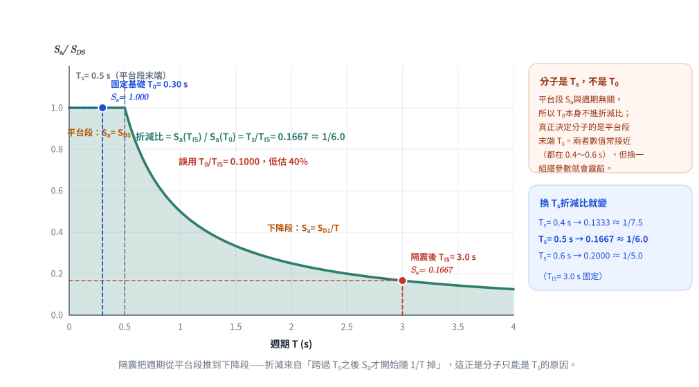
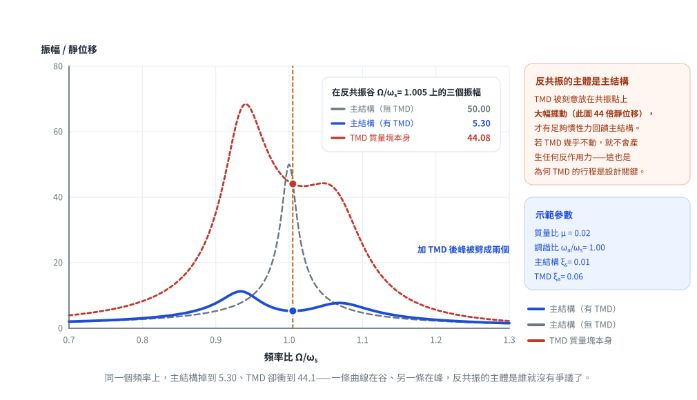
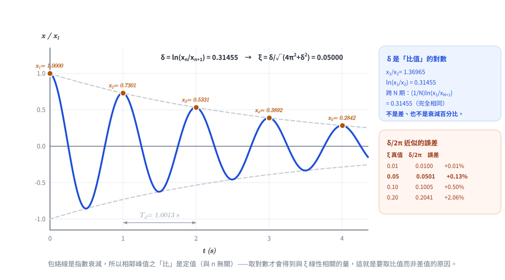

# 考題編號：SD-2013-1

**主分類：** `SD-U3-2` 隔減震原理
**副分類：** `SD-U1-1` 結構動力基本性質及原理
**分析方法：** 概念題（隔震 + TMD + Pushover + 對數衰減率）
**標籤：** `基礎隔震` `隔震原理` `延長週期` `TMD` `調諧質量塊阻尼器` `動力吸振器` `側推分析` `Pushover` `容量譜法` `ADRS` `自由振動` `對數衰減率` `阻尼比推估` `黏滯阻尼比`

---

## 1. 原始題目重述 (Problem Restatement)

**題(一)（10分）：**
在建築結構底部加設隔震設施（Isolator）可以有效減少此建築結構在地震時之**內力反應**之主要原因。

**題(二)（10分）：**
在高樓結構上層加設調諧質量塊阻尼器（Tuned Mass Damper）可以有效增加此建築結構在颱風時**舒適性**之基本原理。

**題(三)（10分）：**
以**側推分析方法（Push-over Method）**配合地震反應譜可以有效評估既有建築結構耐震能力之**基本假設**及**分析步驟**。

**題(四)（10分）：**
以建築結構**自由振動反應的衰減數據**，可以有效推估此建築結構之**黏滯性阻尼比（Viscous-damping Ratio）**之基本原理。

---

## 2. 考題核心精神與出題者意圖 (Core Concepts & Examiner's Intent)

**核心觀念：**
- 題(一)：隔震 → 延長週期 → 脫離地震高能頻段 → 慣性力大幅降低
- 題(二)：TMD → 動力吸振原理 → 反相抑制共振 → 降低結構加速度反應
- 題(三)：Pushover → 第一振態假設 → 能力譜法 → 找「性能點」
- 題(四)：對數衰減率 → 兩振動峰值比值 → 直接推估阻尼比

**出題者意圖：**
本題廣泛考察「結構動力學 + 耐震設計」四大核心概念，每題 10 分、論述為主，考驗考生對物理原理的理解深度（而非套公式），需說明**原理機制**而非僅列結果。

---

## 3. 解題戰略地圖與陷阱分析 (Strategic Roadmap & Trap Analysis)

**題(一)陷阱：**
不能只說「延長週期」——必須解釋：延長週期後，設計反應譜中加速度 $S_a$ 在長週期段顯著降低，慣性力 $F = m \cdot S_a$ 因此減小，內力才減小。要串聯「週期→譜加速度→慣性力→內力」的因果鏈。

**題(二)陷阱：**
「舒適性」取決於**加速度**（非位移）。TMD 抑制共振，降低頂層加速度反應，是原理核心。不能只說「吸振」，要說「反相力」抑制主結構運動的機制。

**題(三)陷阱：**
基本假設必須包含「第一振態主導」和「振態形狀固定（不隨變形改變）」兩條。分析步驟需包含「能力譜轉換（ADRS 格式）→ 需求譜→ 性能點」，而非只說「做非線性分析」。

**題(四)陷阱：**
對數衰減率 $\delta$ 是**相鄰兩峰值「比值」的自然對數** $\ln(x_n/x_{n+1})$——不是兩峰值的差，也不是衰減百分比。需寫出推導過程（欠阻尼自由振動解 → 相鄰峰值比 → 取對數 → 連結阻尼比 $\xi$）。

---

## 3.5 變數層次分析 (Variable Hierarchy Analysis)

### 最終目標
四個子題均為論述，不需數字計算；最終目標是用清晰的物理邏輯說明各機制。

### 題(四)核心公式（唯一有公式推導的子題）

$$x(t) = e^{-\xi\omega_0 t}\left[A\cos(\omega_d t) + B\sin(\omega_d t)\right]$$

$$\delta = \ln\frac{x_n}{x_{n+1}} = \frac{2\pi\xi}{\sqrt{1-\xi^2}}$$

$$\boxed{\xi = \frac{\delta}{\sqrt{4\pi^2 + \delta^2}} \approx \frac{\delta}{2\pi} \quad (\text{輕阻尼})}$$

### L3：深層知識

| 知識點 | 說明 | 卡關? |
|--------|------|-------|
| 設計反應譜形狀 | 長週期段 $S_a = S_{D1}/T$，週期越長加速度越小 | |
| TMD 抗共振機制 | 主質量-副質量構成「動力吸振器」；副質量在共振時產生與主質量反相的力 | |
| 能力譜法 ADRS | 將 Pushover 曲線的 V-δ 轉換為 $S_a$-$S_d$ 與反應譜疊圖，找交點 | |
| 欠阻尼自由振動 | 峰值包絡線為 $e^{-\xi\omega_0 t}$；相鄰峰值間隔為有阻尼週期 $T_d = 2\pi/\omega_d$ | |

---

## 4. 步驟化詳細計算過程（論述題）

---

### 題(一)（10分）：隔震設施減少內力反應的主要原因

隔震設施（如鉛心橡膠支承 LRB、摩擦單擺系統 FPS）的工作原理可從以下三個層面說明：

---

**一、延長結構自然週期，脫離地震能量主要頻段**

一般固定基礎建築的自然週期 $T_0$ 通常為 0.1～1.5 秒，正好落在地震設計反應譜的**高加速度段**（短週期平坦段或上升段）。

加設隔震層後，整體系統的等效週期 $T_{IS}$ 延長至 2～4 秒：

$$T_{IS} = 2\pi\sqrt{\frac{W}{g \cdot K_{eff}}}$$

此長週期段對應的設計譜加速度：

$$S_a(T) = \frac{S_{D1}}{T} \quad (T > T_s)$$

$T_{IS}$ 越大，$S_a$ 越小。

> ⚠ **不可直接用 $T_0/T_{IS}$ 相除。** $S_a \propto 1/T$ 只在反應譜的**下降段**（$T > T_s$）成立；
> 一般固定基礎建築的 $T_0$ 多半還落在**平台段**，該段 $S_a = S_{DS}$ 是定值、與週期無關。
> 正確的折減比應以平台段末端 $T_s$ 為分界：
>
> $$\frac{S_a(T_{IS})}{S_a(T_0)} = \frac{S_{D1}/T_{IS}}{S_{DS}} = \frac{T_s}{T_{IS}} \qquad (T_0 \le T_s < T_{IS})$$
>
> 以 $T_s = 0.5$ s、$T_{IS} = 3$ s 為例，$S_a$ 降為原來的 $0.5/3 \approx 1/6$；
> 若 $T_s = 0.4$ s 則為 $1/7.5$。**分子是 $T_s$，不是原結構週期 $T_0$**——
> 兩者數值上常接近（都在 0.4～0.6 s），但物理意義完全不同，換一組譜參數就會露餡。

*圖 1　隔震折減的來源。$T_0$ 落在**平台段**（$S_a$ 與週期無關），所以折減比的分子只能是平台段末端 $T_s$；圖右列出 $T_s$ 取 0.4／0.5／0.6 s 時折減比如何跟著變，證明它確實是 $T_s$ 在決定。*

---

**二、地震慣性力大幅降低，各樓層內力顯著減小**

樓層慣性力：

$$F = m \cdot S_a(T_{IS})$$

$S_a$ 減小後，傳入上部結構的慣性力同比例降低，梁柱的彎矩、剪力及軸力均大幅下降。上部結構在地震中接近**剛體運動**——各樓層幾乎同步位移，層間位移趨近零，內力自然極小。

---

**三、隔震層集中消能，保護上部結構**

隔震器（尤其是含鉛心的 LRB）具有顯著的遲滯阻尼，可在隔震層消散大部分地震能量：

$$W_D = 4n F_y (1-\alpha)(D_D - F_y/k_o)$$

上部結構只需承受已大幅衰減後的地震力，無需進入彈塑性狀態即可確保安全，內力反應大幅降低。

---

**結論：**

$$\boxed{\text{隔震主因：延長週期} \Rightarrow S_a \downarrow \Rightarrow F = mS_a \downarrow \Rightarrow \text{內力反應大幅降低}}$$

---

### 題(二)（10分）：TMD 增加颱風時舒適性的基本原理

**何謂「舒適性」？**

建築舒適性由頂層水平**加速度**決定（而非位移）。常用的居住性評估標準（ISO 6897、ISO 10137、AIJ 等）以尖峰或 RMS 加速度訂門檻，量級約在 $5 \sim 25$ milli-g（$0.005 \sim 0.025g$），且隨用途（住宅嚴於辦公）與重現期（常用 1 年或 10 年風）而異。風力在結構自然頻率附近激振時形成共振，此時頂層加速度最大，居住者有不適感。

---

**TMD 的動力吸振原理**

TMD 由附加質量 $m_a$、彈簧 $k_a$、阻尼 $c_a$ 組成，安裝於結構頂部。

其自然頻率調諧至主結構自然頻率：

$$\omega_a = \sqrt{k_a/m_a} \approx \omega_0$$

當主結構受風力激振（頻率 $\Omega \approx \omega_0$）產生共振位移 $x_s(t)$ 時：

1. TMD 因調諧而**自身處於共振**，質量塊產生遠大於主結構的振幅——這正是它能發揮作用的前提
2. TMD 質量塊的位移與**激振力**約差 $180^\circ$（完美調諧的無阻尼理想情況下恰為反相）
3. TMD 透過彈簧與阻尼器對主結構施加反作用力 $f_{TMD}(t) = -m_a\ddot{x}_a(t)$，方向與風力相反
4. 此反向力抵消外部風力，使**主結構**落入**反共振（anti-resonance）**——原共振頻率處的反應趨近於零
5. 加入實際阻尼後反共振不再是完全的零點，但共振峰被壓低並劈裂成兩個小峰，等效上大幅提高主結構的等效阻尼比

> ⚠ **反共振的主體是「主結構」，不是 TMD。** TMD 是被刻意放在共振點上大幅擺動，才有足夠的
> 慣性力回饋主結構；若寫成「TMD 處於反共振（幾乎不動）」，整個機制就講反了——不動的質量塊
> 不會產生任何反作用力。這也解釋了為何 TMD 的**行程（stroke）**是設計上的關鍵限制。

*圖 2　同一個頻率上，主結構掉到 5.30、TMD 卻衝到 44.08——**一條曲線在谷、另一條在峰**。反共振的主體是誰，看兩條曲線就沒有爭議；也順帶說明了為何 TMD 的行程是設計上的硬限制。*

---

**數學機制（以無阻尼主結構 + 無阻尼 TMD 為例）**

在完美調諧（$\omega_a = \omega_0$）且激振頻率 $\Omega = \omega_0$ 的條件下，主結構的穩態位移趨近於零：

$$x_s \to 0 \quad (\Omega = \omega_0, \omega_a = \omega_0, \text{無阻尼理想情況})$$

引入實際阻尼後，共振峰被**劈裂為兩個較小的峰值**（雙峰現象），主結構在原共振頻率的加速度反應大幅下降。實務上典型的加速度折減約 **30%～50%**，實際幅度取決於質量比 $\mu$、調諧精度與 TMD 本身的阻尼——$\mu$ 越大效果越好，但 TMD 的重量與行程需求也同步增加。

---

**結論：**

$$\boxed{\text{TMD 原理：調諧共振 → 反相慣性力 → 抑制主結構共振 → 頂層加速度} \downarrow \text{ → 舒適性} \uparrow}$$

適用於**風力激振（窄頻穩態）**，因風力激振頻率固定、持續，TMD 調諧效果最佳；地震（寬頻、短時）效果相對較有限。

---

### 題(三)（10分）：Pushover 配合反應譜評估耐震能力

#### 基本假設

**假設一：第一振態主導（First-mode Dominance）**

結構的地震反應主要由第一（基本）振態控制，其餘高階振態的貢獻可忽略。此假設對**規則、低矮建築**（層數 < 10 層）最為合理；對高層或不規則結構則有較大誤差。

**假設二：振態形狀在非線性過程中保持固定（Invariant Load Pattern）**

側向力分布型式（如倒三角形、第一振態形狀）在結構從彈性進入彈塑性的全過程中維持不變。此假設忽略了塑性鉸形成後荷載重新分配的效應。

**假設三：等效 SDOF 可代表 MDOF 結構**

多自由度結構可等效為等效單自由度（ESDOF）系統，且其行為特性（週期、阻尼、非線性特性）與 MDOF 一致。

---

#### 分析步驟（能力譜法 — ATC-40/FEMA 440）

**步驟一：建立非線性結構模型**
建立含材料非線性（塑性鉸）的有限元素或桿件模型，定義各構材的力-變形關係（含降伏強度、後降伏剛度、極限旋轉角）。

**步驟二：施加遞增側向力，繪製 Pushover 曲線（V-δ）**
在結構上按選定的側力分布型式（第一振態或倒三角形）施加遞增水平力，計算每一增量步的基底剪力 $V$ 與屋頂位移 $\delta$，直至結構達崩潰機制（倒塌）。

**步驟三：將 V-δ 曲線轉換為能力譜（$S_a$-$S_d$ 格式，即 ADRS 格式）**

$$S_a = \frac{V / W}{\alpha_1} \quad , \quad S_d = \frac{\delta}{PF_1 \cdot \phi_{1,\text{roof}}}$$

其中 $\alpha_1$ 為第一振態有效質量比，$PF_1$ 為模態參與因子，$\phi_{1,\text{roof}}$ 為屋頂振態分量。

**步驟四：建立需求譜（$S_a$-$S_d$ 格式）**
將設計反應譜（對應不同阻尼比 $\xi$ = 5%, 10%, 20%...）轉換為 ADRS 格式：

$$S_d = \frac{T^2}{4\pi^2}\,S_a\,g \qquad (S_a \text{ 以 } g \text{ 的倍數表示時})$$

> ⚠ **單位陷阱：** 規範反應譜的 $S_a$ 慣例上以 $g$ 的倍數給出（無因次），此時必須乘回
> $g = 9.81$ m/s² 才能得到長度單位的 $S_d$；漏掉 $g$ 會使位移需求小 9.81 倍，性能點整個跑掉。
> 若 $S_a$ 已是 m/s²，則直接用 $S_d = T^2 S_a/(4\pi^2)$。

高阻尼的需求譜對應較小的加速度與位移需求。

**步驟五：求「性能點」（Performance Point）**

能力譜與需求譜的**交點**即為性能點（$S_{a,\text{perf}}$，$S_{d,\text{perf}}$）。在此點，結構的能力（$V$、$\delta$）等於地震需求——即結構能承受此地震而不倒塌。

（由於結構進入非線性後等效阻尼比增加，需求譜應調整至與結構等效阻尼比對應的譜；此過程需迭代求收斂。）

**步驟六：評估構材變形需求**

由性能點的屋頂位移 $\delta_{\text{perf}}$ 還原至各樓層位移及各構材（梁柱塑性鉸）的旋轉角，與容許極限（如 IO、LS、CP 性能水準）比較，評估耐震性能是否滿足目標。

---

$$\boxed{\text{Pushover 核心：第一振態假設 → 能力譜 ADRS → 交叉需求譜 → 性能點 → 驗核構材變形}}$$

---

### 題(四)（10分）：自由振動衰減數據推估黏滯性阻尼比

#### 基本原理

欠阻尼（$\xi < 1$）SDOF 系統在初始擾動後的**自由振動解**：

$$x(t) = e^{-\xi\omega_0 t}\left[A\cos(\omega_d t) + B\sin(\omega_d t)\right]$$

其中：
- $\omega_0 = \sqrt{k/m}$：無阻尼自然頻率
- $\omega_d = \omega_0\sqrt{1-\xi^2}$：有阻尼自然頻率（$\approx \omega_0$ 對輕阻尼）
- 振幅**包絡線**：$x_{\max}(t) \propto e^{-\xi\omega_0 t}$（指數衰減）

---

#### 對數衰減率（Logarithmic Decrement）

設第 $n$ 次振動峰值為 $x_n$，經過一個有阻尼週期 $T_d = 2\pi/\omega_d$ 後，第 $n+1$ 次峰值為 $x_{n+1}$：

$$\frac{x_n}{x_{n+1}} = \frac{e^{-\xi\omega_0 t_n}}{e^{-\xi\omega_0(t_n + T_d)}} = e^{\xi\omega_0 T_d} = e^{\xi\omega_0 \cdot 2\pi/\omega_d} = \exp\!\left(\frac{2\pi\xi}{\sqrt{1-\xi^2}}\right)$$

定義**對數衰減率**（logarithmic decrement）：

$$\delta = \ln\frac{x_n}{x_{n+1}} = \frac{2\pi\xi}{\sqrt{1-\xi^2}}$$

---

#### 推導阻尼比

由上式解出 $\xi$：

$$\xi = \frac{\delta}{\sqrt{4\pi^2 + \delta^2}}$$

**輕阻尼近似**（$\xi < 0.2$，$\delta \ll 2\pi$）：

$$\boxed{\xi \approx \frac{\delta}{2\pi}}$$

---

#### 實務操作步驟

1. **施加擾動**：對建築結構施加初始位移或速度（如拉繩法、強迫激振後停機），使其自由振動
2. **量測振動歷時**：以加速度計（或位移感測器）記錄自由振動時程 $x(t)$
3. **讀取峰值**：從時程中讀取多個連續振動峰值 $x_1, x_2, \ldots, x_{N+1}$
4. **計算對數衰減率**（跨多個週期以提高精度）：

$$\delta = \frac{1}{N}\ln\frac{x_1}{x_{N+1}}$$

5. **換算阻尼比**：

$$\xi = \frac{\delta}{\sqrt{4\pi^2 + \delta^2}} \approx \frac{\delta}{2\pi}$$

---

**為何能有效推估？**

此方法直接從結構的**實際動力行為**（而非理論模型）萃取阻尼比，結合了所有阻尼機制（黏滯性阻尼、材料阻尼、節點接觸等）的綜合效果，因此比理論假設更能反映真實結構的動力特性。

> ⚠ **推得的是「等效」黏滯阻尼比。** 真實消能包含摩擦、開裂等**非黏滯**機制，對數衰減率只是把它們
> 全部折算成一個等效的黏滯值。後果是**識別值隨振幅而變**（振幅越大越高，與 [[SD-2006-1]] 子題(二)
> 「地震識別阻尼比 ＞ 微動識別值」的結論同源），因此引用時務必連同量測振幅一併記錄。
> 另外，若各峰值比值不一致（$\ln(x_n/x_{n+1})$ 隨 $n$ 系統性變化），代表阻尼並非線性黏滯，
> 此時跨 $N$ 個週期取平均只是折衷，不能宣稱結構就是等黏滯阻尼系統。

對建築結構，典型阻尼比：
- RC 結構：$\xi \approx 3\%\sim5\%$
- 鋼結構：$\xi \approx 1\%\sim2\%$

---

$$\boxed{\delta = \frac{1}{N}\ln\frac{x_1}{x_{N+1}} \approx 2\pi\xi \quad \Rightarrow \quad \xi \approx \frac{\delta}{2\pi}}$$

*圖 3　包絡線是指數衰減，所以相鄰峰值之**比**是與 $n$ 無關的定值——取對數才會得到與 $\xi$ 線性相關的量。圖右的誤差表顯示 $\delta/2\pi$ 在 $\xi = 0.20$ 時已偏高 2%，這就是輕阻尼近似的適用邊界。*

---

## 5. 關鍵爭議點與進階探討 (Critical Issues & Advanced Discussion)

### 5.1 隔震對「長週期地震」的例外風險

隔震將週期延長至 2～4 秒，一般地震的高能量集中在 0.1～1.5 秒，故效果顯著。但**近斷層地震**（Near-fault）含有長週期速度脈衝（約 2～5 秒），可能使隔震建築的長週期暴露在較大能量中，導致隔震層位移過大。這是隔震設計需特別考慮近斷層效應的原因。

### 5.2 TMD 對地震的有限效果

TMD 對**窄頻穩態**激振（風力、機械振動）效果最佳，因為其調諧頻率能精確匹配激振頻率。地震屬於**寬頻隨機**短時激振，TMD 的調諧效果有限，且需要較大的質量比（$\mu = m_a/m \geq 1\%$）才能產生可觀的等效阻尼增量。

### 5.3 Pushover 的適用範圍

ATC-40 建議 Pushover 法最適用於：
- 第一振態參與質量 ≥ 70% 的低層建築（通常 ≤ 10 層）
- 平面、立面規則的結構

對高層建築、不規則結構，高階振態效應顯著，應改用非線性時間歷時分析（NLTHA）。

### 5.4 考場答題建議

- 題(一)～(四)各 10 分，每題 3～4 個清晰論點即可
- 題(三)是本題組最難的，分步驟寫（假設 + 步驟）最安全
- 題(四)如能寫出 $\delta = \ln(x_n/x_{n+1}) = 2\pi\xi/\sqrt{1-\xi^2}$ 並說明推導邏輯，即可拿滿分

---

## 6. 附圖清單 (Figure List)

| 檔案 | 內容 | 狀態 |
|------|------|------|
| （本題為論述題，無附圖） | — | — |

**verificationStatus:** `unverified`
**verifiedSolution:** （待人工驗算後填入）

> **驗證狀態備註：** 2026-08-22 稽核。題(四)的對數衰減率推導（$\delta = 2\pi\xi/\sqrt{1-\xi^2}$、
> $\xi = \delta/\sqrt{4\pi^2+\delta^2}$、$\delta = \frac{1}{N}\ln(x_1/x_{N+1})$）與題(三)的 ATC-40
> 能力譜轉換式（$S_a = (V/W)/\alpha_1$、$S_d = \delta_{roof}/(PF_1\phi_{1,roof})$）經復算**均正確**，
> 題(一)的隔震消能式 $W_D = 4nF_y(1-\alpha)(D_D - F_y/k_o)$ 亦與雙線性遲滯迴圈面積相符。
> 本次修正：① 題(二)「TMD 本身處於反共振」為觀念錯置（反共振的主體是主結構），已改寫並補說明；
> ② 題(一) 以 $T_0/T_{IS}$ 直接相除的推理誤把 $1/T$ 下降段關係套用到平台段，已改為以 $T_s$ 為分界；
> ③ 題(三) ADRS 轉換式 $S_d = T^2S_a/4\pi^2$ 漏乘 $g$，已補上並加註單位陷阱；
> ④ 題(二) 加速度折減幅度由「50%～80%」修正為「30%～50%（視 $\mu$ 而定）」；
> ⑤ 舒適性門檻的標準引用與量級改為區間表述；⑥ 題(四) 補上「等效黏滯阻尼比」與振幅相依的限制。
> 驗證狀態維持 `unverified`，待人工重新驗算。

---

*圖解補繪：2026-08-22（向量圖 3 張，腳本 `gen_SD-2013-1.py`，所有數值由解題結果算出，可重跑）*
