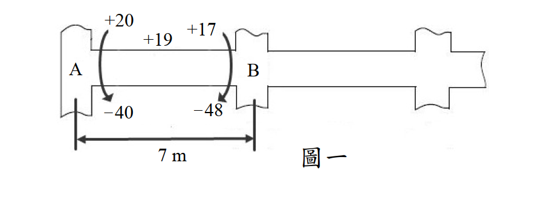

# 考題編號：SD-2013-2

**主分類：** `SD-U3-1` 結構耐震設計（含RC結構與鋼結構）
**副分類：** `SD-U2-2` 建築耐震設計規範
**分析方法：** 耐震梁設計（彎矩鋼筋 + 容量設計法剪力箍筋）
**標籤：** `RC耐震設計` `特殊抗彎矩構架` `梁彎矩鋼筋` `正鋼筋比例要求` `容量設計法` `剪力設計` `Vc=0` `Mpr` `推算剪力` `耐震箍筋間距` `塑鉸區` `約束箍筋`

---

## 1. 原始題目重述 (Problem Restatement)

**AB 大梁設計資料（來自地震反應分析）：**

| 位置 | +M（Tf-m） | −M（Tf-m） |
|------|-----------|-----------|
| A 端 | +20 | −40 |
| 跨中 | +19 | — |
| B 端 | +17 | −48 |

**載重與幾何：**
- 跨長 L = 7 m（中心至中心）
- 均勻靜載重 WD = 2.7 Tf/m，活載重 WL = 1.4 Tf/m
- 梁：b = 40 cm，h = 60 cm，d = 53 cm，d' = 7 cm
- 柱：b = 60 cm，h = 60 cm（方柱）
- 材料：fc' = 280 kgf/cm²，fy = 4200 kgf/cm²

*圖說：AB 梁彎矩包絡圖。A端最大負彎矩 40 Tf-m（地震 A 端控制），最大正彎矩 20 Tf-m；B端最大負彎矩 48 Tf-m，最大正彎矩 17 Tf-m；跨中最大正彎矩 19 Tf-m。梁尺寸 40×60cm，d=53cm，柱 60×60cm。*

**題(一)（10分）：** 設計此大梁之正、負彎矩鋼筋。
**題(二)（10分）：** 設計此大梁之剪力箍筋。

---

## 2. 考題核心精神與出題者意圖 (Core Concepts & Examiner's Intent)

**核心觀念：**
- 這是一道 RC 特殊抗彎矩構架（SMRF）梁的完整耐震設計題
- 題(一)重點：計算 As 後，必須套用**耐震規定**（正筋 ≥ 50% 負筋）
- 題(二)重點：必須用**容量設計法（Capacity Design）**推算剪力，而非單純使用分析剪力

**出題者意圖：**
測驗考生是否理解「耐震設計」和「一般設計」的差異——尤其是正鋼筋比例要求（防止單向失效）和容量設計剪力（以破壞機制推算極限剪力）。

---

## 3. 解題戰略地圖與陷阱分析 (Strategic Roadmap & Trap Analysis)

**主要陷阱：**

1. **正鋼筋未考慮耐震 50% 規定**：B端正鋼筋由分析彎矩算出 8.82 cm²，但耐震規定要求 ≥ 0.5×27.0 = 13.5 cm²，兩者差距巨大。

2. **剪力設計未用容量設計法**：直接用分析剪力設計箍筋是錯誤的；必須用 Mpr（probable moment strength）推算最大可能剪力。

3. **Vc 的取值**：當地震誘發剪力 Ve ≥ 0.5×Vu 時，Vc = 0——此情況在耐震梁中很常見，需要全靠箍筋承擔剪力。

4. **塑鉸區間距加密**：耐震規定在距支承面 2h 範圍內必須加密箍筋，間距 ≤ min(d/4, 8×主筋徑, 24×箍筋徑, 30 cm)。

---

## 3.5 變數層次分析 (Variable Hierarchy Analysis)

### 最終目標

**題(一)：** 各控制截面的 As（cm²），並確認耐震正鋼筋比例要求
**題(二)：** 箍筋間距 s（cm），分別針對塑鉸區與跨中區

### 本題關鍵公式

$$R_n = \frac{M_u}{\phi b d^2} \quad \Rightarrow \quad \rho = \frac{0.85 f_c'}{f_y}\left[1 - \sqrt{1 - \frac{2R_n}{0.85f_c'}}\right] \quad \Rightarrow \quad A_s = \rho \cdot b \cdot d$$

$$A_{s,+} \geq \frac{1}{2} A_{s,-} \quad \text{（耐震正鋼筋規定）}$$

$$M_{pr} = A_s \cdot 1.25 f_y \cdot \left(d - \frac{a'}{2}\right), \quad a' = \frac{A_s \cdot 1.25 f_y}{0.85 f_c' b}$$

$$V_e = \frac{M_{pr,A} + M_{pr,B}}{L_n} \quad \Rightarrow \quad V_u = V_e + \frac{w_u L_n}{2}$$

$$\text{若 } \frac{V_e}{V_u} \geq 0.5 \Rightarrow V_c = 0 \quad \Rightarrow \quad s \leq \frac{\phi A_v f_y d}{V_u}$$

### L1：題目直接給定

| 符號 | 數值 | 說明 |
|------|------|------|
| b | 40 cm | 梁寬 |
| h | 60 cm | 梁高 |
| d | 53 cm | 有效深度 |
| d' | 7 cm | 壓力鋼筋保護層 |
| fc' | 280 kgf/cm² | 混凝土強度 |
| fy | 4200 kgf/cm² | 鋼筋降伏強度 |
| L | 7 m | 中心跨長 |
| WD | 2.7 Tf/m | 靜載重 |
| WL | 1.4 Tf/m | 活載重 |
| φ_flexure | 0.9 | 彎矩折減係數 |
| φ_shear | 0.75 | 剪力折減係數 |

### L2：需計算的中間值

| 符號 | 公式 | 卡關? |
|------|------|-------|
| β₁ | 0.85（fc' = 280 kgf/cm²） | |
| As,min | max(14/fy, 0.8√fc'/fy)×b×d = 7.07 cm² | |
| As,max（耐震） | 0.025×b×d = 53 cm² | |
| Ln | L - h_col = 700 - 60 = 640 cm | |
| wu | 1.2WD + 1.0WL = 4.64 Tf/m | |
| 0.85fc'b | 0.85×280×40 = 9,520 kgf/cm | |

---

## 4. 步驟化詳細計算過程

### 題(一)（10分）：彎矩鋼筋設計

**設計方法（疊代法）：**

$$A_s = \frac{M_u}{\phi f_y (d - a/2)}, \quad a = \frac{A_s f_y}{0.85 f_c' b} = \frac{A_s \times 4200}{9520}$$

---

#### Step 1：最小鋼筋量

$$A_{s,\min} = \max\!\left(\frac{14}{f_y},\; \frac{0.8\sqrt{f_c'}}{f_y}\right) \times b \times d$$

$$= \max\!\left(\frac{14}{4200},\; \frac{0.8 \times 16.73}{4200}\right) \times 40 \times 53 = \max(0.00333,\; 0.00319) \times 2120$$

$$\boxed{A_{s,\min} = 7.07 \text{ cm}^2}$$

---

#### Step 2：A端 負彎矩（Mu = 40 Tf-m = 4,000,000 kgf-cm）

試 a₁ = 10 cm：
$$A_s = \frac{4{,}000{,}000}{0.9 \times 4200 \times (53 - 5)} = \frac{4{,}000{,}000}{181{,}440} = 22.05 \text{ cm}^2$$
$$a = \frac{22.05 \times 4200}{9520} = 9.73 \text{ cm}$$

疊代 a₂ = 9.73 cm：
$$A_s = \frac{4{,}000{,}000}{0.9 \times 4200 \times (53 - 4.87)} = \frac{4{,}000{,}000}{181{,}927} = 21.98 \text{ cm}^2$$
$$a = \frac{21.98 \times 4200}{9520} = 9.70 \text{ cm} \approx 9.73 \text{ cm} \quad \checkmark$$

$$\boxed{A_{s,A-} = 21.98 \text{ cm}^2}$$

**驗證 ε_t（確保拉力控制，φ = 0.9）：**
$$c = a/\beta_1 = 9.70/0.85 = 11.41 \text{ cm}, \quad \varepsilon_t = 0.003 \times \frac{53 - 11.41}{11.41} = 0.0109 > 0.005 \; \checkmark$$

---

#### Step 3：B端 負彎矩（Mu = 48 Tf-m = 4,800,000 kgf-cm）

試 a₁ = 12 cm：
$$A_s = \frac{4{,}800{,}000}{0.9 \times 4200 \times (53 - 6)} = \frac{4{,}800{,}000}{177{,}660} = 27.02 \text{ cm}^2$$
$$a = \frac{27.02 \times 4200}{9520} = 11.92 \text{ cm}$$

疊代 a₂ = 11.92 cm：
$$A_s = \frac{4{,}800{,}000}{0.9 \times 4200 \times (53 - 5.96)} = \frac{4{,}800{,}000}{177{,}811} = 26.99 \text{ cm}^2$$
$$a = 11.91 \text{ cm} \approx 11.92 \; \checkmark$$

$$\boxed{A_{s,B-} = 27.0 \text{ cm}^2}$$

---

#### Step 4：跨中 正彎矩（Mu = 19 Tf-m = 1,900,000 kgf-cm）

$$A_s \approx \frac{1{,}900{,}000}{0.9 \times 4200 \times (53 - 2.2)} = \frac{1{,}900{,}000}{191{,}800} = 9.90 \text{ cm}^2 \quad \checkmark$$

$$\boxed{A_{s,\text{mid}+} = 9.90 \text{ cm}^2}$$

---

#### Step 5：A端 正彎矩（Mu = 20 Tf-m = 2,000,000 kgf-cm）

$$A_s \approx \frac{2{,}000{,}000}{0.9 \times 4200 \times (53 - 2.3)} = \frac{2{,}000{,}000}{191{,}600} = 10.44 \text{ cm}^2$$

**耐震正鋼筋規定（特殊抗彎矩框架梁）：**
$$A_{s,A+} \geq \frac{1}{2} A_{s,A-} = \frac{1}{2} \times 21.98 = 10.99 \text{ cm}^2$$

由分析需求 10.44 < 10.99 → **由耐震規定控制**

$$\boxed{A_{s,A+} = 10.99 \text{ cm}^2}$$

---

#### Step 6：B端 正彎矩（Mu = 17 Tf-m = 1,700,000 kgf-cm）

$$A_s \approx \frac{1{,}700{,}000}{0.9 \times 4200 \times (53 - 1.9)} = \frac{1{,}700{,}000}{193{,}100} = 8.81 \text{ cm}^2$$

**耐震正鋼筋規定：**
$$A_{s,B+} \geq \frac{1}{2} A_{s,B-} = \frac{1}{2} \times 27.0 = 13.5 \text{ cm}^2$$

由分析需求 8.81 << 13.5 → **由耐震規定強烈控制**

$$\boxed{A_{s,B+} = 13.5 \text{ cm}^2}$$

---

#### 彎矩鋼筋設計匯總

| 位置 | 方向 | Mu (Tf-m) | As,計算 (cm²) | As,耐震規定 (cm²) | **As,設計 (cm²)** |
|------|------|-----------|--------------|-----------------|----------------|
| A端 | 負筋（頂部） | 40 | 21.98 | — | **21.98** |
| A端 | 正筋（底部） | 20 | 10.44 | ≥10.99 | **10.99** |
| 跨中 | 正筋（底部） | 19 | 9.90 | ≥7.07 (Asmin) | **9.90** |
| B端 | 正筋（底部） | 17 | 8.81 | ≥13.50 | **13.50** |
| B端 | 負筋（頂部） | 48 | 27.0 | — | **27.0** |

> 驗核：各截面 As > As_min = 7.07 cm²✓；各截面 ρ < 0.025（As_max = 53 cm²）✓

---

### 題(二)（10分）：剪力箍筋設計

#### Step 1：計算可能彎矩強度（Mpr，1.25fy，φ=1.0）

設計剪力採**容量設計法**，以構材極限彎矩強度（Mpr）推算最大可能剪力，防止剪力脆性破壞發生在彎矩降伏之前。

$$M_{pr} = A_s \cdot 1.25 f_y \cdot \left(d - \frac{a'}{2}\right), \quad a' = \frac{1.25 A_s f_y}{0.85 f_c' b} = \frac{1.25 A_s \times 4200}{9520}$$

| 截面 | As (cm²) | a' (cm) | Mpr (Tf-m) |
|------|---------|---------|-----------|
| A端 負（頂部受拉） | 21.98 | 12.12 | $21.98 \times 5250 \times (53-6.06) / 10^5 =$ **54.17** |
| A端 正（底部受拉） | 10.99 | 6.06 | $10.99 \times 5250 \times (53-3.03) / 10^5 =$ **28.83** |
| B端 負（頂部受拉） | 27.0 | 14.89 | $27.0 \times 5250 \times (53-7.45) / 10^5 =$ **64.57** |
| B端 正（底部受拉） | 13.5 | 7.45 | $13.5 \times 5250 \times (53-3.72) / 10^5 =$ **34.93** |

> 計算說明（以 B端負為例）：
> $a' = 27.0 \times 1.25 \times 4200 / 9520 = 14.89 \text{ cm}$
> $M_{pr,B-} = 27.0 \times 5250 \times (53 - 7.445) / 100{,}000 = 64.57 \text{ Tf-m}$

---

#### Step 2：推算設計剪力 Vu（容量設計法）

**淨跨度：**
$$L_n = 700 - 60 = 640 \text{ cm} = 6.40 \text{ m}$$

**地震誘發剪力（兩種地震方向）：**

地震方向1（向右搖擺：A端負、B端正）：
$$V_{e,1} = \frac{M_{pr,A-} + M_{pr,B+}}{L_n} = \frac{54.17 + 34.93}{6.40} = \frac{89.10}{6.40} = 13.92 \text{ Tf}$$

地震方向2（向左搖擺：A端正、B端負）：
$$V_{e,2} = \frac{M_{pr,A+} + M_{pr,B-}}{L_n} = \frac{28.83 + 64.57}{6.40} = \frac{93.40}{6.40} = 14.59 \text{ Tf} \quad \leftarrow \text{控制}$$

**重力荷載剪力：**
$$w_u = 1.2 W_D + 1.0 W_L = 1.2 \times 2.7 + 1.0 \times 1.4 = 4.64 \text{ Tf/m}$$
$$V_g = \frac{w_u L_n}{2} = \frac{4.64 \times 6.40}{2} = 14.85 \text{ Tf}$$

**最大設計剪力（於支承面）：**
$$V_u = V_{e,2} + V_g = 14.59 + 14.85 = 29.44 \text{ Tf（於 B 端面控制）}$$

**臨界截面（距支承面 d = 53 cm）之設計剪力：**
$$V_u = 29.44 - w_u \times d = 29.44 - 4.64 \times 0.53 = 29.44 - 2.46 = \mathbf{26.98 \text{ Tf}}$$

---

#### Step 3：判斷 Vc 是否為零

$$\frac{V_e}{V_u} = \frac{14.59}{26.98} = 0.541 > 0.5$$

**→ 依耐震規範：$V_c = 0$（地震誘發剪力占設計剪力超過 50%）**

全部剪力由箍筋承擔。

---

#### Step 4：設計箍筋

使用 **D13 兩肢箍（2-leg D13）**：
$$A_v = 2 \times 1.267 = 2.534 \text{ cm}^2$$

**需要箍筋間距（由剪力控制）：**
$$\phi V_s = \phi \cdot \frac{A_v f_y d}{s} \geq V_u$$
$$s \leq \frac{\phi A_v f_y d}{V_u} = \frac{0.75 \times 2.534 \times 4200 \times 53}{26{,}980} = \frac{422{,}676}{26{,}980} = 15.7 \text{ cm}$$

---

#### Step 5：耐震箍筋間距規定

**塑鉸區（seismic hoop zone）範圍：** 距支承面 $2h = 2 \times 60 = 120 \text{ cm}$

塑鉸區最大間距（取最小值）：
$$s_{\max} = \min\!\left(\frac{d}{4},\; 8 d_{b,\text{long}},\; 24 d_{b,\text{hoop}},\; 30 \text{ cm}\right)$$

假設主筋採用 D25（$d_b = 25 \text{ mm}$）：
$$s_{\max} = \min\!\left(\frac{53}{4},\; 8 \times 2.5,\; 24 \times 1.3,\; 30\right) = \min(13.25,\; 20,\; 31.2,\; 30) = 13.25 \text{ cm}$$

由剪力需求 s ≤ 15.7 cm，但耐震間距 ≤ 13.25 cm → **塑鉸區耐震間距控制**

$$\boxed{s_{\text{plastic hinge}} = 13 \text{ cm}}$$

驗核：
$$\phi V_s = 0.75 \times \frac{2.534 \times 4200 \times 53}{13} = 0.75 \times \frac{563{,}562}{13} = 0.75 \times 43{,}351 = 32{,}513 \text{ kgf} = 32.5 \text{ Tf} > 26.98 \text{ Tf} \; \checkmark$$

---

#### Step 6：跨中區箍筋

**跨中（距支承面 >120 cm 區域）：**

跨中的設計剪力（地震剪力為主，重力剪力趨近於零）：
$$V_{u,\text{mid}} = V_e = 14.59 \text{ Tf} = 14{,}590 \text{ kgf}$$

$$s \leq \frac{\phi A_v f_y d}{V_u} = \frac{0.75 \times 2.534 \times 4200 \times 53}{14{,}590} = \frac{422{,}676}{14{,}590} = 28.97 \text{ cm}$$

耐震跨中最大間距：
$$s_{\max} = \min\!\left(\frac{d}{2},\; 30 \text{ cm}\right) = \min(26.5,\; 30) = 26.5 \text{ cm}$$

$$\boxed{s_{\text{middle}} = 26 \text{ cm}}$$

---

#### 剪力箍筋設計匯總

| 區域 | 範圍（距支承面） | 設計剪力 (Tf) | 箍筋規格 | 間距 |
|------|--------------|-------------|---------|------|
| 塑鉸區（兩端） | 0 ~ 120 cm | 26.98 | D13 兩肢箍 | **@13 cm** |
| 跨中區 | 120 ~ (Ln-120) cm | 14.59 | D13 兩肢箍 | **@26 cm** |

> **耐震箍筋特別規定：**
> 1. 塑鉸區箍筋採封閉式（閉合箍），彎鉤採 135°（或 135° + 直段 ≥ 10db）
> 2. 第一道箍筋距支承面不超過 5 cm
> 3. 塑鉸區箍筋兼具圍束功能（保護核心混凝土）

---

$$\boxed{\text{塑鉸區 D13 兩肢箍 @13 cm；跨中 D13 兩肢箍 @26 cm；Vc = 0（Ve/Vu = 54\%）}}$$

---

## 5. 關鍵爭議點與進階探討 (Critical Issues & Advanced Discussion)

### 5.1 正鋼筋比例規定的工程意義

耐震規範要求「正鋼筋 ≥ 負鋼筋的 50%」，其理由在於：
- 在地震雙向反覆作用下，梁端支承處可能在某一地震方向下承受正彎矩（底部受拉）
- 若正鋼筋不足，底部可能形成單方向塑鉸，造成結構不對稱失效
- 50% 規定確保兩個方向都有足夠的彎矩韌性

### 5.2 Vc = 0 的物理意義

當地震誘發剪力占總設計剪力 ≥ 50% 時，構材在反覆載重下混凝土受到往復斜向裂縫的損傷，抗剪能力顯著降低，不能再依賴 Vc（混凝土本身的抗剪能力）。因此全靠鋼筋（箍筋）承受剪力，確保韌性。

### 5.3 Mpr 中的 1.25 倍係數

1.25 倍係數來自鋼筋在應變硬化（strain hardening）後，實際降伏強度可能超過 fy，典型上限約為 1.25fy。使用 Mpr 是一種保守的容量設計做法：確保在最壞情況（梁達到最大可能強度）下，設計的箍筋仍足夠。

### 5.4 考場答題建議

- 題(一)：先列 As,min 和最大鋼筋比，再計算各截面 As，最後必須說明並套用耐震 50% 正鋼筋規定
- 題(二)：分三步：① 計算 Mpr → ② 推算 Ve 和 Vu → ③ 判斷 Vc = 0 → ④ 設計箍筋 + 耐震間距
- 容量設計法（Mpr/Ln）是得分關鍵，必須明確說明

---

## 6. 附圖清單 (Figure List)

| 檔案 | 內容 | 狀態 |
|------|------|------|
| SD-2013-2-fig-1.png | AB 梁彎矩包絡圖（含數值）| 等待使用者截圖 |

**verificationStatus:** `unverified`
**verifiedSolution:** （待人工驗算後填入）
