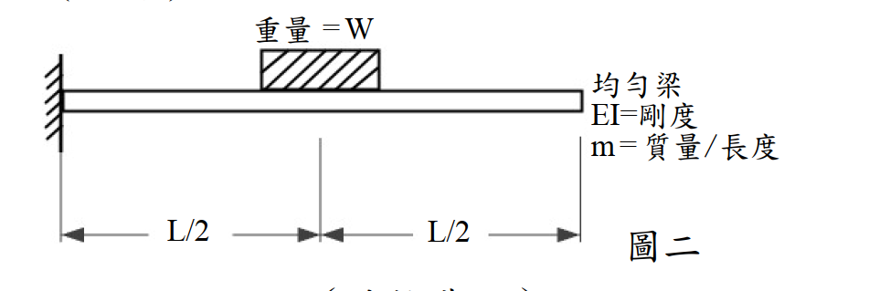

# 考題編號：SD-2013-3

**主分類：** `SD-U1-3` 單自由度、多自由度系統之動態分析及應用
**副分類：** `SD-U1-2` 運動方程式推導
**分析方法：** Rayleigh 法（均佈靜載重變形曲線為假設形函數）
**標籤：** `Rayleigh法` `懸臂梁` `分佈質量` `集中質量` `形函數` `應變能` `動能` `Rayleigh商` `基本頻率` `連續體動力學` `上界定理` `等效質量`

---

## 1. 原始題目重述 (Problem Restatement)

一均勻懸臂梁，固定端在左（x = 0），自由端在右（x = L）。梁的中點（x = L/2）附加一重量塊，重量為 W（→ 質量 = W/g）。

**系統參數：**
- 梁長：L
- 單位長度均佈質量：m（梁自重）
- 均勻撓曲剛度：EI
- 中點附加重量：W（在 x = L/2 處）

**求：** 此系統之基本振動頻率 ω

*圖說：懸臂均勻梁，長 L，EI 均勻，每單位長度質量 m；在 x = L/2 處附加集中重量 W（質量 W/g）。邊界條件：x=0 固定端（y=y'=0），x=L 自由端（M=V=0）。*

---

## 2. 考題核心精神與出題者意圖 (Core Concepts & Examiner's Intent)

**核心觀念：**
- 連續梁系統（無限自由度）需用能量法近似為等效 SDOF 系統求基本頻率
- Rayleigh 法：假設一個滿足幾何邊界條件的形函數 → 分別算最大應變能（勁度分子）與最大動能（質量分母）→ 得 Rayleigh 商作為 ω² 的上界估計

**出題者意圖：**
- 測驗 Rayleigh 法的完整推導流程
- 重點：形函數選擇、分佈質量與集中質量同時出現時的動能積分

---

## 3. 解題戰略地圖與陷阱分析 (Strategic Roadmap & Trap Analysis)

**陷阱 1：集中質量漏算**
動能分母需包含**兩項**：
$$T_{\max} \propto \int_0^L m[\varphi(x)]^2\,dx + \frac{W}{g}[\varphi(L/2)]^2$$
漏掉集中質量項是最常見的失分點。

**陷阱 2：形函數不滿足幾何邊界條件**
懸臂梁幾何邊界條件：$\varphi(0) = 0$，$\varphi'(0) = 0$
（自由端的力學邊界條件 $\varphi''(L)=0$ 盡量滿足以提高精度，但非必要）

**陷阱 3：W 是重量（force），不是質量**
集中質量 $= W/g$，代入動能時切記除以 g。

**策略：選 UDL 靜力變形曲線作為形函數**
均佈載重下懸臂梁靜力撓度曲線自動滿足所有 4 個邊界條件（含力學端條件），精度高，積分可閉合計算。

---

## 3.5 變數層次分析 (Variable Hierarchy Analysis)

### 最終目標

$$\omega = \sqrt{\frac{\displaystyle\int_0^L EI[\varphi''(x)]^2\,dx}{\displaystyle\int_0^L m[\varphi(x)]^2\,dx + \frac{W}{g}[\varphi(L/2)]^2}}$$

### 本題關鍵公式（依計算順序）

$$\varphi(x) = 6L^2x^2 - 4Lx^3 + x^4 \quad \text{（均佈靜載重撓度，省略常數）}$$

$$\varphi''(x) = 12L^2 - 24Lx + 12x^2 = 12(L-x)^2$$

$$\int_0^L EI[\varphi'']^2\,dx = 144EI\int_0^L(L-x)^4\,dx = \frac{144EIL^5}{5}$$

$$\int_0^L m[\varphi]^2\,dx = \frac{104mL^9}{45}$$

$$\varphi(L/2) = \frac{17L^4}{16} \;\Rightarrow\; \frac{W}{g}[\varphi(L/2)]^2 = \frac{289WL^8}{256g}$$

$$\boxed{\omega^2 = \frac{144EIL^5/5}{104mL^9/45 + 289WL^8/(256g)}}$$

### L1：題目直接給定

| 符號 | 說明 |
|------|------|
| L | 梁長 |
| m | 每單位長度質量 |
| EI | 均勻撓曲剛度 |
| W | 中點附加重量（質量 = W/g） |

### L3：深層知識

| 知識點 | 說明 | 卡關? |
|--------|------|-------|
| Rayleigh 法物理意義 | 振動時最大勢能 = 最大動能 → 得 ω² | |
| 形函數選擇原則 | 至少滿足幾何 BC；越接近真實振態，精度越高 | |
| UDL 懸臂梁撓度公式 | $y(x) = w(6L^2x^2 - 4Lx^3 + x^4)/(24EI)$ | |
| 連續梁動能積分 | $T = \frac{1}{2}\omega^2\int_0^L m[\varphi(x)]^2 dx$（分佈質量部分）| |

---

## 4. 步驟化詳細計算過程

### Step 1：選擇形函數（Shape Function）

取均佈靜載重 $w$ 下懸臂梁的靜力撓度曲線（省略常數 $w/(24EI)$）：

$$\varphi(x) = 6L^2x^2 - 4Lx^3 + x^4$$

**驗核邊界條件：**

| 條件 | 驗核 |
|------|------|
| $\varphi(0) = 0$ | $0$ ✓ |
| $\varphi'(0) = 12L^2(0) - 12L(0)^2 + 4(0)^3 = 0$ | ✓ |
| $\varphi''(L) = 12(L-L)^2 = 0$（自由端無彎矩）| ✓ |
| $\varphi'''(L) = -24(L-L) = 0$（自由端無剪力）| ✓ |

四個邊界條件全部滿足 → 形函數選擇良好。

---

### Step 2：計算最大應變能（分子）

$$U_{\max} = \frac{1}{2}\int_0^L EI[\varphi''(x)]^2\,dx$$

計算 $\varphi''(x)$：
$$\varphi'(x) = 12L^2x - 12Lx^2 + 4x^3$$
$$\varphi''(x) = 12L^2 - 24Lx + 12x^2 = 12(L-x)^2$$

$$[\varphi''(x)]^2 = 144(L-x)^4$$

積分：
$$\int_0^L (L-x)^4\,dx = \left[-\frac{(L-x)^5}{5}\right]_0^L = \frac{L^5}{5}$$

$$\boxed{\int_0^L EI[\varphi'']^2\,dx = 144EI \cdot \frac{L^5}{5} = \frac{144EIL^5}{5}}$$

---

### Step 3：計算最大動能分母——分佈質量部分

$$T_m = \frac{1}{2}\omega^2\int_0^L m[\varphi(x)]^2\,dx$$

展開 $[\varphi(x)]^2$：

設 $\varphi = ax^2 + bx^3 + cx^4$，其中 $a = 6L^2,\; b = -4L,\; c = 1$

$$[\varphi]^2 = a^2x^4 + 2abx^5 + (b^2+2ac)x^6 + 2bcx^7 + c^2x^8$$

代入係數：

| 項 | 係數 | $\int_0^L x^n\,dx$ | 貢獻 |
|-----|------|---------------------|------|
| $a^2 = 36L^4$ | $x^4$ | $L^5/5$ | $36L^9/5$ |
| $2ab = -48L^3$ | $x^5$ | $L^6/6$ | $-8L^9$ |
| $b^2+2ac = 28L^2$ | $x^6$ | $L^7/7$ | $4L^9$ |
| $2bc = -8L$ | $x^7$ | $L^8/8$ | $-L^9$ |
| $c^2 = 1$ | $x^8$ | $L^9/9$ | $L^9/9$ |

求和（公分母 = 45）：

$$\int_0^L [\varphi]^2\,dx = L^9\!\left(\frac{36}{5} - 8 + 4 - 1 + \frac{1}{9}\right) = L^9\!\left(\frac{324-225+5}{45}\right) = \frac{104L^9}{45}$$

$$\boxed{\int_0^L m[\varphi(x)]^2\,dx = \frac{104mL^9}{45}}$$

---

### Step 4：計算最大動能分母——集中質量部分

計算 $\varphi(L/2)$：

$$\varphi\!\left(\frac{L}{2}\right) = 6L^2\!\left(\frac{L}{2}\right)^{\!2} - 4L\!\left(\frac{L}{2}\right)^{\!3} + \left(\frac{L}{2}\right)^{\!4}$$

$$= 6L^2 \cdot \frac{L^2}{4} - 4L \cdot \frac{L^3}{8} + \frac{L^4}{16} = \frac{3L^4}{2} - \frac{L^4}{2} + \frac{L^4}{16}$$

$$= L^4\!\left(\frac{24}{16} - \frac{8}{16} + \frac{1}{16}\right) = \frac{17L^4}{16}$$

集中質量動能分母：

$$\frac{W}{g}\!\left[\varphi\!\left(\frac{L}{2}\right)\right]^{\!2} = \frac{W}{g} \cdot \left(\frac{17L^4}{16}\right)^{\!2} = \frac{289WL^8}{256g}$$

---

### Step 5：應用 Rayleigh 商，求 ω

Rayleigh 法令最大應變能 = 最大動能：

$$\frac{1}{2}\int_0^L EI[\varphi'']^2\,dx = \frac{\omega^2}{2}\!\left[\int_0^L m\varphi^2\,dx + \frac{W}{g}\varphi\!\left(\frac{L}{2}\right)^{\!2}\right]$$

$$\omega^2 = \frac{\displaystyle\int_0^L EI[\varphi'']^2\,dx}{\displaystyle\int_0^L m\varphi^2\,dx + \dfrac{W}{g}\!\left[\varphi\!\left(\dfrac{L}{2}\right)\right]^{\!2}}$$

代入各項積分結果：

$$\omega^2 = \frac{\dfrac{144EIL^5}{5}}{\dfrac{104mL^9}{45} + \dfrac{289WL^8}{256g}}$$

分子分母同除以 $L^8$，整理：

$$\boxed{\omega^2 = \frac{\dfrac{144EI}{5L^3}}{\dfrac{104mL}{45} + \dfrac{289W}{256g}}}$$

或等價寫法（乘以 $45 \times 256$）：

$$\omega^2 = \frac{331{,}776\,EIg}{L^3\!\left(26{,}624\,mgL + 13{,}005\,W\right)}$$

$$\boxed{\omega = \sqrt{\frac{331{,}776\,EIg}{L^3\!\left(26{,}624\,mgL + 13{,}005\,W\right)}}}$$

---

### 極限驗核

**當 $W \to 0$（僅分佈質量）：**

$$\omega^2 \to \frac{144EI/5}{104mL^4/45} = \frac{144 \times 45}{5 \times 104} \cdot \frac{EI}{mL^4} = \frac{6480}{520} \cdot \frac{EI}{mL^4} = 12.46\,\frac{EI}{mL^4}$$

精確值：$\omega_1^2 = 12.36\,EI/(mL^4)$（均勻懸臂梁第一振態）

**Rayleigh 法誤差 ≈ 0.8%** ✓（UDL 形函數精度極高）

**當 $mL \to 0$（僅集中質量 $W$）：**

$$\omega^2 \to \frac{144EI/(5L^3)}{289W/(256g)} = \frac{144 \times 256\,EIg}{5 \times 289\,WL^3} = \frac{36{,}864}{1445} \cdot \frac{EIg}{WL^3} \approx 25.51\,\frac{EIg}{WL^3}$$

精確值（懸臂梁 $x = L/2$ 的靜力勁度法）：
$$k = \frac{3EI}{(L/2)^3} = \frac{24EI}{L^3}, \quad \omega^2 = \frac{kg}{W} = \frac{24EIg}{WL^3}$$

**Rayleigh 法誤差 ≈ 6.3%**（UDL 形函數在此極限下略偏高，因形狀不完全符合集中質量主導的振態）

---

## 5. 關鍵爭議點與進階探討 (Critical Issues & Advanced Discussion)

### 5.1 形函數的選擇策略

| 形函數 | 優點 | 缺點 |
|--------|------|------|
| UDL 靜力撓度（本題採用）| 滿足所有 4 個 BC；分佈質量主導時精度極高（< 1%）| 集中質量主導時誤差較大（~6%）|
| 集中力在 L/2 的靜力撓度 | 集中質量主導時精度較好 | 在 L/2 ~ L 段為線性（φ''=0），低估應變能 |
| 精確第一振態 | 最準確 | 需解超越方程式，手算困難 |

**考場建議：** UDL 形函數是最佳選擇（精度與計算量的最佳折衷）。

### 5.2 Rayleigh 法的上界特性

Rayleigh 商給出的 ω 永遠是真實基本頻率的**上界（upper bound）**：

$$\omega_{Rayleigh} \geq \omega_{exact}$$

原因：假設形函數相當於對系統施加了額外的約束（讓它只能以假設的形狀振動），增加了等效剛度，因此頻率偏高。

### 5.3 Dunkerley 法（下界估計，可作為交叉驗核）

$$\frac{1}{\omega^2} \approx \frac{1}{\omega_{\text{beam}}^2} + \frac{1}{\omega_{\text{mass}}^2}$$

其中：
- $\omega_{\text{beam}}^2 = 12.36\,EI/(mL^4)$（均勻懸臂梁精確值）
- $\omega_{\text{mass}}^2 = 24EIg/(WL^3)$（僅 $W$ 在 $L/2$ 的精確值）

Dunkerley 法給下界，Rayleigh 法給上界，兩者夾住真實值。

### 5.4 考場答題建議

1. 明確說明採用 Rayleigh 法
2. 寫出形函數並驗核 BC（1～2 行即可）
3. 分三步計算：應變能（分子）、分佈質量動能、集中質量動能
4. 代入 Rayleigh 商得 ω
5. 如時間允許，進行 $W \to 0$ 或 $m \to 0$ 的極限驗核

---

## 6. 附圖清單 (Figure List)

| 檔案 | 內容 | 狀態 |
|------|------|------|
| SD-2013-3-fig-1.png | 懸臂梁附加集中質量示意圖（含 L/2 標示）| 等待使用者截圖 |

**verificationStatus:** `unverified`
**verifiedSolution:** （待人工驗算後填入）
