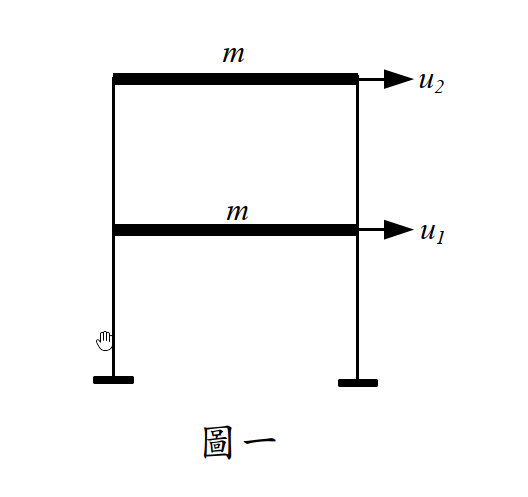

# 考題編號：SD-2014-1

**主分類：** `SD-U1-3` 單自由度、多自由度系統之動態分析及應用
**副分類：** `SD-U2-2` 建築耐震設計規範
**分析方法：** 反應譜分析（SRSS 振態疊加）
**標籤：** `MDOF` `2自由度` `剪力建築` `有效振態質量` `有效振態質量比` `模態參與因子` `SRSS` `基底剪力` `屋頂加速度` `反應譜分析` `設計地震` `黃金比例振態`

---

## 1. 原始題目重述 (Problem Restatement)

**結構：** 兩層平面剪力樓房（圖一），各樓層質量相同。

**已知條件：**

| 符號 | 數值 | 說明 |
|------|------|------|
| m | 1500 kg | 各樓層質量（1F = 2F） |
| T₁ | 0.20 sec | 第一模態週期 |
| T₂ | 0.075 sec | 第二模態週期 |
| ξ₁ = ξ₂ | 0.05 | 各模態阻尼比 |
| {φ₁}ᵀ | {0.62, 1.00} | 第一振態（1F、2F） |
| {φ₂}ᵀ | {−1.62, 1.00} | 第二振態（1F、2F） |

**設計反應譜（5% 阻尼比）：**

$$S_a = \begin{cases} 0.2\!\left(0.4 + \dfrac{T}{0.2}\right) & T \leq 0.12 \text{ sec} \\ 0.2 & 0.12 \leq T \leq 0.6 \text{ sec} \\ \dfrac{0.12}{T} & T \geq 0.6 \text{ sec} \end{cases}$$

*圖說：兩層剪力樓房示意圖，自由度為各樓層水平位移 u₁（一樓）與 u₂（二樓），每層集中質量 m = 1500 kg。*

**求：**
- (一) 各振態有效振態質量比（10分）
- (二) SRSS 組合基底剪力 $V_b$（tf）（10分）
- (三) SRSS 組合屋頂加速度 $\ddot{u}_2$（m/s²）（10分）

---

## 2. 考題核心精神與出題者意圖 (Core Concepts & Examiner's Intent)

**核心觀念：**
- 有效振態質量比（Effective Modal Mass Ratio）：衡量各模態對地震總基底剪力的貢獻比例，總和必須等於 100%
- SRSS（平方和開根號）組合：各模態最大反應獨立發生，用統計方式組合
- 反應譜 $S_a$ 對應各模態週期，求得各模態峰值加速度

**出題者意圖：**
- 考驗有效振態質量比的完整計算流程（$L_i$、$M_i$、$m_i^*$）
- 考驗反應譜讀值（T₂ 落在上升段，不能直接用 0.2）
- 考驗屋頂加速度公式（需用模態參與因子 $\Gamma_i$ 而非直接乘 $S_a$）

**關鍵陷阱：**
1. T₂ = 0.075 sec 落在上升段（T ≤ 0.12），需代入公式計算 $S_a$，不得直接用 0.2
2. 有效振態質量比分母是**全結構總質量**（3000 kg），非模態廣義質量 $M_i$
3. 屋頂加速度需用 $\phi_{2i} \times \Gamma_i \times S_a \times g$，不是直接 $\phi_{2i} \times S_a$

---

## 3. 解題戰略地圖與陷阱分析 (Strategic Roadmap & Trap Analysis)

**解題路線：**
1. 計算各模態廣義質量 $M_i$ 與激發係數 $L_i$
2. 計算有效振態質量 $m_i^* = L_i^2/M_i$（含比值意義說明）
3. 讀取 $S_a(T_1)$、$S_a(T_2)$
4. 計算各模態基底剪力 $V_{b,i}$ → SRSS → $V_b$
5. 計算屋頂模態加速度 $\ddot{u}_{2,i}$ → SRSS → $\ddot{u}_2$

**關鍵陷阱：**

| # | 陷阱 | 應對 |
|---|------|------|
| 1 | $S_a(T_2)$ 讀錯 | T₂=0.075 在上升段，代公式得 0.155g，非 0.2g |
| 2 | $m_i^*$ 定義混淆 | $m_i^* = L_i^2/M_i$（廣義質量公式），或等效地 $m_i^* = \Gamma_i \times L_i$ |
| 3 | 屋頂加速度單位 | $S_a$ 為無因次（g 的分數），需乘以 $g = 9.81$ m/s² 才得 m/s² |
| 4 | SRSS 適用條件 | 兩模態週期比 $T_2/T_1 = 0.075/0.20 = 0.375 < 0.9$，頻率差異>10%，SRSS 適用 ✓ |

---

## 3.5 變數層次分析 (Variable Hierarchy Analysis)

### 最終目標

**(一)** $\rho_i = m_i^* / M_\text{total}$；**(二)** $V_b = \sqrt{V_{b,1}^2 + V_{b,2}^2}$；**(三)** $\ddot{u}_2 = \sqrt{\ddot{u}_{2,1}^2 + \ddot{u}_{2,2}^2}$

### 本題關鍵公式（依計算順序）

$$\text{Step 1:}\quad L_i = \{\phi_i\}^T [m]\{1\} = m\sum_j \phi_{ji}$$

$$\text{Step 2:}\quad M_i = \{\phi_i\}^T [m]\{\phi_i\} = m\sum_j \phi_{ji}^2$$

$$\text{Step 3:}\quad m_i^* = \frac{L_i^2}{M_i}, \quad \rho_i = \frac{m_i^*}{M_\text{total}}$$

$$\text{Step 4:}\quad S_a(T_i) \leftarrow \text{查反應譜}$$

$$\text{Step 5:}\quad V_{b,i} = \frac{\boxed{m_i^*} \cdot S_a(T_i)}{1000} \quad \text{[tf，} m_i^* \text{ 以 kg]}$$

$$\text{Step 6:}\quad V_b = \sqrt{V_{b,1}^2 + V_{b,2}^2}$$

$$\text{Step 7:}\quad \Gamma_i = \frac{\boxed{L_i}}{\boxed{M_i}}, \quad \ddot{u}_{2,i} = \phi_{2i} \cdot \Gamma_i \cdot S_a(T_i) \cdot g$$

$$\text{Step 8:}\quad \ddot{u}_2 = \sqrt{\ddot{u}_{2,1}^2 + \ddot{u}_{2,2}^2}$$

### L1：題目直接給定

| 符號 | 數值 | 說明 |
|------|------|------|
| m | 1500 kg | 各層質量 |
| T₁, T₂ | 0.20, 0.075 sec | 各模態週期 |
| φ₁ | {0.62, 1.00}ᵀ | 第一振態 |
| φ₂ | {−1.62, 1.00}ᵀ | 第二振態 |
| S_a | 分段公式 | 5% 阻尼反應譜 |

### L2：需知識點推導

**模態參數計算**

| 符號 | 公式／來源 | 卡關? |
|------|-----------|-------|
| $L_i$ | $m \sum_j \phi_{ji}$（因各層質量相同） | |
| $M_i$ | $m \sum_j \phi_{ji}^2$ | |
| $m_i^*$ | $L_i^2 / M_i$（有效振態質量） | |
| $\rho_i$ | $m_i^* / (2m)$（除以總質量 3000 kg） | |
| $\Gamma_i$ | $L_i / M_i$（模態參與因子） | |

**反應譜讀值**

| 符號 | 計算 | 卡關? |
|------|------|-------|
| $S_a(T_1)$ | $T_1=0.20$ 在 [0.12, 0.6] 段 → 0.2 | |
| $S_a(T_2)$ | $T_2=0.075$ 在 T ≤ 0.12 段 → 0.2(0.4+0.075/0.2) = 0.155 | |

### L3：深層知識（不懂就卡住）

| 知識點 | 說明 | 卡關? |
|--------|------|-------|
| 有效振態質量物理意義 | $m_i^* = L_i^2/M_i$ 代表第 $i$ 模態對地震基底剪力的等效集中質量；$\sum m_i^* = M_\text{total}$ | |
| 模態激發係數 vs 參與因子 | $L_i = \{\phi\}^T[m]\{1\}$（kg），$\Gamma_i = L_i/M_i$（無因次）不可混用 | |
| 絕對加速度公式 | 第 $j$ 層第 $i$ 模態加速度 $= \phi_{ji} \Gamma_i S_a(T_i) g$，非 $\phi_{ji} S_a$ | |

---

## 4. 步驟化詳細計算過程 (Step-by-Step Detailed Calculation)

### 前置：讀取反應譜

| 模態 | 週期 | 所在段 | $S_a$ |
|------|------|--------|-------|
| Mode 1 | $T_1 = 0.20$ sec | $0.12 \leq T \leq 0.6$ | $S_a(T_1) = \mathbf{0.2}$（$g$ 的分數） |
| Mode 2 | $T_2 = 0.075$ sec | $T \leq 0.12$ | $S_a(T_2) = 0.2\!\left(0.4 + \frac{0.075}{0.2}\right) = 0.2 \times 0.775 = \mathbf{0.155}$ |

---

### 題(一)（10分）：各振態有效振態質量比

**Mode 1：** $\{\phi_1\}^T = \{0.62,\ 1.00\}$

$$L_1 = m(\phi_{11} + \phi_{21}) = 1500 \times (0.62 + 1.00) = 1500 \times 1.62 = 2430 \text{ kg}$$

$$M_1 = m(\phi_{11}^2 + \phi_{21}^2) = 1500 \times (0.62^2 + 1.00^2) = 1500 \times (0.3844 + 1.0000) = 1500 \times 1.3844 = 2076.6 \text{ kg}$$

$$m_1^* = \frac{L_1^2}{M_1} = \frac{2430^2}{2076.6} = \frac{5{,}904{,}900}{2076.6} \approx 2843.6 \text{ kg}$$

**Mode 2：** $\{\phi_2\}^T = \{-1.62,\ 1.00\}$

$$L_2 = m(\phi_{12} + \phi_{22}) = 1500 \times (-1.62 + 1.00) = 1500 \times (-0.62) = -930 \text{ kg}$$

$$M_2 = m(\phi_{12}^2 + \phi_{22}^2) = 1500 \times (1.62^2 + 1.00^2) = 1500 \times (2.6244 + 1.0000) = 1500 \times 3.6244 = 5436.6 \text{ kg}$$

$$m_2^* = \frac{L_2^2}{M_2} = \frac{(-930)^2}{5436.6} = \frac{864{,}900}{5436.6} \approx 159.1 \text{ kg}$$

**有效振態質量比（除以總質量 $M_\text{total} = 2m = 3000$ kg）：**

$$\boxed{\rho_1 = \frac{m_1^*}{M_\text{total}} = \frac{2843.6}{3000} \approx 94.8\%}$$

$$\boxed{\rho_2 = \frac{m_2^*}{M_\text{total}} = \frac{159.1}{3000} \approx 5.3\%}$$

**驗算：** $\rho_1 + \rho_2 \approx 94.8\% + 5.3\% = 100.1\%$（捨入誤差）$\approx 100\%$ ✓

> **物理意義：**
> $\rho_i$ 代表第 $i$ 模態在地震水平激振下對**基底剪力**的貢獻比例。第一振態貢獻約 94.8%，幾乎主導整個地震反應；第二振態只佔 5.3%。規範通常要求納入足夠模態使累積有效振態質量比 ≥ 90%（本題兩模態即已滿足）。

---

### 題(二)（10分）：SRSS 基底剪力 $V_b$

各模態基底剪力公式（$S_a$ 無因次，$m^*$ 單位 kg，結果轉換為 tf）：

$$V_{b,i} = \frac{m_i^* \cdot S_a(T_i)}{1000} \quad \text{[tf]}$$

（推導：$V_{b,i} = m_i^* \times S_a \times g \div 9810 = m_i^* \times S_a \div 1000$，取 $g = 9.81$ m/s²，$1$ tf $= 9810$ N）

$$V_{b,1} = \frac{2843.6 \times 0.2}{1000} = \frac{568.7}{1000} = 0.5687 \text{ tf}$$

$$V_{b,2} = \frac{159.1 \times 0.155}{1000} = \frac{24.66}{1000} = 0.02466 \text{ tf}$$

**SRSS 組合：**

$$\boxed{V_b = \sqrt{V_{b,1}^2 + V_{b,2}^2} = \sqrt{0.5687^2 + 0.02466^2} = \sqrt{0.32342 + 0.000608} = \sqrt{0.32403} \approx 0.569 \text{ tf}}$$

> **策略註解：** 第二模態貢獻（0.025 tf）遠小於第一模態（0.569 tf），因此 SRSS 結果幾乎等於第一模態單獨結果，這與 $\rho_1 \approx 94.8\%$ 的大比值一致。

---

### 題(三)（10分）：SRSS 屋頂加速度 $\ddot{u}_2$

第 $j$ 層第 $i$ 模態峰值絕對加速度：

$$\ddot{u}_{j,i} = \phi_{ji} \cdot \Gamma_i \cdot S_a(T_i) \cdot g$$

模態參與因子：
$$\Gamma_1 = \frac{L_1}{M_1} = \frac{2430}{2076.6} = 1.1703, \quad \Gamma_2 = \frac{L_2}{M_2} = \frac{-930}{5436.6} = -0.1711$$

屋頂（2F）各模態加速度（$j=2$，$\phi_{21} = 1.00$，$\phi_{22} = 1.00$）：

$$\ddot{u}_{2,1} = \phi_{21} \cdot \Gamma_1 \cdot S_a(T_1) \cdot g = 1.00 \times 1.1703 \times 0.2 \times 9.81 = \mathbf{2.296} \text{ m/s}^2$$

$$\ddot{u}_{2,2} = \phi_{22} \cdot \Gamma_2 \cdot S_a(T_2) \cdot g = 1.00 \times (-0.1711) \times 0.155 \times 9.81 = \mathbf{-0.260} \text{ m/s}^2$$

**SRSS 組合（取絕對值後平方和開根號）：**

$$\boxed{\ddot{u}_2 = \sqrt{2.296^2 + 0.260^2} = \sqrt{5.271 + 0.0676} = \sqrt{5.339} \approx 2.31 \text{ m/s}^2}$$

---

### 匯整答案

| 子題 | 答案 |
|------|------|
| (一) 有效振態質量比 | $\rho_1 \approx 94.8\%$，$\rho_2 \approx 5.3\%$（合計 100%） |
| (二) 基底剪力 | $V_b \approx \mathbf{0.569}$ tf |
| (三) 屋頂加速度 | $\ddot{u}_2 \approx \mathbf{2.31}$ m/s² |

---

## 5. 關鍵爭議點與進階探討 (Critical Issues & Advanced Discussion)

### 5.1 振態形狀的「黃金比例」特性

本題振態值 0.62 ≈ $1/\varphi_g$ ≈ 0.618 與 1.62 ≈ $\varphi_g$ ≈ 1.618（$\varphi_g$ 為黃金比例）。這是等質量等剛度二層剪力建築的精確解，滿足特徵方程：
$$\phi_{11}/\phi_{21} = (\sqrt{5}-1)/2 \approx 0.618, \quad \phi_{12}/\phi_{22} = -(\sqrt{5}+1)/2 \approx -1.618$$
此結果可驗算本題振態正交性：$\phi_1^T [m] \phi_2 = m(0.62 \times (-1.62) + 1.00 \times 1.00) = m(-1.0044 + 1.00) \approx 0$ ✓（捨入誤差）

### 5.2 為何 SRSS 適用而非 CQC？

兩模態週期比 $r = T_2/T_1 = 0.075/0.20 = 0.375$，頻率比 $\omega_1/\omega_2 = 0.375$（相差 > 10%），各模態響應接近統計獨立。CQC 的相關係數 $\rho_{12}$ 在此條件下接近 0，SRSS 是合理近似。

### 5.3 有效振態質量比的規範應用

台灣建築耐震規範（與 ASCE 7）要求動力分析至少納入**累積有效振態質量比 ≥ 90%** 的振態。本題只有兩個振態，Mode 1 已達 94.8%，即使不加 Mode 2 已符合規範要求。

### 5.4 考場答題注意事項

- 子題(一)必須明確寫出 $m_i^* = L_i^2/M_i$ 和分母用總質量的概念（否則會失分於「物理意義說明」）
- 子題(二)的 tf 換算不要出錯：$m^*[\text{kg}] \times S_a / 1000 = V_b[\text{tf}]$
- 子題(三)可以先用「$\ddot{u}_{2,1} \approx 2.30$ m/s²，$\ddot{u}_{2,2}$ 很小」的方式說明 Mode 1 主導，再精確計算
