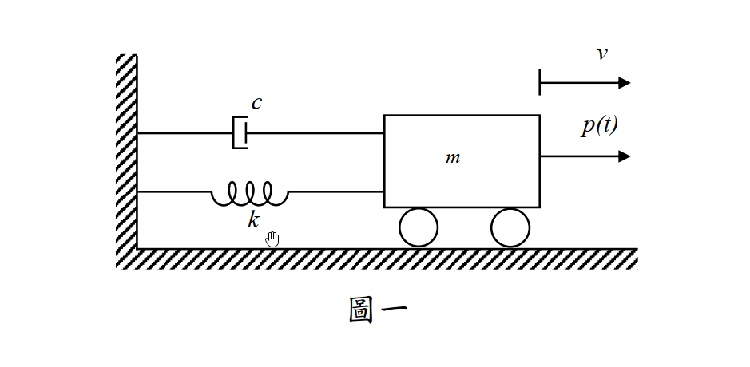

# 考題編號：SD-2015-1

**主分類：** `SD-U1-3` 單自由度、多自由度系統之動態分析及應用
**副分類：** `SD-U1-1` 結構動力基本性質及原理
**分析方法：** SDOF 穩態強迫振動解
**標籤：** `SDOF` `穩態振動` `特解` `頻率比` `阻尼比` `動力放大因子` `相位角` `諧振`

## 1. 題目重述

有一單自由度系統如圖一，其運動方程式為：

$$m\ddot{v}(t) + c\dot{v}(t) + kv(t) = P_0\sin\bar{\omega}t$$

只考慮**穩態振動（Steady state）**，忽略暫態振動（Transient state）。試求其解。（25 分）

> **附圖：**  
> 

---

## 2. 破題思路 (Problem Solving Strategy)

本題是結構動力學中最基礎的「單自由度阻尼系統受諧和外力作用」之穩態反應推導。破題關鍵在於：
1. **忽略暫態反應**：即只需求解運動方程式的特解 (Particular Solution)，齊次解 (Homogeneous Solution) 因阻尼而衰減，依題意不需考慮。
2. **假設特解形式**：由於外力為正弦函數 $P_0\sin\bar{\omega}t$，可假設穩態反應包含正弦與餘弦分量 $v(t) = A\cos\bar{\omega}t + B\sin\bar{\omega}t$。
3. **無因次參數代換**：利用自然頻率 $\omega = \sqrt{k/m}$、阻尼比 $\xi = \frac{c}{2m\omega}$、頻率比 $\beta = \frac{\bar{\omega}}{\omega}$ 將常係數轉化為標準的動力無因次參數，解出係數並合併為振幅與相位角形式。

---

## 3. 解題戰略地圖與陷阱分析 (Strategic Roadmap & Trap Analysis)

**四大陷阱：**
| # | 陷阱 | 正確處理 |
|---|---|---|
| 1 | 混淆暫態與穩態 | 題目明確指出僅求穩態振動，不需解齊次方程式去匹配初始條件。 |
| 2 | 符號與參數定義不清 | 必須清楚定義 $\omega$、$\xi$、$\beta$ 等參數，否則推導過程會非常冗長且易出錯。 |
| 3 | 特解假設不完整 | 若只假設 $v(t) = C\sin\bar{\omega}t$，會因為阻尼項 $c\dot{v}(t)$ 產生 $\cos$ 項而無法平衡。必須同時包含 $\sin$ 與 $\cos$ 項，或直接假設為 $v(t) = \rho\sin(\bar{\omega}t-\theta)$。 |

---

## 3.5 變數層次分析（Variable Hierarchy Analysis）

> 複習提示：第一次解題後，在每個卡住的知識點旁標記 `⚠`；第二次複習時只看有 `⚠` 的項目。

### 最終目標
`[推導出穩態特解的振幅 ρ 與相位角 θ]`

### 本題關鍵公式（依計算順序）

> $\boxed{\cdot}$ = 需由前步驟推導，非題目直接給定的變數

$$\text{Step 1: } \omega = \sqrt{\frac{k}{m}}, \quad \xi = \frac{c}{2m\boxed{\omega}}, \quad \beta = \frac{\bar{\omega}}{\boxed{\omega}}$$

$$\text{Step 2: } v_p(t) = A\cos\bar{\omega}t + B\sin\bar{\omega}t$$

$$\text{Step 3: } \boxed{A} = -\frac{P_0}{k} \frac{2\boxed{\xi}\boxed{\beta}}{(1-\boxed{\beta}^2)^2 + (2\boxed{\xi}\boxed{\beta})^2}, \quad \boxed{B} = \frac{P_0}{k} \frac{1-\boxed{\beta}^2}{(1-\boxed{\beta}^2)^2 + (2\boxed{\xi}\boxed{\beta})^2}$$

$$\text{Step 4: } \rho = \sqrt{\boxed{A}^2 + \boxed{B}^2}, \quad \tan\theta = \frac{-\boxed{A}}{\boxed{B}}$$

### L1：題目直接給定
_看到題目就能讀出的數字或符號，不需要任何公式。_

| 符號 | 數值/參數 | 說明 |
|------|-----------|------|
| $m$ | $m$ | 系統質量 |
| $c$ | $c$ | 系統阻尼係數 |
| $k$ | $k$ | 系統彈簧勁度 |
| $P_0$ | $P_0$ | 諧和外力振幅 |
| $\bar{\omega}$ | $\bar{\omega}$ | 諧和外力激振頻率 |

### L2：需知識點推導
_需要知道公式名稱與適用條件，套入 L1 即可算出。_

**Step 1：系統無因次參數代換**

| 符號 | 公式/來源 | 卡關? |
|------|----------|:-----:|
| $\omega$ | $\sqrt{k/m}$ | |
| $\xi$ | $c/(2m\omega)$ | |
| $\beta$ | $\bar{\omega}/\omega$ | |

**Step 2：特解係數聯立與求解**

| 符號 | 公式/來源 | 卡關? |
|------|----------|:-----:|
| $A$ | $-B \frac{2\xi\beta}{1-\beta^2}$ （從 $\cos$ 項係數平衡推得） | |
| $B$ | $\frac{P_0}{k} \frac{1-\beta^2}{(1-\beta^2)^2 + (2\xi\beta)^2}$ （從 $\sin$ 項係數平衡推得） | |

**Step 3：轉換為極座標振幅與相角**

| 符號 | 公式/來源 | 卡關? |
|------|----------|:-----:|
| $\rho$ | $\sqrt{A^2 + B^2} = \frac{P_0/k}{\sqrt{(1-\beta^2)^2 + (2\xi\beta)^2}}$ | |
| $\theta$ | $\tan^{-1}\left(\frac{-A}{B}\right) = \tan^{-1}\left(\frac{2\xi\beta}{1-\beta^2}\right)$ | |

### L3：深層知識（不懂就卡住）
_L2 中某些公式本身需要背景概念才能正確應用的知識點。_

| 知識點 | 說明 | 卡關? |
|--------|------|:-----:|
| 特解假設形式 | 為何假設特解時必須同時包含 $\sin$ 與 $\cos$？因為系統存在阻尼 $c\dot{v}$，對 $\sin$ 微分會產生 $\cos$，若不包含 $\cos$ 則無法平衡方程式。 | |
| 無因次化技巧 | 為何要刻意提出 $k$ 並換成 $\xi$ 與 $\beta$？為了將繁雜的參數簡化為具有物理意義的動力放大因子 $R_d$ 與相位角 $\theta$，這是動力學的標準流程。 | |

---

## 4. 核心推導與計算過程 (Core Derivations & Calculations)

### Step 1：定義動力特性參數

原運動方程式為：
$$m\ddot{v}(t) + c\dot{v}(t) + kv(t) = P_0\sin\bar{\omega}t$$
將等式兩邊同除以 $m$：
$$\ddot{v}(t) + \frac{c}{m}\dot{v}(t) + \frac{k}{m}v(t) = \frac{P_0}{m}\sin\bar{\omega}t$$
代入系統參數 $\omega^2 = \frac{k}{m}$ 及 $\frac{c}{m} = 2\xi\omega$：
$$\ddot{v}(t) + 2\xi\omega\dot{v}(t) + \omega^2 v(t) = \frac{P_0}{m}\sin\bar{\omega}t$$

### Step 2：假設穩態特解

穩態反應即為非齊次常微分方程式的特解 $v_p(t)$。因等式右邊為諧和函數且系統具有阻尼，響應將包含正弦與餘弦分量，故假設：
$$v(t) = A\cos\bar{\omega}t + B\sin\bar{\omega}t$$
對其微分可得速度與加速度：
$$\dot{v}(t) = -A\bar{\omega}\sin\bar{\omega}t + B\bar{\omega}\cos\bar{\omega}t$$
$$\ddot{v}(t) = -A\bar{\omega}^2\cos\bar{\omega}t - B\bar{\omega}^2\sin\bar{\omega}t$$

### Step 3：代入運動方程式並整理

將 $v, \dot{v}, \ddot{v}$ 代回原方程式：
$$m(-A\bar{\omega}^2\cos\bar{\omega}t - B\bar{\omega}^2\sin\bar{\omega}t) + c(-A\bar{\omega}\sin\bar{\omega}t + B\bar{\omega}\cos\bar{\omega}t) + k(A\cos\bar{\omega}t + B\sin\bar{\omega}t) = P_0\sin\bar{\omega}t$$

將含有 $\cos\bar{\omega}t$ 與 $\sin\bar{\omega}t$ 的項分別合併比較係數：

對於 $\cos\bar{\omega}t$ 項（等式右邊係數為 0）：
$$-mA\bar{\omega}^2 + cB\bar{\omega} + kA = 0 \implies A(k - m\bar{\omega}^2) + B(c\bar{\omega}) = 0$$

對於 $\sin\bar{\omega}t$ 項（等式右邊係數為 $P_0$）：
$$-mB\bar{\omega}^2 - cA\bar{\omega} + kB = P_0 \implies -A(c\bar{\omega}) + B(k - m\bar{\omega}^2) = P_0$$

### Step 4：導入頻率比並求解 A 與 B

提出靜力勁度 $k$，並引入頻率比 $\beta = \frac{\bar{\omega}}{\omega}$：
- $k - m\bar{\omega}^2 = k(1 - \frac{m\bar{\omega}^2}{k}) = k(1 - \frac{\bar{\omega}^2}{\omega^2}) = k(1 - \beta^2)$
- $c\bar{\omega} = c\omega\beta = (2\xi m\omega)\omega\beta = 2\xi k \beta$

代回方程式組得：
$$A \cdot k(1-\beta^2) + B \cdot 2\xi k\beta = 0$$
$$-A \cdot 2\xi k\beta + B \cdot k(1-\beta^2) = P_0$$

將等式同除以 $k$：
$$A(1-\beta^2) + B(2\xi\beta) = 0 \quad \text{--- (1)}$$
$$-A(2\xi\beta) + B(1-\beta^2) = \frac{P_0}{k} \quad \text{--- (2)}$$

由 (1) 式可得 $A = -B \frac{2\xi\beta}{1-\beta^2}$，代入 (2) 式：
$$-\left(-B \frac{2\xi\beta}{1-\beta^2}\right)(2\xi\beta) + B(1-\beta^2) = \frac{P_0}{k}$$
$$B \left[ \frac{(2\xi\beta)^2}{1-\beta^2} + \frac{(1-\beta^2)^2}{1-\beta^2} \right] = \frac{P_0}{k}$$
$$B = \frac{P_0}{k} \frac{1-\beta^2}{(1-\beta^2)^2 + (2\xi\beta)^2}$$

將 $B$ 代回求 $A$：
$$A = -\frac{P_0}{k} \frac{2\xi\beta}{(1-\beta^2)^2 + (2\xi\beta)^2}$$

### Step 5：化簡為振幅與相角形式 (極座標式)

穩態解可表示為：
$$v(t) = \frac{P_0}{k} \frac{1}{(1-\beta^2)^2 + (2\xi\beta)^2} \left[ -2\xi\beta\cos\bar{\omega}t + (1-\beta^2)\sin\bar{\omega}t \right]$$

若令振幅 $\rho = \sqrt{A^2 + B^2}$：
$$\rho = \frac{P_0}{k} \frac{\sqrt{(-2\xi\beta)^2 + (1-\beta^2)^2}}{(1-\beta^2)^2 + (2\xi\beta)^2} = \frac{P_0/k}{\sqrt{(1-\beta^2)^2 + (2\xi\beta)^2}}$$

定義相位角 $\theta$，使得 $A = -\rho\sin\theta$ 及 $B = \rho\cos\theta$：
$$\tan\theta = \frac{-A}{B} = \frac{2\xi\beta}{1-\beta^2}$$

最終可將穩態解寫作較簡潔的相角形式：
$$v(t) = \rho\sin(\bar{\omega}t - \theta)$$

---

## 5. 結論與考點覆盤 (Conclusion & Review)

本題求得之穩態振動位移（特解）為：
$$v(t) = \rho\sin(\bar{\omega}t - \theta)$$

其中：
- 靜位移：$(v_{st})_0 = \frac{P_0}{k}$
- 動力放大因子：$R_d = \frac{1}{\sqrt{(1-\beta^2)^2 + (2\xi\beta)^2}}$
- 穩態振幅：$\rho = (v_{st})_0 \cdot R_d$
- 相位角：$\theta = \tan^{-1}\left(\frac{2\xi\beta}{1-\beta^2}\right)$
