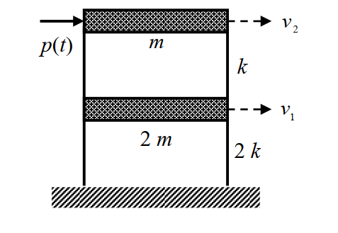
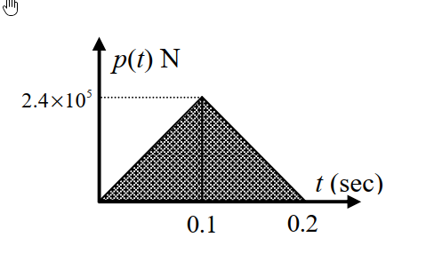

# 考題編號：SD-2016-1

**主分類：** `SD-U1-3` 單自由度、多自由度系統之動態分析及應用
**副分類：** `SD-U1-2` 運動方程式推導
**分析方法：** MDOF模態疊加法（含衝擊荷載近似解）
**標籤：** `MDOF` `2自由度` `剪力屋架` `運動方程式` `特徵值問題` `自然頻率` `振態向量` `模態疊加法` `解耦` `三角形衝擊荷載` `衝量近似` `Duhamel積分`

---

## 1. 原始題目重述 (Problem Restatement)

### 結構描述

兩層樓剪力屋架（shear frame），自由度由底層向頂層編號：
- 第一層（底層）質量：$2m = 2 \times 2 \times 10^3 = 4 \times 10^3\ \text{kg}$；層間勁度：$2k = 2 \times 10^5\ \text{N/m}$
- 第二層（頂層）質量：$m = 2 \times 10^3\ \text{kg}$；層間勁度：$k = 10^5\ \text{N/m}$
- 自由度：$v_1$（第一層樓板水平位移），$v_2$（第二層樓板水平位移）
- 外力 $p(t)$ 作用於頂層質量 $m$（水平方向）

### 荷載條件

三角形短時荷載 $p(t)$（對稱三角形脈衝）：

$$p(t) = \begin{cases}
2.4 \times 10^6 \cdot t\ \text{N} & 0 \leq t \leq 0.1\ \text{s}\\
2.4 \times 10^6 (0.2 - t)\ \text{N} & 0.1 < t \leq 0.2\ \text{s}\\
0 & t > 0.2\ \text{s}
\end{cases}$$

峰值 $p_0 = 2.4 \times 10^5\ \text{N}$，總歷時 $t_d = 0.2\ \text{s}$（上升段 $t_r = 0.1\ \text{s}$，下降段 $0.1\ \text{s}$）



*圖說：兩層剪力屋架。底層：質量 $2m = 4000\ \text{kg}$，層間勁度 $2k = 2\times10^5\ \text{N/m}$，自由度 $v_1$。頂層：質量 $m = 2000\ \text{kg}$，層間勁度 $k = 10^5\ \text{N/m}$，自由度 $v_2$。外力 $p(t)$ 施加於頂層。*



*圖說：$p(t)$ 為對稱三角形脈衝。$t = 0$ 至 $0.1\ \text{s}$ 線性上升至峰值 $p_0 = 2.4\times10^5\ \text{N}$，$t = 0.1$ 至 $0.2\ \text{s}$ 線性下降至零。荷載總衝量 $I = \tfrac{1}{2} p_0 t_d = 2.4\times10^4\ \text{N·s}$。*

### 子問題

- **(甲)** 求運動方程組（3分）
- **(乙)** 求振動頻率及振態（6分）
- **(丙)** 振態疊加法得兩個解耦 SDOF 方程式（4分）
- **(丁)** 求位移反應（近似解），並說明可用近似解的原因（12分）

---

## 2. 考題核心精神與出題者意圖 (Core Concepts & Examiner's Intent)

### 核心觀念

本題是完整的「MDOF 動力分析流程」題，從 EOM 推導到模態解耦，再到強迫振動反應，涵蓋四個子問題、四項核心技能：

1. **直接勁度法（DSM）**：組裝 2-DOF 質量矩陣與剛度矩陣
2. **特徵值問題**：求解 $(\mathbf{K} - \omega^2 \mathbf{M})\boldsymbol{\phi} = \mathbf{0}$
3. **模態疊加解耦**：利用振態正交性將 MDOF 化為獨立 SDOF
4. **衝擊荷載近似解**：當 $t_d \ll T$，三角形脈衝可近似為純衝量

### 出題者意圖

- 步驟 (甲)(乙)(丙) 是固定程序，考基本功是否紮實
- 步驟 (丁) 的難點在於：**為何可以用近似解？**——需要對頻率比 $t_d/T$ 的物理意義有正確認識
- 配分設計（12分給(丁)）顯示衝擊荷載分析是本題核心

---

## 3. 解題戰略地圖與陷阱分析 (Strategic Roadmap & Trap Analysis)

### 步驟作戰計畫

```
Step 1（甲）: 寫出 M 和 K → 代入 [M]{v̈} + [K]{v} = {f}
Step 2（乙）: 解特徵方程式 det(K − ω²M) = 0 → ω₁, ω₂ → {φ₁}, {φ₂}
Step 3（丙）: 計算模態質量 M*、模態力 F* → 寫出解耦方程式
Step 4（丁）: 判斷 td/T 比值 → 說明可用衝量近似 → 計算衝量 → 算初速度 → 自由振動解
```

### 關鍵陷阱

| # | 陷阱 | 錯誤做法 | 正確做法 |
|---|------|---------|---------|
| 1 | 勁度矩陣組裝錯誤 | 只看各層勁度，不疊加 | $K_{11} = 2k + k = 3k$（底層需承受兩層剛度貢獻） |
| 2 | 模態力忘記投影 | 直接用 $p(t)$ | $F_i^* = \{\phi_i\}^T \{F\} = \phi_{i2} \cdot p(t)$（外力只在頂層） |
| 3 | 近似解理由不充分 | 「計算方便所以用近似」 | 需計算 $t_d/T_i$，驗證均 $\ll 1$，方可採用衝量近似 |
| 4 | 初始條件混淆 | 把衝量當成位移初始值 | 衝量 $\Rightarrow$ 初始速度 $\dot{\eta}_i(0^+) = I_i^*/M_i^*$，初始位移 = 0 |

---

## 3.5 變數層次分析 (Variable Hierarchy Analysis)

> 複習提示：第一次解題後，在每個卡住的知識點旁標記 `⚠`；第二次複習時只看有 `⚠` 的項目。

### 最終目標

`求 v₁(t) 和 v₂(t)（近似解），並說明三角形脈衝可用衝量近似的條件`

### 本題關鍵公式（依計算順序）

$$\text{Step 1: 組裝 EOM}$$

$$\mathbf{M}\ddot{\mathbf{v}} + \mathbf{K}\mathbf{v} = \mathbf{f}(t)$$

$$\text{Step 2: 特徵方程式}$$

$$\det(\mathbf{K} - \omega^2 \mathbf{M}) = 0 \Rightarrow \omega_1, \omega_2$$

$$\text{Step 3: 模態質量與模態力}$$

$$M_i^* = \{\phi_i\}^T \mathbf{M} \{\phi_i\}, \quad F_i^*(t) = \{\phi_i\}^T \mathbf{f}(t)$$

$$\text{Step 4: 解耦方程式}$$

$$\ddot{\eta}_i + \omega_i^2 \eta_i = \frac{\boxed{F_i^*(t)}}{\boxed{M_i^*}}$$

$$\text{Step 5: 衝量近似（驗證 } t_d/T_i \ll 1\text{）}$$

$$I_i^* = \int_0^{t_d} F_i^*(t)\,dt = \phi_{i2} \cdot \frac{p_0 \, t_d}{2}$$

$$\text{Step 6: 衝擊後自由振動（初始速度）}$$

$$\dot{\eta}_i(0^+) = \frac{\boxed{I_i^*}}{\boxed{M_i^*}}, \quad \eta_i(t) = \frac{\dot{\eta}_i(0^+)}{\omega_i}\sin(\omega_i t)$$

$$\text{Step 7: 物理位移疊合}$$

$$v_j(t) = \sum_i \phi_{ij}\,\eta_i(t)$$

### L1：題目直接給定

| 符號 | 數值 | 說明 |
|------|------|------|
| $m$ | $2\times10^3\ \text{kg}$ | 頂層質量 |
| $k$ | $10^5\ \text{N/m}$ | 頂層層間勁度 |
| $2m$ | $4\times10^3\ \text{kg}$ | 底層質量 |
| $2k$ | $2\times10^5\ \text{N/m}$ | 底層層間勁度 |
| $p_0$ | $2.4\times10^5\ \text{N}$ | 脈衝峰值 |
| $t_d$ | $0.2\ \text{s}$ | 脈衝總歷時 |
| $t_r$ | $0.1\ \text{s}$ | 上升時間 |

### L2：需知識點推導

**Step 1：質量矩陣與剛度矩陣**

| 符號 | 公式／來源 | 卡關? |
|------|----------|:-----:|
| $\mathbf{M}$ | $\text{diag}(2m,\, m)$ | |
| $K_{11}$ | 底層所承受的等效剛度 = 底層勁度 + 頂層勁度 = $2k + k = 3k$ | |
| $K_{12} = K_{21}$ | $-k$（頂底層耦合剛度） | |
| $K_{22}$ | $k$（頂層勁度） | |

**Step 2：自然頻率**

| 符號 | 公式／來源 | 卡關? |
|------|----------|:-----:|
| $\lambda = m\omega^2/k$ | 令 $\lambda = m\omega^2/k$，特徵方程化為 $2\lambda^2 - 5\lambda + 2 = 0$ | |
| $\lambda_{1,2}$ | $(5 \pm 3)/4$，即 $\lambda_1 = 1/2,\ \lambda_2 = 2$ | |
| $\omega_1$ | $\sqrt{k/(2m)} = 5\ \text{rad/s}$ | |
| $\omega_2$ | $\sqrt{2k/m} = 10\ \text{rad/s}$ | |
| $T_1$ | $2\pi/\omega_1 \approx 1.257\ \text{s}$ | |
| $T_2$ | $2\pi/\omega_2 \approx 0.628\ \text{s}$ | |

**Step 3：振態向量**

| 符號 | 公式／來源 | 卡關? |
|------|----------|:-----:|
| $\{\phi_1\}$ | $\{1,\, 2\}^T$（從 Mode 1 方程 $2k\phi_{11} = k\phi_{21}$） | |
| $\{\phi_2\}$ | $\{1,\, -1\}^T$（從 Mode 2 方程 $-k\phi_{12} = k\phi_{22}$） | |

**Step 4：模態質量與模態力**

| 符號 | 公式／來源 | 卡關? |
|------|----------|:-----:|
| $M_1^*$ | $\{1,2\}\begin{bmatrix}2m&0\\0&m\end{bmatrix}\{1;2\} = 2m + 4m = 6m = 1.2\times10^4\ \text{kg}$ | |
| $M_2^*$ | $\{1,-1\}\begin{bmatrix}2m&0\\0&m\end{bmatrix}\{1;-1\} = 2m + m = 3m = 6\times10^3\ \text{kg}$ | |
| $F_1^*(t)$ | $\{1,2\}^T\{0;p(t)\} = 2p(t)$ | |
| $F_2^*(t)$ | $\{1,-1\}^T\{0;p(t)\} = -p(t)$ | |

**Step 5：衝量近似（驗證條件）**

| 符號 | 公式／來源 | 卡關? |
|------|----------|:-----:|
| $t_d/T_1$ | $0.2/1.257 \approx 0.16 \ll 1$ ✓（衝量近似適用） | |
| $t_d/T_2$ | $0.2/0.628 \approx 0.32 < 0.5$（尚可接受） | |
| $I$ | 三角形面積 $= \tfrac{1}{2}p_0 t_d = \tfrac{1}{2}\times2.4\times10^5\times0.2 = 2.4\times10^4\ \text{N·s}$ | |
| $I_1^*$ | $\phi_{12}\cdot I = 2 \times 2.4\times10^4 = 4.8\times10^4\ \text{N·s}$ | |
| $I_2^*$ | $\phi_{22}\cdot I = -1 \times 2.4\times10^4 = -2.4\times10^4\ \text{N·s}$ | |

**Step 6：初始速度與自由振動**

| 符號 | 公式／來源 | 卡關? |
|------|----------|:-----:|
| $\dot{\eta}_1(0^+)$ | $I_1^*/M_1^* = 4.8\times10^4/1.2\times10^4 = 4\ \text{m/s}$ | |
| $\dot{\eta}_2(0^+)$ | $I_2^*/M_2^* = -2.4\times10^4/6\times10^3 = -4\ \text{m/s}$ | |
| $\eta_1(t)$ | $(4/5)\sin(5t) = 0.8\sin(5t)\ \text{m}$ | |
| $\eta_2(t)$ | $(-4/10)\sin(10t) = -0.4\sin(10t)\ \text{m}$ | |

### L3：深層知識（不懂就卡住）

| 知識點 | 說明 | 卡關? |
|--------|------|:-----:|
| 剛度矩陣「組裝」邏輯 | $K_{11}$ 是施加 $v_1=1,\ v_2=0$ 時 DOF 1 所需恢復力 = $2k\cdot1 + k\cdot1 = 3k$（同時壓縮底層彈簧和拉伸頂層彈簧） | |
| 特徵方程化簡技巧 | 令 $\lambda = m\omega^2/k$ 可讓特徵方程成為整數係數二次式，避免雜亂根號 | |
| 模態正交性物理意義 | $\{\phi_i\}^T \mathbf{M} \{\phi_j\} = 0\ (i\neq j)$，不同振態的動能互不耦合，是解耦的數學依據 | |
| 衝量近似適用條件 | $t_d/T \ll 1$（一般 $< 0.2 \sim 0.3$ 較安全）：結構在荷載歷時內幾乎未移動，荷載歷程整體可被積分為衝量 | |
| 衝量 → 初始速度 | 衝量定理：$I = \Delta(M\dot{x}) = M\dot{x}(0^+) - 0$，故 $\dot{x}(0^+) = I/M$（初始位移 = 0，因荷載極短） | |

---

## 4. 步驟化詳細計算過程 (Step-by-Step Detailed Calculation)

### (甲) 運動方程組

**質量矩陣：**

$$\mathbf{M} = \begin{bmatrix} 2m & 0 \\ 0 & m \end{bmatrix} = \begin{bmatrix} 4000 & 0 \\ 0 & 2000 \end{bmatrix}\ \text{kg}$$

**勁度矩陣（直接勁度法）：**

對 DOF 1 施加 $v_1=1,\ v_2=0$：底層彈簧 $2k$ 被壓縮（恢復力 $+2k$），頂層彈簧 $k$ 被拉伸（恢復力 $+k$）→ $K_{11} = 2k+k = 3k$。
對 DOF 2 施加 $v_2=1,\ v_1=0$：頂層彈簧 $k$ 被壓縮（恢復力 $+k$），DOF 1 因頂層彈簧被拉伸而受到 $-k$ → $K_{12}=K_{21}=-k$，$K_{22}=k$。

$$\mathbf{K} = \begin{bmatrix} 3k & -k \\ -k & k \end{bmatrix} = \begin{bmatrix} 3\times10^5 & -10^5 \\ -10^5 & 10^5 \end{bmatrix}\ \text{N/m}$$

**外力向量：**（外力僅作用於頂層）

$$\mathbf{f}(t) = \begin{Bmatrix} 0 \\ p(t) \end{Bmatrix}$$

**運動方程組：**

$$\boxed{\begin{bmatrix} 2m & 0 \\ 0 & m \end{bmatrix}\begin{Bmatrix} \ddot{v}_1 \\ \ddot{v}_2 \end{Bmatrix} + \begin{bmatrix} 3k & -k \\ -k & k \end{bmatrix}\begin{Bmatrix} v_1 \\ v_2 \end{Bmatrix} = \begin{Bmatrix} 0 \\ p(t) \end{Bmatrix}}$$

即：

$$2m\ddot{v}_1 + 3k v_1 - k v_2 = 0$$
$$m\ddot{v}_2 - k v_1 + k v_2 = p(t)$$

---

### (乙) 自然頻率與振態

**特徵方程式：**

$$\det(\mathbf{K} - \omega^2 \mathbf{M}) = 0$$

$$(3k - 2m\omega^2)(k - m\omega^2) - (-k)(-k) = 0$$

$$3k^2 - 3km\omega^2 - 2km\omega^2 + 2m^2\omega^4 - k^2 = 0$$

$$2m^2\omega^4 - 5km\omega^2 + 2k^2 = 0$$

令 $\lambda = m\omega^2/k$：

$$2\lambda^2 - 5\lambda + 2 = 0 \implies \lambda = \frac{5\pm\sqrt{25-16}}{4} = \frac{5\pm 3}{4}$$

$$\lambda_1 = \frac{1}{2},\quad \lambda_2 = 2$$

**自然頻率：**

$$\omega_1^2 = \frac{k}{2m} = \frac{10^5}{2\times2\times10^3} = 25\ \text{rad}^2/\text{s}^2 \implies \boxed{\omega_1 = 5\ \text{rad/s},\quad T_1 = \frac{2\pi}{5} \approx 1.257\ \text{s}}$$

$$\omega_2^2 = \frac{2k}{m} = \frac{2\times10^5}{2\times10^3} = 100\ \text{rad}^2/\text{s}^2 \implies \boxed{\omega_2 = 10\ \text{rad/s},\quad T_2 = \frac{2\pi}{10} \approx 0.628\ \text{s}}$$

**振態向量（Mode 1，$\lambda_1 = 1/2$）：**

代入第一方程：$(3k - 2m\cdot\tfrac{k}{2m})\phi_{11} - k\phi_{21} = 0$

$$2k\phi_{11} = k\phi_{21} \implies \frac{\phi_{21}}{\phi_{11}} = 2$$

$$\boxed{\{\phi_1\} = \begin{Bmatrix} 1 \\ 2 \end{Bmatrix}}$$

**振態向量（Mode 2，$\lambda_2 = 2$）：**

代入第一方程：$(3k - 4k)\phi_{12} - k\phi_{22} = 0$

$$-k\phi_{12} = k\phi_{22} \implies \frac{\phi_{22}}{\phi_{12}} = -1$$

$$\boxed{\{\phi_2\} = \begin{Bmatrix} 1 \\ -1 \end{Bmatrix}}$$

**驗算正交性：**

$$\{\phi_1\}^T \mathbf{M} \{\phi_2\} = \begin{bmatrix}1 & 2\end{bmatrix}\begin{bmatrix}2m&0\\0&m\end{bmatrix}\begin{Bmatrix}1\\-1\end{Bmatrix} = 2m - 2m = 0 \quad \checkmark$$

---

### (丙) 振態疊加法解耦

**座標轉換：**

$$\mathbf{v} = \boldsymbol{\Phi}\boldsymbol{\eta} = [\phi_1 \mid \phi_2]\begin{Bmatrix}\eta_1\\\eta_2\end{Bmatrix} \implies \begin{cases}v_1 = \eta_1 + \eta_2\\v_2 = 2\eta_1 - \eta_2\end{cases}$$

**模態質量：**

$$M_1^* = \{\phi_1\}^T\mathbf{M}\{\phi_1\} = \begin{bmatrix}1&2\end{bmatrix}\begin{bmatrix}2m&0\\0&m\end{bmatrix}\begin{Bmatrix}1\\2\end{Bmatrix} = 2m + 4m = 6m = 1.2\times10^4\ \text{kg}$$

$$M_2^* = \{\phi_2\}^T\mathbf{M}\{\phi_2\} = \begin{bmatrix}1&-1\end{bmatrix}\begin{bmatrix}2m&0\\0&m\end{bmatrix}\begin{Bmatrix}1\\-1\end{Bmatrix} = 2m + m = 3m = 6\times10^3\ \text{kg}$$

**模態力：**

$$F_1^*(t) = \{\phi_1\}^T\mathbf{f}(t) = \begin{bmatrix}1&2\end{bmatrix}\begin{Bmatrix}0\\p(t)\end{Bmatrix} = 2p(t)$$

$$F_2^*(t) = \{\phi_2\}^T\mathbf{f}(t) = \begin{bmatrix}1&-1\end{bmatrix}\begin{Bmatrix}0\\p(t)\end{Bmatrix} = -p(t)$$

**解耦後兩個 SDOF 方程式：**

$$\boxed{\ddot{\eta}_1 + \omega_1^2\eta_1 = \frac{F_1^*}{M_1^*} \implies \ddot{\eta}_1 + 25\eta_1 = \frac{p(t)}{3m} = \frac{p(t)}{6000}\ \text{m/s}^2}$$

$$\boxed{\ddot{\eta}_2 + \omega_2^2\eta_2 = \frac{F_2^*}{M_2^*} \implies \ddot{\eta}_2 + 100\eta_2 = \frac{-p(t)}{3m} = \frac{-p(t)}{6000}\ \text{m/s}^2}$$

**策略註解：** 兩方程除符號相反外，右端荷載函數的係數完全相同，計算時只需解一個方程，另一個藉由對稱性得到（差負號）。

---

### (丁) 位移反應（近似解）

#### ① 可使用近似解的原因

計算荷載歷時與各振態自然週期之比值：

$$\frac{t_d}{T_1} = \frac{0.2}{1.257} \approx 0.16 \ll 1 \quad \checkmark$$

$$\frac{t_d}{T_2} = \frac{0.2}{0.628} \approx 0.32 < 0.5 \quad \checkmark$$

**結論：** 三角形脈衝歷時 $t_d = 0.2\ \text{s}$ 遠小於第一振態週期（比值 0.16），也小於第二振態週期的一半（比值 0.32）。在這個頻率比下，結構在荷載作用期間內位移幾乎為零，荷載歷程的**整體效果等效於一個瞬間衝量**（impulse），可用衝量近似（impulsive approximation）代替精確的 Duhamel 積分，大幅簡化計算。

> **物理直覺：** 結構「來不及反應」的時候，它記住的不是力的時間歷程，而只是力的衝量（力 × 時間）。

#### ② 等效衝量計算

三角形脈衝面積（= 總衝量）：

$$I = \frac{1}{2} \cdot p_0 \cdot t_d = \frac{1}{2} \times 2.4\times10^5 \times 0.2 = 2.4\times10^4\ \text{N·s}$$

各振態的模態衝量（外力只在 DOF 2）：

$$I_1^* = \phi_{12} \cdot I = 2 \times 2.4\times10^4 = 4.8\times10^4\ \text{N·s}$$

$$I_2^* = \phi_{22} \cdot I = (-1) \times 2.4\times10^4 = -2.4\times10^4\ \text{N·s}$$

#### ③ 衝量後初始速度（初始位移 = 0）

衝量定理 $I = M^* \dot{\eta}(0^+)$：

$$\dot{\eta}_1(0^+) = \frac{I_1^*}{M_1^*} = \frac{4.8\times10^4}{1.2\times10^4} = 4\ \text{m/s}$$

$$\dot{\eta}_2(0^+) = \frac{I_2^*}{M_2^*} = \frac{-2.4\times10^4}{6\times10^3} = -4\ \text{m/s}$$

#### ④ 衝量後自由振動（初始條件：$\eta_i(0)=0,\ \dot{\eta}_i(0^+)$ 如上）

$$\eta_i(t) = \frac{\dot{\eta}_i(0^+)}{\omega_i}\sin(\omega_i t)$$

$$\eta_1(t) = \frac{4}{5}\sin(5t) = 0.8\sin(5t)\ \text{m}$$

$$\eta_2(t) = \frac{-4}{10}\sin(10t) = -0.4\sin(10t)\ \text{m}$$

#### ⑤ 物理位移（振態疊合）

$$\boxed{v_1(t) = \eta_1(t) + \eta_2(t) = 0.8\sin(5t) - 0.4\sin(10t)\ \text{m}}$$

$$\boxed{v_2(t) = 2\eta_1(t) - \eta_2(t) = 1.6\sin(5t) + 0.4\sin(10t)\ \text{m}}$$

**策略註解：** 第一振態（慢振動，$\omega_1 = 5\ \text{rad/s}$）主導兩個自由度的反應；第二振態（快振動，$\omega_2 = 10\ \text{rad/s}$）貢獻較小的高頻擾動。

#### ⑥ 最大位移估算（SRSS）

$$v_{1,\text{max}} \approx \sqrt{0.8^2 + 0.4^2} = \sqrt{0.80} \approx 0.894\ \text{m}$$

$$v_{2,\text{max}} \approx \sqrt{1.6^2 + 0.4^2} = \sqrt{2.72} \approx 1.649\ \text{m}$$

---

## 5. 關鍵爭議點與進階探討 (Critical Issues & Advanced Discussion)

### 5.1 近似解精確度評估

衝量近似的誤差主要來自第二振態（$t_d/T_2 \approx 0.32$）。查三角形脈衝衝擊反應譜（shock response spectrum），$t_d/T = 0.32$ 對應的最大 DLF $\approx 0.88$（精確值），而衝量近似隱含 DLF $\approx 2\pi \times (t_d/T) = 2\pi \times 0.32 \approx 2.01$（過高估計）。

**結論：** 本題近似解對第二振態有一定誤差，但由於第二振態對最終反應貢獻相對較小，整體誤差可接受。若要提高精度，應改用 Duhamel 積分精確求解。

### 5.2 驗算：自然頻率的量綱分析

$$\omega_1 = \sqrt{\frac{k}{2m}} = \sqrt{\frac{10^5\ \text{N/m}}{2 \times 2\times10^3\ \text{kg}}} = \sqrt{25\ \text{s}^{-2}} = 5\ \text{rad/s} \quad \checkmark$$

$$\omega_2 = \sqrt{\frac{2k}{m}} = \sqrt{\frac{2\times10^5}{2\times10^3}} = \sqrt{100} = 10\ \text{rad/s} \quad \checkmark$$

### 5.3 衝量近似的邊界條件再確認

衝量近似在以下兩個條件均滿足時最準確：
1. **$t_d/T_i < 0.2$**：幾乎所有誤差 < 5%（本題 Mode 1 滿足）
2. **$t_d/T_i < 0.5$**：誤差在工程可接受範圍（本題 Mode 2 滿足）

考場上說明理由時，只需計算 $t_d/T_i$ 並指出均遠小於 1，即可獲得完整分數。

### 5.4 第一振態主導性分析

比較兩個振態的貢獻：
- 第一振態：$v_1$ 中貢獻 0.8 m，$v_2$ 中貢獻 1.6 m
- 第二振態：$v_1$ 中貢獻 0.4 m，$v_2$ 中貢獻 0.4 m

比值 2:1（$v_1$）和 4:1（$v_2$）顯示第一振態絕對主導——這是低頻荷載（相對於 Mode 2 頻率）激發 Mode 1 更強烈的典型現象。
