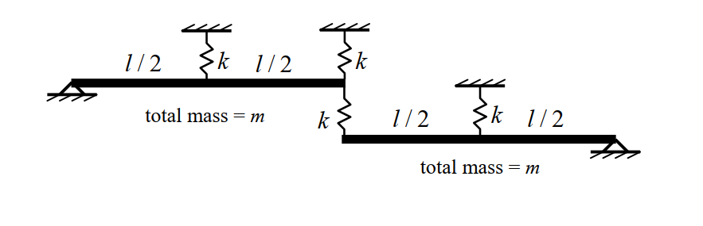

# 考題編號：SD-2016-2

**主分類：** `SD-U1-2` 運動方程式推導
**副分類：** `SD-U1-3` 單自由度、多自由度系統之動態分析及應用
**分析方法：** MDOF模態分析
**標籤：** `MDOF` `2自由度` `剛性梁` `旋轉DOF` `質量矩陣` `勁度矩陣` `特徵值問題` `自然頻率` `振態向量` `對稱結構` `模態對稱反對稱`

---

## 1. 原始題目重述 (Problem Restatement)

### 結構描述

兩支均勻剛性梁（rigid beam），每支總質量皆為 $m$，梁長皆為 $l$，彈簧勁度皆為 $k$。

**上梁（Upper Beam）：**
- 左端 A 以鉸接（pin）固定於左牆，為旋轉自由度 $\theta_1$（正方向：右端向下）
- 梁中點（距 A 為 $l/2$）有一天花板彈簧 $k$（向上接固定天花板）
- 右端 B（距 A 為 $l$）有一連接彈簧 $k$（向下接下梁左端 C）

**下梁（Lower Beam）：**
- 右端 D 以鉸接（pin）固定於右牆，為旋轉自由度 $\theta_2$（正方向：左端向下）
- 左端 C（距 D 為 $l$）由連接彈簧 $k$ 與上梁右端 B 相連
- 梁中點（距 D 為 $l/2$）有一天花板彈簧 $k$（向上接固定天花板）



*圖說：上梁長 $l$，質量 $m$，左端 A 鉸接（pin），中點處天花板彈簧 $k$，右端 B 有連接彈簧 $k$ 向下接下梁左端 C。下梁長 $l$，質量 $m$，左端 C 接連接彈簧 $k$（來自上梁），中點處天花板彈簧 $k$，右端 D 鉸接（pin）。廣義座標：$\theta_1$（上梁繞 A 旋轉，正 = 右端向下），$\theta_2$（下梁繞 D 旋轉，正 = 左端向下）。*

### 子問題

- **(一)** 質量矩陣（6 分）
- **(二)** 勁度矩陣（6 分）
- **(三)** 結構系統的自然振動頻率（直接以符號表示）（8 分）

---

## 2. 考題核心精神與出題者意圖 (Core Concepts & Examiner's Intent)

### 核心觀念

本題是 MDOF **旋轉自由度（rotational DOF）** 系統的完整矩陣推導題，重點在於：

1. **能量法建立質量矩陣**：均勻剛性梁繞端點的轉動慣量 $I = ml^2/3$，是本題質量矩陣的唯一來源
2. **力矩平衡法建立勁度矩陣**：對每一廣義座標施加單位位移，計算所需恢復力矩，得到剛度係數
3. **對稱結構的特徵值問題**：$[K]$ 和 $[M]$ 均為對稱矩陣，且具有結構對稱性，特徵方程式可直接因式分解，結果極為整齊

### 出題者意圖

- 測試考生能否**正確識別廣義座標**（旋轉 $\theta$，而非線位移）
- 聯接彈簧（connecting spring）的**雙向力矩貢獻**是最常見的失誤點
- 結構對稱性使得 $K_{11} = K_{22}$、$K_{12} = K_{21}$，答案非常整齊，可快速自我驗算

---

## 3. 解題戰略地圖與陷阱分析 (Strategic Roadmap & Trap Analysis)

### 步驟作戰計畫

```
Step 1（質量矩陣）: 計算每支梁的轉動慣量 I = ml²/3 → 無耦合 → [M] = (ml²/3)I₂
Step 2（勁度矩陣）: 施加 θ₁=1, θ₂=0 → 計算各彈簧位移 → 對 A 取力矩 → K₁₁, K₂₁
                   施加 θ₂=1, θ₁=0 → 計算各彈簧位移 → 對 D 取力矩 → K₁₂, K₂₂
Step 3（自然頻率）: 令 λ = ω²m/(3k) → det([K]-ω²[M])=0 → 因式分解 → ω₁, ω₂
```

### 關鍵陷阱

| # | 陷阱 | 錯誤做法 | 正確做法 |
|---|------|---------|---------|
| 1 | 質量矩陣誤用線位移慣量 | 用 $I = ml^2/12$（中心軸）或 $m$ | 繞端點 $I = ml^2/3$（平行軸定理：$ml^2/12 + m(l/2)^2 = ml^2/3$） |
| 2 | 聯接彈簧只算一個方向 | $K_{12} = 0$（忘記聯接彈簧對下梁的貢獻） | 聯接彈簧同時出現在 $K_{11}$、$K_{12}$、$K_{21}$、$K_{22}$ 中 |
| 3 | 聯接彈簧力矩方向錯誤 | $K_{12} = +kl^2$（符號錯誤） | 聯接彈簧壓縮時對下梁施加順時針力矩 → $K_{21} = K_{12} = -kl^2$ |
| 4 | 特徵方程式計算錯誤 | 展開複雜二次式而非利用結構因式分解 | $(5/4-\lambda)^2 - 1 = 0$ → 直接得 $\lambda = 1/4$ 和 $9/4$ |

---

## 3.5 變數層次分析 (Variable Hierarchy Analysis)

> 複習提示：第一次解題後，在每個卡住的知識點旁標記 `⚠`；第二次複習時只看有 `⚠` 的項目。

### 最終目標

`求系統兩個自然振動頻率 ω₁ 和 ω₂（以符號 m、k、l 表示）`

### 本題關鍵公式（依計算順序）

$$\text{Step 1: 轉動慣量（均勻梁繞端點）}$$

$$I = \frac{ml^2}{3}$$

$$\text{Step 2: 質量矩陣}$$

$$[M] = \frac{ml^2}{3}\begin{bmatrix}1 & 0 \\ 0 & 1\end{bmatrix}$$

$$\text{Step 3: 勁度係數（單位旋轉下的恢復力矩）}$$

$$K_{11} = \frac{kl^2}{4} + kl^2 = \frac{5kl^2}{4}, \quad K_{12} = K_{21} = -kl^2, \quad K_{22} = \frac{5kl^2}{4}$$

$$\text{Step 4: 勁度矩陣}$$

$$[K] = kl^2\begin{bmatrix}5/4 & -1 \\ -1 & 5/4\end{bmatrix}$$

$$\text{Step 5: 特徵方程式（令 }\lambda = \omega^2 m/(3k)\text{）}$$

$$\left(\frac{5}{4} - \lambda\right)^2 - 1 = 0 \implies \lambda_1 = \frac{1}{4},\quad \lambda_2 = \frac{9}{4}$$

$$\text{Step 6: 自然頻率}$$

$$\omega_i = \sqrt{\frac{3k\lambda_i}{m}}$$

### L1：題目直接給定

| 符號 | 數值 | 說明 |
|------|------|------|
| $m$ | $m$ | 每支梁的總質量 |
| $l$ | $l$ | 每支梁的長度 |
| $k$ | $k$ | 每個彈簧的勁度 |

### L2：需知識點推導

**Step 1：轉動慣量**

| 符號 | 公式／來源 | 卡關? |
|------|----------|:-----:|
| $I_{cm}$ | $ml^2/12$（均勻梁繞質心，標準公式） | |
| $I_{端點}$ | $I_{cm} + m(l/2)^2 = ml^2/12 + ml^2/4 = ml^2/3$（平行軸定理） | |

**Step 2：質量矩陣**

| 符號 | 公式／來源 | 卡關? |
|------|----------|:-----:|
| $M_{11}$ | $I_{A} = ml^2/3$（上梁繞 A） | |
| $M_{22}$ | $I_{D} = ml^2/3$（下梁繞 D） | |
| $M_{12}$ | 0（廣義慣性力無耦合） | |

**Step 3：勁度矩陣（施加 $\theta_1=1, \theta_2=0$）**

| 符號 | 公式／來源 | 卡關? |
|------|----------|:-----:|
| $\delta_B$ | 上梁右端 B 位移 = $l\cdot\theta_1 = l$ | |
| $\delta_{mid,1}$ | 上梁中點位移 = $(l/2)\cdot\theta_1 = l/2$ | |
| 天花板彈簧力矩 | $k(l/2)\cdot(l/2) = kl^2/4$ | |
| 聯接彈簧力矩（對 A） | $k\cdot l\cdot l = kl^2$（上梁右端B向下，下梁左端不動） | |
| $K_{11}$ | $kl^2/4 + kl^2 = 5kl^2/4$ | |
| 聯接彈簧對下梁力矩 | 下梁左端受向下力 $kl$，對 D 的順時針力矩 = $kl\cdot l = kl^2$ | |
| $K_{21}$ | $-kl^2$（下梁受到「加速」而非恢復） | |

**Step 4：勁度矩陣（施加 $\theta_2=1, \theta_1=0$）**

| 符號 | 公式／來源 | 卡關? |
|------|----------|:-----:|
| $K_{22}$ | $kl^2/4 + kl^2 = 5kl^2/4$（對稱，與 $K_{11}$ 相同） | |
| $K_{12}$ | $-kl^2$（對稱矩陣 $K_{12}=K_{21}$） | |

**Step 5：特徵頻率**

| 符號 | 公式／來源 | 卡關? |
|------|----------|:-----:|
| $\lambda$ | 令 $\lambda = \omega^2(ml^2/3)/(kl^2) = \omega^2 m/(3k)$ | |
| 特徵方程 | $(5/4-\lambda)^2 - (-1)^2 = 0$ | |
| $\lambda_1$ | $5/4 - 1 = 1/4$ | |
| $\lambda_2$ | $5/4 + 1 = 9/4$ | |
| $\omega_1$ | $\sqrt{3k\lambda_1/m} = \sqrt{3k/(4m)}$ | |
| $\omega_2$ | $\sqrt{3k\lambda_2/m} = \sqrt{27k/(4m)} = 3\omega_1$ | |

### L3：深層知識（不懂就卡住）

| 知識點 | 說明 | 卡關? |
|--------|------|:-----:|
| 均勻梁轉動慣量（繞端點） | $I = ml^2/3$，由平行軸定理從質心慣量 $ml^2/12$ 推導；不可用 $m$ 或 $ml^2/12$ | |
| 勁度係數的物理定義 | $K_{ij}$＝施加廣義座標 $j = 1$、其他為 0 時，廣義座標 $i$ 所需的恢復廣義力 | |
| 聯接彈簧的「雙向」耦合 | 聯接彈簧同時影響上梁（$K_{11}$）和下梁（$K_{22}$、$K_{12}$、$K_{21}$），不可只計入一個自由度 | |
| 特徵方程因式分解技巧 | 對稱 $2\times2$ 矩陣 $\begin{bmatrix}a & -b \\ -b & a\end{bmatrix}$ 的特徵值為 $a\pm b$，可直接寫出 | |
| 對稱模態（同相）vs 反對稱模態（反相） | Mode 1 $\{1,1\}^T$：兩梁同向旋轉，聯接彈簧無形變，勁度較低（$\omega_1$ 較小）；Mode 2 $\{1,-1\}^T$：兩梁反向旋轉，聯接彈簧全力作用，勁度較高（$\omega_2 = 3\omega_1$） | |

---

## 4. 步驟化詳細計算過程 (Step-by-Step Detailed Calculation)

> 📊 互動圖（振態動畫）：`SD-2016-2-modal-viz.html`

### (一) 質量矩陣

**廣義座標定義：**

$$q_1 = \theta_1 \text{（上梁繞 A 旋轉，正 = 右端向下）}$$

$$q_2 = \theta_2 \text{（下梁繞 D 旋轉，正 = 左端向下）}$$

**系統動能：**

對於均勻剛性梁，繞一端點的轉動慣量為：

$$I = \frac{1}{3}ml^2 \quad \text{（由平行軸定理：}I_{cm} + md^2 = \frac{ml^2}{12} + m\left(\frac{l}{2}\right)^2 = \frac{ml^2}{3}\text{）}$$

兩梁的廣義慣性力不互相耦合（各梁有獨立的旋轉自由度）：

$$T = \frac{1}{2}I_A\dot\theta_1^2 + \frac{1}{2}I_D\dot\theta_2^2 = \frac{1}{2}\cdot\frac{ml^2}{3}\dot\theta_1^2 + \frac{1}{2}\cdot\frac{ml^2}{3}\dot\theta_2^2$$

$$\boxed{[M] = \frac{ml^2}{3}\begin{bmatrix}1 & 0 \\ 0 & 1\end{bmatrix}}$$

---

### (二) 勁度矩陣

**策略：** 直接勁度法（逐一施加單位廣義位移，計算廣義恢復力）

#### 求 $K_{11}$ 與 $K_{21}$（施加 $\theta_1 = 1,\ \theta_2 = 0$）

各關鍵點位移（向下為正）：
- 上梁中點（距 A 為 $l/2$）：$\delta_{mid,1} = \frac{l}{2}\cdot 1 = \frac{l}{2}$
- 上梁右端 B（距 A 為 $l$）：$\delta_B = l\cdot 1 = l$
- 下梁左端 C（$\theta_2 = 0$，靜止）：$\delta_C = 0$

彈簧力（均向上，即恢復力）：
- 天花板彈簧（上梁中點）：$F_1 = k\cdot\frac{l}{2}$（向上）
- 聯接彈簧（B-C 間）：壓縮量 $= \delta_B - \delta_C = l$，對上梁 B 點施加 $F_2 = kl$（向上），對下梁 C 點施加 $F_2 = kl$（**向下**，Newton 第三定律）

對上梁繞 A 取恢復力矩（逆時針 = 恢復）：

$$K_{11} = F_1 \cdot \frac{l}{2} + F_2 \cdot l = k\cdot\frac{l}{2}\cdot\frac{l}{2} + kl\cdot l = \frac{kl^2}{4} + kl^2 = \boxed{\frac{5kl^2}{4}}$$

對下梁繞 D 取力矩：聯接彈簧在 C 點施加向下力 $kl$，力臂為 $l$（C 距 D 為 $l$），順時針（正 $\theta_2$ 方向 = 非恢復）：

$$K_{21} = -(kl)\cdot l = \boxed{-kl^2}$$

（負號：此力矩使下梁朝正 $\theta_2$ 方向轉動，而非恢復）

#### 求 $K_{12}$ 與 $K_{22}$（施加 $\theta_2 = 1,\ \theta_1 = 0$）

各關鍵點位移（向下為正）：
- 上梁右端 B（$\theta_1 = 0$，靜止）：$\delta_B = 0$
- 下梁左端 C（距 D 為 $l$）：$\delta_C = l\cdot 1 = l$
- 下梁中點（距 D 為 $l/2$）：$\delta_{mid,2} = \frac{l}{2}$

聯接彈簧伸長量 $= \delta_C - \delta_B = l$，對下梁 C 點施加向上力 $kl$（恢復），對上梁 B 點施加向下力 $kl$（非恢復）。

對下梁繞 D 取恢復力矩：

$$K_{22} = k\cdot\frac{l}{2}\cdot\frac{l}{2} + kl\cdot l = \frac{kl^2}{4} + kl^2 = \boxed{\frac{5kl^2}{4}}$$

（天花板彈簧 + 聯接彈簧，與 $K_{11}$ 對稱）

對上梁繞 A 取力矩：聯接彈簧在 B 施加向下力 $kl$，力臂 $l$，順時針（正 $\theta_1$ 方向 = 非恢復）：

$$K_{12} = -kl^2 = K_{21} \quad \checkmark\text{（對稱矩陣）}$$

**勁度矩陣：**

$$\boxed{[K] = kl^2\begin{bmatrix}5/4 & -1 \\ -1 & 5/4\end{bmatrix}}$$

---

### (三) 自然振動頻率

**特徵值問題：**

$$\det\bigl([K] - \omega^2[M]\bigr) = 0$$

$$\det\left[kl^2\begin{pmatrix}\dfrac{5}{4} & -1 \\[4pt] -1 & \dfrac{5}{4}\end{pmatrix} - \omega^2\cdot\dfrac{ml^2}{3}\begin{pmatrix}1 & 0 \\ 0 & 1\end{pmatrix}\right] = 0$$

令 $\lambda = \dfrac{\omega^2 m}{3k}$，整理後（公因子 $kl^2$ 消去）：

$$\det\begin{bmatrix}\dfrac{5}{4}-\lambda & -1 \\[4pt] -1 & \dfrac{5}{4}-\lambda\end{bmatrix} = 0$$

$$\left(\frac{5}{4}-\lambda\right)^2 - 1 = 0$$

$$\frac{5}{4}-\lambda = \pm 1$$

$$\lambda_1 = \frac{5}{4} - 1 = \frac{1}{4}, \qquad \lambda_2 = \frac{5}{4} + 1 = \frac{9}{4}$$

**第一自然頻率（$\lambda_1 = 1/4$）：**

$$\omega_1^2 = \frac{3k\lambda_1}{m} = \frac{3k}{4m}$$

$$\boxed{\omega_1 = \sqrt{\frac{3k}{4m}} = \frac{1}{2}\sqrt{\frac{3k}{m}}}$$

**第二自然頻率（$\lambda_2 = 9/4$）：**

$$\omega_2^2 = \frac{3k\lambda_2}{m} = \frac{27k}{4m}$$

$$\boxed{\omega_2 = \sqrt{\frac{27k}{4m}} = \frac{3}{2}\sqrt{\frac{3k}{m}} = 3\omega_1}$$

**策略註解：** $\omega_2 = 3\omega_1$ 是此對稱結構的優美結果，可作為答案驗算的依據。

#### 振態向量（附加資訊，增強理解）

**Mode 1（$\lambda_1 = 1/4$，低頻，對稱模態）：**

$$(5/4 - 1/4)\phi_{11} - \phi_{21} = 0 \implies \phi_{21} = \phi_{11}$$

$$\{\phi_1\} = \begin{Bmatrix}1 \\ 1\end{Bmatrix}$$

兩梁同向旋轉（上梁右端下、下梁左端下）→ 聯接彈簧無相對位移，僅天花板彈簧提供恢復力 → 勁度最低。

**Mode 2（$\lambda_2 = 9/4$，高頻，反對稱模態）：**

$$(5/4 - 9/4)\phi_{12} - \phi_{22} = 0 \implies \phi_{22} = -\phi_{12}$$

$$\{\phi_2\} = \begin{Bmatrix}1 \\ -1\end{Bmatrix}$$

兩梁反向旋轉（上梁右端下、下梁左端上）→ 聯接彈簧被壓縮，提供額外恢復力 → 勁度最高，$\omega_2 = 3\omega_1$。

---

## 5. 關鍵爭議點與進階探討 (Critical Issues & Advanced Discussion)

### 5.1 均勻梁轉動慣量的推導

均勻梁（長 $l$，質量 $m$）繞端點的轉動慣量：

$$I_{端點} = \underbrace{\frac{1}{12}ml^2}_{繞質心} + \underbrace{m\left(\frac{l}{2}\right)^2}_{平行軸定理} = \frac{1}{12}ml^2 + \frac{1}{4}ml^2 = \frac{1}{3}ml^2 \quad \checkmark$$

考場上最安全的做法：從 $I_{cm} = ml^2/12$ 開始，明確使用平行軸定理。

### 5.2 聯接彈簧的符號判斷（考試最常失分處）

對稱 $2\times2$ 勁度矩陣形式 $\begin{bmatrix}a & -b \\ -b & a\end{bmatrix}$ 中，對角元素 $a > 0$（系統穩定），非對角元素 $-b < 0$ 表示「兩自由度之間的耦合使得其一受力時，另一獲得同向（而非恢復）的效果」。

本題：天花板彈簧貢獻 $kl^2/4$ 至對角，聯接彈簧貢獻 $kl^2$ 至對角且 $-kl^2$ 至非對角。

### 5.3 模態的物理意義

| 模態 | 振態 | 頻率 | 聯接彈簧狀態 | 物理意象 |
|------|------|------|------------|---------|
| Mode 1 | $\{1,\ 1\}^T$ | $\omega_1 = \sqrt{3k/(4m)}$ | 無形變（同步旋轉） | 整體搖擺，低頻 |
| Mode 2 | $\{1,\ -1\}^T$ | $\omega_2 = 3\omega_1$ | 最大壓縮 | 彼此反向，高頻 |

注意：Mode 1 中聯接彈簧無形變，系統僅靠天花板彈簧（$kl^2/4$ 貢獻），故頻率較低；Mode 2 中聯接彈簧形變量最大，額外提供 $kl^2$ 勁度，頻率比 Mode 1 高 3 倍。

### 5.4 答案的物理量綱驗算

$$[\omega] = \left[\sqrt{\frac{k}{m}}\right] = \sqrt{\frac{\text{N/m}}{\text{kg}}} = \sqrt{\frac{\text{kg}\cdot\text{m/s}^2/\text{m}}{\text{kg}}} = \sqrt{\frac{1}{\text{s}^2}} = \text{rad/s} \quad \checkmark$$

注意 $l$ 在 $\omega$ 的計算式中已消除（$kl^2/ml^2 = k/m$），頻率與梁長無關。
