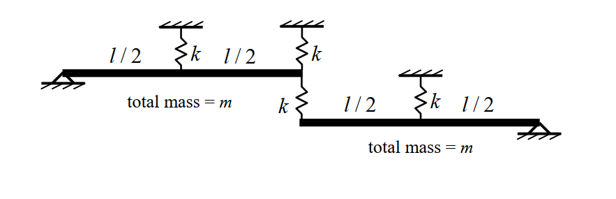
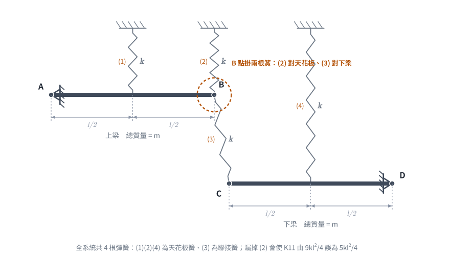
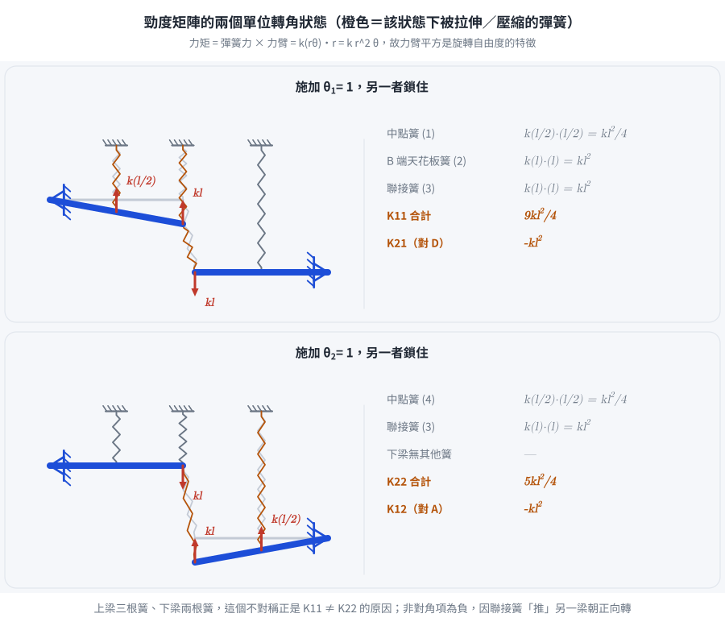
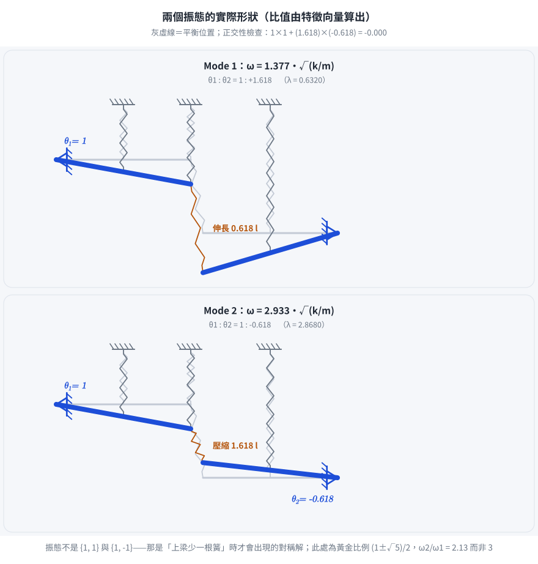

# 考題編號：SD-2016-2

**主分類：** `SD-U1-2` 運動方程式推導
**副分類：** `SD-U1-3` 單自由度、多自由度系統之動態分析及應用
**分析方法：** MDOF模態分析
**標籤：** `MDOF` `2自由度` `剛性梁` `旋轉DOF` `質量矩陣` `勁度矩陣` `特徵值問題` `自然頻率` `振態向量` `聯接彈簧` `直接勁度法` `黃金比例振態`

---

## 1. 原始題目重述 (Problem Restatement)

### 題幹原文

> 圖中之梁皆為質量均勻之剛性梁，且每支剛性梁的總質量皆為 $m$，試回答以下問題：
> (一) 質量矩陣。（6 分）　(二) 勁度矩陣。（6 分）　(三) 結構系統的自然振動頻率（直接以符號表示）。（8 分）

### 結構描述（依附圖逐一清點彈簧）

兩支均勻剛性梁（rigid beam），每支總質量皆為 $m$、長度皆為 $l$，所有彈簧勁度皆為 $k$。
**全系統共 4 根彈簧：3 根天花板彈簧 ＋ 1 根聯接彈簧。**

**上梁（Upper Beam，A→B）：**

- 左端 A：鉸支承（pin），為旋轉自由度 $\theta_1$（正方向：右端向下）
- 中點（距 A 為 $l/2$）：天花板彈簧 $k$ ①
- 右端 B（距 A 為 $l$）：**同時接兩根彈簧** —— 向上的天花板彈簧 $k$ ②，以及向下接至下梁左端 C 的聯接彈簧 $k$ ③

**下梁（Lower Beam，C→D）：**

- 左端 C（距 D 為 $l$）：聯接彈簧 $k$ ③（來自上梁 B 端）
- 中點（距 D 為 $l/2$）：天花板彈簧 $k$ ④
- 右端 D：鉸支承（pin），為旋轉自由度 $\theta_2$（正方向：左端向下）



*圖說：附圖上排標註順序為「$l/2$ — $k$ — $l/2$ — $k$」，代表上梁自左端鉸支承起算 $l/2$ 處有一天花板彈簧，再 $l/2$（即右端 B）**又有一根天花板彈簧**；B 點下方再以聯接彈簧 $k$ 接至下梁左端 C。附圖下排標註為「$k$ — $l/2$ — $k$ — $l/2$」，代表下梁自左端 C（接聯接彈簧）起算 $l/2$ 處有一天花板彈簧，再 $l/2$ 至右端鉸支承 D。廣義座標：$\theta_1$（上梁繞 A，正 = 右端向下）、$\theta_2$（下梁繞 D，正 = 左端向下）。*

> ⚠ **讀圖關鍵：上梁右端 B 是「一點兩簧」**——上方天花板彈簧與下方聯接彈簧共用同一節點。
> 漏掉 B 點的天花板彈簧，會把 $K_{11}$ 從 $9kl^2/4$ 誤算成 $5kl^2/4$，並得到一組「看起來很漂亮」但錯誤的答案（$\omega_2=3\omega_1$）。



*圖 1　逐點清點彈簧。編號 (1)(2)(4) 為天花板簧、(3) 為聯接簧，共 4 根；橙色虛線圈標出 B 點是「一點兩簧」。漏掉 (2) 會使 $K_{11}$ 由 $9kl^2/4$ 誤為 $5kl^2/4$，並得到 $\omega_2 = 3\omega_1$ 這種漂亮但錯誤的答案。*

### 子問題

- **(一)** 質量矩陣（6 分）
- **(二)** 勁度矩陣（6 分）
- **(三)** 結構系統的自然振動頻率（直接以符號表示）（8 分）

---

## 2. 考題核心精神與出題者意圖 (Core Concepts & Examiner's Intent)

### 核心觀念

本題是 MDOF **旋轉自由度（rotational DOF）** 系統的完整矩陣推導題，重點在於：

1. **能量法建立質量矩陣**：均勻剛性梁繞端點的轉動慣量 $I = ml^2/3$，是本題質量矩陣的唯一來源
2. **直接勁度法建立勁度矩陣**：對每一廣義座標施加單位轉角，計算各彈簧力對支點的力矩
3. **正確清點彈簧與力臂**：本題的難度**不在數學而在讀圖**——彈簧總共幾根、各在什麼位置、力臂多長

### 出題者意圖

- 測試考生能否**正確識別廣義座標**（旋轉 $\theta$，而非線位移）
- 測試「**同一節點掛多根彈簧**」時，各簧是否都被計入（B 點的天花板彈簧最常被漏掉）
- 聯接彈簧（connecting spring）的**雙向力矩貢獻**是第二常見的失誤點
- 系統雖幾何上「看似對稱」，但上梁多一根天花板彈簧，故 $K_{11}\neq K_{22}$；答案不是整數倍關係，出現 $\sqrt5$ 是正常的

---

## 3. 解題戰略地圖與陷阱分析 (Strategic Roadmap & Trap Analysis)

### 步驟作戰計畫

```
Step 0（讀圖）  : 逐點清點彈簧 → 上梁：中點 k、右端 B 有 k（天花板）+ k（聯接）
                              下梁：左端 C 有 k（聯接）、中點 k
Step 1（質量矩陣）: 每支梁繞端點的轉動慣量 I = ml²/3 → 無耦合 → [M] = (ml²/3)·I₂
Step 2（勁度矩陣）: 施加 θ₁=1, θ₂=0 → 各簧變形 → 對 A 取力矩 → K₁₁；對 D 取力矩 → K₂₁
                   施加 θ₂=1, θ₁=0 → 各簧變形 → 對 D 取力矩 → K₂₂；對 A 取力矩 → K₁₂
Step 3（自然頻率）: 令 λ = ω²m/(3k) → det([K]-ω²[M])=0 → 解二次式 → ω₁, ω₂
```

### 關鍵陷阱

| # | 陷阱 | 錯誤做法 | 正確做法 |
|---|------|---------|---------|
| 1 | **漏掉上梁右端 B 的天花板彈簧** | $K_{11} = kl^2/4 + kl^2 = 5kl^2/4$ | B 點有兩根簧：$K_{11} = kl^2/4 + kl^2 + kl^2 = 9kl^2/4$ |
| 2 | 質量矩陣誤用線位移慣量 | 用 $I = ml^2/12$（繞質心）或直接用 $m$ | 繞**端點** $I = ml^2/3$（平行軸定理：$ml^2/12 + m(l/2)^2$） |
| 3 | 聯接彈簧只算一個方向 | $K_{12} = 0$（忘記聯接彈簧對另一支梁的作用） | 聯接彈簧同時出現在 $K_{11}$、$K_{12}$、$K_{21}$、$K_{22}$ |
| 4 | 聯接彈簧非對角項符號錯誤 | $K_{12} = +kl^2$ | 由 Newton 第三定律，該力對另一梁產生**順其正向**的力矩 → $K_{12} = K_{21} = -kl^2$ |
| 5 | 以為結構對稱而硬套 $K_{11}=K_{22}$ | 直接寫 $\lambda = a\pm b$ | 上梁多一根簧 → $K_{11}\neq K_{22}$，必須老實解二次式 |

---

## 3.5 變數層次分析 (Variable Hierarchy Analysis)

> 複習提示：第一次解題後，在每個卡住的知識點旁標記 `⚠`；第二次複習時只看有 `⚠` 的項目。

### 最終目標

`求 [M]、[K]，以及系統兩個自然振動頻率 ω₁、ω₂（以符號 m、k 表示）`

### 本題關鍵公式（依計算順序）

> $\boxed{\cdot}$ = 需由前步驟推導，非題目直接給定的變數

$$\text{Step 1（轉動慣量，均勻梁繞端點）：}\quad I = \frac{ml^2}{12} + m\!\left(\frac{l}{2}\right)^2 = \frac{ml^2}{3}$$

$$\text{Step 2（質量矩陣）：}\quad [M] = \boxed{I}\begin{bmatrix}1 & 0 \\ 0 & 1\end{bmatrix} = \frac{ml^2}{3}\begin{bmatrix}1 & 0 \\ 0 & 1\end{bmatrix}$$

$$\text{Step 3（勁度係數 = 單位轉角下的恢復力矩）：}\quad K_{ij} = \sum_{\text{簧}} k\,\delta_i\,r_j$$

$$K_{11} = \underbrace{k\left(\tfrac{l}{2}\right)^2}_{\text{中點簧}} + \underbrace{k\,l^2}_{\text{B 端天花板簧}} + \underbrace{k\,l^2}_{\text{聯接簧}} = \frac{9kl^2}{4}$$

$$K_{22} = \underbrace{k\left(\tfrac{l}{2}\right)^2}_{\text{中點簧}} + \underbrace{k\,l^2}_{\text{聯接簧}} = \frac{5kl^2}{4},\qquad K_{12}=K_{21} = -kl^2$$

$$\text{Step 4（特徵方程，令 }\lambda = \tfrac{\omega^2 m}{3k}\text{）：}\quad \left(\tfrac94-\lambda\right)\!\left(\tfrac54-\lambda\right) - 1 = 0 \;\Longrightarrow\; 16\lambda^2 - 56\lambda + 29 = 0$$

$$\text{Step 5（特徵值）：}\quad \lambda_{1,2} = \frac{7 \mp 2\sqrt5}{4}$$

$$\text{Step 6（自然頻率）：}\quad \omega_i = \sqrt{\frac{3k}{m}\,\boxed{\lambda_i}} = \frac{1}{2}\sqrt{\frac{\left(21\mp 6\sqrt5\right)k}{m}}$$

$$\text{Step 7（振態）：}\quad \frac{\phi_2}{\phi_1} = \frac94 - \boxed{\lambda_i}$$

### L1：題目直接給定

| 符號 | 數值 | 說明 |
|------|------|------|
| $m$ | —（符號） | 每支剛性梁的**總質量** |
| $l$ | —（符號） | 每支梁的長度 |
| $k$ | —（符號） | 每根彈簧的勁度（4 根皆同） |
| 支承 | 鉸支承 | 上梁左端 A、下梁右端 D |
| 彈簧位置 | 見附圖 | 上梁中點、上梁右端 B（天花板）、B–C 聯接、下梁中點 |

### L2：需知識點推導

**Step 1：轉動慣量**

| 符號 | 公式／來源 | 卡關? |
|------|----------|:-----:|
| $I_{cm}$ | $ml^2/12$（均勻梁繞質心，標準公式） | |
| $I_{\text{端點}}$ | $I_{cm} + m(l/2)^2 = ml^2/12 + ml^2/4 = ml^2/3$（平行軸定理） | |

**Step 2：質量矩陣**

| 符號 | 公式／來源 | 卡關? |
|------|----------|:-----:|
| $M_{11}$ | $I_A = ml^2/3$（上梁繞 A） | |
| $M_{22}$ | $I_D = ml^2/3$（下梁繞 D） | |
| $M_{12}$ | $0$（兩梁各自獨立轉動，廣義慣性力無耦合） | |

**Step 3：施加 $\theta_1=1,\ \theta_2=0$**

| 符號 | 公式／來源 | 卡關? |
|------|----------|:-----:|
| $\delta_{\text{mid},1}$ | 上梁中點位移 $=(l/2)\theta_1 = l/2$ | |
| $\delta_B$ | 上梁右端位移 $= l\,\theta_1 = l$ | |
| $\delta_C$ | $0$（$\theta_2=0$） | |
| 中點簧力矩（對 A） | $k(l/2)\cdot(l/2) = kl^2/4$ | |
| B 端天花板簧力矩（對 A） | $k\,l\cdot l = kl^2$ | |
| 聯接簧力矩（對 A） | 壓縮 $l$ → 推 B 向上 $kl$，力臂 $l$ → $kl^2$ | |
| $K_{11}$ | $kl^2/4 + kl^2 + kl^2 = 9kl^2/4$ | |
| $K_{21}$ | 聯接簧推 C **向下** $kl$（Newton 第三定律），力臂 $l$，方向同 $+\theta_2$ → $-kl^2$ | |

**Step 4：施加 $\theta_2=1,\ \theta_1=0$**

| 符號 | 公式／來源 | 卡關? |
|------|----------|:-----:|
| $\delta_C$ | $l\,\theta_2 = l$；$\delta_{\text{mid},2} = l/2$ | |
| $K_{22}$ | $kl^2/4 + kl^2 = 5kl^2/4$（下梁**只有兩根簧**） | |
| $K_{12}$ | $-kl^2$（$=K_{21}$，對稱矩陣自我驗算 ✓） | |

**Step 5：特徵值與頻率**

| 符號 | 公式／來源 | 卡關? |
|------|----------|:-----:|
| $\lambda$ | 令 $\lambda = \omega^2 (ml^2/3)/(kl^2) = \omega^2 m/(3k)$ | |
| 特徵方程 | $(9/4-\lambda)(5/4-\lambda) - 1 = 0$ | |
| 展開 | $\lambda^2 - \tfrac72\lambda + \tfrac{29}{16} = 0$，即 $16\lambda^2-56\lambda+29=0$ | |
| $\lambda_{1,2}$ | $\dfrac{56 \mp \sqrt{56^2-4\cdot16\cdot29}}{32} = \dfrac{56\mp16\sqrt5}{32} = \dfrac{7\mp2\sqrt5}{4}$ | |
| $\omega_i$ | $\sqrt{3k\lambda_i/m}$ | |

### L3：深層知識（不懂就卡住）

| 知識點 | 說明 | 卡關? |
|--------|------|:-----:|
| 均勻梁轉動慣量（繞端點） | $I = ml^2/3$，由平行軸定理自 $ml^2/12$ 推得；不可用 $m$ 或 $ml^2/12$ | |
| 勁度係數的物理定義 | $K_{ij}$ ＝ 令 $q_j=1$、其餘為 $0$ 時，為維持此變形所需施於 $q_i$ 的**廣義力（力矩）** | |
| 彈簧力矩 $=k\delta\cdot r$ 的來源 | 力 $= k\times$（該點位移 $\delta = r\theta$），力矩 $=$ 力 $\times$ 力臂 $r$ → $k r^2\theta$；**力臂平方**是旋轉 DOF 的特徵 | |
| 聯接彈簧的「雙向」耦合 | 同一根簧同時貢獻 $K_{11}$、$K_{22}$ 的正項與 $K_{12}=K_{21}$ 的負項；只計一邊必錯 | |
| 幾何對稱 ≠ 勁度對稱 | 兩梁長度質量相同，但上梁多一根天花板簧 → $K_{11}\neq K_{22}$；不可直接套 $\lambda = a\pm b$ | |
| 振態的物理判讀 | 低頻模態讓「較軟的自由度」動得多（本題下梁 $K_{22}$ 較小，故 $\phi_2>\phi_1$） | |

---

## 4. 步驟化詳細計算過程 (Step-by-Step Detailed Calculation)

> 📊 互動圖（振態動畫）：`SD-2016-2-modal-viz.html`

### (一) 質量矩陣（6 分）

**廣義座標定義：**

$$q_1 = \theta_1\ \text{（上梁繞 A 旋轉，正 = 右端向下）},\qquad q_2 = \theta_2\ \text{（下梁繞 D 旋轉，正 = 左端向下）}$$

**均勻剛性梁繞端點的轉動慣量：**

$$I = \underbrace{\frac{1}{12}ml^2}_{\text{繞質心}} + \underbrace{m\!\left(\frac{l}{2}\right)^2}_{\text{平行軸定理}} = \frac{1}{12}ml^2 + \frac14 ml^2 = \frac{ml^2}{3}$$

**系統動能：**

$$T = \frac12 I_A\dot\theta_1^2 + \frac12 I_D\dot\theta_2^2 = \frac12\cdot\frac{ml^2}{3}\dot\theta_1^2 + \frac12\cdot\frac{ml^2}{3}\dot\theta_2^2$$

兩梁各繞自己的鉸支承轉動，動能中無交叉項：

$$\boxed{[M] = \frac{ml^2}{3}\begin{bmatrix}1 & 0 \\ 0 & 1\end{bmatrix}}$$

---

### (二) 勁度矩陣（6 分）

**策略：** 直接勁度法（逐一施加單位廣義位移，計算所需的廣義恢復力矩）。
**通則：** 位於距支點 $r$ 處的彈簧，在單位轉角下位移 $\delta = r$，彈簧力 $= kr$，對支點力矩 $= kr^2$。

#### 求 $K_{11}$ 與 $K_{21}$（施加 $\theta_1 = 1,\ \theta_2 = 0$）

各關鍵點位移（向下為正）：

| 位置 | 距支點 | 位移 |
|------|--------|------|
| 上梁中點 | $l/2$（距 A） | $\delta = l/2$ |
| 上梁右端 B | $l$（距 A） | $\delta_B = l$ |
| 下梁左端 C | — | $\delta_C = 0$（$\theta_2=0$） |

三根作用於上梁的彈簧：

1. **中點天花板簧**：伸長 $l/2$ → 拉 B 側向上，力 $k(l/2)$，力臂 $l/2$ → 恢復力矩 $kl^2/4$
2. **B 端天花板簧**：伸長 $l$ → 力 $kl$（向上），力臂 $l$ → 恢復力矩 $kl^2$
3. **聯接簧 B–C**：長度縮短 $\delta_B - \delta_C = l$（受壓）→ 對 B 施力 $kl$（向上），力臂 $l$ → 恢復力矩 $kl^2$

$$\boxed{K_{11} = \frac{kl^2}{4} + kl^2 + kl^2 = \frac{9kl^2}{4}}$$

> **策略註解：** 這一項就是全題勝負所在。$B$ 點掛了兩根簧，**天花板簧與聯接簧各貢獻一個 $kl^2$**。

對下梁繞 D 取力矩：聯接簧被壓縮，依 Newton 第三定律對 C 施加**向下**力 $kl$，力臂 $l$（C 距 D 為 $l$），方向與 $+\theta_2$（左端向下）相同：

$$\boxed{K_{21} = -(kl)\cdot l = -kl^2}$$

（負號表示：此力矩驅使下梁朝 $+\theta_2$ 轉動，故要維持 $\theta_2=0$ 必須外加 $-kl^2$）

#### 求 $K_{12}$ 與 $K_{22}$（施加 $\theta_2 = 1,\ \theta_1 = 0$）

各關鍵點位移（向下為正）：$\delta_C = l$，$\delta_{\text{mid},2} = l/2$，$\delta_B = 0$。

作用於下梁的彈簧**只有兩根**：

1. **中點天花板簧**：力 $k(l/2)$，力臂 $l/2$ → 恢復力矩 $kl^2/4$
2. **聯接簧 B–C**：長度增加 $\delta_C - \delta_B = l$（受拉）→ 拉 C 向上，力 $kl$，力臂 $l$ → 恢復力矩 $kl^2$

$$\boxed{K_{22} = \frac{kl^2}{4} + kl^2 = \frac{5kl^2}{4}}$$

對上梁繞 A 取力矩：聯接簧受拉，對 B 施加**向下**力 $kl$，力臂 $l$，方向與 $+\theta_1$（右端向下）相同：

$$K_{12} = -kl^2 = K_{21}\quad\checkmark\ \text{（對稱矩陣，自我驗算通過）}$$



*圖 2　勁度矩陣兩行的物理意義。橙色是該狀態下真正被拉伸／壓縮的彈簧：$\theta_1=1$ 時有三根、$\theta_2=1$ 時只有兩根，這個不對稱就是 $K_{11} \neq K_{22}$ 的來源。非對角項為負，因為聯接簧是「推」另一支梁朝其正向轉。*

**勁度矩陣：**

$$\boxed{[K] = kl^2\begin{bmatrix}\dfrac94 & -1 \\[4pt] -1 & \dfrac54\end{bmatrix}}$$

**正定性驗算：** $K_{11}>0$ 且 $\det[K] = \left(\frac94\cdot\frac54 - 1\right)k^2l^4 = \frac{29}{16}k^2l^4 > 0$ ✓

---

### (三) 自然振動頻率（8 分）

**特徵值問題：**

$$\det\bigl([K] - \omega^2[M]\bigr) = 0$$

$$\det\left[kl^2\begin{pmatrix}\dfrac94 & -1 \\[4pt] -1 & \dfrac54\end{pmatrix} - \omega^2\cdot\dfrac{ml^2}{3}\begin{pmatrix}1 & 0 \\ 0 & 1\end{pmatrix}\right] = 0$$

令無因次特徵值

$$\lambda \equiv \frac{\omega^2 m}{3k}$$

則公因子 $kl^2$ 可完全消去（**注意：$l$ 自動消失，頻率與梁長無關**）：

$$\det\begin{bmatrix}\dfrac94-\lambda & -1 \\[4pt] -1 & \dfrac54-\lambda\end{bmatrix} = 0$$

$$\left(\frac94-\lambda\right)\!\left(\frac54-\lambda\right) - 1 = 0$$

展開：

$$\lambda^2 - \frac{14}{4}\lambda + \frac{45}{16} - 1 = 0 \;\Longrightarrow\; \lambda^2 - \frac72\lambda + \frac{29}{16} = 0 \;\Longrightarrow\; 16\lambda^2 - 56\lambda + 29 = 0$$

$$\lambda = \frac{56 \pm \sqrt{56^2 - 4(16)(29)}}{2(16)} = \frac{56 \pm \sqrt{3136-1856}}{32} = \frac{56 \pm \sqrt{1280}}{32} = \frac{56 \pm 16\sqrt5}{32}$$

$$\boxed{\lambda_1 = \frac{7-2\sqrt5}{4} \approx 0.6320,\qquad \lambda_2 = \frac{7+2\sqrt5}{4} \approx 2.8680}$$

**驗算（Vieta）：** $\lambda_1+\lambda_2 = \dfrac{14}{4} = \dfrac94+\dfrac54$ ✓（＝跡）；$\lambda_1\lambda_2 = \dfrac{29}{16} = \det$ ✓

**自然頻率：** 由 $\omega^2 = \dfrac{3k}{m}\lambda$

$$\boxed{\omega_1 = \sqrt{\frac{3(7-2\sqrt5)}{4}\cdot\frac{k}{m}} = \frac12\sqrt{\frac{(21-6\sqrt5)k}{m}} \approx 1.377\sqrt{\frac{k}{m}}}$$

$$\boxed{\omega_2 = \sqrt{\frac{3(7+2\sqrt5)}{4}\cdot\frac{k}{m}} = \frac12\sqrt{\frac{(21+6\sqrt5)k}{m}} \approx 2.933\sqrt{\frac{k}{m}}}$$

（$\omega_2/\omega_1 \approx 2.13$，兩模態頻率相差遠大於 10%，日後若做反應譜組合可用 SRSS）

#### 振態向量（附加資訊，增強理解）

由第一列方程 $\left(\dfrac94-\lambda\right)\phi_1 - \phi_2 = 0$，取 $\phi_1 = 1$：

$$\frac{\phi_2}{\phi_1} = \frac94 - \lambda$$

**Mode 1（$\lambda_1 = \frac{7-2\sqrt5}{4}$，低頻）：**

$$\frac{\phi_2}{\phi_1} = \frac94 - \frac{7-2\sqrt5}{4} = \frac{2+2\sqrt5}{4} = \frac{1+\sqrt5}{2} \approx 1.618$$

$$\{\phi\}_1 = \begin{Bmatrix}1 \\[2pt] \frac{1+\sqrt5}{2}\end{Bmatrix} \approx \begin{Bmatrix}1 \\ 1.618\end{Bmatrix}$$

兩梁**同向**轉動（B 端向下、C 端亦向下），但下梁轉得多（下梁較軟，$K_{22}<K_{11}$）。
聯接簧淨伸長 $= (\phi_2-\phi_1)l = 0.618\,l$。

**Mode 2（$\lambda_2 = \frac{7+2\sqrt5}{4}$，高頻）：**

$$\frac{\phi_2}{\phi_1} = \frac94 - \frac{7+2\sqrt5}{4} = \frac{2-2\sqrt5}{4} = \frac{1-\sqrt5}{2} \approx -0.618$$

$$\{\phi\}_2 = \begin{Bmatrix}1 \\[2pt] \frac{1-\sqrt5}{2}\end{Bmatrix} \approx \begin{Bmatrix}1 \\ -0.618\end{Bmatrix}$$

兩梁**反向**轉動 → 聯接簧被大幅壓縮（變形量 $1.618\,l$），額外勁度使頻率大幅提高。

**正交性驗算（$[M]\propto[I]$，故振態應正交）：**

$$\{\phi\}_1^T\{\phi\}_2 = 1\times1 + 1.618\times(-0.618) = 1 - 1.000 = 0 \quad\checkmark$$

（此為黃金比例的性質：$\varphi\cdot\frac1\varphi = 1$，其中 $\varphi=\frac{1+\sqrt5}{2}$）

**Rayleigh 商反查驗算（Mode 1）：**

$$\omega_1^2 = \frac{\{\phi\}_1^T[K]\{\phi\}_1}{\{\phi\}_1^T[M]\{\phi\}_1} = \frac{kl^2\left[\frac94 - 2(1.618) + \frac54(1.618)^2\right]}{\frac{ml^2}{3}\left[1+(1.618)^2\right]} = \frac{2.2865\,kl^2}{1.2060\,ml^2} = 1.896\frac{k}{m}\quad\checkmark$$

（$\sqrt{1.896} = 1.377$，與上表一致 ✓）



*圖 3　兩個振態的真實形狀，轉角比由特徵向量算出而非畫成好看的 $\pm1$。聯接簧的變形量（Mode 1 伸長 $0.618l$、Mode 2 壓縮 $1.618l$）也是由振態算出的，正好解釋為何 Mode 2 頻率高出一倍有餘（$\omega_2/\omega_1 = 2.13$，不是 3）。*

---

### 結果彙整

| 項目 | 結果 |
|------|------|
| 質量矩陣 | $[M] = \dfrac{ml^2}{3}\begin{bmatrix}1&0\\0&1\end{bmatrix}$ |
| 勁度矩陣 | $[K] = kl^2\begin{bmatrix}9/4&-1\\-1&5/4\end{bmatrix}$ |
| 無因次特徵值 | $\lambda_{1,2} = \dfrac{7\mp2\sqrt5}{4} = 0.6320,\ 2.8680$ |
| 第一自然頻率 | $\omega_1 = \frac12\sqrt{(21-6\sqrt5)k/m} \approx 1.377\sqrt{k/m}$ |
| 第二自然頻率 | $\omega_2 = \frac12\sqrt{(21+6\sqrt5)k/m} \approx 2.933\sqrt{k/m}$ |
| 第一振態 | $\{1,\ \frac{1+\sqrt5}{2}\}^T \approx \{1,\ 1.618\}^T$（同向） |
| 第二振態 | $\{1,\ \frac{1-\sqrt5}{2}\}^T \approx \{1,\ -0.618\}^T$（反向） |

---

## 5. 關鍵爭議點與進階探討 (Critical Issues & Advanced Discussion)

### 5.1 均勻梁轉動慣量的推導

$$I_{\text{端點}} = \underbrace{\frac{1}{12}ml^2}_{\text{繞質心}} + \underbrace{m\left(\frac{l}{2}\right)^2}_{\text{平行軸定理}} = \frac{1}{12}ml^2 + \frac{1}{4}ml^2 = \frac{1}{3}ml^2\quad\checkmark$$

考場上最安全的做法：從 $I_{cm} = ml^2/12$ 開始，明確寫出平行軸定理。

### 5.2 讀圖：一個節點掛幾根彈簧？

附圖上排的標註是「$l/2\ \ k\ \ l/2\ \ k$」——**四個記號、兩根天花板彈簧**。
第二個 $k$ 畫在上梁右端的正上方，其下方緊接著另一根 $k$ 向下連到下梁。也就是說：

$$\text{B 點} = \underbrace{\text{天花板彈簧}}_{\text{對地}} + \underbrace{\text{聯接彈簧}}_{\text{對下梁}}$$

**判別法：** 順著梁的軸線從支承端逐段走，每遇到一個彈簧符號就記一筆；接著檢查每個節點的**上方與下方**是否各有彈簧。本題若只走一遍軸線而不看節點上下，就會漏掉 B 點的天花板簧。

漏算的後果：$K_{11}$ 由 $9kl^2/4$ 變成 $5kl^2/4$，矩陣變成 $\begin{bmatrix}5/4&-1\\-1&5/4\end{bmatrix}$，特徵值變成 $1/4$ 與 $9/4$，得到 $\omega_2 = 3\omega_1$ 這種「整齊到令人安心」的假答案——**答案漂亮不等於答案正確**。

### 5.3 聯接彈簧的符號判斷

非對角元素 $K_{12} = K_{21} = -kl^2 < 0$ 的物理意義：
當上梁右端 B 被壓下時，聯接簧把下梁左端 C 也**往下推**，也就是驅使 $\theta_2$ 朝**正向**增加。
既然彈簧幫忙推而不是拉回，要維持 $\theta_2 = 0$ 就得外加一個負力矩 → $K_{21}<0$。

### 5.4 模態的物理意義

| 模態 | 振態 $\{\theta_1,\theta_2\}$ | 頻率 | 聯接彈簧變形 | 物理意象 |
|------|------------------------------|------|--------------|---------|
| Mode 1 | $\{1,\ 1.618\}$ | $1.377\sqrt{k/m}$ | 伸長 $0.618\,l$ | 兩梁同向擺動，下梁（較軟）動得多，低頻 |
| Mode 2 | $\{1,\ -0.618\}$ | $2.933\sqrt{k/m}$ | 壓縮 $1.618\,l$ | 兩梁反向擺動，聯接簧全力抵抗，高頻 |

由於上梁多一根天花板彈簧（$K_{11} > K_{22}$），系統不再具備「同相／反相」的完美對稱模態；
取而代之的是低頻模態偏向**下梁主導**、高頻模態偏向**上梁主導**。

### 5.5 答案的量綱驗算

$$[\omega] = \left[\sqrt{\frac{kl^2}{ml^2}}\right] = \left[\sqrt{\frac{k}{m}}\right] = \sqrt{\frac{\text{N/m}}{\text{kg}}} = \sqrt{\frac{1}{\text{s}^2}} = \text{rad/s}\quad\checkmark$$

注意 $l^2$ 在 $[K]$ 與 $[M]$ 中同時出現而相消，故**頻率與梁長 $l$ 無關**——這也是一個好用的自我檢查：若你的答案裡還留著 $l$，一定算錯了。

---

## 修正紀錄

| 日期 | 修正內容 | 理由／驗證 |
|------|---------|-----------|
| 2026-08-22 | **$K_{11}$ 由 $5kl^2/4$ 更正為 $9kl^2/4$**（補回上梁右端 B 的天花板彈簧） | 放大檢視 `SD-2016-2-fig-1.png` 並比對考卷文字排版「$l/2\ k\ l/2\ k$／$k\ l/2\ k\ l/2$」：上梁共有 **2 根天花板簧**（中點＋右端），原解只計入中點那一根 |
| 2026-08-22 | 特徵值由 $\lambda=1/4,\ 9/4$ 更正為 $\lambda=\frac{7\mp2\sqrt5}{4}$；頻率由 $\omega_1=\frac12\sqrt{3k/m},\ \omega_2=3\omega_1$ 更正為 $\omega_1\approx1.377\sqrt{k/m},\ \omega_2\approx2.933\sqrt{k/m}$ | 由更正後的 $[K]$ 重解 $16\lambda^2-56\lambda+29=0$；以跡／行列式（Vieta）及 Rayleigh 商雙重對帳 |
| 2026-08-22 | 振態由 $\{1,1\}$、$\{1,-1\}$ 更正為 $\{1,\frac{1+\sqrt5}{2}\}$、$\{1,\frac{1-\sqrt5}{2}\}$ | 由更正後特徵值代回求得；以 $\{\phi\}_1^T\{\phi\}_2=0$ 正交性驗算通過 |
| 2026-08-22 | §1 結構描述、§2、§3 陷阱表、§3.5 全部、§5.2～5.4 依新結果改寫；新增「讀圖：一個節點掛幾根彈簧？」 | 原文多處以「結構對稱、$K_{11}=K_{22}$、答案整齊」為賣點，該敘述本身即為錯誤的來源 |
| 2026-08-22 | 同步更新 `SD-2016-2-modal-viz.html`（補畫 B 端天花板彈簧、改用正確振態比與頻率、修正上下梁的相對位置） | 原互動圖依舊解繪製 |

> $[M] = \frac{ml^2}{3}[I]$、$K_{22}=5kl^2/4$、$K_{12}=K_{21}=-kl^2$ 經重新驗算正確，未更動。

---

*圖解補繪：2026-08-22（向量圖，由 `gen_SD-2016-2.py` 以程式碼繪製，所有幾何與數值由解題結果算出，可重跑）*
