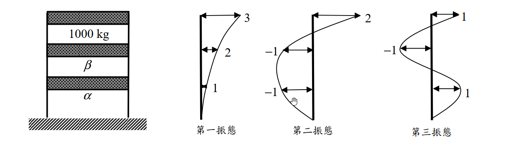

# 考題編號：SD-2016-3

**主分類：** `SD-U1-3` 單自由度、多自由度系統之動態分析及應用
**副分類：** `SD-U1-1` 結構動力基本性質及原理
**分析方法：** 概念題（含計算）
**標籤：** `MDOF` `3自由度` `剪力建築` `模態正交性` `振態向量` `質量矩陣逆推` `已知振態求質量` `M正交性條件`

---

## 1. 原始題目重述 (Problem Restatement)

### 結構描述

三層樓建築物，各層質量如下：
- 第一層（底層）：質量 $\alpha$（待求）
- 第二層（中層）：質量 $\beta$（待求）
- 第三層（頂層）：質量 $m = 10^3\ \text{kg} = 1000\ \text{kg}$（已知）

三個振態的樓層位移示意如圖所示（自由度編號由底層至頂層：$u_1, u_2, u_3$）：



*圖說：第一振態 $\{\phi_1\} = \{1,\ 2,\ 3\}^T$（各層同向，由底至頂遞增）；第二振態 $\{\phi_2\} = \{-1,\ -1,\ 2\}^T$（底層與中層反向，頂層正向）；第三振態 $\{\phi_3\} = \{1,\ -1,\ 1\}^T$（底層正向、中層反向、頂層正向）。*

### 子問題

- **（一）** 求第一層和第二層的質量為何，亦即 $\alpha = ?\ \beta = ?$（10 分）
- **（二）** 說明計算原理（5 分）

---

## 2. 考題核心精神與出題者意圖 (Core Concepts & Examiner's Intent)

### 核心觀念

本題是「**已知振態，逆向求質量**」的模態正交性應用題。核心工具：

$$\{\phi_i\}^T [M] \{\phi_j\} = 0 \quad (i \neq j)$$

此條件由結構動力學的運動方程式推導而來（特徵值問題的固有性質），稱為振態的**質量正交性（M-orthogonality）**。

### 出題者意圖

- 考驗考生「正交性條件能反向利用」的靈活度：通常我們先知道 $[M]$ 再求 $\{\phi\}$，本題反其道而行
- 從三個振態中選任兩對（最自然的選法：振態一分別與振態二、三配對），各得一條線性方程，聯立解出兩個未知數
- 「說明計算原理」（5分）要求考生清楚陳述**模態正交性的物理基礎**：不同自然頻率對應的振態在質量矩陣（或剛度矩陣）意義下互相正交

---

## 3. 解題戰略地圖與陷阱分析 (Strategic Roadmap & Trap Analysis)

### 步驟作戰計畫

```
Step 1: 確認振態向量（由圖讀取各樓層的相對位移值及方向）
Step 2: 寫出正交性條件 {φ₁}ᵀ[M]{φ₂} = 0 → 第一個線性方程（含 α, β）
Step 3: 寫出正交性條件 {φ₁}ᵀ[M]{φ₃} = 0 → 第二個線性方程（含 α, β）
Step 4: 聯立求解 α 和 β
Step 5: 說明原理（模態正交性的推導依據）
```

### 關鍵陷阱

| # | 陷阱 | 錯誤做法 | 正確做法 |
|---|------|---------|---------|
| 1 | 振態方向符號讀錯 | 把 $\{-1,-1,2\}$ 讀為 $\{1,1,2\}$ | 圖中向左為負，向右為正，認真判斷符號 |
| 2 | 樓層與振態分量對應錯誤 | 把第三層的值對應到 $\alpha$（底層） | $u_1 = \alpha$（底層），$u_3 = m = 1000\ \text{kg}$（頂層） |
| 3 | 正交性條件列錯 | 寫成 $\{\phi\}^T\{\phi\} = 0$（未加 $[M]$） | 必須是 $\{\phi_i\}^T [M] \{\phi_j\} = 0$（**質量加權正交**） |
| 4 | 三條方程只用一條 | 只用一個振態對求解（方程不足） | 需兩個獨立方程（2 個未知數 → 需 2 條正交性條件） |

---

## 3.5 變數層次分析 (Variable Hierarchy Analysis)

> 複習提示：第一次解題後，在每個卡住的知識點旁標記 `⚠`；第二次複習時只看有 `⚠` 的項目。

### 最終目標

`由三個已知振態，利用模態正交性，聯立求解底層質量 α 和中層質量 β`

### 本題關鍵公式（依計算順序）

$$\text{Step 1: 模態質量正交性條件}$$

$$\{\phi_i\}^T [M] \{\phi_j\} = 0 \quad (i \neq j)$$

$$\text{Step 2: 展開（振態一 vs 振態二）}$$

$$\phi_{1,1}\cdot\phi_{2,1}\cdot\alpha + \phi_{1,2}\cdot\phi_{2,2}\cdot\beta + \phi_{1,3}\cdot\phi_{2,3}\cdot m = 0$$

$$\text{Step 3: 展開（振態一 vs 振態三）}$$

$$\phi_{1,1}\cdot\phi_{3,1}\cdot\alpha + \phi_{1,2}\cdot\phi_{3,2}\cdot\beta + \phi_{1,3}\cdot\phi_{3,3}\cdot m = 0$$

$$\text{Step 4: 聯立兩方程求 }\alpha\text{ 和 }\beta$$

### L1：題目直接給定

| 符號 | 數值 | 說明 |
|------|------|------|
| $m$ | $1000\ \text{kg}$ | 頂層質量（第三層） |
| $\{\phi_1\}$ | $\{1,\ 2,\ 3\}^T$ | 第一振態（底→頂） |
| $\{\phi_2\}$ | $\{-1,\ -1,\ 2\}^T$ | 第二振態（底→頂） |
| $\{\phi_3\}$ | $\{1,\ -1,\ 1\}^T$ | 第三振態（底→頂） |

### L2：需知識點推導

**Step 1：列出正交性條件（振態一 vs 振態二）**

| 符號 | 公式／來源 | 卡關? |
|------|----------|:-----:|
| $\{\phi_1\}^T[M]\{\phi_2\}$ | $(1)(-1)\alpha + (2)(-1)\beta + (3)(2)(1000) = 0$ | |
| 化簡 | $-\alpha - 2\beta + 6000 = 0$ | |
| 方程 I | $\alpha + 2\beta = 6000$ | |

**Step 2：列出正交性條件（振態一 vs 振態三）**

| 符號 | 公式／來源 | 卡關? |
|------|----------|:-----:|
| $\{\phi_1\}^T[M]\{\phi_3\}$ | $(1)(1)\alpha + (2)(-1)\beta + (3)(1)(1000) = 0$ | |
| 化簡 | $\alpha - 2\beta + 3000 = 0$ | |
| 方程 II | $\alpha - 2\beta = -3000$ | |

**Step 3：聯立求解**

| 符號 | 公式／來源 | 卡關? |
|------|----------|:-----:|
| (I) + (II) | $2\alpha = 3000$ | |
| $\alpha$ | $1500\ \text{kg}$ | |
| $\beta$ | $(6000 - 1500)/2 = 2250\ \text{kg}$ | |

### L3：深層知識（不懂就卡住）

| 知識點 | 說明 | 卡關? |
|--------|------|:-----:|
| 模態質量正交性的推導 | 來自特徵值方程 $[K]\{\phi\} = \omega^2[M]\{\phi\}$；對 $i \neq j$ 互乘後相減，利用 $[K],[M]$ 對稱性即得 $(\omega_i^2-\omega_j^2)\{\phi_i\}^T[M]\{\phi_j\}=0$；因 $\omega_i \neq \omega_j$，故 $\{\phi_i\}^T[M]\{\phi_j\}=0$ | |
| 正交性只適用於不同頻率的振態 | 若 $\omega_i = \omega_j$（退化，重頻），模態不一定正交 | |
| 為何選振態一配對 | 振態一的分量 $\{1,2,3\}$ 全為正，展開後方程較乾淨（兩個未知數各有獨立係數，便於求解） | |

---

## 4. 步驟化詳細計算過程 (Step-by-Step Detailed Calculation)

### (一) 求 α 和 β

#### 建立質量矩陣符號

$$[M] = \begin{bmatrix}\alpha & 0 & 0 \\ 0 & \beta & 0 \\ 0 & 0 & m\end{bmatrix}, \quad m = 1000\ \text{kg}$$

自由度順序：$u_1$（第一層，質量 $\alpha$），$u_2$（第二層，質量 $\beta$），$u_3$（第三層，質量 $m$）。

振態向量（由圖讀取，底層至頂層）：

$$\{\phi_1\} = \begin{Bmatrix}1\\2\\3\end{Bmatrix},\quad
\{\phi_2\} = \begin{Bmatrix}-1\\-1\\2\end{Bmatrix},\quad
\{\phi_3\} = \begin{Bmatrix}1\\-1\\1\end{Bmatrix}$$

#### 條件一：振態一與振態二之質量正交性

$$\{\phi_1\}^T [M] \{\phi_2\} = 0$$

$$\begin{bmatrix}1 & 2 & 3\end{bmatrix}
\begin{bmatrix}\alpha & 0 & 0 \\ 0 & \beta & 0 \\ 0 & 0 & 1000\end{bmatrix}
\begin{Bmatrix}-1\\-1\\2\end{Bmatrix} = 0$$

展開：

$$(1)(-1)\alpha + (2)(-1)\beta + (3)(2)(1000) = 0$$

$$-\alpha - 2\beta + 6000 = 0$$

$$\boxed{\alpha + 2\beta = 6000} \quad \cdots \text{(I)}$$

#### 條件二：振態一與振態三之質量正交性

$$\{\phi_1\}^T [M] \{\phi_3\} = 0$$

$$\begin{bmatrix}1 & 2 & 3\end{bmatrix}
\begin{bmatrix}\alpha & 0 & 0 \\ 0 & \beta & 0 \\ 0 & 0 & 1000\end{bmatrix}
\begin{Bmatrix}1\\-1\\1\end{Bmatrix} = 0$$

展開：

$$(1)(1)\alpha + (2)(-1)\beta + (3)(1)(1000) = 0$$

$$\alpha - 2\beta + 3000 = 0$$

$$\boxed{\alpha - 2\beta = -3000} \quad \cdots \text{(II)}$$

#### 聯立求解

方程 (I) 加方程 (II)：

$$2\alpha = 6000 + (-3000) = 3000$$

$$\boxed{\alpha = 1500\ \text{kg}}$$

代回方程 (I)：

$$1500 + 2\beta = 6000 \implies 2\beta = 4500$$

$$\boxed{\beta = 2250\ \text{kg}}$$

---

### (二) 計算原理說明

**模態質量正交性（Modal Mass Orthogonality）**的物理根源如下：

**1. 運動方程的特徵值形式**

對無阻尼自由振動系統 $[M]\ddot{\mathbf{u}} + [K]\mathbf{u} = \mathbf{0}$，設解為 $\mathbf{u}(t) = \{\phi\}e^{i\omega t}$，得到特徵值方程：

$$[K]\{\phi_i\} = \omega_i^2 [M]\{\phi_i\} \quad \cdots (*)$$

**2. 正交性推導**

對第 $i$ 振態方程左乘 $\{\phi_j\}^T$，對第 $j$ 振態方程左乘 $\{\phi_i\}^T$：

$$\{\phi_j\}^T [K] \{\phi_i\} = \omega_i^2 \{\phi_j\}^T [M] \{\phi_i\}$$

$$\{\phi_i\}^T [K] \{\phi_j\} = \omega_j^2 \{\phi_i\}^T [M] \{\phi_j\}$$

由於 $[K]$、$[M]$ 均為對稱矩陣，故：

$$\{\phi_j\}^T [K] \{\phi_i\} = \{\phi_i\}^T [K] \{\phi_j\}$$
$$\{\phi_j\}^T [M] \{\phi_i\} = \{\phi_i\}^T [M] \{\phi_j\}$$

兩式相減：

$$(\omega_i^2 - \omega_j^2)\,\{\phi_i\}^T [M] \{\phi_j\} = 0$$

若 $\omega_i \neq \omega_j$（不同振態對應不同自然頻率），則：

$$\boxed{\{\phi_i\}^T [M] \{\phi_j\} = 0 \quad (i \neq j)}$$

**3. 本題應用**

已知三個振態向量與頂層質量 $m = 1000\ \text{kg}$，質量矩陣中有兩個未知數 $\alpha,\beta$。利用任意兩對振態的正交性，各產生一個線性方程，聯立即可唯一確定 $\alpha$ 和 $\beta$。

---

## 5. 關鍵爭議點與進階探討 (Critical Issues & Advanced Discussion)

### 5.1 選用哪兩對振態？

本題有三對可用的正交性條件：
- 振態 1 × 振態 2：方程 (I)
- 振態 1 × 振態 3：方程 (II)
- 振態 2 × 振態 3：方程 (III)

使用 (I) 和 (II) 聯立，解出 $\alpha = 1500\ \text{kg}$、$\beta = 2250\ \text{kg}$。這是考場上最自然的選法（振態一分量全正，展開式最乾淨）。

### 5.2 三個正交性條件的一致性

理論上，一個物理上可行的 MDOF 系統，其三個振態應對任意質量矩陣均滿足**全部三對**正交性條件。本題只有兩個未知數（$\alpha$, $\beta$），因此三個方程中只有兩個線性獨立，第三個應可由前兩個推導出來（冗餘方程）。

考場上最安全、最推薦的做法：選振態一與振態二、振態一與振態三配對（兩條方程均含 $\alpha$ 和 $\beta$，係數最清楚），聯立求解。

### 5.3 模態正交性的物理直覺

不同振態對應不同的「振動模式」。在結構振動中，不同模式之間不存在能量傳遞——第一振態（整體前後搖擺）與第二振態（高頻局部振動）的動能互相正交。這正是模態疊加法能將多自由度系統解耦成獨立 SDOF 系統的數學基礎。

### 5.4 答案驗算

$$\frac{\alpha}{m} = \frac{1500}{1000} = 1.5, \quad \frac{\beta}{m} = \frac{2250}{1000} = 2.25$$

底層最重（$\alpha > \beta$... 等等，$\alpha = 1500 < \beta = 2250$），實際上**中層最重**。從結構設計角度這是合理的，例如設備機房設在中間層的建築物。

振態一係數 1:2:3 反映了底層到頂層的位移比，此時中層較重（$\beta > \alpha$）使得振態在中層的振幅相對被「壓制」，仍形成單調遞增形狀。
