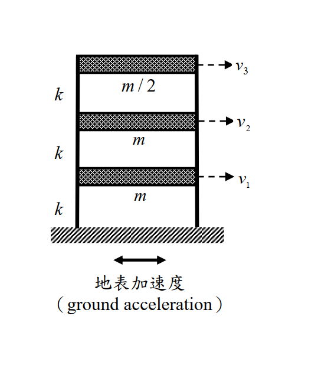
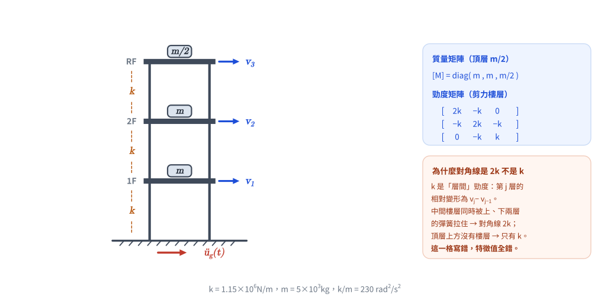
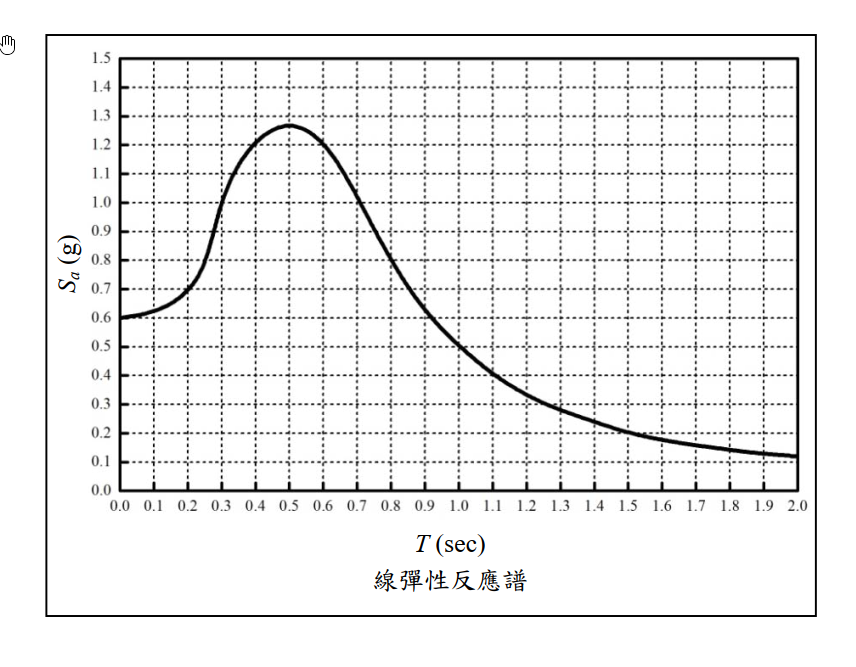
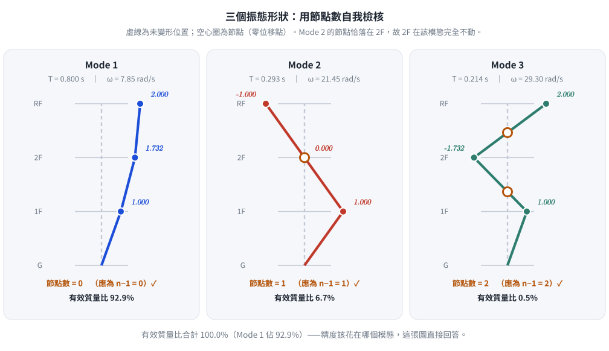
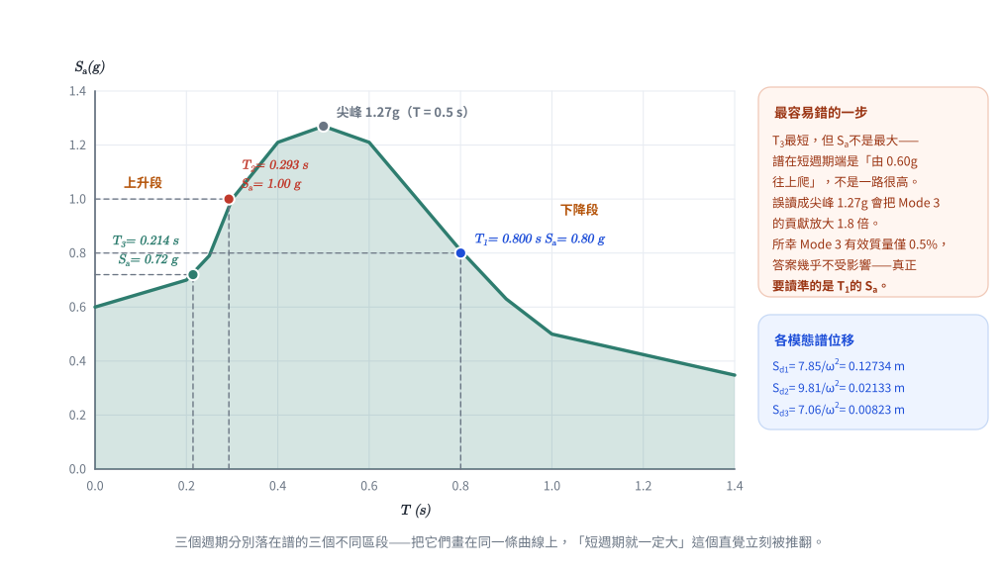
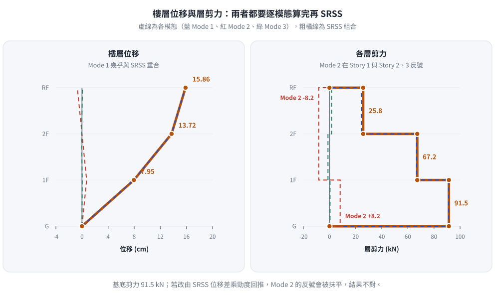

# SD-2016-4 ｜ 三樓剪力建築 — 反應譜 SRSS 耐震分析

**考年：** 2016（民國 105 年）｜**題號：** 第四題｜**配分：** 25 分  
**primaryTopicId：** SD-U2-1｜**analysisMethod：** 模態疊加法 + SRSS 組合

---

## §1 題目重述

如 fig-1 所示，三樓剪力建築（shear frame），各樓層質量與樓層勁度如下：

| 樓層 | 質量 | 層間勁度 |
|------|------|---------|
| 1（地面以上一樓）| $m$ | $k$ |
| 2（二樓）| $m$ | $k$ |
| 3（頂樓）| $m/2$ | $k$ |

**參數：**
$$k = 1.15\times10^6\ \text{N/m},\quad m = 5\times10^3\ \text{kg}$$

已知設計反應譜（彈性，圖 fig-2，$S_a$ 單位 g，$T$ 單位 s），試求：

- **(一) 自然頻率 ω 與振態 {φ}（6 分）**
- **(二) 各樓層位移（SRSS 組合，14 分）**
- **(三) 各層剪力（SRSS 組合，5 分）**

*圖說：三層剪力屋架（shear frame）。自由度 $v_1$（1F）、$v_2$（2F）、$v_3$（RF）由底層向上遞增；集中質量 1F = 2F = $m$、RF = $m/2$；三個樓層的層間總勁度均為 $k = 1.15\times10^6$ N/m；輸入為底部地表加速度（ground acceleration）。*

*圖 1　題目重繪（向量版）。頂層質量是 $m/2$、勁度矩陣對角線是 $2k$ 而非 $k$——這兩件事各自對應一種矩陣寫錯的方式，圖上直接標死。*

*圖說：線彈性加速度反應譜（$S_a$ 以 $g$ 為單位、$T$ 以秒為單位）。$T=0$ 時 $S_a \approx 0.60g$；$T = 0.2$ s 約 $0.70g$、$0.25$ s 約 $0.79g$、$0.3$ s 約 $1.00g$、$0.4$ s 約 $1.21g$；尖峰在 $T \approx 0.5$ s 約 $1.27g$；其後遞減，$0.6$ s 約 $1.21g$、$0.7$ s 約 $1.01g$、$0.8$ s 約 $0.81g$、$0.9$ s 約 $0.63g$、$1.0$ s 約 $0.50g$、$2.0$ s 約 $0.12g$。格線間距為 $T$ 每 0.1 s、$S_a$ 每 0.1g。*

---

## §2 系統矩陣

**自由度：** $v_1$（1F）、$v_2$（2F）、$v_3$（RF），以 ground acceleration 為輸入。

### 質量矩陣

$$[M] = \begin{bmatrix} m & 0 & 0 \\ 0 & m & 0 \\ 0 & 0 & m/2 \end{bmatrix}
= 10^3 \begin{bmatrix} 5 & 0 & 0 \\ 0 & 5 & 0 \\ 0 & 0 & 2.5 \end{bmatrix}\ \text{kg}$$

### 勁度矩陣

三層均為勁度 $k$ 的剪力彈簧（剪力樓層假設）：

$$[K] = k\begin{bmatrix} 2 & -1 & 0 \\ -1 & 2 & -1 \\ 0 & -1 & 1 \end{bmatrix}$$

---

## §3 特徵值問題（自然頻率與振態）

### §3.1 特性多項式推導

令 $\lambda = \omega^2 m/k$，特徵方程式 $\det([K]-\omega^2[M])=0$ 展開：

$$\det\begin{bmatrix} 2-\lambda & -1 & 0 \\ -1 & 2-\lambda & -1 \\ 0 & -1 & 1-\lambda/2 \end{bmatrix} = 0$$

沿第一列展開：

$$
(2-\lambda)\bigl[(2-\lambda)(1-\tfrac\lambda2)-1\bigr] - (1-\tfrac\lambda2) = 0
$$

整理得：

$$\boxed{\lambda^3 - 6\lambda^2 + 9\lambda - 2 = 0}$$

### §3.2 因式分解

嘗試 $\lambda=2$：$8-24+18-2=0$ ✓，因此提出 $(\lambda-2)$：

$$(\lambda-2)(\lambda^2-4\lambda+1) = 0$$

另外兩根由 $\lambda^2-4\lambda+1=0$ 得 $\lambda = 2\pm\sqrt{3}$。

**三個特徵值（由小至大）：**

| 模態 | $\lambda_i$ | 數值 |
|------|-------------|------|
| 1 | $2-\sqrt{3}$ | 0.2679 |
| 2 | $2$ | 2.0000 |
| 3 | $2+\sqrt{3}$ | 3.7321 |

*驗算：* $\lambda_1+\lambda_2+\lambda_3=6$，$\lambda_1\lambda_2\lambda_3=2(4-3)=2$ ✓

### §3.3 自然頻率與週期

$$\frac{k}{m} = \frac{1.15\times10^6}{5\times10^3} = 230\ \text{rad}^2/\text{s}^2$$

$$\omega_i^2 = \lambda_i \cdot \frac{k}{m}$$

| 模態 | $\omega_i^2$（rad²/s²）| $\omega_i$（rad/s）| $T_i$（s）|
|------|----------------------|-------------------|-----------|
| 1 | $(2-\sqrt3)\times230 = 61.62$ | **7.85** | **0.800** |
| 2 | $2\times230 = 460.0$ | **21.45** | **0.293** |
| 3 | $(2+\sqrt3)\times230 = 858.4$ | **29.30** | **0.214** |

### §3.4 振態向量

**Mode 1** ($\lambda_1=2-\sqrt3$)，代入 Row 1 與 Row 3：

$$\sqrt{3}\,\varphi_1 = \varphi_2,\quad \varphi_3 = 2\varphi_1$$

$$\boxed{\{\phi_1\} = \begin{Bmatrix}1\\\sqrt{3}\\2\end{Bmatrix}}$$

驗算 Row 2：$-1+\sqrt3\cdot\sqrt3-2=-1+3-2=0$ ✓

**Mode 2** ($\lambda_2=2$)，Row 1 給 $\varphi_2=0$，Row 2 給 $\varphi_3=-\varphi_1$：

$$\boxed{\{\phi_2\} = \begin{Bmatrix}1\\0\\-1\end{Bmatrix}}$$

驗算 Row 3：$-0+(1-1)(-1)=0$ ✓

**Mode 3** ($\lambda_3=2+\sqrt3$)，Row 1 給 $\varphi_2=-\sqrt3\,\varphi_1$，Row 3 給 $\varphi_3=2\varphi_1$：

$$\boxed{\{\phi_3\} = \begin{Bmatrix}1\\-\sqrt{3}\\2\end{Bmatrix}}$$

驗算 Row 2：$-1+(-\sqrt3)(-\sqrt3)-2=-1+3-2=0$ ✓

**物理意義：**

| 模態 | 形狀特徵 | 有效質量比 |
|------|---------|-----------|
| Mode 1 | 同向、低頻、最大樓頂位移 | **92.9 %** |
| Mode 2 | 1F 與 RF 反向，2F 為節點 | 6.7 % |
| Mode 3 | 1F 與 RF 同向、2F 反向 | 0.5 % |

*圖 2　三個振態形狀。第 $n$ 振態必有 $n-1$ 個節點（零位移點），數一下就知道振態向量有沒有解錯；Mode 2 的節點恰落在 2F，這正是 $\varphi_2 = 0$ 的物理意義。*

---

## §4 SRSS 反應譜分析（各樓層位移）

> 📊 互動圖：`SD-2016-4-spectrum-viz.html`（三個模態週期在反應譜上的落點）

### §4.1 模態參與因子

$$\Gamma_i = \frac{\{\phi_i\}^T[M]\{1\}}{\{\phi_i\}^T[M]\{\phi_i\}}$$

其中 $\{1\}=\{1,1,1\}^T$，$[M]=\text{diag}(m,m,m/2)$。

**Mode 1：**

$$L_1 = 1\cdot m + \sqrt3\cdot m + 2\cdot\frac{m}{2} = m(2+\sqrt3)$$

$$M_1^* = 1^2\cdot m + 3\cdot m + 4\cdot\frac{m}{2} = 6m$$

$$\Gamma_1 = \frac{m(2+\sqrt3)}{6m} = \frac{2+\sqrt3}{6} = 0.6220$$

**Mode 2：**

$$L_2 = m + 0 - \frac{m}{2} = \frac{m}{2},\quad M_2^* = m + 0 + \frac{m}{2} = \frac{3m}{2}$$

$$\Gamma_2 = \frac{m/2}{3m/2} = \frac{1}{3} = 0.3333$$

**Mode 3：**

$$L_3 = m - \sqrt3\,m + m = m(2-\sqrt3)$$

$$M_3^* = 6m\quad(\text{同 }M_1^*)$$

$$\Gamma_3 = \frac{m(2-\sqrt3)}{6m} = \frac{2-\sqrt3}{6} = 0.04467$$

*有效質量驗算：*

$$\sum \frac{L_i^2}{M_i^*} = \frac{m^2(2+\sqrt3)^2}{6m}+\frac{(m/2)^2}{3m/2}+\frac{m^2(2-\sqrt3)^2}{6m} = \frac{5m}{2} = M_{total}\ \checkmark$$

### §4.2 由反應譜讀取 $S_a$

從 fig-2 讀取各模態週期對應之譜加速度。**三個週期分別落在譜的三個不同區段，讀圖時要看清楚位置：**

| 模態 | $T_i$（s）| 在譜上的位置 | $S_{a,i}$（讀圖）|
|------|----------|-------------|-----------------|
| 1 | 0.800 | 尖峰右側下降段 | **0.80 g** |
| 2 | 0.293 | 上升段接近轉折（0.3 s 處 ≈ 1.00 g）| **1.00 g**（圖上約 0.97 g，取 1.00 g）|
| 3 | 0.214 | **上升段起點附近**（0.2 s 處 ≈ 0.70 g）| **0.72 g** |

> ⚠ **最容易錯的一步：** $T_3 = 0.214$ s 位於譜的**上升段**，$S_a$ 僅約 $0.72g$，
> 千萬不要因為「$T_3$ 很短、高頻應該很大」而誤讀成尖峰值（1.27g）或誤抄成 $T_1$ 的 $0.80g$。
> 譜在短週期端是**由 0.60g 往上爬**的，不是一路很高。
>
> **讀圖容差的影響：** 本題主控模態為 Mode 1（有效質量 92.9%），Mode 2、3 合計僅 7.1%，
> 因此 $S_{a,2}$、$S_{a,3}$ 有 ±0.05g 的讀圖誤差時，最終 SRSS 位移與層剪力在三位有效數字內完全不變
> （下方 §4.5、§5.3 已驗證）。**Mode 1 的 $S_{a,1}$ 才是必須讀準的那一個。**

*圖 3　三個週期在反應譜上的落點。$T_3$ 最短卻落在**上升段**，$S_a$ 只有 $0.72g$——把三個週期畫在同一條曲線上，「短週期就一定大」這個直覺立刻被推翻。*

### §4.3 模態譜位移

$$S_{d,i} = \frac{S_{a,i}}{\omega_i^2}$$

| 模態 | $S_{a,i}$ (m/s²) | $\omega_i^2$ (rad²/s²) | $S_{d,i}$ (m) |
|------|-----------------|----------------------|--------------|
| 1 | $0.80\times9.81=7.848$ | 61.62 | **0.12733** |
| 2 | $1.00\times9.81=9.810$ | 460.0 | **0.02133** |
| 3 | $0.72\times9.81=7.063$ | 858.4 | **0.008228** |

### §4.4 各模態樓層位移

$$\{U_i\} = \Gamma_i\cdot S_{d,i}\cdot\{\phi_i\}$$

**Mode 1** （$\Gamma_1 S_{d,1} = 0.6220\times0.12733 = 0.07920$ m）：

$$\{U_1\} = 0.07920\times\begin{Bmatrix}1\\\sqrt3\\2\end{Bmatrix} = \begin{Bmatrix}0.07920\\0.13718\\0.15840\end{Bmatrix}\ \text{m}$$

**Mode 2** （$\Gamma_2 S_{d,2} = 0.3333\times0.02133 = 0.007110$ m）：

$$\{U_2\} = 0.007110\times\begin{Bmatrix}1\\0\\-1\end{Bmatrix} = \begin{Bmatrix}0.007110\\0\\-0.007110\end{Bmatrix}\ \text{m}$$

**Mode 3** （$\Gamma_3 S_{d,3} = 0.04467\times0.008228 = 0.0003675$ m）：

$$\{U_3\} = 0.0003675\times\begin{Bmatrix}1\\-\sqrt3\\2\end{Bmatrix} = \begin{Bmatrix}0.0003675\\-0.0006365\\0.0007350\end{Bmatrix}\ \text{m}$$

### §4.5 SRSS 組合位移

$$v_j = \sqrt{U_{j,1}^2+U_{j,2}^2+U_{j,3}^2}$$

**1F ($v_1$)：**

$$v_1 = \sqrt{0.07920^2+0.007110^2+0.0003675^2} = \sqrt{6.2726\times10^{-3}+5.055\times10^{-5}+1.35\times10^{-7}}$$

$$\boxed{v_1 \approx 0.0795\ \text{m} = 7.95\ \text{cm}}$$

**2F ($v_2$)：**

$$v_2 = \sqrt{0.13718^2+0^2+0.0006365^2} = \sqrt{1.8818\times10^{-2}+4.05\times10^{-7}}$$

$$\boxed{v_2 \approx 0.1372\ \text{m} = 13.72\ \text{cm}}$$

（Mode 3 貢獻於 2F 極小，可忽略）

**RF ($v_3$)：**

$$v_3 = \sqrt{0.15840^2+0.007110^2+0.0007350^2} = \sqrt{2.5091\times10^{-2}+5.055\times10^{-5}+5.40\times10^{-7}}$$

$$\boxed{v_3 \approx 0.1586\ \text{m} = 15.86\ \text{cm}}$$

**位移彙整：**

| 樓層 | Mode 1 (m) | Mode 2 (m) | Mode 3 (m) | SRSS (cm) |
|------|-----------|-----------|-----------|-----------|
| 1F | 0.07920 | 0.00711 | 0.000368 | **7.95** |
| 2F | 0.13718 | 0 | -0.000637 | **13.72** |
| RF | 0.15840 | -0.00711 | 0.000735 | **15.86** |

---

## §5 各層剪力（SRSS）

### §5.1 各模態慣性力

$$f_{k,j} = m_k\cdot\Gamma_j\cdot\phi_{k,j}\cdot S_{a,j}$$

**Mode 1** ($S_{a,1}=7.848$ m/s²)：

$$f_{1,1}=5000\times0.622\times1\times7.848=24{,}407\ \text{N}$$
$$f_{2,1}=5000\times0.622\times\sqrt3\times7.848=42{,}275\ \text{N}$$
$$f_{3,1}=2500\times0.622\times2\times7.848=24{,}407\ \text{N}$$

**Mode 2** ($S_{a,2}=9.810$ m/s²)：

$$f_{1,2}=5000\times\tfrac13\times1\times9.810=16{,}350\ \text{N}$$
$$f_{2,2}=0$$
$$f_{3,2}=2500\times\tfrac13\times(-1)\times9.810=-8{,}175\ \text{N}$$

**Mode 3** ($S_{a,3}=7.063$ m/s²)：

$$f_{1,3}=5000\times0.04467\times1\times7.063=1{,}577\ \text{N}$$
$$f_{2,3}=5000\times0.04467\times(-\sqrt3)\times7.063=-2{,}732\ \text{N}$$
$$f_{3,3}=2500\times0.04467\times2\times7.063=1{,}577\ \text{N}$$

### §5.2 各模態層剪力

層剪力 = 該層以上各樓層慣性力之總和（各模態分別計算）：

| 模態 | $V_3$ (N) | $V_2$ (N) | $V_1$ (N)（基底剪力）|
|------|-----------|-----------|---------------------|
| 1 | 24,407 | 66,682 | 91,089 |
| 2 | −8,175 | −8,175 | 8,175 |
| 3 | 1,577 | −1,155 | 422 |

（$V_2=f_2+f_3$，$V_1=f_1+f_2+f_3$）

### §5.3 SRSS 層剪力

$$V_s = \sqrt{V_{s,1}^2+V_{s,2}^2+V_{s,3}^2}$$

**頂層 (Story 3，RF 以上)：**

$$V_3=\sqrt{24407^2+8175^2+1577^2}=\sqrt{5.957\times10^8+6.683\times10^7+2.487\times10^6}$$

$$\boxed{V_3 \approx 25{,}790\ \text{N} \approx 25.8\ \text{kN}}$$

**二樓 (Story 2，2F 以上)：**

$$V_2=\sqrt{66682^2+8175^2+1155^2}=\sqrt{4.446\times10^9+6.683\times10^7+1.334\times10^6}$$

$$\boxed{V_2 \approx 67{,}190\ \text{N} \approx 67.2\ \text{kN}}$$

**一樓 (Story 1，基底剪力)：**

$$V_1=\sqrt{91089^2+8175^2+422^2}=\sqrt{8.297\times10^9+6.683\times10^7+1.78\times10^5}$$

$$\boxed{V_1 \approx 91{,}460\ \text{N} \approx 91.5\ \text{kN}}$$

**層剪力彙整：**

| 樓層 | Mode 1 (kN) | Mode 2 (kN) | Mode 3 (kN) | SRSS (kN) |
|------|------------|------------|------------|-----------|
| Story 3 | 24.4 | 8.18 | 1.58 | **25.8** |
| Story 2 | 66.7 | 8.18 | 1.16 | **67.2** |
| Story 1 | 91.1 | 8.18 | 0.42 | **91.5** |

*圖 4　樓層位移與層剪力剖面。Mode 2 的層剪力在 Story 1 與 Story 2、3 是**反號**的；一旦先做 SRSS 再相減求層剪力，這個相位資訊就被抹平，結果必錯。*

---

## §6 計算重點與常見錯誤

### §6.1 解題思路

1. **特性多項式：** 行列式展開後化為 $\lambda^3-6\lambda^2+9\lambda-2=0$，試驗 $\lambda=2$ 整除後因式分解為 $(\lambda-2)(\lambda^2-4\lambda+1)=0$，三根 $2-\sqrt3$、$2$、$2+\sqrt3$ 均有解析解，計算特別乾淨。

2. **振態向量：** Mode 1 與 Mode 3 形狀對稱（$\{1,\pm\sqrt3,2\}^T$），且 $M_1^*=M_3^*=6m$；Mode 2 的 2F 節點（$\varphi_2=0$）直接可辨。

3. **SRSS 使用條件：** 本題各模態週期比 $T_2/T_1=0.293/0.800=0.37<0.9$，各模態充分分離，SRSS 精度足夠。

4. **Mode 3 貢獻極小：** 有效質量比僅 0.5%，各樓層位移與層剪力之貢獻幾乎可忽略。主控模態為 Mode 1（92.9%）。

### §6.2 常見錯誤

| 錯誤 | 原因 | 正確做法 |
|------|------|---------|
| 質量矩陣寫成 $\text{diag}(m,m,m)$ | 忽略頂層質量 $m/2$ | 仔細讀題，RF 為 $m/2$ |
| 勁度矩陣對角線均為 $k$ | 誤用三層各獨立 | 剪力建築需考慮上下層共同影響，對角線為 $2k$（除最頂層 $k$） |
| 用 $\Gamma_i=\frac{\{\phi\}^T\{1\}}{\{\phi\}^T\{\phi\}}$ | 未含質量矩陣 $[M]$ | 必須計算 $\{\phi\}^T[M]\{1\}$ 和 $\{\phi\}^T[M]\{\phi\}$ |
| 層剪力直接 SRSS 各樓層位移差 | 相位未知，不可相減 | 應先算各模態層剪力再 SRSS |
| $S_a(T_3=0.214\text{ s})$ 讀成 0.80 g 或尖峰 1.27 g | 誤以為「短週期＝高譜加速度」，或把 $T_1$ 的讀值抄過來 | $T_3$ 落在譜的**上升段**，$S_a \approx 0.72$ g（見 §4.2）|
| 讀圖精度花在錯的模態上 | 三個模態一視同仁反覆核對 | 先算有效質量比，把精度用在主控模態（本題 Mode 1 佔 92.9%）|

### §6.3 本題設計巧思

- 選取 $k/m=230\ \text{rad}^2/\text{s}^2$ 使得 $T_1=0.800$ s（整數），週期點落在反應譜易讀位置。
- 勁度矩陣行列式因式分解極工整，$\lambda=2$ 為中間模態的精確整數根。
- Mode 2 的節點（$\varphi_2=0$）使得二樓在 Mode 2 的位移貢獻為零，清楚展示模態正交性的物理意義。

---

## §7 答案總結

**(一) 自然頻率與振態：**

$$\omega_1=7.85\ \text{rad/s},\quad \omega_2=21.45\ \text{rad/s},\quad \omega_3=29.30\ \text{rad/s}$$

$$\{\phi_1\}=\begin{Bmatrix}1\\\sqrt3\\2\end{Bmatrix},\quad\{\phi_2\}=\begin{Bmatrix}1\\0\\-1\end{Bmatrix},\quad\{\phi_3\}=\begin{Bmatrix}1\\-\sqrt3\\2\end{Bmatrix}$$

**(二) 各樓層位移（SRSS）：**

$$v_1\approx7.95\ \text{cm},\quad v_2\approx13.72\ \text{cm},\quad v_3\approx15.86\ \text{cm}$$

**(三) 各層剪力（SRSS）：**

$$V_{\text{Story3}}\approx25.8\ \text{kN},\quad V_{\text{Story2}}\approx67.2\ \text{kN},\quad V_{\text{Base}}\approx91.5\ \text{kN}$$

---

## §8 概念連結

[[modal_superposition]] · [[response_spectrum_analysis]] · [[SRSS_combination]] · [[shear_frame_stiffness]] · [[modal_participation_factor]] · [[effective_modal_mass]] · [[spectral_displacement]]

---

| 欄位 | 值 |
|------|----|
| verificationStatus | `unverified` |
| hasSolution | `true` |
| hasViz | `true`（`SD-2016-4-spectrum-viz.html`） |

> **驗證狀態備註：** 2026-08-22 稽核後修正 §4.2 譜加速度讀值與 Mode 3 全鏈，驗證狀態已重設，待人工重新驗算。

---

*圖解補繪：2026-08-22（向量圖 4 張，腳本 `gen_SD-2016-4.py`，所有數值由解題結果算出，可重跑）*
