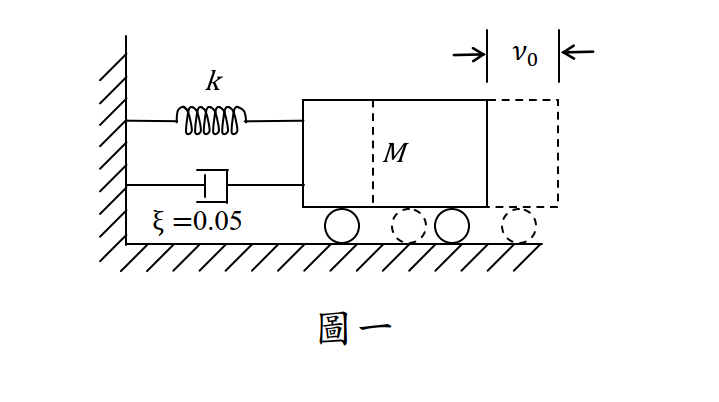

# 考題編號：SD-2017-1

**主分類：** `SD-U1-3` 單自由度、多自由度系統之動態分析及應用
**副分類：** `SD-U1-1` 結構動力基本性質及原理
**分析方法：** SDOF動力分析
**標籤：** `SDOF` `自由振動` `欠阻尼` `對數衰減率` `振幅衰減` `阻尼比` `初始條件` `包絡線`

---

## 1. 原始題目重述 (Problem Restatement)

### 題目條件

單自由度（SDOF）系統，由彈簧（勁度 $k$）、質量（$M$）與阻尼器（阻尼比 $\xi = 0.05$）組成，固定於牆面。

- **初始位移：** $x(0) = v_0$（向右）
- **初始速度：** $\dot{x}(0) = 0$

**題目提供近似條件：**
$$\omega = \sqrt{\frac{k}{M}}, \quad \omega_D = \sqrt{1-\xi^2}\,\omega \approx \omega, \quad \sqrt{1+\xi^2} \approx 1, \quad \tan^{-1}\xi \approx 0$$

**求：** 此系統來回振動 **3 次**後，振幅（Amplitude）為何？



*圖說：SDOF 系統，彈簧勁度 k，質量 M，阻尼比 ξ = 0.05，初始條件 x(0) = v₀（向右位移）、ẋ(0) = 0（靜止釋放）。牆面固定端在左，質量在右。*

---

## 2. 考題核心精神與出題者意圖 (Core Concepts & Examiner's Intent)

### 核心觀念
- **對數衰減率（Logarithmic Decrement）：** SDOF 欠阻尼自由振動的振幅每週期依 $e^{-\xi\omega T_D}$ 衰減，連續 $n$ 次後振幅為 $A_n = A_0 \cdot e^{-n \cdot 2\pi\xi}$
- **振幅包絡線（Amplitude Envelope）：** 振幅隨時間呈指數衰減，由阻尼比 $\xi$ 控制衰減速率

### 出題者意圖
1. 測驗考生能否從初始條件推導出振幅包絡線的起始值
2. 測驗對「振動 $n$ 次後振幅」的公式 $A_n = A_0\,e^{-2n\pi\xi}$ 的掌握
3. 考驗是否知道近似條件（$\omega_D \approx \omega$、$\tan^{-1}\xi \approx 0$）如何簡化計算

### 陷阱設計
- 初始速度為零，但 $B \neq 0$（需從速度初始條件推導），許多考生誤以為 $B = 0$
- 題目給的近似需正確運用，才能化簡振幅 $X_0 = v_0$（而非 $v_0/\sqrt{1-\xi^2}$）

---

## 3. 解題戰略地圖與陷阱分析 (Strategic Roadmap & Trap Analysis)

### 步驟作戰計畫

```
Step 1: 寫出欠阻尼 SDOF 自由振動通解
Step 2: 代入初始條件，求係數 A、B
Step 3: 計算振幅 X₀ = √(A²+B²)，並用近似化簡
Step 4: 建立振幅包絡線：A(t) = X₀·e^{-ξωt}
Step 5: 代入 t = 3T_D = 6π/ω（振動3次）
Step 6: 得到 A₃ = v₀·e^{-0.3π}
```

### 關鍵陷阱

| # | 陷阱 | 錯誤做法 | 正確做法 |
|---|------|---------|---------|
| 1 | 初始速度為 0 → 誤以為 $B=0$ | 令 $B=0$，得到 $x(t)=v_0 e^{-\xi\omega t}\cos\omega_D t$ | 從 $\dot{x}(0)=0$ 解出 $B = \xi\omega v_0/\omega_D \neq 0$ |
| 2 | 振幅起始值誤算 | 只取 $A = v_0$，忽略 $B$ 的貢獻 | $X_0 = v_0/\sqrt{1-\xi^2} \approx v_0$（用近似化簡） |
| 3 | 「振動 3 次」的時間 | 代入 $t = 3T_0 = 6\pi/\omega$（無阻尼週期） | 代入 $t = 3T_D \approx 3T_0$（近似成立） |
| 4 | 衰減週期數混淆 | 計算振動 3 次後用 $e^{-3\xi\omega T_0}$，忘記每次 $T_D$ | $T_D = 2\pi/\omega_D \approx 2\pi/\omega$，3次後 $t=6\pi/\omega$ |

---

## 3.5 變數層次分析 (Variable Hierarchy Analysis)

> 複習提示：第一次解題後，在每個卡住的知識點旁標記 `⚠`；第二次複習時只看有 `⚠` 的項目。

### 最終目標
`求 SDOF 欠阻尼自由振動系統（初始位移 v₀、初始速度 0）振動 3 次後的振幅 A₃`

### 本題關鍵公式（依計算順序）

> $\boxed{\cdot}$ = 由前步驟推導出的中間變數（非題目直接給定）

$$\text{Step 1: } x(t) = e^{-\xi\omega t}\left[A\cos\omega_D t + B\sin\omega_D t\right]$$

$$\text{Step 2: } A = x(0) = v_0, \quad B = \frac{\dot{x}(0)+\xi\omega A}{\omega_D} = \frac{\xi\omega v_0}{\omega_D}$$

$$\text{Step 3: } X_0 = \sqrt{\boxed{A}^2+\boxed{B}^2} = \frac{v_0}{\sqrt{1-\xi^2}} \approx v_0$$

$$\text{Step 4: } \phi = \tan^{-1}\!\left(\frac{\boxed{B}}{\boxed{A}}\right) = \tan^{-1}\!\left(\frac{\xi}{\sqrt{1-\xi^2}}\right) \approx 0$$

$$\text{Step 5: 振幅包絡線：}\; \mathcal{A}(t) = \boxed{X_0}\cdot e^{-\xi\omega t} \approx v_0\,e^{-\xi\omega t}$$

$$\text{Step 6: } t_3 = 3T_D = \frac{6\pi}{\omega_D} \approx \frac{6\pi}{\omega}$$

$$\text{Step 7: } A_3 = \boxed{v_0}\cdot e^{-\xi\omega\cdot \frac{6\pi}{\omega}} = v_0\,e^{-6\pi\xi}$$

### L1：題目直接給定

| 符號 | 數值 | 說明 |
|------|------|------|
| $\xi$ | $0.05$ | 阻尼比 |
| $x(0)$ | $v_0$ | 初始位移 |
| $\dot{x}(0)$ | $0$ | 初始速度（靜止釋放） |
| $n$ | $3$ | 振動次數 |
| $\omega = \sqrt{k/M}$ | 已知符號 | 自然圓頻率 |

### L2：需知識點推導

**Step 1：寫出通解**

| 符號 | 公式/來源 | 卡關? |
|------|----------|:-----:|
| $\omega_D$ | $\omega\sqrt{1-\xi^2} \approx \omega$ | |
| 欠阻尼通解 | $x(t) = e^{-\xi\omega t}[A\cos\omega_D t + B\sin\omega_D t]$ | |

**Step 2：代入初始條件**

| 符號 | 公式/來源 | 卡關? |
|------|----------|:-----:|
| $A$ | $x(0) = v_0$ | |
| $B$ | $\dot{x}(0) = -\xi\omega A + B\omega_D = 0 \Rightarrow B = \xi\omega v_0/\omega_D$ | |

**Step 3：計算初始振幅**

| 符號 | 公式/來源 | 卡關? |
|------|----------|:-----:|
| $X_0$ | $\sqrt{v_0^2 + (\xi\omega v_0/\omega_D)^2} = v_0\sqrt{1+\xi^2/(1-\xi^2)} = v_0/\sqrt{1-\xi^2}$ | |
| 近似 | $1/\sqrt{1-\xi^2} \approx 1$（$\xi=0.05$） | |
| $\phi$ | $\tan^{-1}(\xi/\sqrt{1-\xi^2}) \approx \tan^{-1}(0.05) \approx 0$ | |

**Step 4：計算 3 次後振幅**

| 符號 | 公式/來源 | 卡關? |
|------|----------|:-----:|
| $T_D$ | $2\pi/\omega_D \approx 2\pi/\omega$ | |
| $t_3$ | $3 \times T_D = 6\pi/\omega$ | |
| $A_3$ | $v_0\,e^{-\xi\omega \cdot 6\pi/\omega} = v_0\,e^{-6\pi\xi} = v_0\,e^{-0.3\pi}$ | |

### L3：深層知識（不懂就卡住）

| 知識點 | 說明 | 卡關? |
|--------|------|:-----:|
| 初始速度 = 0 為何 B ≠ 0 | $x(t)$ 的導數在 $t=0$ 包含 $-\xi\omega A$，故 $B = \xi\omega A/\omega_D$ 才能滿足 $\dot{x}(0)=0$ | |
| 振幅包絡線的物理意義 | 振幅不是 $x(t)$ 本身，而是 $\sqrt{A^2+B^2}\cdot e^{-\xi\omega t}$，是各時刻極值的連線 | |
| 「振動 n 次後」的精確意義 | 第 $n$ 次回到同向峰值（正峰→正峰），對應時間 $t=nT_D$ | |
| 對數衰減率 $\delta$ | $\delta = \ln(A_n/A_{n+1}) = 2\pi\xi/\sqrt{1-\xi^2} \approx 2\pi\xi$，是每週期振幅比的自然對數 | |

---

## 4. 步驟化詳細計算過程 (Step-by-Step Detailed Calculation)

> 📊 本題不含互動圖（純自由振動衰減，以解析式完整表達）

### Step 1：寫出欠阻尼 SDOF 自由振動通解

欠阻尼條件（$\xi < 1$）下，自由振動通解為：

$$x(t) = e^{-\xi\omega t}\left[A\cos\omega_D t + B\sin\omega_D t\right]$$

其中有阻尼圓頻率：

$$\omega_D = \omega\sqrt{1-\xi^2} \approx \omega \quad (\text{依題目近似})$$

### Step 2：代入初始條件求係數 A、B

**初始位移條件** $x(0) = v_0$：

$$e^0[A\cos 0 + B\sin 0] = A = v_0 \quad \Rightarrow \quad A = v_0$$

**初始速度條件** $\dot{x}(0) = 0$：

對 $x(t)$ 微分：

$$\dot{x}(t) = -\xi\omega\,e^{-\xi\omega t}[A\cos\omega_D t + B\sin\omega_D t] + e^{-\xi\omega t}[-A\omega_D\sin\omega_D t + B\omega_D\cos\omega_D t]$$

代入 $t = 0$：

$$\dot{x}(0) = -\xi\omega\cdot A + B\cdot\omega_D = 0$$

$$\Rightarrow B = \frac{\xi\omega A}{\omega_D} = \frac{\xi\omega v_0}{\omega_D}$$

依題目近似 $\omega_D \approx \omega$：

$$B \approx \xi v_0 = 0.05\,v_0$$

### Step 3：化簡為振幅–相位形式

$$x(t) = X_0\,e^{-\xi\omega t}\cos(\omega_D t - \phi)$$

**初始振幅 $X_0$：**

$$X_0 = \sqrt{A^2 + B^2} = \sqrt{v_0^2 + \left(\frac{\xi\omega v_0}{\omega_D}\right)^2} = v_0\sqrt{1 + \frac{\xi^2}{1-\xi^2}} = \frac{v_0}{\sqrt{1-\xi^2}}$$

依題目近似 $\sqrt{1+\xi^2} \approx 1$（等價地 $1/\sqrt{1-\xi^2} \approx 1$）：

$$\boxed{X_0 \approx v_0}$$

**相位角 $\phi$：**

$$\phi = \tan^{-1}\!\left(\frac{B}{A}\right) = \tan^{-1}\!\left(\frac{\xi\omega/\omega_D}{1}\right) = \tan^{-1}\!\left(\frac{\xi}{\sqrt{1-\xi^2}}\right) \approx \tan^{-1}(\xi) \approx 0 \quad (\text{依題目近似})$$

### Step 4：建立振幅包絡線

經近似後，位移響應化簡為：

$$x(t) \approx v_0\,e^{-\xi\omega t}\cos(\omega_D t)$$

**振幅包絡線（Amplitude Envelope）：**

$$\mathcal{A}(t) = v_0\,e^{-\xi\omega t}$$

### Step 5：計算振動 3 次後的振幅

每次完整振動對應一個有阻尼週期 $T_D$：

$$T_D = \frac{2\pi}{\omega_D} \approx \frac{2\pi}{\omega} \quad (\text{依近似 } \omega_D \approx \omega)$$

振動 3 次後的時間：

$$t_3 = 3\,T_D \approx \frac{6\pi}{\omega}$$

代入包絡線公式：

$$A_3 = v_0\,e^{-\xi\omega \cdot \frac{6\pi}{\omega}} = v_0\,e^{-6\pi\xi}$$

代入 $\xi = 0.05$：

$$A_3 = v_0\,e^{-6\pi \times 0.05} = v_0\,e^{-0.3\pi}$$

**策略註解：** $e^{-0.3\pi} = e^{-0.9425} \approx 0.390$，這裡保留符號形式 $e^{-0.3\pi}$ 比數值更清楚展現衰減公式的結構。

$$\boxed{A_3 = v_0\,e^{-0.3\pi} \approx 0.390\,v_0}$$

### 驗算：對數衰減率觀點

每振動一次，振幅比值：

$$\frac{A_{n+1}}{A_n} = e^{-2\pi\xi} = e^{-2\pi \times 0.05} = e^{-0.1\pi} \approx 0.730$$

振動 3 次：

$$A_3 = v_0 \times (e^{-0.1\pi})^3 = v_0\,e^{-0.3\pi} \quad \checkmark$$

---

## 5. 關鍵爭議點與進階探討 (Critical Issues & Advanced Discussion)

### 5.1 「振動 n 次」的定義

「來回震動 3 次」指質量完成 3 個完整振動週期，即從初始位置出發、往復振動後再回到同向峰值，共 3 次，對應時間 $t = 3T_D$。

**考場建議：** 計算時統一用 $t = nT_D$，以避免對「振動次數」的不同解讀造成錯誤。

### 5.2 近似條件的使用時機

題目明確給出 $\sqrt{1+\xi^2} \approx 1$、$\tan^{-1}\xi \approx 0$，目的是允許考生在有阻尼的情況下直接使用：

$$X_0 \approx v_0, \quad \phi \approx 0$$

若不使用近似，精確答案為：

$$A_3 = \frac{v_0}{\sqrt{1-\xi^2}}\cdot e^{-6\pi\xi/\sqrt{1-\xi^2}}$$

對 $\xi = 0.05$ 而言，精確值 $\approx 0.391\,v_0$，與近似值 $0.390\,v_0$ 幾乎相同。

### 5.3 與對數衰減率的關係

對數衰減率定義：

$$\delta = \ln\!\frac{A_n}{A_{n+1}} = \frac{2\pi\xi}{\sqrt{1-\xi^2}} \approx 2\pi\xi \quad (\text{輕阻尼})$$

振動 $n$ 次後：

$$A_n = A_0\,e^{-n\delta} = A_0\,e^{-2n\pi\xi}$$

本題即為 $n=3$，$\delta = 2\pi \times 0.05 = 0.1\pi$，$A_3 = v_0 e^{-0.3\pi}$。

### 5.4 實務意義

$\xi = 0.05$ 是台灣建築耐震規範常用結構阻尼比（RC 結構），振動 3 次後振幅衰減至初始值的 39%，體現了結構在地震後的自由振動衰減行為。
