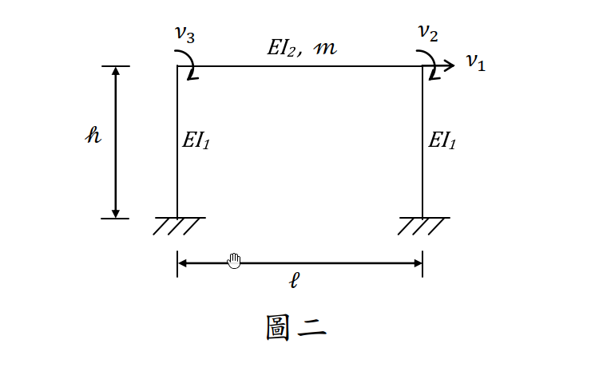

# 考題編號：SD-2017-2

**主分類：** `SD-U1-2` 運動方程式推導
**副分類：** `SD-U1-3` 單自由度、多自由度系統之動態分析及應用
**分析方法：** MDOF模態分析
**標籤：** `MDOF` `3自由度` `門形框架` `直接勁度法` `勁度矩陣` `質量矩陣` `運動方程式` `靜態凝縮`

---

## 1. 原始題目重述 (Problem Restatement)

### 題目條件

三自由度門形結構（如圖二），建立無阻尼（undamped）運動方程式。

**結構幾何：**
- 兩根固定端柱（EI₁），高度 $h$，跨距 $\ell$
- 一根水平梁（EI₂），長度 $\ell$，總質量 $m$（梁為唯一的慣性來源）
- 柱底均為固定端（fixed base）

**自由度定義（依圖二）：**
- $v_1$：梁層水平平移（→ 正方向，整層側移）
- $v_2$：右梁柱節點之旋轉（順時針為正）
- $v_3$：左梁柱節點之旋轉（順時針為正）

**質量假設（題目說明）：**
- 質量 $m$ 貢獻 $v_1$ 方向之平移慣性
- **不考慮** $m$ 對 $v_2$、$v_3$ 自由度之**轉動慣量**

**求：** 建立此結構無阻尼運動方程式 $[M]\{\ddot{v}\} + [K]\{v\} = \{0\}$



*圖說：門形框架，柱 EI₁、高 h，梁 EI₂、跨距 ℓ、質量 m。v₁ = 整體水平側移（→ 正），v₂ = 右梁柱節點旋轉（順時針正），v₃ = 左梁柱節點旋轉（順時針正）。柱底固定端。*

---

## 2. 考題核心精神與出題者意圖 (Core Concepts & Examiner's Intent)

### 核心觀念
- **直接勁度法（DSM）：** 組合柱與梁的元素勁度矩陣，形成全域勁度矩陣
- **凝縮質量矩陣：** 忽略旋轉慣量後，質量矩陣僅 $M_{11} = m$ 非零（奇異矩陣）
- **靜態凝縮觀念：** $v_2$、$v_3$ 的方程無慣性項，屬純靜力平衡，可透過靜態凝縮（static condensation）化簡為 SDOF

### 出題者意圖
1. 測驗考生能否用「元素疊加法」建立全域勁度矩陣（固定端柱 + 梁）
2. 測驗對「轉動慣量可忽略」條件的理解及對質量矩陣的正確建立
3. 隱性考點：此 3DOF 系統因質量矩陣奇異，可靜態凝縮為等效 SDOF 系統

---

## 3. 解題戰略地圖與陷阱分析 (Strategic Roadmap & Trap Analysis)

### 步驟作戰計畫
```
Step 1: 確認自由度與符號慣例
Step 2: 建立固定端柱的 2×2 縮減勁度（橫移 + 旋轉）
Step 3: 建立梁的旋轉勁度（2×2）
Step 4: 用直接勁度法疊加為全域 3×3 勁度矩陣 [K]
Step 5: 建立質量矩陣 [M]（忽略轉動慣量）
Step 6: 寫出運動方程式
```

### 關鍵陷阱

| # | 陷阱 | 錯誤做法 | 正確做法 |
|---|------|---------|---------|
| 1 | 柱底固定端的勁度 | 用兩端鉸接柱的勁度 $3EI/h^3$ | 固定端柱（cantilever）的縮減勁度 $12EI_1/h^3$（橫移）和 $4EI_1/h$（旋轉） |
| 2 | 旋轉符號慣例 | CCW 正（導致偶次對角項為負，看起來像錯誤） | 使用 CW 正，使得 $K_{12}$、$K_{13}$ 均為正值，矩陣全正 |
| 3 | 梁的勁度貢獻 | 誤用端部橫移分量（梁端無相對橫移） | 梁端無相對橫移，只有旋轉勁度 $4EI_2/\ell$（直接）和 $2EI_2/\ell$（交叉） |
| 4 | 質量矩陣 | 在 $M_{22}$、$M_{33}$ 填入轉動慣量 | 題目明確忽略，故 $M_{22} = M_{33} = 0$ |
| 5 | 兩根柱的勁度疊加 | 只算一根柱 | $K_{11}$ 需兩根柱疊加：$2 \times 12EI_1/h^3 = 24EI_1/h^3$ |

---

## 3.5 變數層次分析 (Variable Hierarchy Analysis)

> 複習提示：第一次解題後，在每個卡住的知識點旁標記 `⚠`；第二次複習時只看有 `⚠` 的項目。

### 最終目標
`建立三自由度門形框架無阻尼運動方程式：[M]{v̈} + [K]{v} = {0}`

### 本題關鍵公式（依計算順序）

> $\boxed{\cdot}$ = 由前步驟推導出的中間變數

$$\text{Step 1: 固定端柱縮減勁度（橫移 }v_1\text{，旋轉 }v_{2\text{ or }3}\text{）}$$

$$k_{col} = \begin{bmatrix} 12EI_1/h^3 & 6EI_1/h^2 \\ 6EI_1/h^2 & 4EI_1/h \end{bmatrix}$$

$$\text{Step 2: 梁旋轉勁度}$$

$$k_{beam} = \begin{bmatrix} 4EI_2/\ell & 2EI_2/\ell \\ 2EI_2/\ell & 4EI_2/\ell \end{bmatrix}_{[v_3,\, v_2]}$$

$$\text{Step 3: 全域勁度矩陣（疊加 2 柱 + 1 梁）}$$

$$K_{11} = 2\times\frac{12EI_1}{h^3}, \quad K_{12}=K_{13}=\frac{6EI_1}{h^2}, \quad K_{22}=K_{33}=\frac{4EI_1}{h}+\frac{4EI_2}{\ell}, \quad K_{23}=\frac{2EI_2}{\ell}$$

$$\text{Step 4: 質量矩陣}$$

$$[M] = \mathrm{diag}(m,\; 0,\; 0)$$

### L1：題目直接給定

| 符號 | 數值 | 說明 |
|------|------|------|
| $EI_1$ | 已知 | 柱抗彎勁度 |
| $EI_2$ | 已知 | 梁抗彎勁度 |
| $h$ | 已知 | 柱高 |
| $\ell$ | 已知 | 梁跨距 |
| $m$ | 已知 | 梁總質量 |
| 柱底條件 | 固定端 | 兩柱底均 fixed |

### L2：需知識點推導

**Step 1：固定端柱縮減勁度**

| 符號 | 公式/來源 | 卡關? |
|------|----------|:-----:|
| $k_{11}^{col}$ | $12EI_1/h^3$（橫移剛度） | |
| $k_{12}^{col}$ | $6EI_1/h^2$（橫移–旋轉耦合，CW正時為正） | |
| $k_{22}^{col}$ | $4EI_1/h$（旋轉剛度） | |

**Step 2：梁旋轉勁度（斜截面公式）**

| 符號 | 公式/來源 | 卡關? |
|------|----------|:-----:|
| $k_{33}^{beam}$ | $4EI_2/\ell$（同端旋轉剛度） | |
| $k_{32}^{beam}$ | $2EI_2/\ell$（交叉旋轉剛度，carry-over） | |

**Step 3：全域矩陣疊加**

| 項 | 來源 | 卡關? |
|----|------|:-----:|
| $K_{11}$ | 左柱 + 右柱各貢獻 $12EI_1/h^3$ | |
| $K_{12}$、$K_{13}$ | 各柱 $6EI_1/h^2$ | |
| $K_{22}$、$K_{33}$ | 各柱 $4EI_1/h$ + 梁端 $4EI_2/\ell$ | |
| $K_{23}$ | 梁交叉項 $2EI_2/\ell$ | |

### L3：深層知識（不懂就卡住）

| 知識點 | 說明 | 卡關? |
|--------|------|:-----:|
| 固定端柱縮減勁度的推導 | 對完整 4×4 梁元素，約束底部兩DOF後得 2×2 縮減矩陣 | |
| 旋轉符號慣例影響正負號 | CW 正時 $K_{12} > 0$；CCW 正時 $K_{12} < 0$。兩種都對，但需自洽 | |
| 梁端無相對橫移的條件 | 柱為剛性軸向（不可伸長），故兩節點高度相同，梁弦旋轉角 $\psi = 0$ | |
| 轉動慣量可忽略的後果 | $M_{22} = M_{33} = 0$ → 質量矩陣奇異 → 第 2、3 方程無慣性項（純靜力） | |
| 靜態凝縮原理 | 利用第 2、3 方程（靜力方程）表達 $v_2$、$v_3$ 為 $v_1$ 的函數，代入第 1 方程得等效 SDOF | |

---

## 4. 步驟化詳細計算過程 (Step-by-Step Detailed Calculation)

### Step 1：確認自由度與符號慣例

**DOF 向量：**

$$\{v\} = \begin{Bmatrix} v_1 \\ v_2 \\ v_3 \end{Bmatrix} = \begin{Bmatrix} \text{水平側移（→ 正）} \\ \text{右節點旋轉（CW 正）} \\ \text{左節點旋轉（CW 正）} \end{Bmatrix}$$

**符號慣例（CW 正）：** 順時針旋轉為正，使得向右側移 $v_1 > 0$ 時，柱頂的旋轉力矩也呈正號，勁度矩陣全正便於驗算。

### Step 2：固定端柱的縮減勁度矩陣

對固定端柱，底部DOF為零（$u_{bot}=0$，$\theta_{bot}=0$），柱頂自由，DOFs為 $[u_{top}=v_1,\; \theta_{top,CW}]$。

縮減後的元素勁度矩陣：

$$[k_{col}] = \frac{EI_1}{h^3}\begin{bmatrix} 12 & 6h \\ 6h & 4h^2 \end{bmatrix} = \begin{bmatrix} \dfrac{12EI_1}{h^3} & \dfrac{6EI_1}{h^2} \\[8pt] \dfrac{6EI_1}{h^2} & \dfrac{4EI_1}{h} \end{bmatrix}$$

**策略註解：** 此矩陣的正定性及正值的 $K_{12}$ 項，可由「向右側移 → 柱頂產生順時針旋轉趨勢 → 需要正值的交叉勁度」理解。

### Step 3：梁的旋轉勁度矩陣

由於柱為軸向剛性（不可伸長），兩端節點高度一致，梁弦旋轉角 $\psi = 0$。梁只需考慮兩端旋轉 DOF（$v_3$ = 左，$v_2$ = 右，均 CW 正）。

利用斜截面公式（slope-deflection equation），梁端的旋轉勁度：

$$[k_{beam}]_{[v_3,v_2]} = \frac{EI_2}{\ell}\begin{bmatrix} 4 & 2 \\ 2 & 4 \end{bmatrix} = \begin{bmatrix} \dfrac{4EI_2}{\ell} & \dfrac{2EI_2}{\ell} \\[8pt] \dfrac{2EI_2}{\ell} & \dfrac{4EI_2}{\ell} \end{bmatrix}$$

**策略註解：** 交叉項 $2EI_2/\ell$ 是梁的 carry-over 效應：右端旋轉時，左端也會承受正比於右端旋轉量的傳遞力矩。

### Step 4：全域勁度矩陣 [K]（直接勁度疊加）

DOF 排列：$[v_1,\; v_2,\; v_3]$

| 元素 | 關聯 DOF | 貢獻到 |
|------|---------|-------|
| 右柱 | $[v_1,\; v_2]$ | $K_{11}$, $K_{12}$, $K_{21}$, $K_{22}$ |
| 左柱 | $[v_1,\; v_3]$ | $K_{11}$, $K_{13}$, $K_{31}$, $K_{33}$ |
| 梁   | $[v_3,\; v_2]$ | $K_{33}$, $K_{32}$, $K_{23}$, $K_{22}$ |

**各項計算：**

$$K_{11} = \frac{12EI_1}{h^3}(\text{右柱}) + \frac{12EI_1}{h^3}(\text{左柱}) = \frac{24EI_1}{h^3}$$

$$K_{12} = K_{21} = \frac{6EI_1}{h^2}(\text{右柱})$$

$$K_{13} = K_{31} = \frac{6EI_1}{h^2}(\text{左柱})$$

$$K_{22} = \frac{4EI_1}{h}(\text{右柱}) + \frac{4EI_2}{\ell}(\text{梁右端}) = \frac{4EI_1}{h} + \frac{4EI_2}{\ell}$$

$$K_{33} = \frac{4EI_1}{h}(\text{左柱}) + \frac{4EI_2}{\ell}(\text{梁左端}) = \frac{4EI_1}{h} + \frac{4EI_2}{\ell}$$

$$K_{23} = K_{32} = \frac{2EI_2}{\ell}(\text{梁交叉項})$$

$$\boxed{[K] = \begin{bmatrix} \dfrac{24EI_1}{h^3} & \dfrac{6EI_1}{h^2} & \dfrac{6EI_1}{h^2} \\[10pt] \dfrac{6EI_1}{h^2} & \dfrac{4EI_1}{h}+\dfrac{4EI_2}{\ell} & \dfrac{2EI_2}{\ell} \\[10pt] \dfrac{6EI_1}{h^2} & \dfrac{2EI_2}{\ell} & \dfrac{4EI_1}{h}+\dfrac{4EI_2}{\ell} \end{bmatrix}}$$

**對稱性驗算：** $K$ 為實對稱矩陣（$K_{ij} = K_{ji}$），且對角線元素均大於非對角線元素（對角佔優），符合正定要求。✓

### Step 5：質量矩陣 [M]

**慣性來源：**
- 梁質量 $m$ 貢獻 $v_1$（水平平移）方向的平移慣性：$M_{11} = m$
- 題目說明「不考慮 $m$ 對 $v_2$、$v_3$ 自由度之轉動慣量」：$M_{22} = M_{33} = 0$
- 各交叉慣性項：$M_{ij} = 0$（$i \neq j$）

$$\boxed{[M] = \begin{bmatrix} m & 0 & 0 \\ 0 & 0 & 0 \\ 0 & 0 & 0 \end{bmatrix}}$$

### Step 6：運動方程式

$$\boxed{[M]\{\ddot{v}\} + [K]\{v\} = \{0\}}$$

展開為矩陣形式：

$$\begin{bmatrix} m & 0 & 0 \\ 0 & 0 & 0 \\ 0 & 0 & 0 \end{bmatrix}\begin{Bmatrix}\ddot{v}_1\\\ddot{v}_2\\\ddot{v}_3\end{Bmatrix} + \begin{bmatrix} \dfrac{24EI_1}{h^3} & \dfrac{6EI_1}{h^2} & \dfrac{6EI_1}{h^2} \\[10pt] \dfrac{6EI_1}{h^2} & \dfrac{4EI_1}{h}+\dfrac{4EI_2}{\ell} & \dfrac{2EI_2}{\ell} \\[10pt] \dfrac{6EI_1}{h^2} & \dfrac{2EI_2}{\ell} & \dfrac{4EI_1}{h}+\dfrac{4EI_2}{\ell} \end{bmatrix}\begin{Bmatrix}v_1\\v_2\\v_3\end{Bmatrix} = \begin{Bmatrix}0\\0\\0\end{Bmatrix}$$

**分量形式（三道方程）：**

$$\text{（1）}\quad m\ddot{v}_1 + \frac{24EI_1}{h^3}v_1 + \frac{6EI_1}{h^2}v_2 + \frac{6EI_1}{h^2}v_3 = 0$$

$$\text{（2）}\quad \frac{6EI_1}{h^2}v_1 + \left(\frac{4EI_1}{h}+\frac{4EI_2}{\ell}\right)v_2 + \frac{2EI_2}{\ell}v_3 = 0$$

$$\text{（3）}\quad \frac{6EI_1}{h^2}v_1 + \frac{2EI_2}{\ell}v_2 + \left(\frac{4EI_1}{h}+\frac{4EI_2}{\ell}\right)v_3 = 0$$

**方程（1）** 為動力方程（含慣性項）；**方程（2）（3）** 為靜力平衡方程（無慣性項，因轉動慣量被忽略）。

---

## 5. 關鍵爭議點與進階探討 (Critical Issues & Advanced Discussion)

### 5.1 靜態凝縮：化為等效 SDOF

由結構對稱性，當振型對稱（$v_2 = v_3$）時，由方程（2）解出 $v_2$：

$$v_2 = v_3 = -\frac{6EI_1/h^2}{\frac{4EI_1}{h} + \frac{6EI_2}{\ell}}\,v_1 = -\frac{6EI_1 \ell}{4EI_1\ell + 6EI_2 h}\cdot\frac{v_1}{h}$$

代入方程（1），得等效 SDOF 系統的自然頻率 $\omega_n$。此過程稱為**靜態凝縮（static condensation）**，是 MDOF 系統化簡的重要手法。

### 5.2 旋轉符號慣例的選擇

本題解析使用 **順時針（CW）為正** 的旋轉慣例。若使用逆時針（CCW）為正：
- $K_{12}$、$K_{13}$ 將變為 $-6EI_1/h^2$（負值）
- $K_{23}$ 將保持正值 $+2EI_2/\ell$

兩種慣例均正確，考場上選擇使矩陣全正的慣例（CW 正）較直觀且易驗算。

### 5.3 物理意義：奇異質量矩陣

$[M]$ 的奇異性（第 2、3 方程無慣性項）並非錯誤，而是「旋轉慣量忽略」的直接結果。此時：
- 旋轉 DOF（$v_2$、$v_3$）為「準靜態」（quasi-static）DOF
- 系統的動力行為完全由 $v_1$ 主導
- 可靜態凝縮為等效 SDOF：$m\ddot{v}_1 + k_{eff}v_1 = 0$

其中 $k_{eff} = K_{11} - [K_{12}, K_{13}][K_{22,23}]^{-1}[K_{21}, K_{31}]^T$（Schur complement）。

### 5.4 實務對應

此問題對應台灣耐震設計中「樓層水平剪力架構」的建模，旋轉 DOF 的靜態凝縮即是建立「剪力建築（shear building）」等效模型的理論基礎。
