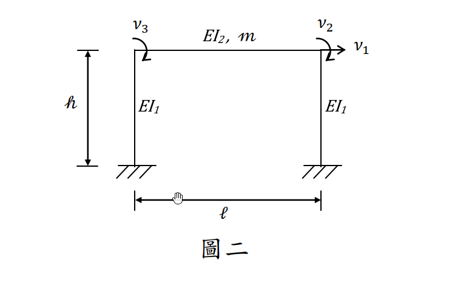
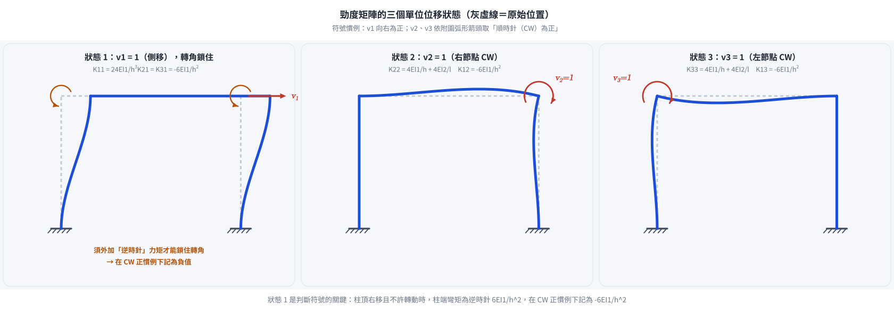
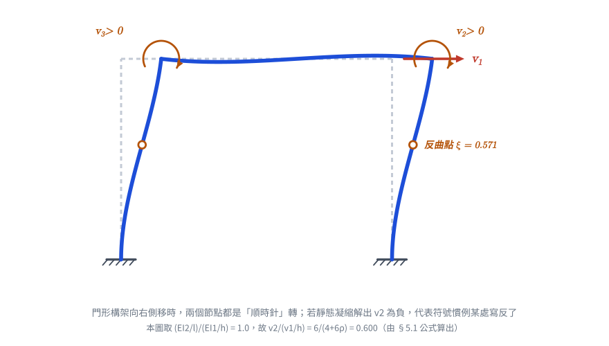

# 考題編號：SD-2017-2

**主分類：** `SD-U1-2` 運動方程式推導
**副分類：** `SD-U1-3` 單自由度、多自由度系統之動態分析及應用
**分析方法：** MDOF模態分析
**標籤：** `MDOF` `3自由度` `門形框架` `直接勁度法` `勁度矩陣` `質量矩陣` `運動方程式` `靜態凝縮`

---

## 1. 原始題目重述 (Problem Restatement)

### 題目條件

三自由度門形結構（如圖二），建立無阻尼（undamped）運動方程式。

**結構幾何：**
- 兩根固定端柱（EI₁），高度 $h$，跨距 $\ell$
- 一根水平梁（EI₂），長度 $\ell$，總質量 $m$（梁為唯一的慣性來源）
- 柱底均為固定端（fixed base）

**自由度定義（依圖二）：**
- $v_1$：梁層水平平移（→ 向右為正，整層側移）
- $v_2$：右梁柱節點之旋轉（**依附圖箭頭：順時針 CW 為正**）
- $v_3$：左梁柱節點之旋轉（**依附圖箭頭：順時針 CW 為正**）

> ⚠ 附圖中 $v_2$、$v_3$ 的弧形箭頭皆自左上起、繞右下收尾，即**順時針**。
> 本解析全程採用此慣例；若改採逆時針（CCW）為正，$K_{12}$、$K_{13}$ 的符號會反過來（見 §5.2）。

**質量假設（題目說明）：**
- 質量 $m$ 貢獻 $v_1$ 方向之平移慣性
- **不考慮** $m$ 對 $v_2$、$v_3$ 自由度之**轉動慣量**

**求：** 建立此結構無阻尼運動方程式 $[M]\{\ddot{v}\} + [K]\{v\} = \{0\}$



*圖說：門形框架，柱 $EI_1$、高 $h$，梁 $EI_2$、跨距 $\ell$、質量 $m$（梁為唯一慣性來源）。$v_1$ = 梁層水平側移，箭頭向右；$v_2$ = 右梁柱節點旋轉，$v_3$ = 左梁柱節點旋轉，兩者的弧形箭頭皆自左上起、繞右下收尾，即**順時針（CW）為正**。兩柱底皆為固定端（fixed base）。*

---

## 2. 考題核心精神與出題者意圖 (Core Concepts & Examiner's Intent)

### 核心觀念
- **直接勁度法（DSM）：** 組合柱與梁的元素勁度矩陣，形成全域勁度矩陣
- **凝縮質量矩陣：** 忽略旋轉慣量後，質量矩陣僅 $M_{11} = m$ 非零（奇異矩陣）
- **靜態凝縮觀念：** $v_2$、$v_3$ 的方程無慣性項，屬純靜力平衡，可透過靜態凝縮（static condensation）化簡為 SDOF

### 出題者意圖
1. 測驗考生能否用「元素疊加法」建立全域勁度矩陣（固定端柱 + 梁）
2. 測驗對「轉動慣量可忽略」條件的理解及對質量矩陣的正確建立
3. 隱性考點：此 3DOF 系統因質量矩陣奇異，可靜態凝縮為等效 SDOF 系統

---

## 3. 解題戰略地圖與陷阱分析 (Strategic Roadmap & Trap Analysis)

### 步驟作戰計畫
```
Step 1: 確認自由度與符號慣例
Step 2: 建立固定端柱的 2×2 縮減勁度（橫移 + 旋轉）
Step 3: 建立梁的旋轉勁度（2×2）
Step 4: 用直接勁度法疊加為全域 3×3 勁度矩陣 [K]
Step 5: 建立質量矩陣 [M]（忽略轉動慣量）
Step 6: 寫出運動方程式
```

### 關鍵陷阱

| # | 陷阱 | 錯誤做法 | 正確做法 |
|---|------|---------|---------|
| 1 | 柱底固定端的勁度 | 用兩端鉸接柱的勁度 $3EI/h^3$ | 固定端柱（cantilever）的縮減勁度 $12EI_1/h^3$（橫移）和 $4EI_1/h$（旋轉） |
| 2 | 旋轉符號慣例弄反 | 以為「CW 正 → 非對角項為正」 | **恰好相反**：$v_1$ 向右正時，CCW 正給 $K_{12}=+6EI_1/h^2$、CW 正給 $K_{12}=-6EI_1/h^2$。本題附圖為 CW 正 → **$K_{12}=K_{13}=-6EI_1/h^2$** |
| 3 | 梁的勁度貢獻 | 誤用端部橫移分量（梁端無相對橫移） | 梁端無相對橫移，只有旋轉勁度 $4EI_2/\ell$（直接）和 $2EI_2/\ell$（交叉） |
| 4 | 質量矩陣 | 在 $M_{22}$、$M_{33}$ 填入轉動慣量 | 題目明確忽略，故 $M_{22} = M_{33} = 0$ |
| 5 | 兩根柱的勁度疊加 | 只算一根柱 | $K_{11}$ 需兩根柱疊加：$2 \times 12EI_1/h^3 = 24EI_1/h^3$ |

---

## 3.5 變數層次分析 (Variable Hierarchy Analysis)

> 複習提示：第一次解題後，在每個卡住的知識點旁標記 `⚠`；第二次複習時只看有 `⚠` 的項目。

### 最終目標
`建立三自由度門形框架無阻尼運動方程式：[M]{v̈} + [K]{v} = {0}`

### 本題關鍵公式（依計算順序）

> $\boxed{\cdot}$ = 由前步驟推導出的中間變數

$$\text{Step 1: 固定端柱縮減勁度（橫移 }v_1\text{，旋轉 }v_{2\text{ or }3}\text{）}$$

$$k_{col} = \begin{bmatrix} 12EI_1/h^3 & -6EI_1/h^2 \\ -6EI_1/h^2 & 4EI_1/h \end{bmatrix}\qquad(\text{側移右正、轉角 CW 正})$$

$$\text{Step 2: 梁旋轉勁度}$$

$$k_{beam} = \begin{bmatrix} 4EI_2/\ell & 2EI_2/\ell \\ 2EI_2/\ell & 4EI_2/\ell \end{bmatrix}_{[v_3,\, v_2]}$$

$$\text{Step 3: 全域勁度矩陣（疊加 2 柱 + 1 梁）}$$

$$K_{11} = 2\times\frac{12EI_1}{h^3}, \quad K_{12}=K_{13}=-\frac{6EI_1}{h^2}, \quad K_{22}=K_{33}=\frac{4EI_1}{h}+\frac{4EI_2}{\ell}, \quad K_{23}=\frac{2EI_2}{\ell}$$

$$\text{Step 4: 質量矩陣}$$

$$[M] = \mathrm{diag}(m,\; 0,\; 0)$$

### L1：題目直接給定

| 符號 | 數值 | 說明 |
|------|------|------|
| $EI_1$ | 已知 | 柱抗彎勁度 |
| $EI_2$ | 已知 | 梁抗彎勁度 |
| $h$ | 已知 | 柱高 |
| $\ell$ | 已知 | 梁跨距 |
| $m$ | 已知 | 梁總質量 |
| 柱底條件 | 固定端 | 兩柱底均 fixed |

### L2：需知識點推導

**Step 1：固定端柱縮減勁度**

| 符號 | 公式/來源 | 卡關? |
|------|----------|:-----:|
| $k_{11}^{col}$ | $12EI_1/h^3$（橫移剛度） | |
| $k_{12}^{col}$ | $-6EI_1/h^2$（橫移–旋轉耦合；CW 正時為**負**，CCW 正時為正） | |
| $k_{22}^{col}$ | $4EI_1/h$（旋轉剛度） | |

**Step 2：梁旋轉勁度（斜截面公式）**

| 符號 | 公式/來源 | 卡關? |
|------|----------|:-----:|
| $k_{33}^{beam}$ | $4EI_2/\ell$（同端旋轉剛度） | |
| $k_{32}^{beam}$ | $2EI_2/\ell$（交叉旋轉剛度，carry-over） | |

**Step 3：全域矩陣疊加**

| 項 | 來源 | 卡關? |
|----|------|:-----:|
| $K_{11}$ | 左柱 + 右柱各貢獻 $12EI_1/h^3$ | |
| $K_{12}$、$K_{13}$ | 各柱 $-6EI_1/h^2$（CW 正慣例） | |
| $K_{22}$、$K_{33}$ | 各柱 $4EI_1/h$ + 梁端 $4EI_2/\ell$ | |
| $K_{23}$ | 梁交叉項 $2EI_2/\ell$ | |

### L3：深層知識（不懂就卡住）

| 知識點 | 說明 | 卡關? |
|--------|------|:-----:|
| 固定端柱縮減勁度的推導 | 對完整 4×4 梁元素，約束底部兩DOF後得 2×2 縮減矩陣 | |
| 旋轉符號慣例影響正負號 | $v_1$ 右正時：**CCW 正 → $K_{12}=+6EI_1/h^2$；CW 正 → $K_{12}=-6EI_1/h^2$**。兩種都對，但須自洽；驗證法：側移向右時節點實際會**順時針**轉，故 CW 慣例下靜態凝縮解出的 $v_2$ 必須為正 | |
| 梁端無相對橫移的條件 | 柱為剛性軸向（不可伸長），故兩節點高度相同，梁弦旋轉角 $\psi = 0$ | |
| 轉動慣量可忽略的後果 | $M_{22} = M_{33} = 0$ → 質量矩陣奇異 → 第 2、3 方程無慣性項（純靜力） | |
| 靜態凝縮原理 | 利用第 2、3 方程（靜力方程）表達 $v_2$、$v_3$ 為 $v_1$ 的函數，代入第 1 方程得等效 SDOF | |

---

## 4. 步驟化詳細計算過程 (Step-by-Step Detailed Calculation)

### Step 1：確認自由度與符號慣例

**DOF 向量：**

$$\{v\} = \begin{Bmatrix} v_1 \\ v_2 \\ v_3 \end{Bmatrix} = \begin{Bmatrix} \text{水平側移（→ 正）} \\ \text{右節點旋轉（CW 正）} \\ \text{左節點旋轉（CW 正）} \end{Bmatrix}$$

**符號慣例（依附圖，CW 正）：** 兩個轉角自由度的弧形箭頭皆為順時針，故取順時針為正。

> **這個慣例會讓 $K_{12}$、$K_{13}$ 帶負號**，理由如下（考場上請務必自己推一次，不要憑印象）：
> 令柱頂向右平移 $v_1=1$、並「鎖住」轉角不動（$v_2=0$），此即固定–固定柱的純側移（S 形變形）。
> 由傾角變位法 $M = \frac{2EI}{h}(2\theta_a+\theta_b-3\psi)$，弦轉角 $\psi = -1/h$（順時針），得柱頂端彎矩
> $M = 6EI_1/h^2$，方向為**逆時針**。也就是說：要維持「向右平移但不轉」，必須外加一個**逆時針**力矩。
> 在 CW 正的慣例下，逆時針即為負 → $K_{21} = K_{12} = -6EI_1/h^2$。

### Step 2：固定端柱的縮減勁度矩陣

對固定端柱，底部DOF為零（$u_{bot}=0$，$\theta_{bot}=0$），柱頂自由，DOFs為 $[u_{top}=v_1,\; \theta_{top,CW}]$。

縮減後的元素勁度矩陣：

$$[k_{col}] = \frac{EI_1}{h^3}\begin{bmatrix} 12 & -6h \\ -6h & 4h^2 \end{bmatrix} = \begin{bmatrix} \dfrac{12EI_1}{h^3} & -\dfrac{6EI_1}{h^2} \\[8pt] -\dfrac{6EI_1}{h^2} & \dfrac{4EI_1}{h} \end{bmatrix} \qquad(\text{DOF：}[u_{top}\to\text{右正},\ \theta_{top}\to\text{CW 正}])$$

**策略註解：** 對角項恆正（$12EI_1/h^3$、$4EI_1/h$）與慣例無關；**只有交叉項的正負隨轉角慣例改變**。
本題採 CW 正 → 交叉項為 $-6EI_1/h^2$。矩陣仍為正定（$\det = 48E^2I_1^2/h^4 - 36E^2I_1^2/h^4 = 12E^2I_1^2/h^4 > 0$ ✓）。

### Step 3：梁的旋轉勁度矩陣

由於柱為軸向剛性（不可伸長），兩端節點高度一致，梁弦旋轉角 $\psi = 0$。梁只需考慮兩端旋轉 DOF（$v_3$ = 左，$v_2$ = 右，均 CW 正）。

利用斜截面公式（slope-deflection equation），梁端的旋轉勁度：

$$[k_{beam}]_{[v_3,v_2]} = \frac{EI_2}{\ell}\begin{bmatrix} 4 & 2 \\ 2 & 4 \end{bmatrix} = \begin{bmatrix} \dfrac{4EI_2}{\ell} & \dfrac{2EI_2}{\ell} \\[8pt] \dfrac{2EI_2}{\ell} & \dfrac{4EI_2}{\ell} \end{bmatrix}$$

**策略註解：** 交叉項 $2EI_2/\ell$ 是梁的 carry-over 效應：右端旋轉時，左端也會承受正比於右端旋轉量的傳遞力矩。

### Step 4：全域勁度矩陣 [K]（直接勁度疊加）

DOF 排列：$[v_1,\; v_2,\; v_3]$

| 元素 | 關聯 DOF | 貢獻到 |
|------|---------|-------|
| 右柱 | $[v_1,\; v_2]$ | $K_{11}$, $K_{12}$, $K_{21}$, $K_{22}$ |
| 左柱 | $[v_1,\; v_3]$ | $K_{11}$, $K_{13}$, $K_{31}$, $K_{33}$ |
| 梁   | $[v_3,\; v_2]$ | $K_{33}$, $K_{32}$, $K_{23}$, $K_{22}$ |

**各項計算：**

$$K_{11} = \frac{12EI_1}{h^3}(\text{右柱}) + \frac{12EI_1}{h^3}(\text{左柱}) = \frac{24EI_1}{h^3}$$

$$K_{12} = K_{21} = -\frac{6EI_1}{h^2}(\text{右柱})$$

$$K_{13} = K_{31} = -\frac{6EI_1}{h^2}(\text{左柱})$$

$$K_{22} = \frac{4EI_1}{h}(\text{右柱}) + \frac{4EI_2}{\ell}(\text{梁右端}) = \frac{4EI_1}{h} + \frac{4EI_2}{\ell}$$

$$K_{33} = \frac{4EI_1}{h}(\text{左柱}) + \frac{4EI_2}{\ell}(\text{梁左端}) = \frac{4EI_1}{h} + \frac{4EI_2}{\ell}$$

$$K_{23} = K_{32} = \frac{2EI_2}{\ell}(\text{梁交叉項})$$

$$\boxed{[K] = \begin{bmatrix} \dfrac{24EI_1}{h^3} & -\dfrac{6EI_1}{h^2} & -\dfrac{6EI_1}{h^2} \\[10pt] -\dfrac{6EI_1}{h^2} & \dfrac{4EI_1}{h}+\dfrac{4EI_2}{\ell} & \dfrac{2EI_2}{\ell} \\[10pt] -\dfrac{6EI_1}{h^2} & \dfrac{2EI_2}{\ell} & \dfrac{4EI_1}{h}+\dfrac{4EI_2}{\ell} \end{bmatrix}}\qquad(v_2,v_3\ \text{採 CW 正})$$

**對稱性驗算：** $[K]$ 為實對稱矩陣（$K_{ij}=K_{ji}$）✓，且為正定 ✓。
**慣例驗算：** 若把 $v_2,v_3$ 改為 CCW 正（等價於做座標變換 $[T]=\mathrm{diag}(1,-1,-1)$），則
$[K]' = [T][K][T]$ 的非對角項 $K_{12},K_{13}$ 變為 $+6EI_1/h^2$、$K_{23}$ 維持 $+2EI_2/\ell$，
特徵值完全不變——**符號慣例只影響書寫，不影響物理**。



*圖 1　勁度矩陣三行的物理意義。狀態 1 是判斷符號的關鍵：柱頂右移又不許轉動時，必須外加**逆時針**力矩 $6EI_1/h^2$ 才鎖得住——在本題附圖的 CW 正慣例下，它記為 $-6EI_1/h^2$。*

### Step 5：質量矩陣 [M]

**慣性來源：**
- 梁質量 $m$ 貢獻 $v_1$（水平平移）方向的平移慣性：$M_{11} = m$
- 題目說明「不考慮 $m$ 對 $v_2$、$v_3$ 自由度之轉動慣量」：$M_{22} = M_{33} = 0$
- 各交叉慣性項：$M_{ij} = 0$（$i \neq j$）

$$\boxed{[M] = \begin{bmatrix} m & 0 & 0 \\ 0 & 0 & 0 \\ 0 & 0 & 0 \end{bmatrix}}$$

### Step 6：運動方程式

$$\boxed{[M]\{\ddot{v}\} + [K]\{v\} = \{0\}}$$

展開為矩陣形式：

$$\begin{bmatrix} m & 0 & 0 \\ 0 & 0 & 0 \\ 0 & 0 & 0 \end{bmatrix}\begin{Bmatrix}\ddot{v}_1\\\ddot{v}_2\\\ddot{v}_3\end{Bmatrix} + \begin{bmatrix} \dfrac{24EI_1}{h^3} & -\dfrac{6EI_1}{h^2} & -\dfrac{6EI_1}{h^2} \\[10pt] -\dfrac{6EI_1}{h^2} & \dfrac{4EI_1}{h}+\dfrac{4EI_2}{\ell} & \dfrac{2EI_2}{\ell} \\[10pt] -\dfrac{6EI_1}{h^2} & \dfrac{2EI_2}{\ell} & \dfrac{4EI_1}{h}+\dfrac{4EI_2}{\ell} \end{bmatrix}\begin{Bmatrix}v_1\\v_2\\v_3\end{Bmatrix} = \begin{Bmatrix}0\\0\\0\end{Bmatrix}$$

**分量形式（三道方程）：**

$$\text{（1）}\quad m\ddot{v}_1 + \frac{24EI_1}{h^3}v_1 - \frac{6EI_1}{h^2}v_2 - \frac{6EI_1}{h^2}v_3 = 0$$

$$\text{（2）}\quad -\frac{6EI_1}{h^2}v_1 + \left(\frac{4EI_1}{h}+\frac{4EI_2}{\ell}\right)v_2 + \frac{2EI_2}{\ell}v_3 = 0$$

$$\text{（3）}\quad -\frac{6EI_1}{h^2}v_1 + \frac{2EI_2}{\ell}v_2 + \left(\frac{4EI_1}{h}+\frac{4EI_2}{\ell}\right)v_3 = 0$$

**方程（1）** 為動力方程（含慣性項）；**方程（2）（3）** 為靜力平衡方程（無慣性項，因轉動慣量被忽略）。

---

## 5. 關鍵爭議點與進階探討 (Critical Issues & Advanced Discussion)

### 5.1 靜態凝縮：化為等效 SDOF

由結構對稱性，側移時兩節點轉角相同（$v_2 = v_3$）。令 $c \equiv \dfrac{6EI_1}{h^2}$、$A \equiv \dfrac{4EI_1}{h}+\dfrac{4EI_2}{\ell}$、$B \equiv \dfrac{2EI_2}{\ell}$。

由方程（2）：$-c\,v_1 + (A+B)\,v_2 = 0$

$$\boxed{v_2 = v_3 = \frac{c}{A+B}\,v_1 = \frac{6EI_1/h^2}{\dfrac{4EI_1}{h} + \dfrac{6EI_2}{\ell}}\;v_1 = \frac{6EI_1\,\ell}{4EI_1\ell + 6EI_2 h}\cdot\frac{v_1}{h}}$$

> **物理驗算（極重要）：** 結果為**正值**。在 CW 正的慣例下，$v_2>0$ 代表節點順時針轉——
> 這正是門形框架向右側移時節點的實際轉向 ✓。若你算出負值，代表符號慣例某處弄反了。

代回方程（1）：

$$m\ddot v_1 + \underbrace{\left(\frac{24EI_1}{h^3} - \frac{2c^2}{A+B}\right)}_{k_{\text{eff}}}v_1 = 0$$

$$\boxed{k_{\text{eff}} = \frac{24EI_1}{h^3} - \frac{72\,E^2I_1^2}{h^4\left(\dfrac{4EI_1}{h}+\dfrac{6EI_2}{\ell}\right)}},\qquad \omega_n = \sqrt{\frac{k_{\text{eff}}}{m}}$$

此過程稱為**靜態凝縮（static condensation）**，即 $k_{\text{eff}} = K_{11} - \{K_{1r}\}^T[K_{rr}]^{-1}\{K_{1r}\}$（Schur 補）。

**兩個極限驗算：**

| 極限 | $k_{\text{eff}}$ | 對應物理 |
|------|------------------|---------|
| $EI_2 \to \infty$（剛性梁） | $\dfrac{24EI_1}{h^3}$ | 純剪力構架，兩柱皆為固定–固定 ✓ |
| $EI_2 \to 0$（無梁束制） | $\dfrac{24EI_1}{h^3} - \dfrac{72E^2I_1^2}{h^4\cdot 4EI_1/h} = \dfrac{24EI_1}{h^3}-\dfrac{18EI_1}{h^3} = \dfrac{6EI_1}{h^3}$ | 兩根**懸臂柱**並聯：$2\times\dfrac{3EI_1}{h^3}$ ✓ |

兩個極限都命中已知答案，是本題最有力的自我驗算。



*圖 2　實際側移下的變形形狀（取 $(EI_2/\ell)/(EI_1/h)=1$）。門形構架向右側移時兩個節點都是**順時針**轉，故 CW 正慣例下靜態凝縮解出的 $v_2$ 必為正值；若你算出負值，符號某處寫反了。柱呈雙曲率、反曲點位置由 $\S5.1$ 的 $v_2/v_1$ 公式算出，不是目測。*

### 5.2 旋轉符號慣例的選擇（本題最容易出錯處）

$v_1$ 取向右為正時：

| 轉角慣例 | $K_{12}, K_{13}$ | $K_{23}$ | 靜態凝縮解出的 $v_2$ |
|---------|------------------|----------|---------------------|
| **CW 正**（本題附圖） | $-\dfrac{6EI_1}{h^2}$ | $+\dfrac{2EI_2}{\ell}$ | $>0$（節點順時針轉，與物理相符） |
| CCW 正（Chopra 教科書慣例） | $+\dfrac{6EI_1}{h^2}$ | $+\dfrac{2EI_2}{\ell}$ | $<0$（節點順時針轉，以 CCW 計為負） |

兩者僅差一個座標變換 $[T]=\mathrm{diag}(1,-1,-1)$，$[K]'=[T][K][T]$，**特徵值、頻率、$k_{\text{eff}}$ 完全相同**。

**推導口訣（不必背，30 秒可推）：**
固定–固定柱純側移 $\Delta$ 時，兩端彎矩皆為 $6EI\Delta/h^2$，方向**與弦轉動方向相反**。
柱頂右移時弦順時針轉 → 端彎矩逆時針 → 在 CW 正慣例下為負。

**考場建議：** 不論選哪個慣例，寫下來、並用「側移向右時節點順時針轉」這句話做一次符號檢查，就不會錯。

### 5.3 物理意義：奇異質量矩陣

$[M]$ 的奇異性（第 2、3 方程無慣性項）並非錯誤，而是「旋轉慣量忽略」的直接結果。此時：

- 旋轉 DOF（$v_2$、$v_3$）為「準靜態」（quasi-static）DOF，可被完全消去
- 系統的動力行為完全由 $v_1$ 主導，實際只有 **1 個動力自由度**
- 靜態凝縮後即為等效 SDOF：$m\ddot v_1 + k_{\text{eff}}v_1 = 0$（見 §5.1）

**注意**：題目要求的是「建立運動方程式」，因此標準答案就是 §4 Step 6 的 $3\times3$ 形式；
靜態凝縮屬於加分討論，不必也不應取代原式。

### 5.4 實務對應

此問題對應台灣耐震設計中「樓層水平剪力構架」的建模：
當梁的勁度遠大於柱（$EI_2/\ell \gg EI_1/h$）時，$k_{\text{eff}} \to 24EI_1/h^3$，即成為教科書上的「剪力建築（shear building）」。
換言之，**剪力建築假設的合理性，就是本題 §5.1 那個極限**。反之，若梁偏柔，實際側向勁度可低至 $6EI_1/h^3$，僅為剪力建築假設的四分之一——這是「強柱弱梁 vs 弱柱強梁」在動力特性上的直接後果。

---

## 修正紀錄

| 日期 | 修正內容 | 理由／驗證 |
|------|---------|-----------|
| 2026-08-22 | **$K_{12}=K_{13}$ 由 $+6EI_1/h^2$ 更正為 $-6EI_1/h^2$**（並連帶更正 $[k_{col}]$、$[K]$、三道分量方程） | 放大檢視 `SD-2017-2-fig-1.png` 的弧形箭頭，$v_2$、$v_3$ 確為**順時針**正；再以傾角變位法 $M=\frac{2EI}{h}(2\theta_a+\theta_b-3\psi)$ 推導：純側移時柱端彎矩為**逆時針** $6EI_1/h^2$，於 CW 正慣例下為負 |
| 2026-08-22 | §3 陷阱 2 與 §5.2 原敘述「CW 正 → 非對角項為正、CCW 正 → 為負」**完全反向**，已更正並補上推導與對照表 | 原文的慣例對應關係錯誤，會誤導複習 |
| 2026-08-22 | §5.1 靜態凝縮：$v_2$ 由負值更正為正值，並補上 $k_{\text{eff}}$ 的完整表達式與兩個極限驗算（$EI_2\to\infty$ 得 $24EI_1/h^3$；$EI_2\to0$ 得 $6EI_1/h^3$） | 原文只給 $v_2$ 而未給 $k_{\text{eff}}$，且符號與物理（側移向右時節點順時針轉）矛盾 |
| 2026-08-22 | §1 自由度定義、圖說補上「附圖箭頭為順時針」的明確依據 | 符號慣例是本題唯一的判分風險，必須寫在最前面 |

> $[M]=\mathrm{diag}(m,0,0)$、$K_{11}=24EI_1/h^3$、$K_{22}=K_{33}=4EI_1/h+4EI_2/\ell$、$K_{23}=2EI_2/\ell$ 經重新驗算正確，未更動。

---

*圖解補繪：2026-08-22（向量圖，由 `gen_SD-2017-2.py` 以程式碼繪製，所有幾何與數值由解題結果算出，可重跑）*
