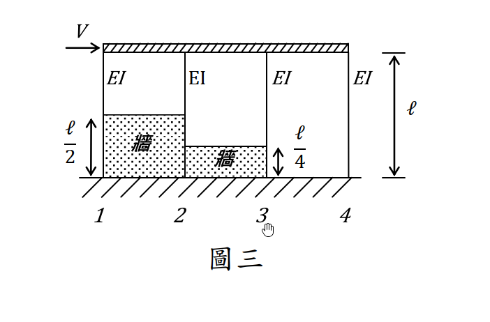

# 考題編號：SD-2017-3

**主分類：** `SD-U1-3` 單自由度、多自由度系統之動態分析及應用
**副分類：** `SD-U2-2` 建築耐震設計規範
**分析方法：** 概念題（含計算）
**標籤：** `剛性梁` `剛性牆` `短柱效應` `有效柱高` `剛度分配` `水平剪力` `固定固定柱` `側移剛度`

---

## 1. 原始題目重述 (Problem Restatement)

### 題目條件

結構如圖三，令**牆及梁均為剛性**（Rigid），試求編號 1、2、3、4 柱子所受的剪力。

**結構描述：**
- 水平力 $V$（→ 方向）作用於剛性頂梁
- 4 根柱子（由左至右編號 1、2、3、4），各柱 EI 相同
- 剛性牆（infill wall）產生「短柱效應」，改變各柱的**有效高度**（清淨高度）
- 各柱有效高度依圖三：
  - 柱 1：$h_1 = \ell/2$（受左側剛性牆約束）
  - 柱 2：$h_2 = \ell/2$（受同一剛性牆約束）
  - 柱 3：$h_3 = \ell/4$（受較高剛性牆約束，清淨高僅 $\ell/4$）
  - 柱 4：$h_4 = \ell$（無剛性牆，全高自由）

**邊界條件：**
- **柱底：** 固定端（fixed base）
- **柱頂：** 固定端（rigid beam → 節點無旋轉）
- → 所有柱均為**兩端固定（fixed-fixed）**



*圖說：水平力 V 作用於剛性頂梁；4 柱均有相同 EI，柱底固定端。剛性牆（infill wall）造成「短柱效應」：柱 1、2 有效高度 ℓ/2，柱 3 有效高度 ℓ/4，柱 4 有效高度 ℓ。剛性頂梁確保各柱頂固定端條件（無旋轉）。*

---

## 2. 考題核心精神與出題者意圖 (Core Concepts & Examiner's Intent)

### 核心觀念
- **短柱效應（Short Column Effect）：** 剛性牆縮短柱的有效高度，使柱剛度大幅增加（$k \propto 1/h^3$），承受更大比例的側向剪力
- **剛度分配法：** 剛性頂梁（rigid diaphragm）使各柱具有相同的側向位移 $\Delta$，各柱剪力按剛度比例分配
- **固定端柱側移剛度：** $k = 12EI/h^3$（兩端固定）

### 出題者意圖
1. 測驗考生對「剛性牆 → 短柱效應 → 有效高度縮短 → 剛度大增」的認識
2. 測驗剛度分配法的應用（rigid diaphragm 前提下）
3. 隱含考點：短柱吸收過大剪力是地震脆性破壞的主因（耐震設計的重要課題）

---

## 3. 解題戰略地圖與陷阱分析 (Strategic Roadmap & Trap Analysis)

### 步驟作戰計畫
```
Step 1: 判斷各柱有效高度（依剛性牆位置）
Step 2: 計算各柱側移剛度 k_i = 12EI/h_i³
Step 3: 計算總剛度 K = Σk_i
Step 4: 各柱剪力 V_i = (k_i/K)×V
Step 5: 驗算 ΣV_i = V
```

### 關鍵陷阱

| # | 陷阱 | 錯誤做法 | 正確做法 |
|---|------|---------|---------|
| 1 | 忽略短柱效應 | 用全高 ℓ 計算所有柱的剛度 | 依圖三判斷各柱有效高度（ℓ/2、ℓ/2、ℓ/4、ℓ） |
| 2 | 邊界條件錯誤 | 用固定端–自由端公式 $k=3EI/h^3$ | 剛性頂梁 → 柱頂固定，用 $k=12EI/h^3$ |
| 3 | 剪力分配忘記用比值 | 直接以 $12EI/h_i^3 \times \Delta$ 但不除以總剛度 | 先計算 $K_{total}$，再按比例分配 |
| 4 | 短柱剛度計算錯誤 | $k_3 = 12EI/(ℓ/4) = 48EI/ℓ$（忘記三次方）| $k_3 = 12EI/(ℓ/4)^3 = 768EI/\ell^3$ |

---

## 3.5 變數層次分析 (Variable Hierarchy Analysis)

> 複習提示：第一次解題後，在每個卡住的知識點旁標記 `⚠`；第二次複習時只看有 `⚠` 的項目。

### 最終目標
`求各柱剪力 V₁、V₂、V₃、V₄（以 V 和已知幾何量表示）`

### 本題關鍵公式（依計算順序）

> $\boxed{\cdot}$ = 由前步驟推導出的中間變數

$$\text{Step 1: 各柱側移剛度（兩端固定）}$$

$$k_i = \frac{12EI}{h_i^3}$$

$$\text{Step 2: 各柱具體剛度}$$

$$k_1 = k_2 = \frac{12EI}{(\ell/2)^3} = \frac{96EI}{\ell^3}, \quad k_3 = \frac{12EI}{(\ell/4)^3} = \frac{768EI}{\ell^3}, \quad k_4 = \frac{12EI}{\ell^3}$$

$$\text{Step 3: 總剛度}$$

$$K = k_1+k_2+k_3+k_4 = \frac{(96+96+768+12)EI}{\ell^3} = \frac{972EI}{\ell^3}$$

$$\text{Step 4: 各柱剪力（剛度分配）}$$

$$V_i = \frac{\boxed{k_i}}{\boxed{K}}\cdot V$$

### L1：題目直接給定

| 符號 | 數值 | 說明 |
|------|------|------|
| $V$ | 已知 | 水平施力 |
| $EI$ | 已知（4柱相同） | 各柱抗彎勁度 |
| $h_1 = h_2$ | $\ell/2$ | 柱1、2有效高度（由圖三讀取） |
| $h_3$ | $\ell/4$ | 柱3有效高度（由圖三讀取） |
| $h_4$ | $\ell$ | 柱4有效高度（無牆，全高） |

### L2：需知識點推導

**Step 1：各柱側移剛度**

| 符號 | 公式/來源 | 卡關? |
|------|----------|:-----:|
| $k_i$ | $12EI/h_i^3$（兩端固定柱側移剛度） | |
| $k_1$ | $12EI/(\ell/2)^3 = 12 \times 8 \times EI/\ell^3 = 96EI/\ell^3$ | |
| $k_2$ | 同 $k_1 = 96EI/\ell^3$ | |
| $k_3$ | $12EI/(\ell/4)^3 = 12 \times 64 \times EI/\ell^3 = 768EI/\ell^3$ | |
| $k_4$ | $12EI/\ell^3$ | |

**Step 2：剛度分配**

| 符號 | 公式/來源 | 卡關? |
|------|----------|:-----:|
| $K_{total}$ | $\sum k_i = (96+96+768+12)EI/\ell^3 = 972EI/\ell^3$ | |
| $V_i$ | $(k_i/K_{total})\times V$ | |

### L3：深層知識（不懂就卡住）

| 知識點 | 說明 | 卡關? |
|--------|------|:-----:|
| 兩端固定柱側移剛度公式 | $k=12EI/h^3$（固定固定）vs. $k=3EI/h^3$（固定自由）；差異4倍 | |
| 高度三次方的放大效應 | $h$ 減半 → $k$ 增加 $2^3=8$ 倍；$h$ 縮為 1/4 → $k$ 增加 $4^3=64$ 倍 | |
| 剛性梁（rigid diaphragm）的意義 | 同一層各柱頂有相同水平位移 $\Delta$，故剪力可按剛度比例分配 | |
| 短柱效應的耐震意義 | 短柱吸收過大剪力且剛度突變，地震時易脆性破壞（剪力破壞先於撓曲破壞） | |

---

## 4. 步驟化詳細計算過程 (Step-by-Step Detailed Calculation)

### Step 1：確認各柱有效高度

依圖三，剛性牆（rigid infill wall）造成短柱效應：

| 柱號 | 有效高度 $h_i$ | 說明 |
|------|-------------|------|
| 柱 1 | $\ell/2$ | 左側剛性牆將柱底固定點提升至 $\ell/2$，清淨高 = $\ell - \ell/2 = \ell/2$ |
| 柱 2 | $\ell/2$ | 同一剛性牆影響，清淨高 = $\ell/2$ |
| 柱 3 | $\ell/4$ | 中間剛性牆更高，清淨高僅 $\ell/4$（牆高 = $3\ell/4$） |
| 柱 4 | $\ell$ | 無剛性牆，全高自由 |

**邊界條件：**
- 剛性頂梁 → 柱頂固定（無旋轉）
- 剛性牆頂或基礎 → 柱底固定（無旋轉、無位移）
- **各柱均為兩端固定（fixed-fixed）**

### Step 2：計算各柱側移剛度

兩端固定柱的側移剛度（抗側力剛度）：

$$k = \frac{12EI}{h^3}$$

代入各柱有效高度：

$$k_1 = \frac{12EI}{(\ell/2)^3} = \frac{12EI}{\ell^3/8} = \frac{96EI}{\ell^3}$$

$$k_2 = \frac{12EI}{(\ell/2)^3} = \frac{96EI}{\ell^3}$$

$$k_3 = \frac{12EI}{(\ell/4)^3} = \frac{12EI}{\ell^3/64} = \frac{768EI}{\ell^3}$$

$$k_4 = \frac{12EI}{\ell^3}$$

**策略註解：** 柱高縮短對剛度的影響呈三次方關係。柱 3 高度為柱 4 的 1/4，剛度為柱 4 的 $4^3 = 64$ 倍，是本題剪力分配的主角。

### Step 3：計算總剛度

$$K_{total} = k_1 + k_2 + k_3 + k_4 = \frac{EI}{\ell^3}(96 + 96 + 768 + 12) = \frac{972\,EI}{\ell^3}$$

### Step 4：剪力分配

由剛性頂梁確保各柱頂有相同側移 $\Delta$，各柱剪力：

$$V_i = \frac{k_i}{K_{total}}\cdot V$$

**柱 1：**
$$V_1 = \frac{96}{972}\cdot V = \frac{8}{81}\,V$$

**柱 2：**
$$V_2 = \frac{96}{972}\cdot V = \frac{8}{81}\,V$$

**柱 3：**
$$V_3 = \frac{768}{972}\cdot V = \frac{64}{81}\,V$$

**柱 4：**
$$V_4 = \frac{12}{972}\cdot V = \frac{1}{81}\,V$$

### Step 5：驗算

$$V_1 + V_2 + V_3 + V_4 = \frac{8+8+64+1}{81}\cdot V = \frac{81}{81}\cdot V = V \quad \checkmark$$

### 最終答案

$$\boxed{V_1 = \frac{8}{81}V, \quad V_2 = \frac{8}{81}V, \quad V_3 = \frac{64}{81}V, \quad V_4 = \frac{1}{81}V}$$

---

## 5. 關鍵爭議點與進階探討 (Critical Issues & Advanced Discussion)

### 5.1 短柱效應的耐震危害

本題的計算結果揭示：柱 3（最短）承受總剪力的 64/81 ≈ 79%，而柱 4（最高）僅承受 1/81 ≈ 1.2%。

這正是「**短柱效應**」造成耐震危害的根源：
- 剛性牆（如磚牆）若僅填充部分高度，會造成相鄰柱的有效高度大幅縮短
- 短柱因承受過大剪力，在地震時容易發生**剪力脆性破壞**（而非延性撓曲破壞）
- 此為台灣地震後常見的典型破壞模式

### 5.2 邊界條件的影響

若柱頂非固定（例如頂梁並非完全剛性），則應使用**固定–自由（cantilever）**剛度：

$$k = \frac{3EI}{h^3}$$

此時各柱剛度比值不變（仍為 96:96:768:12），剪力分配結果不變。
但本題題目明確指出梁為剛性，故使用 $12EI/h^3$（固定–固定）。

### 5.3 實務建議：避免短柱設計

台灣建築耐震設計規範規定，如有填充牆（infill wall）與柱共同作用，應考慮短柱效應的剪力增大，並加強柱子的圍束箍筋（confinement ties），以防止地震中發生脆性剪力破壞。
