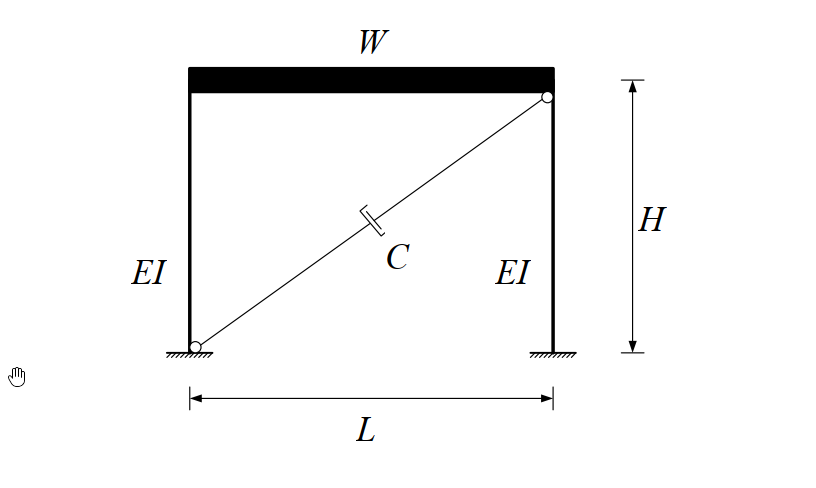

# 考題編號：SD-2018-1

**主分類：** `SD-U1-3` 單自由度、多自由度系統之動態分析及應用  
**副分類：** `SD-U3-2` 隔減震原理（被動控制：黏性阻尼器）  
**分析方法：** SDOF 強迫振動（基礎激振）+ 對角黏性阻尼器等效阻尼推導  
**標籤：** `SDOF` `剪力建築` `線性黏性阻尼器` `對角斜裝阻尼器` `等效阻尼` `阻尼比` `餘弦投影` `加速度反應譜` `最大位移` `阻尼器出力`

---

## 1. 原始題目重述 (Problem Restatement)

### 結構條件

*圖說：單層單跨剪力屋架。樓層總重 W = 70 kN，樓高 H = 3 m，跨距 L = 6 m。兩根固端柱，每根撓曲剛度 EI = 5000 kN-m²。阻尼器 C（kN-s/m）以對角斜稱方式裝設（從一角落延伸至對角落）。系統阻尼完全由阻尼器提供，忽略結構固有阻尼。*

### 子題

**(一)（15分）** 假設線性黏性阻尼器所提供之系統阻尼比 ξ = 5%，求阻尼係數 C（kN-s/m）。

**(二)（10分）** 若此剪力屋受地震激發，5% 阻尼比加速度彈性反應譜為：

$$S_a = \frac{0.15g}{T} \leq 0.3g, \quad g = 9.8 \text{ m/s}^2$$

求單層剪力屋**相對於地表之最大水平位移**與**阻尼器之最大出力**。

---

## 2. 考題核心精神與出題者意圖 (Core Concepts & Examiner's Intent)

**核心觀念：**
1. 對角安裝阻尼器的幾何投影——阻尼器軸向速度是樓層側向速度的 cosθ 倍，等效水平阻尼係數為 C·cos²θ。
2. SDOF 系統自然頻率、週期，以及從阻尼比反推阻尼係數 C。
3. 反應譜的正確讀值（判斷在哪個區段），再由 Sa 求 Sd（位移），由 Sv 求阻尼器出力。

**出題意圖：**
- 測驗考生是否熟悉對角阻尼器幾何轉換（cos²θ 投影）——常見陷阱是直接用 C = ξ·c_cr，忘記 cos²θ 修正。
- 測驗反應譜讀值判斷（T < 0.5 s 時處於加速度控制平台段）。
- 測驗從加速度反應譜求位移的路徑（Sa → Sd = Sa/ω₀²）。

---

## 3. 解題戰略地圖與陷阱分析 (Strategic Roadmap & Trap Analysis)

**作戰順序：**
1. 求結構側向勁度 k（固定端柱公式）
2. 求自然頻率 ω₀ 和週期 T
3. 求對角阻尼器幾何投影 cosθ
4. 由 ξ = C·cos²θ/(2mω₀) 解出 C
5. 查反應譜確認 Sa（判斷區段）
6. 求最大位移 Sd = Sa/ω₀²
7. 求阻尼器最大出力 F_d = C·Sv·cosθ

**陷阱清單：**

| # | 陷阱 | 正確做法 |
|---|------|---------|
| ★★★ | 阻尼器等效阻尼係數 c_eff = C（忘記 cos²θ） | c_eff = C·cos²θ，因樓層位移 u 使阻尼器伸長量僅 u·cosθ |
| ★★ | 反應譜區段判斷錯誤：直接用 Sa = 0.15g/T | T = 0.252 s < 0.5 s，處平台段，Sa = 0.3g |
| ★★ | 阻尼器最大出力用位移計算 | 阻尼器為速度相依元件，出力 F = C·δ̇ = C·Sv·cosθ |
| ★ | 質量單位混淆（重力 kN vs 質量 kN·s²/m） | m = W/g = 70/9.8 |

---

## 3.5 變數層次分析 (Variable Hierarchy Analysis)

> 複習提示：第一次解題後，在每個卡住的知識點旁標記 `⚠`；第二次複習時只看有 `⚠` 的項目。

### 最終目標
`(一) 求阻尼係數 C（kN-s/m）；(二) 求最大水平位移 Sd 與阻尼器最大出力 F_d,max`

### 本題關鍵公式（依計算順序）

$$\text{Step 1: } k = 2 \times \frac{12EI}{H^3}$$

$$\text{Step 2: } \omega_0 = \sqrt{\frac{k}{m}},\quad m = \frac{W}{g}$$

$$\text{Step 3: } \cos\theta = \frac{L}{\sqrt{H^2 + L^2}},\quad c_{\text{eff}} = C \cdot \cos^2\theta$$

$$\text{Step 4（一）: } \xi = \frac{c_{\text{eff}}}{2m\omega_0} \Rightarrow C = \frac{\xi \cdot 2m\omega_0}{\cos^2\theta}$$

$$\text{Step 5: } T = \frac{2\pi}{\boxed{\omega_0}},\quad S_a = \min\!\left(\frac{0.15g}{T},\; 0.3g\right)$$

$$\text{Step 6（二）: } S_d = \frac{S_a}{\boxed{\omega_0}^2}$$

$$\text{Step 7（二）: } S_v = \boxed{\omega_0} \cdot \boxed{S_d},\quad F_{d,\text{max}} = \boxed{C} \cdot \cos\theta \cdot \boxed{S_v}$$

### L1：題目直接給定

| 符號 | 數值 | 說明 |
|------|------|------|
| W | 70 kN | 樓層總重 |
| H | 3 m | 樓高 |
| L | 6 m | 跨距 |
| EI | 5000 kN-m² | 每根柱撓曲剛度 |
| ξ | 5% = 0.05 | 系統阻尼比（阻尼器提供） |
| g | 9.8 m/s² | 重力加速度 |

### L2：需知識點推導

**結構系統參數**

| 符號 | 公式／來源 | 卡關? |
|------|-----------|-------|
| k | 2×12EI/H³（兩固端柱並聯） | |
| m | W/g | |
| ω₀ | √(k/m) | |
| T | 2π/ω₀ | |

**阻尼器幾何**

| 符號 | 公式／來源 | 卡關? |
|------|-----------|-------|
| L_d | √(H²+L²)（對角長度） | |
| cosθ | L/L_d = L/√(H²+L²) | |
| cos²θ | (cosθ)² | |
| c_eff | C·cos²θ | |

**子題(一)：求 C**

| 符號 | 公式／來源 | 卡關? |
|------|-----------|-------|
| c_cr | 2mω₀（臨界阻尼係數） | |
| C | ξ·c_cr/cos²θ | |

**子題(二)：求 Sd 與 F_d**

| 符號 | 公式／來源 | 卡關? |
|------|-----------|-------|
| Sa | 判斷 T vs 0.5 s，取正確值 | |
| Sd | Sa/ω₀²（位移反應譜） | |
| Sv | ω₀·Sd（偽速度反應譜） | |
| δ̇_d,max | Sv·cosθ（阻尼器軸向最大速度） | |
| F_d,max | C·δ̇_d,max（阻尼器最大出力） | |

### L3：深層知識（不懂就卡住）

| 知識點 | 說明 | 卡關? |
|--------|------|-------|
| 對角阻尼器幾何轉換 | 樓層水平位移 u → 阻尼器伸長量 δ = u·cosθ，速度同比例；等效水平阻尼 c_eff = C·cos²θ（一次 cosθ 轉換伸長，一次 cosθ 轉換水平分力） | |
| 臨界阻尼係數 c_cr | c_cr = 2mω₀ = 2√(km)；ξ = c_eff/c_cr | |
| Sd、Sv、Sa 三者關係 | Sa = ω₀²·Sd；Sv = ω₀·Sd；Sa = ω₀·Sv（偽值，適用輕阻尼） | |
| 黏性阻尼器出力時機 | 最大出力發生在速度最大時（而非位移最大時），用 Sv 而非 Sd 計算 | |

---

## 4. 步驟化詳細計算過程 (Step-by-Step Detailed Calculation)

### Step 1：側向勁度 k

剪力屋架兩端固定柱，單柱側向剛度 = 12EI/H³，兩柱並聯：

$$k = 2 \times \frac{12EI}{H^3} = \frac{24 \times 5000}{3^3} = \frac{120{,}000}{27} \approx 4{,}444.4 \text{ kN/m}$$

### Step 2：質量與自然頻率

$$m = \frac{W}{g} = \frac{70}{9.8} \approx 7.143 \text{ kN·s}^2/\text{m}$$

$$\omega_0 = \sqrt{\frac{k}{m}} = \sqrt{\frac{4{,}444.4}{7.143}} = \sqrt{622.2} \approx 24.94 \text{ rad/s}$$

$$T = \frac{2\pi}{\omega_0} = \frac{2\pi}{24.94} \approx 0.252 \text{ s}$$

### Step 3：對角阻尼器幾何

$$L_d = \sqrt{H^2 + L^2} = \sqrt{3^2 + 6^2} = \sqrt{45} = 3\sqrt{5} \approx 6.708 \text{ m}$$

$$\cos\theta = \frac{L}{L_d} = \frac{6}{3\sqrt{5}} = \frac{2}{\sqrt{5}} \approx 0.8944$$

$$\cos^2\theta = \frac{4}{5} = 0.8$$

*策略註解：阻尼器對角安裝，樓層發生水平位移 u 時，阻尼器伸長量為 u·cosθ（幾何小位移線性化）。水平有效阻尼力 = C·u̇·cosθ·cosθ = C·cos²θ·u̇，故等效水平阻尼係數 c_eff = C·cos²θ。*

### Step 4（一）：求 C

臨界阻尼係數：

$$c_{cr} = 2m\omega_0 = 2 \times 7.143 \times 24.94 = 356.3 \text{ kN·s/m}$$

由 ξ = c_eff/c_cr：

$$\xi = \frac{C \cdot \cos^2\theta}{c_{cr}} \Rightarrow C = \frac{\xi \cdot c_{cr}}{\cos^2\theta} = \frac{0.05 \times 356.3}{0.8}$$

$$\boxed{C = \frac{17.815}{0.8} \approx 22.3 \text{ kN·s/m}}$$

### Step 5（二）：讀取 Sa

反應譜轉折點：令 0.15g/T = 0.3g → T* = 0.5 s

由於 T = 0.252 s < 0.5 s（短週期加速度控制區），取加速度上限：

$$S_a = 0.3g = 0.3 \times 9.8 = 2.94 \text{ m/s}^2$$

### Step 6（二）：最大水平位移

位移反應譜：

$$S_d = \frac{S_a}{\omega_0^2} = \frac{2.94}{622.2} \approx 0.00473 \text{ m}$$

$$\boxed{S_d \approx 4.73 \text{ mm} \approx 0.473 \text{ cm}}$$

*策略註解：此為結構樓板相對地表的最大水平位移，即反應譜位移 Sd。*

### Step 7（二）：阻尼器最大出力

偽速度反應譜（pseudo-velocity）：

$$S_v = \omega_0 \cdot S_d = 24.94 \times 0.00473 = 0.1179 \text{ m/s}$$

阻尼器軸向最大速度：

$$\dot{\delta}_{d,\text{max}} = S_v \cdot \cos\theta = 0.1179 \times \frac{2}{\sqrt{5}} = 0.1179 \times 0.8944 = 0.1055 \text{ m/s}$$

阻尼器最大出力（軸向力）：

$$F_{d,\text{max}} = C \cdot \dot{\delta}_{d,\text{max}} = 22.3 \times 0.1055$$

$$\boxed{F_{d,\text{max}} \approx 2.35 \text{ kN}}$$

---

## 5. 關鍵爭議點與進階探討 (Critical Issues & Advanced Discussion)

### 爭議一：對角阻尼器應取單斜撐還是 X 型？
題目說「以對角斜稱方式裝設**一**線性黏性阻尼器」，確認為單一對角阻尼器。若為兩支 X 型對稱配置，則 c_eff = 2C·cos²θ，C 值需減半。考場上見圖 X 型時須注意「幾個阻尼器」。

### 爭議二：Sv 的使用
偽速度 Sv = ω₀·Sd 在中低頻段（T = 0.1~1 s）是良好近似，在本題 T = 0.252 s 屬合理應用。嚴格而言最大速度與最大位移不同時發生，但考試中以 Sv 計算為標準做法。

### 進階觀念：阻尼器對角安裝的最佳角度
等效阻尼係數 c_eff = C·cos²θ，在 θ=0°（水平裝設）時 cos²θ=1 最大，但實際上幾何限制使 θ=0° 不可行。設計上通常取 θ = 30°~45° 作為折衷，本題 θ ≈ 26.6° 屬較平緩角度，cos²θ = 0.8 仍有良好效率。
