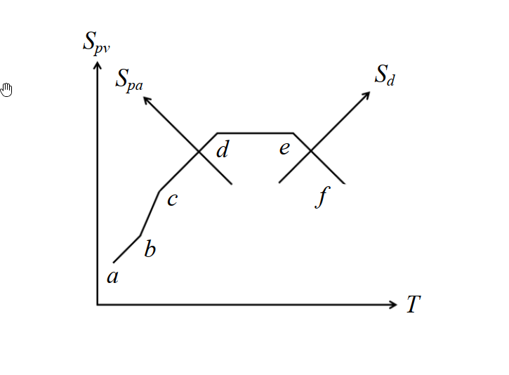
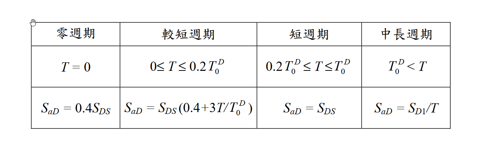

# 考題編號：SD-2018-2

**主分類：** `SD-U2-3` 橋梁耐震設計規範  
**副分類：** `SD-U1-1` 結構動力基本性質及原理  
**分析方法：** 概念題（推導＋規範對照）  
**標籤：** `Newmark三軸反應譜` `Tripartite Spectrum` `偽速度` `偽加速度` `位移反應譜` `對數座標` `加速度控制` `速度控制` `位移控制` `橋梁耐震規範` `設計反應譜` `反應譜形狀`

---

## 1. 原始題目重述 (Problem Restatement)



*圖說：Newmark三軸向地震設計反應譜（Tripartite Spectrum）。以 log-log 尺度繪製 Spv（縱）vs T（橫），其中：斜率 +1 的對角線代表常數 Spa 線，斜率 -1 的對角線代表常數 Sd 線。折線 a→b→c→d→e→f 由短週期至長週期依序涵蓋五個頻段：極短週期上升段（a-b）、常數加速度放大段（b-c）、常數速度放大段（c-d）、常數位移放大段（d-e）、長週期衰退段（e-f）。*



*圖說：交通部「公路橋梁耐震設計規範」設計地震反應譜分四段（見§2(二)詳述）。*

### 子題

**(一)（15分）** 由 $S_{pv} = \frac{T}{2\pi} S_{pa}$ 及 $S_{pv} = \frac{2\pi}{T} S_d$，推導並說明 $S_{pa}-S_{pv}-S_d-T$ 三軸座標系統的建置原理。

**(二)（10分）** 詳細說明交通部「公路橋梁耐震設計規範」設計地震反應譜之型式，與 Newmark 三軸向地震設計反應譜 a-b-c-d-e-f 的關聯性。

---

## 2. 考題核心精神與出題者意圖 (Core Concepts & Examiner's Intent)

**核心觀念：**
1. 三個反應譜量（Spa、Spv、Sd）之間由 ω（或 T）相互換算，使得在對數座標上可同時讀取三個量。
2. 設計反應譜的形狀對應於地震動能量在不同頻段的分布（加速度敏感、速度敏感、位移敏感）。
3. 台灣規範反應譜是 Newmark 三軸譜的簡化實用版，能對應辨認各段意義。

**出題意圖：**
- 測驗對「偽反應譜」三量之數學關係的推導能力。
- 測驗「對數座標上斜線代表什麼常數量」的幾何洞察。
- 測驗規範條文背後的物理意涵（而不僅是背公式）。

---

## 3. 解題戰略地圖與陷阱分析 (Strategic Roadmap & Trap Analysis)

**作戰順序：**

子題(一)：
1. 確立三量的代數關係（從偽速度出發）
2. 取對數，辨識「斜率 = ±1」的幾何意義
3. 說明三軸座標的建置：縱軸 Spv，橫軸 T，斜向軸 Spa（+45°）與 Sd（-45°）
4. 說明在此圖上如何同時讀出三量

子題(二)：
1. 列出橋梁規範反應譜各段
2. 逐段對應到 Newmark 折線段（a-b-c-d-e-f）
3. 說明相似處（形狀）與差異（台灣規範缺少常數位移段 d-e）

**陷阱清單：**

| # | 陷阱 | 正確做法 |
|---|------|---------|
| ★★★ | 混淆 Spa/Spv/Sd 與真實加速度/速度/位移 | 此三量均為「偽」值，僅 Sd 等同最大相對位移；Spv ≈ 最大相對速度（輕阻尼）；Spa = ω²·Sd ≠ 最大絕對加速度 |
| ★★ | 對數座標斜率分析方向搞反 | 常數 Spa 線：log Spv = log T + const → 斜率 **+1**（右上方斜線）；常數 Sd 線：log Spv = −log T + const → 斜率 **−1**（右下方斜線） |
| ★ | 遺漏橋梁規範的「零週期」與「較短週期」過渡段 | 對應 Newmark a-b 段（ZPA 到加速度放大平台的過渡） |

---

## 3.5 變數層次分析 (Variable Hierarchy Analysis)

### 最終目標
`(一) 推導三軸座標幾何原理；(二) 對應橋梁規範各段至 Newmark 折線`

### 本題關鍵公式（依計算順序）

$$\text{Step 1: } S_{pv} = \frac{T}{2\pi} S_{pa} \quad \Rightarrow \quad S_{pa} = \frac{2\pi}{T} S_{pv} = \omega \cdot S_{pv}$$

$$\text{Step 2: } S_{pv} = \frac{2\pi}{T} S_d \quad \Rightarrow \quad S_d = \frac{T}{2\pi} S_{pv}$$

$$\text{Step 3: } \log S_{pv} = \log T + \log\!\frac{S_{pa}}{2\pi} \quad (\text{斜率 } {+1}\text{ 之對角線} = \text{常數 }S_{pa})$$

$$\text{Step 4: } \log S_{pv} = -\log T + \log(2\pi S_d) \quad (\text{斜率 } {-1}\text{ 之對角線} = \text{常數 }S_d)$$

### L1：題目直接給定

| 符號 | 意義 |
|------|------|
| $S_{pv} = \frac{T}{2\pi}S_{pa}$ | 偽速度與偽加速度換算（ω = 2π/T） |
| $S_{pv} = \frac{2\pi}{T}S_d$ | 偽速度與位移換算 |

### L2：需知識點推導

| 推導步驟 | 說明 | 卡關? |
|---------|------|-------|
| 取 log 得線性關係 | log(Spv) vs log(T) 中，Spa 常數線斜率 +1，Sd 常數線斜率 −1 | |
| 三軸方向 | 縱軸 Spv；橫軸 T；右上 45° 斜軸讀 Spa；右下 45° 斜軸讀 Sd | |
| 各反應譜段控制區 | 短週期→加速度控制；中週期→速度控制；長週期→位移控制 | |

### L3：深層知識

| 知識點 | 說明 | 卡關? |
|--------|------|-------|
| 偽速度的物理意義 | Spv = ω·Sd，並非真實最大速度；對輕阻尼 SDOF 是良好近似 | |
| 為何用對數座標 | 動態範圍跨越數個數量級（T 從 0.01 s 到 10+ s），對數座標使斜線代表簡單的冪律關係 | |
| 三段放大區物理背景 | 高頻（短T）：剛體跟地震走 → 加速度控制；中頻：主要動力反應 → 速度控制；低頻（長T）：柔性結構幾乎不動 → 位移控制 | |

---

## 4. 步驟化詳細計算過程 (Step-by-Step Detailed Calculation)

### 子題(一)：Spa-Spv-Sd-T 三軸座標建置原理

#### 4.1 三量的代數關係

對於阻尼比 ξ 的 SDOF 系統，定義三個**偽（pseudo）**反應譜量：

$$S_d(T, \xi) = \max|u(t)| \quad \text{（位移反應譜，又稱 SD）}$$

$$S_{pv}(T, \xi) = \frac{2\pi}{T} S_d = \omega_0 \cdot S_d \quad \text{（偽速度反應譜，又稱 PSV）}$$

$$S_{pa}(T, \xi) = \left(\frac{2\pi}{T}\right)^2 S_d = \omega_0^2 \cdot S_d = \frac{2\pi}{T} S_{pv} \quad \text{（偽加速度反應譜，又稱 PSA）}$$

由此得題目所給兩式（整理方向）：

$$S_{pv} = \frac{T}{2\pi} S_{pa} \qquad S_{pv} = \frac{2\pi}{T} S_d$$

三量完全等價——知道其一（加上週期 T），另兩個立即可求。

#### 4.2 對數座標上的幾何意義

在 $\log S_{pv}$–$\log T$ 平面上，對兩式取對數：

**（A）常數 Spa 線：**

$$\log S_{pv} = \log T + \underbrace{\log\frac{S_{pa}}{2\pi}}_{\text{常數}（S_{pa}\text{固定時）}}$$

→ 斜率 **+1** 的對角線（由左下向右上延伸，與水平成 +45°）

**（B）常數 Sd 線：**

$$\log S_{pv} = -\log T + \underbrace{\log(2\pi S_d)}_{\text{常數}（S_d\text{固定時）}}$$

→ 斜率 **−1** 的對角線（由左上向右下延伸，與水平成 −45°）

#### 4.3 三軸座標系統的建置

以 $\log S_{pv}$（縱軸）對 $\log T$（橫軸）為主坐標，再疊加兩組斜向軸：

```
  log Spv
    │
    │     /  ← 斜率+1線族（Spa = const）
    │    / ↗ Spa 軸方向（讀大值在右上）
    │   ×
    │    \ ↘ Sd 軸方向（讀大值在右下）
    │     \  ← 斜率-1線族（Sd = const）
    └─────────── log T
```

**操作方式：** 給定週期 T，在圖上確定一個點（T, Spv）：
- 讀縱軸 → 得 **Spv**
- 沿斜率 +1 方向查對應斜線 → 得 **Spa**（讀右上角刻度）
- 沿斜率 −1 方向查對應斜線 → 得 **Sd**（讀右下角刻度）

**三軸同時讀值**正是此座標系統的核心優點，故稱「Tripartite（三軸向）」反應譜。

#### 4.4 折線 a-b-c-d-e-f 的物理對應

| 段 | Spv-T 圖形狀 | 控制量 | 物理意義 |
|----|-------------|--------|---------|
| a→b | 斜率 +1 上升 | Sa → PGA（零週期加速度） | 極短週期：剛體跟隨地震，Sa → 地表PGA |
| b→c | 斜率 +1 斜線（Spa=const平台） | $S_{pa} = \alpha_A \cdot \text{PGA}$ | **加速度控制**：Sa 放大達最大值，Spv 隨 T 線性增加 |
| c→d | 水平線（Spv=const平台） | $S_{pv} = \alpha_V \cdot \text{PGV}$ | **速度控制**：Spv 恆定，Sa ∝ 1/T，Sd ∝ T |
| d→e | 斜率 −1 斜線（Sd=const平台） | $S_d = \alpha_D \cdot \text{PGD}$ | **位移控制**：Sd 恆定，Spv ∝ 1/T，Sa ∝ 1/T² |
| e→f | 斜率 −1 下降 | Sd → PGD | 極長週期：柔性結構不動，絕對位移 → 地表位移 |

*策略註解：三個放大係數 αA、αV、αD 由 Newmark 統計大量地震記錄的百分位數決定（如 84th percentile）。*

---

### 子題(二)：橋梁規範設計反應譜與 Newmark 三軸譜的關聯性

#### 4.5 橋梁規範反應譜四段（以 Sa-T 直角座標表示）

| 段 | 週期範圍 | 公式 |
|----|---------|------|
| ① 零週期 | $T = 0$ | $S_{aD} = 0.4\,S_{DS}$ |
| ② 較短週期（過渡段） | $0 \leq T \leq 0.2T_0^D$ | $S_{aD} = S_{DS}\!\left(0.4 + \dfrac{3T}{T_0^D}\right)$ |
| ③ 短週期（加速度平台） | $0.2T_0^D \leq T \leq T_0^D$ | $S_{aD} = S_{DS}$（常數） |
| ④ 中長週期（1/T 下降） | $T_0^D < T$ | $S_{aD} = S_{D1}/T$ |

其中 $T_0^D = S_{D1}/S_{DS}$（平台期末端週期）。

#### 4.6 逐段對應 Newmark 折線

| 規範段 | 對應 Newmark 段 | 控制量 | 說明 |
|--------|----------------|--------|------|
| ① 零週期 $S_{aD}=0.4S_{DS}$ | 段 **a**（T=0，ZPA） | PGA | 零週期加速度，對應地表最大加速度（即 PGA 的規範化表示） |
| ② 線性過渡段 | 段 **a→b**（上升） | — | 從 ZPA 線性增加至加速度放大平台，對應 Newmark 圖上 a 到 b 的上升段 |
| ③ 加速度平台 $S_{aD}=S_{DS}$ | 段 **b→c**（常數 Sa） | $S_{pa}$ | 加速度控制區，在 Tripartite 圖上沿斜率 +1 直線（Spa=SDS=const） |
| ④ 1/T 下降 $S_{aD}=S_{D1}/T$ | 段 **c→d**（常數 Spv） | $S_{pv}$ | 速度控制區：$S_{pv} = (T/2\pi)\cdot(S_{D1}/T) = S_{D1}/(2\pi) = \text{const}$，在 Tripartite 圖上呈水平線 |

#### 4.7 差異分析

| 比較面向 | Newmark 三軸譜 | 台灣橋梁規範 |
|---------|---------------|-------------|
| 常數 Sd 段（d→e） | **有**，長週期位移控制段 | **無**，$1/T$ 延伸至無限長週期 |
| 長週期衰退（e→f） | **有** | **無** |
| 規範簡化動機 | 統計基礎，四段放大區 | 工程實用，保守（不設置常數 Sd 段意味著長週期 Sa 仍持續降低，不偏保守） |
| 橋梁長週期處理 | 明確 αD·PGD 上限 | 隱含：工程師應另行評估長週期位移需求 |

**核心關聯：** 台灣橋梁規範設計反應譜是 Newmark 三軸反應譜在工程規範層次的簡化。形狀上對應 Newmark 的 a-b-c-d 四段（缺少 d-e-f 的常數位移段與長週期衰退），以 SDS 和 SD1 兩個參數替代 Newmark 的三個放大係數（αA、αV、αD）與地震動參數（PGA、PGV、PGD）的組合。二者的本質相同：**反應譜在不同週期段分別由加速度、速度、位移的放大量所控制**。

---

## 5. 關鍵爭議點與進階探討 (Critical Issues & Advanced Discussion)

### 爭議：Spv 是否等於真實最大相對速度？

Spv = ω₀·Sd 是**偽（pseudo）**速度，並非真實最大相對速度 $\dot{u}_{\max}$。對輕阻尼系統（ξ ≤ 5%），Spv ≈ $\dot{u}_{\max}$，誤差可接受。但對高阻尼系統（如隔震結構 ξ = 20%~30%），Spv 可能顯著高估真實速度，不宜直接用 Spv 計算阻尼器出力。

### 進階：為何三段放大而非單一放大？

地震動的能量分布不均：
- **高頻（短 T）**：地震動中高頻分量大，剛性結構接近地盤運動，Sa 被放大。
- **中頻（中 T）**：結構共振範圍，Spv 最大。
- **低頻（長 T）**：地盤位移較大，柔性結構幾乎靜止，Sd 被放大。

三段控制是地震動頻率特性的物理反映，Newmark 三軸譜的貢獻在於提供一個工具，讓工程師能在同一張圖上同時掌握這三個面向的需求。

### 台灣橋梁規範缺少常數位移段的影響

對 T > T₀D 的長週期橋梁（如長跨橋、隔震橋），規範以 $S_{aD} = S_{D1}/T$ 計算位移 $S_d = S_{aD}\cdot T^2/(4\pi^2) = S_{D1}\cdot T/(4\pi^2)$，位移隨 T 線性增加，無上限。實際上 Newmark 的 d-e 段存在位移上限 αD·PGD，故規範側偏保守。工程師設計長週期結構時應留意此點。
