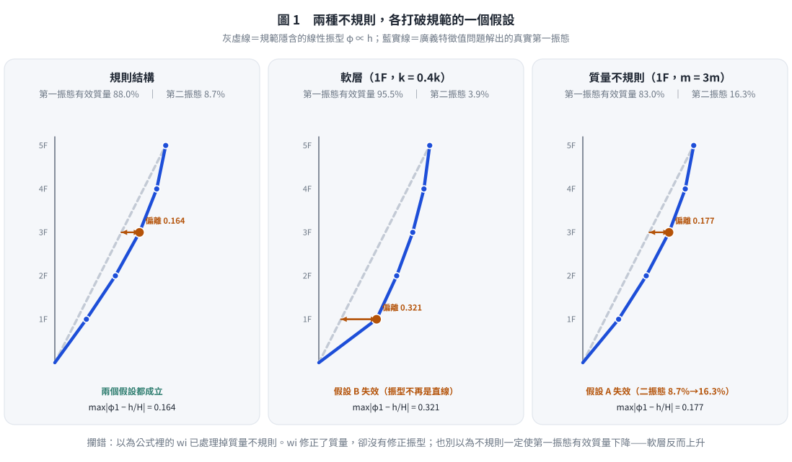
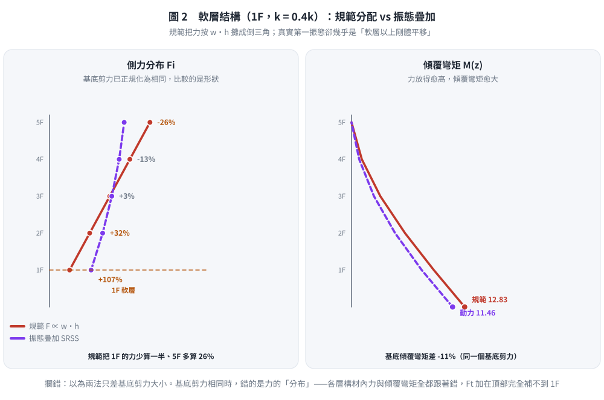
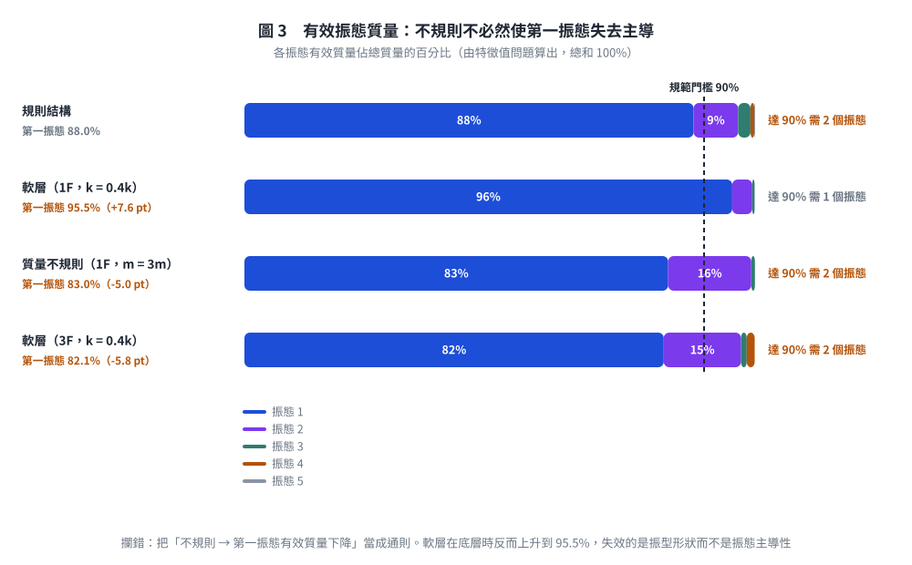

# 考題編號：SD-2018-3

**主分類：** `SD-U2-2` 建築耐震設計規範  
**副分類：** `SD-U1-3` 單自由度、多自由度系統之動態分析及應用  
**分析方法：** 概念題（規範論述＋動力學比較）  
**標籤：** `等效靜力法` `豎向分配` `倒三角分布` `振態疊加` `模態分析` `軟層` `勁度不規則` `質量不規則` `高階振態` `第一振態主導` `規則性` `動力分析必要性` `耐震設計規範`

---

## 1. 原始題目重述 (Problem Restatement)

本題為純文字概念題，無附圖。

**題幹：** 試由內政部「建築物耐震設計規範及解說」之地震力**豎向分配**與結構動力學之地震力豎向分配的比較，詳細說明為何「建築物耐震設計規範及解說」中規定：建築物具**勁度立面不規則性（軟層）**或**質量不規則性**時，須進行動力分析。（25分）

---

## 2. 考題核心精神與出題者意圖 (Core Concepts & Examiner's Intent)

**核心觀念：**
1. 規範等效靜力法的豎向分配隱含「第一振態主導 + 線性位移形狀」兩個假設。
2. 軟層與質量不規則**各自破壞其中一個假設**（軟層破壞假設 B，質量不規則破壞假設 A），兩者都足以讓規範分配失真。
3. 動力分析（模態疊加法）不依賴這兩個假設，能正確反映不規則結構的振態形狀與各振態貢獻。

**出題意圖：**
- 測驗對「等效靜力法背後假設」的深度理解（而非只會套公式）。
- 測驗「軟層」與「質量不規則」分別如何破壞各假設，並能具體說明誤差機制。
- 測驗能夠連結規範條文（須做動力分析）與力學背景（振態形狀改變）的能力。

---

## 3. 解題戰略地圖與陷阱分析 (Strategic Roadmap & Trap Analysis)

**作戰順序：**
1. 列出規範等效靜力法的豎向分配公式，指出其隱含假設
2. 列出動力學（模態疊加）的豎向分配方法，對比差異
3. 分析軟層（勁度不規則）如何使假設失效
4. 分析質量不規則如何使假設失效
5. 結論：動力分析無此假設限制，故不規則結構須用動力分析

**陷阱清單：**

| # | 陷阱 | 正確做法 |
|---|------|---------|
| ★★★ | 只說「不規則須動力分析」但不解釋「為何規範公式不適用」 | 必須明確指出規範假設（線性振型、第一振態主導），再說明如何被破壞 |
| ★★ | 混淆「質量不規則影響」：誤以為規範 Fᵢ ∝ wᵢhᵢ 中 wᵢ 已完整處理質量不規則 | wᵢ 雖包含質量，但位移假設（∝ hᵢ）仍未反映大質量樓層帶來的振態扭曲 |
| ★ | 忘記說明「高階振態」在不規則結構中重要性上升 | 軟層使多個振態均有顯著貢獻，等效靜力法的頂部集中力 Ft 無法準確補償 |

---

## 3.5 變數層次分析 (Variable Hierarchy Analysis)

### 最終目標
`說明規範豎向分配假設 → 指出不規則結構破壞假設的機制 → 說明動力分析能正確處理`

### 本題關鍵公式（依說明順序）

$$\text{規範豎向分配：} F_i = \frac{w_i h_i}{\displaystyle\sum_{j=1}^n w_j h_j}(V - F_t)$$

$$\text{動力學等效靜力（第 }r\text{ 振態）：} f_{ir} = \Gamma_r \cdot S_a(T_r) \cdot m_i \cdot \phi_{ir}$$

$$\text{SRSS 組合：} F_i = \sqrt{\sum_r f_{ir}^2}$$

$$\text{模態參與因子：} \Gamma_r = \frac{\{\phi\}_r^T [M]\{1\}}{\{\phi\}_r^T [M]\{\phi\}_r}$$

### L1：題目直接給定

| 概念 | 說明 |
|------|------|
| 規範規定 | 勁度立面不規則（軟層）或質量不規則→須進行動力分析 |
| 比較對象 | 規範等效靜力法 vs 動力學振態疊加法 |

### L2：需知識點推導

| 知識點 | 說明 | 卡關? |
|--------|------|-------|
| 規範假設①：第一振態主導 | 等效靜力法假設地震力絕大部分由第一振態承擔（規則建築的第一振態有效質量常達 80% 以上），高階振態僅以 $F_t$ 概略補償 | |
| 規範假設②：線性位移形狀 | $\phi_{i1} \propto h_i$，即各樓層位移與高度成正比 | |
| 動力分析不需此假設 | 振態向量由特徵值問題精確求解 | |
| 軟層破壞假設②（主要） | 振型在軟層處出現斜率突變，偏離直線程度由 0.164 增為 0.321 | |
| 軟層對假設①的影響 | **不降反升**（$m_1^*$ 88.0% → 95.5%）：上部趨近剛體平移，反而更像 SDOF | |
| 質量不規則破壞假設①（主要） | 二振態有效質量 8.7% → 16.3%，第一振態不再獨大 | |
| 質量不規則對假設②的影響 | 有但較小（偏離 0.164 → 0.177）：$w_i$ 修正了質量、沒修正振型 | |

### L3：深層知識

| 知識點 | 說明 | 卡關? |
|--------|------|-------|
| 頂部集中力 Ft 的設計動機 | Ft = 0.07TV（T > 0.7 s 時）用以補償高階振態在頂部的貢獻，但僅適用於規則結構 | |
| 有效振態質量（Effective Modal Mass） | $m_r^* = \Gamma_r^2 \cdot m_r^{**}$；規則結構第一振態有效質量 ≥ 85%，不規則結構可能遠低 | |
| 層間位移角（Interstory Drift Ratio） | 軟層的層間位移遠大於其他樓層，規範倒三角分布無法反映此集中效應 | |

---

## 4. 步驟化詳細計算過程 (Step-by-Step Detailed Calculation)

> 本題為概念推論題，以文字論述與公式對照取代數值計算。

### 4.1 規範地震力豎向分配（等效靜力法）

台灣「建築物耐震設計規範」採等效靜力法，先計算基底剪力 V，再按下列公式分配至各樓層：

$$\boxed{F_i = \frac{w_i h_i}{\displaystyle\sum_{j=1}^n w_j h_j}(V - F_t)}$$

$$F_t = \begin{cases} 0.07TV \leq 0.25V & T > 0.7 \text{ s（頂部集中力）} \\ 0 & T \leq 0.7 \text{ s} \end{cases}$$

其中 $w_i$ 為第 $i$ 層有效重量，$h_i$ 為第 $i$ 層距地面高度。

**此公式隱含兩個核心假設：**

> **假設 A（振態主導）：** 第一振態單獨主導結構地震反應，高階振態的貢獻可忽略（或以 $F_t$ 概略補償）。
>
> **假設 B（線性位移形狀）：** 第一振態振型向量 $\{\phi\}_1$ 呈線性分布，即 $\phi_{i1} \propto h_i$（各樓層位移與樓高成正比），對應倒三角形側力分布。

---

### 4.2 動力學地震力豎向分配（振態疊加法）

在動力分析中，第 $r$ 個振態對第 $i$ 層的等效靜態地震力為：

$$f_{ir} = \Gamma_r \cdot S_a(T_r, \xi_r) \cdot m_i \cdot \phi_{ir}$$

其中 $\Gamma_r$ 為第 $r$ 振態的**模態參與因子**：

$$\Gamma_r = \frac{\{\phi\}_r^T [M]\{1\}}{\{\phi\}_r^T [M]\{\phi\}_r}$$

各樓層的最大地震力以 SRSS 或 CQC 振態疊加：

$$F_i = \sqrt{\sum_r f_{ir}^2} \quad \text{（SRSS 法）}$$

**動力分析的關鍵特點：**
- 振態向量 $\{\phi\}_r$ 由特徵值問題 $([K] - \omega_r^2[M])\{\phi\}_r = \{0\}$ 精確求解，**不假設任何振型形狀**。
- 需納入足夠多振態使有效質量合計 $\geq 90\%$ 總質量，可適當捕捉高階振態貢獻。
- 不依賴「第一振態主導」或「線性位移」的假設。

---

#### 4.2.1 兩式其實是同一式——規範分配是動力學分配的特例（本題的核心）

把假設 A、B 直接代進動力學公式，規範公式會**自己掉出來**。這一步是本題 25 分的骨幹，
只作文字比較而不做這個代換，很難拿到高分。

只取第一振態（假設 A），並代入線性振型 $\phi_{i1} = h_i/H$（假設 B）與 $m_i = w_i/g$：

$$f_{i1} = \Gamma_1 S_a(T_1)\, m_i \phi_{i1} = \Gamma_1 S_a(T_1)\cdot\frac{w_i}{g}\cdot\frac{h_i}{H} = \underbrace{\frac{\Gamma_1 S_a(T_1)}{gH}}_{\text{與 } i \text{ 無關的常數}} \cdot w_i h_i$$

基底剪力為各層力之和：

$$V = \sum_{i=1}^{n} f_{i1} = \frac{\Gamma_1 S_a(T_1)}{gH}\sum_{j=1}^{n} w_j h_j$$

兩式相除，常數完全消去：

$$\boxed{\frac{f_{i1}}{V} = \frac{w_i h_i}{\displaystyle\sum_{j} w_j h_j} \;\;\Longrightarrow\;\; F_i = \frac{w_i h_i}{\displaystyle\sum_j w_j h_j}\,V}$$

**這就是規範的豎向分配式。** 由此可以把兩者的關係說得很精確：

| | 規範等效靜力法 | 動力學振態疊加 |
|---|---|---|
| 振態數 | 1（第一振態） | $n$（累積有效質量 $\ge$ 90%） |
| 振型 | 指定為 $\phi_{i1} \propto h_i$ | 由 $([K]-\omega_r^2[M])\{\phi\}_r = 0$ 解出 |
| 譜值 | 單一 $S_a(T_1)$ | 各振態各取 $S_a(T_r,\xi_r)$ |
| 組合 | 代數和（同相位） | SRSS／CQC（考慮相位不同步） |

> **關鍵結論：規範公式不是另一套理論，而是動力學公式在「單振態＋線性振型」兩個假設下的化簡。**
> 因此，只要這兩個假設被破壞，規範公式就沒有力學基礎——這正是規範要求不規則結構做動力分析的理由。
> 而 $F_t$ 只是對假設 A 打的一個補丁（把高階振態的效應集中補在頂部），
> 對假設 B 的失效（振型不再是直線）**完全無能為力**。

---



*圖 1　三種結構的第一振態實解與規範線性振型的對照（5 層剪力屋架，廣義特徵值問題）。它攔的是兩個常見誤解：以為公式裡的 $w_i$ 已處理掉質量不規則，以及以為「不規則必然使第一振態有效質量下降」——軟層在底層時反而升到 95.5%。*

### 4.3 規則結構的情況（假設成立）

對均勻質量（$w_i = w$）、均勻勁度的規則結構：

- **第一振態振型** $\phi_{i1}$ 接近線性分布（振型在剪力建築中近似 $\phi_{i1} \propto h_i$）。
- **第一振態有效質量** $m_1^* / m_{total}$ 常在 80～90%（經驗值，非規範規定），高階振態貢獻小。

此時規範倒三角分布（假設A + 假設B）與動力分析結果相近，等效靜力法偏差可接受。

---

### 4.4 勁度立面不規則性（軟層）使假設失效

**軟層定義（規範「勁度立面不規則性」）：** 某層之側向勁度

$$k_i < 0.70\,k_{i+1} \quad\text{（小於其上一層的 70%）}\qquad\text{或}\qquad k_i < 0.80 \times \frac{k_{i+1}+k_{i+2}+k_{i+3}}{3} \quad\text{（小於其上三層平均的 80%）}$$

（極軟層則為 60% 與 70%。）**兩個門檻不可對調**：與**上一層**比是 0.70，與**上三層平均**比是 0.80。

**破壞假設 B（線性位移）：**

軟層勁度突降，使層間位移角在軟層處**急遽集中**：

```
規則結構（線性振型）：   軟層結構（振型扭折）：
  ▬ ── 第5層              ▬ ── 第5層
  │                         │
  ▬ ── 第4層              ▬ ── 第4層
  │    （均勻）             │
  ▬ ── 第3層              ▬ ── 第3層（軟層上方）
  │                         ║ ← 軟層：位移集中，振型扭折
  ▬ ── 第2層（軟層）     ▬ ── 第2層（軟層，大層間位移）
  │                         │
  ▬ ── 第1層              ▬ ── 第1層
```

實際振型 $\phi_{i1}$ **不再線性**（在軟層上下出現斜率突變），規範的 $w_i h_i$ 分配**嚴重低估軟層以上各層的真實位移需求**，軟層本身的設計地震力亦被低估。

**假設 A 呢？——這裡有一個反直覺的實算結果，不可想當然爾：**

以 5 層剪力屋架（各層 $m$、$k$ 相同，僅第 1 層 $k_1 = 0.4k$）解特徵值問題，
第一振態有效質量**不降反升**：

| 結構 | $m_1^*/M$ | $m_2^*/M$ | $\max|\phi_{i1} - h_i/H|$ |
|------|:---:|:---:|:---:|
| 規則 | 88.0% | 8.7% | 0.164 |
| **軟層（1F，$k_1 = 0.4k$）** | **95.5%** | 3.9% | **0.321** |

原因是底層變柔之後，上部各層趨近於「跟著軟層一起剛體平移」，
反而更像單一自由度系統——**第一振態更主導了，但它的形狀離直線更遠**。

**因此，軟層真正破壞的是假設 B，不是假設 A。**
若在考卷上寫「軟層使第一振態有效質量下降」，遇到會實際算的閱卷者是站不住腳的。
（軟層若發生在中間樓層，例如 3F，$m_1^*$ 才會降到 82.1%——位置不同，結論不同。）

**後果：** 力的**分配比例**錯了。以同一基底剪力比較，規範把 1F 的力少算約一半、
把 5F 的力多算約 26%（見圖 2），各層構材內力與傾覆彎矩因此全部偏離；
而 $F_t$ 固定加在頂部，對 1F 的低估完全無能為力。
更嚴重的是進入非線性後變形會進一步集中於軟層，最終形成「軟層機構」（soft-story collapse），
這已超出彈性動力分析所能預測的範圍，故規範直接要求此類結構做動力分析並從嚴設計。

---



*圖 2　同一棟軟層結構、同一個基底剪力下的兩種分配。它攔的是「兩法只差基底剪力大小」的誤解：基底剪力相同時錯的是力的**分布**——1F 少算約一半、5F 多算 26%，傾覆彎矩隨之偏差 11%。*

### 4.5 質量不規則性使假設失效

**質量不規則定義（規範）：** 某樓層有效質量 $> 1.5$ 倍相鄰樓層質量（頂層不計）。

**破壞假設 B（線性位移）：**

質量矩陣 $[M]$ 在大質量樓層出現集中，改變特徵值問題的解。關鍵在於**剪力的重分配**：
第 $i$ 層的層間剪力等於其上方所有樓層慣性力之和

$$V_i = \sum_{j \ge i} m_j \ddot{u}_j \;\;\Longrightarrow\;\; \Delta_i = \frac{V_i}{k_i}$$

集中的大質量使**它下方**每一層的剪力都被抬高，層間位移隨之加大；而**它上方**各層剪力不受影響。
於是第一振態的形狀在大質量樓層以下變陡、以上變平——**斜率在該層出現轉折，不再是直線**。

舉例：若第 3 層質量為其他層的 3 倍（$m_3 = 3m$，5 層建築）：
- 第 1～3 層的層間位移被明顯放大，第 4～5 層相對變平
- 規範公式 $F_3 \propto w_3 h_3 = 3w\cdot h_3$ 雖已按 $w_3$ 放大該層的力，
  但它同時**假設** $\phi_{i1} \propto h_i$；而真實振型已因 $m_3$ 而轉折，
  下方各層的力被低估、上方各層被高估。**$w_i$ 修正了「質量」，卻沒有修正「振型」——這正是規範公式失效的關鍵。**

**破壞假設 A（第一振態主導）：**

大質量樓層改變各振態的**模態參與因子** $\Gamma_r$ 分布：

$$\Gamma_r = \frac{\sum_i m_i \phi_{ir}}{\sum_i m_i \phi_{ir}^2}$$

集中大質量使高階振態的 $\Gamma_r$ 增大，第一振態有效質量佔比下降。同一 5 層模型（第 1 層 $m_1 = 3m$）實算：

| 結構 | $m_1^*/M$ | $m_2^*/M$ | $\max|\phi_{i1} - h_i/H|$ |
|------|:---:|:---:|:---:|
| 規則 | 88.0% | 8.7% | 0.164 |
| **質量不規則（1F，$m_1 = 3m$）** | **83.0%** | **16.3%** | 0.177 |

第二振態的有效質量幾乎翻倍（8.7% → 16.3%），**這才是「假設 A 失效」的實據**；
而振型偏離直線的程度只從 0.164 微增到 0.177，假設 B 受影響有限。
規範的 $F_t$ 補償是針對規則結構校準的，無法正確反映此效應。

> **把兩者並排看，本題的答案就完整了：**
> 軟層破壞「線性振型」（假設 B），質量不規則破壞「第一振態主導」（假設 A）。
> 規範的豎向分配式**同時**依賴這兩個假設，任一個被打破，公式就失去力學基礎——
> 這正是規範對兩種不規則都要求做動力分析的理由。

---

### 4.6 動力分析的必要性結論

| 比較項目 | 規範等效靜力法 | 動力分析（振態疊加） |
|---------|--------------|------------------|
| **振型假設** | $\phi_{i1} \propto h_i$（線性，倒三角） | 特徵值問題精確求解，無形狀假設 |
| **高階振態** | 以 $F_t$ 概略補償，形式固定 | 逐一計算 $f_{ir}$，可捕捉任意振態分布 |
| **軟層效應** | **假設 B 失效**：振型偏離直線 0.321（規則僅 0.164），1F 力少算約一半 | 振型的扭折由 $[K]$ 精確反映 |
| **質量不規則** | **假設 A 失效**：二振態有效質量 8.7% → 16.3%；且 $w_i$ 只修正質量、未修正振型 | $[M]$ 不規則完整影響振態形狀與參與因子 |
| **有效質量驗算** | 不適用 | 須確認 $\sum m_r^* \geq 90\%$ |

**規範規定不規則結構須進行動力分析的根本理由：**

> 等效靜力法的倒三角豎向分配，可由動力學公式 $f_{ir} = \Gamma_r S_a m_i \phi_{ir}$ 在
> 「只取第一振態（假設 A）」與「振型為直線 $\phi_{i1} \propto h_i$（假設 B）」兩個條件下直接推得，
> 因此它不是另一套理論，而是動力學公式的一個**特例**。
> 勁度立面不規則（軟層）使第一振態嚴重偏離直線，**破壞假設 B**；
> 質量不規則使高階振態的有效質量顯著上升，**破壞假設 A**。
> 兩者各打破一個支撐條件，等效靜力法即失去力學基礎，
> 算出的各層力分配（乃至傾覆彎矩與構材內力）都不再可信，
> 而頂部集中力 $F_t$ 只是對假設 A 的粗略補丁，對假設 B 完全無效。
> 動力分析（振態疊加法）由特徵值問題精確求解振型與各振態貢獻，不依賴上述任一假設，
> 故規範規定此類結構須進行動力分析。

---



*圖 3　四種結構的有效振態質量分布。它攔的是把「不規則 → 第一振態有效質量下降」當成通則：軟層在底層時反而上升，失效的是振型形狀而不是振態主導性；軟層若在中間樓層才會使 $m_1^*$ 下降。*

## 5. 關鍵爭議點與進階探討 (Critical Issues & Advanced Discussion)

### 爭議：頂部集中力 Ft 能否補償高階振態？

$F_t$ 的設計初衷是補償高週期（$T > 0.7$ s）結構中高階振態在頂部貢獻偏大的效應——
換言之，**$F_t$ 是對假設 A 打的補丁**。

但軟層破壞的是假設 B（振型形狀），不是假設 A。實算顯示軟層結構的 $m_1^*$ 反而升到 95.5%，
高階振態並沒有變重要；出錯的是第一振態自己的形狀。
$F_t$ 只會把力再往頂部加，而規範在軟層真正少算的是 **1F**（少算約一半），
方向完全相反。**$F_t$ 補不了軟層，不是因為它太小，而是因為它補錯了東西。**

### 進階：立面不規則的兩類互相強化

軟層往往同時造成：
1. 振型在軟層扭折（破壞假設B）
2. 局部阻尼比分布改變
3. 非線性行為集中（大地震下軟層首先降伏）

這三點的疊加使等效靜力法的誤差愈發不可接受，故規範規定此類結構須做動力分析；
且動力分析所得之基底剪力若低於等效靜力法之 $V$ 的規定比例，仍須整體放大至該比例後才可用於設計，
以免動力分析反而被拿來「合法地」降低設計力。

### 進階：何謂「有效振態質量」準則的工程意義

規範要求動力分析需納入足夠振態使累計有效質量 ≥ 90%，正是為了確保高階振態的地震力貢獻被充分捕捉——這個準則在不規則結構中往往需要更多振態（可能 5~10 個以上），而規則結構通常 3~4 個振態即可達標。

---

*圖解補繪：2026-09-02（向量圖，由 `gen_SD-2018-3.py` 產生，可重跑；SVG 供 wiki／PDF，2× PNG 供簡報與影片管線）；圖 1～3 的振態、有效質量與側力分布皆由 5 層剪力屋架的廣義特徵值問題實算，§4.4／§4.5 的數據即出自此腳本*
