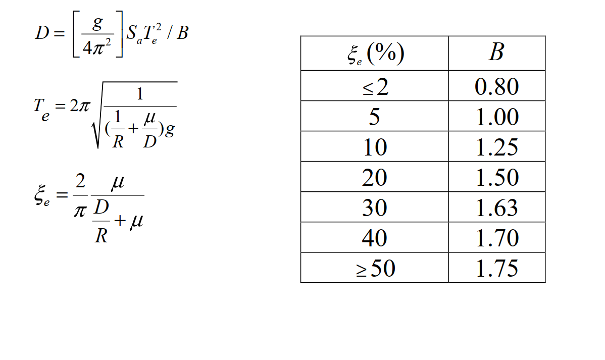

# 考題編號：SD-2018-4

**主分類：** `SD-U3-2` 隔減震原理  
**副分類：** `SD-U2-2` 建築耐震設計規範  
**分析方法：** 隔震系統等效線性化分析（摩擦單擺支承 FPS）  
**標籤：** `摩擦單擺支承` `FPS` `隔震設計` `等效週期` `等效阻尼比` `設計位移` `傳遞加速度` `曲率半徑` `摩擦係數` `阻尼修正係數B` `迭代設計`

---

## 1. 原始題目重述 (Problem Restatement)

*圖說：提示公式：(1) $D = [g/(4\pi^2)]\,S_a T_e^2/B$；(2) $T_e = 2\pi\sqrt{1/[(1/R+\mu/D)g]}$；(3) $\xi_e = (2/\pi)\,\mu/(D/R+\mu)$。ξe-B 對照表：≤2%→0.80；5%→1.00；10%→1.25；20%→1.50；30%→1.63；40%→1.70；≥50%→1.75。*

### 結構與設計條件

- 上部結構：假設為**剛體**
- 設計水平譜加速度係數：$S_a = 0.48/T \leq 0.8$（T 為結構週期，秒）
- 設計位移：$D = 25$ cm
- 傳遞設計水平加速度：$A = 0.08\,g$
- 重力加速度：$g = 980$ cm/s²
- 隔震系統：**摩擦單擺支承（Friction Pendulum Bearing，FPS）**

### 求解目標

$$\text{求：隔震支承之曲率半徑 } R \text{ 及摩擦係數 } \mu$$

---

## 2. 考題核心精神與出題者意圖 (Core Concepts & Examiner's Intent)

**核心觀念：**
1. FPS 的力學原理：恢復力來自單擺效應（$W \cdot D/R$）＋摩擦力（$\mu W$），傳遞加速度 $A = D/R + \mu$。
2. 等效線性化：以等效週期 $T_e$ 和等效阻尼比 $\xi_e$ 代替非線性 FPS 的動力特性。
3. 兩個設計目標（$D$ 與 $A$）提供兩個方程式，聯立求解 $R$ 與 $\mu$；但需先透過 $D$ 公式確定 $B$，再由 $B$ 反查 $\xi_e$，進而分離 $\mu$ 與 $R$。

**出題意圖：**
- 測驗 FPS 力學特性的理解（傳遞加速度的物理意義）。
- 測驗隔震等效線性化三公式的綜合應用。
- 測驗反應譜區段判斷（$T_e$ 夠長，必在 $1/T$ 段）。
- 測驗從 $B$ 表格插值 $\xi_e$，再反推 $\mu$、$R$ 的計算流程。

---

## 3. 解題戰略地圖與陷阱分析 (Strategic Roadmap & Trap Analysis)

**作戰順序（關鍵洞察：A 決定 $T_e$，$D$ 決定 $B$）：**
1. 建立傳遞加速度方程：$D/R + \mu = A = 0.08$（Eq.I）
2. 由 Eq.I 得 $(1/R + \mu/D) = A/D$ → 代入 $T_e$ 公式，求得 $T_e$
3. 確認反應譜區段，代入 $D$ 公式，計算 $B$
4. 由 $B$ 插值查表得 $\xi_e$
5. 由 $\xi_e$ 公式配合 Eq.I 解出 $\mu$
6. 由 Eq.I 解出 $R$

**陷阱清單：**

| # | 陷阱 | 正確做法 |
|---|------|---------|
| ★★★ | 不知道 $A = D/R + \mu$ 的來源，無法建立 Eq.I | FPS 最大傳遞力 $= W(D/R + \mu)$，除以 $W$ 得傳遞加速度係數 $A$ |
| ★★ | 以為 $T_e$ 需迭代才能求 | 一旦利用 Eq.I，$(1/R + \mu/D) = A/D$ 已知 → $T_e = 2\pi\sqrt{D/(Ag)}$ 直接算出 |
| ★★ | 反應譜區段判斷錯誤（用 $S_a = 0.8$） | $T_e \approx 3.55$ s $\gg$ 0.6 s（$1/T$ 段），須用 $S_a = 0.48/T_e$ |
| ★ | 由 $B$ 查表直接取最近值而不插值 | 應在 30%（B=1.63）與 40%（B=1.70）間線性插值 |

---

## 3.5 變數層次分析 (Variable Hierarchy Analysis)

### 最終目標
`求 FPS 曲率半徑 R（m）及摩擦係數 μ（無因次）`

### 本題關鍵公式（依計算順序）

$$\text{Step 1（Eq.I）: } \frac{D}{R} + \mu = A \quad \Rightarrow \quad \frac{1}{R} + \frac{\mu}{D} = \frac{A}{D}$$

$$\text{Step 2: } T_e = 2\pi\sqrt{\frac{D}{A \cdot g}}$$

$$\text{Step 3: } S_a = \frac{0.48}{\boxed{T_e}} \quad (T_e \gg 0.6 \text{ s})$$

$$\text{Step 4: } B = \frac{g}{4\pi^2} \cdot \frac{\boxed{S_a} \cdot \boxed{T_e}^2}{D} = \frac{0.48\,g\,\boxed{T_e}}{4\pi^2 D}$$

$$\text{Step 5: } \xi_e = \text{table}^{-1}(\boxed{B}) \quad \text{（插值）}$$

$$\text{Step 6: } \xi_e = \frac{2}{\pi} \cdot \frac{\mu}{A} \quad \Rightarrow \quad \mu = \frac{\pi A \boxed{\xi_e}}{2}$$

$$\text{Step 7: } R = \frac{D}{A - \boxed{\mu}}$$

### L1：題目直接給定

| 符號 | 數值 | 說明 |
|------|------|------|
| $D$ | 25 cm | 設計位移 |
| $A$ | 0.08 | 傳遞設計水平加速度係數（以 $g$ 為單位） |
| $g$ | 980 cm/s² | 重力加速度 |
| $S_a$ | $0.48/T$（$\leq 0.8$） | 設計加速度係數 |

### L2：需知識點推導

| 步驟 | 符號 | 公式／來源 | 卡關? |
|------|------|-----------|-------|
| 建立 Eq.I | $A = D/R + \mu$ | FPS 最大傳遞力除以 $W$ | |
| 求 $T_e$ | $T_e = 2\pi\sqrt{D/(Ag)}$ | 將 $(1/R+\mu/D)=A/D$ 代入 $T_e$ 公式 | |
| 判斷 Sa | $S_a = 0.48/T_e$ | $T_e \gg 0.6$ s，在 $1/T$ 段 | |
| 求 $B$ | $B = 0.48g T_e/(4\pi^2 D)$ | $D$ 公式整理 | |
| 插值 $\xi_e$ | 線性內插 | 在 B=1.63（30%）與 B=1.70（40%）間 | |
| 求 $\mu$ | $\mu = \pi A \xi_e/2$ | 由 $\xi_e$ 公式整理 | |
| 求 $R$ | $R = D/(A-\mu)$ | Eq.I 整理 | |

### L3：深層知識

| 知識點 | 說明 | 卡關? |
|--------|------|-------|
| FPS 傳遞加速度的物理意義 | FPS 峰值水平力 $= W(D/R + \mu)$：$W/R \times D$ 為單擺恢復力；$\mu W$ 為摩擦力。兩者在最大位移時同向（摩擦力尚未反向），故為最大傳遞力 | |
| 等效剛度 $K_{eff}$ | $K_{eff} = W/R + \mu W/D$，是線性化後的割線剛度。$T_e = 2\pi\sqrt{W/(K_{eff}g)}$ | |
| 等效阻尼比的能量解釋 | $\xi_e = W_D/(4\pi W_S)$；$W_D = 4\mu W D$（矩形遲滯迴圈能量）；$W_S = K_{eff}D^2/2$（彈性應變能） | |
| $B$ 係數修正 | $B = 1$ 對應 $\xi = 5\%$（基準阻尼）；$B > 1$ 表示高阻尼使位移反應縮小 | |

---

## 4. 步驟化詳細計算過程 (Step-by-Step Detailed Calculation)

### Step 1：建立傳遞加速度方程（Eq.I）

FPS 在設計位移 $D$ 時，對剛性上部結構的峰值水平傳遞力：

$$F_{\max} = \underbrace{\frac{W \cdot D}{R}}_{\text{單擺恢復力}} + \underbrace{\mu W}_{\text{摩擦力}}$$

傳遞設計水平加速度：

$$A = \frac{F_{\max}}{W} = \frac{D}{R} + \mu$$

代入已知 $A = 0.08$，$D = 25$ cm：

$$\boxed{\frac{D}{R} + \mu = 0.08} \quad \cdots \text{（Eq.I）}$$

由此得：

$$\frac{1}{R} + \frac{\mu}{D} = \frac{A}{D} = \frac{0.08}{25} = 0.0032 \text{ cm}^{-1}$$

*策略註解：Eq.I 將 $R$ 與 $\mu$ 的乘積關係轉化為線性關係，是整題的突破口。關鍵在於認識到 $(1/R + \mu/D) = A/D$，使 $T_e$ 能直接計算。*

### Step 2：計算等效隔震週期 $T_e$

$$T_e = 2\pi\sqrt{\frac{1}{\left(\dfrac{1}{R} + \dfrac{\mu}{D}\right)g}} = 2\pi\sqrt{\frac{1}{A/D \cdot g}} = 2\pi\sqrt{\frac{D}{Ag}}$$

$$T_e = 2\pi\sqrt{\frac{25}{0.08 \times 980}} = 2\pi\sqrt{\frac{25}{78.4}} = 2\pi\sqrt{0.3189}$$

$$T_e = 2\pi \times 0.5647 = \mathbf{3.548 \text{ s}}$$

### Step 3：確認反應譜區段並求 $S_a$

反應譜轉折點：$S_a = 0.8$ 時 $T^* = 0.48/0.8 = 0.6$ s

由於 $T_e = 3.548$ s $\gg$ 0.6 s，在**速度控制（$1/T$）段**：

$$S_a = \frac{0.48}{T_e} = \frac{0.48}{3.548} = 0.1353$$

### Step 4：計算阻尼修正係數 $B$

代入設計位移公式：

$$D = \frac{g}{4\pi^2} \cdot S_a \cdot T_e^2 / B = \frac{g}{4\pi^2} \cdot \frac{0.48}{T_e} \cdot T_e^2 / B = \frac{0.48\,g\,T_e}{4\pi^2\,B}$$

解出 $B$：

$$B = \frac{0.48 \times g \times T_e}{4\pi^2 \times D} = \frac{0.48 \times 980 \times 3.548}{4\pi^2 \times 25}$$

$$= \frac{470.4 \times 3.548}{986.96} = \frac{1668.6}{986.96} = \mathbf{1.690}$$

### Step 5：插值求等效阻尼比 $\xi_e$

查 $\xi_e$–$B$ 對照表，$B = 1.690$ 介於：

| $\xi_e$ | $B$ |
|---------|-----|
| 30% | 1.63 |
| **1.690** | **?** |
| 40% | 1.70 |

線性內插：

$$\xi_e = 30\% + (40\% - 30\%) \times \frac{1.690 - 1.63}{1.70 - 1.63} = 30\% + 10\% \times \frac{0.060}{0.070}$$

$$\xi_e = 30\% + 8.57\% \approx \mathbf{38.6\%}$$

### Step 6：求摩擦係數 $\mu$

由 $\xi_e$ 公式整理：

$$\xi_e = \frac{2}{\pi} \cdot \frac{\mu}{D/R + \mu} = \frac{2\mu}{\pi \cdot A}$$

$$\mu = \frac{\pi \cdot A \cdot \xi_e}{2} = \frac{\pi \times 0.08 \times 0.386}{2} = \frac{0.08 \times 0.386\pi}{2}$$

$$\mu = \frac{0.09702}{2} = 0.04851$$

$$\boxed{\mu \approx 0.049 \quad (\approx 4.9\%)}$$

### Step 7：求曲率半徑 $R$

由 Eq.I：

$$\frac{D}{R} = A - \mu = 0.08 - 0.049 = 0.031$$

$$R = \frac{D}{0.031} = \frac{25 \text{ cm}}{0.031} = 806 \text{ cm}$$

$$\boxed{R \approx 8.0 \text{ m}}$$

### 驗算

| 驗算項目 | 計算 | 目標值 |
|---------|------|--------|
| $D/R + \mu$ | $25/806 + 0.049 = 0.031 + 0.049 = 0.080$ | $A = 0.08$ ✓ |
| $\xi_e$ | $2/(π) \times 0.049/0.08 = 0.3891 \approx 39\%$ | 與插值一致 ✓ |
| $T_e$ | $2\pi\sqrt{25/(0.08 \times 980)} = 3.548$ s | — |
| $D$ | $0.48 \times 980 \times 3.548/(4\pi^2 \times 1.690) = 25.0$ cm | $D = 25$ cm ✓ |

---

## 5. 關鍵爭議點與進階探討 (Critical Issues & Advanced Discussion)

### 爭議一：傳遞加速度的確切定義

$A = D/R + \mu$ 代表 FPS 在最大位移 $D$ 時的峰值傳遞加速度。注意此時摩擦力與恢復力**同向**（在加載方向的最末端，速度趨近於零但摩擦力尚未反向）。如果定義「有效傳遞力」為有效剛度乘以位移：$K_{eff} D = W(1/R + \mu/D) D = W(D/R + \mu)$，結果相同——本質上是同一力。

### 爭議二：$B$ 插值 vs 直接取最近值

嚴格計算應插值（$\xi_e \approx 38.6\%$），但考場上若時間有限，取最近表格值（$\xi_e = 40\%$, $B = 1.70$）計算出 $\mu \approx 0.0503$, $R \approx 8.4$ m，與精確解差異約 5%，工程上可接受。**建議考場中先插值，若時間不足再取最近值並說明近似**。

### FPS 與 LRB 的設計邏輯對比

| 特性 | FPS（摩擦單擺） | LRB（鉛芯橡膠） |
|------|----------------|----------------|
| 恢復力來源 | 單擺幾何（重力） | 橡膠層彈性 |
| 設計自由度 | $R$（週期）、$\mu$（阻尼） | 橡膠勁度、鉛芯尺寸 |
| 週期與位移關係 | $T_e \propto \sqrt{R}$，與 $W$ 無關 | $T_e$ 取決於橡膠剪切模量與尺寸 |
| 自我定心 | 良好（重力驅動） | 視設計而定 |

### 進階：FPS 的最優設計（$R$、$\mu$ 的權衡）

從 Eq.I：$D/R + \mu = A$（常數），增大 $R$ 則 $\mu$ 相應增大，反之亦然。
- 大 $R$（長週期）：$T_e$ 增大，反應譜位移 $D$ 增大，隔震效果好但位移需求大。
- 大 $\mu$（強摩擦）：能量消散多，$\xi_e$ 大，$B$ 大，位移 $D$ 縮小——但傳遞加速度中摩擦成分大，對輕重量結構不利。

最佳化設計需在 $R$-$\mu$ 空間中尋找滿足位移限制與加速度限制的平衡點，本題的 $(R \approx 8.0\text{ m},\, \mu \approx 0.049)$ 即為此設計目標下的最優解。
