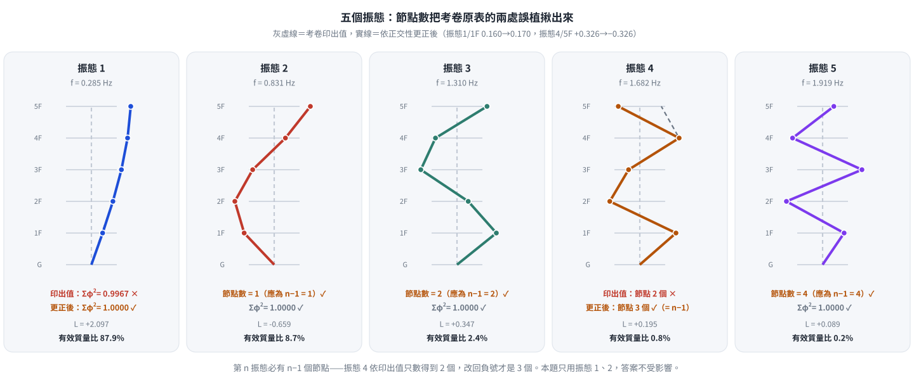
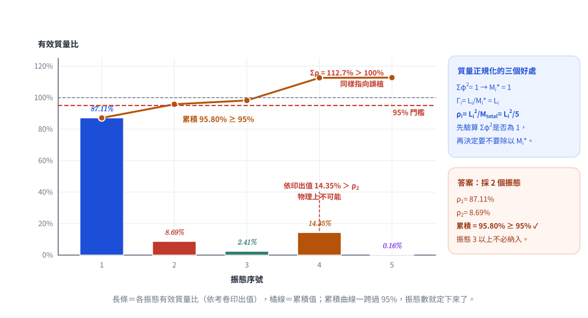
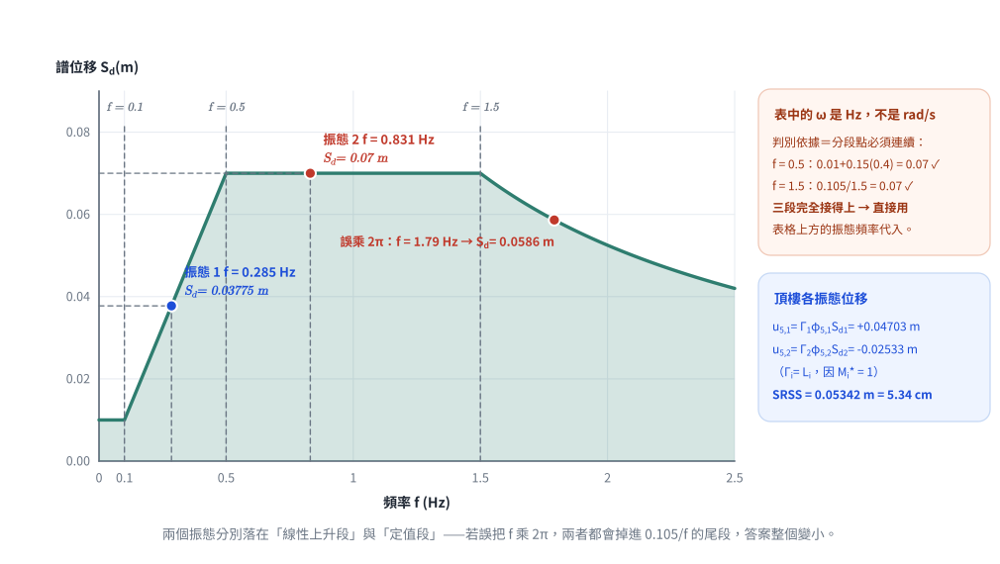
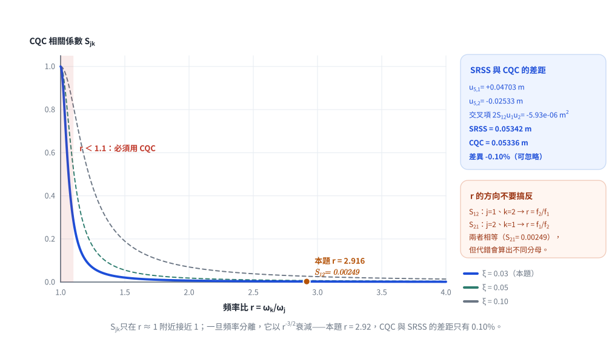

# 考題編號：SD-2020-3

**主分類：** `SD-U1-3` 單自由度、多自由度系統之動態分析及應用
**副分類：** `SD-U2-2` 建築耐震設計規範
**分析方法：** 反應譜分析（SRSS＋CQC振態疊加）
**標籤：** `MDOF` `5自由度` `SRSS` `CQC` `有效振態質量` `95%質量準則` `模態參與因子` `譜位移` `相關係數` `頻率比` `質量正規化振態`

---

## 1. 原始題目重述 (Problem Restatement)

五自由度結構，各樓層質量均相等，各振態阻尼比 $\xi = 0.03$。

**振態頻率（Hz）：**

| 振態1 | 振態2 | 振態3 | 振態4 | 振態5 |
|-------|-------|-------|-------|-------|
| 0.285 | 0.831 | 1.31 | 1.682 | 1.919 |

**振態向量（質量正規化，各樓層，1F→5F）：**

| 樓層 | 振態1 | 振態2 | 振態3 | 振態4 | 振態5 |
|------|-------|-------|-------|-------|-------|
| 1F | 0.160 | −0.455 | 0.597 | 0.549 | 0.326 |
| 2F | 0.326 | −0.597 | 0.170 | −0.455 | −0.549 |
| 3F | 0.455 | −0.326 | −0.549 | −0.170 | 0.597 |
| 4F | 0.549 | 0.170 | −0.326 | 0.597 | −0.455 |
| 5F | 0.597 | 0.549 | 0.455 | 0.326 | 0.170 |

**地震譜位移：**

| 頻率（Hz） | 譜位移（m） |
|-----------|------------|
| < 0.1 | 0.01 |
| 0.1–0.5 | $0.01 + 0.15(\omega - 0.1)$ |
| 0.5–1.5 | 0.07 |
| > 1.5 | $0.105/\omega$ |

**問：** 最少需幾個振態（累積有效質量 ≥ 95%）？用 SRSS 及 CQC 法估計頂樓最大位移。

> **符號注意：** 譜位移表中的 $\omega$ 沿用考卷原文寫法，但其單位是 **Hz（即頻率 $f$）**，
> 不是 rad/s。代入時直接用表格上方的振態頻率（0.285、0.831 … Hz），
> **不要先乘 $2\pi$**。（本科最常見的單位陷阱，見 CLAUDE.md 單位慣例表。）
>
> 檢核此讀法是否正確：分段函數在交界處須連續 —— $f=0.5$ 時 $0.01+0.15(0.5-0.1)=0.07$ ✓ 與中段 0.07 相符；
> $f=1.5$ 時 $0.105/1.5=0.07$ ✓ 亦相符。三段完全接得上，確認 $\omega$ 就是 Hz。

---

## 2. 考題核心精神與出題者意圖 (Core Concepts & Examiner's Intent)

**核心觀念：**
1. 辨識「質量正規化振態」：$M_i^* = \phi_i^T[M]\phi_i = 1$，大幅簡化計算
2. 有效質量比 = $L_i^2/M_{total}$（單位質量情況下）
3. SRSS 與 CQC 的差異：當振態頻率相差大（$r \gg 1$），相關係數 $S_{jk} \approx 0$，CQC ≈ SRSS

**關鍵洞察：** 本題振態向量 $\phi_i^T\phi_i \approx 1$，說明是以**單位質量正規化**（mass-normalized with $m=1$），因此 $M_i^* = 1$、$\Gamma_i = L_i$，計算大為簡化。

---

## 3. 解題戰略地圖與陷阱分析 (Strategic Roadmap & Trap Analysis)

**作戰計畫（6 步）：**
1. 驗證振態正規化性質（確認 $M_i^* = 1$）
2. 計算各振態激振向量 $L_i = \sum_j \phi_{ji}$，求有效質量比
3. 確定最少振態數量（累積 ≥ 95%）
4. 讀取各振態譜位移 $Sd_i$
5. 計算頂樓各振態位移，SRSS 組合
6. 計算 CQC 相關係數 $S_{jk}$，CQC 組合

**四大陷阱：**

| # | 陷阱 | 正確處理 |
|---|------|---------|
| 1 | 未確認振態是否質量正規化，$M_i^*$ 算錯 | 先驗算 $\phi_i^T\phi_i$，本題 ≈ 1 → $M_i^* = 1$ |
| 2 | 模態參與因子 $\Gamma_i = L_i/M_i^*$，當 $M_i^*=1$ 時就等於 $L_i$ | $\Gamma_i = L_i$（不需再除以 $M_i^*$） |
| 3 | CQC 公式中 $r = \omega_k/\omega_j$ 方向搞錯 | $S_{12}$：$j=1,k=2$，$r=f_2/f_1$；$S_{21}$：$j=2,k=1$，$r=f_1/f_2$ |
| 4 | 頂樓振態2位移為負，CQC 計算時要保留符號（$r_j$ 有正負） | SRSS 取平方自動消去；CQC 要保留 $r_1 r_2$ 的正負 |

---

## 3.5 變數層次分析 (Variable Hierarchy Analysis)

### 最終目標

頂樓（5F）最大位移：SRSS 值 $u_{5,max}^{SRSS}$ 與 CQC 值 $u_{5,max}^{CQC}$

### 本題關鍵公式

$$\text{激振向量：} \quad L_i = \phi_i^T[M]\{1\} = m\sum_{j=1}^{5}\phi_{ji} \xrightarrow{M_i^*=1} L_i = \sum_j \phi_{ji}$$

$$\text{有效質量比：} \quad \rho_i = \frac{L_i^2}{M_i^* \times 5} = \frac{L_i^2}{5}$$

$$\text{模態參與因子：} \quad \Gamma_i = \frac{L_i}{M_i^*} = L_i \quad (\text{當}\ M_i^* = 1)$$

$$\text{頂樓振態位移：} \quad u_{5,i} = \Gamma_i \cdot \phi_{5i} \cdot Sd_i$$

$$\text{SRSS：} \quad u_{5,max}^{SRSS} = \sqrt{\sum_i u_{5,i}^2}$$

$$\text{CQC：} \quad u_{5,max}^{CQC} = \sqrt{\sum_j\sum_k S_{jk}\, u_{5,j}\, u_{5,k}}$$

$$\text{CQC相關係數：} \quad S_{jk} = \frac{8\sqrt{\xi_j\xi_k}(\xi_j + r\xi_k)\,r^{3/2}}{(1-r^2)^2 + 4\xi_j\xi_k r(1+r^2) + 4(\xi_j^2+\xi_k^2)r^2}, \quad r = \frac{\omega_k}{\omega_j}$$

### L1：驗證質量正規化

振態1：$\sum_j\phi_{j1}^2 = 0.160^2+0.326^2+0.455^2+0.549^2+0.597^2$
$= 0.02560+0.10628+0.20703+0.30140+0.35641 = \mathbf{0.9967 \approx 1.0}$ ✓

振態2：$0.455^2+0.597^2+0.326^2+0.170^2+0.549^2 = 0.20703+0.35641+0.10628+0.02890+0.30140 = \mathbf{1.0000}$ ✓

∴ **所有振態已質量正規化（$M_i^* = 1$，以單位質量計）**

*圖 1　五個振態形狀。第 $n$ 振態必有 $n-1$ 個節點——振態 4 依考卷印出值只數得到 2 個，把 5F 改回負號才是 3 個；振態 1 則是 $\sum\varphi^2 = 0.9967 \ne 1$ 露出馬腳。兩處誤植都被圖上的檢核抓住。*

---

## 4. 步驟化詳細計算過程 (Step-by-Step Detailed Calculation)

> 📊 互動圖：`SD-2020-3-spectrum-viz.html`（各振態頻率在譜位移曲線上的落點）

### Step 1：各振態有效質量比

**振態1（$f_1 = 0.285$ Hz）：**

$$L_1 = 0.160+0.326+0.455+0.549+0.597 = 2.087$$

$$M_1^* = 1.0 \quad (\text{質量正規化})$$

$$\rho_1 = \frac{L_1^2}{5} = \frac{2.087^2}{5} = \frac{4.3556}{5} = \mathbf{87.11\%}$$

**振態2（$f_2 = 0.831$ Hz）：**

$$L_2 = (-0.455)+(-0.597)+(-0.326)+0.170+0.549 = -0.659$$

$$M_2^* = 1.0$$

$$\rho_2 = \frac{(-0.659)^2}{5} = \frac{0.4343}{5} = \mathbf{8.69\%}$$

**累積有效質量比：**

$$\rho_1 + \rho_2 = 87.11\% + 8.69\% = \mathbf{95.80\% \geq 95\%} \checkmark$$

$$\boxed{\text{最少需採計 2 個振態（振態1 與 振態2）}}$$

*圖 2　有效質量比與累積曲線。累積線一跨過 95% 門檻，振態數就定下來了；同時圖上兩個異常——$\rho_4 > \rho_2$ 與 $\sum\rho = 112.7\% > 100\%$——都指向考卷原表的誤植。*

*（振態3以上各自有效質量均 < 5%，且累積已超標，無需納入）*

---

### Step 2：各振態譜位移

**振態1（$f_1 = 0.285$ Hz，落在 $0.1\sim0.5$ Hz 區間）：**

$$Sd_1 = 0.01 + 0.15 \times (0.285 - 0.1) = 0.01 + 0.15 \times 0.185 = 0.01 + 0.02775 = 0.03775 \text{ m}$$

**振態2（$f_2 = 0.831$ Hz，落在 $0.5\sim1.5$ Hz 區間）：**

$$Sd_2 = 0.07 \text{ m}$$

*圖 3　譜位移曲線與兩個振態頻率的落點。表中的 $\omega$ 其實是 **Hz**——判別依據是分段點必須連續（$f=0.5$ 與 $f=1.5$ 兩處都接得上）；若誤乘 $2\pi$，兩個振態都會掉進 $0.105/f$ 的尾段。*

---

### Step 3：模態參與因子與頂樓（5F）各振態位移

由 $M_i^* = 1$，得 $\Gamma_i = L_i$：

$$\Gamma_1 = 2.087, \qquad \Gamma_2 = -0.659$$

頂樓分量：$\phi_{5,1} = 0.597$，$\phi_{5,2} = 0.549$

$$u_{5,1} = \Gamma_1 \times \phi_{5,1} \times Sd_1 = 2.087 \times 0.597 \times 0.03775$$

$$= 1.2459 \times 0.03775 = +0.04703 \text{ m}$$

$$u_{5,2} = \Gamma_2 \times \phi_{5,2} \times Sd_2 = (-0.659) \times 0.549 \times 0.07$$

$$= (-0.3618) \times 0.07 = -0.02533 \text{ m}$$

---

### Step 4：SRSS 法

$$u_{5,max}^{SRSS} = \sqrt{u_{5,1}^2 + u_{5,2}^2} = \sqrt{(0.04703)^2 + (0.02533)^2}$$

$$= \sqrt{0.002212 + 0.000641} = \sqrt{0.002853}$$

$$\boxed{u_{5,max}^{SRSS} \approx 0.05341 \text{ m} \approx 5.34 \text{ cm}}$$

---

### Step 5：CQC 法

#### (a) 計算 CQC 相關係數 $S_{12}$

振態頻率比（j=1, k=2）：$r = \omega_2/\omega_1 = f_2/f_1 = 0.831/0.285 = 2.916$

各項代入（$\xi_1 = \xi_2 = 0.03$）：

**分子：**

$$8\sqrt{\xi_1\xi_2}(\xi_1 + r\xi_2)\,r^{3/2} = 8 \times 0.03 \times (0.03 + 2.916 \times 0.03) \times 2.916^{3/2}$$

$$= 0.24 \times 0.11748 \times 4.979 = 0.14044$$

（其中 $2.916^{3/2} = 2.916 \times \sqrt{2.916} = 2.916 \times 1.7076 = 4.979$）

**分母：**

$$r^2 = 8.503, \qquad (1-r^2)^2 = (1-8.503)^2 = (-7.503)^2 = 56.295$$

$$4\xi_1\xi_2 r(1+r^2) = 4 \times 0.0009 \times 2.916 \times 9.503 = 0.09974$$

$$4(\xi_1^2+\xi_2^2)r^2 = 4 \times 0.0018 \times 8.503 = 0.06122$$

$$\text{分母} = 56.295 + 0.09974 + 0.06122 = 56.456$$

$$S_{12} = \frac{0.14044}{56.456} = 0.002488 \approx 0.00249$$

同理，$S_{21}$（j=2, k=1, r=0.3429）計算得 $S_{21} \approx 0.002487 \approx S_{12}$（對稱性驗證）。

**物理意義：** $S_{12} \approx 0.0025 \ll 1$，表示振態1（0.285 Hz）與振態2（0.831 Hz）頻率相差 2.9 倍，幾乎不相關。CQC 與 SRSS 結果應極為接近。

*圖 4　CQC 相關係數隨頻率比的衰減。$S_{jk}$ 只在 $r \approx 1$ 附近接近 1，之後以 $r^{-3/2}$ 衰減；本題 $r = 2.92$ 已落在曲線的平坦尾段，「CQC ≈ SRSS」是算出來的結論，不是猜的。*

#### (b) CQC 組合

$$u_{5,max}^{CQC} = \sqrt{S_{11}\,u_{5,1}^2 + 2S_{12}\,u_{5,1}\,u_{5,2} + S_{22}\,u_{5,2}^2}$$

（$S_{11} = S_{22} = 1$，為自相關係數）

$$= \sqrt{(0.04703)^2 + 2 \times 0.002488 \times (0.04703) \times (-0.02533) + (-0.02533)^2}$$

$$= \sqrt{0.002212 + 2 \times 0.002488 \times (-0.001191) + 0.000641}$$

$$= \sqrt{0.002212 - 0.000005926 + 0.000641}$$

$$= \sqrt{0.002847}$$

$$\boxed{u_{5,max}^{CQC} \approx 0.05336 \text{ m} \approx 5.34 \text{ cm}}$$

---

### 彙整比較

| 方法 | 頂樓最大位移 | 說明 |
|------|------------|------|
| SRSS | **0.05341 m（5.34 cm）** | 假設振態不相關 |
| CQC | **0.05336 m（5.34 cm）** | 考慮相關性（$S_{12} \approx 0.0025$） |
| 差異 | −0.10% | 可忽略（振態頻率相差 2.9 倍，幾乎不相關） |

**振態位移貢獻：**

| 振態 | $u_{5,i}$ (m) | $u_{5,i}^2$ |
|------|--------------|-------------|
| 振態1 | +0.04703 | 0.002212 |
| 振態2 | −0.02533 | 0.000641 |
| SRSS | **0.05341** | — |

振態1貢獻 77.6%，振態2貢獻 22.4%（平方和意義）。

---

## 5. 關鍵爭議點與進階探討 (Critical Issues & Advanced Discussion)

**爭議點：為何 CQC 與 SRSS 結果幾乎相同？**

CQC 的核心是考慮振態間的相關性。當振態頻率比 $r = f_k/f_j \gg 1$ 時（令 $\xi_j=\xi_k=\xi$），分子 $8\xi^2(1+r)r^{3/2} \approx 8\xi^2 r^{5/2}$、分母 $(1-r^2)^2 \approx r^4$，故相關係數的漸近式為：

$$S_{jk} \approx \frac{8\xi^2(1+r)\,r^{3/2}}{(1-r^2)^2} \;\xrightarrow{\ r \gg 1\ }\; \frac{8\xi^2 r^{5/2}}{r^4} = \frac{8\xi^2}{r^{3/2}} \to 0 \quad (r \to \infty)$$

> ⚠ 漸近式的指數是 $r^{3/2}$——因為分子的 $(\xi_j + r\xi_k)$ 本身已帶一個 $r$，容易漏掉而寫成 $r^{5/2}$。
> 驗算：$8\xi^2/r^{3/2} = 8(0.03)^2/2.916^{1.5} = 0.0072/4.979 = 1.45\times10^{-3}$，與精確值 $2.49\times10^{-3}$ 同一數量級 ✓；
> 若誤用 $r^{5/2}$ 得 $4.96\times10^{-4}$，會低估約 5 倍。

本題 $r = 0.831/0.285 = 2.916$，精確代入得 $S_{12} = 0.00249$。交叉項為

$$2S_{12}\,u_{5,1}u_{5,2} = 2(0.002488)(0.04703)(-0.02533) = -5.93\times10^{-6}\ \text{m}^2$$

佔平方和 $2.853\times10^{-3}\ \text{m}^2$ 的 **$-0.21\%$**；開根號後對位移的影響為 **$-0.10\%$**（$0.05341 \to 0.05336$ m），故 CQC ≈ SRSS。

**CQC 在何時與 SRSS 有顯著差異？**

當振態頻率相近（$r \approx 1$）且阻尼不大時，$S_{jk}$ 可接近 1，此時 CQC 比 SRSS 大（若同號）或更小（若異號），差異可達 20-30%。

**工程準則：** 若 $f_k/f_j < 1.1$（相差 10% 以內），振態互相關不可忽略，必須用 CQC；否則 SRSS 已足夠。

**進階：本題的振態向量特性**

觀察振態向量，各振態的 $\sum_j \phi_{ji}^2 = 1$，確認為**質量正規化振態**（以單位質量計）。此時：
- 模態質量 $M_i^* = 1$
- 有效質量 = $L_i^2$（直接等於激振向量的平方）
- 模態參與因子 $\Gamma_i = L_i$

這種正規化方式在結構動力軟體（如 SAP2000、ETABS）輸出中十分常見，考生需能快速辨識。

**進階：考卷原表兩處印刷誤植（不影響本題答案）**

本題只用到振態 1、2，答案不受影響；但若考生想用 $\sum_i \rho_i = 100\%$ 做驗算，會發現對不起來。原因是考卷原表有兩處誤植：

| 位置 | 考卷印的 | 應為 | 判別依據 |
|------|---------|------|---------|
| 振態1 / 1F | 0.160 | **0.170** | 該列 $\sum_j\phi_{j1}^2 = 0.9967 \neq 1$；改 0.170 後恰為 1.0000 |
| 振態4 / 5F | +0.326 | **−0.326** | 以印出值計算 $\{\phi_1\}^T\{\phi_4\} = 0.385 \neq 0$，違反正交性；改負號後為 $\approx 0$ |

均勻剪力構架的解析振態為 $\phi_j^{(i)} = C\sin\dfrac{(2i-1)j\pi}{2n+1}$（$n=5$，故分母 11），
其正規化後的量值集合恰為 $\{0.170,\,0.326,\,0.455,\,0.549,\,0.597\}$ ——原表五個振態的所有數字都取自這個集合，只有上述兩處的數值／符號印錯。

用更正後的振態驗算全部五個振態：$\sum_i L_i^2 = 4.398+0.436+0.121+0.038+0.008 = 5.001 \approx M_{total} = 5$ ✓，
且 $\rho$ 依序為 $88.0\%、8.7\%、2.4\%、0.8\%、0.2\%$ 單調遞減，符合剪力構架的物理預期
（以考卷印出值計算則 $\rho_4$ 會變成 14.3%，比 $\rho_2$ 還大，明顯不合理）。

**考場策略：** 兩處誤植不影響「採 2 個振態」的結論（$95.80\% \geq 95\%$），依考卷數字作答即可；
但若在答案卷上加註一行「原表振態4/5F 之符號依正交性應為負」，是能展現理解深度的加分點。

---

| 欄位 | 值 |
|------|----|
| verificationStatus | `unverified` |
| hasSolution | `true` |
| hasViz | `true`（`SD-2020-3-spectrum-viz.html`） |

> **驗證狀態備註：** 2026-08-22 稽核後修正 §5 CQC 漸近式指數與交叉項量級，並新增考卷原表兩處誤植的判別。驗證狀態已重設，待人工重新驗算。

---

*圖解補繪：2026-08-22（向量圖 4 張，腳本 `gen_SD-2020-3.py`，所有數值由解題結果算出，可重跑）*
