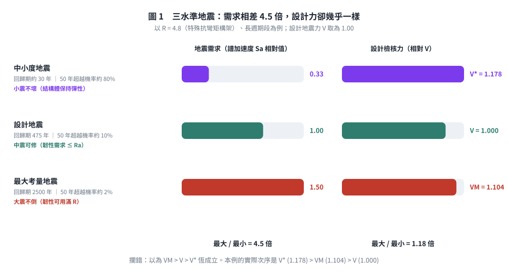
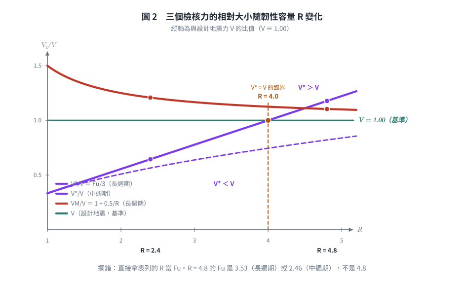
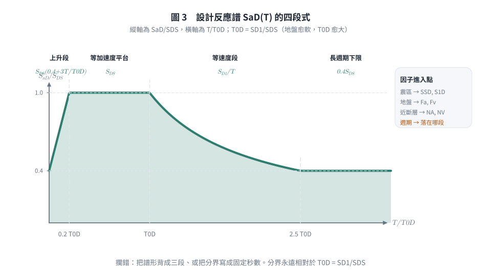
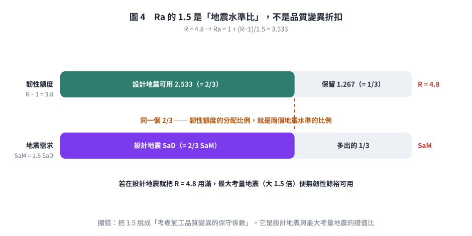

# 考題編號：SD-2020-4

**主分類：** `SD-U2-2` 建築耐震設計規範
**副分類：** `SD-U2-1` 地震力之設計規範
**分析方法：** 概念題（規範論述＋公式說明）
**標籤：** `三水準地震` `設計地震` `中小度地震` `最大考量地震` `年超越機率` `回歸期` `韌性折減係數` `容許韌性容量` `起始降伏地震力放大倍數` `性能設計` `小震不壞` `中震可修` `大震不倒` `地震力計算邏輯` `近斷層` `工址地盤分類` `設計反應譜` `臺北盆地`

---

## 1. 原始題目重述 (Problem Restatement)

台灣建築耐震規範規定三種地震：**設計地震**、**中小度地震**、**最大考量地震**。

規範公式：

$$V = \frac{I}{1.4\alpha_y}\left(\frac{S_{aD}}{F_u}\right)_m W \quad \text{（設計地震水平總橫力）}$$

$$V^* = \frac{IF_u}{4.2\alpha_y}\left(\frac{S_{aD}}{F_u}\right)_m W \quad \text{（中小地震水平總橫力）}$$

$$V_M = \frac{I}{1.4\alpha_y}\left(\frac{S_{aM}}{F_{uM}}\right)_m W \quad \text{（最大考量地震水平總橫力）}$$

**問：**
1.（10 分）50 年設計年限下，三種地震的年超越機率為何？其結構分別應達何種性能（破壞程度）？此規定的目的為何？這三個地震力的大小次序一定是 $V_M > V > V^*$ 嗎？為什麼？
2.（15 分）震區、工址地盤種類、結構韌性、結構基本週期、近斷層如何在設計地震水平總橫力中被考慮？計算中小度地震有何差異處？（儘量以公式解釋說明，公式可以不完整，重點在說明計算上的邏輯）

> 註：本年考卷的 $V_M$ 式分母寫 $1.4\alpha_y$；2024 年同型題（SD-2024-3）寫 $1.4\alpha_{yM}$。
> 兩者僅差在最大考量地震是否另訂起始降伏放大倍數，比較 $V_M/V$ 時可令 $\alpha_{yM} = \alpha_y$。

---

## 2. 考題核心精神與出題者意圖 (Core Concepts & Examiner's Intent)

**核心觀念：**
- 理解三水準地震設計的機率基礎（回歸期與超越機率換算）
- 理解各影響因子在公式中的對應位置
- 辨識 $V^* > V$ 的反直覺現象（高韌性結構）

**出題重點：** 最刁鑽的部分是 $V_M > V > V^*$ **不一定成立**——由 $V^*/V = F_u/3$，當 $F_u > 3$ 時 $V^* > V$，考生容易誤以為中小地震力一定最小。另一半（$V_M$ 與 $V$ 的差距其實很小）則幾乎沒人答得出來。

---

## 3. 解題戰略地圖與陷阱分析 (Strategic Roadmap & Trap Analysis)

**三大陷阱：**

| # | 陷阱 | 正確處理 |
|---|------|---------|
| 1 | 誤以為「中小地震力最小」 | $V^*/V = F_u/3$，$F_u > 3$ 時 $V^* > V$（需 $R_a>3$，即高韌性系統落在長週期段） |
| 2 | 把 $F_u$ 與規範表列的 $R$ 混為一談 | $R \to R_a = 1+\frac{R-1}{1.5} \to F_u$（依週期段取 $R_a$ 或 $\sqrt{2R_a-1}$）；$R=4.8$ 對應的 $F_u$ 是 3.53 或 2.46，不是 4.8 |
| 3 | 超越機率與年超越機率混淆 | 題目問「年超越機率」→ 由回歸期取倒數，或由 50 年超越機率換算 |
| 4 | $\alpha_y$ 的物理意義搞反 | $\alpha_y$ = **起始降伏地震力放大倍數**，$\ge 1$（RC 極限設計 1.5、鋼構極限設計 1.0、鋼構容許應力 1.2），**不是** $\le 1$ 的折減係數 |
| 5 | 把中小度地震回歸期背成 72 年 | 72 年（50%/50yr）是美國 ASCE 41 的 frequent 水準；**我國規範是回歸期約 30 年**（50 年超越機率約 80%） |

---

## 3.5 變數層次分析 (Variable Hierarchy Analysis)

### 關鍵符號說明

| 符號 | 意義 | 影響因子 |
|------|------|---------|
| $I$ | 用途係數 | 建築用途（一般 1.0；重要 1.25；緊急救災 1.5） |
| $S_{aD}$ | 設計地震**水平譜加速度係數** | 震區（$S_S^D, S_1^D$）＋地盤種類＋週期＋近斷層 |
| $S_{aM}$ | 最大考量地震水平譜加速度係數 | 同上；因 $S_{DS}=\frac{2}{3}S_{MS}$，一般 $S_{aM} = 1.5\,S_{aD}$ |
| $R$ | 結構系統**韌性容量**（規範表 1-3） | 特殊抗彎矩構架 4.8；一般構架較低 |
| $R_a$ | **容許**韌性容量 | $R_a = 1+\dfrac{R-1}{1.5}$（設計地震只准用 $R$ 的 2/3） |
| $F_u$ | 結構系統地震力折減係數 | 長週期 $F_u = R_a$；中週期 $F_u = \sqrt{2R_a-1}$；$T\to0$ 時 $\to 1.0$ |
| $F_{uM}$ | 最大考量地震之折減係數 | 以**韌性容量 $R$**（而非 $R_a$）計算，故 $F_{uM} \ge F_u$ |
| $\alpha_y$ | **起始降伏地震力放大倍數**（$\ge 1$） | RC 極限強度設計 1.5；鋼構極限設計 1.0；鋼構容許應力設計 1.2 |
| 1.4 | 系統超強倍數 | 首根構件降伏（$P_y$）→ 全面塑化（$P_u = 1.4P_y$） |
| $(\;)_m$ | 規範 2.2 之**修正值**，非「最大值」 | 見 §4(二)6 的分段式 |
| $W$ | 建築物全部靜載重 | （必要時含部分活載重） |

---

## 4. 步驟化詳細解答

### (一) 三種地震的年超越機率、性能目標與大小次序

#### 1. 年超越機率（50年設計年限）

設 50 年超越機率為 $P_{50}$，年超越機率為 $P_a$，關係為：

$$P_{50} = 1 - (1 - P_a)^{50} \approx 50 P_a \quad \text{（小機率近似）}$$

精確換算：$P_a = 1 - (1 - P_{50})^{1/50}$

**依我國《建築物耐震設計規範及解說》1.2 節：**

| 地震種類 | 回歸期 $T_R$ | 50 年超越機率 | 年超越機率 $P_a \approx 1/T_R$ |
|---------|------------|-------------|------------------------------|
| **中小度地震** | 約 **30 年** | 約 **80%** | $1/30 \approx 3.3\%$／年 |
| **設計地震** | **475 年** | 約 **10%** | $1/475 \approx 0.21\%$／年 |
| **最大考量地震** | **2500 年** | 約 **2%** | $1/2500 \approx 0.04\%$／年 |

（換算驗證：設計地震 $P_a = 1-0.90^{1/50} = 0.00211 \Rightarrow T_R = 474$ 年 ✓；
中小度地震 $P_{50} = 1-(1-\frac{1}{30})^{50} = 1-0.966\overline{6}^{50} = 1-0.183 = 81.7\% \approx 80\%$ ✓）

> ⚠ **不要寫成 72 年／50%。** 「50%/50yr → 72 年」是美國 ASCE 41 既有建築評估的
> *frequent earthquake* 水準；我國建築耐震規範的中小度地震明定為**回歸期約 30 年**，
> 相當於一棟建築在 50 年使用年限中「大概會遇到一兩次」的地震。
> 中小度地震設計力公式的分母 4.2 ＝ $1.4 \times 3$，那個 3 就是
> 「設計地震譜值 ÷ 中小度地震譜值 ≈ 3」，與 30 年 vs 475 年的危害度比相符。

#### 2. 各地震對應性能目標

| 地震種類 | 規範原文的性能要求 | 對應性能等級 | 白話 |
|---------|------------------|------------|------|
| **中小度地震**（30 年回歸） | 結構體**保持在彈性限度內** | 立即使用（IO） | **小震不壞** |
| **設計地震**（475 年回歸） | 容許產生塑性變形，但**韌性需求不得超過容許韌性容量 $R_a$** | 生命安全（LS） | **中震可修** |
| **最大考量地震**（2500 年回歸） | 韌性可用滿至 $R$，但**不得崩塌** | 防止崩塌（CP） | **大震不倒** |

> 三列的第二欄正是 $R_a = 1+\frac{R-1}{1.5}$ 的來源：設計地震只准用掉韌性額度的 2/3，
> 剩下 1/3 留給最大考量地震。三個水準不是三條獨立規定，而是**同一份韌性額度的分配方案**。

#### 3. 規定目的

三水準地震設計的目的是**以機率為基礎、以性能為導向**的耐震設計策略：

$$\text{（頻繁小震）立即使用} \subset \text{（設計地震）生命安全} \subset \text{（罕見大震）防止崩潰}$$

- **經濟理由：** 頻繁發生的中小地震不應造成損失（避免維修成本）
- **生命安全：** 475年回歸的設計地震（結構設計的主要依據）保障人命
- **最低底線：** 2475年罕見極大地震至少不倒塌（社會安全底線）

*圖 1　左右兩欄一比就看出本題的關鍵：**地震需求相差 4.5 倍，三個設計檢核力卻只差 1.18 倍**。它攔的是把回歸期差距直接想像成設計力差距的直覺。*

#### 4. $V_M > V > V^*$ 不一定成立

**比較 $V^*$ 與 $V$：**

$$\frac{V^*}{V} = \frac{IF_u/(4.2\alpha_y) \cdot (S_{aD}/F_u)_m W}{I/(1.4\alpha_y) \cdot (S_{aD}/F_u)_m W} = \frac{F_u}{4.2/1.4} = \frac{F_u}{3}$$

$$\therefore V^* = \frac{F_u}{3} V$$

**臨界條件是 $F_u = 3$，但 $F_u$ 要從 $R$ 一路算下來，不能直接拿表列的 $R$ 當 $F_u$：**

$$R \;\longrightarrow\; R_a = 1+\frac{R-1}{1.5} \;\longrightarrow\; F_u = \begin{cases} R_a & (\text{長週期}) \\ \sqrt{2R_a-1} & (\text{中週期}) \end{cases}$$

| 韌性容量 $R$ | $R_a$ | $F_u$（長週期） | $V^*/V$ | $F_u$（中週期） | $V^*/V$ |
|:---:|:---:|:---:|:---:|:---:|:---:|
| 4.8（特殊抗彎矩構架） | 3.533 | **3.53** | **1.18 → $V^*>V$** | 2.46 | 0.82 |
| 4.0（臨界值） | 3.000 | **3.00** | **1.00 → 恰相等** | 2.24 | 0.75 |
| 3.2 | 2.467 | 2.47 | 0.82 | 1.98 | 0.66 |
| 1.5（低韌性） | 1.333 | 1.33 | 0.44 | 1.29 | 0.43 |

$$\boxed{V_M > V > V^*\ \text{不一定成立：長週期且 } R > 4.0\ (\Leftrightarrow R_a>3 \Leftrightarrow F_u>3)\ \text{時，} V^* > V}$$

**中週期段幾乎不可能翻轉：** $F_u = \sqrt{2R_a-1} > 3$ 需 $R_a > 5$，即 $R > 7$，已超出規範表列的最大韌性容量，
故**只有落在長週期段的高韌性結構才會出現 $V^* > V$**。

**工程意涵：** 高韌性設計把設計地震力除以 $F_u$ 大幅折減，但中小度地震要求結構保持彈性、
$F_u$ 在 $V^*$ 式中被消去，折減只剩固定的 $1/3$。因此愈韌性的結構，中小度地震檢核愈可能反過來控制設計。
這正是規範防止「紙面上高韌性、實際勁度與強度不足」的機制——韌性不能拿來換小震下的可見損壞。

**比較 $V_M$ 與 $V$（這一半更少人答對）：**

$$\frac{V_M}{V} = \frac{\alpha_y}{\alpha_{yM}}\cdot\frac{(S_{aM}/F_{uM})_m}{(S_{aD}/F_u)_m}$$

兩個關鍵事實：

1. $S_{DS} = \frac{2}{3}S_{MS}$、$S_{D1} = \frac{2}{3}S_{M1}$ $\Rightarrow$ $S_{aM} = 1.5\,S_{aD}$（分子只放大 1.5 倍，**不是**回歸期比 2500/475 那麼多）
2. $F_{uM}$ 是以**韌性容量 $R$** 計算，$F_u$ 是以**容許韌性容量 $R_a$** 計算 $\Rightarrow$ $F_{uM} > F_u$（分母也放大）

令 $\alpha_{yM} = \alpha_y$，長週期段（$F_u = R_a$、$F_{uM} = R$）可得一個很漂亮的閉合式：

$$\frac{V_M}{V} = 1.5\cdot\frac{R_a}{R} = \frac{1.5}{R}\left(1+\frac{R-1}{1.5}\right) = \boxed{1 + \frac{0.5}{R}}$$

| $R$ | 1.0 | 2.0 | 3.2 | 4.8 |
|:---:|:---:|:---:|:---:|:---:|
| $V_M/V$（長週期） | 1.50 | 1.25 | 1.16 | **1.10** |

**結論：$V_M > V$ 恆成立，但餘裕遠比想像小**——高韌性結構只有約 10%。
原因就是最大考量地震「多出來的 1.5 倍需求」，幾乎全部由「多准用的那 1/3 韌性額度」抵銷掉了。
這也再次印證 $R_a$ 的 1.5 折扣與 $S_{aM}/S_{aD} = 1.5$ 是同一件事的一體兩面。

---

*圖 2　$V^*/V$ 與 $V_M/V$ 隨 $R$ 的變化。$R = 4.0$（$\Leftrightarrow R_a = 3 \Leftrightarrow F_u = 3$）是 $V^* = V$ 的臨界。它攔的是直接拿表列的 $R$ 當 $F_u$ 代入——$R = 4.8$ 對應的 $F_u$ 是 3.53 或 2.46，差別足以讓結論翻面。*

### (二) 各因子如何在設計地震水平總橫力中被考慮

以設計地震公式展開說明：

$$V = \underbrace{\frac{I}{1.4\alpha_y}}_{\text{用途 ÷ 系統超強}} \times \underbrace{\left(\frac{S_{aD}}{F_u}\right)_m}_{\text{地震需求 ÷ 韌性折減，再取規範修正值}} \times W$$

**五個因子的進入點一目了然：前三個（震區、地盤、週期、近斷層）全部走 $S_{aD}$ 這條路，韌性走 $F_u$ 這條路。**

$$\underbrace{S_S^D,\;S_1^D}_{\text{震區（微分區表）}} \xrightarrow{\;\times N_A,\,N_V\;(\text{近斷層})\;} \xrightarrow{\;\times F_a,\,F_v\;(\text{地盤種類})\;} S_{DS},\;S_{D1} \xrightarrow{\;\text{譜形}\;+\;T\;} S_{aD}(T)$$

#### 1. 震區 → 進入 $S_S^D$、$S_1^D$

規範不用單一「震區係數」，而是直接由**鄉鎮市區微分區表**查出工址的
短週期水平譜加速度係數 $S_S^D$ 與一秒週期水平譜加速度係數 $S_1^D$（對應 475 年回歸期的一致危害度譜）。
花蓮、宜蘭、嘉南等高危害度地區數值明顯大於澎湖、金馬。
臺北盆地另有臺北一區～三區的專屬規定。

#### 2. 工址地盤種類 → 進入放大係數 $F_a$、$F_v$

規範依地表下 30 m 平均剪力波速 $V_{S30}$ 分為**三類**地盤（不是四類）：

| 地盤 | 判準 | 譜形影響 |
|------|------|---------|
| 第一類（堅實） | $V_{S30} \ge 270$ m/s | $F_a$、$F_v$ 最小 |
| 第二類（普通） | $180 \le V_{S30} < 270$ m/s | 中等 |
| 第三類（軟弱） | $V_{S30} < 180$ m/s | $F_v$ 顯著放大長週期 |

$$S_{DS} = F_a \cdot S_S^D \;,\qquad S_{D1} = F_v \cdot S_1^D$$

軟弱地盤的 $F_v$ 遠大於 $F_a$，等於把 $T_0^D = S_{D1}/S_{DS}$ 往右推——譜的平台段變長，
中長週期建築的 $S_{aD}$ 被顯著抬高。這就是地盤種類「改變譜形而不只是縮放幅值」的機制。

#### 3. 結構基本週期 → 進入設計反應譜的四段式

$$S_{aD}(T) = \begin{cases}
S_{DS}\left(0.4 + 3\dfrac{T}{T_0^D}\right) & 0 \le T < 0.2T_0^D \quad(\text{上升段，}T{=}0\text{ 時 }0.4S_{DS})\\[6pt]
S_{DS} & 0.2T_0^D \le T \le T_0^D \quad(\text{等加速度平台})\\[6pt]
\dfrac{S_{D1}}{T} & T_0^D < T \le 2.5\,T_0^D \quad(\text{等速度段})\\[6pt]
0.4\,S_{DS} & T > 2.5\,T_0^D \quad(\text{長週期下限})
\end{cases}$$

$$T_0^D = \frac{S_{D1}}{S_{DS}}$$

週期同時決定**兩件事**：$S_{aD}$ 落在哪一段，以及 $F_u$ 取 $R_a$ 還是 $\sqrt{2R_a-1}$（分界同樣是 $T_0^D$）。
所以週期是唯一同時出現在分子與分母的因子。

#### 4. 結構韌性 → 進入 $F_u$（三段換算，不可跳步）

$$R\;(\text{規範表 1-3}) \;\to\; R_a = 1+\frac{R-1}{1.5} \;\to\; F_u = \begin{cases} R_a & T \ge T_0^D \\ \text{內插} & 0.6T_0^D < T < T_0^D \\ \sqrt{2R_a-1} & 0.2T_0^D \le T \le 0.6T_0^D \\ \text{內插至 }1.0 & T \to 0 \end{cases}$$

| 系統 | $R$ | $R_a$ | $F_u$（長週期） | $F_u$（中週期） |
|------|:---:|:---:|:---:|:---:|
| 特殊抗彎矩構架（RC／鋼／SRC） | 4.8 | 3.53 | 3.53 | 2.46 |
| 中等韌性系統 | 3.2 | 2.47 | 2.47 | 1.98 |
| 低韌性／無韌性細部 | 1.5 | 1.33 | 1.33 | 1.29 |

> ⚠ 表中 4.8、3.2、1.5 是**韌性容量 $R$**，不是 $F_u$。直接把 4.8 當 $F_u$ 代入，
> 設計地震力會少算約 26%（$4.8$ vs $3.53$）。

韌性另外還透過 $\alpha_y$（起始降伏地震力放大倍數，$\ge 1$）與 1.4（系統超強）進入分母，
但這兩者反映的是**超強**而非**韌性**，物理意義不同，不可混為一談。

#### 5. 近斷層 → 進入 $N_A$、$N_V$

工址位於規範指定的活動斷層近域時，先以近斷層調整因子放大震區參數：

$$S_S^D \leftarrow N_A \cdot S_S^D \;,\qquad S_1^D \leftarrow N_V \cdot S_1^D$$

$N_A$（短週期）與 $N_V$（長週期）依斷層類別與工址至斷層的距離查表，距離愈近愈大，超過一定距離即為 1.0。
其物理背景是近斷層的**向前方向性效應**與**滑衝效應**會產生長週期大速度脈衝，
$N_V > N_A$ 反映此脈衝主要放大長週期段。

*圖 3　$S_{aD}(T)$ 的四段式與各因子的進入點。它攔的是把譜形背成三段、或把分界寫成固定秒數——分界永遠相對於 $T_0^D = S_{D1}/S_{DS}$，隨地盤與震區而變。*

#### 6. 中小度地震的差異

$$V^* = \frac{I F_u}{4.2\,\alpha_y}\left(\frac{S_{aD}}{F_u}\right)_m W$$

| 對比項目 | 設計地震 $V$ | 中小度地震 $V^*$ | 差異說明 |
|---------|-----------|-------------|---------|
| 分母係數 | 1.4 | **4.2（一般工址與近斷層）／3.5（臺北盆地）** | $4.2 = 1.4\times3$、$3.5 = 1.4\times2.5$，那個 3（或 2.5）就是設計地震與中小度地震的譜值比 |
| $F_u$ 的角色 | 只在分母（折減設計力） | 分子多一個 $F_u$，與分母的 $F_u$ 相消 | **中小度地震不折減韌性** |
| 性能要求 | 容許降伏，韌性需求 $\le R_a$ | 結構體保持在彈性限度內 | 中小度地震的韌性需求為零 |
| 對 $F_u$ 的敏感度 | $V \propto 1/F_u$ | 與 $F_u$ 無關 | 韌性愈高，$V^*/V = F_u/3$ 愈大 |
| 地盤／震區／週期／近斷層 | 全部透過 $S_{aD}$ 進入 | **完全相同**，沿用同一條 $S_{aD}$ | 只有分母的常數不同 |

**為什麼臺北盆地是 3.5 不是 4.2：** 臺北盆地的深厚沖積層對中小度地震的放大比對設計地震更明顯，
兩個水準的譜值比只有約 2.5（而非一般工址的 3），故分母較小、$V^*$ 相對更大。

**兩點常被寫錯的細節：**

1. **$F_u$ 並非乾淨地消去。** 嚴格來說 $\left(\frac{S_{aD}}{F_u}\right)_m \ne \frac{S_{aD}}{F_u}$，
   只有當 $S_{aD}/F_u \le 0.3$（落在修正式的第一段）時才有
   $V^* = \frac{I\,S_{aD}}{4.2\,\alpha_y}W$ 這個乾淨形式。
2. **下標 $m$ 不是「取最大值」，是規範 2.2 的修正值**，其分段式為：

$$\left(\frac{S_{aD}}{F_u}\right)_m = \begin{cases}
\dfrac{S_{aD}}{F_u} & \dfrac{S_{aD}}{F_u} \le 0.3 \\[8pt]
0.52\dfrac{S_{aD}}{F_u} + 0.144 & 0.3 < \dfrac{S_{aD}}{F_u} < 0.8 \\[8pt]
0.70\dfrac{S_{aD}}{F_u} & \dfrac{S_{aD}}{F_u} \ge 0.8
\end{cases}$$

（在兩個分界點皆連續：$0.3 \to 0.30$、$0.8 \to 0.56$。）
其物理意義是：當 $S_{aD}/F_u$ 較大，代表結構被要求進入較深的非彈性變形，
遲滯消能使**等效阻尼比高於 5%**，故可在 5% 阻尼反應譜的基礎上再作折減。
$V$、$V^*$、$V_M$ 三式都用同一個修正，所以 $V^*/V = F_u/3$ 的比值不受影響。

**核心差異一句話：** 中小度地震要求結構保持彈性，故不得動用韌性折減（$F_u$ 相消）；
分母由 $1.4$ 改為 $4.2$（臺北盆地 $3.5$），反映中小度地震（回歸期 30 年）的譜值約為設計地震（475 年）的 $1/3$（臺北盆地 $1/2.5$）。

---

## 5. 關鍵爭議點與進階探討 (Critical Issues & Advanced Discussion)

**為何高韌性結構反而可能有較高的中小度地震檢核力？**

以特殊抗彎矩構架（$R = 4.8 \Rightarrow R_a = 3.53$）且落在長週期段（$F_u = R_a = 3.53$）為例：

$$V^* = \frac{F_u}{3} V = \frac{3.53}{3} V = 1.18\,V$$

設計地震力因韌性被除以 3.53，但中小度地震不使用韌性、折減固定為 $1/3$，於是 $V^*$ 反過來控制設計。
若同一棟結構落在中週期段（$F_u = 2.46$），則 $V^* = 0.82V$，仍由設計地震控制。
**同一棟樓、同樣的韌性細部，只因基本週期落在譜的哪一段，控制的地震水準就會換人**——這是本題最值得帶走的一句。

這正是規範的用意：防止工程師設計「紙面上高韌性、實際上剛性不足」的結構——即使詳述高韌性細部，結構在小震下仍需有足夠的彈性強度，不依賴反覆降伏的耗能能力。

*圖 4　$R_a$ 的 1.5 是「地震水準比」而非品質變異折扣。上下兩條長條的分割比例完全相同——這就是 $R_a = 1+\frac{R-1}{1.5}$ 與 $S_{DS} = \frac{2}{3}S_{MS}$ 是同一件事的視覺證明。*

**進階補充：三水準的關係**

$$\underbrace{V_M}_{\text{大震不倒}} \;\underbrace{>}_{\;=\,(1+0.5/R)V\;} \;\underbrace{V}_{\text{中震可修}} \;\underbrace{\gtrless}_{F_u \gtrless 3} \;\underbrace{V^*}_{\text{小震不壞}}$$

三個地震力代表三個性能水準的強度需求，設計時三者皆須檢核、**取最大值控制**。
值得注意的是三者的間距都不大：$V_M$ 只比 $V$ 大 $0.5/R$（高韌性時僅 10%），
$V^*$ 甚至可能超過 $V$。**「地震愈大、設計力愈大」的直覺在這三式中並不可靠**，
因為每一式的分母都同時被該水準所容許的韌性程度調整過——這正是本題想考的性能設計核心。

**答題提醒：** 若考場上一時算不出 $1+0.5/R$，至少要寫出
「$S_{aM} = 1.5S_{aD}$，但 $F_{uM}$ 以 $R$ 計算而 $F_u$ 以 $R_a$ 計算，兩者部分抵銷，故 $V_M$ 只略大於 $V$」，
即可拿到本小題的關鍵分。

---

*圖解補繪：2026-09-02（向量圖，由 `gen_SD-2020-4.py` 產生，可重跑；SVG 供 wiki／PDF，2× PNG 供簡報與影片管線）*
