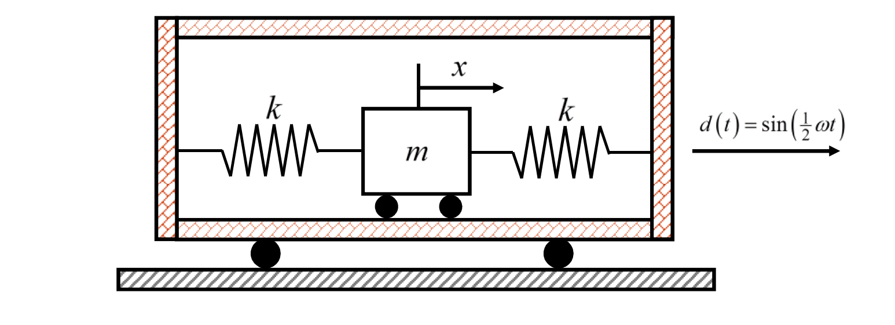

# 考題編號：SD-2021-1

**主分類：** `SD-U1-3` 單自由度、多自由度系統之動態分析及應用
**副分類：** `SD-U1-2` 運動方程式推導
**分析方法：** SDOF強迫振動（基礎激振）
**標籤：** `SDOF` `基礎激振` `框架位移` `運動方程式` `Duhamel積分` `絕對速度` `頻率比` `初始條件` `相對座標`

---

## 1. 原始題目重述 (Problem Restatement)

有一質量為 $m$ 的台車，利用**左右各一個**剛度為 $k$ 的彈簧，固定在一剛性構架內。整個剛性構架受到向右的位移激振：

$$d(t) = \sin\!\left(\tfrac{1}{2}\omega t\right)$$

其中 $\omega$ 為此結構系統的自然振動頻率。系統**從靜止開始運動**（$x(0)=0$，$\dot{x}(0)=0$）。

*圖說：台車質量 m；左、右彈簧剛度均為 k；台車絕對位移 x（向右為正）；框架位移 d(t) = sin(½ωt) 向右作用在整個剛性框架（含左右牆）。*

**子問題：**
- (一) 求運動方程式
- (二) 求自然振動頻率 $\omega$
- (三) 求台車的**絕對速度**（以符號表示）

---

## 2. 考題核心精神與出題者意圖 (Core Concepts & Examiner's Intent)

**核心觀念：** 基礎（框架）激振下的 SDOF 強迫振動——以絕對座標或相對座標建立運動方程式，並在無阻尼情況下以初始條件求完整解。

**出題者測驗能力：**
1. 能否正確辨識**框架激振**與**直接力激振**的差異，並寫出正確的 EOM
2. 能否對無阻尼強迫振動（非共振，$r = 1/2$）求出含自由振動項的**完整解**
3. 能否正確套用**初始條件**（注意 $\dot{d}(0) \neq 0$，是最常見失分點）

**關鍵陷阱：** 初始條件要對相對位移 $u = x - d$ 列，且 $\dot{u}(0) = \dot{x}(0) - \dot{d}(0) = 0 - \frac{\omega}{2} = -\frac{\omega}{2}$，**不可設為零**。

---

## 3. 解題戰略地圖與陷阱分析 (Strategic Roadmap & Trap Analysis)

**作戰計畫：**
1. 對台車列自由體圖 → 寫絕對座標 EOM
2. 比較 EOM 與標準形式讀出 $\omega_0$ → 即為 $\omega$
3. 換相對座標 $u = x - d$ 簡化強迫項 → 求特解
4. 寫通解，套初始條件（注意 $\dot{u}(0)$）
5. 換回絕對座標，微分求速度

**四大陷阱：**

| # | 陷阱 | 正確處理 |
|---|------|---------|
| 1 | 初始條件 $\dot{u}(0)$ 忘加 $-\dot{d}(0)$ | $\dot{u}(0) = \dot{x}(0) - \dot{d}(0) = 0 - \omega/2 = -\omega/2$ |
| 2 | 彈簧力方向：以為兩彈簧相消 | 兩彈簧**同向**對抗台車相對框架的位移，合力為 $-2k(x-d)$ |
| 3 | 特解係數計算：忘記分母 $(1 - r^2)$ 公式 | $r = 1/2$，$1 - r^2 = 3/4$，靜變位 $\times$ DAF 即可 |
| 4 | 最終速度忘對絕對位移微分（在 $d$ 微分後加回） | 先寫 $x = u + d$ 再微分，或直接對 $x$ 微分 |

---

## 3.5 變數層次分析 (Variable Hierarchy Analysis)

> 複習提示：第一次解題後，在每個卡住的知識點旁標記 `⚠`；第二次複習時只看有 `⚠` 的項目。

### 最終目標

求台車**絕對速度** $\dot{x}(t)$ 的完整時間歷程（符號表示）

### 本題關鍵公式（依計算順序）

$$\text{Step 1: EOM（絕對座標）} \quad m\ddot{x} + 2kx = 2k\sin\!\left(\tfrac{\omega}{2}t\right)$$

$$\text{Step 2: 自然頻率} \quad \omega = \sqrt{\dfrac{2k}{m}}$$

$$\text{Step 3: 相對位移} \quad u = x - d \;\Rightarrow\; \ddot{u} + \boxed{\omega^2} u = \dfrac{\omega^2}{4}\sin\!\left(\tfrac{\omega}{2}t\right)$$

$$\text{Step 4: 頻率比} \quad r = \dfrac{\omega/2}{\omega} = \dfrac{1}{2}$$

$$\text{Step 5: 特解} \quad u_p = \dfrac{1}{3}\sin\!\left(\tfrac{\omega}{2}t\right)$$

$$\text{Step 6: 通解 + 初始條件} \quad u = C_1\cos(\boxed{\omega}t) + C_2\sin(\boxed{\omega}t) + \boxed{u_p}$$

$$\text{Step 7: 絕對速度} \quad \dot{x}(t) = \dfrac{2\omega}{3}\!\left[\cos\!\left(\tfrac{\omega}{2}t\right) - \cos(\omega t)\right]$$

### L1：題目直接給定

| 符號 | 數值 | 說明 |
|------|------|------|
| $m$ | $m$ | 台車質量 |
| $k$ | $k$ | 彈簧剛度（左右各一） |
| $d(t)$ | $\sin(\tfrac{1}{2}\omega t)$ | 框架激振位移 |
| $\omega$ | —（待求） | 系統自然振動頻率（題目定義） |
| $x(0)$ | $0$ | 台車初始位移 |
| $\dot{x}(0)$ | $0$ | 台車初始速度 |

### L2：需知識點推導

**運動方程式建立**

| 符號 | 公式／來源 | 卡關? |
|------|-----------|------|
| 左彈簧力 | $F_L = -k(x - d)$ | |
| 右彈簧力 | $F_R = -k(x - d)$ | |
| EOM | $m\ddot{x} = -2k(x-d)$ | |

**自然頻率**

| 符號 | 公式／來源 | 卡關? |
|------|-----------|------|
| $\omega^2$ | $2k/m$（對比標準形 $\ddot{x}+\omega^2 x = \ldots$）| |

**相對座標換算**

| 符號 | 公式／來源 | 卡關? |
|------|-----------|------|
| $u$ | $x - d$ | |
| $\ddot{d}$ | $-(\omega/2)^2\sin(\omega t/2) = -\frac{\omega^2}{4}\sin(\omega t/2)$ | |
| 相對 EOM | $\ddot{u} + \omega^2 u = \frac{\omega^2}{4}\sin(\frac{\omega}{2}t)$ | |

**特解（無阻尼強迫振動）**

| 符號 | 公式／來源 | 卡關? |
|------|-----------|------|
| $r$ | $\Omega/\omega_0 = (\omega/2)/\omega = 1/2$ | |
| $A$（特解振幅） | $\frac{F_0/k}{1-r^2} = \frac{1/2}{1-(1/2)^2} = \frac{1/2}{3/4} = \frac{1}{3}$ | |
| $u_p$ | $\frac{1}{3}\sin(\frac{\omega}{2}t)$ | |

**初始條件求常數**

| 符號 | 公式／來源 | 卡關? |
|------|-----------|------|
| $u(0)$ | $x(0) - d(0) = 0$ → $C_1 = 0$ | |
| $\dot{d}(0)$ | $\frac{\omega}{2}\cos(0) = \frac{\omega}{2}$ | |
| $\dot{u}(0)$ | $\dot{x}(0) - \dot{d}(0) = -\frac{\omega}{2}$ | |
| $C_2$ | $C_2\omega + \frac{\omega}{6} = -\frac{\omega}{2}$ → $C_2 = -\frac{2}{3}$ | |

### L3：深層知識（不懂就卡住）

| 知識點 | 說明 | 卡關? |
|--------|------|------|
| 框架激振與直接力激振的 EOM 差異 | 框架激振：兩彈簧均對抗相對位移，強迫項來自 $-m\ddot{d}$ 或 $2kd$，形式相同 | |
| 無阻尼強迫振動通解需含自由振動項 | 即使穩態特解存在，因初始條件不為零，自由振動項 $C_1, C_2$ 不可省略 | |
| $\dot{u}(0) \neq 0$ 的物理意義 | 框架從 $t=0$ 開始已有速度 $\dot{d}(0)=\omega/2$，台車仍靜止，故兩者相對速度不為零 | |

---

## 4. 步驟化詳細計算過程 (Step-by-Step Detailed Calculation)

### (一) 求運動方程式

對台車進行**自由體圖**分析：台車絕對位移為 $x$（向右為正），框架位移為 $d(t)$。

兩個彈簧均對抗台車**相對於框架**的位移 $(x - d)$：

- 左彈簧力：$F_L = -k(x - d)$（台車偏右時，向左拉）
- 右彈簧力：$F_R = -k(x - d)$（台車偏右時，右彈簧受壓，也向左推）

*策略註解：兩彈簧方向相同，合力為 $-2k(x-d)$，因為它們都對抗台車相對框架的運動。*

Newton 第二定律：

$$m\ddot{x} = -2k(x - d) = -2kx + 2kd$$

$$\boxed{m\ddot{x} + 2kx = 2k\sin\!\left(\frac{\omega}{2}t\right)}$$

---

### (二) 求自然振動頻率

將 EOM 改寫為標準形式：

$$\ddot{x} + \frac{2k}{m}x = \frac{2k}{m}\sin\!\left(\frac{\omega}{2}t\right)$$

對比 $\ddot{x} + \omega_0^2 x = \ldots$，讀出：

$$\omega_0^2 = \frac{2k}{m}$$

題目定義 $\omega$ 為此系統的自然振動頻率，故：

$$\boxed{\omega = \sqrt{\frac{2k}{m}}}$$

---

### (三) 求台車絕對速度

**換相對座標 $u = x - d$**，令 $\ddot{x} = \ddot{u} + \ddot{d}$：

$$\ddot{d} = \frac{d^2}{dt^2}\sin\!\left(\frac{\omega}{2}t\right) = -\frac{\omega^2}{4}\sin\!\left(\frac{\omega}{2}t\right)$$

代入 EOM（以 $\omega^2 = 2k/m$ 替換）：

$$\ddot{u} + \omega^2 u = -\ddot{d} = \frac{\omega^2}{4}\sin\!\left(\frac{\omega}{2}t\right)$$

**求特解**（無阻尼，激振頻率 $\Omega = \omega/2$，頻率比 $r = 1/2$）：

$$u_p = A\sin\!\left(\frac{\omega}{2}t\right)$$

代入微分方程：

$$-A\frac{\omega^2}{4} + \omega^2 A = \frac{\omega^2}{4}$$

$$A\omega^2\left(1 - \frac{1}{4}\right) = \frac{\omega^2}{4} \;\Rightarrow\; A\cdot\frac{3}{4} = \frac{1}{4} \;\Rightarrow\; A = \frac{1}{3}$$

$$u_p(t) = \frac{1}{3}\sin\!\left(\frac{\omega}{2}t\right)$$

**寫通解**：

$$u(t) = C_1\cos(\omega t) + C_2\sin(\omega t) + \frac{1}{3}\sin\!\left(\frac{\omega}{2}t\right)$$

**套初始條件**（$x(0) = 0$，$\dot{x}(0) = 0$，$d(0) = 0$，$\dot{d}(0) = \frac{\omega}{2}$）：

$$u(0) = x(0) - d(0) = 0 \;\Rightarrow\; C_1 = 0$$

$$\dot{u}(0) = \dot{x}(0) - \dot{d}(0) = 0 - \frac{\omega}{2} = -\frac{\omega}{2}$$

對 $u$ 微分：

$$\dot{u}(t) = -C_1\omega\sin(\omega t) + C_2\omega\cos(\omega t) + \frac{\omega}{6}\cos\!\left(\frac{\omega}{2}t\right)$$

$$\dot{u}(0) = C_2\omega + \frac{\omega}{6} = -\frac{\omega}{2}$$

$$C_2 = -\frac{1}{2} - \frac{1}{6} = -\frac{2}{3}$$

**絕對位移**（$x = u + d$）：

$$x(t) = -\frac{2}{3}\sin(\omega t) + \frac{1}{3}\sin\!\left(\frac{\omega}{2}t\right) + \sin\!\left(\frac{\omega}{2}t\right) = -\frac{2}{3}\sin(\omega t) + \frac{4}{3}\sin\!\left(\frac{\omega}{2}t\right)$$

**絕對速度**（對 $x$ 微分）：

$$\dot{x}(t) = -\frac{2\omega}{3}\cos(\omega t) + \frac{4}{3}\cdot\frac{\omega}{2}\cos\!\left(\frac{\omega}{2}t\right)$$

$$\boxed{\dot{x}(t) = \frac{2\omega}{3}\!\left[\cos\!\left(\frac{\omega}{2}t\right) - \cos(\omega t)\right]}$$

**驗算**：$\dot{x}(0) = \frac{2\omega}{3}[1 - 1] = 0$ ✓（符合初始靜止條件）

---

## 5. 關鍵爭議點與進階探討 (Critical Issues & Advanced Discussion)

**爭議點 1：絕對座標 vs 相對座標**

題目 (三) 明確要求「絕對速度」，提醒考生最後必須換回絕對座標。若全程用相對座標 $u$，最後一步求 $\dot{u} + \dot{d}$ 也可得相同結果，但容易忘記加 $\dot{d}$。

**爭議點 2：「從靜止開始」的正確初始條件**

「從靜止開始」是指台車靜止，即 $x(0) = 0$，$\dot{x}(0) = 0$。但框架 $d(t)$ 的速度 $\dot{d}(0) = \frac{\omega}{2} \neq 0$，因此相對速度 $\dot{u}(0) = -\frac{\omega}{2}$，**這是最容易失分的地方**。

**進階探討：長時間行為**

因為激振頻率 $(\omega/2)$ 與自然頻率 $(\omega)$ 不可公度，$x(t)$ 的拍頻現象不明顯，但位移有界（非共振）。若激振頻率 $= \omega$（共振），特解形式需改為 $t\cos(\omega t)$，位移將無限增長。

**進階探討：考試策略**

本題 (三) 配分較高，建議在考場上分三步驟呈現：① 列 EOM → ② 特解 → ③ 通解+初始條件，每步驟清楚標示，爭取階段性得分。
