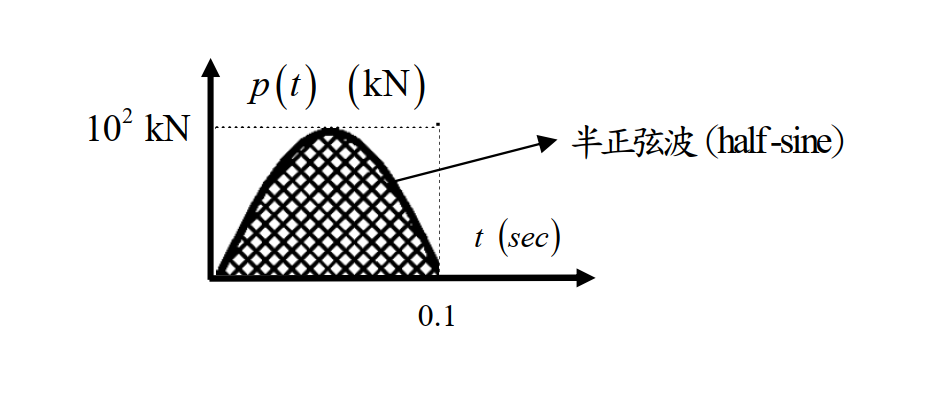

# 考題編號：SD-2021-2

**主分類：** `SD-U1-3` 單自由度、多自由度系統之動態分析及應用
**副分類：** `SD-U1-1` 結構動力基本性質及原理
**分析方法：** SDOF穩態反應（求阻尼比）＋ Duhamel積分（短時載重最大位移）
**標籤：** `SDOF` `阻尼比` `穩態位移` `動力放大係數` `共振` `頻率比` `Duhamel積分` `半正弦波` `衝擊荷載` `自由振動` `兩階段法` `SRS`

---

## 1. 原始題目重述 (Problem Restatement)

### (一) 求阻尼比

SDOF 系統，自然振動頻率 $\omega_0 = 10$ rad/sec，受簡諧載重 $p(t) = p_0\sin(\bar{\omega}t)$。

- 當 $\bar{\omega} = 0.1$ rad/sec：最大穩態位移 $X_1 = 2.4$ cm
- 當 $\bar{\omega} = 10$ rad/sec：最大穩態位移 $X_2 = 20$ cm

求阻尼比 $\xi$。

### (二) 最大位移（半正弦波衝擊載重）

已知 $m = 10^4$ kg，$\xi$ 由(一)求得。
受如圖所示半正弦波載重：振幅 $p_0 = 10^2$ kN，持續時間 $t_d = 0.1$ sec。

*圖說：半正弦波衝擊載重 $p(t) = p_0\sin(\pi t / t_d)$，$p_0 = 100$ kN，$t_d = 0.1$ sec；$t > 0.1$ sec 後 $p = 0$（自由振動）。*

---

## 2. 考題核心精神與出題者意圖 (Core Concepts & Examiner's Intent)

**核心觀念：**
- (一) 利用不同頻率比下的穩態振幅比，反推阻尼比——考「動力放大係數 $D$ 的頻率特性」
- (二) 短時衝擊載重（$t_d \ll T$）的最大位移——考「Duhamel 積分兩階段法」及「判斷最大值發生於載重中或結束後」

**出題者測驗能力：**
1. 認識共振條件（$\bar{\omega} = \omega_0$）下的放大係數 $D = 1/(2\xi)$
2. 辨識低頻激振的準靜態特性，直接讀出靜位移
3. 對衝擊載重使用「兩階段（強迫+自由振動）法」求最大位移

**關鍵陷阱：** 計算(一)時，若兩個條件都套完整公式，會有兩個方程式兩個未知數（$p_0/k$ 和 $\xi$），解法複雜。正確辨識 $\bar{\omega} = 0.1$ rad/sec 為準靜態（$r_1 = 0.01$），可直接讀出靜位移。

---

## 3. 解題戰略地圖與陷阱分析 (Strategic Roadmap & Trap Analysis)

**作戰計畫（一）：**
1. 計算兩個頻率比 $r_1 = 0.1/10 = 0.01$，$r_2 = 10/10 = 1$
2. 識別 $r_1 \approx 0$（準靜態）→ $X_1 = p_0/k$（直接讀出靜位移）
3. 識別 $r_2 = 1$（共振）→ $D_2 = 1/(2\xi)$
4. 兩式聯立求 $\xi$

**作戰計畫（二）：**
1. 由 $m, \omega_0$ 求 $k$，再求靜位移 $x_{st} = p_0/k$
2. 求自然週期 $T$，計算 $t_d/T$ 判斷載重型態
3. Duhamel 積分：強迫相 $(0 \leq t \leq t_d)$ 求端點 $x(t_d)$、$\dot{x}(t_d)$
4. 自由振動相 $(t > t_d)$ 求最大振幅 $\sqrt{x(t_d)^2 + (\dot{x}(t_d)/\omega_0)^2}$
5. 比較兩相最大值取大者

**四大陷阱：**

| # | 陷阱 | 正確處理 |
|---|------|---------|
| 1 | 以為 $r_1 = 0.01$ 也需套完整公式 | $r_1 \approx 0$ 時 $D \approx 1$，$X_1 \approx p_0/k$ |
| 2 | $r = 1$ 時分母 $1-r^2 = 0$，誤用一般公式 | 共振公式 $D = 1/(2\xi)$（有阻尼） |
| 3 | 半正弦波激振頻率誤設為 $p_0/t_d$ | $\Omega = \pi/t_d$（從 $\sin(\pi t/t_d)$ 讀出） |
| 4 | 最大位移誤以為只在強迫相 | $t_d/T \approx 0.16 < 0.5$：最大值通常在**自由振動相** |

---

## 3.5 變數層次分析 (Variable Hierarchy Analysis)

> 複習提示：第一次解題後，在每個卡住的知識點旁標記 `⚠`；第二次複習時只看有 `⚠` 的項目。

### 最終目標

(一) 阻尼比 $\xi$；(二) 半正弦波衝擊載重下的最大絕對位移 $x_{max}$

### 本題關鍵公式（依計算順序）

$$\text{Step 1（一）: 頻率比} \quad r_1 = \frac{0.1}{10} = 0.01,\quad r_2 = \frac{10}{10} = 1$$

$$\text{Step 2（一）: 準靜態} \quad X_1 \approx \frac{p_0}{k} = 2.4 \text{ cm}$$

$$\text{Step 3（一）: 共振放大} \quad X_2 = \frac{p_0/k}{2\xi} = 20 \text{ cm} \;\Rightarrow\; \xi = \frac{\boxed{p_0/k}}{2 \times 20}$$

$$\text{Step 4（二）: 系統勁度} \quad k = m\omega_0^2 = 10^4 \times 10^2 = 10^6 \text{ N/m}$$

$$\text{Step 5（二）: 靜位移} \quad x_{st} = \frac{p_0}{k} = \frac{10^5}{10^6} = 0.1 \text{ m}$$

$$\text{Step 6（二）: 激振頻率與頻率比} \quad \Omega = \frac{\pi}{t_d} = 10\pi,\quad r = \frac{\Omega}{\omega_0} = \pi$$

$$\text{Step 7（二）: 強迫相端點值} \quad x(t_d) = \frac{\boxed{x_{st}}}{1-\boxed{r}^2}[0 - r\sin(\omega_0 t_d)]$$

$$\text{Step 8（二）: 自由相振幅} \quad X_{max} = \sqrt{x(t_d)^2 + \left(\frac{\dot{x}(t_d)}{\omega_0}\right)^2}$$

### L1：題目直接給定

| 符號 | 數值 | 說明 |
|------|------|------|
| $\omega_0$ | $10$ rad/sec | 系統自然頻率 |
| $X_1$ | $2.4$ cm | $\bar{\omega} = 0.1$ 時穩態位移 |
| $X_2$ | $20$ cm | $\bar{\omega} = 10$ 時穩態位移 |
| $m$ | $10^4$ kg | 系統質量 |
| $p_0$ | $10^2$ kN $= 10^5$ N | 半正弦波振幅 |
| $t_d$ | $0.1$ sec | 載重持續時間 |

### L2：需知識點推導

**（一）阻尼比**

| 符號 | 公式／來源 | 卡關? |
|------|-----------|------|
| $r_1, r_2$ | $\bar{\omega}/\omega_0$：$0.01$、$1.0$ | |
| $p_0/k$ | $X_1 \approx 2.4$ cm（$r_1 \approx 0$，準靜態） | |
| $\xi$ | $X_2 = (p_0/k)/(2\xi)$ → $\xi = 2.4/(2\times20) = 0.06$ | |

**（二）最大位移**

| 符號 | 公式／來源 | 卡關? |
|------|-----------|------|
| $k$ | $m\omega_0^2 = 10^6$ N/m | |
| $T$ | $2\pi/\omega_0 = 0.6283$ sec | |
| $x_{st}$ | $p_0/k = 0.1$ m | |
| $\Omega$ | $\pi/t_d = 10\pi$ rad/sec | |
| $r$ | $\Omega/\omega_0 = \pi$ | |
| $1-r^2$ | $1-\pi^2 = -8.870$ | |
| $x(t_d)$ | Duhamel 強迫相端點 | |
| $\dot{x}(t_d)$ | Duhamel 強迫相端點速度 | |
| $X_{max}$ | $\sqrt{x(t_d)^2 + (\dot{x}(t_d)/\omega_0)^2}$ | |

### L3：深層知識（不懂就卡住）

| 知識點 | 說明 | 卡關? |
|--------|------|------|
| 共振條件下穩態放大係數 | $r=1$ 時分母 $1-r^2=0$，以阻尼限制：$D = 1/(2\xi)$ | |
| Duhamel積分兩階段法 | 強迫相求解特解+自由振動；自由相用端點初始條件求振幅 | |
| $t_d/T$ 判斷最大值位置 | $t_d/T \ll 1$ 時最大值在自由振動相；$t_d/T \gg 1$ 時在強迫相 | |
| 半正弦波激振頻率 $\Omega = \pi/t_d$ | 由 $\sin(\pi t/t_d)$ 讀出角頻率，非 $1/t_d$ | |

---

## 4. 步驟化詳細計算過程 (Step-by-Step Detailed Calculation)

### (一) 求阻尼比 $\xi$

**Step 1：計算兩個頻率比**

$$r_1 = \frac{\bar{\omega}_1}{\omega_0} = \frac{0.1}{10} = 0.01 \approx 0 \quad \text{（準靜態）}$$

$$r_2 = \frac{\bar{\omega}_2}{\omega_0} = \frac{10}{10} = 1 \quad \text{（共振）}$$

*策略註解：辨識 $r_1 \approx 0$（激振頻率遠低於自然頻率，結構幾乎不動態放大）和 $r_2 = 1$（共振，無阻尼時振幅無限大）是解題關鍵。*

**Step 2：從準靜態條件讀出靜位移**

當 $r_1 \approx 0$，動力放大係數 $D_1 = 1/\sqrt{(1-r_1^2)^2 + (2\xi r_1)^2} \approx 1$

$$\frac{p_0}{k} = X_1 = 2.4 \text{ cm}$$

**Step 3：從共振條件求阻尼比**

當 $r_2 = 1$，$D_2 = \dfrac{1}{2\xi}$（共振放大係數）

$$X_2 = \frac{p_0}{k} \cdot D_2 = 2.4 \times \frac{1}{2\xi} = 20 \text{ cm}$$

$$\boxed{\xi = \frac{2.4}{2 \times 20} = 0.06 = 6\%}$$

---

### (二) 最大位移（半正弦波衝擊載重）

**Step 1：系統參數**

$$k = m\omega_0^2 = 10^4 \times 10^2 = 10^6 \text{ N/m} = 1000 \text{ kN/m}$$

$$T = \frac{2\pi}{\omega_0} = \frac{2\pi}{10} \approx 0.6283 \text{ sec}$$

$$x_{st} = \frac{p_0}{k} = \frac{10^5}{10^6} = 0.1 \text{ m} = 10 \text{ cm}$$

**Step 2：載重特性分析**

$$\Omega = \frac{\pi}{t_d} = \frac{\pi}{0.1} = 10\pi \text{ rad/sec} \approx 31.42 \text{ rad/sec}$$

$$r = \frac{\Omega}{\omega_0} = \frac{10\pi}{10} = \pi \approx 3.14 \quad (r \gg 1 \text{，高頻激振})$$

$$\frac{t_d}{T} = \frac{0.1}{0.6283} \approx 0.159 \quad (< 0.5 \text{，屬短時衝擊載重})$$

*策略註解：$t_d/T < 0.5$ 表示載重作用時間遠短於自然週期，最大響應預期出現在**自由振動相**（載重結束後）。*

**Step 3：計算原理說明（Duhamel 積分兩階段法）**

> **原理：** 衝擊型載重的動力響應需分兩相計算——
> - **強迫相** $0 \leq t \leq t_d$：使用 Duhamel 積分（或直接解特解）求響應
> - **自由振動相** $t > t_d$：以強迫相末端值 $x(t_d)$、$\dot{x}(t_d)$ 為初始條件，求自由振動振幅

**Step 4：強迫相 $(0 \leq t \leq t_d)$ 的響應**

載重 $p(t) = p_0\sin(\Omega t)$ 作用下，無阻尼 SDOF 從靜止開始的特解（$r = \pi \neq 1$）：

$$x_1(t) = \frac{x_{st}}{1-r^2}\left[\sin(\Omega t) - r\sin(\omega_0 t)\right]$$

計算各量：
$$1 - r^2 = 1 - \pi^2 \approx -8.870$$

在 $t = t_d = 0.1$ sec 時（Duhamel 端點值）：
$$\Omega t_d = \pi \times 0.1 / 0.1 = \pi \;\Rightarrow\; \sin(\Omega t_d) = \sin(\pi) = 0$$
$$\omega_0 t_d = 10 \times 0.1 = 1 \text{ rad} \;\Rightarrow\; \sin(\omega_0 t_d) = \sin(1) \approx 0.8415$$

$$x_1(t_d) = \frac{0.1}{-8.870}\left[0 - \pi \times 0.8415\right] = \frac{0.1 \times \pi \times 0.8415}{8.870} = \frac{0.2644}{8.870} \approx 0.02981 \text{ m}$$

速度 $\dot{x}_1(t) = \dfrac{x_{st}}{1-r^2}\left[\Omega\cos(\Omega t) - r\omega_0\cos(\omega_0 t)\right]$

$$\cos(\Omega t_d) = \cos(\pi) = -1, \quad \cos(\omega_0 t_d) = \cos(1) \approx 0.5403$$

$$\dot{x}_1(t_d) = \frac{0.1}{-8.870}\left[10\pi \times (-1) - \pi \times 10 \times 0.5403\right]$$

$$= \frac{0.1}{-8.870} \times (-10\pi)(1 + 0.5403) = \frac{0.1 \times 10\pi \times 1.5403}{8.870}$$

$$= \frac{0.1 \times 31.416 \times 1.5403}{8.870} = \frac{4.838}{8.870} \approx 0.5454 \text{ m/sec}$$

**Step 5：自由振動相 $(t > t_d)$ 的最大振幅**

$$X_{max} = \sqrt{x_1(t_d)^2 + \left(\frac{\dot{x}_1(t_d)}{\omega_0}\right)^2}$$

$$= \sqrt{(0.02981)^2 + \left(\frac{0.5454}{10}\right)^2} = \sqrt{(0.02981)^2 + (0.05454)^2}$$

$$= \sqrt{0.000889 + 0.002975} = \sqrt{0.003864} \approx 0.06216 \text{ m}$$

**比較強迫相最大值**：$x_1(t_{max,forced}) \leq x_1(t_d) = 2.98$ cm（強迫相無極值，端點最大）

$$\boxed{x_{max} \approx 6.22 \text{ cm} \quad \text{（發生於自由振動相）}}$$

**備驗（衝擊近似法）：**

因 $t_d/T \approx 0.16 < 0.2$，可用脈衝量估算：
$$I = \int_0^{t_d} p_0\sin\!\left(\frac{\pi t}{t_d}\right)dt = \frac{2p_0 t_d}{\pi} = \frac{2 \times 10^5 \times 0.1}{\pi} \approx 6366 \text{ N·s}$$

$$x_{max} \approx \frac{I}{m\omega_0} = \frac{6366}{10^4 \times 10} = 0.0637 \text{ m} = 6.37 \text{ cm}$$

兩法結果相近（6.37 ≈ 6.22 cm），衝擊近似略高（保守側）✓

---

## 5. 關鍵爭議點與進階探討 (Critical Issues & Advanced Discussion)

**爭議點 1：阻尼對最大位移的影響**

本題(二)以無阻尼公式計算，$\xi = 6\%$ 時精確解略小（阻尼耗能）。若含阻尼：強迫相使用 Duhamel 積分卷積積分 $x(t) = \frac{1}{m\omega_d}\int_0^t p(\tau)e^{-\xi\omega_0(t-\tau)}\sin[\omega_d(t-\tau)]d\tau$，計算量大，**考場上以無阻尼答案加說明「阻尼使響應略小」即可。**

**爭議點 2：最大值在哪一相？**

判斷法則：

| $t_d/T$ 範圍 | 最大值位置 | 動力放大因子 |
|---|---|---|
| $< 0.4$ | 自由振動相 | $< 1$（脈衝型） |
| $\approx 0.5$ | 兩相均可能 | ≈ 1.77（半正弦尖峰） |
| $> 1.0$ | 強迫相 | 趨近 2（準靜態衝擊） |

本題 $t_d/T = 0.159$，故最大值在自由振動相，動力放大 $= 6.22/10 = 0.622$ ✓

**進階探討：震動反應譜（SRS）**

本題計算本質上等同於從 SRS（Shock Response Spectrum）讀取 $t_d/T = 0.159$ 時的放大倍率。SRS 是衝擊設計的核心工具，可快速從圖表讀值而不需逐步積分。
