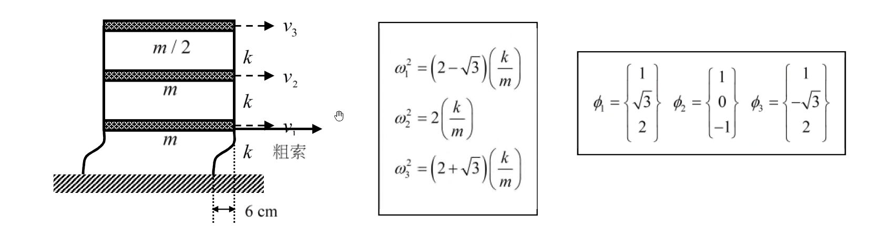

# 考題編號：SD-2021-3

**主分類：** `SD-U1-3` 單自由度、多自由度系統之動態分析及應用
**副分類：** `SD-U1-1` 結構動力基本性質及原理
**分析方法：** MDOF模態疊加法（自由振動初始條件展開）
**標籤：** `MDOF` `3自由度` `剪力建築` `自由振動` `模態疊加` `初始條件` `模態正交性` `層間剪力` `彈返法` `模態展開`

---

## 1. 原始題目重述 (Problem Restatement)

三層樓剪力建築，以彈返法（snap-back test）進行自由振動實驗：
- **拉力位置：** 一樓向右拉位移 6 cm，隨後突然完全放開
- **樓板：** 假設為剛性

*圖說：一樓質量 $m$（速度 $v_1$）、二樓質量 $m$（速度 $v_2$）、三樓質量 $m/2$（速度 $v_3$）；每層層間勁度均為 $k$；粗索施力於一樓，初始位移 6 cm。*

**已知振動頻率：**
$$\omega_1^2 = (2-\sqrt{3})\frac{k}{m}, \quad \omega_2^2 = 2\frac{k}{m}, \quad \omega_3^2 = (2+\sqrt{3})\frac{k}{m}$$

**已知振態（由下層至頂層，分量對應 1F、2F、3F）：**
$$\phi_1 = \begin{Bmatrix} 1 \\ \sqrt{3} \\ 2 \end{Bmatrix}, \quad \phi_2 = \begin{Bmatrix} 1 \\ 0 \\ -1 \end{Bmatrix}, \quad \phi_3 = \begin{Bmatrix} 1 \\ -\sqrt{3} \\ 2 \end{Bmatrix}$$

**求：頂層（三樓）的層間剪力**

---

## 2. 考題核心精神與出題者意圖 (Core Concepts & Examiner's Intent)

**核心觀念：** 以**模態正交性**將任意初始條件展開為各振態貢獻，再對三樓層間位移（$x_3 - x_2$）乘以層間勁度得層間剪力。

**出題者測驗能力：**
1. 正確建立質量矩陣（注意三樓質量 $m/2$）
2. 以模態展開係數公式 $A_i = \phi_i^T[M]\mathbf{x}(0) / \phi_i^T[M]\phi_i$ 求各模態振幅
3. 由位移時程差求層間位移，再求層間剪力
4. 理解「層間剪力 = 層間勁度 × 層間位移」的物理含義

**關鍵陷阱：** 質量矩陣中三樓是 $m/2$，若誤用 $m$ 將導致所有模態展開係數錯誤。

---

## 3. 解題戰略地圖與陷阱分析 (Strategic Roadmap & Trap Analysis)

**作戰計畫：**
1. 確認初始條件：$\mathbf{x}(0) = \{6,0,0\}^T$ cm，$\dot{\mathbf{x}}(0) = \{0,0,0\}^T$
2. 建立質量矩陣 $[M] = \text{diag}(m, m, m/2)$
3. 對每個振態計算 $\phi_i^T[M]\phi_i$（模態質量）及 $\phi_i^T[M]\mathbf{x}(0)$（模態初始值）
4. 求展開係數 $A_i$，驗算 $\sum A_i\phi_i = \mathbf{x}(0)$
5. 寫出 $x_2(t)$ 和 $x_3(t)$ 的時程
6. $V_3(t) = k[x_3(t) - x_2(t)]$

**四大陷阱：**

| # | 陷阱 | 正確處理 |
|---|------|---------|
| 1 | 三樓質量誤用 $m$（應為 $m/2$） | $[M] = \text{diag}(m, m, m/2)$ |
| 2 | 初始條件誤設 $x_2(0) \neq 0$ | 彈返法：僅 $x_1(0) = 6$ cm，其餘為零 |
| 3 | 初始速度 $\dot{\mathbf{x}}(0)$ 忘記設為零 | 突然放開瞬間，台車靜止，速度為零 |
| 4 | 層間剪力用 $k \cdot x_3$ 而非 $k(x_3 - x_2)$ | 頂層層間剪力 = $k \times$（三樓與二樓的**相對**位移） |

---

## 3.5 變數層次分析 (Variable Hierarchy Analysis)

> 複習提示：第一次解題後，在每個卡住的知識點旁標記 `⚠`；第二次複習時只看有 `⚠` 的項目。

### 最終目標

頂層（三樓）層間剪力 $V_3(t)$ 的完整時間歷程

### 本題關鍵公式（依計算順序）

$$\text{Step 1: 模態質量} \quad M_i^* = \phi_i^T[M]\phi_i$$

$$\text{Step 2: 模態初始值} \quad c_i = \phi_i^T[M]\mathbf{x}(0)$$

$$\text{Step 3: 展開係數} \quad A_i = \frac{c_i}{\boxed{M_i^*}}$$

$$\text{Step 4: 位移時程} \quad x_j(t) = \sum_{i=1}^{3} A_i\phi_{ji}\cos(\omega_i t)$$

$$\text{Step 5: 層間剪力} \quad V_3(t) = k\left[\boxed{x_3(t)} - \boxed{x_2(t)}\right]$$

### L1：題目直接給定

| 符號 | 數值 | 說明 |
|------|------|------|
| $m_1, m_2$ | $m$ | 一、二樓質量 |
| $m_3$ | $m/2$ | 三樓質量 |
| $k$ | $k$ | 每層層間勁度 |
| $x_1(0)$ | $6$ cm | 一樓初始位移（彈返法） |
| $x_2(0), x_3(0)$ | $0$ | 其餘樓層初始位移 |
| $\phi_1,\phi_2,\phi_3$ | 如題 | 三個振態向量 |
| $\omega_1^2, \omega_2^2, \omega_3^2$ | $(2\pm\sqrt{3})k/m$，$2k/m$ | 振動頻率平方 |

### L2：需知識點推導

**模態質量計算**

| 符號 | 公式／來源 | 卡關? |
|------|-----------|------|
| $M_1^*$ | $1^2m + (\sqrt{3})^2m + 2^2(m/2) = m+3m+2m = 6m$ | |
| $M_2^*$ | $1^2m + 0^2m + (-1)^2(m/2) = m+0+m/2 = 3m/2$ | |
| $M_3^*$ | $1^2m + (-\sqrt{3})^2m + 2^2(m/2) = m+3m+2m = 6m$ | |

**模態初始值**

| 符號 | 公式／來源 | 卡關? |
|------|-----------|------|
| $c_1$ | $\phi_1^T[M]\mathbf{x}(0) = 1\cdot m\cdot 6 = 6m$ | |
| $c_2$ | $\phi_2^T[M]\mathbf{x}(0) = 1\cdot m\cdot 6 = 6m$ | |
| $c_3$ | $\phi_3^T[M]\mathbf{x}(0) = 1\cdot m\cdot 6 = 6m$ | |

**展開係數**

| 符號 | 公式／來源 | 卡關? |
|------|-----------|------|
| $A_1$ | $6m / 6m = 1$ cm | |
| $A_2$ | $6m / (3m/2) = 4$ cm | |
| $A_3$ | $6m / 6m = 1$ cm | |

### L3：深層知識（不懂就卡住）

| 知識點 | 說明 | 卡關? |
|--------|------|------|
| 模態正交性 $\phi_i^T[M]\phi_j = 0\ (i\neq j)$ | 保證模態展開係數可獨立求解 | |
| 彈返法初始條件的標準解釋 | 僅施力樓層有初始位移，其他樓層假設為零 | |
| 層間剪力 = 層間勁度 × 相對位移 | 剪力建築中，柱剪力 = $k_i(x_i - x_{i-1})$ | |
| $\dot{\mathbf{x}}(0) = 0$ 的物理意義 | 靜態拉開後釋放，初速為零，自由振動中無 $\sin$ 項 | |

---

## 4. 步驟化詳細計算過程 (Step-by-Step Detailed Calculation)

### Step 1：建立質量矩陣與初始條件

$$[M] = \begin{bmatrix} m & 0 & 0 \\ 0 & m & 0 \\ 0 & 0 & m/2 \end{bmatrix}$$

**彈返法初始條件**（一樓拉 6 cm，突然放開）：

$$\mathbf{x}(0) = \begin{Bmatrix} 6 \\ 0 \\ 0 \end{Bmatrix} \text{ cm}, \qquad \dot{\mathbf{x}}(0) = \begin{Bmatrix} 0 \\ 0 \\ 0 \end{Bmatrix}$$

*策略註解：初速為零 → 自由振動解只含 $\cos$ 項：$\mathbf{x}(t) = \sum_{i=1}^3 A_i\phi_i\cos(\omega_i t)$*

---

### Step 2：計算各振態的模態質量 $M_i^* = \phi_i^T[M]\phi_i$

**振態 1（$\phi_1 = \{1,\sqrt{3},2\}^T$）：**

$$M_1^* = 1^2\cdot m + (\sqrt{3})^2\cdot m + 2^2\cdot\frac{m}{2} = m + 3m + 2m = 6m$$

**振態 2（$\phi_2 = \{1,0,-1\}^T$）：**

$$M_2^* = 1^2\cdot m + 0^2\cdot m + (-1)^2\cdot\frac{m}{2} = m + 0 + \frac{m}{2} = \frac{3m}{2}$$

**振態 3（$\phi_3 = \{1,-\sqrt{3},2\}^T$）：**

$$M_3^* = 1^2\cdot m + (-\sqrt{3})^2\cdot m + 2^2\cdot\frac{m}{2} = m + 3m + 2m = 6m$$

---

### Step 3：計算模態初始值 $c_i = \phi_i^T[M]\mathbf{x}(0)$

由於 $[M]\mathbf{x}(0) = \{6m, 0, 0\}^T$（僅一樓有質量慣性貢獻）：

$$c_1 = 1\times 6m + \sqrt{3}\times 0 + 2\times 0 = 6m$$

$$c_2 = 1\times 6m + 0\times 0 + (-1)\times 0 = 6m$$

$$c_3 = 1\times 6m + (-\sqrt{3})\times 0 + 2\times 0 = 6m$$

*策略註解：三個振態的一樓分量均為 1，所以 $c_1 = c_2 = c_3 = 6m$。模態質量的差異才決定展開係數的不同。*

---

### Step 4：求展開係數 $A_i = c_i / M_i^*$

$$A_1 = \frac{6m}{6m} = 1 \text{ cm}$$

$$A_2 = \frac{6m}{3m/2} = 4 \text{ cm}$$

$$A_3 = \frac{6m}{6m} = 1 \text{ cm}$$

**驗算（必要步驟）：**

$$\sum_{i=1}^3 A_i\phi_i = 1\begin{Bmatrix}1\\\sqrt{3}\\2\end{Bmatrix} + 4\begin{Bmatrix}1\\0\\-1\end{Bmatrix} + 1\begin{Bmatrix}1\\-\sqrt{3}\\2\end{Bmatrix} = \begin{Bmatrix}1+4+1\\\sqrt{3}+0-\sqrt{3}\\2-4+2\end{Bmatrix} = \begin{Bmatrix}6\\0\\0\end{Bmatrix} \checkmark$$

---

### Step 5：寫出各樓層位移時程

$$\mathbf{x}(t) = 1\begin{Bmatrix}1\\\sqrt{3}\\2\end{Bmatrix}\cos(\omega_1 t) + 4\begin{Bmatrix}1\\0\\-1\end{Bmatrix}\cos(\omega_2 t) + 1\begin{Bmatrix}1\\-\sqrt{3}\\2\end{Bmatrix}\cos(\omega_3 t) \quad \text{[cm]}$$

**三樓位移：**

$$x_3(t) = 2\cos(\omega_1 t) + 4\times(-1)\cos(\omega_2 t) + 2\cos(\omega_3 t) = 2\cos(\omega_1 t) - 4\cos(\omega_2 t) + 2\cos(\omega_3 t) \text{ [cm]}$$

**二樓位移：**

$$x_2(t) = \sqrt{3}\cos(\omega_1 t) + 0 + (-\sqrt{3})\cos(\omega_3 t) = \sqrt{3}\cos(\omega_1 t) - \sqrt{3}\cos(\omega_3 t) \text{ [cm]}$$

---

### Step 6：求頂層（三樓）層間剪力

**三樓層間位移**（三樓相對二樓的水平位移）：

$$x_3(t) - x_2(t) = \left[2 - \sqrt{3}\right]\cos(\omega_1 t) - 4\cos(\omega_2 t) + \left[2 + \sqrt{3}\right]\cos(\omega_3 t) \text{ [cm]}$$

**頂層層間剪力：**

$$\boxed{V_3(t) = k\left[(2-\sqrt{3})\cos(\omega_1 t) - 4\cos(\omega_2 t) + (2+\sqrt{3})\cos(\omega_3 t)\right]}$$

其中 $k$ 的單位為 [力/長度]，$V_3$ 的單位為 [力]。

---

**等價表達（用慣性力驗算）：**

三樓方程式：$m_3\ddot{x}_3 = -k(x_3 - x_2)$ → $V_3 = -m_3\ddot{x}_3$

$$\ddot{x}_3 = -2\omega_1^2\cos(\omega_1 t) + 4\omega_2^2\cos(\omega_2 t) - 2\omega_3^2\cos(\omega_3 t)$$

$$V_3 = -\frac{m}{2}\ddot{x}_3 = m\left[\omega_1^2\cos(\omega_1 t) - 2\omega_2^2\cos(\omega_2 t) + \omega_3^2\cos(\omega_3 t)\right]$$

代入 $\omega_i^2 = (2\pm\sqrt{3})k/m$ 或 $2k/m$：

$$= m\left[(2-\sqrt{3})\frac{k}{m}\cos(\omega_1 t) - 2\cdot2\frac{k}{m}\cos(\omega_2 t) + (2+\sqrt{3})\frac{k}{m}\cos(\omega_3 t)\right]$$

$$= k\left[(2-\sqrt{3})\cos(\omega_1 t) - 4\cos(\omega_2 t) + (2+\sqrt{3})\cos(\omega_3 t)\right] \checkmark$$

**數值係數：**
- $2-\sqrt{3} \approx 0.268$（一階振態貢獻，最小）
- $4$（二階振態貢獻，最大）
- $2+\sqrt{3} \approx 3.732$（三階振態貢獻）

---

## 5. 關鍵爭議點與進階探討 (Critical Issues & Advanced Discussion)

**爭議點：彈返法初始條件的物理合理性**

若實際上以靜態力 $F$ 拉一樓使其位移 6 cm，則二、三樓也會有靜態位移（非零），初始條件為靜力平衡位移向量，而非 $\{6,0,0\}^T$。

**考場建議：** 題目明確給出「在一樓向右拉位移 6 cm」而未說明上層情況，以 $\mathbf{x}(0) = \{6,0,0\}^T$ cm 作答為標準。

**進階：振態 2 的貢獻最大（$A_2 = 4$ cm）**

因為 $M_2^* = 3m/2$（最小模態質量），相同的初始激發能量（$c_2 = 6m$）分配後得到最大的展開係數。這在工程上意味著：若只激發一樓，二階振態在剪力建築中往往有最大響應。

**進階：最大層間剪力**

三個振態頻率比 $\omega_3/\omega_1 \neq$ 有理數，故時程不嚴格週期，最大值需數值積分求得。若用 SRSS 近似（不適用於此自由振動問題，僅供參考）：

$$V_{3,max} \approx k\sqrt{(2-\sqrt{3})^2 + 4^2 + (2+\sqrt{3})^2} = k\sqrt{0.0718 + 16 + 13.93} \approx k\sqrt{30} \approx 5.48k$$
