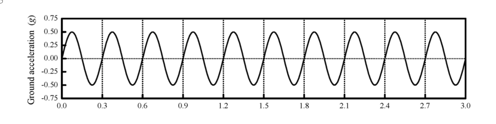

# 考題編號：SD-2021-4

**主分類：** `SD-U1-3` 單自由度、多自由度系統之動態分析及應用
**副分類：** `SD-U2-2` 建築耐震設計規範
**分析方法：** SDOF簡諧激振反應（共振判斷）＋等位移法則（彈塑性韌性需求）
**標籤：** `SDOF` `簡諧地震` `共振` `週期不確定性` `最大側向位移` `位移韌性` `等位移法則` `等能量法則` `強度折減係數` `彈塑性` `降伏強度` `穩態響應`

---

## 1. 原始題目重述 (Problem Restatement)

SDOF 結構系統，動力特性：
- 總質量：$m = 2\times10^6$ kg
- 振動週期：$T = 0.1 \sim 0.3$ sec（因基礎及結構勁度不確定性）
- 黏滯性阻尼比：$\xi = 7.5\%$
- 降伏強度：$R_y = 2.5\times10^4$ kN
- $1g = 980$ cm/s²

受到**持續 9 秒的簡諧地表加速度**作用（如圖所示，僅繪出前 3 秒）：

*圖說：簡諧地表加速度 $\ddot{u}_g(t) = 0.75g\sin(2\pi t/T_g)$，振幅 $a_g = 0.75g$，地動週期 $T_g \approx 0.3$ sec（由圖之時間軸間隔判斷），持續 9 秒。*

**子問題：**
- (一) 最大側向位移？
- (二) 抵抗此地表加速度所需的位移韌性強度（displacement ductility ratio）？

---

## 2. 考題核心精神與出題者意圖 (Core Concepts & Examiner's Intent)

**核心觀念：**
- (一) 在週期不確定的情況下，辨識**最危險週期**（共振條件 $T = T_g$），以穩態響應公式計算最大彈性位移；若降伏則用等位移法則取近似
- (二) 比較彈性需求與降伏強度，求「強度折減係數 $R$」，再由適當法則（等位移或等能量）換算「韌性需求 $\mu$」

**出題者測驗能力：**
1. 辨識簡諧地動中的共振條件（$T = T_g$，最大放大）
2. 計算穩態相對位移（$u_{el} = a_g/(\omega_0^2 \cdot 2\xi)$）
3. 判斷結構是否降伏（比較 $u_{el}$ 與 $u_y = R_y/k$）
4. 正確選用**等位移法則**（中長週期）或**等能量法則**（短週期）

**關鍵陷阱：** 週期不確定時要考慮**最不利情況**（共振），而非用平均週期；等位移 vs 等能量法則的適用條件容易混淆。

---

## 3. 解題戰略地圖與陷阱分析 (Strategic Roadmap & Trap Analysis)

**作戰計畫：**
1. 讀取地動：週期 $T_g = 0.3$ sec，振幅 $a_g = 0.75g$，持續 9 sec
2. 確認最不利週期：在 $T \in [0.1, 0.3]$ sec 中找最大響應（$T = 0.3$ sec 共振）
3. 計算共振穩態彈性位移（由反應譜或放大係數公式）
4. 計算降伏位移 $u_y = R_y/(m\omega_0^2)$
5. 比較 $u_{el}$ 與 $u_y$ → 判斷結構是否降伏
6. 若降伏：用等位移法則求最大位移及韌性需求

**四大陷阱：**

| # | 陷阱 | 正確處理 |
|---|------|---------|
| 1 | 以「平均週期」$T = 0.2$ sec 計算，非最不利 | $T = T_g = 0.3$ sec 為共振最大值 |
| 2 | 穩態位移公式用錯（忘記 $2\xi$ 在分母） | 共振 $D = 1/(2\xi)$；$u_{el} = a_g/(\omega_0^2 \cdot 2\xi)$ |
| 3 | 未檢查是否降伏，直接以彈性最大值答題 | 必須比較 $u_{el}$ 與 $u_y$ |
| 4 | 等位移 vs 等能量法則選錯 | $T = T_g$（中週期）→ 等位移；$T \ll T_g$（短週期）→ 等能量 |

---

## 3.5 變數層次分析 (Variable Hierarchy Analysis)

> 複習提示：第一次解題後，在每個卡住的知識點旁標記 `⚠`；第二次複習時只看有 `⚠` 的項目。

### 最終目標

(一) 最大側向位移 $u_{max}$；(二) 位移韌性需求 $\mu$

### 本題關鍵公式（依計算順序）

$$\text{Step 1: 最不利週期} \quad T_{worst} = T_g = 0.3 \text{ sec} \Rightarrow r = 1 \text{（共振）}$$

$$\text{Step 2: 彈性穩態位移} \quad u_{el} = \frac{a_g}{\omega_0^2 \cdot 2\xi}$$

$$\text{Step 3: 結構勁度} \quad k = m\omega_0^2$$

$$\text{Step 4: 降伏位移} \quad u_y = \frac{R_y}{\boxed{k}}$$

$$\text{Step 5: 降伏判斷} \quad u_{el} \gtrless u_y$$

$$\text{Step 6: 強度折減係數} \quad R = \frac{u_{el}}{u_y} = \frac{F_{el,max}}{R_y}$$

$$\text{Step 7: 等位移法則（$T \geq T_g$）} \quad \mu = R, \quad u_{max} = u_{el}$$

### L1：題目直接給定

| 符號 | 數值 | 說明 |
|------|------|------|
| $m$ | $2\times10^6$ kg | 總質量 |
| $T$ | $0.1\sim0.3$ sec | 振動週期範圍（不確定） |
| $\xi$ | $7.5\%$ | 黏滯性阻尼比 |
| $R_y$ | $2.5\times10^4$ kN | 降伏強度 |
| $a_g$ | $0.75g = 735$ cm/s² | 地表加速度振幅 |
| $T_g$ | $\approx 0.3$ sec | 地動週期（由圖讀取） |
| 持續時間 | 9 sec | 遠大於自然週期，可達穩態 |

### L2：需知識點推導

**最不利週期判斷**

| 符號 | 公式／來源 | 卡關? |
|------|-----------|------|
| $T_{worst}$ | $T = T_g = 0.3$ sec（$r=1$，共振最大 $D$）| |
| 說明 | 在 $T$ 越接近 $T_g$ 時，$D$ 越大；$T=0.3$ sec 在範圍內且與 $T_g$ 相同 | |

**彈性最大位移（$T = 0.3$ sec）**

| 符號 | 公式／來源 | 卡關? |
|------|-----------|------|
| $\omega_0$ | $2\pi/T = 20.94$ rad/s | |
| $\omega_0^2$ | $4\pi^2/T^2 = 438.7$ rad²/s² | |
| $D$（共振） | $1/(2\xi) = 1/0.15 = 6.667$ | |
| $u_{el}$ | $a_g/(\omega_0^2 \times 2\xi) = 735/65.81 = 11.17$ cm | |

**降伏位移與韌性**

| 符號 | 公式／來源 | 卡關? |
|------|-----------|------|
| $k$ | $m\omega_0^2 = 8.774\times10^8$ N/m | |
| $u_y$ | $R_y/k = 2.5\times10^7/8.774\times10^8 = 2.850$ cm | |
| $R$ | $u_{el}/u_y = 11.17/2.850 = 3.92$ | |
| $\mu$ | $= R = 3.92$（等位移法則） | |

### L3：深層知識（不懂就卡住）

| 知識點 | 說明 | 卡關? |
|--------|------|------|
| 等位移法則適用條件 | 中長週期（$T \geq T_g$ 或 $T \geq T_c$）：$u_{max,inelastic} \approx u_{max,elastic}$ | |
| 等能量法則適用條件 | 短週期（$T \leq 0.5T_g$）：$\mu = (R^2+1)/2$ | |
| 強度折減係數 $R$ 的物理意義 | $R = F_{el}/R_y$：若結構具足夠強度（$R \leq 1$），則無需韌性；$R > 1$ 表示結構強度不足，需韌性來消散能量 | |
| 持續 9 sec 的重要性 | 9 sec ≫ $T$，確保達到穩態；對短週期結構，穩態在 2~3 sec 內已達到（$t_{settle} \approx T/(2\pi\xi)$） | |

---

## 4. 步驟化詳細計算過程 (Step-by-Step Detailed Calculation)

### Step 1：讀取地動特性

從圖中判斷地表加速度為簡諧激振：

$$\ddot{u}_g(t) = 0.75g \cdot \sin\!\left(\frac{2\pi}{T_g}t\right), \quad T_g = 0.3 \text{ sec（由圖時間軸判斷）}$$

$$a_g = 0.75 \times 980 = 735 \text{ cm/s}^2$$

**穩態確認：** 地動持續 9 sec，對 $T = 0.3$ sec 的結構：
$$t_{settle} \approx \frac{T}{2\pi\xi} = \frac{0.3}{2\pi \times 0.075} \approx 0.64 \text{ sec} \ll 9 \text{ sec}$$

∴ 9 sec 之後已充分達到穩態。

---

### Step 2：確認最不利週期

在 $T \in [0.1, 0.3]$ sec 範圍內，地動頻率比：

$$r = \frac{T_{\text{structure}}}{T_g} = \frac{\omega_g}{\omega_0}$$

| $T$ (sec) | $r = T/T_g$ | 動力放大係數 $D$ |
|-----------|------------|----------------|
| $0.1$ | $0.1/0.3 = 0.333$ | $1/\sqrt{(1-0.111)^2+(0.05)^2} \approx 1.12$ |
| $0.2$ | $0.2/0.3 = 0.667$ | $1/\sqrt{(1-0.444)^2+(0.10)^2} \approx 1.79$ |
| **$0.3$** | **$0.3/0.3 = 1.0$**（共振） | **$1/(2\xi) = 6.67$（最大）** |

*策略註解：$r = 1$（$T = T_g = 0.3$ sec）時，動力放大係數最大（$D = 6.67$），為**最不利週期**。以下以 $T = 0.3$ sec 計算。*

---

### (一) 最大側向位移

**彈性穩態相對位移（$T = 0.3$ sec，$r = 1$）：**

$$\omega_0 = \frac{2\pi}{T} = \frac{2\pi}{0.3} = 20.94 \text{ rad/s}$$

$$\omega_0^2 = \frac{4\pi^2}{T^2} = \frac{4\pi^2}{0.09} = 438.7 \text{ rad}^2/\text{s}^2$$

共振穩態位移（相對位移）：

$$u_{el} = \frac{a_g}{\omega_0^2 \cdot 2\xi} = \frac{735}{438.7 \times 0.15} = \frac{735}{65.81} = \mathbf{11.17 \text{ cm}}$$

**降伏位移計算：**

$$k = m\omega_0^2 = 2\times10^6 \times 438.7 = 8.774\times10^8 \text{ N/m} = 8.774\times10^5 \text{ kN/m}$$

$$u_y = \frac{R_y}{k} = \frac{2.5\times10^4}{8.774\times10^5} = 0.02850 \text{ m} = \mathbf{2.850 \text{ cm}}$$

**降伏判斷：**

$$u_{el} = 11.17 \text{ cm} \gg u_y = 2.85 \text{ cm} \;\Rightarrow\; \text{結構降伏（非線性）}$$

等效強度折減係數：

$$R = \frac{u_{el}}{u_y} = \frac{11.17}{2.850} = 3.92 \quad \text{（彈性需求為降伏強度的 3.92 倍）}$$

**等位移法則（Equal Displacement Rule）：**

適用條件：中長週期（$T \geq T_g$），本題 $T = T_g = 0.3$ sec 滿足。

$$u_{max,inelastic} \approx u_{max,elastic} = u_{el}$$

$$\boxed{u_{max} \approx 11.17 \text{ cm} \approx 11.2 \text{ cm}}$$

*（發生於 $T = 0.3$ sec，共振最不利情況）*

---

**補充驗算（$T = 0.1$ sec，最有利情況）：**

$$r = 0.333, \quad D \approx 1.12, \quad u_{el} = \frac{735}{3948} \times 1.12 = 0.209 \text{ cm}$$

$$k = 2\times10^6 \times 3948 = 7.896\times10^9 \text{ N/m}, \quad u_y = \frac{2.5\times10^7}{7.896\times10^9} = 0.317 \text{ cm}$$

$$u_{el} = 0.209 \text{ cm} < u_y = 0.317 \text{ cm} \;\Rightarrow\; \text{結構維持彈性，} u_{max} = 0.209 \text{ cm}$$

∴ $T = 0.3$ sec 確實為最不利週期（位移差 50 倍以上）。

---

### (二) 位移韌性強度（Displacement Ductility Ratio）

韌性需求（ductility demand）定義：

$$\mu = \frac{u_{max}}{u_y}$$

由等位移法則（$T = T_g$，中週期）：

$$\mu = R = \frac{u_{el}}{u_y} = \frac{11.17}{2.850} = \boxed{3.92}$$

**物理意義：** 結構必須具有至少 $\mu = 3.92$ 的位移韌性能力，才能在不倒塌的前提下通過此地表加速度的作用。

---

**不同法則比較（供參考）：**

| 法則 | 適用條件 | 計算結果 |
|------|---------|---------|
| **等位移法則** | $T \geq T_g$（本題 $T = T_g$） | $\mu = R = 3.92$ |
| 等能量法則 | $T \leq 0.5T_g$（短週期） | $\mu = (R^2+1)/2 = (3.92^2+1)/2 = 8.18$（偏保守） |
| 本題選用 | **等位移（中週期邊界）** | **$\mu = 3.92$** |

*策略註解：等能量法則在短週期（結構較「硬」，難以變形）下較保守，因為硬質結構在強地震下吸能能力差；本題 $T = 0.3$ sec 屬中週期，等位移法則更為合適。*

---

## 5. 關鍵爭議點與進階探討 (Critical Issues & Advanced Discussion)

**爭議點 1：最不利週期的選取**

本題明確說明週期不確定，因此必須考慮**最不利情況（worst case）**。$T = 0.3$ sec 落在不確定範圍末端且等於地動週期，導致共振，產生最大響應。工程實務上，對週期不確定的結構通常進行**敏感性分析**，確認設計足以抵抗所有可能週期下的地震需求。

**爭議點 2：簡諧地動 vs 真實地震**

本題用**持續 9 秒的簡諧加速度**模擬地震，是一種理想化（真實地震是非定常過程）。簡諧模型在共振條件下會高估結構響應（真實地震持時通常較短，不會完全達到穩態），因此本題結果偏保守。

**爭議點 3：等位移法則的適用邊界**

$T = T_g$ 是等位移法則的下限邊界。嚴格來說，若採用 Newmark-Hall 或 Miranda-Bertero 方法，在 $T = T_g$ 時所得韌性需求略大於等位移法則的 $\mu = R$，但差異通常在 10% 以內，考試中等位移法則已足夠。

**進階探討：韌性與強度的取捨**

- 若提高 $R_y$（增加強度，例如翻倍為 5×10⁴ kN），則 $R = 1.96$，韌性需求降為 $\mu = 1.96$（更容易設計）
- 若採用隔震（$T \to 2$ sec），共振消失，可大幅降低韌性需求
- **「強度 vs 韌性」的平衡**是耐震設計的核心哲學（韌性設計 vs 強度設計）
